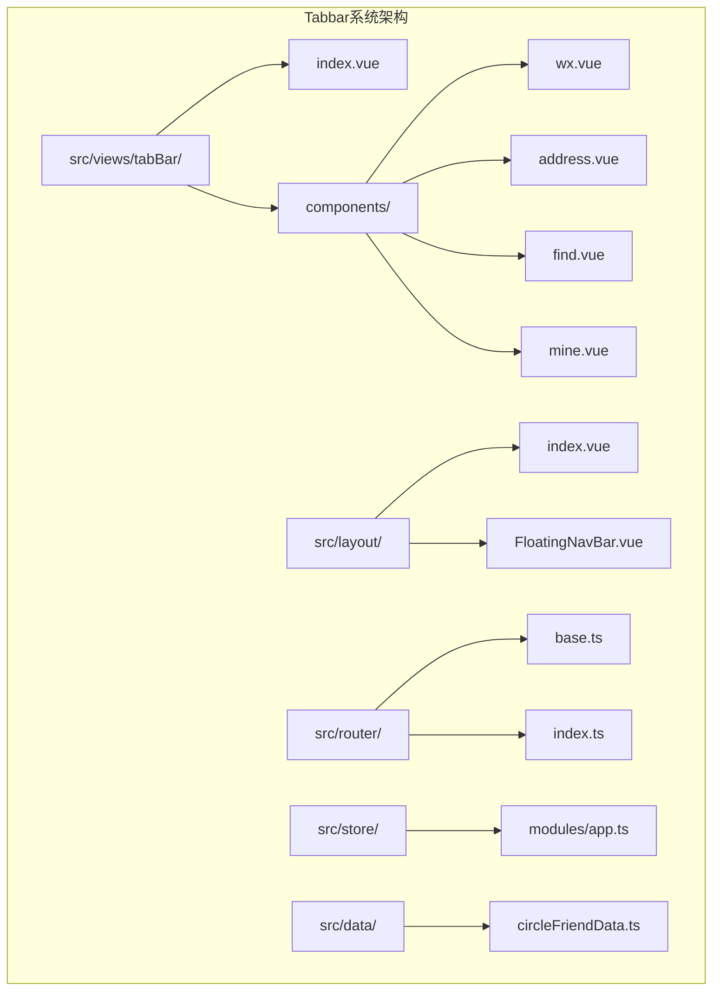
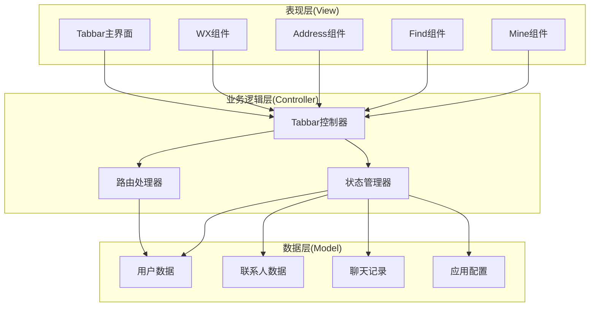
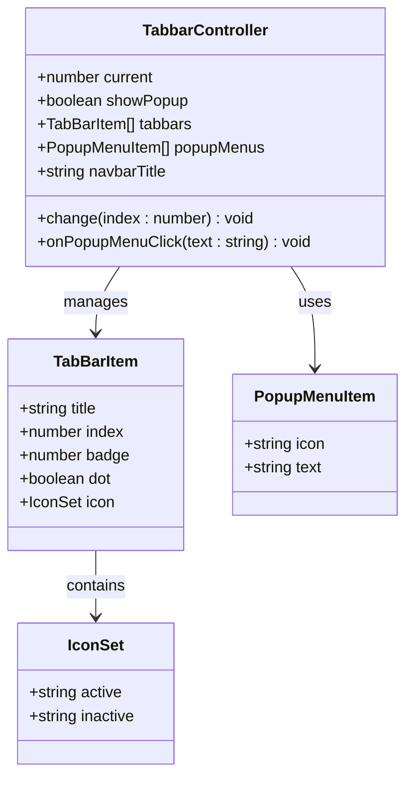
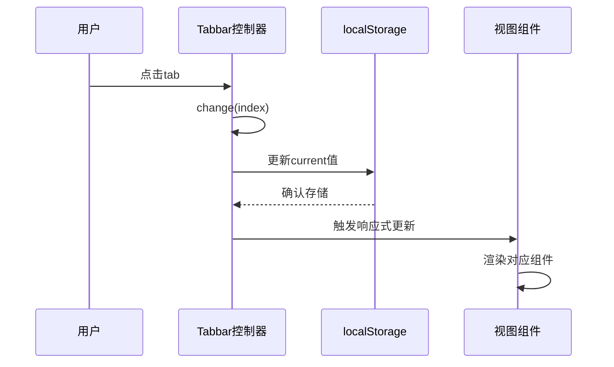
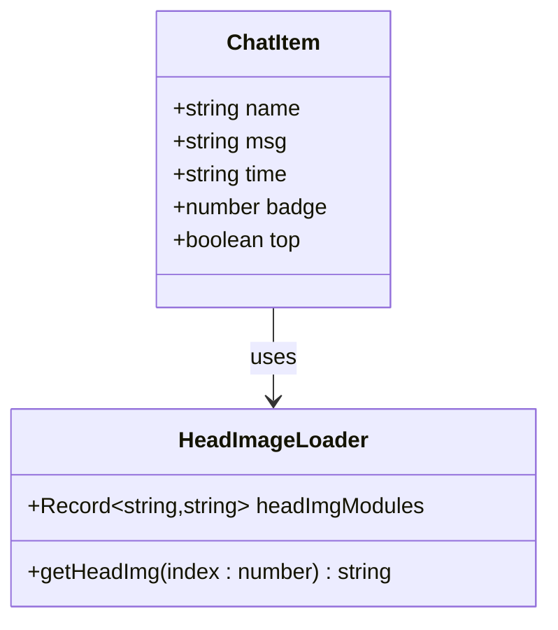
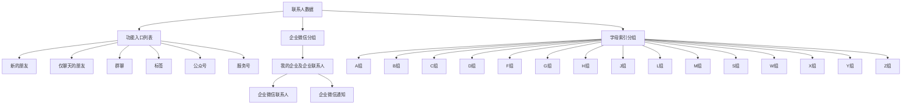
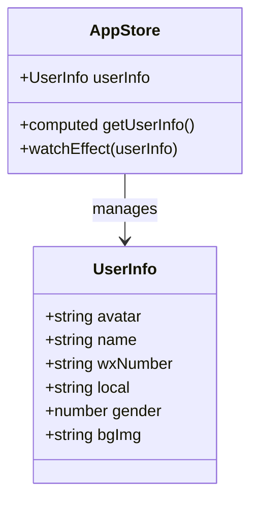

# Tabbar系统文档

<cite>
**本文档引用的文件**
- [src/views/tabBar/index.vue](file://src/views/tabBar/index.vue)
- [src/views/tabBar/components/wx.vue](file://src/views/tabBar/components/wx.vue)
- [src/views/tabBar/components/address.vue](file://src/views/tabBar/components/address.vue)
- [src/views/tabBar/components/find.vue](file://src/views/tabBar/components/find.vue)
- [src/views/tabBar/components/mine.vue](file://src/views/tabBar/components/mine.vue)
- [src/layout/index.vue](file://src/layout/index.vue)
- [src/layout/components/FloatingNavBar.vue](file://src/layout/components/FloatingNavBar.vue)
- [src/router/base.ts](file://src/router/base.ts)
- [src/router/index.ts](file://src/router/index.ts)
- [src/store/modules/app.ts](file://src/store/modules/app.ts)
- [src/data/circleFriendData.ts](file://src/data/circleFriendData.ts)
</cite>

## 目录
1. [简介](#简介)
2. [项目结构](#项目结构)
3. [核心组件](#核心组件)
4. [架构概览](#架构概览)
5. [详细组件分析](#详细组件分析)
6. [依赖关系分析](#依赖关系分析)
7. [性能考虑](#性能考虑)
8. [故障排除指南](#故障排除指南)
9. [结论](#结论)

## 简介

本项目实现了一个仿微信H5的Tabbar系统，提供了完整的移动端底部导航功能。该系统包含四个主要模块：微信聊天、通讯录、发现页面和个人中心，并集成了浮动导航栏、路由管理、状态管理和数据持久化等功能。

## 项目结构

Tabbar系统采用模块化的Vue3架构设计，主要文件组织如下：



**图表来源**
- [src/views/tabBar/index.vue:1-180](file://src/views/tabBar/index.vue#L1-L180)
- [src/layout/index.vue:1-60](file://src/layout/index.vue#L1-L60)

**章节来源**
- [src/views/tabBar/index.vue:1-180](file://src/views/tabBar/index.vue#L1-L180)
- [src/layout/index.vue:1-60](file://src/layout/index.vue#L1-L60)

## 核心组件

### Tabbar主控制器

Tabbar主控制器负责管理整个底部导航系统的状态和交互逻辑。其核心功能包括：

- **状态管理**：使用localStorage持久化当前选中的tab索引
- **动态内容渲染**：根据当前tab动态加载对应的子组件
- **顶部导航栏**：为特定tab显示自定义的顶部导航栏
- **浮动菜单**：提供"+号"弹出菜单功能

### 子组件架构

系统包含四个主要的tab子组件，每个都有独特的功能和数据展示：

1. **微信(WX)**：聊天列表展示，支持徽章显示和头像预加载
2. **通讯录(Address)**：联系人列表，支持字母索引和分组显示
3. **发现(Find)**：功能入口集合，模拟微信发现页面的各种功能
4. **我(Mine)**：用户个人信息展示，集成用户状态管理

**章节来源**
- [src/views/tabBar/index.vue:86-180](file://src/views/tabBar/index.vue#L86-L180)
- [src/views/tabBar/components/wx.vue:1-97](file://src/views/tabBar/components/wx.vue#L1-L97)
- [src/views/tabBar/components/address.vue:1-313](file://src/views/tabBar/components/address.vue#L1-L313)
- [src/views/tabBar/components/find.vue:1-119](file://src/views/tabBar/components/find.vue#L1-L119)
- [src/views/tabBar/components/mine.vue:1-116](file://src/views/tabBar/components/mine.vue#L1-L116)

## 架构概览

Tabbar系统采用分层架构设计，实现了清晰的关注点分离：



**图表来源**
- [src/views/tabBar/index.vue:86-180](file://src/views/tabBar/index.vue#L86-L180)
- [src/layout/index.vue:32-49](file://src/layout/index.vue#L32-L49)

## 详细组件分析

### Tabbar主控制器分析

Tabbar主控制器是整个系统的中枢，负责协调各个子组件的工作。

#### 数据结构设计



**图表来源**
- [src/views/tabBar/index.vue:103-176](file://src/views/tabBar/index.vue#L103-L176)

#### 状态管理机制

Tabbar系统使用localStorage实现状态持久化：



**图表来源**
- [src/views/tabBar/index.vue:122-124](file://src/views/tabBar/index.vue#L122-L124)

**章节来源**
- [src/views/tabBar/index.vue:86-180](file://src/views/tabBar/index.vue#L86-L180)

### WX组件详细分析

WX组件实现了微信聊天列表的核心功能：

#### 聊天列表数据模型



**图表来源**
- [src/views/tabBar/components/wx.vue:64-93](file://src/views/tabBar/components/wx.vue#L64-L93)

#### 性能优化策略

WX组件采用了多种性能优化技术：

1. **预加载机制**：使用`import.meta.glob`预加载所有头像图片
2. **条件渲染**：使用`v-if`按需渲染组件
3. **响应式更新**：利用Vue3的响应式系统优化渲染性能

**章节来源**
- [src/views/tabBar/components/wx.vue:44-97](file://src/views/tabBar/components/wx.vue#L44-L97)

### Address组件详细分析

Address组件实现了通讯录的复杂功能：

#### 联系人数据结构



**图表来源**
- [src/views/tabBar/components/address.vue:93-307](file://src/views/tabBar/components/address.vue#L93-L307)

**章节来源**
- [src/views/tabBar/components/address.vue:73-313](file://src/views/tabBar/components/address.vue#L73-L313)

### Find组件详细分析

Find组件提供了微信发现页面的各种功能入口：

#### 功能入口架构

| 功能分类 | 入口项 | 图标 | 路由 |
|---------|--------|------|------|
| 朋友圈 | 朋友圈 | wx-pyq | /circleFriend |
| 视频号 | 视频号 | wx-sph | - |
| 直播 | 直播 | wx-live | - |
| 扫一扫 | 扫一扫 | wx-scan | - |
| 听一听 | 听一听 | wx-tyt | - |
| 看一看 | 看一看 | wx-kyk | - |
| 搜一搜 | 搜一搜 | wx-sys | - |
| 附近的人 | 附近的人 | wx-fjdr | - |
| 游戏 | 游戏 | wx-wxyx | - |
| 小程序 | 小程序 | wx-wxxcx | - |

**章节来源**
- [src/views/tabBar/components/find.vue:1-119](file://src/views/tabBar/components/find.vue#L1-L119)

### Mine组件详细分析

Mine组件展示了用户个人信息和设置入口：

#### 用户信息数据模型



**图表来源**
- [src/store/modules/app.ts:13-33](file://src/store/modules/app.ts#L13-L33)

**章节来源**
- [src/views/tabBar/components/mine.vue:103-116](file://src/views/tabBar/components/mine.vue#L103-L116)
- [src/store/modules/app.ts:22-72](file://src/store/modules/app.ts#L22-L72)

## 依赖关系分析

Tabbar系统的依赖关系体现了清晰的分层架构：

```mermaid
graph LR
subgraph "外部依赖"
A[Vant UI]
B[Vue Router]
C[Pinia]
D[@vueuse/core]
end
subgraph "内部模块"
E[Tabbar控制器]
F[WX组件]
G[Address组件]
H[Find组件]
I[Mine组件]
J[路由配置]
K[状态管理]
L[数据模型]
end
A --> E
B --> J
C --> K
D --> E
E --> F
E --> G
E --> H
E --> I
J --> E
K --> L
K --> E
```

**图表来源**
- [src/views/tabBar/index.vue:87-92](file://src/views/tabBar/index.vue#L87-L92)
- [src/router/base.ts:48-56](file://src/router/base.ts#L48-L56)

**章节来源**
- [src/router/index.ts:1-33](file://src/router/index.ts#L1-L33)
- [src/store/modules/app.ts:1-72](file://src/store/modules/app.ts#L1-L72)

## 性能考虑

### 图片加载优化

系统采用了多种图片加载优化策略：

1. **预加载机制**：使用`import.meta.glob`在构建时预加载所有图片资源
2. **懒加载策略**：对于大量图片采用按需加载方式
3. **缓存机制**：利用浏览器缓存减少重复加载

### 内存管理

- **组件卸载**：合理处理组件的创建和销毁
- **事件监听**：及时清理事件监听器避免内存泄漏
- **定时器管理**：使用`onBeforeUnmount`清理定时器

### 渲染性能

- **虚拟滚动**：对于大量数据采用虚拟滚动技术
- **防抖节流**：对高频操作使用防抖节流优化
- **响应式优化**：合理使用`computed`和`watch`避免不必要的重渲染

## 故障排除指南

### 常见问题及解决方案

#### Tabbar状态丢失问题

**问题描述**：切换页面后Tabbar状态重置

**解决方案**：
1. 检查localStorage是否正常工作
2. 确认`useLocalStorage`的key值一致性
3. 验证组件的响应式更新机制

#### 图片加载失败问题

**问题描述**：头像或图标无法正常显示

**解决方案**：
1. 检查图片路径是否正确
2. 确认图片资源是否正确打包
3. 验证`import.meta.glob`的配置

#### 路由跳转问题

**问题描述**：点击tabbar无法正确跳转

**解决方案**：
1. 检查路由配置是否正确
2. 确认组件导入路径
3. 验证路由守卫逻辑

**章节来源**
- [src/views/tabBar/index.vue:122-124](file://src/views/tabBar/index.vue#L122-L124)
- [src/router/base.ts:48-56](file://src/router/base.ts#L48-L56)

## 结论

本Tabbar系统实现了完整的移动端导航功能，具有以下特点：

1. **模块化设计**：清晰的组件分离和职责划分
2. **性能优化**：采用多种技术手段优化加载和渲染性能
3. **用户体验**：提供流畅的交互体验和良好的视觉效果
4. **可扩展性**：易于添加新功能和修改现有功能

系统成功复刻了微信H5的核心导航体验，为移动端应用开发提供了优秀的参考实现。通过合理的架构设计和性能优化，确保了在移动设备上的良好运行表现。