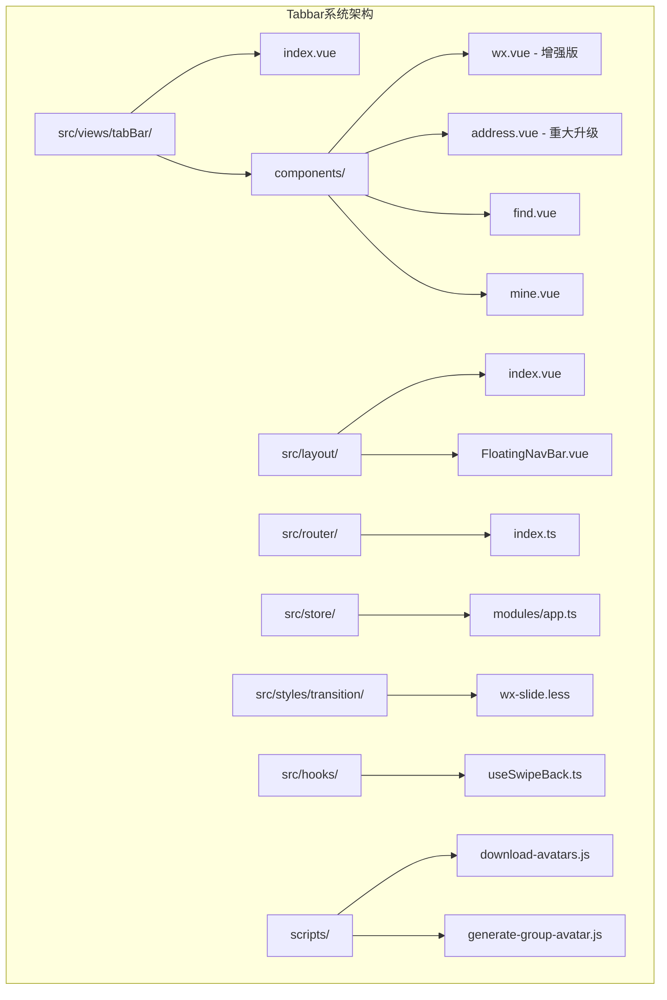
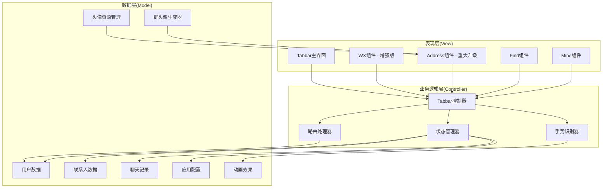
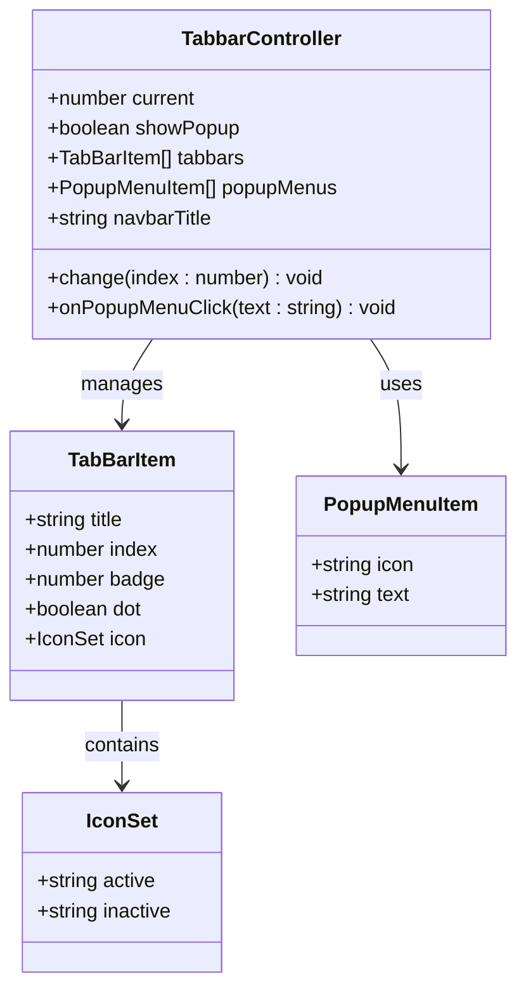
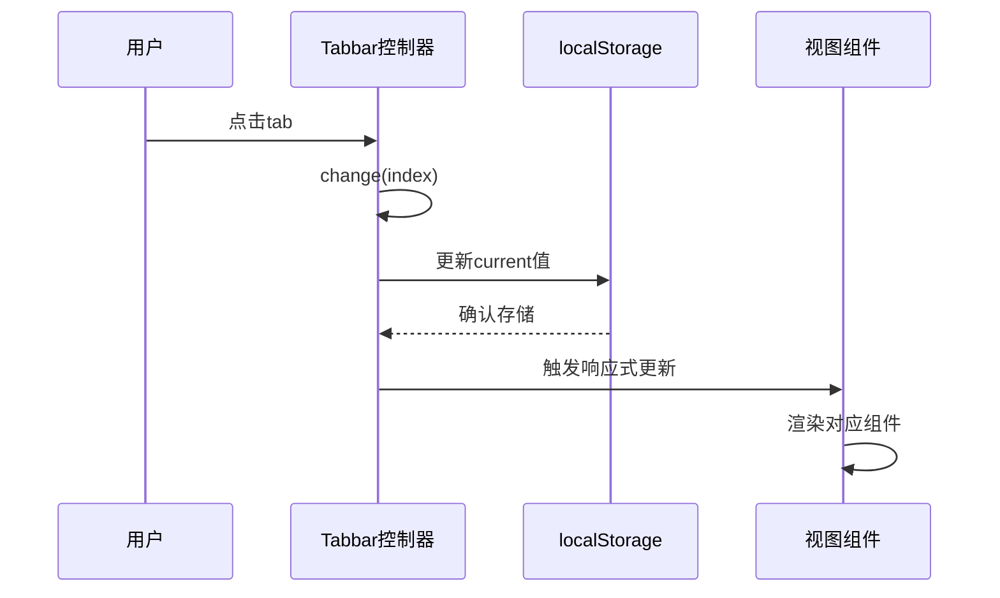
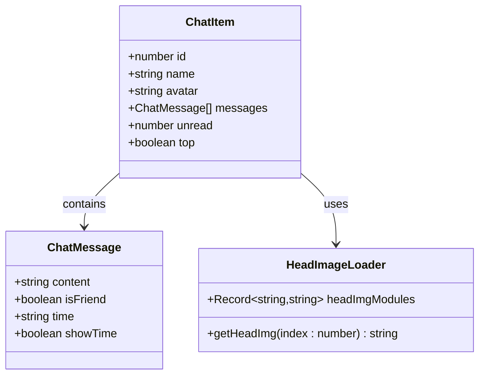
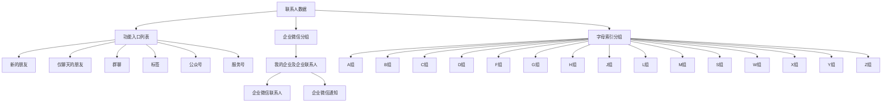
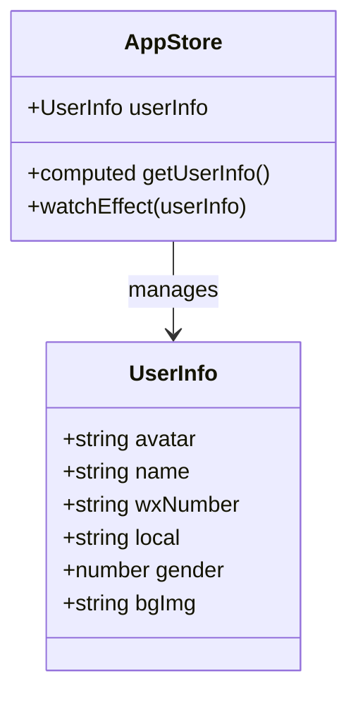
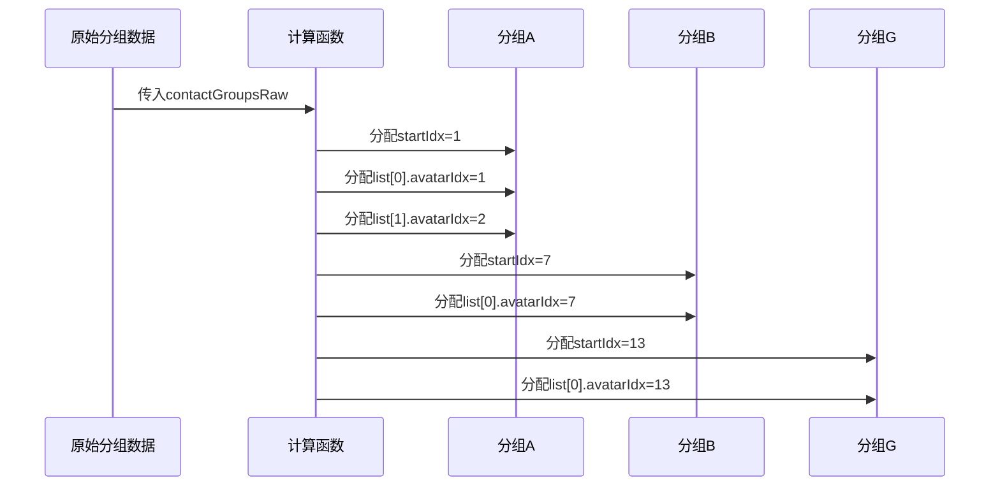

# Tabbar系统

<cite>
**本文档引用的文件**
- [src/views/tabBar/index.vue](file://src/views/tabBar/index.vue)
- [src/views/tabBar/components/wx.vue](file://src/views/tabBar/components/wx.vue)
- [src/views/tabBar/components/address.vue](file://src/views/tabBar/components/address.vue)
- [src/views/tabBar/components/find.vue](file://src/views/tabBar/components/find.vue)
- [src/views/tabBar/components/mine.vue](file://src/views/tabBar/components/mine.vue)
- [src/layout/index.vue](file://src/layout/index.vue)
- [src/layout/components/FloatingNavBar.vue](file://src/layout/components/FloatingNavBar.vue)
- [src/router/index.ts](file://src/router/index.ts)
- [src/store/modules/app.ts](file://src/store/modules/app.ts)
- [src/styles/transition/wx-slide.less](file://src/styles/transition/wx-slide.less)
- [src/hooks/useSwipeBack.ts](file://src/hooks/useSwipeBack.ts)
- [scripts/download-avatars.js](file://scripts/download-avatars.js)
- [scripts/generate-group-avatar.js](file://scripts/generate-group-avatar.js)
</cite>

## 更新摘要
**所做更改**
- 地址簿组件重大改进：新增动态好友数量管理系统（模态对话框）
- 头像系统完全迁移：getAddressImg重命名为getAvatarImg，支持自动头像索引
- 联系人分组系统增强：实现自动头像索引分配（avatarIdx），提升头像管理效率
- 字母索引侧边栏功能保持：维持原有的便捷导航体验

## 目录
1. [简介](#简介)
2. [项目结构](#项目结构)
3. [核心组件](#核心组件)
4. [架构概览](#架构概览)
5. [详细组件分析](#详细组件分析)
6. [新增功能特性](#新增功能特性)
7. [依赖关系分析](#依赖关系分析)
8. [性能考虑](#性能考虑)
9. [故障排除指南](#故障排除指南)
10. [结论](#结论)

## 简介

本项目实现了一个高度仿真的微信H5 Tabbar系统，提供了完整的移动端底部导航功能。该系统包含四个主要模块：微信聊天、通讯录、发现页面和个人中心，并集成了浮动导航栏、路由管理、状态管理和数据持久化等功能。经过大幅增强后，系统现在支持微信风格的长按菜单、滑动操作、震动反馈和精美的视觉动画效果，显著提升了整体用户体验。

**更新** 地址簿组件经过重大升级，实现了更完善的联系人管理功能，包括动态好友数量管理、头像系统完全迁移和增强的联系人分组系统。

## 项目结构

Tabbar系统采用模块化的Vue3架构设计，主要文件组织如下：



**图表来源**
- [src/views/tabBar/index.vue:1-180](file://src/views/tabBar/index.vue#L1-L180)
- [src/layout/index.vue:1-60](file://src/layout/index.vue#L1-L60)
- [scripts/download-avatars.js:1-119](file://scripts/download-avatars.js#L1-L119)
- [scripts/generate-group-avatar.js:1-193](file://scripts/generate-group-avatar.js#L1-L193)

**章节来源**
- [src/views/tabBar/index.vue:1-180](file://src/views/tabBar/index.vue#L1-L180)
- [src/layout/index.vue:1-60](file://src/layout/index.vue#L1-L60)

## 核心组件

### Tabbar主控制器

Tabbar主控制器负责管理整个底部导航系统的状态和交互逻辑。其核心功能包括：

- **状态管理**：使用localStorage持久化当前选中的tab索引
- **动态内容渲染**：根据当前tab动态加载对应的子组件
- **顶部导航栏**：为特定tab显示自定义的顶部导航栏
- **浮动菜单**：提供"+号"弹出菜单功能

### 子组件架构

系统包含四个主要的tab子组件，每个都有独特的功能和数据展示：

1. **微信(WX)**：聊天列表展示，支持徽章显示、头像预加载、长按菜单、滑动操作和震动反馈
2. **通讯录(Address)**：联系人列表，支持字母索引、分组显示和动态好友数量管理
3. **发现(Find)**：功能入口集合，模拟微信发现页面的各种功能
4. **我(Mine)**：用户个人信息展示，集成用户状态管理

**章节来源**
- [src/views/tabBar/index.vue:86-180](file://src/views/tabBar/index.vue#L86-L180)
- [src/views/tabBar/components/wx.vue:1-314](file://src/views/tabBar/components/wx.vue#L1-L314)
- [src/views/tabBar/components/address.vue:1-371](file://src/views/tabBar/components/address.vue#L1-L371)
- [src/views/tabBar/components/find.vue:1-119](file://src/views/tabBar/components/find.vue#L1-L119)
- [src/views/tabBar/components/mine.vue:1-116](file://src/views/tabBar/components/mine.vue#L1-L116)

## 架构概览

Tabbar系统采用分层架构设计，实现了清晰的关注点分离：



**图表来源**
- [src/views/tabBar/index.vue:86-180](file://src/views/tabBar/index.vue#L86-L180)
- [src/layout/index.vue:32-49](file://src/layout/index.vue#L32-L49)

## 详细组件分析

### Tabbar主控制器分析

Tabbar主控制器是整个系统的中枢，负责协调各个子组件的工作。

#### 数据结构设计



**图表来源**
- [src/views/tabBar/index.vue:103-176](file://src/views/tabBar/index.vue#L103-L176)

#### 状态管理机制

Tabbar系统使用localStorage实现状态持久化：



**图表来源**
- [src/views/tabBar/index.vue:122-124](file://src/views/tabBar/index.vue#L122-L124)

**章节来源**
- [src/views/tabBar/index.vue:86-180](file://src/views/tabBar/index.vue#L86-L180)

### WX组件详细分析

WX组件实现了微信聊天列表的核心功能，经过大幅增强后具备了丰富的交互特性：

#### 聊天列表数据模型



**图表来源**
- [src/views/tabBar/components/wx.vue:64-93](file://src/views/tabBar/components/wx.vue#L64-L93)

#### 增强的交互功能

WX组件现在支持多种高级交互功能：

1. **长按菜单系统**：支持600ms长按触发，自动检测屏幕边缘位置
2. **滑动操作**：支持左右滑动进行标记未读、删除等操作
3. **震动反馈**：长按时触发50ms震动反馈
4. **未读消息设置**：支持弹窗输入未读数量
5. **置顶聊天功能**：支持聊天置顶和取消置顶

#### 性能优化策略

WX组件采用了多种性能优化技术：

1. **预加载机制**：使用`import.meta.glob`预加载所有头像图片
2. **条件渲染**：使用`v-if`按需渲染组件
3. **响应式更新**：利用Vue3的响应式系统优化渲染性能
4. **手势优化**：使用防抖和节流技术优化触摸事件处理

**章节来源**
- [src/views/tabBar/components/wx.vue:44-314](file://src/views/tabBar/components/wx.vue#L44-L314)

### Address组件详细分析

**更新** Address组件经过重大升级，实现了全新的功能架构：

#### 联系人数据结构



**图表来源**
- [src/views/tabBar/components/address.vue:93-307](file://src/views/tabBar/components/address.vue#L93-L307)

#### 动态好友数量管理系统

**新增功能** Address组件现在支持动态好友数量管理：

- **模态对话框**：点击"好友数量"显示可编辑的模态对话框
- **实时更新**：支持修改好友显示数量并实时生效
- **默认值恢复**：提供恢复默认数量的功能
- **输入验证**：确保输入的数量为有效数字

#### 增强的头像系统

**重大改进** 头像系统完全迁移和优化：

- **函数重命名**：getAddressImg重命名为getAvatarImg，统一命名规范
- **自动头像索引**：实现自动头像索引分配（avatarIdx）
- **预加载机制**：使用`import.meta.glob`预加载所有头像图片
- **索引计算**：通过avatarIdx确保头像的连续性和唯一性

#### 自动头像索引系统

**新增功能** 实现了智能的头像索引管理：

```mermaid
flowchart LR
A[联系人分组原始数据] --> B[计算函数]
B --> C[avatarIdx = 1]
C --> D[第一个分组: startIdx=1, list[0].avatarIdx=1]
D --> E[第二个分组: startIdx=7, list[0].avatarIdx=7]
E --> F[第三个分组: startIdx=13, list[0].avatarIdx=13]
F --> G[依此类推...]
```

**图表来源**
- [src/views/tabBar/components/address.vue:320-332](file://src/views/tabBar/components/address.vue#L320-L332)

#### 字母索引侧边栏功能

**保持不变** 维持原有的便捷导航体验：

- **完整字母表**：支持A-Z的所有字母索引
- **特殊字符**：包含"↑"、"☆"、"#"等特殊索引
- **固定定位**：右侧固定位置，支持上下滑动导航
- **视觉设计**：简洁的11px字体和灰色配色

**章节来源**
- [src/views/tabBar/components/address.vue:64-108](file://src/views/tabBar/components/address.vue#L64-L108)
- [src/views/tabBar/components/address.vue:140-149](file://src/views/tabBar/components/address.vue#L140-L149)
- [src/views/tabBar/components/address.vue:320-332](file://src/views/tabBar/components/address.vue#L320-L332)
- [src/views/tabBar/components/address.vue:334-365](file://src/views/tabBar/components/address.vue#L334-L365)

### Find组件详细分析

Find组件提供了微信发现页面的各种功能入口：

#### 功能入口架构

| 功能分类 | 入口项 | 图标 | 路由 |
|---------|--------|------|------|
| 朋友圈 | 朋友圈 | wx-pyq | /circleFriend |
| 视频号 | 视频号 | wx-sph | - |
| 直播 | 直播 | wx-live | - |
| 扫一扫 | 扫一扫 | wx-scan | - |
| 听一听 | 听一听 | wx-tyt | - |
| 看一看 | 看一看 | wx-kyk | - |
| 搜一搜 | 搜一搜 | wx-sys | - |
| 附近的人 | 附近的人 | wx-fjdr | - |
| 游戏 | 游戏 | wx-wxyx | - |
| 小程序 | 小程序 | wx-wxxcx | - |

**章节来源**
- [src/views/tabBar/components/find.vue:1-119](file://src/views/tabBar/components/find.vue#L1-L119)

### Mine组件详细分析

Mine组件展示了用户个人信息和设置入口：

#### 用户信息数据模型



**图表来源**
- [src/store/modules/app.ts:13-33](file://src/store/modules/app.ts#L13-L33)

**章节来源**
- [src/views/tabBar/components/mine.vue:103-116](file://src/views/tabBar/components/mine.vue#L103-L116)
- [src/store/modules/app.ts:22-72](file://src/store/modules/app.ts#L22-L72)

## 新增功能特性

### 动态好友数量管理系统

**新增功能** Address组件实现了完整的动态好友数量管理：

#### 模态对话框设计

- **触发方式**：点击底部"好友数量"文本区域触发
- **界面设计**：使用VanDialog组件实现微信风格的模态对话框
- **输入控件**：支持数字输入和实时验证
- **操作按钮**：提供确认和取消操作

#### 数量管理功能

- **实时更新**：修改后的数量立即生效并显示
- **默认值恢复**：点击"恢复默认"按钮回到初始值
- **输入验证**：确保输入的数值大于0
- **状态管理**：使用Vue响应式系统管理数量状态

**章节来源**
- [src/views/tabBar/components/address.vue:64-108](file://src/views/tabBar/components/address.vue#L64-L108)
- [src/views/tabBar/components/address.vue:120-138](file://src/views/tabBar/components/address.vue#L120-L138)

### 头像系统完全迁移

**重大改进** 头像系统实现了完全的迁移和优化：

#### 函数重命名

- **getAddressImg** → **getAvatarImg**：统一命名规范，符合组件功能
- **兼容性**：确保所有调用点都更新为新的函数名
- **类型安全**：保持原有的TypeScript类型定义

#### 自动头像索引管理

- **索引分配**：通过avatarIdx实现连续的头像索引
- **分组计算**：每个分组的起始索引自动计算
- **列表映射**：为每个联系人分配唯一的头像索引

#### 预加载优化

- **批量加载**：使用`import.meta.glob`在构建时预加载所有头像
- **性能优化**：减少运行时的图片加载开销
- **缓存机制**：利用浏览器缓存提高加载速度

**章节来源**
- [src/views/tabBar/components/address.vue:140-149](file://src/views/tabBar/components/address.vue#L140-L149)
- [src/views/tabBar/components/address.vue:320-332](file://src/views/tabBar/components/address.vue#L320-L332)

### 联系人分组系统增强

**新增功能** 实现了智能的联系人分组管理：

#### 自动索引计算



**图表来源**
- [src/views/tabBar/components/address.vue:320-332](file://src/views/tabBar/components/address.vue#L320-L332)

#### 分组数据结构

- **起始索引**：每个分组包含startIdx属性
- **结束索引**：包含_endIdx属性用于范围计算
- **头像索引**：为每个联系人分配唯一的avatarIdx
- **自动计算**：索引值在计算时自动修正和分配

**章节来源**
- [src/views/tabBar/components/address.vue:172-332](file://src/views/tabBar/components/address.vue#L172-L332)

### 字母索引侧边栏功能保持

**保持不变** 维持原有的导航体验：

#### 完整索引支持

- **字母索引**：支持A-Z的所有英文字母
- **特殊字符**：包含"↑"、"☆"、"#"等特殊索引符号
- **固定定位**：右侧固定位置，不影响主要内容区域
- **视觉设计**：11px字体大小，#808080灰色配色

#### 导航体验

- **便捷访问**：用户可以快速跳转到指定字母分组
- **响应式设计**：适配不同屏幕尺寸
- **视觉反馈**：悬停和点击时的视觉反馈

**章节来源**
- [src/views/tabBar/components/address.vue:74-79](file://src/views/tabBar/components/address.vue#L74-L79)
- [src/views/tabBar/components/address.vue:334-365](file://src/views/tabBar/components/address.vue#L334-L365)

## 依赖关系分析

Tabbar系统的依赖关系体现了清晰的分层架构：

```mermaid
graph LR
subgraph "外部依赖"
A[Vant UI]
B[Vue Router]
C[Pinia]
D[@vueuse/core]
E[VueUse]
F[Less]
G[Sharp图像处理库]
end
subgraph "内部模块"
H[Tabbar控制器]
I[WX组件 - 增强版]
J[Address组件 - 重大升级]
K[Find组件]
L[Mine组件]
M[路由配置]
N[状态管理]
O[数据模型]
P[动画样式]
Q[手势钩子]
R[头像资源管理]
S[群头像生成器]
T[下载脚本]
U[生成脚本]
end
A --> H
B --> M
C --> N
D --> H
E --> Q
F --> O
G --> S
H --> I
H --> J
H --> K
H --> L
M --> H
N --> O
N --> H
O --> J
P --> I
Q --> I
R --> J
S --> J
T --> R
U --> S
```

**图表来源**
- [src/views/tabBar/index.vue:87-92](file://src/views/tabBar/index.vue#L87-L92)
- [src/router/index.ts:1-33](file://src/router/index.ts#L1-L33)
- [scripts/download-avatars.js:1-119](file://scripts/download-avatars.js#L1-L119)
- [scripts/generate-group-avatar.js:1-193](file://scripts/generate-group-avatar.js#L1-L193)

**章节来源**
- [src/router/index.ts:1-33](file://src/router/index.ts#L1-L33)
- [src/store/modules/app.ts:1-377](file://src/store/modules/app.ts#L1-L377)

## 性能考虑

### 图片加载优化

系统采用了多种图片加载优化策略：

1. **预加载机制**：使用`import.meta.glob`在构建时预加载所有图片资源
2. **懒加载策略**：对于大量图片采用按需加载方式
3. **缓存机制**：利用浏览器缓存减少重复加载
4. **头像索引优化**：通过avatarIdx避免重复的头像查找

### 内存管理

- **组件卸载**：合理处理组件的创建和销毁
- **事件监听**：及时清理事件监听器避免内存泄漏
- **定时器管理**：使用`onBeforeUnmount`清理定时器
- **长按定时器**：自动清理长按检测定时器
- **模态对话框**：及时清理对话框相关的DOM节点

### 渲染性能

- **虚拟滚动**：对于大量数据采用虚拟滚动技术
- **防抖节流**：对高频操作使用防抖节流优化
- **响应式优化**：合理使用`computed`和`watch`避免不必要的重渲染
- **动画优化**：使用CSS3硬件加速优化动画性能
- **头像缓存**：通过avatarImgModules缓存头像资源

### 新增性能优化

- **手势优化**：使用requestAnimationFrame优化手势响应
- **菜单定位**：使用计算属性优化菜单位置计算
- **滑动操作**：优化van-swipe-cell的性能表现
- **索引计算**：使用一次性计算避免重复的索引分配

## 故障排除指南

### 常见问题及解决方案

#### Tabbar状态丢失问题

**问题描述**：切换页面后Tabbar状态重置

**解决方案**：
1. 检查localStorage是否正常工作
2. 确认`useLocalStorage`的key值一致性
3. 验证组件的响应式更新机制

#### 图片加载失败问题

**问题描述**：头像或图标无法正常显示

**解决方案**：
1. 检查图片路径是否正确
2. 确认图片资源是否正确打包
3. 验证`import.meta.glob`的配置
4. 检查头像文件是否存在且格式正确

#### 路由跳转问题

**问题描述**：点击tabbar无法正确跳转

**解决方案**：
1. 检查路由配置是否正确
2. 确认组件导入路径
3. 验证路由守卫逻辑

#### 长按菜单异常问题

**问题描述**：长按菜单无法正常显示或定位错误

**解决方案**：
1. 检查触摸事件绑定是否正确
2. 验证长按定时器设置
3. 确认菜单边缘检测逻辑
4. 检查震动反馈权限

#### 动画效果异常问题

**问题描述**：微信风格动画效果不流畅

**解决方案**：
1. 检查CSS动画类名是否正确
2. 验证Less编译是否正常
3. 确认硬件加速支持
4. 检查浏览器兼容性

#### 动态数量管理问题

**问题描述**：好友数量修改后不生效

**解决方案**：
1. 检查模态对话框的v-model绑定
2. 验证updateCount函数的逻辑
3. 确认friendCount的响应式更新
4. 检查输入验证逻辑

#### 头像索引错误问题

**问题描述**：头像显示错误或重复

**解决方案**：
1. 检查avatarIdx的计算逻辑
2. 验证getAvatarImg函数的实现
3. 确认头像文件命名格式
4. 检查头像索引的连续性

**章节来源**
- [src/views/tabBar/index.vue:122-124](file://src/views/tabBar/index.vue#L122-L124)
- [src/views/tabBar/components/wx.vue:137-172](file://src/views/tabBar/components/wx.vue#L137-L172)
- [src/views/tabBar/components/address.vue:120-138](file://src/views/tabBar/components/address.vue#L120-L138)
- [src/views/tabBar/components/address.vue:140-149](file://src/views/tabBar/components/address.vue#L140-L149)

## 结论

本Tabbar系统经过大幅增强后，实现了更加完善的微信H5导航体验，具有以下显著特点：

1. **丰富的交互功能**：新增长按菜单、滑动操作、震动反馈等接近原生微信的交互体验
2. **精美的视觉效果**：实现微信风格的路由动画、菜单定位和视觉反馈
3. **模块化设计**：清晰的组件分离和职责划分，便于维护和扩展
4. **性能优化**：采用多种技术手段优化加载和渲染性能
5. **用户体验**：提供流畅的交互体验和良好的视觉效果
6. **可扩展性**：易于添加新功能和修改现有功能

**更新** 特别是在地址簿组件方面，实现了重大突破：

- **动态管理能力**：新增好友数量的动态管理功能，提供更好的用户体验
- **系统化改进**：头像系统完全迁移，实现统一的命名规范和索引管理
- **智能化分组**：联系人分组系统支持自动头像索引分配，提升管理效率
- **保持传统优势**：字母索引侧边栏功能保持不变，维持便捷的导航体验

系统成功复刻了微信H5的核心导航体验，通过新增的微信风格长按菜单、滑动操作、震动反馈和精美动画效果，以及地址簿组件的重大改进，显著提升了整体用户体验。经过合理的架构设计和性能优化，确保了在移动设备上的良好运行表现和流畅的交互体验。