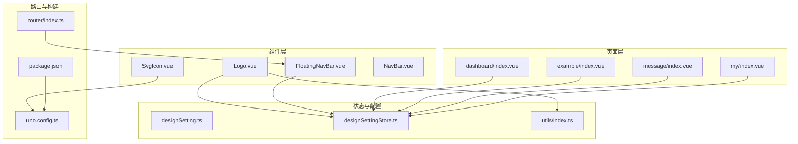
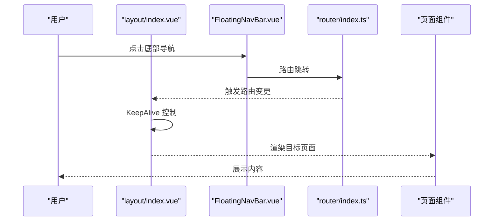
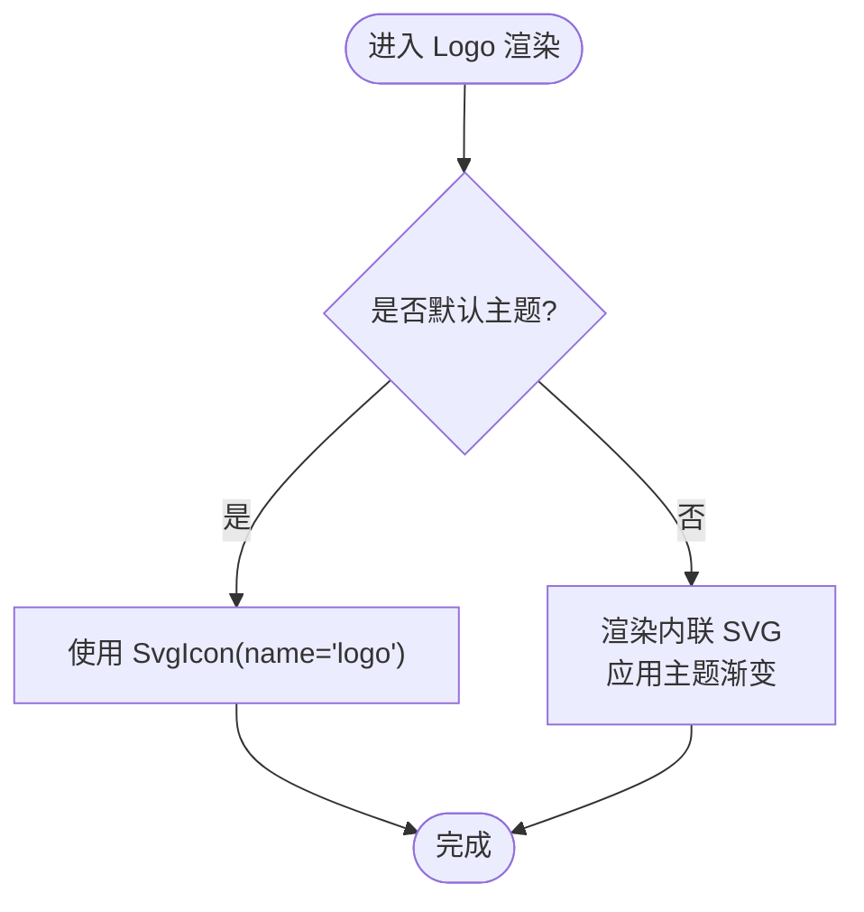
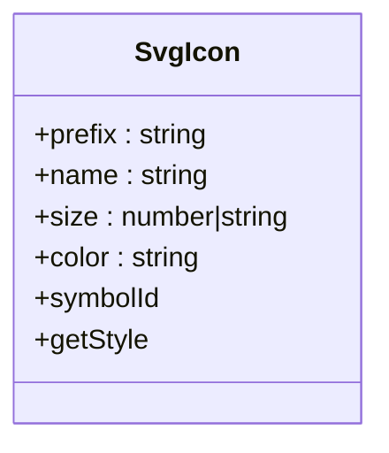
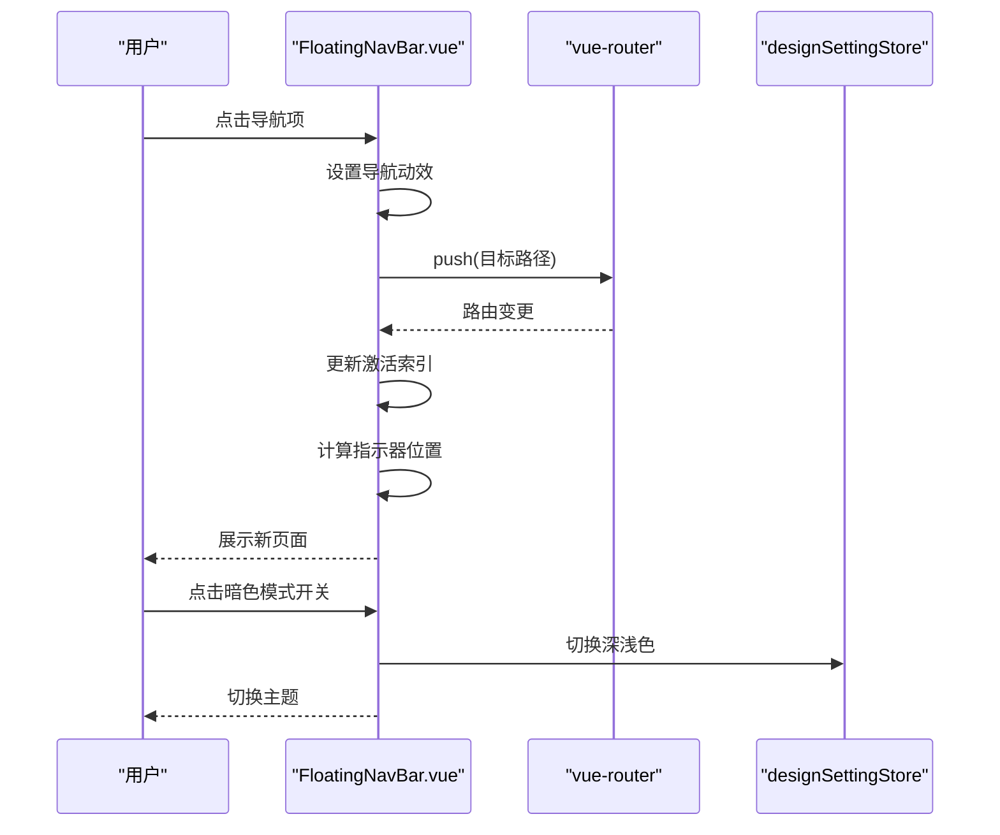
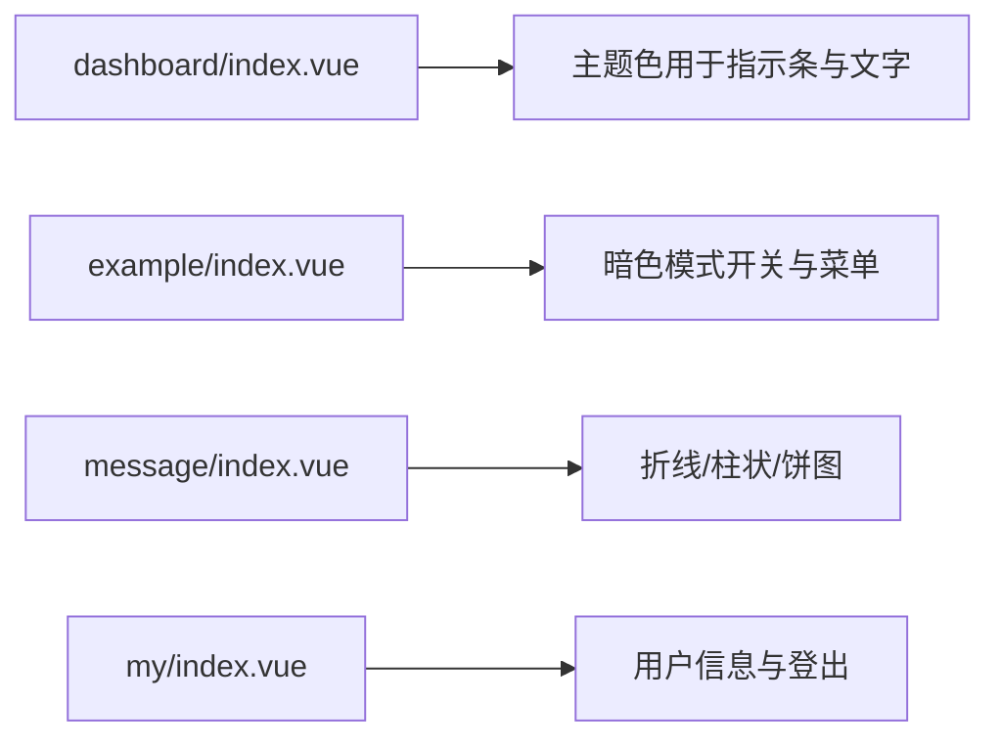
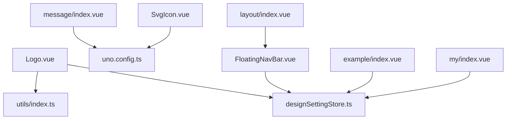

# UI组件系统

<cite>
**本文引用的文件**
- [Logo.vue](file://src/components/Logo.vue)
- [SvgIcon.vue](file://src/components/SvgIcon.vue)
- [FloatingNavBar.vue](file://src/layout/components/FloatingNavBar.vue)
- [layout/index.vue](file://src/layout/index.vue)
- [NavBar.vue](file://src/views/my/components/NavBar.vue)
- [designSetting.ts](file://src/settings/designSetting.ts)
- [designSettingStore.ts](file://src/store/modules/designSetting.ts)
- [utils/index.ts](file://src/utils/index.ts)
- [dashboard/index.vue](file://src/views/dashboard/index.vue)
- [example/index.vue](file://src/views/example/index.vue)
- [message/index.vue](file://src/views/message/index.vue)
- [my/index.vue](file://src/views/my/index.vue)
- [router/index.ts](file://src/router/index.ts)
- [package.json](file://package.json)
- [uno.config.ts](file://uno.config.ts)
</cite>

## 目录
1. [简介](#简介)
2. [项目结构](#项目结构)
3. [核心组件](#核心组件)
4. [架构总览](#架构总览)
5. [组件详解](#组件详解)
6. [依赖关系分析](#依赖关系分析)
7. [性能考量](#性能考量)
8. [故障排查指南](#故障排查指南)
9. [结论](#结论)
10. [附录](#附录)

## 简介
本文件系统性梳理 Vue3 微信 H5 移动端项目的 UI 组件体系，覆盖基础组件（Logo、SvgIcon）、布局系统（顶部/底部/浮动导航）、页面组件（仪表板、示例、消息、个人中心）以及图标系统（SVG 与 Iconify）。文档提供组件 API、使用示例、样式定制与响应式适配策略，并给出扩展与自定义的最佳实践。

## 项目结构
项目采用按功能域分层的组织方式：
- components：基础可复用 UI 组件（Logo、SvgIcon）
- layout：应用壳层与浮动导航
- views：页面级组件（dashboard、example、message、my 及其子页面）
- store：状态管理（Pinia），含设计主题与路由状态
- settings：全局设计配置（主题色、动画等）
- utils：工具函数（颜色处理、深拷贝等）
- router：路由注册与守卫
- uno.config.ts：UnoCSS 配置（含图标预设与 safelist）

**图表来源**
- [Logo.vue:1-52](file://src/components/Logo.vue#L1-L52)
- [SvgIcon.vue:1-40](file://src/components/SvgIcon.vue#L1-L40)
- [FloatingNavBar.vue:1-549](file://src/layout/components/FloatingNavBar.vue#L1-L549)
- [NavBar.vue:1-24](file://src/views/my/components/NavBar.vue#L1-L24)
- [designSetting.ts:1-52](file://src/settings/designSetting.ts#L1-L52)
- [designSettingStore.ts:1-52](file://src/store/modules/designSetting.ts#L1-L52)
- [utils/index.ts:1-100](file://src/utils/index.ts#L1-L100)
- [router/index.ts:1-33](file://src/router/index.ts#L1-L33)
- [package.json:1-118](file://package.json#L1-L118)
- [uno.config.ts:1-84](file://uno.config.ts#L1-L84)

**章节来源**
- [router/index.ts:1-33](file://src/router/index.ts#L1-L33)
- [package.json:1-118](file://package.json#L1-L118)
- [uno.config.ts:1-84](file://uno.config.ts#L1-L84)

## 核心组件
- Logo 组件：根据当前主题动态渲染 SVG 或使用内置图标库图标，支持主题色渐变填充。
- SvgIcon 组件：基于 Symbol 的 SVG 复用组件，支持前缀、名称、尺寸与颜色配置。
- FloatingNavBar 浮动导航：底部悬浮式导航，支持主题切换、指示器动画、响应式网格布局。
- NavBar 页面导航：基于 Vant 导航栏，自动读取路由 meta.title，支持左右插槽。
- 设计配置与状态：统一的主题色、深浅色模式、页面动画配置；通过 Pinia Store 持久化。

**章节来源**
- [Logo.vue:1-52](file://src/components/Logo.vue#L1-L52)
- [SvgIcon.vue:1-40](file://src/components/SvgIcon.vue#L1-L40)
- [FloatingNavBar.vue:1-549](file://src/layout/components/FloatingNavBar.vue#L1-L549)
- [NavBar.vue:1-24](file://src/views/my/components/NavBar.vue#L1-L24)
- [designSetting.ts:1-52](file://src/settings/designSetting.ts#L1-L52)
- [designSettingStore.ts:1-52](file://src/store/modules/designSetting.ts#L1-L52)

## 架构总览
应用采用“壳层 + 页面 + 组件”的三层结构：
- 壳层负责路由渲染、缓存控制与底部浮动导航
- 页面组件聚焦业务逻辑与数据展示
- 基础组件与布局组件提供一致的交互与视觉体验

**图表来源**
- [layout/index.vue:1-60](file://src/layout/index.vue#L1-L60)
- [FloatingNavBar.vue:196-220](file://src/layout/components/FloatingNavBar.vue#L196-L220)
- [router/index.ts:19-30](file://src/router/index.ts#L19-L30)

## 组件详解

### Logo 组件
- 功能要点
  - 根据当前主题选择图标源：若为默认主题则使用 SvgIcon 渲染内置图标；否则使用内联 SVG，通过线性渐变填充主题色。
  - 主题色通过设计 Store 获取，颜色透明度通过工具函数转换为 RGBA。
- 关键实现路径
  - 主题判断与图标选择：[Logo.vue:3-40](file://src/components/Logo.vue#L3-L40)
  - 渐变色生成与填充：[Logo.vue:6-32](file://src/components/Logo.vue#L6-L32)
  - 主题色工具函数：[utils/index.ts:84-99](file://src/utils/index.ts#L84-L99)
  - 设计 Store 访问：[Logo.vue:45-50](file://src/components/Logo.vue#L45-L50)

**图表来源**
- [Logo.vue:3-40](file://src/components/Logo.vue#L3-L40)
- [utils/index.ts:84-99](file://src/utils/index.ts#L84-L99)

**章节来源**
- [Logo.vue:1-52](file://src/components/Logo.vue#L1-L52)
- [utils/index.ts:84-99](file://src/utils/index.ts#L84-L99)

### SvgIcon 组件
- 功能要点
  - 基于 SVG Symbol 的复用渲染，支持自定义前缀、名称、尺寸与颜色。
  - 尺寸自动去除单位并转为像素值，保证一致的渲染效果。
- 关键实现路径
  - 组件选项与默认值：[SvgIcon.vue:10-24](file://src/components/SvgIcon.vue#L10-L24)
  - Symbol ID 与样式计算：[SvgIcon.vue:26-36](file://src/components/SvgIcon.vue#L26-L36)
  - UnoCSS 图标预设与运行时类名：[uno.config.ts:28-34](file://uno.config.ts#L28-L34)

**图表来源**
- [SvgIcon.vue:10-36](file://src/components/SvgIcon.vue#L10-L36)
- [uno.config.ts:28-34](file://uno.config.ts#L28-L34)

**章节来源**
- [SvgIcon.vue:1-40](file://src/components/SvgIcon.vue#L1-L40)
- [uno.config.ts:28-34](file://uno.config.ts#L28-L34)

### FloatingNavBar 浮动导航
- 功能要点
  - 支持多菜单项与暗色模式切换按钮，自动高亮当前激活项。
  - 指示器跟随导航项移动，支持点击动效与主题色变量。
  - 响应式网格布局，根据菜单数量调整最大宽度。
- 关键实现路径
  - 导航项与图标绑定：[FloatingNavBar.vue:28-57](file://src/layout/components/FloatingNavBar.vue#L28-L57)
  - 激活项计算与跳转：[FloatingNavBar.vue:94-206](file://src/layout/components/FloatingNavBar.vue#L94-L206)
  - 指示器位置更新与 ResizeObserver：[FloatingNavBar.vue:151-190](file://src/layout/components/FloatingNavBar.vue#L151-L190)
  - 主题变量与样式：[FloatingNavBar.vue:127-132](file://src/layout/components/FloatingNavBar.vue#L127-L132)
  - 暗色模式切换与 Store 同步：[FloatingNavBar.vue:222-237](file://src/layout/components/FloatingNavBar.vue#L222-L237)

**图表来源**
- [FloatingNavBar.vue:208-237](file://src/layout/components/FloatingNavBar.vue#L208-L237)
- [FloatingNavBar.vue:196-206](file://src/layout/components/FloatingNavBar.vue#L196-L206)
- [FloatingNavBar.vue:127-132](file://src/layout/components/FloatingNavBar.vue#L127-L132)

**章节来源**
- [FloatingNavBar.vue:1-549](file://src/layout/components/FloatingNavBar.vue#L1-L549)

### NavBar 页面导航
- 功能要点
  - 自动从路由 meta 中读取标题，左侧返回按钮，右侧插槽用于扩展操作。
  - 基于 Vant 导航栏，简洁统一的页面头部。
- 关键实现路径
  - 标题与返回逻辑：[NavBar.vue:19-20](file://src/views/my/components/NavBar.vue#L19-L20)
  - 左侧返回与右侧插槽：[NavBar.vue:6-12](file://src/views/my/components/NavBar.vue#L6-L12)

**章节来源**
- [NavBar.vue:1-24](file://src/views/my/components/NavBar.vue#L1-L24)

### 页面组件组织
- 仪表板（dashboard/index.vue）
  - 展示轮播与特性卡片，主题色用于指示条与文字颜色。
  - 关键实现路径：[dashboard/index.vue:8-22](file://src/views/dashboard/index.vue#L8-L22)
- 示例（example/index.vue）
  - 展示暗色模式开关与菜单入口，同步至设计 Store。
  - 关键实现路径：[example/index.vue:30-36](file://src/views/example/index.vue#L30-L36)
- 消息（message/index.vue）
  - 展示折线图、柱状图、饼图三个子图表组件。
  - 关键实现路径：[message/index.vue:13-15](file://src/views/message/index.vue#L13-L15)
- 个人中心（my/index.vue）
  - 用户信息卡片、头像背景、主题设置入口与登出动作。
  - 关键实现路径：[my/index.vue:65-87](file://src/views/my/index.vue#L65-L87)

**图表来源**
- [dashboard/index.vue:8-22](file://src/views/dashboard/index.vue#L8-L22)
- [example/index.vue:30-36](file://src/views/example/index.vue#L30-L36)
- [message/index.vue:13-15](file://src/views/message/index.vue#L13-L15)
- [my/index.vue:65-87](file://src/views/my/index.vue#L65-L87)

**章节来源**
- [dashboard/index.vue:1-131](file://src/views/dashboard/index.vue#L1-L131)
- [example/index.vue:1-47](file://src/views/example/index.vue#L1-L47)
- [message/index.vue:1-44](file://src/views/message/index.vue#L1-L44)
- [my/index.vue:1-145](file://src/views/my/index.vue#L1-L145)

## 依赖关系分析
- 组件与工具
  - Logo 依赖设计 Store 与颜色工具函数
  - SvgIcon 依赖 UnoCSS 图标预设
- 布局与路由
  - layout/index.vue 通过路由 Store 控制 KeepAlive，注入 FloatingNavBar
- 图标系统
  - UnoCSS 图标预设与 safelist 确保运行时类名可用

**图表来源**
- [Logo.vue:45-50](file://src/components/Logo.vue#L45-L50)
- [utils/index.ts:84-99](file://src/utils/index.ts#L84-L99)
- [SvgIcon.vue:1-40](file://src/components/SvgIcon.vue#L1-L40)
- [uno.config.ts:28-34](file://uno.config.ts#L28-L34)
- [FloatingNavBar.vue:88-125](file://src/layout/components/FloatingNavBar.vue#L88-L125)
- [layout/index.vue:38-48](file://src/layout/index.vue#L38-L48)
- [example/index.vue:20-36](file://src/views/example/index.vue#L20-L36)
- [message/index.vue:1-44](file://src/views/message/index.vue#L1-L44)
- [my/index.vue:65-87](file://src/views/my/index.vue#L65-L87)

**章节来源**
- [designSettingStore.ts:1-52](file://src/store/modules/designSetting.ts#L1-L52)
- [uno.config.ts:28-34](file://uno.config.ts#L28-L34)

## 性能考量
- KeepAlive 缓存
  - layout/index.vue 基于路由 Store 的 keepAliveComponents 列表进行缓存，减少重复渲染与初始化成本。
  - 参考路径：[layout/index.vue:8-12](file://src/layout/index.vue#L8-L12)
- 指示器与 ResizeObserver
  - FloatingNavBar 使用 ResizeObserver 监听容器与按钮尺寸变化，配合 requestAnimationFrame 降低布局抖动。
  - 参考路径：[FloatingNavBar.vue:169-190](file://src/layout/components/FloatingNavBar.vue#L169-L190)
- 图标渲染
  - SvgIcon 基于 Symbol 复用，避免重复 SVG 片段；UnoCSS 图标预设在构建期生成静态 CSS，运行时仅应用类名。
  - 参考路径：[SvgIcon.vue:2-4](file://src/components/SvgIcon.vue#L2-L4)，[uno.config.ts:28-34](file://uno.config.ts#L28-L34)

**章节来源**
- [layout/index.vue:8-12](file://src/layout/index.vue#L8-L12)
- [FloatingNavBar.vue:169-190](file://src/layout/components/FloatingNavBar.vue#L169-L190)
- [SvgIcon.vue:2-4](file://src/components/SvgIcon.vue#L2-L4)
- [uno.config.ts:28-34](file://uno.config.ts#L28-L34)

## 故障排查指南
- 暗色模式不生效
  - 检查 designSettingStore 的 darkMode 状态与本地存储键值；确认 FloatingNavBar 的 darkModel 计算属性与 Store 同步。
  - 参考路径：[designSettingStore.ts:34-45](file://src/store/modules/designSetting.ts#L34-L45)，[FloatingNavBar.vue:118-125](file://src/layout/components/FloatingNavBar.vue#L118-L125)
- 图标未显示或样式异常
  - UnoCSS 图标预设需在构建期生成对应 CSS；如使用动态类名，需在 uno.config.ts 的 safelist 中声明。
  - 参考路径：[uno.config.ts:77-82](file://uno.config.ts#L77-L82)
- 指示器位置错位
  - 确认 ResizeObserver 已正确绑定；检查 activeNavIndex 计算逻辑与按钮 refs 初始化。
  - 参考路径：[FloatingNavBar.vue:169-190](file://src/layout/components/FloatingNavBar.vue#L169-L190)，[FloatingNavBar.vue:94-105](file://src/layout/components/FloatingNavBar.vue#L94-L105)

**章节来源**
- [designSettingStore.ts:34-45](file://src/store/modules/designSetting.ts#L34-L45)
- [FloatingNavBar.vue:118-125](file://src/layout/components/FloatingNavBar.vue#L118-L125)
- [uno.config.ts:77-82](file://uno.config.ts#L77-L82)
- [FloatingNavBar.vue:169-190](file://src/layout/components/FloatingNavBar.vue#L169-L190)
- [FloatingNavBar.vue:94-105](file://src/layout/components/FloatingNavBar.vue#L94-L105)

## 结论
该 UI 组件系统以“可复用组件 + 布局壳层 + 页面组件”为核心，结合 UnoCSS 图标预设与 Pinia 设计 Store，实现了主题色统一、暗色模式适配与良好的移动端体验。通过 KeepAlive 与指示器优化，兼顾性能与交互流畅性。建议在新增组件时遵循现有命名与样式约定，确保一致的可维护性与扩展性。

## 附录

### 组件 API 速查

- Logo
  - 无显式属性；内部根据主题选择渲染方式
  - 参考路径：[Logo.vue:1-52](file://src/components/Logo.vue#L1-L52)

- SvgIcon
  - 属性
    - prefix: 字符串，图标前缀，默认值见组件默认值
    - name: 必填，图标名称
    - size: 数字或字符串，尺寸，默认值见组件默认值
    - color: 字符串，颜色，默认值见组件默认值
  - 参考路径：[SvgIcon.vue:12-24](file://src/components/SvgIcon.vue#L12-L24)

- FloatingNavBar
  - 属性
    - items: 导航项数组，每项包含 label、path、icon
    - showDarkModeToggle: 是否显示暗色模式切换按钮
  - 事件
    - 点击导航项触发路由跳转
    - 点击暗色模式按钮切换主题
  - 参考路径：[FloatingNavBar.vue:74-86](file://src/layout/components/FloatingNavBar.vue#L74-L86)，[FloatingNavBar.vue:208-237](file://src/layout/components/FloatingNavBar.vue#L208-L237)

- NavBar
  - 插槽
    - left：左侧区域（默认返回按钮）
    - right：右侧区域（扩展操作）
  - 参考路径：[NavBar.vue:6-12](file://src/views/my/components/NavBar.vue#L6-L12)

### 图标系统使用规范
- 内置图标
  - 使用 SvgIcon 组件，传入 name 与可选 prefix/size/color
  - 参考路径：[SvgIcon.vue:12-24](file://src/components/SvgIcon.vue#L12-L24)
- Iconify 图标
  - 通过 UnoCSS 图标预设在运行时生成 CSS 类名，使用 :class="i-ph:xxx" 形式
  - 若使用动态类名，需在 uno.config.ts 的 safelist 中声明
  - 参考路径：[uno.config.ts:28-34](file://uno.config.ts#L28-L34)，[uno.config.ts:77-82](file://uno.config.ts#L77-L82)

### 样式定制与响应式适配
- 主题色变量
  - 通过 designSettingStore.appTheme 与 CSS 变量 --accent-color/--accent-soft-color 应用
  - 参考路径：[FloatingNavBar.vue:127-132](file://src/layout/components/FloatingNavBar.vue#L127-L132)，[dashboard/index.vue:104-107](file://src/views/dashboard/index.vue#L104-L107)
- 响应式
  - UnoCSS rem-to-px + postcss-mobile-forever 实现移动端适配
  - 参考路径：[uno.config.ts:22-25](file://uno.config.ts#L22-L25)，[package.json:87-88](file://package.json#L87-L88)