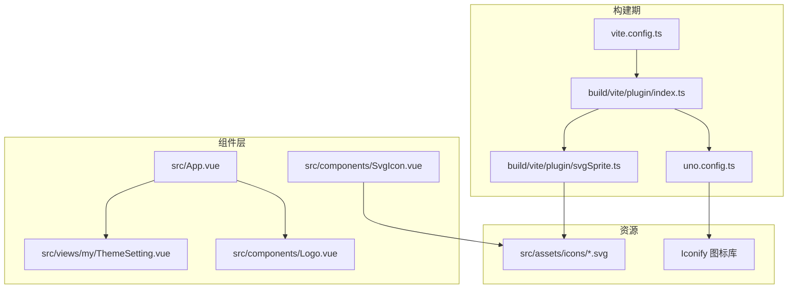
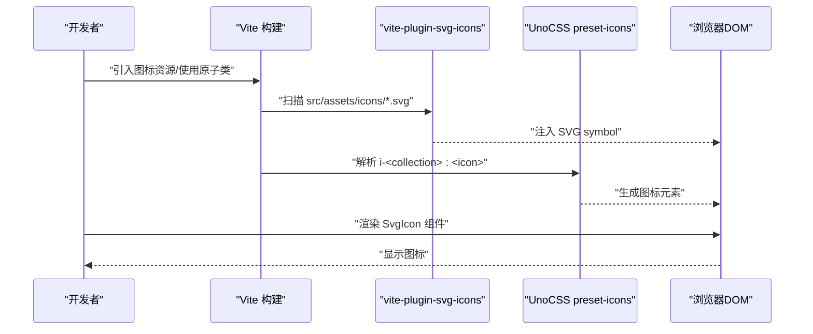
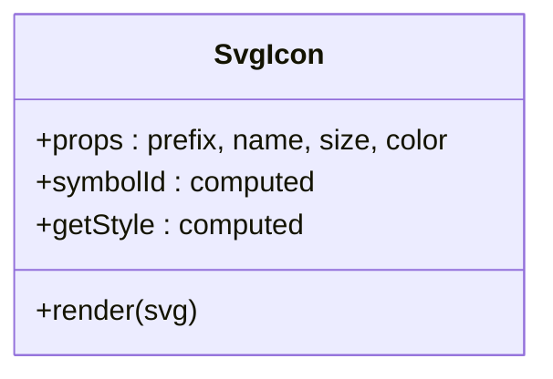
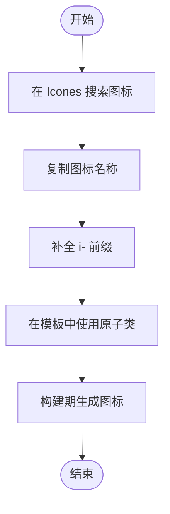
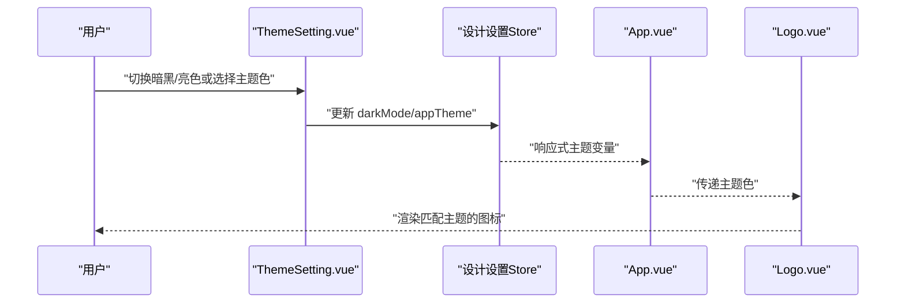
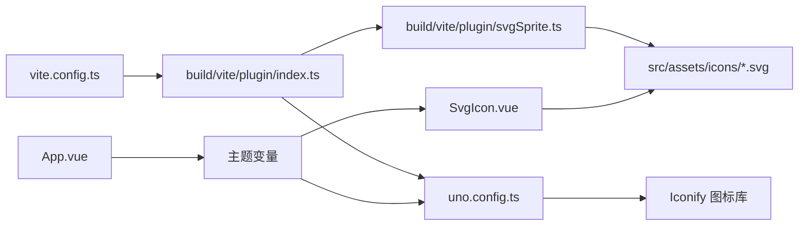

# 图标系统

<cite>
**本文引用的文件**
- [SvgIcon.vue](file://src/components/SvgIcon.vue)
- [README.md](file://README.md)
- [uno.config.ts](file://uno.config.ts)
- [vite.config.ts](file://vite.config.ts)
- [svgSprite.ts](file://build/vite/plugin/svgSprite.ts)
- [index.ts](file://build/vite/plugin/index.ts)
- [designSetting.ts](file://src/settings/designSetting.ts)
- [useDesignSetting.ts](file://src/hooks/setting/useDesignSetting.ts)
- [App.vue](file://src/App.vue)
- [ThemeSetting.vue](file://src/views/my/ThemeSetting.vue)
- [Logo.vue](file://src/components/Logo.vue)
- [package.json](file://package.json)
</cite>

## 目录
1. [简介](#简介)
2. [项目结构](#项目结构)
3. [核心组件](#核心组件)
4. [架构总览](#架构总览)
5. [详细组件分析](#详细组件分析)
6. [依赖关系分析](#依赖关系分析)
7. [性能考量](#性能考量)
8. [故障排查指南](#故障排查指南)
9. [结论](#结论)
10. [附录](#附录)

## 简介
本项目采用双轨图标体系：
- UnoCSS 图标预设：通过原子类动态生成图标，适合高频、轻量、无需交互的图标场景。
- SVG Symbol 组件：通过本地 SVG 资源与 vite-plugin-svg-icons 打包合并为雪碧图，适合需要强可控、可复用、可定制的图标。

同时，项目支持 Iconify 图标库的集成与使用，可通过 Icones 搜索并按约定引入图标；并提供基于主题色的图标适配实践，确保在深浅色模式与多主题下保持一致的视觉体验。

## 项目结构
图标系统涉及的关键文件与职责如下：
- 组件层
  - SvgIcon.vue：SVG 图标组件，负责渲染本地 SVG 符号。
- 构建层
  - vite.config.ts：Vite 主配置，加载插件。
  - build/vite/plugin/index.ts：统一注入插件，含 svg-icons 插件。
  - build/vite/plugin/svgSprite.ts：配置 svg-icons 插件，指定扫描目录、符号 ID 规则与 SVGO 压缩。
  - uno.config.ts：UnoCSS 配置，启用 @unocss/preset-icons，设置额外属性与 safelist。
- 使用层
  - README.md：图标使用规范与 Iconify 集成说明。
  - App.vue：应用级主题变量注入，影响图标与组件的视觉表现。
  - ThemeSetting.vue：主题切换与动画设置界面，展示图标在主题中的使用。
  - Logo.vue：根据主题色动态选择 SVG 符号或渐变矢量图标。
  - designSetting.ts / useDesignSetting.ts：主题状态与计算属性，驱动图标与组件的主题适配。

**图表来源**
- [vite.config.ts:1-183](file://vite.config.ts#L1-L183)
- [index.ts:1-79](file://build/vite/plugin/index.ts#L1-L79)
- [svgSprite.ts:1-20](file://build/vite/plugin/svgSprite.ts#L1-L20)
- [uno.config.ts:1-84](file://uno.config.ts#L1-L84)
- [SvgIcon.vue:1-40](file://src/components/SvgIcon.vue#L1-L40)
- [App.vue:1-78](file://src/App.vue#L1-L78)
- [ThemeSetting.vue:1-120](file://src/views/my/ThemeSetting.vue#L1-L120)
- [Logo.vue:1-51](file://src/components/Logo.vue#L1-L51)

**章节来源**
- [vite.config.ts:1-183](file://vite.config.ts#L1-L183)
- [index.ts:1-79](file://build/vite/plugin/index.ts#L1-L79)
- [svgSprite.ts:1-20](file://build/vite/plugin/svgSprite.ts#L1-L20)
- [uno.config.ts:1-84](file://uno.config.ts#L1-L84)
- [SvgIcon.vue:1-40](file://src/components/SvgIcon.vue#L1-L40)
- [README.md:72-110](file://README.md#L72-L110)
- [App.vue:1-78](file://src/App.vue#L1-L78)
- [ThemeSetting.vue:1-120](file://src/views/my/ThemeSetting.vue#L1-L120)
- [Logo.vue:1-51](file://src/components/Logo.vue#L1-L51)

## 核心组件
- SvgIcon 组件
  - 功能：接收 prefix、name、size、color 等参数，拼接 symbolId 并渲染对应 SVG 符号。
  - 特点：默认前缀为 icon，支持 px 单位自动处理，内联填充颜色可覆盖。
  - 适用：本地 SVG 资源、vite-plugin-svg-icons 打包生成的符号。
- UnoCSS 图标预设
  - 功能：通过原子类 i-<collection>:<icon> 动态生成图标，支持 Iconify 图标库。
  - 特点：零运行时开销、按需生成、可直接在模板中使用。
- 主题适配
  - 功能：通过主题色与 Vant 主题变量注入，使图标与组件在不同主题下保持一致风格。
  - 实践：在 App.vue 中根据主题色生成主题变量，Logo.vue 根据主题色动态选择 SVG 符号或渐变矢量图标。

**章节来源**
- [SvgIcon.vue:1-40](file://src/components/SvgIcon.vue#L1-L40)
- [uno.config.ts:27-34](file://uno.config.ts#L27-L34)
- [README.md:88-110](file://README.md#L88-L110)
- [App.vue:26-68](file://src/App.vue#L26-L68)
- [Logo.vue:1-51](file://src/components/Logo.vue#L1-L51)

## 架构总览
图标系统由“构建期打包 + 运行期渲染”两部分组成：
- 构建期
  - vite-plugin-svg-icons 扫描 src/assets/icons 下的 SVG，生成 symbol 并注入 HTML。
  - UnoCSS preset-icons 提供 Iconify 图标解析与生成。
- 运行期
  - SvgIcon 组件通过 symbolId 渲染本地 SVG。
  - 原子类 i-<collection>:<icon> 直接渲染 Iconify 图标。
  - 主题系统通过主题变量与组件逻辑实现图标适配。

**图表来源**
- [svgSprite.ts:9-19](file://build/vite/plugin/svgSprite.ts#L9-L19)
- [uno.config.ts:27-34](file://uno.config.ts#L27-L34)
- [SvgIcon.vue:26-36](file://src/components/SvgIcon.vue#L26-L36)

**章节来源**
- [svgSprite.ts:1-20](file://build/vite/plugin/svgSprite.ts#L1-L20)
- [uno.config.ts:1-84](file://uno.config.ts#L1-L84)
- [SvgIcon.vue:1-40](file://src/components/SvgIcon.vue#L1-L40)

## 详细组件分析

### SvgIcon 组件
- 设计要点
  - 使用 <use xlink:href="symbolId"> 引用已注入的 SVG symbol。
  - 通过 style 计算宽度与高度，支持数字与 px 字符串混用。
  - color 属性直接传入 fill，便于覆盖默认颜色。
- 参数与默认值
  - prefix: 默认 "icon"
  - name: 必填
  - size: 默认 16，支持带 px 或纯数字
  - color: 默认 "#333"
- 使用建议
  - 与 vite-plugin-svg-icons 的 symbolId 规则保持一致（如 icon-[dir]-[name]）。
  - 在需要强可控颜色与尺寸时使用；对简单图标可优先使用 UnoCSS 原子类。

**图表来源**
- [SvgIcon.vue:12-36](file://src/components/SvgIcon.vue#L12-L36)

**章节来源**
- [SvgIcon.vue:1-40](file://src/components/SvgIcon.vue#L1-L40)

### UnoCSS 图标预设与 Iconify 集成
- 配置要点
  - 启用 @unocss/preset-icons，设置额外属性（display、vertical-align）。
  - 通过 safelist 解决动态类名在构建期不可知的问题。
- 使用规范
  - 类名格式：i-<collection>:<icon> 或 i-<collection>-<icon>。
  - 从 Icones 搜索图标后复制名称，注意补全 i- 前缀。
- 优势
  - 零运行时开销，按需生成；适合导航、按钮等高频图标。

**图表来源**
- [uno.config.ts:27-34](file://uno.config.ts#L27-L34)
- [uno.config.ts:77-82](file://uno.config.ts#L77-L82)
- [README.md:88-110](file://README.md#L88-L110)

**章节来源**
- [uno.config.ts:1-84](file://uno.config.ts#L1-L84)
- [README.md:72-110](file://README.md#L72-L110)

### 主题适配与图标渲染
- 主题变量注入
  - App.vue 根据当前主题色生成 Vant 主题变量，影响图标与组件的颜色表现。
- 主题切换
  - ThemeSetting.vue 提供暗黑模式与主题色选择，实时更新主题变量。
- 动态图标
  - Logo.vue 根据主题色选择 SVG 符号或渐变矢量图标，保证在不同主题下清晰可见。

**图表来源**
- [ThemeSetting.vue:70-116](file://src/views/my/ThemeSetting.vue#L70-L116)
- [useDesignSetting.ts:1-25](file://src/hooks/setting/useDesignSetting.ts#L1-L25)
- [designSetting.ts:1-52](file://src/settings/designSetting.ts#L1-L52)
- [App.vue:26-68](file://src/App.vue#L26-L68)
- [Logo.vue:1-51](file://src/components/Logo.vue#L1-L51)

**章节来源**
- [ThemeSetting.vue:1-120](file://src/views/my/ThemeSetting.vue#L1-L120)
- [useDesignSetting.ts:1-25](file://src/hooks/setting/useDesignSetting.ts#L1-L25)
- [designSetting.ts:1-52](file://src/settings/designSetting.ts#L1-L52)
- [App.vue:1-78](file://src/App.vue#L1-L78)
- [Logo.vue:1-51](file://src/components/Logo.vue#L1-L51)

## 依赖关系分析
- 构建插件链路
  - vite.config.ts 加载插件集合。
  - build/vite/plugin/index.ts 统一注入 vite-plugin-svg-icons 与 UnoCSS。
  - build/vite/plugin/svgSprite.ts 配置 svg-icons 的扫描目录、SVGO 与 symbolId 规则。
- 运行时依赖
  - SvgIcon.vue 依赖注入的 SVG symbol。
  - UnoCSS 原子类依赖 preset-icons 与 Iconify 图标库。
  - 主题系统依赖设计设置 Store 与 Vant 主题变量。

**图表来源**
- [vite.config.ts:179-181](file://vite.config.ts#L179-L181)
- [index.ts:19-78](file://build/vite/plugin/index.ts#L19-L78)
- [svgSprite.ts:9-19](file://build/vite/plugin/svgSprite.ts#L9-L19)
- [uno.config.ts:27-34](file://uno.config.ts#L27-L34)
- [SvgIcon.vue:26-36](file://src/components/SvgIcon.vue#L26-L36)
- [App.vue:26-68](file://src/App.vue#L26-L68)

**章节来源**
- [vite.config.ts:1-183](file://vite.config.ts#L1-L183)
- [index.ts:1-79](file://build/vite/plugin/index.ts#L1-L79)
- [svgSprite.ts:1-20](file://build/vite/plugin/svgSprite.ts#L1-L20)
- [uno.config.ts:1-84](file://uno.config.ts#L1-L84)
- [SvgIcon.vue:1-40](file://src/components/SvgIcon.vue#L1-L40)
- [App.vue:1-78](file://src/App.vue#L1-L78)

## 性能考量
- 构建期优化
  - vite-plugin-svg-icons 在构建时扫描并压缩 SVG，减少运行时体积与请求次数。
  - UnoCSS 在构建期生成图标，避免运行时解析与渲染成本。
- 运行期优化
  - SvgIcon 组件仅做 symbolId 拼接与样式计算，开销极低。
  - 主题变量集中注入，避免重复计算与多次重排。
- 建议
  - 对高频图标优先使用 UnoCSS 原子类。
  - 对需要强可控样式的图标使用 SvgIcon 组件。
  - 控制 SVG 文件复杂度，必要时启用 SVGO 压缩。

[本节为通用性能指导，不直接分析具体文件，故无“章节来源”]

## 故障排查指南
- 本地 SVG 图标不显示
  - 检查 vite-plugin-svg-icons 是否正确配置 iconDirs 与 symbolId 规则。
  - 确认 SvgIcon 的 name 与 symbolId 前缀一致。
  - 参考：[svgSprite.ts:11-16](file://build/vite/plugin/svgSprite.ts#L11-L16)，[SvgIcon.vue:26](file://src/components/SvgIcon.vue#L26)
- UnoCSS 原子类图标未生效
  - 检查类名格式是否符合 i-<collection>:<icon>。
  - 若为动态类名，确认已在 uno.config.ts 的 safelist 中声明。
  - 参考：[uno.config.ts:77-82](file://uno.config.ts#L77-L82)，[README.md:94-102](file://README.md#L94-L102)
- 图标颜色与主题不一致
  - 检查 App.vue 的主题变量注入是否正确。
  - 确认主题切换逻辑与组件渲染顺序。
  - 参考：[App.vue:26-68](file://src/App.vue#L26-L68)，[ThemeSetting.vue:78-90](file://src/views/my/ThemeSetting.vue#L78-L90)
- 构建失败或体积异常
  - 检查 SVGO 配置与依赖版本。
  - 参考：[package.json:61-102](file://package.json#L61-L102)，[svgSprite.ts:14](file://build/vite/plugin/svgSprite.ts#L14)

**章节来源**
- [svgSprite.ts:9-19](file://build/vite/plugin/svgSprite.ts#L9-L19)
- [SvgIcon.vue:26-36](file://src/components/SvgIcon.vue#L26-L36)
- [uno.config.ts:77-82](file://uno.config.ts#L77-L82)
- [README.md:88-110](file://README.md#L88-L110)
- [App.vue:26-68](file://src/App.vue#L26-L68)
- [ThemeSetting.vue:78-90](file://src/views/my/ThemeSetting.vue#L78-L90)
- [package.json:61-102](file://package.json#L61-L102)

## 结论
本项目通过 UnoCSS 图标预设与本地 SVG 符号组件形成互补的图标体系：前者满足高频、轻量的图标需求，后者满足强可控与可定制场景。结合 Iconify 图标库与主题变量注入，实现了跨主题、跨场景的一致体验。建议在实际开发中遵循命名约定与使用规范，合理选择图标方案，并关注构建期优化与运行期性能。

[本节为总结性内容，不直接分析具体文件，故无“章节来源”]

## 附录

### 使用规范与约定
- UnoCSS 原子类
  - 格式：i-<collection>:<icon> 或 i-<collection>-<icon>
  - 示例：i-ph:house、i-mdi:alarm
  - 注意：从 Icones 复制的名称不含 i- 前缀，需手动补全
- SvgIcon 组件
  - 前缀与 name：与 symbolId 规则保持一致（如 icon-[dir]-[name]）
  - 尺寸：支持数字与 px 字符串
  - 颜色：通过 color 属性覆盖 fill
- 主题适配
  - 通过 App.vue 的主题变量注入影响图标与组件颜色
  - 在 ThemeSetting.vue 中切换暗黑/亮色与主题色

**章节来源**
- [README.md:88-110](file://README.md#L88-L110)
- [SvgIcon.vue:12-24](file://src/components/SvgIcon.vue#L12-L24)
- [uno.config.ts:27-34](file://uno.config.ts#L27-L34)
- [App.vue:26-68](file://src/App.vue#L26-L68)

### 添加新图标资源流程
- 准备 SVG
  - 确保 SVG 符合最小化与无多余属性的要求
  - 放置于 src/assets/icons/<目录>/ 文件夹
- 配置打包
  - 确认 vite-plugin-svg-icons 的 iconDirs 已包含该目录
  - 如需自定义 symbolId，可在插件配置中调整
- 组件集成
  - 使用 SvgIcon 组件：传入正确的 prefix 与 name
  - 或使用 UnoCSS 原子类：在模板中直接使用 i-<collection>:<icon>
- 主题适配
  - 如图标颜色需随主题变化，优先通过主题变量控制；必要时在组件中动态计算颜色

**章节来源**
- [svgSprite.ts:11-16](file://build/vite/plugin/svgSprite.ts#L11-L16)
- [SvgIcon.vue:26-36](file://src/components/SvgIcon.vue#L26-L36)
- [README.md:88-110](file://README.md#L88-L110)
- [App.vue:26-68](file://src/App.vue#L26-L68)