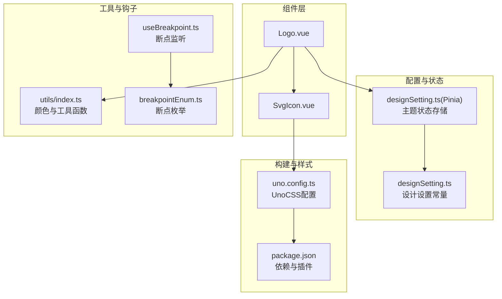
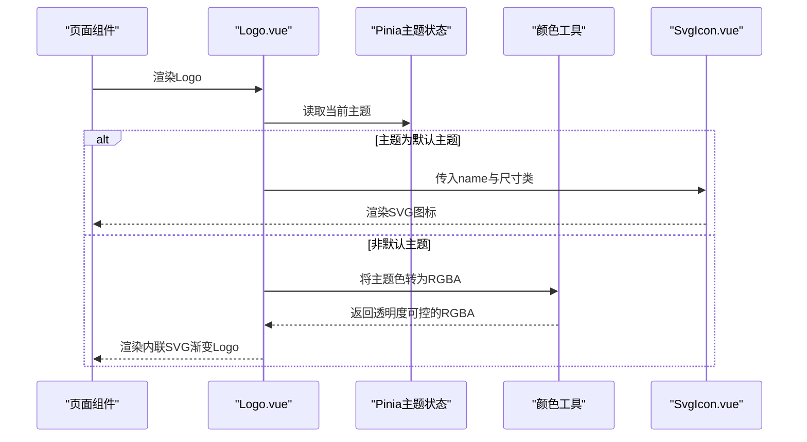
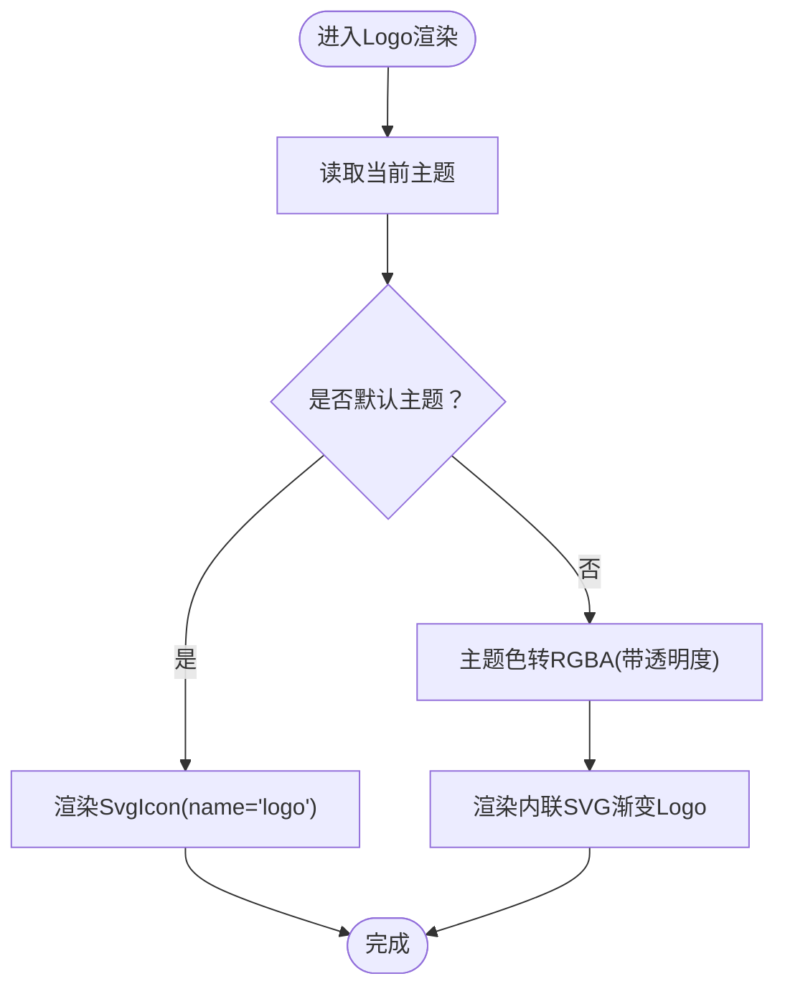
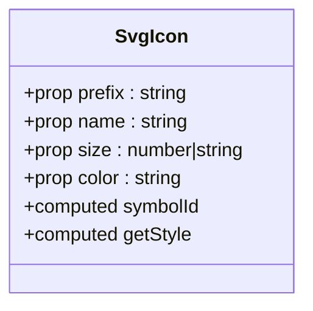
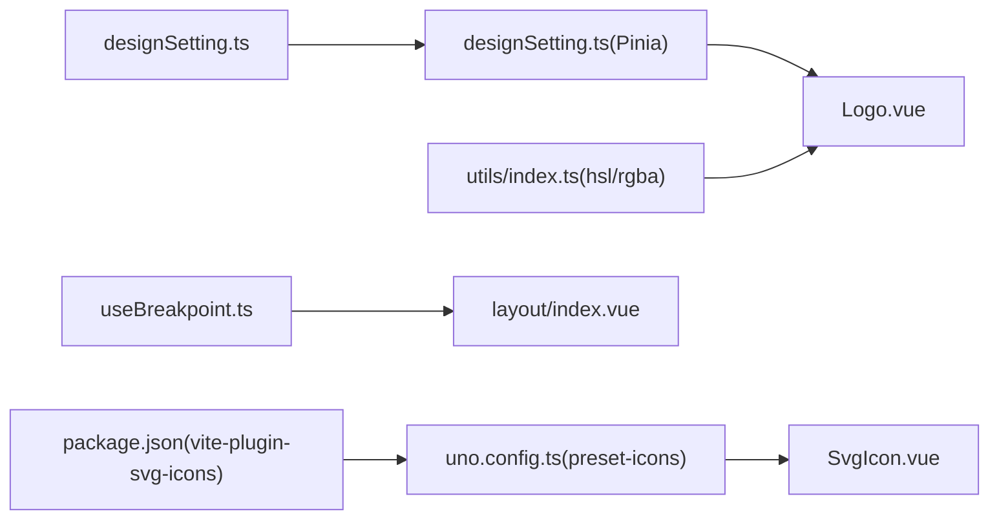

# 基础组件

<cite>
**本文引用的文件**
- [Logo.vue](file://src/components/Logo.vue)
- [SvgIcon.vue](file://src/components/SvgIcon.vue)
- [designSetting.ts](file://src/settings/designSetting.ts)
- [designSetting.ts（Pinia Store）](file://src/store/modules/designSetting.ts)
- [useBreakpoint.ts](file://src/hooks/event/useBreakpoint.ts)
- [breakpointEnum.ts](file://src/enums/breakpointEnum.ts)
- [index.ts（工具函数）](file://src/utils/index.ts)
- [uno.config.ts](file://uno.config.ts)
- [package.json](file://package.json)
- [index.vue（布局）](file://src/layout/index.vue)
- [index.vue（仪表盘视图）](file://src/views/dashboard/index.vue)
</cite>

## 目录
1. [简介](#简介)
2. [项目结构](#项目结构)
3. [核心组件](#核心组件)
4. [架构总览](#架构总览)
5. [详细组件分析](#详细组件分析)
6. [依赖关系分析](#依赖关系分析)
7. [性能考量](#性能考量)
8. [故障排查指南](#故障排查指南)
9. [结论](#结论)
10. [附录](#附录)

## 简介
本章节面向Vue3微信H5移动端项目，聚焦于两个基础组件：Logo与SvgIcon。文档从设计理念、实现细节、API说明、使用示例与最佳实践、样式定制与主题适配等方面进行系统阐述，并结合项目中的断点监听、主题配置与UnoCSS适配策略，帮助开发者在移动端场景下高效、一致地使用这些组件。

## 项目结构
这两个基础组件位于src/components目录，配合主题配置、断点枚举与工具函数共同构成组件生态。布局层通过Pinia主题状态驱动组件渲染，UnoCSS负责移动端rem到px的转换与图标按需生成。

**图表来源**
- [Logo.vue:1-52](file://src/components/Logo.vue#L1-L52)
- [SvgIcon.vue:1-40](file://src/components/SvgIcon.vue#L1-L40)
- [designSetting.ts:1-52](file://src/settings/designSetting.ts#L1-L52)
- [designSetting.ts（Pinia Store）:1-52](file://src/store/modules/designSetting.ts#L1-L52)
- [index.ts（工具函数）:84-100](file://src/utils/index.ts#L84-L100)
- [useBreakpoint.ts:1-96](file://src/hooks/event/useBreakpoint.ts#L1-L96)
- [breakpointEnum.ts:1-29](file://src/enums/breakpointEnum.ts#L1-L29)
- [uno.config.ts:1-84](file://uno.config.ts#L1-L84)
- [package.json:102-102](file://package.json#L102-L102)

**章节来源**
- [Logo.vue:1-52](file://src/components/Logo.vue#L1-L52)
- [SvgIcon.vue:1-40](file://src/components/SvgIcon.vue#L1-L40)
- [designSetting.ts:1-52](file://src/settings/designSetting.ts#L1-L52)
- [designSetting.ts（Pinia Store）:1-52](file://src/store/modules/designSetting.ts#L1-L52)
- [index.ts（工具函数）:84-100](file://src/utils/index.ts#L84-L100)
- [useBreakpoint.ts:1-96](file://src/hooks/event/useBreakpoint.ts#L1-L96)
- [breakpointEnum.ts:1-29](file://src/enums/breakpointEnum.ts#L1-L29)
- [uno.config.ts:1-84](file://uno.config.ts#L1-L84)
- [package.json:102-102](file://package.json#L102-L102)

## 核心组件
- Logo组件：根据当前主题自动选择矢量Logo或内联SVG渐变Logo，支持主题色随主题切换而变化，尺寸通过Tailwind类名控制，便于在移动端统一适配。
- SvgIcon组件：基于SVG Symbol的图标封装，支持前缀、名称、尺寸与颜色的统一配置，通过UnoCSS图标预设按需生成CSS类，减少资源体积。

**章节来源**
- [Logo.vue:1-52](file://src/components/Logo.vue#L1-L52)
- [SvgIcon.vue:1-40](file://src/components/SvgIcon.vue#L1-L40)

## 架构总览
Logo组件通过Pinia主题状态决定渲染路径；当主题为默认主题时使用SvgIcon组件加载内置图标；否则内联SVG并使用主题色生成渐变填充。SvgIcon组件通过UnoCSS图标预设生成符号ID，最终在运行时通过use元素引用。

**图表来源**
- [Logo.vue:44-51](file://src/components/Logo.vue#L44-L51)
- [designSetting.ts（Pinia Store）:16-32](file://src/store/modules/designSetting.ts#L16-L32)
- [index.ts（工具函数）:84-100](file://src/utils/index.ts#L84-L100)
- [SvgIcon.vue:12-36](file://src/components/SvgIcon.vue#L12-L36)

## 详细组件分析

### Logo 组件
- 设计理念
  - 双态渲染：默认主题走SvgIcon加载内置图标；非默认主题则内联SVG并使用主题色生成渐变，确保品牌一致性与可访问性。
  - 主题联动：通过Pinia主题状态与颜色工具函数，保证Logo色彩与全局主题保持一致。
  - 移动端适配：使用Tailwind类名控制尺寸，结合UnoCSS的rem到px转换与postcss插件，确保在移动端viewport下的稳定表现。
- 实现要点
  - 主题判断：读取默认主题列表与当前主题，决定渲染路径。
  - 渐变生成：使用线性渐变与透明度参数，使Logo在深浅主题下均清晰可见。
  - 尺寸控制：通过类名传入固定高度与宽度，避免布局抖动。
- API概览
  - 无显式props：组件内部通过主题状态与工具函数完成渲染决策。
  - 插槽：未提供具名/作用域插槽。
  - 事件：未绑定原生事件。
- 使用示例
  - 在布局或导航栏中直接引入Logo组件，即可随主题自动切换。
- 最佳实践
  - 将Logo置于页面顶部或应用标题区域，保持统一的视觉锚点。
  - 避免在同一页面重复渲染多个Logo实例，除非有明确的品牌强调需求。
  - 如需自定义尺寸，建议通过父容器的类名控制，而非修改组件内部尺寸逻辑。

**图表来源**
- [Logo.vue:3-41](file://src/components/Logo.vue#L3-L41)
- [designSetting.ts（Pinia Store）:16-32](file://src/store/modules/designSetting.ts#L16-L32)
- [index.ts（工具函数）:84-100](file://src/utils/index.ts#L84-L100)

**章节来源**
- [Logo.vue:1-52](file://src/components/Logo.vue#L1-L52)
- [designSetting.ts（Pinia Store）:16-32](file://src/store/modules/designSetting.ts#L16-L32)
- [index.ts（工具函数）:84-100](file://src/utils/index.ts#L84-L100)

### SvgIcon 组件
- 设计理念
  - 基于SVG Symbol的轻量封装，避免重复内联SVG代码，提升可维护性与性能。
  - 支持前缀、名称、尺寸与颜色的统一配置，便于在不同场景下复用。
  - 与UnoCSS图标预设协同，按需生成CSS类，减少打包体积。
- 实现要点
  - 符号ID：通过prefix与name拼接生成#prefix-name的引用。
  - 尺寸控制：将size解析为数值并统一设置宽高，支持数字与字符串输入。
  - 颜色适配：fill属性直接绑定color，便于与主题色联动。
- API概览
  - 属性
    - prefix: 字符串，图标前缀，默认值为"icon"
    - name: 必填，图标名称
    - size: 数字或字符串，图标尺寸，默认值为16
    - color: 字符串，图标颜色，默认值为"#333"
  - 插槽：未提供具名/作用域插槽
  - 事件：未绑定原生事件
- 使用示例
  - 在Logo组件中作为默认主题下的图标渲染器使用。
  - 在导航栏、按钮、列表项等处按需传入name与size。
- 最佳实践
  - 优先使用UnoCSS图标预设提供的类名，确保图标按需生成与缓存。
  - 在移动端场景下，建议通过类名控制尺寸，避免过度缩放导致模糊。
  - 当需要与主题色联动时，可通过color属性或外部样式覆盖实现。

**图表来源**
- [SvgIcon.vue:12-36](file://src/components/SvgIcon.vue#L12-L36)

**章节来源**
- [SvgIcon.vue:1-40](file://src/components/SvgIcon.vue#L1-L40)
- [uno.config.ts:28-34](file://uno.config.ts#L28-L34)

## 依赖关系分析
- 主题与状态
  - 设计设置常量提供主题色列表与默认主题；Pinia Store提供getter与持久化能力，供Logo组件读取当前主题。
- 工具函数
  - 颜色工具提供主题色到RGBA的转换，用于内联SVG渐变填充。
- 断点与响应式
  - 断点监听与枚举为移动端布局提供参考，结合UnoCSS的rem到px转换，确保在不同屏幕尺寸下的稳定表现。
- 构建与图标
  - UnoCSS图标预设与vite-plugin-svg-icons协同，按需生成图标CSS类，减少资源体积。

**图表来源**
- [designSetting.ts:16-36](file://src/settings/designSetting.ts#L16-L36)
- [designSetting.ts（Pinia Store）:16-32](file://src/store/modules/designSetting.ts#L16-L32)
- [index.ts（工具函数）:84-100](file://src/utils/index.ts#L84-L100)
- [useBreakpoint.ts:19-26](file://src/hooks/event/useBreakpoint.ts#L19-L26)
- [uno.config.ts:28-34](file://uno.config.ts#L28-L34)
- [package.json:102-102](file://package.json#L102-L102)

**章节来源**
- [designSetting.ts:16-36](file://src/settings/designSetting.ts#L16-L36)
- [designSetting.ts（Pinia Store）:16-32](file://src/store/modules/designSetting.ts#L16-L32)
- [index.ts（工具函数）:84-100](file://src/utils/index.ts#L84-L100)
- [useBreakpoint.ts:19-26](file://src/hooks/event/useBreakpoint.ts#L19-L26)
- [uno.config.ts:28-34](file://uno.config.ts#L28-L34)
- [package.json:102-102](file://package.json#L102-L102)

## 性能考量
- SVG图标按需生成：通过UnoCSS图标预设与vite-plugin-svg-icons，仅在使用时生成对应CSS类，降低初始包体。
- 主题色转换：颜色工具采用纯前端计算，避免额外网络请求，渲染时直接使用RGBA值。
- 尺寸控制：通过类名控制尺寸，避免内联样式带来的重排与重绘成本。
- 断点监听：使用防抖/节流策略（如wait参数）可进一步优化窗口resize事件的触发频率，减少不必要的计算。

[本节为通用性能建议，不直接分析具体文件，故无“章节来源”]

## 故障排查指南
- 图标不显示
  - 检查UnoCSS图标预设是否启用，确认类名拼写与prefix/name一致。
  - 若使用SvgIcon，请确认name与prefix是否匹配已生成的符号ID。
- 颜色异常
  - 确认主题色格式与透明度范围有效；若使用内联SVG渐变，请检查颜色工具函数返回值。
- 尺寸不正确
  - 确认传入的size为合法数值或字符串；组件会统一解析为像素值。
- 响应式问题
  - 检查断点监听是否生效，以及UnoCSS rem到px转换配置是否符合预期。

**章节来源**
- [uno.config.ts:28-34](file://uno.config.ts#L28-L34)
- [index.ts（工具函数）:84-100](file://src/utils/index.ts#L84-L100)
- [useBreakpoint.ts:61-70](file://src/hooks/event/useEventListener.ts#L61-L70)

## 结论
Logo与SvgIcon作为移动端H5的基础组件，通过主题状态与工具函数实现了灵活的主题适配，借助UnoCSS图标预设与构建插件实现了高效的资源管理。遵循本文的API说明、使用示例与最佳实践，可在不同场景下稳定、一致地使用这些组件，并在此基础上进行样式定制与扩展。

[本节为总结性内容，不直接分析具体文件，故无“章节来源”]

## 附录

### 组件API速查表
- Logo
  - 无显式属性
  - 无事件与插槽
- SvgIcon
  - prefix: 字符串，默认"icon"
  - name: 字符串，必填
  - size: 数字或字符串，默认16
  - color: 字符串，默认"#333"

**章节来源**
- [Logo.vue:1-52](file://src/components/Logo.vue#L1-L52)
- [SvgIcon.vue:12-24](file://src/components/SvgIcon.vue#L12-L24)

### 使用示例与最佳实践
- 在Logo组件中直接使用，无需额外配置
- 在导航栏、按钮等处使用SvgIcon，传入合适的name与size
- 与主题联动时，优先通过color或外部样式覆盖实现

**章节来源**
- [index.vue（布局）:28-28](file://src/layout/index.vue#L28-L28)
- [index.vue（仪表盘视图）:8-8](file://src/views/dashboard/index.vue#L8-L8)