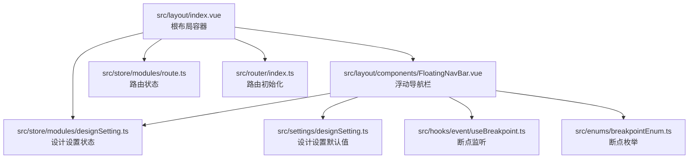
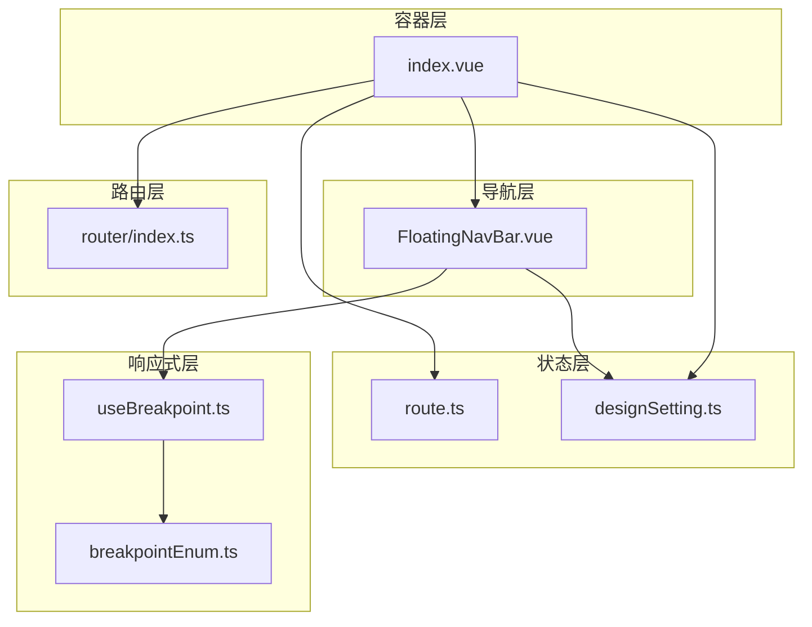
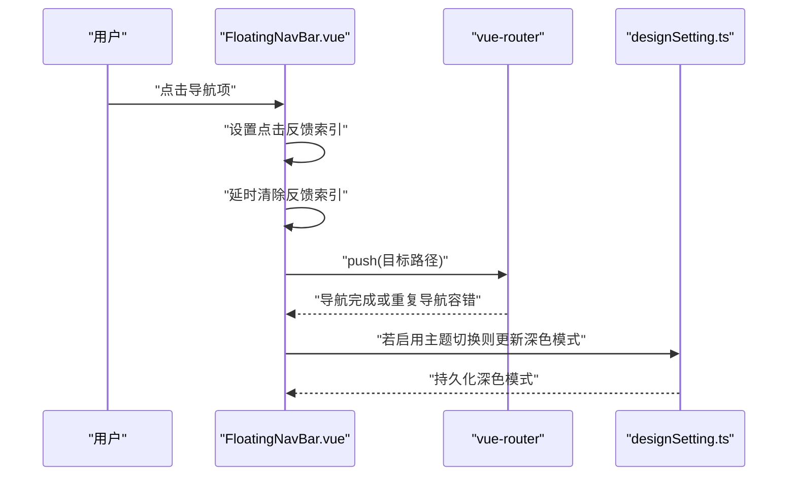
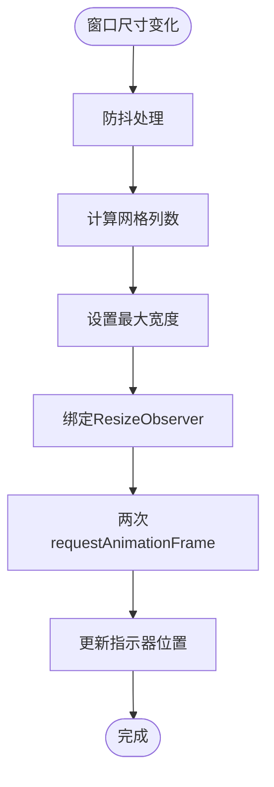
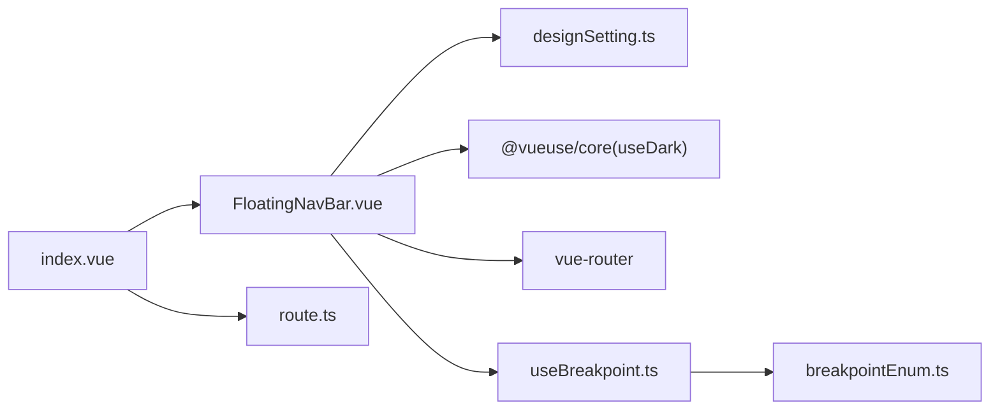

# 布局系统

<cite>
**本文引用的文件**
- [src/layout/index.vue](file://src/layout/index.vue)
- [src/layout/components/FloatingNavBar.vue](file://src/layout/components/FloatingNavBar.vue)
- [src/hooks/event/useBreakpoint.ts](file://src/hooks/event/useBreakpoint.ts)
- [src/hooks/event/useWindowSizeFn.ts](file://src/hooks/event/useWindowSizeFn.ts)
- [src/enums/breakpointEnum.ts](file://src/enums/breakpointEnum.ts)
- [src/settings/designSetting.ts](file://src/settings/designSetting.ts)
- [src/store/modules/designSetting.ts](file://src/store/modules/designSetting.ts)
- [src/router/index.ts](file://src/router/index.ts)
- [src/store/modules/route.ts](file://src/store/modules/route.ts)
- [src/styles/common.less](file://src/styles/common.less)
- [src/utils/domUtils.ts](file://src/utils/domUtils.ts)
- [README.md](file://README.md)
</cite>

## 目录
1. [简介](#简介)
2. [项目结构](#项目结构)
3. [核心组件](#核心组件)
4. [架构总览](#架构总览)
5. [组件详解](#组件详解)
6. [依赖关系分析](#依赖关系分析)
7. [性能考量](#性能考量)
8. [故障排查指南](#故障排查指南)
9. [结论](#结论)
10. [附录](#附录)

## 简介
本文件面向Vue3微信H5移动端项目，系统性梳理布局系统的整体架构与实现，重点围绕根布局组件与FloatingNavBar浮动导航栏展开。内容涵盖：
- 根布局组件的设计思路与实现原理
- FloatingNavBar的交互设计与实现细节（导航项动态显示、点击事件处理、状态管理）
- 响应式适配策略（不同屏幕尺寸下的布局调整与体验优化）
- 布局组件的配置选项与自定义方法（导航项增删、样式定制、行为修改）
- 扩展指南与最佳实践，帮助开发者按业务需求进行定制

## 项目结构
布局系统位于src/layout目录，采用“根布局 + 浮动导航栏组件”的分层组织方式。根布局负责页面主体内容与浮动导航栏的容器职责；FloatingNavBar承担导航项渲染、激活态指示器、深浅色主题切换与动画反馈。

图表来源
- [src/layout/index.vue:1-60](file://src/layout/index.vue#L1-L60)
- [src/layout/components/FloatingNavBar.vue:1-549](file://src/layout/components/FloatingNavBar.vue#L1-L549)
- [src/store/modules/route.ts:1-40](file://src/store/modules/route.ts#L1-L40)
- [src/store/modules/designSetting.ts:1-52](file://src/store/modules/designSetting.ts#L1-L52)
- [src/settings/designSetting.ts:1-52](file://src/settings/designSetting.ts#L1-L52)
- [src/hooks/event/useBreakpoint.ts:1-96](file://src/hooks/event/useBreakpoint.ts#L1-L96)
- [src/enums/breakpointEnum.ts:1-29](file://src/enums/breakpointEnum.ts#L1-L29)
- [src/router/index.ts:1-33](file://src/router/index.ts#L1-L33)

章节来源
- [src/layout/index.vue:1-60](file://src/layout/index.vue#L1-L60)
- [src/layout/components/FloatingNavBar.vue:1-549](file://src/layout/components/FloatingNavBar.vue#L1-L549)
- [src/router/index.ts:1-33](file://src/router/index.ts#L1-L33)

## 核心组件
- 根布局组件（index.vue）
  - 负责页面主体区域的渲染与KeepAlive缓存策略
  - 将FloatingNavBar作为底部固定导航栏挂载
  - 通过设计设置store控制深色/浅色主题背景
- FloatingNavBar（FloatingNavBar.vue）
  - 渲染导航项按钮，支持图标与标签
  - 动态计算激活项并驱动指示器位移
  - 支持深浅色主题切换与点击反馈动画
  - 响应窗口尺寸变化，确保指示器位置准确

章节来源
- [src/layout/index.vue:32-49](file://src/layout/index.vue#L32-L49)
- [src/layout/components/FloatingNavBar.vue:62-278](file://src/layout/components/FloatingNavBar.vue#L62-L278)

## 架构总览
布局系统采用“容器组件 + 展示组件”的分层设计：
- 容器层：根布局index.vue负责页面壳体、路由视图与KeepAlive策略
- 导航层：FloatingNavBar.vue负责导航渲染、状态计算、事件处理与视觉反馈
- 状态层：Pinia store提供路由与设计设置的状态管理
- 响应式层：断点监听与窗口尺寸监听辅助布局自适应

图表来源
- [src/layout/index.vue:1-60](file://src/layout/index.vue#L1-L60)
- [src/layout/components/FloatingNavBar.vue:1-549](file://src/layout/components/FloatingNavBar.vue#L1-L549)
- [src/store/modules/route.ts:1-40](file://src/store/modules/route.ts#L1-L40)
- [src/store/modules/designSetting.ts:1-52](file://src/store/modules/designSetting.ts#L1-L52)
- [src/hooks/event/useBreakpoint.ts:1-96](file://src/hooks/event/useBreakpoint.ts#L1-L96)
- [src/enums/breakpointEnum.ts:1-29](file://src/enums/breakpointEnum.ts#L1-L29)
- [src/router/index.ts:1-33](file://src/router/index.ts#L1-L33)

## 组件详解

### 根布局组件（index.vue）
- 页面壳体与主题背景
  - 通过设计设置store的深色模式动态切换根节点的深色类名，从而驱动背景色与样式变量
- KeepAlive与路由视图
  - 根据路由store中的缓存组件列表决定是否启用KeepAlive，减少页面切换抖动
- 浮动导航栏挂载
  - 传入导航项数组与深色模式开关给FloatingNavBar

章节来源
- [src/layout/index.vue:1-60](file://src/layout/index.vue#L1-L60)
- [src/store/modules/route.ts:22-33](file://src/store/modules/route.ts#L22-L33)
- [src/store/modules/designSetting.ts:33-40](file://src/store/modules/designSetting.ts#L33-L40)

### FloatingNavBar浮动导航栏
- 导航项数据结构与默认值
  - NavItem接口包含label、path、icon三要素
  - 默认导航项包含首页、示例、搜索、我的等路径
- 激活态计算与指示器
  - 基于当前路由路径匹配导航项，支持“基础路径”匹配规则
  - 指示器通过计算属性与ResizeObserver监听，结合requestAnimationFrame确保位移精准
- 点击事件与导航跳转
  - 点击导航项触发点击反馈动画与路由跳转
  - 跳转前进行重复导航的容错处理，避免重复导航异常
- 主题切换与样式变量
  - 通过设计设置store与@vueuse/core的useDark实现深浅色主题联动
  - 使用CSS自定义属性传递主题色与最大宽度，支持网格列数自适应
- 响应式与安全区域
  - 固定定位在底部，结合安全区域属性，适配刘海屏与底部胶囊条
  - 根据导航项数量动态计算网格列数，限制最大宽度

图表来源
- [src/layout/components/FloatingNavBar.vue:208-237](file://src/layout/components/FloatingNavBar.vue#L208-L237)
- [src/layout/components/FloatingNavBar.vue:196-206](file://src/layout/components/FloatingNavBar.vue#L196-L206)
- [src/store/modules/designSetting.ts:33-40](file://src/store/modules/designSetting.ts#L33-L40)

章节来源
- [src/layout/components/FloatingNavBar.vue:68-86](file://src/layout/components/FloatingNavBar.vue#L68-L86)
- [src/layout/components/FloatingNavBar.vue:94-105](file://src/layout/components/FloatingNavBar.vue#L94-L105)
- [src/layout/components/FloatingNavBar.vue:151-167](file://src/layout/components/FloatingNavBar.vue#L151-L167)
- [src/layout/components/FloatingNavBar.vue:169-190](file://src/layout/components/FloatingNavBar.vue#L169-L190)
- [src/layout/components/FloatingNavBar.vue:208-237](file://src/layout/components/FloatingNavBar.vue#L208-L237)
- [src/layout/components/FloatingNavBar.vue:127-132](file://src/layout/components/FloatingNavBar.vue#L127-L132)
- [src/layout/components/FloatingNavBar.vue:280-549](file://src/layout/components/FloatingNavBar.vue#L280-L549)

### 响应式适配策略
- 断点监听与窗口尺寸
  - useBreakpoint.ts基于window.resize事件与screenMap映射，输出当前屏幕尺寸枚举与真实宽度
  - useWindowSizeFn.ts提供防抖窗口尺寸监听能力，便于组件在尺寸变化时做节流处理
- FloatingNavBar的自适应
  - 通过计算属性动态设置grid-template-columns与最大宽度，当导航项≥5时采用更宽的最大宽度
  - 结合ResizeObserver与requestAnimationFrame，确保指示器在布局变化后能准确复位
- 安全区域与底部留白
  - 固定定位底部并使用env(safe-area-inset-bottom)保障刘海屏底部空间

图表来源
- [src/hooks/event/useWindowSizeFn.ts:9-35](file://src/hooks/event/useWindowSizeFn.ts#L9-L35)
- [src/hooks/event/useBreakpoint.ts:29-95](file://src/hooks/event/useBreakpoint.ts#L29-L95)
- [src/layout/components/FloatingNavBar.vue:126-132](file://src/layout/components/FloatingNavBar.vue#L126-L132)
- [src/layout/components/FloatingNavBar.vue:169-190](file://src/layout/components/FloatingNavBar.vue#L169-L190)
- [src/layout/components/FloatingNavBar.vue:151-167](file://src/layout/components/FloatingNavBar.vue#L151-L167)

章节来源
- [src/hooks/event/useBreakpoint.ts:19-95](file://src/hooks/event/useBreakpoint.ts#L19-L95)
- [src/hooks/event/useWindowSizeFn.ts:9-35](file://src/hooks/event/useWindowSizeFn.ts#L9-L35)
- [src/enums/breakpointEnum.ts:1-29](file://src/enums/breakpointEnum.ts#L1-L29)
- [src/layout/components/FloatingNavBar.vue:126-132](file://src/layout/components/FloatingNavBar.vue#L126-L132)

### 配置选项与自定义方法
- 导航项配置
  - 通过根布局传入items数组，每个元素包含label、path、icon
  - 可自由增删导航项，图标使用Iconify前缀约定
- 行为与外观定制
  - showDarkModeToggle：控制是否显示主题切换按钮
  - 主题色与动画：通过设计设置store的appTheme与isPageAnimate/pageAnimateType进行统一管理
  - 指示器与按钮动画：通过CSS keyframes与类名切换实现点击反馈
- 状态持久化
  - 设计设置store默认开启持久化，深色模式与主题色在刷新后仍保持

章节来源
- [src/layout/index.vue:43-48](file://src/layout/index.vue#L43-L48)
- [src/layout/components/FloatingNavBar.vue:74-86](file://src/layout/components/FloatingNavBar.vue#L74-L86)
- [src/settings/designSetting.ts:38-49](file://src/settings/designSetting.ts#L38-L49)
- [src/store/modules/designSetting.ts:42-45](file://src/store/modules/designSetting.ts#L42-L45)

### 扩展指南与最佳实践
- 新增导航项
  - 在根布局index.vue的tabbarItems中添加NavItem对象
  - 确保path与路由配置一致，icon使用Iconify前缀
- 自定义主题
  - 修改设计设置中的appTheme或appThemeList，FloatingNavBar会自动使用新的主题色
- 性能优化
  - 合理使用KeepAlive，避免不必要的组件缓存
  - 在窗口尺寸变化时利用防抖监听，减少频繁重排
- 无障碍与兼容性
  - 为导航按钮提供aria-label，提升可访问性
  - 注意iOS安全区域与Android底部胶囊条的差异，确保底部留白合理

章节来源
- [src/layout/index.vue:43-48](file://src/layout/index.vue#L43-L48)
- [src/settings/designSetting.ts:16-36](file://src/settings/designSetting.ts#L16-L36)
- [src/hooks/event/useWindowSizeFn.ts:9-35](file://src/hooks/event/useWindowSizeFn.ts#L9-L35)
- [README.md:88-110](file://README.md#L88-L110)

## 依赖关系分析
- 组件耦合
  - FloatingNavBar与设计设置store强耦合，用于主题色与深色模式
  - FloatingNavBar与路由模块弱耦合，仅在点击时触发导航
- 外部依赖
  - @vueuse/core提供useDark与防抖等能力
  - vue-router提供路由跳转与失败容错
  - Pinia提供状态持久化与全局状态管理

图表来源
- [src/layout/components/FloatingNavBar.vue:62-278](file://src/layout/components/FloatingNavBar.vue#L62-L278)
- [src/layout/index.vue:32-49](file://src/layout/index.vue#L32-L49)
- [src/store/modules/route.ts:1-40](file://src/store/modules/route.ts#L1-L40)
- [src/hooks/event/useBreakpoint.ts:1-96](file://src/hooks/event/useBreakpoint.ts#L1-L96)
- [src/enums/breakpointEnum.ts:1-29](file://src/enums/breakpointEnum.ts#L1-L29)

章节来源
- [src/layout/components/FloatingNavBar.vue:62-278](file://src/layout/components/FloatingNavBar.vue#L62-L278)
- [src/layout/index.vue:32-49](file://src/layout/index.vue#L32-L49)

## 性能考量
- 指示器更新策略
  - 使用两次requestAnimationFrame确保DOM测量与布局稳定后再更新位置
  - ResizeObserver监听容器与按钮尺寸变化，避免全局重排
- 导航跳转容错
  - 对重复导航进行失败类型判断，避免控制台警告与无效跳转
- KeepAlive缓存
  - 根据路由store中的缓存列表决定是否启用缓存，降低页面切换成本

章节来源
- [src/layout/components/FloatingNavBar.vue:151-167](file://src/layout/components/FloatingNavBar.vue#L151-L167)
- [src/layout/components/FloatingNavBar.vue:169-190](file://src/layout/components/FloatingNavBar.vue#L169-L190)
- [src/layout/components/FloatingNavBar.vue:196-206](file://src/layout/components/FloatingNavBar.vue#L196-L206)
- [src/store/modules/route.ts:22-33](file://src/store/modules/route.ts#L22-L33)

## 故障排查指南
- 指示器未正确对齐
  - 检查ResizeObserver是否已绑定，确认容器与按钮元素存在
  - 确认activeNavIndex计算逻辑与路由路径匹配规则
- 重复导航报错
  - FloatingNavBar已对重复导航进行容错处理，若仍有异常需检查路由配置与路径规范化
- 主题切换无效
  - 确认设计设置store的深色模式状态与useDark同步
  - 检查CSS变量是否正确注入主题色
- 移动端底部遮挡
  - 确认使用了安全区域属性与固定定位底部
  - 检查断点监听是否生效，确保最大宽度与列数正确

章节来源
- [src/layout/components/FloatingNavBar.vue:169-190](file://src/layout/components/FloatingNavBar.vue#L169-L190)
- [src/layout/components/FloatingNavBar.vue:94-105](file://src/layout/components/FloatingNavBar.vue#L94-L105)
- [src/layout/components/FloatingNavBar.vue:196-206](file://src/layout/components/FloatingNavBar.vue#L196-L206)
- [src/layout/components/FloatingNavBar.vue:118-125](file://src/layout/components/FloatingNavBar.vue#L118-L125)
- [src/layout/components/FloatingNavBar.vue:280-549](file://src/layout/components/FloatingNavBar.vue#L280-L549)

## 结论
本布局系统以“根布局容器 + 浮动导航栏组件”为核心，结合Pinia状态管理与@vueuse响应式能力，实现了高可用、可扩展、易定制的移动端H5布局方案。FloatingNavBar在交互体验、主题适配与性能优化方面均有良好表现，适合在微信H5等移动端场景快速落地并按需扩展。

## 附录
- 图标使用规范
  - 使用Iconify前缀约定，如“i-ph:house-line”
- 深色模式与主题色
  - 通过设计设置store统一管理，支持持久化
- 路由与菜单
  - 路由初始化与菜单注入在router/index.ts中完成

章节来源
- [README.md:88-110](file://README.md#L88-L110)
- [src/settings/designSetting.ts:38-49](file://src/settings/designSetting.ts#L38-L49)
- [src/router/index.ts:16-17](file://src/router/index.ts#L16-L17)