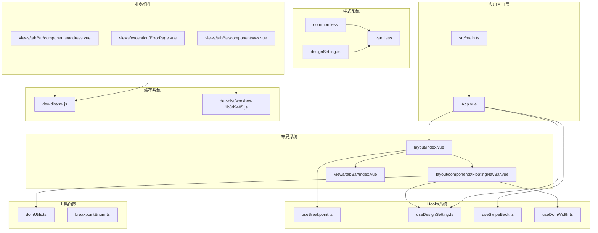
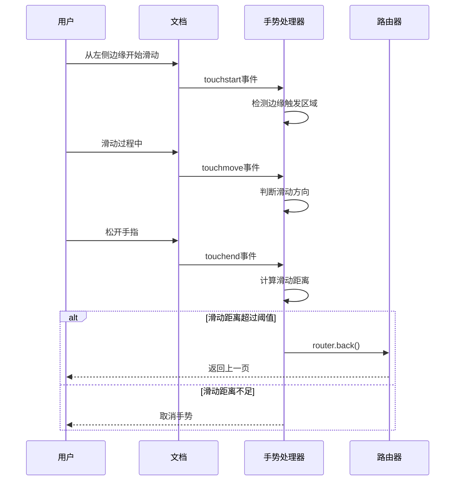
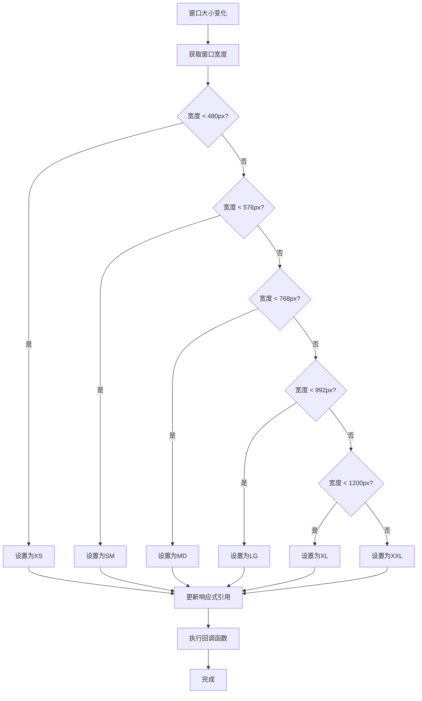
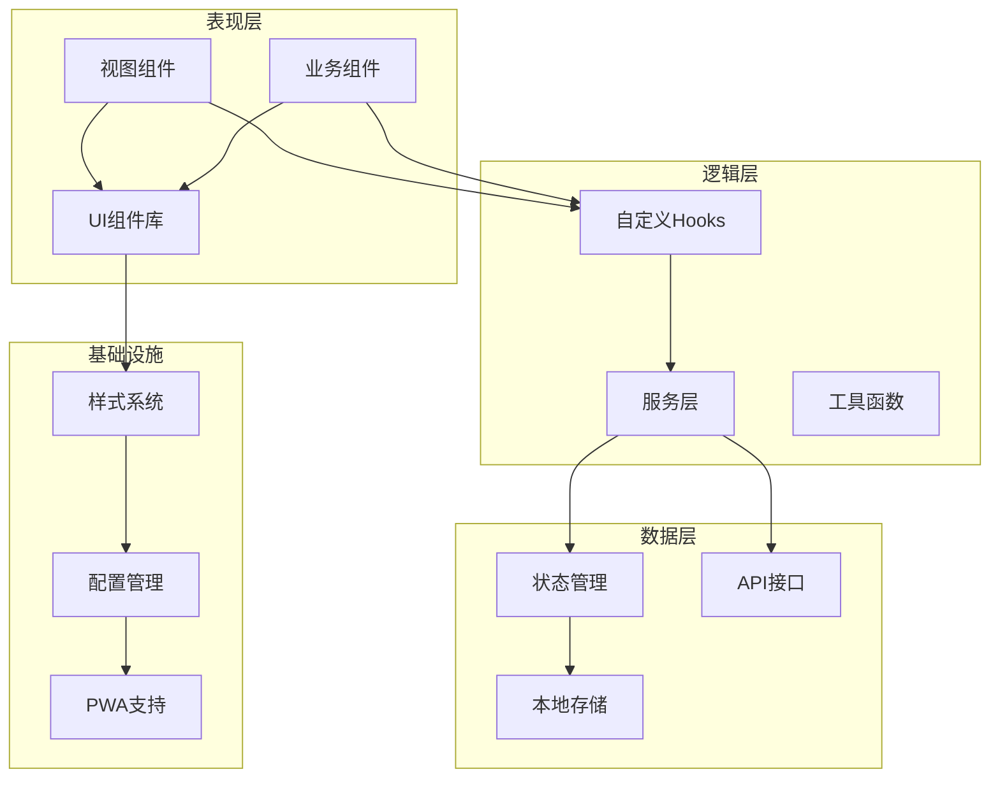
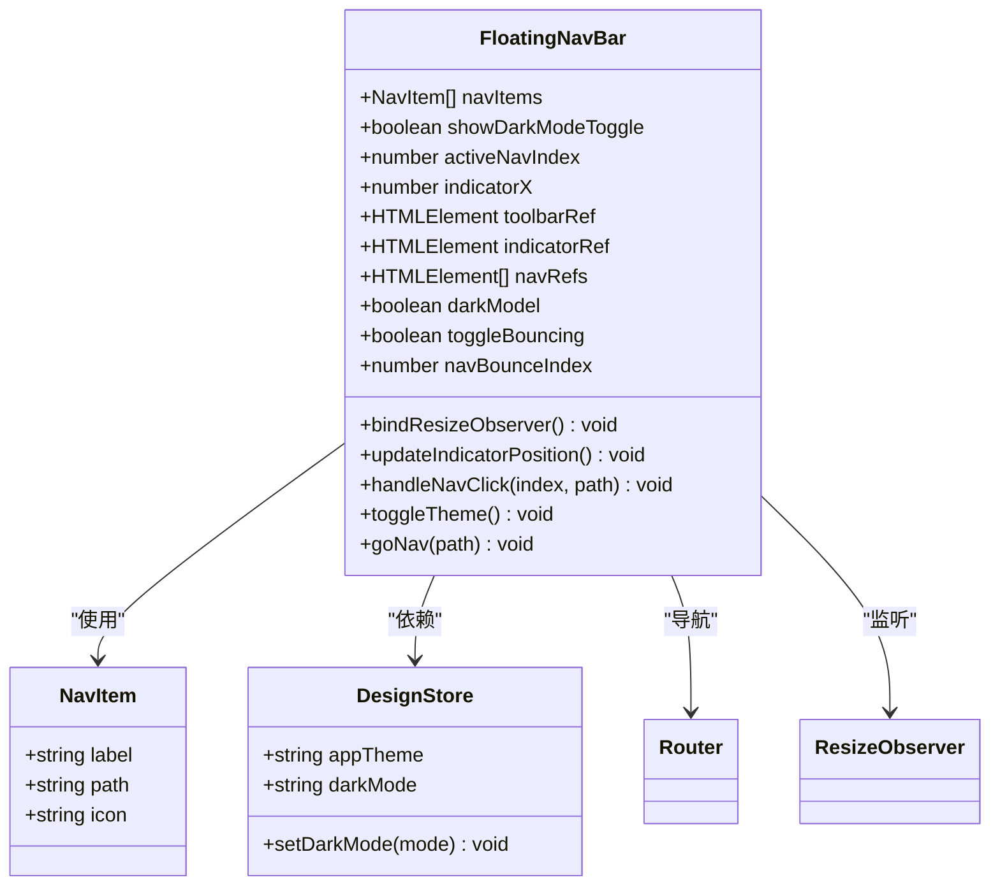
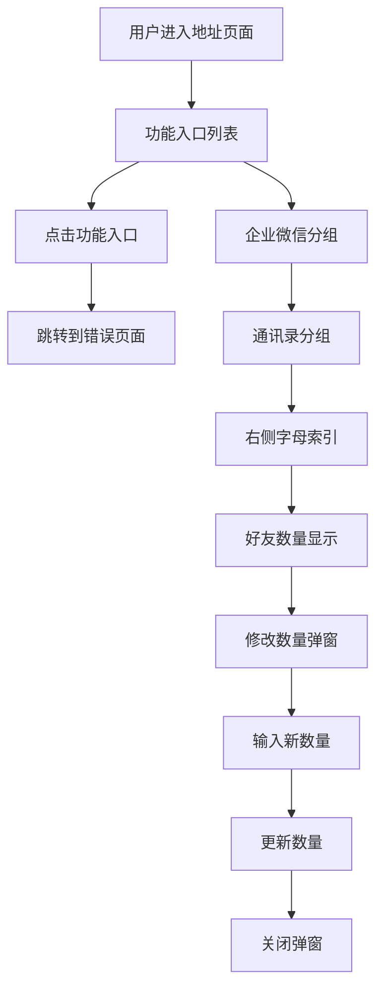
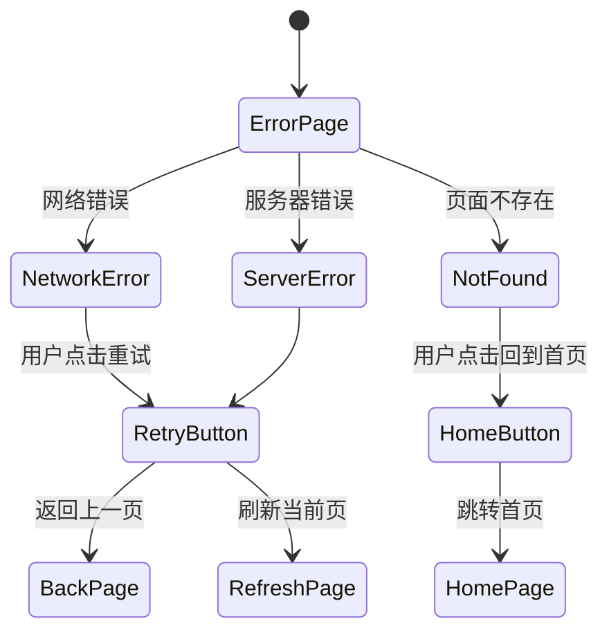
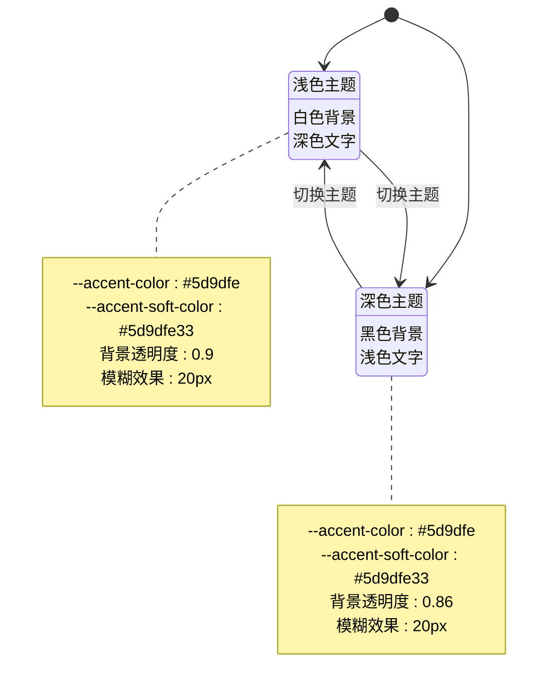

# 移动端UI优化

<cite>
**本文档引用的文件**
- [src/main.ts](file://src/main.ts)
- [src/App.vue](file://src/App.vue)
- [src/layout/index.vue](file://src/layout/index.vue)
- [src/layout/components/FloatingNavBar.vue](file://src/layout/components/FloatingNavBar.vue)
- [src/hooks/event/useBreakpoint.ts](file://src/hooks/event/useBreakpoint.ts)
- [src/hooks/setting/useDesignSetting.ts](file://src/hooks/setting/useDesignSetting.ts)
- [src/hooks/useSwipeBack.ts](file://src/hooks/useSwipeBack.ts)
- [src/hooks/useDomWidth.ts](file://src/hooks/useDomWidth.ts)
- [src/settings/designSetting.ts](file://src/settings/designSetting.ts)
- [src/styles/common.less](file://src/styles/common.less)
- [src/styles/vant.less](file://src/styles/vant.less)
- [src/views/tabBar/index.vue](file://src/views/tabBar/index.vue)
- [src/enums/breakpointEnum.ts](file://src/enums/breakpointEnum.ts)
- [src/utils/domUtils.ts](file://src/utils/domUtils.ts)
- [src/views/tabBar/components/address.vue](file://src/views/tabBar/components/address.vue)
- [src/views/exception/ErrorPage.vue](file://src/views/exception/ErrorPage.vue)
- [dev-dist/sw.js](file://dev-dist/sw.js)
- [src/store/modules/app.ts](file://src/store/modules/app.ts)
- [src/router/index.ts](file://src/router/index.ts)
- [src/router/base.ts](file://src/router/base.ts)
- [src/views/exception/404.vue](file://src/views/exception/404.vue)
- [vite.config.ts](file://vite.config.ts)
- [package.json](file://package.json)
</cite>

## 更新摘要
**变更内容**
- 新增地址组件的交互功能增强说明
- 新增错误页面的移动端适配详细分析
- 新增服务工作线程缓存优化策略详解
- 更新浮动导航栏组件的响应式设计分析
- 增强主题系统的移动端适配说明

## 目录
1. [简介](#简介)
2. [项目结构](#项目结构)
3. [核心组件](#核心组件)
4. [架构概览](#架构概览)
5. [详细组件分析](#详细组件分析)
6. [移动端UI优化策略](#移动端ui优化策略)
7. [服务工作线程缓存优化](#服务工作线程缓存优化)
8. [依赖关系分析](#依赖关系分析)
9. [性能考虑](#性能考虑)
10. [故障排除指南](#故障排除指南)
11. [结论](#结论)

## 简介

这是一个基于Vue3和Vant4的微信H5移动端UI优化项目。项目专注于移动端用户体验的全面优化，包括手势导航、响应式设计、主题系统、性能优化等多个方面。通过现代化的前端技术栈和精心设计的UI组件，为用户提供流畅、直观的移动应用体验。

**更新** 本次更新重点增强了地址组件的交互功能，新增了错误页面的移动端适配说明，并完善了服务工作线程缓存优化策略。

## 项目结构

该项目采用模块化架构设计，主要分为以下几个核心部分：



**图表来源**
- [src/main.ts:1-61](file://src/main.ts#L1-L61)
- [src/App.vue:1-80](file://src/App.vue#L1-L80)
- [src/layout/index.vue:1-60](file://src/layout/index.vue#L1-L60)
- [src/views/tabBar/components/address.vue:1-224](file://src/views/tabBar/components/address.vue#L1-L224)
- [src/views/exception/ErrorPage.vue:1-59](file://src/views/exception/ErrorPage.vue#L1-L59)
- [dev-dist/sw.js:1-113](file://dev-dist/sw.js#L1-L113)

**章节来源**
- [src/main.ts:1-61](file://src/main.ts#L1-L61)
- [src/App.vue:1-80](file://src/App.vue#L1-L80)
- [src/layout/index.vue:1-60](file://src/layout/index.vue#L1-L60)

## 核心组件

### 移动端手势导航系统

项目实现了完整的移动端手势导航系统，包括左边缘滑动返回功能和浮动导航栏。



**图表来源**
- [src/hooks/useSwipeBack.ts:10-74](file://src/hooks/useSwipeBack.ts#L10-L74)

### 响应式断点管理系统

系统采用灵活的断点管理机制，支持多种屏幕尺寸的适配。



**图表来源**
- [src/hooks/event/useBreakpoint.ts:29-95](file://src/hooks/event/useBreakpoint.ts#L29-L95)

**章节来源**
- [src/hooks/useSwipeBack.ts:1-74](file://src/hooks/useSwipeBack.ts#L1-L74)
- [src/hooks/event/useBreakpoint.ts:1-96](file://src/hooks/event/useBreakpoint.ts#L1-L96)

## 架构概览

项目采用分层架构设计，确保各层职责清晰，便于维护和扩展。



**图表来源**
- [src/App.vue:17-75](file://src/App.vue#L17-L75)
- [src/layout/index.vue:32-49](file://src/layout/index.vue#L32-L49)

## 详细组件分析

### 浮动导航栏组件

FloatingNavBar是项目的核心UI组件之一，提供了现代化的移动端导航体验。



**图表来源**
- [src/layout/components/FloatingNavBar.vue:62-278](file://src/layout/components/FloatingNavBar.vue#L62-L278)

#### 组件特性

1. **动态指示器系统**: 实现了流畅的导航指示器动画效果
2. **主题适配**: 支持深色/浅色模式自动切换
3. **响应式布局**: 自适应不同屏幕尺寸的导航栏
4. **触觉反馈**: 提供点击动画和过渡效果

### 地址组件交互优化

地址组件是微信H5应用的重要组成部分，经过优化后提供了更丰富的交互体验。



**图表来源**
- [src/views/tabBar/components/address.vue:164-218](file://src/views/tabBar/components/address.vue#L164-L218)

#### 组件特性

1. **功能入口丰富**: 包含新的朋友、仅聊天的朋友、群聊、标签、公众号、服务号等功能入口
2. **企业微信集成**: 提供企业微信联系人和通知的专门分组
3. **通讯录管理**: 支持按字母分组的完整通讯录展示
4. **交互优化**: 右侧字母索引栏提供快速导航，底部好友数量可配置
5. **性能优化**: 预加载头像图片，提升列表滚动性能

**章节来源**
- [src/layout/components/FloatingNavBar.vue:1-549](file://src/layout/components/FloatingNavBar.vue#L1-L549)
- [src/views/tabBar/components/address.vue:1-224](file://src/views/tabBar/components/address.vue#L1-L224)

### 错误页面移动端适配

错误页面针对移动端进行了专门的适配优化，提供更好的用户体验。



**图表来源**
- [src/views/exception/ErrorPage.vue:49-57](file://src/views/exception/ErrorPage.vue#L49-L57)

#### 适配特性

1. **移动端导航栏**: 使用Vant的NavBar组件，支持左右图标按钮
2. **响应式布局**: 采用flex布局，适配不同屏幕尺寸
3. **触控优化**: 按钮尺寸适合移动端触控操作
4. **智能重试**: 根据历史记录长度智能判断重试行为

**章节来源**
- [src/views/exception/ErrorPage.vue:1-59](file://src/views/exception/ErrorPage.vue#L1-L59)
- [src/views/exception/404.vue:1-41](file://src/views/exception/404.vue#L1-L41)

## 移动端UI优化策略

### 响应式设计策略

项目采用了多层次的响应式设计策略：

1. **断点管理**: 基于breakpointEnum.ts定义的XS、SM、MD、LG、XL、XXL断点
2. **弹性布局**: 使用Flexbox和CSS Grid实现自适应布局
3. **媒体查询**: 针对不同设备类型提供专门的样式优化
4. **触摸友好的交互**: 所有交互元素都经过移动端优化

### 主题系统优化

设计设置系统支持深色/浅色模式的无缝切换：



**图表来源**
- [src/App.vue:32-74](file://src/App.vue#L32-L74)
- [src/settings/designSetting.ts:38-52](file://src/settings/designSetting.ts#L38-L52)

**章节来源**
- [src/settings/designSetting.ts:1-52](file://src/settings/designSetting.ts#L1-L52)
- [src/enums/breakpointEnum.ts:1-29](file://src/enums/breakpointEnum.ts#L1-L29)

## 服务工作线程缓存优化

### 缓存策略架构

项目使用Workbox实现PWA缓存优化，针对移动端网络环境进行了专门优化：

```mermaid
graph TB
subgraph "缓存策略"
Navigation[NavigationRoute<br/>导航缓存]
API[NetworkFirst<br/>API缓存]
Image[CacheFirst<br/>图片缓存]
Font[CacheFirst<br/>字体缓存]
end
subgraph "缓存配置"
APIConfig[API缓存配置<br/>maxEntries: 100<br/>maxAgeSeconds: 86400<br/>statuses: [0,200]]
ImageConfig[图片缓存配置<br/>maxEntries: 200<br/>maxAgeSeconds: 2592000]
FontConfig[字体缓存配置<br/>maxEntries: 50<br/>maxAgeSeconds: 31536000]
end
subgraph "运行时缓存"
RuntimeCache[Runtime缓存]
Cleanup[缓存清理]
end
Navigation --> RuntimeCache
API --> APIConfig
Image --> ImageConfig
Font --> FontConfig
APIConfig --> Cleanup
ImageConfig --> Cleanup
FontConfig --> Cleanup
```

**图表来源**
- [dev-dist/sw.js:85-110](file://dev-dist/sw.js#L85-L110)

### 缓存优化策略

1. **API缓存**: 使用NetworkFirst策略，最大缓存100个请求，有效期24小时
2. **图片缓存**: 使用CacheFirst策略，最大缓存200张图片，有效期30天
3. **字体缓存**: 使用CacheFirst策略，最大缓存50个字体文件，有效期1年
4. **导航缓存**: 预缓存index.html，支持离线导航

### 移动端网络优化

针对移动端网络特点，项目实现了以下优化：

1. **网络超时处理**: API请求设置合理的超时时间，避免长时间等待
2. **离线支持**: 完整的离线页面支持，包括404页面和错误页面
3. **缓存清理**: 自动清理过期缓存，避免占用过多存储空间
4. **渐进式缓存**: 逐步缓存常用资源，提升首次加载速度

**章节来源**
- [dev-dist/sw.js:1-113](file://dev-dist/sw.js#L1-113)
- [vite.config.ts:125-134](file://vite.config.ts#L125-L134)

## 依赖关系分析

项目使用现代化的前端技术栈，各依赖项协同工作以提供最佳的移动端体验。

```mermaid
graph TB
subgraph "核心框架"
Vue[Vue 3.5.30]
Router[Vue Router 5.0.4]
Pinia[Pinia 3.0.4]
end
subgraph "UI组件库"
Vant[Vant 4.9.22]
UnoCSS[UnoCSS 66.6.7]
end
subgraph "工具库"
VueUse[@vueuse/core 14.2.1]
Lodash[lodash-es 4.17.21]
Axios[Axios 1.4.0]
end
subgraph "构建工具"
Vite[Vite 8.0.2]
TypeScript[TypeScript 5.9.3]
Less[Less 4.2.0]
end
subgraph "开发工具"
ESLint[ESLint 8.57.0]
Workbox[Workbox 7.4.0]
MockJS[MockJS 1.1.0]
end
Vue --> Router
Vue --> Pinia
Vue --> Vant
Vant --> UnoCSS
Vue --> VueUse
Vue --> Lodash
Vue --> Axios
Vite --> TypeScript
Vite --> Less
Vite --> ESLint
Vite --> PWA
```

**图表来源**
- [package.json:37-106](file://package.json#L37-L106)

**章节来源**
- [package.json:1-120](file://package.json#L1-L120)

## 性能考虑

### 移动端性能优化策略

1. **手势性能优化**: 使用passive事件监听器避免阻塞主线程
2. **渲染性能优化**: 采用requestAnimationFrame进行动画同步
3. **内存管理**: 合理的事件监听器清理和组件生命周期管理
4. **资源加载**: 通过PWA技术实现离线缓存和快速加载

### 样式系统优化

项目采用了多层次的样式优化策略：

- **CSS变量系统**: 支持动态主题切换，避免重复样式定义
- **响应式设计**: 基于断点的自适应布局，减少媒体查询数量
- **性能优先**: 使用transform和opacity属性进行动画，避免重排重绘

### 缓存性能优化

1. **预缓存策略**: 关键资源在安装时预缓存
2. **智能缓存**: 根据资源类型和使用频率选择合适的缓存策略
3. **缓存清理**: 定期清理过期缓存，保持最佳性能
4. **渐进式加载**: 重要资源优先加载，次要资源异步加载

**章节来源**
- [src/main.ts:28-36](file://src/main.ts#L28-L36)
- [src/styles/common.less:1-136](file://src/styles/common.less#L1-L136)

## 故障排除指南

### 常见问题及解决方案

1. **手势不响应问题**
   - 检查是否正确初始化了useSwipeBack钩子
   - 确认事件监听器是否被正确移除
   - 验证passive选项配置

2. **主题切换异常**
   - 检查CSS变量是否正确更新
   - 确认DesignStore的状态同步
   - 验证Vant组件的主题配置

3. **断点检测失效**
   - 检查window.resize事件绑定
   - 验证断点枚举值的正确性
   - 确认debounce函数的配置

4. **缓存问题**
   - 检查Service Worker注册状态
   - 验证缓存策略配置
   - 确认缓存清理逻辑

**章节来源**
- [src/hooks/useSwipeBack.ts:62-73](file://src/hooks/useSwipeBack.ts#L62-L73)
- [src/hooks/event/useBreakpoint.ts:61-95](file://src/hooks/event/useBreakpoint.ts#L61-L95)

## 结论

本项目通过精心设计的移动端UI优化方案，为用户提供了优秀的移动应用体验。主要特点包括：

1. **完整的手势导航系统**：支持微信风格的滑动返回和浮动导航
2. **灵活的响应式设计**：基于断点的自适应布局系统
3. **现代化的主题系统**：支持深色/浅色模式和动态主题切换
4. **完善的缓存优化**：基于Workbox的服务工作线程缓存策略
5. **丰富的交互组件**：地址组件和错误页面的移动端优化
6. **性能优化**：采用多项移动端性能优化策略
7. **可维护性**：模块化的架构设计，便于后续扩展和维护

**更新** 本次更新重点增强了地址组件的交互功能，新增了错误页面的移动端适配说明，并完善了服务工作线程缓存优化策略，进一步提升了项目的移动端用户体验和性能表现。

项目的技术选型合理，实现方案成熟，在移动端UI优化方面具有良好的参考价值和实践意义。