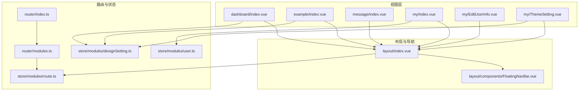
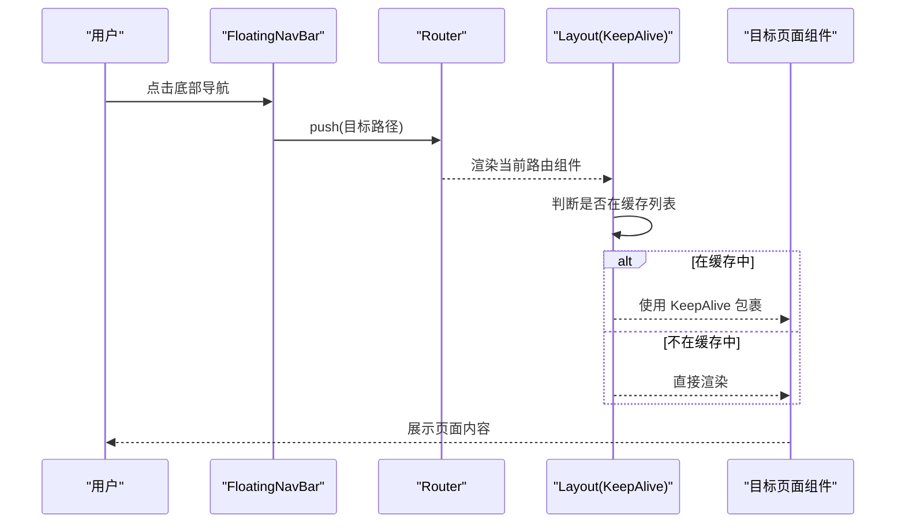
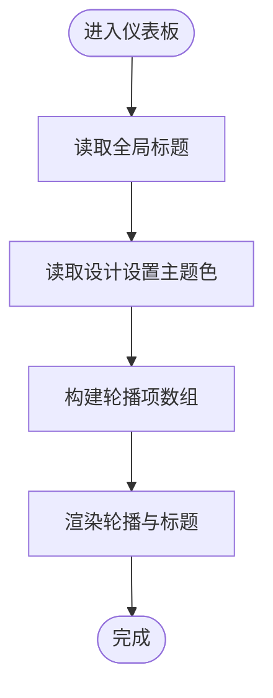
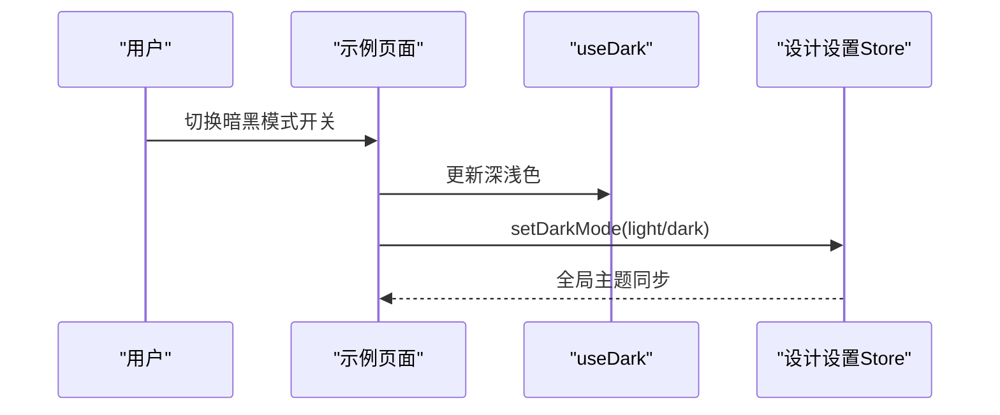
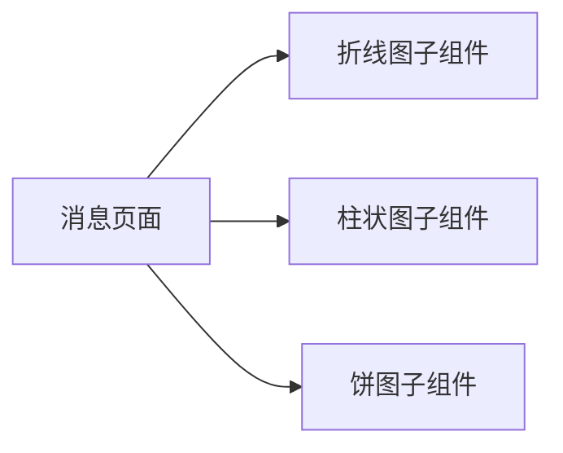
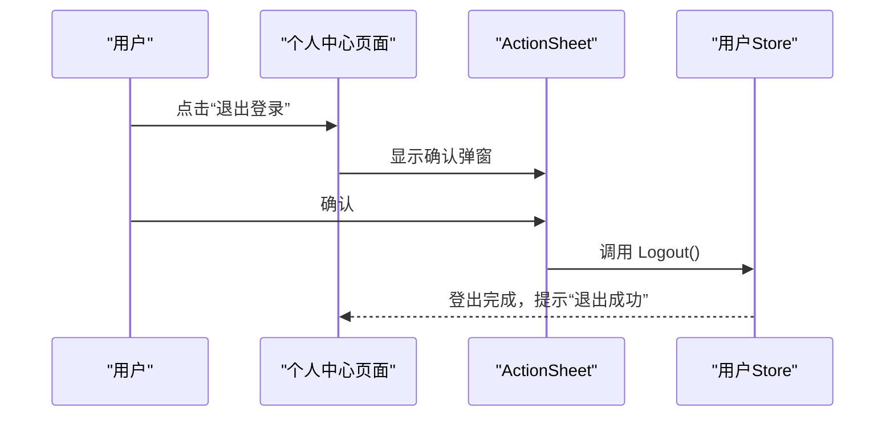
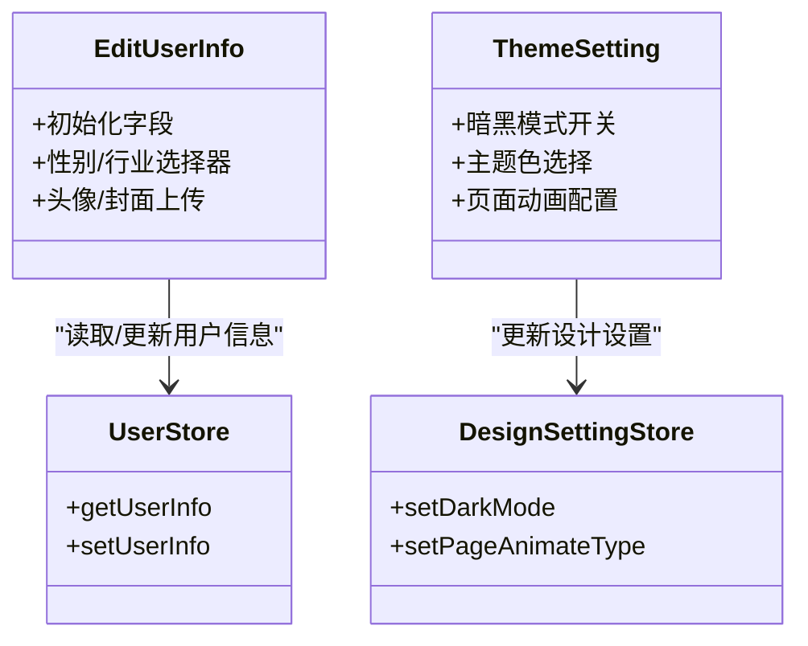
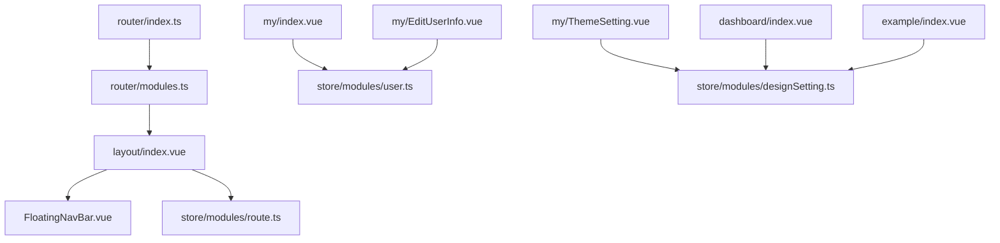

# 页面组件

<cite>
**本文引用的文件**
- [dashboard/index.vue](file://src/views/dashboard/index.vue)
- [example/index.vue](file://src/views/example/index.vue)
- [message/index.vue](file://src/views/message/index.vue)
- [my/index.vue](file://src/views/my/index.vue)
- [my/EditUserInfo.vue](file://src/views/my/EditUserInfo.vue)
- [my/ThemeSetting.vue](file://src/views/my/ThemeSetting.vue)
- [layout/index.vue](file://src/layout/index.vue)
- [layout/components/FloatingNavBar.vue](file://src/layout/components/FloatingNavBar.vue)
- [router/index.ts](file://src/router/index.ts)
- [router/modules.ts](file://src/router/modules.ts)
- [store/modules/route.ts](file://src/store/modules/route.ts)
- [store/modules/user.ts](file://src/store/modules/user.ts)
- [store/modules/designSetting.ts](file://src/store/modules/designSetting.ts)
- [settings/designSetting.ts](file://src/settings/designSetting.ts)
- [package.json](file://package.json)
</cite>

## 目录
1. [简介](#简介)
2. [项目结构](#项目结构)
3. [核心组件](#核心组件)
4. [架构总览](#架构总览)
5. [详细组件分析](#详细组件分析)
6. [依赖分析](#依赖分析)
7. [性能考虑](#性能考虑)
8. [故障排查指南](#故障排查指南)
9. [结论](#结论)
10. [附录](#附录)

## 简介
本文件面向 Vue3 微信 H5 移动端项目中的页面组件，系统性梳理仪表板、示例、消息、个人中心等页面的设计理念、数据流、组件组合与状态管理；深入解析页面间导航关系与路由配置（含跳转逻辑与参数传递）；提供页面组件的可配置项与扩展方法；并总结性能优化策略与用户体验改进建议，帮助开发者高效完成页面开发与维护。

## 项目结构
本项目采用“视图层按页面组织 + 布局与导航统一承载 + 路由与状态集中管理”的分层设计。页面位于 views 下，布局与浮动导航在 layout 中，路由在 router 中集中定义，状态通过 Pinia 的模块化 Store 管理。

**图表来源**
- [layout/index.vue:1-60](file://src/layout/index.vue#L1-L60)
- [layout/components/FloatingNavBar.vue:1-549](file://src/layout/components/FloatingNavBar.vue#L1-L549)
- [router/index.ts:1-33](file://src/router/index.ts#L1-L33)
- [router/modules.ts:1-147](file://src/router/modules.ts#L1-L147)
- [store/modules/route.ts:1-40](file://src/store/modules/route.ts#L1-L40)
- [store/modules/user.ts:1-115](file://src/store/modules/user.ts#L1-L115)
- [store/modules/designSetting.ts:1-52](file://src/store/modules/designSetting.ts#L1-L52)
- [dashboard/index.vue:1-131](file://src/views/dashboard/index.vue#L1-L131)
- [example/index.vue:1-47](file://src/views/example/index.vue#L1-L47)
- [message/index.vue:1-44](file://src/views/message/index.vue#L1-L44)
- [my/index.vue:1-145](file://src/views/my/index.vue#L1-L145)
- [my/EditUserInfo.vue:1-183](file://src/views/my/EditUserInfo.vue#L1-L183)
- [my/ThemeSetting.vue:1-120](file://src/views/my/ThemeSetting.vue#L1-L120)

**章节来源**
- [layout/index.vue:1-60](file://src/layout/index.vue#L1-L60)
- [layout/components/FloatingNavBar.vue:1-549](file://src/layout/components/FloatingNavBar.vue#L1-L549)
- [router/index.ts:1-33](file://src/router/index.ts#L1-L33)
- [router/modules.ts:1-147](file://src/router/modules.ts#L1-L147)

## 核心组件
- 布局壳与页面容器：layout/index.vue 提供统一的 RouterView 容器，并通过 KeepAlive 控制页面缓存。
- 浮动导航栏：layout/components/FloatingNavBar.vue 提供底部悬浮导航，支持主题切换、活跃指示器与点击反馈。
- 页面路由：router/modules.ts 定义各页面路由与子路由，支持内嵌页面与 keep-alive 配置。
- 状态管理：
  - 用户状态：store/modules/user.ts 提供用户信息、登录、登出与 Token 管理。
  - 设计设置：store/modules/designSetting.ts 提供主题、暗色模式、页面动画等全局设计配置。
  - 路由状态：store/modules/route.ts 维护菜单、路由表与需要缓存的组件名集合。

**章节来源**
- [layout/index.vue:1-60](file://src/layout/index.vue#L1-L60)
- [layout/components/FloatingNavBar.vue:1-549](file://src/layout/components/FloatingNavBar.vue#L1-L549)
- [router/modules.ts:1-147](file://src/router/modules.ts#L1-L147)
- [store/modules/user.ts:1-115](file://src/store/modules/user.ts#L1-L115)
- [store/modules/designSetting.ts:1-52](file://src/store/modules/designSetting.ts#L1-L52)
- [store/modules/route.ts:1-40](file://src/store/modules/route.ts#L1-L40)

## 架构总览
页面组件围绕“布局 + 导航 + 路由 + 状态”四要素协作：

**图表来源**
- [layout/components/FloatingNavBar.vue:196-220](file://src/layout/components/FloatingNavBar.vue#L196-L220)
- [layout/index.vue:6-13](file://src/layout/index.vue#L6-L13)
- [router/modules.ts:1-147](file://src/router/modules.ts#L1-L147)
- [store/modules/route.ts:29-32](file://src/store/modules/route.ts#L29-L32)

## 详细组件分析

### 仪表板页面（dashboard）
- 功能定位：首页引导与特性展示，包含轮播图与标题信息。
- 数据流与状态：
  - 读取全局标题与主题色，用于标题样式与轮播指示器渐变。
  - 主题色来自设计设置 Store，标题文案来自全局设置钩子。
- 组件组合：
  - 使用 Vant Swipe/SwipeItem 实现横幅轮播。
  - 标题与轮播项文本通过计算属性生成。
- 样式与主题：
  - 根据深浅色主题切换标题与文字颜色。
  - 轮播指示器颜色与应用主题一致。

**图表来源**
- [dashboard/index.vue:27-76](file://src/views/dashboard/index.vue#L27-L76)
- [store/modules/designSetting.ts:16-32](file://src/store/modules/designSetting.ts#L16-L32)

**章节来源**
- [dashboard/index.vue:1-131](file://src/views/dashboard/index.vue#L1-L131)
- [store/modules/designSetting.ts:1-52](file://src/store/modules/designSetting.ts#L1-L52)

### 示例页面（example）
- 功能定位：演示页面，包含暗黑模式开关与若干入口链接。
- 数据流与状态：
  - 使用 @vueuse/core 的 useDark 同步深浅色模式。
  - 通过设计设置 Store 更新全局暗色模式。
- 组件组合：
  - 使用 Vant Cell/CellGroup/Cell 与 Switch 构建设置项。
  - 跳转到“keep-alive”演示与 404 页面。
- 可扩展点：
  - 新增菜单项时，在 menuItems 中追加对象即可。

**图表来源**
- [example/index.vue:18-42](file://src/views/example/index.vue#L18-L42)
- [store/modules/designSetting.ts:34-40](file://src/store/modules/designSetting.ts#L34-L40)

**章节来源**
- [example/index.vue:1-47](file://src/views/example/index.vue#L1-L47)
- [store/modules/designSetting.ts:1-52](file://src/store/modules/designSetting.ts#L1-L52)

### 消息页面（message）
- 功能定位：数据概览与可视化展示，聚合折线图、柱状图、饼图三个子组件。
- 数据流与状态：
  - 作为容器页面，负责引入并组织图表子组件。
  - 图表内部使用 ECharts Hooks（由 hooks/web/useECharts 提供）进行渲染。
- 组件组合：
  - 引入 lineChart/barChart/pieChart 子组件并在模板中渲染。
  - 顶部标题区配合深浅色主题样式。
- 扩展建议：
  - 新增图表时，只需新增子组件并在该页面引入后添加到模板。

**图表来源**
- [message/index.vue:1-16](file://src/views/message/index.vue#L1-L16)

**章节来源**
- [message/index.vue:1-44](file://src/views/message/index.vue#L1-L44)

### 个人中心页面（my）
- 功能定位：用户资料卡片、快捷入口与登出操作。
- 数据流与状态：
  - 从用户 Store 读取头像、昵称、签名、背景等信息。
  - 登出时调用用户 Store 的 Logout，清除本地存储并跳转登录页。
- 组件组合：
  - 使用 Vant Image/Cell/Divider/ActionSheet 构建卡片与操作面板。
  - 背景图根据 cover 或 avatar 动态设置。
- 导航关系：
  - 个人信息、账号与安全、主题设置等入口跳转至对应内嵌页面。
  - 退出登录弹出 ActionSheet 确认后执行登出流程。

**图表来源**
- [my/index.vue:65-88](file://src/views/my/index.vue#L65-L88)
- [store/modules/user.ts:92-107](file://src/store/modules/user.ts#L92-L107)

**章节来源**
- [my/index.vue:1-145](file://src/views/my/index.vue#L1-L145)
- [store/modules/user.ts:1-115](file://src/store/modules/user.ts#L1-L115)

### 个人中心内嵌页面（编辑资料、主题设置等）
- 编辑资料（EditUserInfo）：
  - 读取用户 Store 初始化表单字段，支持性别与行业选择器。
  - 头像与封面通过上传组件 UploaderImage 支持图片上传。
- 主题设置（ThemeSetting）：
  - 切换暗黑模式、选择主题色、配置页面切换动画类型。
  - 动画类型来源于动画配置，支持弹窗选择并持久化。

**图表来源**
- [my/EditUserInfo.vue:114-170](file://src/views/my/EditUserInfo.vue#L114-L170)
- [my/ThemeSetting.vue:70-117](file://src/views/my/ThemeSetting.vue#L70-L117)
- [store/modules/user.ts:42-62](file://src/store/modules/user.ts#L42-L62)
- [store/modules/designSetting.ts:34-40](file://src/store/modules/designSetting.ts#L34-L40)

**章节来源**
- [my/EditUserInfo.vue:1-183](file://src/views/my/EditUserInfo.vue#L1-L183)
- [my/ThemeSetting.vue:1-120](file://src/views/my/ThemeSetting.vue#L1-L120)
- [store/modules/user.ts:1-115](file://src/store/modules/user.ts#L1-L115)
- [store/modules/designSetting.ts:1-52](file://src/store/modules/designSetting.ts#L1-L52)

## 依赖分析
- 路由与导航：
  - 路由注册在 router/index.ts 中，加载 modules.ts 定义的页面路由。
  - 布局组件 layout/index.vue 将路由渲染结果交由 KeepAlive 控制缓存。
  - 浮动导航 FloatingNavBar.vue 负责底部导航与主题切换。
- 状态管理：
  - 用户 Store 管理登录态与用户信息，提供登出与信息获取。
  - 设计设置 Store 管理主题、暗色模式与页面动画，支持持久化。
  - 路由 Store 维护菜单与需要缓存的组件名集合。
- 依赖关系图：

**图表来源**
- [router/index.ts:1-33](file://src/router/index.ts#L1-L33)
- [router/modules.ts:1-147](file://src/router/modules.ts#L1-L147)
- [layout/index.vue:1-60](file://src/layout/index.vue#L1-L60)
- [layout/components/FloatingNavBar.vue:1-549](file://src/layout/components/FloatingNavBar.vue#L1-L549)
- [store/modules/route.ts:1-40](file://src/store/modules/route.ts#L1-L40)
- [store/modules/user.ts:1-115](file://src/store/modules/user.ts#L1-L115)
- [store/modules/designSetting.ts:1-52](file://src/store/modules/designSetting.ts#L1-L52)
- [dashboard/index.vue:1-131](file://src/views/dashboard/index.vue#L1-L131)
- [example/index.vue:1-47](file://src/views/example/index.vue#L1-L47)
- [my/index.vue:1-145](file://src/views/my/index.vue#L1-L145)
- [my/EditUserInfo.vue:1-183](file://src/views/my/EditUserInfo.vue#L1-L183)
- [my/ThemeSetting.vue:1-120](file://src/views/my/ThemeSetting.vue#L1-L120)

**章节来源**
- [router/index.ts:1-33](file://src/router/index.ts#L1-L33)
- [router/modules.ts:1-147](file://src/router/modules.ts#L1-L147)
- [layout/index.vue:1-60](file://src/layout/index.vue#L1-L60)
- [layout/components/FloatingNavBar.vue:1-549](file://src/layout/components/FloatingNavBar.vue#L1-L549)
- [store/modules/route.ts:1-40](file://src/store/modules/route.ts#L1-L40)
- [store/modules/user.ts:1-115](file://src/store/modules/user.ts#L1-L115)
- [store/modules/designSetting.ts:1-52](file://src/store/modules/designSetting.ts#L1-L52)

## 性能考虑
- 页面缓存与复用
  - 通过路由模块中的 keepAlive 配置控制页面缓存，减少重复渲染与请求。
  - 布局层使用 KeepAlive 包裹，仅对命中 include 的组件生效。
- 主题与动画
  - 设计设置 Store 支持持久化，避免每次进入页面重新计算主题。
  - 页面切换动画可按需关闭或选择轻量动画类型，降低过渡成本。
- 图表渲染
  - 图表使用 ECharts Hooks，建议在数据变化时使用防抖与最小化更新策略。
- 资源加载
  - 图片资源优先懒加载，封面与头像使用合适的尺寸与格式以减小体积。
- 路由守卫
  - 路由守卫可结合权限与登录态做前置校验，避免无效渲染。

[本节为通用性能建议，不直接分析具体文件，故无章节来源]

## 故障排查指南
- 登录态异常
  - 现象：进入页面后用户信息为空或频繁刷新。
  - 排查：检查用户 Store 的 Token 与用户信息是否正确持久化；确认路由守卫是否拦截了未登录访问。
- 主题切换不同步
  - 现象：切换暗色模式后部分组件未更新。
  - 排查：确认设计设置 Store 的 setDarkMode 是否被调用；检查全局深色类是否正确挂载到根节点。
- 页面缓存失效
  - 现象：切换页面后数据丢失或重复请求。
  - 排查：核对路由模块中 keepAlive 配置；确认布局层 KeepAlive 的 include 列表是否包含目标组件名。
- 导航点击无效
  - 现象：底部导航点击无响应。
  - 排查：检查 FloatingNavBar 的 goNav 逻辑与路由路径是否匹配；确认路由守卫是否抛出了重复导航错误。

**章节来源**
- [store/modules/user.ts:92-107](file://src/store/modules/user.ts#L92-L107)
- [store/modules/designSetting.ts:34-40](file://src/store/modules/designSetting.ts#L34-L40)
- [router/modules.ts:1-147](file://src/router/modules.ts#L1-L147)
- [layout/index.vue:6-13](file://src/layout/index.vue#L6-L13)
- [layout/components/FloatingNavBar.vue:196-220](file://src/layout/components/FloatingNavBar.vue#L196-L220)

## 结论
本项目通过清晰的页面分层、统一的布局与导航、完善的路由与状态管理，实现了微信 H5 移动端页面的高内聚低耦合。仪表板、示例、消息、个人中心等页面各司其职，配合浮动导航与缓存机制，兼顾了用户体验与开发效率。遵循本文的配置与扩展建议，可进一步提升页面性能与可维护性。

[本节为总结性内容，不直接分析具体文件，故无章节来源]

## 附录

### 页面导航关系与路由配置要点
- 路由注册
  - 在 router/modules.ts 中定义页面路由与子路由，支持内嵌页面与 keepAlive 配置。
  - 在 router/index.ts 中合并常量路由与动态模块路由，创建路由实例并挂载路由守卫。
- 布局与缓存
  - layout/index.vue 通过 KeepAlive 控制页面缓存，include 来自路由 Store。
  - FloatingNavBar.vue 提供底部导航与主题切换，自动识别当前活跃项并更新指示器。
- 页面跳转与参数传递
  - 页面内跳转使用 Vue Router 的 to 或编程式导航 push。
  - 参数传递可通过路由传参或通过状态管理共享数据。

**章节来源**
- [router/modules.ts:1-147](file://src/router/modules.ts#L1-L147)
- [router/index.ts:1-33](file://src/router/index.ts#L1-L33)
- [layout/index.vue:1-60](file://src/layout/index.vue#L1-L60)
- [layout/components/FloatingNavBar.vue:1-549](file://src/layout/components/FloatingNavBar.vue#L1-L549)

### 页面组件配置与扩展方法
- 仪表板
  - 可在轮播数据中新增条目，或调整标题与样式变量。
- 示例
  - 在 menuItems 中新增菜单项，即可自动渲染为可跳转入口。
- 消息
  - 新增图表子组件并在消息页面引入，即可在概览中展示。
- 个人中心
  - 新增内嵌页面时，在路由模块中定义并设置 meta（如 innerPage、keepAlive）。
  - 在个人中心卡片中添加入口，指向新页面路径。
- 主题与动画
  - 通过设计设置 Store 的接口更新主题色、暗色模式与动画类型。
  - 主题色列表与默认值可在 settings/designSetting.ts 中调整。

**章节来源**
- [dashboard/index.vue:40-75](file://src/views/dashboard/index.vue#L40-L75)
- [example/index.vue:38-41](file://src/views/example/index.vue#L38-L41)
- [message/index.vue:1-16](file://src/views/message/index.vue#L1-L16)
- [my/index.vue:23-51](file://src/views/my/index.vue#L23-L51)
- [router/modules.ts:88-143](file://src/router/modules.ts#L88-L143)
- [store/modules/designSetting.ts:34-40](file://src/store/modules/designSetting.ts#L34-L40)
- [settings/designSetting.ts:1-52](file://src/settings/designSetting.ts#L1-L52)

### 技术栈与依赖
- 核心依赖：Vue3、Vue Router、Pinia、Vant4、@vueuse/core、ECharts、Less、UnoCSS 等。
- 开发工具：Vite、ESLint、TypeScript、Unocss、MockJS 等。

**章节来源**
- [package.json:41-104](file://package.json#L41-L104)