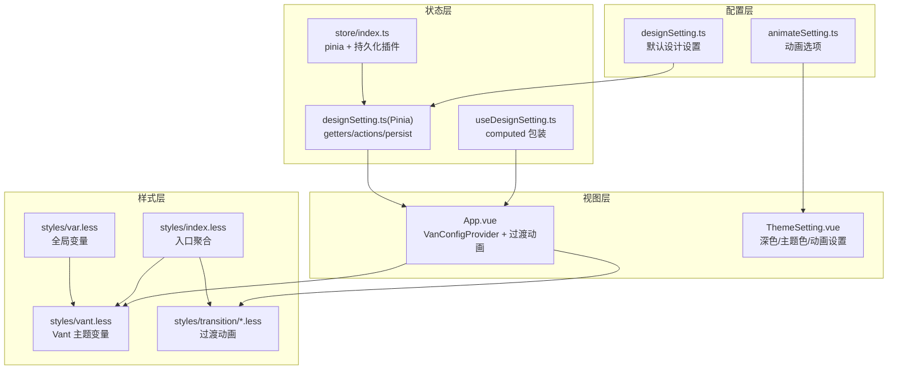
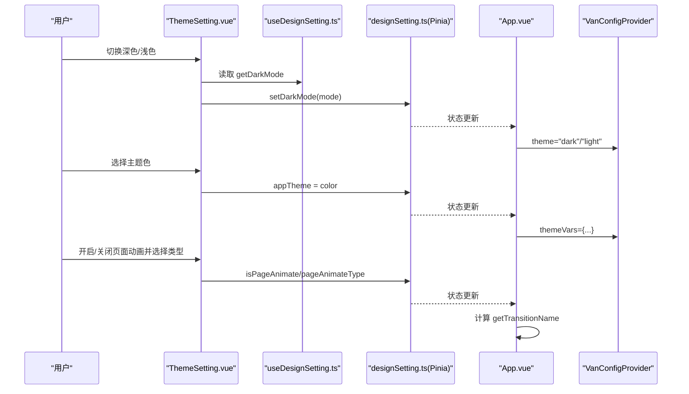
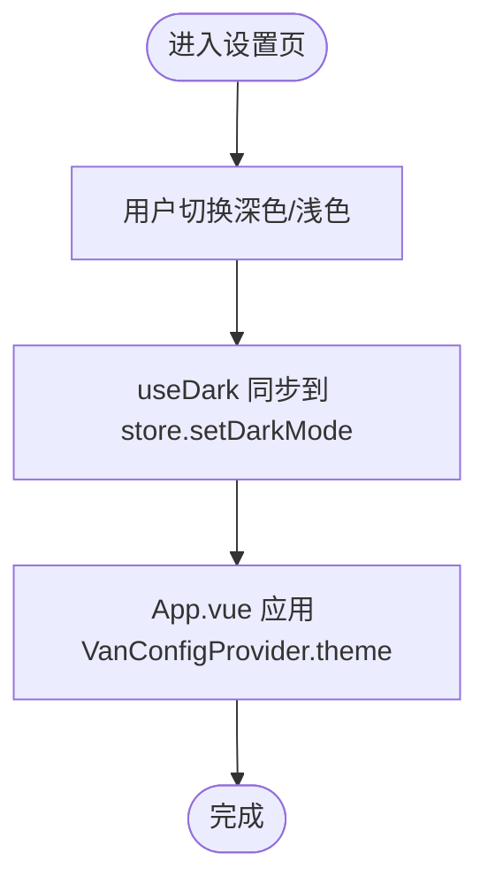
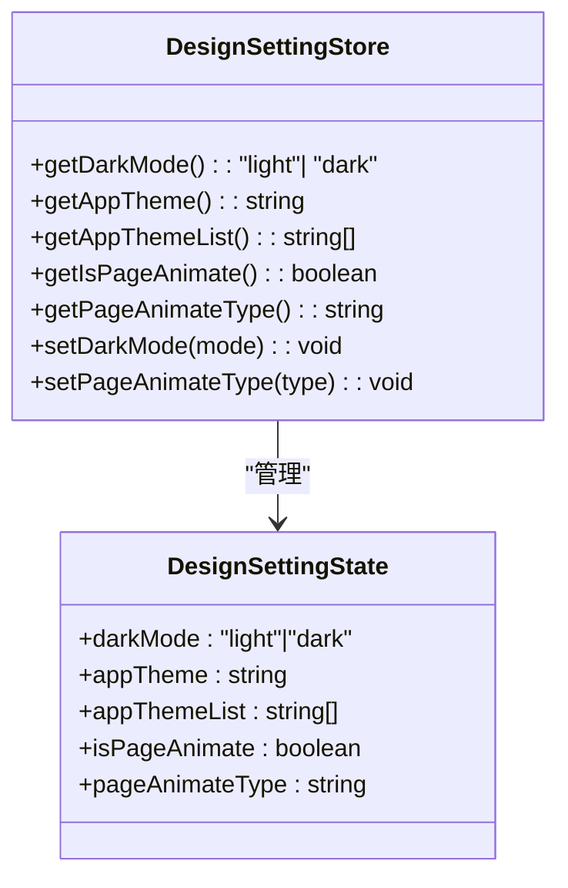
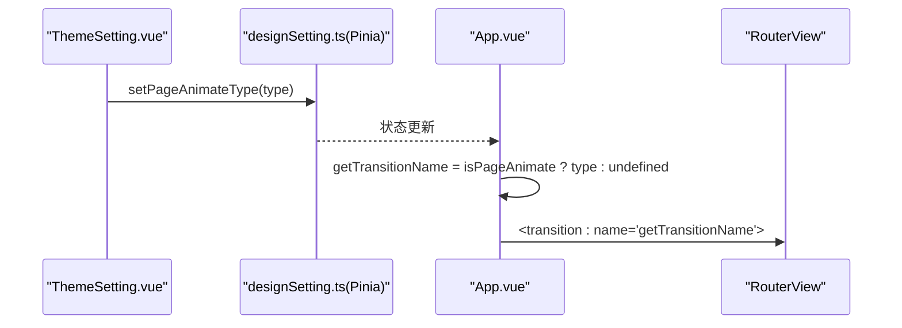
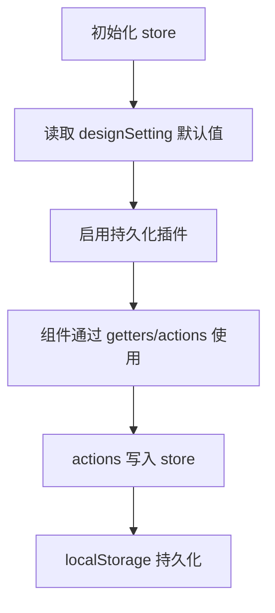
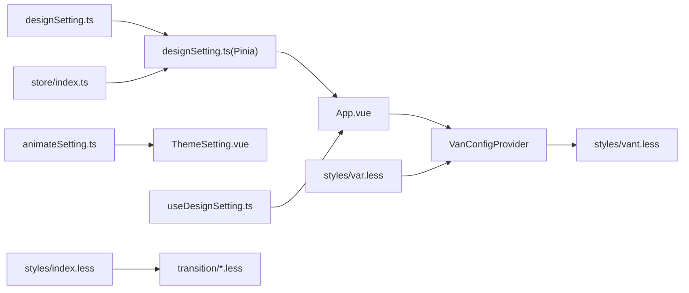

# 主题与设计系统

<cite>
**本文引用的文件**
- [designSetting.ts](file://src/settings/designSetting.ts)
- [designSetting.ts（Pinia Store）](file://src/store/modules/designSetting.ts)
- [useDesignSetting.ts](file://src/hooks/setting/useDesignSetting.ts)
- [ThemeSetting.vue](file://src/views/my/ThemeSetting.vue)
- [App.vue](file://src/App.vue)
- [index.less（样式入口）](file://src/styles/index.less)
- [var.less](file://src/styles/var.less)
- [vant.less](file://src/styles/vant.less)
- [animateSetting.ts](file://src/settings/animateSetting.ts)
- [fade.less](file://src/styles/transition/fade.less)
- [slide.less](file://src/styles/transition/slide.less)
- [zoom.less](file://src/styles/transition/zoom.less)
- [index.less（过渡动画入口）](file://src/styles/transition/index.less)
- [index.ts（Pinia 入口）](file://src/store/index.ts)
- [main.ts](file://src/main.ts)
- [index.ts（工具函数）](file://src/utils/index.ts)
</cite>

## 目录
1. [简介](#简介)
2. [项目结构](#项目结构)
3. [核心组件](#核心组件)
4. [架构总览](#架构总览)
5. [详细组件分析](#详细组件分析)
6. [依赖关系分析](#依赖关系分析)
7. [性能考量](#性能考量)
8. [故障排查指南](#故障排查指南)
9. [结论](#结论)
10. [附录](#附录)

## 简介
本文件面向 Vue3 微信 H5 移动端项目，系统性梳理主题与设计系统，涵盖以下内容：
- 深色/浅色模式的实现原理与切换机制
- 主题色系统：系统主题色检测、自定义主题色设置与持久化策略
- 动画效果配置：页面切换动画、组件过渡效果与交互反馈
- 设计设置的状态管理：在 Pinia store 中维护设计偏好
- 主题系统的 API 接口说明：主题切换、设置查询与变更监听
- 主题定制示例与样式覆盖技巧
- 移动端适配要点：触摸反馈、视觉对比度与可访问性优化
- 扩展与个性化定制指导

## 项目结构
主题与设计系统围绕“配置层 → 状态层 → 视图层”的分层组织：
- 配置层：集中于 settings 下的 designSetting 与 animateSetting，定义默认主题、主题色列表、动画选项等
- 状态层：Pinia store 封装设计设置，提供 getters/actions，并启用持久化
- 视图层：App.vue 使用 VanConfigProvider 应用深色模式与主题变量；主题设置页 ThemeSetting.vue 提供交互与变更
- 样式层：统一入口 index.less 引入过渡动画与 Vant 主题变量，支持 Less 变量与 CSS 变量联动

图表来源
- [designSetting.ts:1-52](file://src/settings/designSetting.ts#L1-L52)
- [designSetting.ts（Pinia Store）:1-52](file://src/store/modules/designSetting.ts#L1-L52)
- [useDesignSetting.ts:1-25](file://src/hooks/setting/useDesignSetting.ts#L1-L25)
- [ThemeSetting.vue:1-120](file://src/views/my/ThemeSetting.vue#L1-L120)
- [App.vue:1-78](file://src/App.vue#L1-L78)
- [index.less（样式入口）:1-5](file://src/styles/index.less#L1-L5)
- [var.less:1-5](file://src/styles/var.less#L1-L5)
- [vant.less:1-12](file://src/styles/vant.less#L1-L12)
- [animateSetting.ts:1-9](file://src/settings/animateSetting.ts#L1-L9)
- [index.less（过渡动画入口）:1-14](file://src/styles/transition/index.less#L1-L14)

章节来源
- [designSetting.ts:1-52](file://src/settings/designSetting.ts#L1-L52)
- [designSetting.ts（Pinia Store）:1-52](file://src/store/modules/designSetting.ts#L1-L52)
- [useDesignSetting.ts:1-25](file://src/hooks/setting/useDesignSetting.ts#L1-L25)
- [ThemeSetting.vue:1-120](file://src/views/my/ThemeSetting.vue#L1-L120)
- [App.vue:1-78](file://src/App.vue#L1-L78)
- [index.less（样式入口）:1-5](file://src/styles/index.less#L1-L5)
- [var.less:1-5](file://src/styles/var.less#L1-L5)
- [vant.less:1-12](file://src/styles/vant.less#L1-L12)
- [animateSetting.ts:1-9](file://src/settings/animateSetting.ts#L1-L9)
- [index.less（过渡动画入口）:1-14](file://src/styles/transition/index.less#L1-L14)

## 核心组件
- 设计设置配置：定义深色模式、系统主题色、主题色列表、页面动画开关与动画类型
- Pinia Store：封装设计设置状态，提供 getters 与 actions，并启用 localStorage 持久化
- 视图钩子：useDesignSetting.ts 将 store 状态包装为响应式 computed，便于模板使用
- 主题设置页：ThemeSetting.vue 提供深色模式切换、主题色选择、页面动画开关与类型选择
- 应用根组件：App.vue 通过 VanConfigProvider 应用深色模式与主题变量，结合 transition 实现页面切换动画
- 样式体系：统一入口引入过渡动画与 Vant 主题变量，Less 全局变量驱动 CSS 变量

章节来源
- [designSetting.ts:3-14](file://src/settings/designSetting.ts#L3-L14)
- [designSetting.ts（Pinia Store）:8-46](file://src/store/modules/designSetting.ts#L8-L46)
- [useDesignSetting.ts:4-24](file://src/hooks/setting/useDesignSetting.ts#L4-L24)
- [ThemeSetting.vue:70-117](file://src/views/my/ThemeSetting.vue#L70-L117)
- [App.vue:15-72](file://src/App.vue#L15-L72)
- [index.less（样式入口）:1-5](file://src/styles/index.less#L1-L5)
- [var.less:1-5](file://src/styles/var.less#L1-L5)
- [vant.less:1-12](file://src/styles/vant.less#L1-L12)

## 架构总览
主题系统采用“配置 → 状态 → 视图 → 样式”的链路：
- 配置层提供默认值与枚举
- 状态层通过 Pinia 统一管理，持久化到 localStorage
- 视图层通过 computed 读取状态，通过 actions 写回状态
- 根组件应用深色模式与主题变量，过渡动画由 transition 组件控制

图表来源
- [ThemeSetting.vue:78-90](file://src/views/my/ThemeSetting.vue#L78-L90)
- [useDesignSetting.ts:7-15](file://src/hooks/setting/useDesignSetting.ts#L7-L15)
- [designSetting.ts（Pinia Store）:34-40](file://src/store/modules/designSetting.ts#L34-L40)
- [App.vue:21-72](file://src/App.vue#L21-L72)

## 详细组件分析

### 深色/浅色模式实现与切换
- 模式来源：设计设置配置提供默认深色模式；视图层通过 useDark 与 store 同步
- 切换机制：ThemeSetting.vue 的深色开关双向绑定 useDark，setDarkMode 同步写入 store；App.vue 通过 VanConfigProvider 的 theme 属性应用
- 对比度与可访问性：通过工具函数生成主题色的加深/提亮色值，用于辅助文本与组件状态色

图表来源
- [ThemeSetting.vue:78-90](file://src/views/my/ThemeSetting.vue#L78-L90)
- [designSetting.ts（Pinia Store）:34-36](file://src/store/modules/designSetting.ts#L34-L36)
- [App.vue:2-12](file://src/App.vue#L2-L12)

章节来源
- [designSetting.ts:38-40](file://src/settings/designSetting.ts#L38-L40)
- [ThemeSetting.vue:78-90](file://src/views/my/ThemeSetting.vue#L78-L90)
- [designSetting.ts（Pinia Store）:34-36](file://src/store/modules/designSetting.ts#L34-L36)
- [App.vue:2-12](file://src/App.vue#L2-L12)
- [index.ts（工具函数）:29-51](file://src/utils/index.ts#L29-L51)

### 主题色系统：检测、设置与持久化
- 系统主题色：配置层提供 appTheme 与 appThemeList；视图层通过 ThemeSetting.vue 渲染并选择
- 自定义主题色：直接赋值 store.appTheme 即可即时生效
- 持久化策略：store 启用持久化，键名 DESIGN-SETTING，存储位置 localStorage
- 样式覆盖：App.vue 基于当前主题色动态计算 themeVars，传递给 VanConfigProvider；Vant 主题变量通过 Less 变量映射

图表来源
- [designSetting.ts:3-14](file://src/settings/designSetting.ts#L3-L14)
- [designSetting.ts（Pinia Store）:8-46](file://src/store/modules/designSetting.ts#L8-L46)

章节来源
- [designSetting.ts:16-36](file://src/settings/designSetting.ts#L16-L36)
- [designSetting.ts（Pinia Store）:42-46](file://src/store/modules/designSetting.ts#L42-L46)
- [ThemeSetting.vue:92-94](file://src/views/my/ThemeSetting.vue#L92-L94)
- [App.vue:26-68](file://src/App.vue#L26-L68)
- [var.less:1-5](file://src/styles/var.less#L1-L5)
- [vant.less:5-11](file://src/styles/vant.less#L5-L11)

### 动画效果配置：页面切换与组件过渡
- 页面切换动画：App.vue 通过 computed getTransitionName 返回动画名称；当 isPageAnimate 为 false 时禁用动画
- 动画类型：ThemeSetting.vue 提供动画类型选择，保存至 store.pageAnimateType
- 组件过渡：styles/transition 下提供多种过渡类，如 fade、slide、zoom 等，按需引入 index.less

图表来源
- [ThemeSetting.vue:106-116](file://src/views/my/ThemeSetting.vue#L106-L116)
- [designSetting.ts（Pinia Store）:37-39](file://src/store/modules/designSetting.ts#L37-L39)
- [App.vue:70-72](file://src/App.vue#L70-L72)
- [animateSetting.ts:1-9](file://src/settings/animateSetting.ts#L1-L9)
- [index.less（过渡动画入口）:1-7](file://src/styles/transition/index.less#L1-L7)

章节来源
- [App.vue:70-72](file://src/App.vue#L70-L72)
- [ThemeSetting.vue:36-57](file://src/views/my/ThemeSetting.vue#L36-L57)
- [animateSetting.ts:1-9](file://src/settings/animateSetting.ts#L1-L9)
- [fade.less:1-86](file://src/styles/transition/fade.less#L1-L86)
- [slide.less:1-40](file://src/styles/transition/slide.less#L1-L40)
- [zoom.less:1-32](file://src/styles/transition/zoom.less#L1-L32)
- [index.less（过渡动画入口）:1-14](file://src/styles/transition/index.less#L1-L14)

### 设计设置的状态管理（Pinia）
- 初始化：store 从 designSetting.ts 读取默认值
- getters：提供只读访问，便于模板使用
- actions：提供变更入口，如 setDarkMode、setPageAnimateType
- 持久化：启用 pinia-plugin-persistedstate，键名为 DESIGN-SETTING，存储于 localStorage

图表来源
- [designSetting.ts（Pinia Store）:6-46](file://src/store/modules/designSetting.ts#L6-L46)
- [index.ts（Pinia 入口）:3-6](file://src/store/index.ts#L3-L6)

章节来源
- [designSetting.ts（Pinia Store）:8-46](file://src/store/modules/designSetting.ts#L8-L46)
- [index.ts（Pinia 入口）:3-6](file://src/store/index.ts#L3-L6)

### 主题系统的 API 接口文档
- 查询接口
  - getDarkMode(): 'light' | 'dark'
  - getAppTheme(): string
  - getAppThemeList(): string[]
  - getIsPageAnimate(): boolean
  - getPageAnimateType(): string
- 变更接口
  - setDarkMode(mode: 'light' | 'dark'): void
  - setPageAnimateType(type: string): void
- 变更监听
  - 在组件中通过 computed 包装 getters 即可自动响应 store 变更
- 持久化
  - 键名：DESIGN-SETTING
  - 存储位置：localStorage

章节来源
- [useDesignSetting.ts:16-31](file://src/hooks/setting/useDesignSetting.ts#L16-L31)
- [designSetting.ts（Pinia Store）:33-40](file://src/store/modules/designSetting.ts#L33-L40)
- [designSetting.ts（Pinia Store）:42-45](file://src/store/modules/designSetting.ts#L42-L45)

### 主题定制示例与样式覆盖技巧
- 定制系统主题色：在 ThemeSetting.vue 中选择或直接赋值 store.appTheme
- 定制页面动画：在 ThemeSetting.vue 中开启动画并选择动画类型
- 样式覆盖：通过 App.vue 的 themeVars 动态注入 Vant 组件主题变量；全局变量通过 var.less 与 vant.less 映射
- 工具函数：使用工具函数生成加深/提亮色值，用于辅助文本与组件状态色

章节来源
- [ThemeSetting.vue:92-94](file://src/views/my/ThemeSetting.vue#L92-L94)
- [App.vue:26-68](file://src/App.vue#L26-L68)
- [var.less:1-5](file://src/styles/var.less#L1-L5)
- [vant.less:5-11](file://src/styles/vant.less#L5-L11)
- [index.ts（工具函数）:29-51](file://src/utils/index.ts#L29-L51)

### 移动端主题适配的特殊考虑
- 触摸反馈：合理使用过渡动画与主题色，确保点击与切换操作具备明确视觉反馈
- 视觉对比度：通过工具函数生成加深/提亮色，保证文本与背景的对比度满足可读性要求
- 可访问性优化：深色模式下注意高亮元素的可辨识度；动画开关提供用户自主控制
- 性能与体验：动画类型与持续时间应兼顾流畅性与资源占用；KeepAlive 缓存配合过渡动画提升页面切换体验

章节来源
- [App.vue:26-68](file://src/App.vue#L26-L68)
- [fade.less:1-86](file://src/styles/transition/fade.less#L1-L86)
- [slide.less:1-40](file://src/styles/transition/slide.less#L1-L40)
- [zoom.less:1-32](file://src/styles/transition/zoom.less#L1-L32)

## 依赖关系分析
- 配置层依赖：designSetting.ts 作为默认值来源，animateSetting.ts 提供动画选项
- 状态层依赖：Pinia store 依赖 designSetting.ts 的默认值；index.ts 注册持久化插件
- 视图层依赖：App.vue 依赖 useDesignSetting.ts 的 computed；ThemeSetting.vue 依赖 store 与 useDark
- 样式层依赖：App.vue 通过 VanConfigProvider 应用主题变量；index.less 聚合过渡动画与 Vant 样式

图表来源
- [designSetting.ts:38-49](file://src/settings/designSetting.ts#L38-L49)
- [designSetting.ts（Pinia Store）:8-46](file://src/store/modules/designSetting.ts#L8-L46)
- [animateSetting.ts:1-9](file://src/settings/animateSetting.ts#L1-L9)
- [ThemeSetting.vue:70-117](file://src/views/my/ThemeSetting.vue#L70-L117)
- [useDesignSetting.ts:4-24](file://src/hooks/setting/useDesignSetting.ts#L4-L24)
- [index.ts（Pinia 入口）:3-6](file://src/store/index.ts#L3-L6)
- [App.vue:2-12](file://src/App.vue#L2-L12)
- [index.less（样式入口）:1-5](file://src/styles/index.less#L1-L5)
- [var.less:1-5](file://src/styles/var.less#L1-L5)
- [vant.less:5-11](file://src/styles/vant.less#L5-L11)

章节来源
- [designSetting.ts:38-49](file://src/settings/designSetting.ts#L38-L49)
- [designSetting.ts（Pinia Store）:8-46](file://src/store/modules/designSetting.ts#L8-L46)
- [animateSetting.ts:1-9](file://src/settings/animateSetting.ts#L1-L9)
- [ThemeSetting.vue:70-117](file://src/views/my/ThemeSetting.vue#L70-L117)
- [useDesignSetting.ts:4-24](file://src/hooks/setting/useDesignSetting.ts#L4-L24)
- [index.ts（Pinia 入口）:3-6](file://src/store/index.ts#L3-L6)
- [App.vue:2-12](file://src/App.vue#L2-L12)
- [index.less（样式入口）:1-5](file://src/styles/index.less#L1-L5)
- [var.less:1-5](file://src/styles/var.less#L1-L5)
- [vant.less:5-11](file://src/styles/vant.less#L5-L11)

## 性能考量
- 动画性能：优先选择轻量级过渡（如 fade、zoom），避免复杂 transform 或大量重绘
- KeepAlive：仅缓存必要组件，减少重复渲染与动画抖动
- 持久化策略：store 持久化避免每次刷新重新计算，但需注意 localStorage 大小限制
- 主题变量计算：themeVars 在组件内按需计算，避免频繁大对象变更

## 故障排查指南
- 深色模式不生效
  - 检查 useDark 的初始化与 setDarkMode 是否同步
  - 确认 App.vue 的 VanConfigProvider 的 theme 绑定正确
- 主题色未更新
  - 确认 store.appTheme 已被赋值且未被其他逻辑覆盖
  - 检查 App.vue 的 themeVars 是否重新计算
- 动画无效
  - 确认 isPageAnimate 为 true 且 pageAnimateType 有效
  - 检查 transition 名称与 styles/transition 中的类名一致
- 持久化失效
  - 确认已注册 pinia-plugin-persistedstate
  - 检查 localStorage 中键名 DESIGN-SETTING 是否存在

章节来源
- [ThemeSetting.vue:78-90](file://src/views/my/ThemeSetting.vue#L78-L90)
- [designSetting.ts（Pinia Store）:34-39](file://src/store/modules/designSetting.ts#L34-L39)
- [App.vue:2-12](file://src/App.vue#L2-L12)
- [index.ts（Pinia 入口）:3-6](file://src/store/index.ts#L3-L6)

## 结论
该主题与设计系统通过“配置 → 状态 → 视图 → 样式”的清晰分层，实现了深色/浅色模式、系统主题色与页面动画的灵活配置与持久化。Pinia store 提供统一的状态管理与持久化能力，App.vue 与 ThemeSetting.vue 分别承担主题变量应用与用户交互入口。配合 Less 全局变量与 Vant 主题变量映射，系统在移动端具备良好的可定制性与可维护性。

## 附录
- 快速定位
  - 设计设置默认值：[designSetting.ts:38-49](file://src/settings/designSetting.ts#L38-L49)
  - Pinia store 定义与持久化：[designSetting.ts（Pinia Store）:8-46](file://src/store/modules/designSetting.ts#L8-L46)
  - 视图钩子与 computed 包装：[useDesignSetting.ts:4-24](file://src/hooks/setting/useDesignSetting.ts#L4-L24)
  - 主题设置页交互：[ThemeSetting.vue:70-117](file://src/views/my/ThemeSetting.vue#L70-L117)
  - 根组件主题变量与动画：[App.vue:26-72](file://src/App.vue#L26-L72)
  - 样式入口与主题变量：[index.less（样式入口）:1-5](file://src/styles/index.less#L1-L5)、[var.less:1-5](file://src/styles/var.less#L1-L5)、[vant.less:5-11](file://src/styles/vant.less#L5-L11)
  - 动画选项与过渡样式：[animateSetting.ts:1-9](file://src/settings/animateSetting.ts#L1-L9)、[index.less（过渡动画入口）:1-7](file://src/styles/transition/index.less#L1-L7)、[fade.less:1-86](file://src/styles/transition/fade.less#L1-L86)、[slide.less:1-40](file://src/styles/transition/slide.less#L1-L40)、[zoom.less:1-32](file://src/styles/transition/zoom.less#L1-L32)
  - Pinia 初始化与持久化插件：[index.ts（Pinia 入口）:3-6](file://src/store/index.ts#L3-L6)
  - 应用入口与挂载顺序：[main.ts:18-29](file://src/main.ts#L18-L29)
  - 主题色加深/提亮工具函数：[index.ts（工具函数）:29-51](file://src/utils/index.ts#L29-L51)