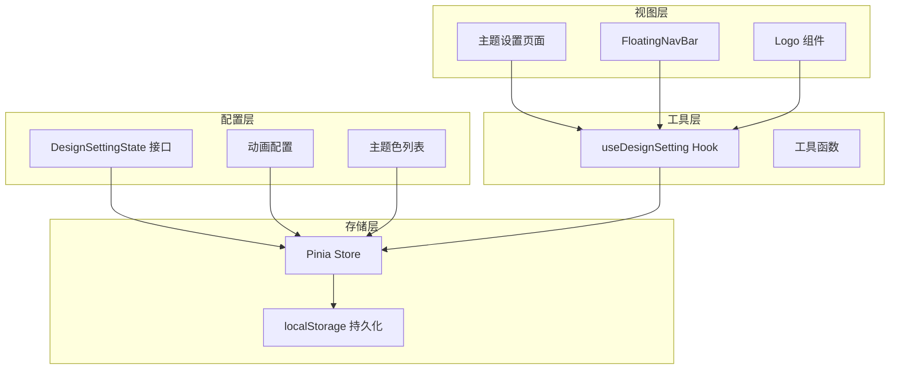
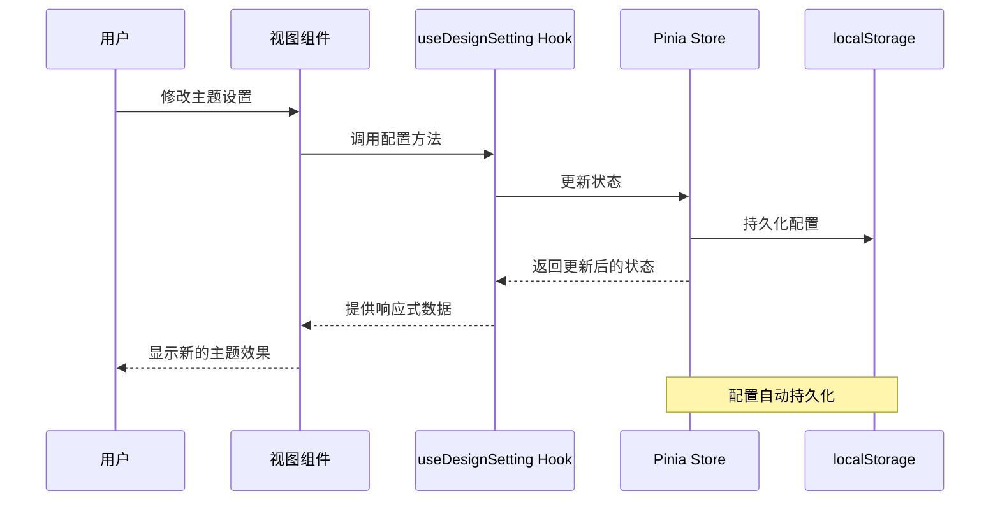
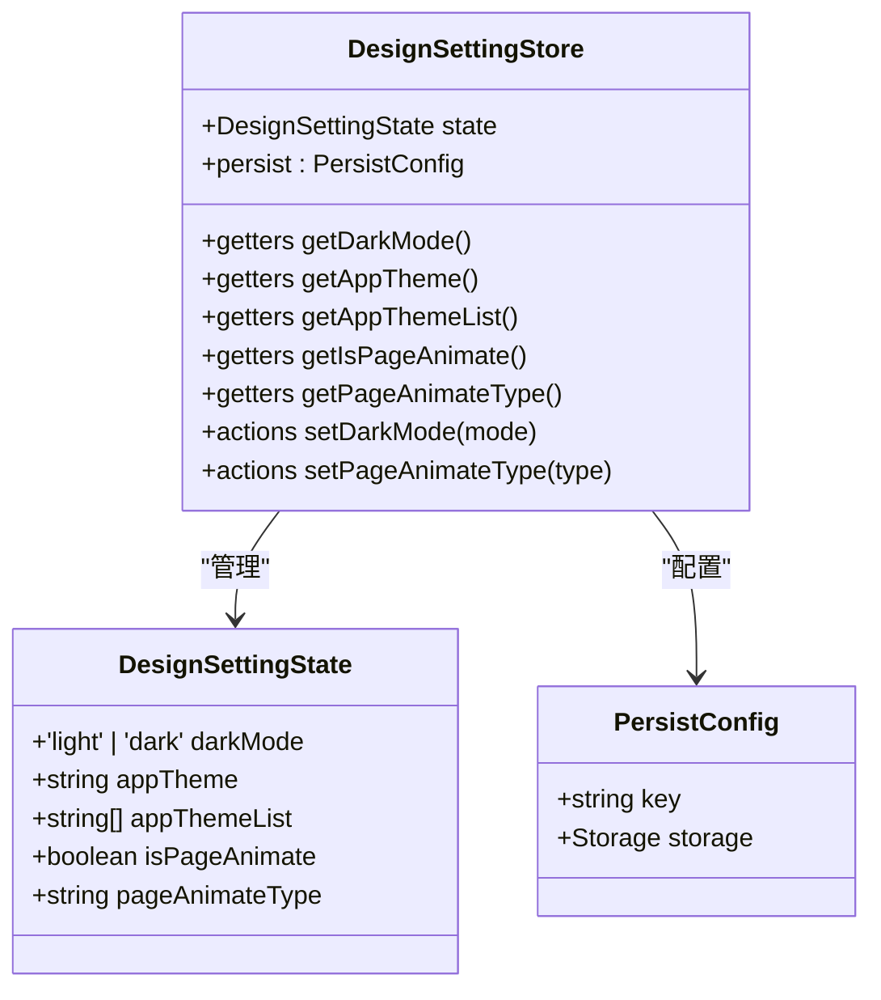
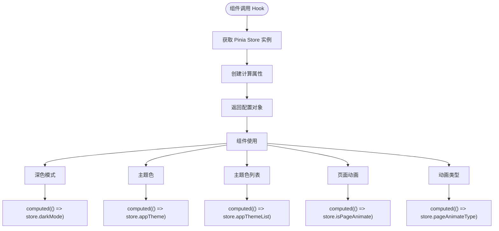
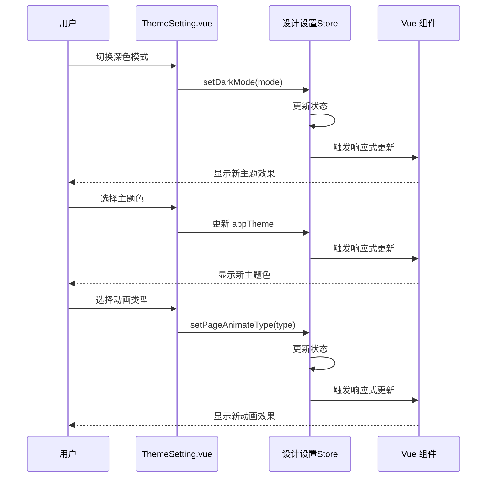
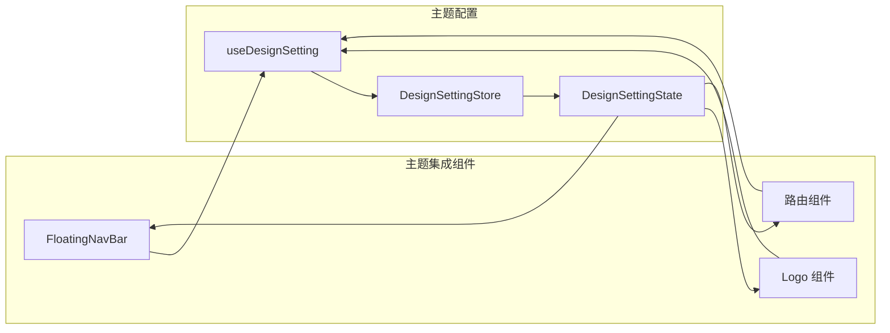
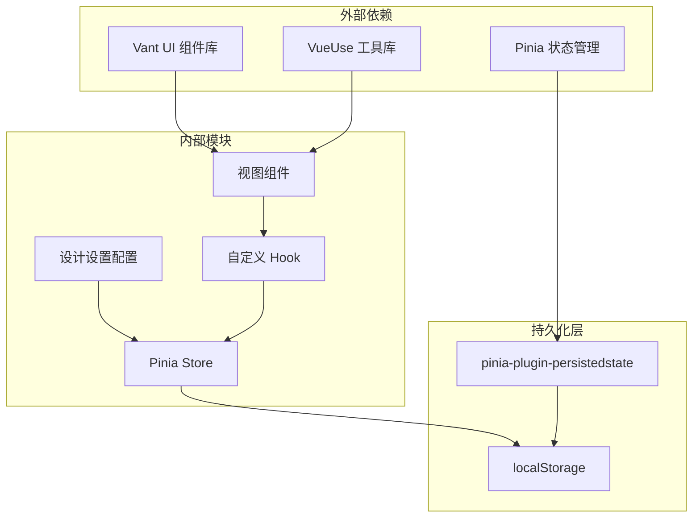

# 主题配置系统

<cite>
**本文档引用的文件**
- [designSetting.ts](file://src/settings/designSetting.ts)
- [useDesignSetting.ts](file://src/hooks/setting/useDesignSetting.ts)
- [designSetting.ts](file://src/store/modules/designSetting.ts)
- [animateSetting.ts](file://src/settings/animateSetting.ts)
- [ThemeSetting.vue](file://src/views/my/ThemeSetting.vue)
- [index.ts](file://src/store/index.ts)
- [FloatingNavBar.vue](file://src/layout/components/FloatingNavBar.vue)
- [Logo.vue](file://src/components/Logo.vue)
- [var.less](file://src/styles/var.less)
- [index.less](file://src/styles/transition/index.less)
</cite>

## 目录
1. [简介](#简介)
2. [项目结构](#项目结构)
3. [核心组件](#核心组件)
4. [架构概览](#架构概览)
5. [详细组件分析](#详细组件分析)
6. [依赖关系分析](#依赖关系分析)
7. [性能考虑](#性能考虑)
8. [故障排除指南](#故障排除指南)
9. [结论](#结论)
10. [附录](#附录)

## 简介

Vue3微信H5移动端项目的主题配置系统是一个完整的全局主题管理解决方案，它提供了深色模式、系统主题色、页面动画等功能的统一配置和持久化管理。该系统采用现代化的Vue3 Composition API和Pinia状态管理，结合Vant UI组件库，为移动端用户提供丰富的个性化定制体验。

系统的核心设计理念是通过单一的DesignSettingState接口来管理所有主题相关的配置，确保配置的一致性和可维护性。同时，系统实现了完整的配置持久化机制，确保用户的主题偏好能够在页面刷新和应用重启后得到保持。

## 项目结构

主题配置系统在项目中的组织结构如下：

**图表来源**
- [designSetting.ts:3-14](file://src/settings/designSetting.ts#L3-L14)
- [designSetting.ts:8-46](file://src/store/modules/designSetting.ts#L8-L46)
- [ThemeSetting.vue:70-117](file://src/views/my/ThemeSetting.vue#L70-L117)

**章节来源**
- [designSetting.ts:1-52](file://src/settings/designSetting.ts#L1-L52)
- [designSetting.ts:1-52](file://src/store/modules/designSetting.ts#L1-L52)

## 核心组件

### DesignSettingState 接口设计

DesignSettingState接口是整个主题配置系统的核心数据结构，定义了以下关键配置项：

| 配置项 | 类型 | 默认值 | 描述 |
|--------|------|--------|------|
| darkMode | 'light' \| 'dark' | 'dark' | 深色模式开关，支持明暗两种模式 |
| appTheme | string | '#5d9dfe' | 当前使用的主题色，采用十六进制颜色值 |
| appThemeList | string[] | 18种预设颜色 | 系统内置的主题色列表，提供多种颜色选择 |
| isPageAnimate | boolean | true | 页面切换动画开关，控制是否启用页面过渡效果 |
| pageAnimateType | string | 'zoom-fade' | 页面动画类型，指定具体的动画效果 |

每个配置项都经过精心设计，确保满足移动端微信H5应用的使用场景和性能要求。

**章节来源**
- [designSetting.ts:3-14](file://src/settings/designSetting.ts#L3-L14)
- [designSetting.ts:38-49](file://src/settings/designSetting.ts#L38-L49)

### 主题色配置

系统提供了18种精心挑选的预设主题色，涵盖了蓝色系、绿色系、橙色系等多种色彩方案。这些颜色经过对比度优化，确保在深色和浅色模式下都有良好的可读性。

**章节来源**
- [designSetting.ts:16-36](file://src/settings/designSetting.ts#L16-L36)

### 动画配置系统

页面动画系统支持6种不同的动画效果，每种动画都有其独特的视觉表现：

| 动画类型 | 描述 | 适用场景 |
|----------|------|----------|
| zoom-fade | 渐变放大效果 | 内容丰富页面的平滑过渡 |
| zoom-out | 闪现效果 | 简洁页面的快速切换 |
| fade-slide | 滑动消退 | 导航页面的流畅切换 |
| fade | 消退效果 | 简单内容的优雅过渡 |
| fade-bottom | 底部消退 | 底部导航的自然过渡 |
| fade-scale | 缩放消退 | 强调内容变化的视觉效果 |

**章节来源**
- [animateSetting.ts:1-9](file://src/settings/animateSetting.ts#L1-L9)

## 架构概览

主题配置系统采用分层架构设计，确保各层职责清晰、耦合度低：

**图表来源**
- [useDesignSetting.ts:4-24](file://src/hooks/setting/useDesignSetting.ts#L4-L24)
- [designSetting.ts:33-45](file://src/store/modules/designSetting.ts#L33-L45)

系统架构的关键特点：
- **响应式设计**：使用Vue3的computed和reactive确保配置变更的实时响应
- **状态管理**：采用Pinia进行集中状态管理，支持模块化和持久化
- **组件解耦**：通过Hook抽象，降低组件间的耦合度
- **持久化存储**：自动保存用户配置到localStorage

**章节来源**
- [designSetting.ts:41-46](file://src/store/modules/designSetting.ts#L41-L46)
- [index.ts:1-13](file://src/store/index.ts#L1-L13)

## 详细组件分析

### Pinia Store 实现

Pinia Store是主题配置系统的核心存储层，负责管理所有主题状态并提供持久化功能。

**图表来源**
- [designSetting.ts:8-46](file://src/store/modules/designSetting.ts#L8-L46)

Store的实现特点：
- **状态初始化**：从设计设置文件导入默认配置
- **getter方法**：提供只读访问器，确保状态不可变性
- **action方法**：提供受控的状态更新接口
- **持久化配置**：使用pinia-plugin-persistedstate插件实现自动持久化

**章节来源**
- [designSetting.ts:8-46](file://src/store/modules/designSetting.ts#L8-L46)

### Hook 抽象层

useDesignSetting Hook为组件提供了简化的主题配置访问接口：

**图表来源**
- [useDesignSetting.ts:4-24](file://src/hooks/setting/useDesignSetting.ts#L4-L24)

Hook的优势：
- **简化访问**：提供简洁的API接口
- **响应式更新**：自动响应状态变更
- **类型安全**：完整的TypeScript类型支持

**章节来源**
- [useDesignSetting.ts:1-25](file://src/hooks/setting/useDesignSetting.ts#L1-L25)

### 主题设置界面

主题设置页面提供了完整的用户交互界面，支持实时预览和配置保存。

**图表来源**
- [ThemeSetting.vue:70-117](file://src/views/my/ThemeSetting.vue#L70-L117)

界面特性：
- **实时预览**：配置变更立即生效
- **直观操作**：使用Vant UI组件提供良好用户体验
- **完整覆盖**：涵盖所有主题配置选项

**章节来源**
- [ThemeSetting.vue:1-120](file://src/views/my/ThemeSetting.vue#L1-L120)

### 组件集成

多个组件集成了主题配置系统，确保全局一致的主题效果：

**图表来源**
- [FloatingNavBar.vue:88-129](file://src/layout/components/FloatingNavBar.vue#L88-L129)
- [Logo.vue:44-50](file://src/components/Logo.vue#L44-L50)

**章节来源**
- [FloatingNavBar.vue:88-129](file://src/layout/components/FloatingNavBar.vue#L88-L129)
- [Logo.vue:44-50](file://src/components/Logo.vue#L44-L50)

## 依赖关系分析

主题配置系统的依赖关系体现了清晰的分层架构：

**图表来源**
- [designSetting.ts:1-5](file://src/store/modules/designSetting.ts#L1-L5)
- [index.ts:1-6](file://src/store/index.ts#L1-L6)

依赖关系特点：
- **最小化外部依赖**：仅依赖必要的核心库
- **模块化设计**：各模块职责明确，耦合度低
- **可测试性**：清晰的依赖关系便于单元测试
- **可扩展性**：易于添加新的配置项和功能

**章节来源**
- [designSetting.ts:1-5](file://src/store/modules/designSetting.ts#L1-L5)
- [index.ts:1-6](file://src/store/index.ts#L1-L6)

## 性能考虑

主题配置系统在性能方面采用了多项优化策略：

### 响应式优化
- 使用computed进行懒计算，避免不必要的重新渲染
- 通过Hook抽象减少重复的store访问逻辑
- 合理的组件拆分，避免过度渲染

### 存储优化
- 仅存储必要的配置数据，避免冗余信息
- 使用localStorage进行轻量级持久化
- 配置数据结构简单，序列化开销小

### 移动端适配
- 避免复杂的CSS动画影响移动端性能
- 使用硬件加速的transform属性
- 控制动画数量和复杂度

## 故障排除指南

### 常见问题及解决方案

**问题1：主题配置不生效**
- 检查Pinia Store是否正确初始化
- 确认持久化插件已正确配置
- 验证组件是否正确使用Hook

**问题2：配置丢失**
- 检查localStorage是否可用
- 确认持久化key配置正确
- 验证浏览器隐私设置

**问题3：动画效果异常**
- 检查动画类型是否在支持列表中
- 确认CSS样式文件正确加载
- 验证移动端兼容性

**章节来源**
- [designSetting.ts:41-46](file://src/store/modules/designSetting.ts#L41-L46)
- [index.ts:1-6](file://src/store/index.ts#L1-L6)

## 结论

Vue3微信H5移动端项目的主题配置系统是一个设计精良、实现完善的全局主题管理解决方案。系统通过清晰的分层架构、完整的响应式设计和可靠的持久化机制，为用户提供了丰富的个性化定制体验。

系统的主要优势包括：
- **设计理念先进**：采用现代Vue3技术和Pinia状态管理
- **配置完整**：涵盖深色模式、主题色、动画等核心功能
- **用户体验优秀**：提供直观的操作界面和实时预览
- **性能优化到位**：针对移动端进行了专门的性能优化
- **可维护性强**：清晰的代码结构和完善的注释

该系统为类似项目的主题配置提供了优秀的参考模板，具有很高的学习价值和实用意义。

## 附录

### API 接口文档

#### DesignSettingState 接口
- **darkMode**: 'light' | 'dark' - 深色模式状态
- **appTheme**: string - 当前主题色
- **appThemeList**: string[] - 主题色列表
- **isPageAnimate**: boolean - 页面动画开关
- **pageAnimateType**: string - 动画类型

#### Pinia Store Actions
- **setDarkMode(mode)**: 设置深色模式
- **setPageAnimateType(type)**: 设置动画类型

#### Hook 方法
- **useDesignSetting()**: 获取主题配置Hook
- **useDesignSettingWithOut()**: 在setup外使用Store

### 最佳实践

1. **配置验证**：始终验证配置值的有效性
2. **性能监控**：定期检查主题切换的性能影响
3. **兼容性测试**：确保在不同设备上的兼容性
4. **用户体验**：提供清晰的配置反馈和错误提示

### 扩展指导

#### 新增配置项步骤
1. 在DesignSettingState接口中添加新字段
2. 更新默认配置值
3. 在Store中添加对应的getter和setter
4. 在Hook中暴露新的访问方法
5. 在视图组件中添加配置界面
6. 确保持久化配置正确保存

#### 向后兼容性考虑
- 保持现有配置项的名称和类型不变
- 为新配置项提供合理的默认值
- 避免破坏现有的配置持久化格式
- 提供配置迁移脚本处理版本升级