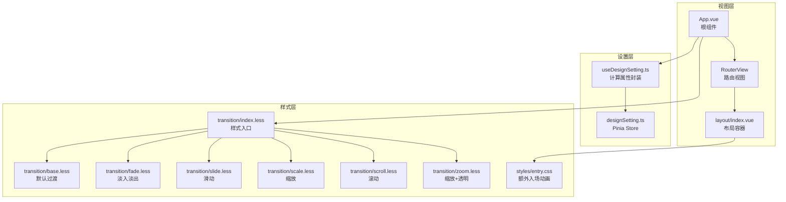
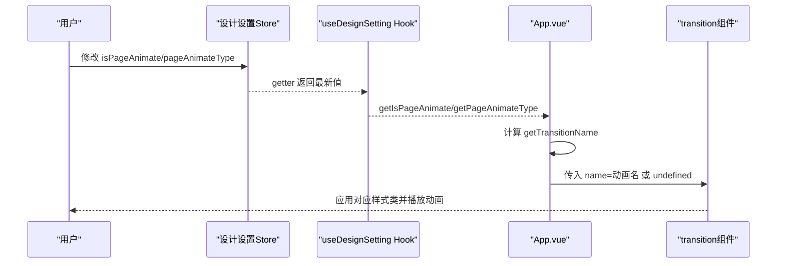
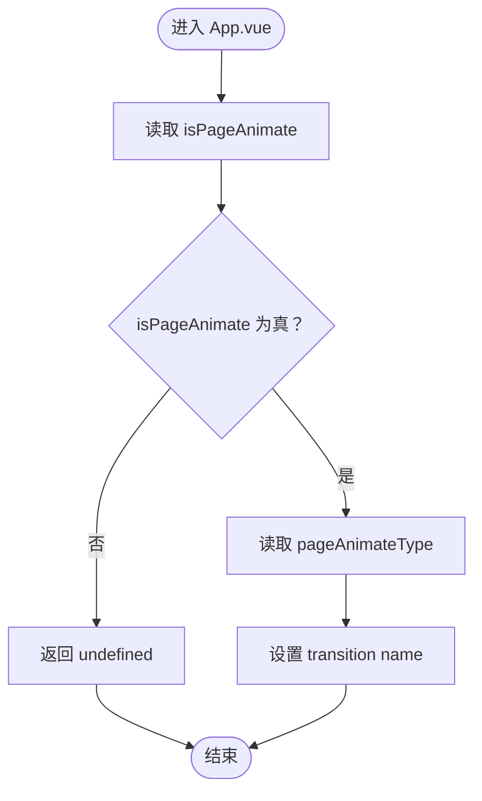
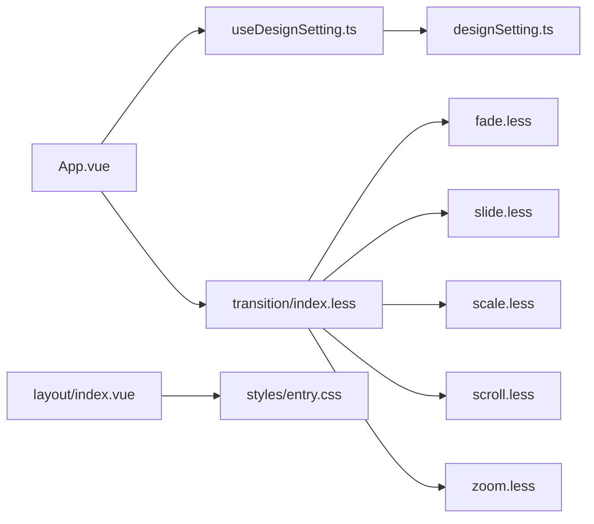

# 动画效果配置

<cite>
**本文引用的文件**
- [src\App.vue](file://src\App.vue)
- [src\hooks\setting\useDesignSetting.ts](file://src\hooks\setting\useDesignSetting.ts)
- [src\store\modules\designSetting.ts](file://src\store\modules\designSetting.ts)
- [src\settings\animateSetting.ts](file://src\settings\animateSetting.ts)
- [src\styles\transition\index.less](file://src\styles\transition\index.less)
- [src\styles\transition\base.less](file://src\styles\transition\base.less)
- [src\styles\transition\fade.less](file://src\styles\transition\fade.less)
- [src\styles\transition\slide.less](file://src\styles\transition\slide.less)
- [src\styles\transition\scale.less](file://src\styles\transition\scale.less)
- [src\styles\transition\scroll.less](file://src\styles\transition\scroll.less)
- [src\styles\transition\zoom.less](file://src\styles\transition\zoom.less)
- [src\styles\entry.css](file://src\styles\entry.css)
- [src\layout\index.vue](file://src\layout\index.vue)
- [src\router\index.ts](file://src\router\index.ts)
</cite>

## 目录
1. [简介](#简介)
2. [项目结构](#项目结构)
3. [核心组件](#核心组件)
4. [架构总览](#架构总览)
5. [详细组件分析](#详细组件分析)
6. [依赖关系分析](#依赖关系分析)
7. [性能考量](#性能考量)
8. [故障排查指南](#故障排查指南)
9. [结论](#结论)
10. [附录](#附录)

## 简介
本文件面向 Vue3 微信 H5 移动端项目，系统性说明页面级动画的实现原理与配置方法。重点涵盖：
- 页面动画开关与动画类型的控制机制（isPageAnimate 与 pageAnimateType）
- 支持的动画类型及其视觉表现与适用场景
- 动画参数调整与性能优化策略
- 动画系统的 API 接口说明
- 在路由切换、页面加载与组件显示中的应用示例路径
- 移动端动画性能最佳实践与自定义动画扩展指南

## 项目结构
动画系统由“视图层过渡容器 + 设计设置仓库 + 样式过渡类库”三层构成：
- 视图层：通过根组件的 RouterView 包裹 transition，并根据设计设置动态绑定动画名称
- 设置层：Pinia 设计设置 Store 提供 isPageAnimate 与 pageAnimateType 的读取与写入
- 样式层：统一的过渡样式库，按需引入多种预置动画类

图表来源
- [src\App.vue:1-78](file://src\App.vue#L1-L78)
- [src\layout\index.vue:1-60](file://src\layout\index.vue#L1-L60)
- [src\hooks\setting\useDesignSetting.ts:1-25](file://src\hooks\setting\useDesignSetting.ts#L1-L25)
- [src\store\modules\designSetting.ts:1-52](file://src\store\modules\designSetting.ts#L1-L52)
- [src\styles\transition\index.less:1-14](file://src\styles\transition\index.less#L1-L14)
- [src\styles\transition\base.less:1-19](file://src\styles\transition\base.less#L1-L19)
- [src\styles\transition\fade.less:1-86](file://src\styles\transition\fade.less#L1-L86)
- [src\styles\transition\slide.less:1-40](file://src\styles\transition\slide.less#L1-L40)
- [src\styles\transition\scale.less:1-22](file://src\styles\transition\scale.less#L1-L22)
- [src\styles\transition\scroll.less:1-68](file://src\styles\transition\scroll.less#L1-L68)
- [src\styles\transition\zoom.less:1-32](file://src\styles\transition\zoom.less#L1-L32)
- [src\styles\entry.css:1-168](file://src\styles\entry.css#L1-L168)

章节来源
- [src\App.vue:1-78](file://src\App.vue#L1-L78)
- [src\hooks\setting\useDesignSetting.ts:1-25](file://src\hooks\setting\useDesignSetting.ts#L1-L25)
- [src\store\modules\designSetting.ts:1-52](file://src\store\modules\designSetting.ts#L1-L52)
- [src\styles\transition\index.less:1-14](file://src\styles\transition\index.less#L1-L14)

## 核心组件
- 根组件动画容器
  - 通过 RouterView 包裹 transition，并以 name 绑定计算属性 getTransitionName
  - 当 isPageAnimate 为真时，使用 pageAnimateType；否则禁用过渡
  - 同时支持 KeepAlive 缓存，避免重复渲染造成抖动
- 设计设置 Hook 与 Store
  - useDesignSetting 提供 getIsPageAnimate 与 getPageAnimateType 计算属性
  - designSetting Store 提供 isPageAnimate、pageAnimateType 的读取与 setPageAnimateType 写入
- 动画类型枚举
  - 通过 animates 列表定义可用动画值与文案，用于界面选择器或设置面板

章节来源
- [src\App.vue:70-72](file://src\App.vue#L70-L72)
- [src\hooks\setting\useDesignSetting.ts:13-15](file://src\hooks\setting\useDesignSetting.ts#L13-L15)
- [src\store\modules\designSetting.ts:26-39](file://src\store\modules\designSetting.ts#L26-L39)
- [src\settings\animateSetting.ts:1-9](file://src\settings\animateSetting.ts#L1-L9)

## 架构总览
页面动画的运行时流程如下：
- 用户在设置面板切换 isPageAnimate 或 pageAnimateType
- App.vue 中的 getTransitionName 基于 isPageAnimate 返回对应动画名或 undefined
- transition 组件根据 name 应用对应的样式类，完成进入/离开动画

图表来源
- [src\store\modules\designSetting.ts:26-39](file://src\store\modules\designSetting.ts#L26-L39)
- [src\hooks\setting\useDesignSetting.ts:13-15](file://src\hooks\setting\useDesignSetting.ts#L13-L15)
- [src\App.vue:70-72](file://src\App.vue#L70-L72)

## 详细组件分析

### 动画开关与类型控制机制
- isPageAnimate 控制是否启用页面过渡动画
- pageAnimateType 决定具体使用的动画类型
- App.vue 中的 getTransitionName 将两者结合，返回 transition 的 name 值

图表来源
- [src\App.vue:70-72](file://src\App.vue#L70-L72)
- [src\hooks\setting\useDesignSetting.ts:13-15](file://src\hooks\setting\useDesignSetting.ts#L13-L15)
- [src\store\modules\designSetting.ts:26-39](file://src\store\modules\designSetting.ts#L26-L39)

章节来源
- [src\App.vue:70-72](file://src\App.vue#L70-L72)
- [src\hooks\setting\useDesignSetting.ts:13-15](file://src\hooks\setting\useDesignSetting.ts#L13-L15)
- [src\store\modules\designSetting.ts:26-39](file://src\store\modules\designSetting.ts#L26-L39)

### 支持的动画类型与视觉表现
- 渐变（zoom-fade）：缩放与透明度同时变化，适合页面整体切换
- 闪现（zoom-out）：快速缩放至无再恢复，强调瞬态切换
- 滑动（fade-slide）：伴随位移的淡入淡出，适合侧边或卡片类页面
- 消退（fade）：纯透明度变化，简洁轻量
- 底部消退（fade-bottom）：从底部滑入/滑出，适合底部弹层
- 缩放消退（fade-scale）：缩放与透明度组合，适合内容聚焦型页面

章节来源
- [src\settings\animateSetting.ts:1-9](file://src\settings\animateSetting.ts#L1-L9)
- [src\styles\transition\fade.less:1-86](file://src\styles\transition\fade.less#L1-L86)
- [src\styles\transition\zoom.less:1-32](file://src\styles\transition\zoom.less#L1-L32)

### 动画样式实现要点
- 默认过渡基类：统一的进入/离开过渡时间与缓动曲线
- 淡入淡出：控制 opacity 变化
- 滑动：配合 translateX/Y 实现方向性移动
- 缩放：通过 scale 实现放大/缩小
- 滚动：仅移动无透明度变化，适合长列表或内容区
- 闪现：极短时间的缩放与透明度过渡

章节来源
- [src\styles\transition\base.less:1-19](file://src\styles\transition\base.less#L1-L19)
- [src\styles\transition\fade.less:1-86](file://src\styles\transition\fade.less#L1-L86)
- [src\styles\transition\slide.less:1-40](file://src\styles\transition\slide.less#L1-L40)
- [src\styles\transition\scale.less:1-22](file://src\styles\transition\scale.less#L1-L22)
- [src\styles\transition\scroll.less:1-68](file://src\styles\transition\scroll.less#L1-L68)
- [src\styles\transition\zoom.less:1-32](file://src\styles\transition\zoom.less#L1-L32)

### 动画系统的 API 接口
- 查询接口
  - getIsPageAnimate: 获取是否启用页面动画
  - getPageAnimateType: 获取当前动画类型字符串
- 修改接口
  - setPageAnimateType(type: string): 设置动画类型
- 使用建议
  - 在设置面板或主题切换时调用 setPageAnimateType
  - 结合路由守卫或页面生命周期进行动态切换

章节来源
- [src\hooks\setting\useDesignSetting.ts:13-15](file://src\hooks\setting\useDesignSetting.ts#L13-L15)
- [src\store\modules\designSetting.ts:26-39](file://src\store\modules\designSetting.ts#L26-L39)

### 在路由切换、页面加载与组件显示中的应用
- 路由切换
  - App.vue 的 RouterView 外层包裹 transition，自动在路由切换时应用动画
  - 支持 KeepAlive 缓存，减少重复渲染开销
- 页面加载
  - 通过设置 isPageAnimate 与 pageAnimateType 控制首屏或异步页面的过渡效果
- 组件显示
  - 可在业务组件中直接使用对应样式类（如 fade、slide 等），无需额外 JS 逻辑

章节来源
- [src\App.vue:5-9](file://src\App.vue#L5-L9)
- [src\layout\index.vue:8-11](file://src\layout\index.vue#L8-L11)

### 自定义动画添加方法
- 新增样式类
  - 在 transition 目录下新增 less 文件，定义 enter/leave 样式类
  - 在 index.less 中引入新文件
- 注册动画类型
  - 在 animates 列表中添加新的 { value, text } 条目
- 应用动画
  - 通过 setPageAnimateType 设置新类型，或在设置面板中选择

章节来源
- [src\styles\transition\index.less:1-6](file://src\styles\transition\index.less#L1-L6)
- [src\settings\animateSetting.ts:1-9](file://src\settings\animateSetting.ts#L1-L9)

## 依赖关系分析
- App.vue 依赖 useDesignSetting 与路由组件，负责将动画状态注入到 transition
- useDesignSetting 依赖 designSetting Store，提供响应式数据
- 动画样式由 transition 目录下的多个 less 文件组成，统一由 index.less 引入
- entry.css 提供额外的逐项入场动画，适用于列表或分组元素

图表来源
- [src\App.vue:1-78](file://src\App.vue#L1-L78)
- [src\hooks\setting\useDesignSetting.ts:1-25](file://src\hooks\setting\useDesignSetting.ts#L1-L25)
- [src\store\modules\designSetting.ts:1-52](file://src\store\modules\designSetting.ts#L1-L52)
- [src\styles\transition\index.less:1-14](file://src\styles\transition\index.less#L1-L14)
- [src\layout\index.vue:1-60](file://src\layout\index.vue#L1-L60)
- [src\styles\entry.css:1-168](file://src\styles\entry.css#L1-L168)

章节来源
- [src\App.vue:1-78](file://src\App.vue#L1-L78)
- [src\hooks\setting\useDesignSetting.ts:1-25](file://src\hooks\setting\useDesignSetting.ts#L1-L25)
- [src\store\modules\designSetting.ts:1-52](file://src\store\modules\designSetting.ts#L1-L52)
- [src\styles\transition\index.less:1-14](file://src\styles\transition\index.less#L1-L14)
- [src\layout\index.vue:1-60](file://src\layout\index.vue#L1-L60)
- [src\styles\entry.css:1-168](file://src\styles\entry.css#L1-L168)

## 性能考量
- 启用硬件加速
  - 优先使用 transform 与 opacity，避免触发布局与重绘
  - 样式已遵循该原则（translate、scale、opacity）
- 控制过渡时长与缓动
  - 默认缓动曲线与时长已在 base.less 中统一，避免过长动画影响交互流畅度
- KeepAlive 缓存
  - App.vue 已对可缓存组件启用 KeepAlive，减少频繁创建/销毁带来的抖动
- 避免过度动画
  - 对复杂页面或低端机可关闭 isPageAnimate 或选择更轻量的 fade 类型
- 列表入场动画
  - entry.css 的逐项入场动画适合小规模列表，大规模列表建议禁用或降级

章节来源
- [src\styles\transition\base.less:1-19](file://src\styles\transition\base.less#L1-L19)
- [src\App.vue:5-9](file://src\App.vue#L5-L9)
- [src\styles\entry.css:1-168](file://src\styles\entry.css#L1-L168)

## 故障排查指南
- 动画不生效
  - 检查 isPageAnimate 是否为真
  - 确认 pageAnimateType 是否为已注册的值
  - 确认 transition 的 name 是否正确绑定
- 动画卡顿
  - 减少复杂滤镜与大尺寸图片
  - 降低过渡时长或改用更轻量的动画类型
- 进入/离开顺序异常
  - 确保使用 out-in 模式（App.vue 已设置）
  - 检查 KeepAlive include 列表是否正确

章节来源
- [src\App.vue:5-9](file://src\App.vue#L5-L9)
- [src\store\modules\designSetting.ts:26-39](file://src\store\modules\designSetting.ts#L26-L39)

## 结论
本项目采用“设置层 + 视图层 + 样式层”的清晰分层架构实现页面动画。通过 isPageAnimate 与 pageAnimateType 的组合，既能满足多样化的视觉需求，又能在移动端保持良好的性能表现。建议在复杂页面或低端设备上适度简化动画，确保用户体验的流畅与稳定。

## 附录
- 动画类型与适用场景速查
  - zoom-fade：页面整体切换，强调自然过渡
  - zoom-out：强调瞬态切换，适合提示或确认类页面
  - fade-slide：侧边栏、抽屉或卡片类页面
  - fade：极简风格，适合信息密度低的页面
  - fade-bottom：底部弹层或导航栏
  - fade-scale：内容聚焦型页面，引导注意力

章节来源
- [src\settings\animateSetting.ts:1-9](file://src\settings\animateSetting.ts#L1-L9)