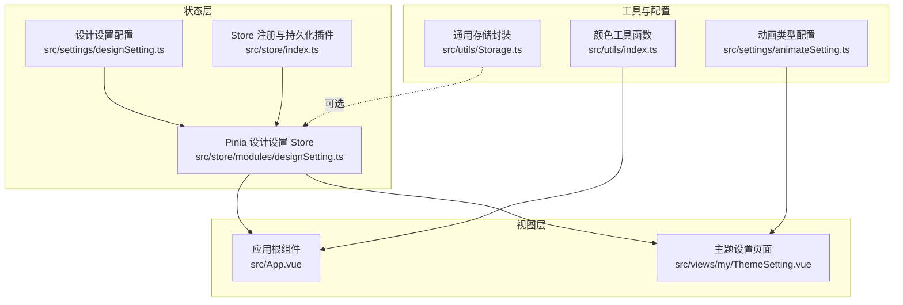
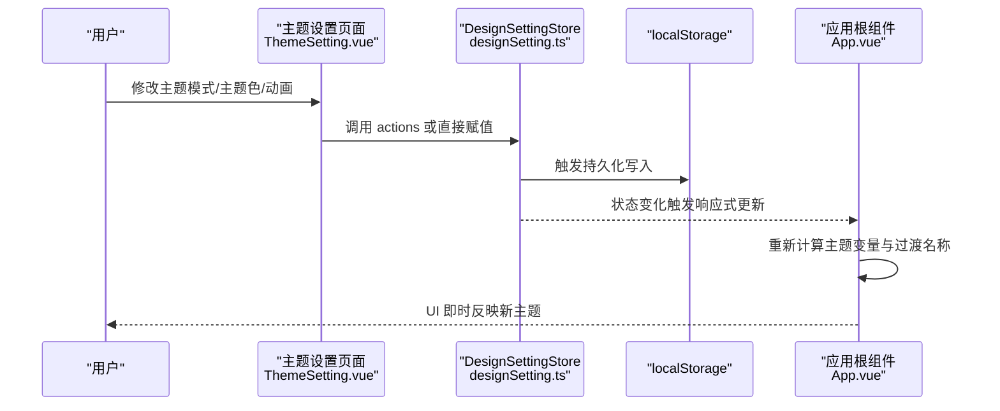
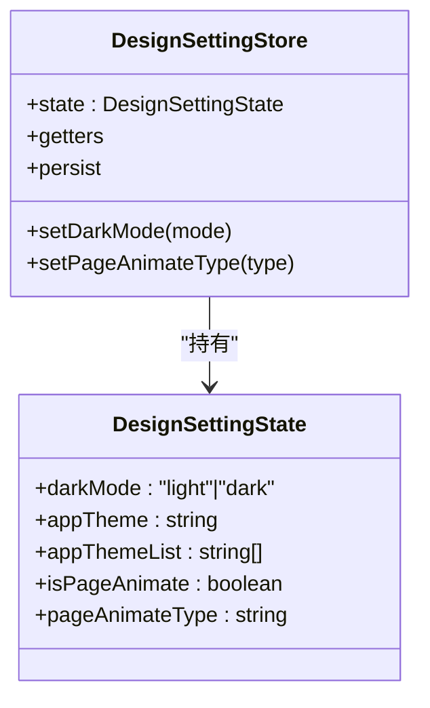
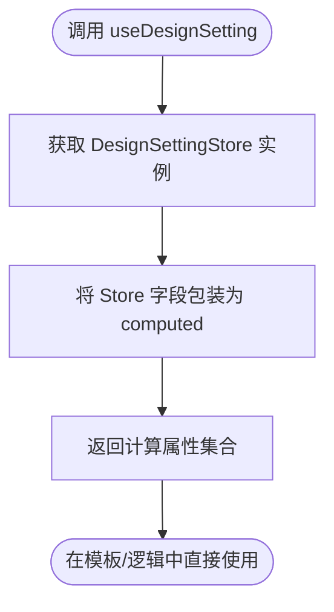
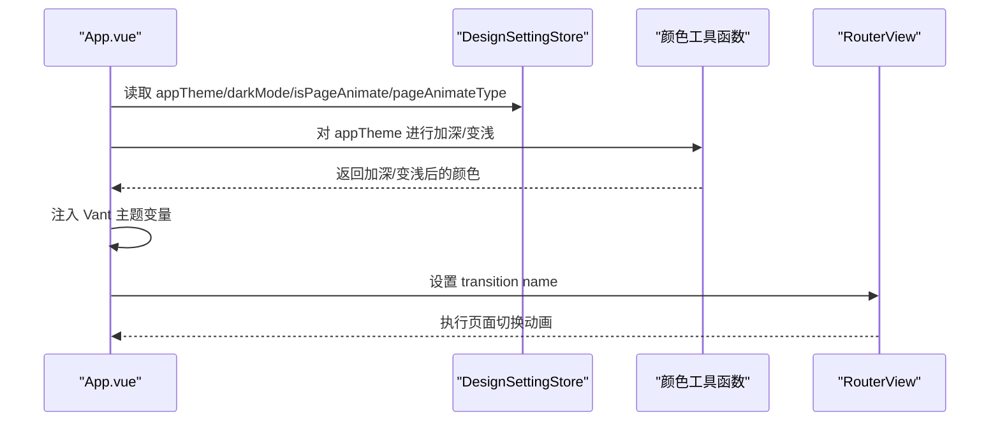
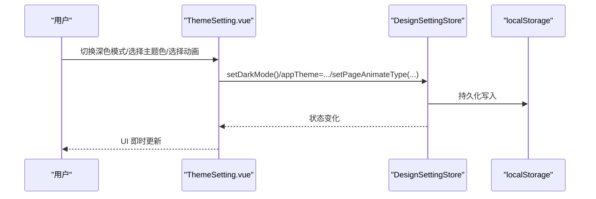
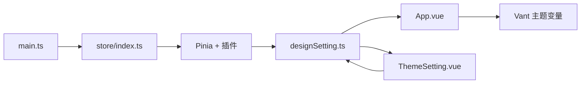

# 状态管理

<cite>
**本文引用的文件**
- [designSetting.ts](file://src/store/modules/designSetting.ts)
- [useDesignSetting.ts](file://src/hooks/setting/useDesignSetting.ts)
- [designSetting.ts](file://src/settings/designSetting.ts)
- [index.ts](file://src/store/index.ts)
- [ThemeSetting.vue](file://src/views/my/ThemeSetting.vue)
- [App.vue](file://src/App.vue)
- [animateSetting.ts](file://src/settings/animateSetting.ts)
- [index.ts](file://src/utils/index.ts)
- [Storage.ts](file://src/utils/Storage.ts)
- [main.ts](file://src/main.ts)
- [fade.less](file://src/styles/transition/fade.less)
</cite>

## 目录
1. [简介](#简介)
2. [项目结构](#项目结构)
3. [核心组件](#核心组件)
4. [架构总览](#架构总览)
5. [详细组件分析](#详细组件分析)
6. [依赖关系分析](#依赖关系分析)
7. [性能考量](#性能考量)
8. [故障排查指南](#故障排查指南)
9. [结论](#结论)
10. [附录：API 接口与最佳实践](#附录api-接口与最佳实践)

## 简介
本文件聚焦于 Vue3 微信 H5 移动端项目中的“主题状态管理”，系统性解析 DesignSettingStore 的设计架构（状态结构、getter 计算属性、action 操作方法）、useDesignSetting 自定义 Hook 的实现原理与使用方式，并详述 Pinia 持久化到 localStorage 的机制、跨标签页共享策略、API 使用说明、代码示例、最佳实践与扩展指导。目标是帮助开发者快速理解并安全地在组件中访问与修改主题设置，同时确保性能与可维护性。

## 项目结构
围绕主题状态管理的关键目录与文件如下：
- 状态定义与默认值：src/settings/designSetting.ts
- Pinia Store 实现：src/store/modules/designSetting.ts
- Store 注册与持久化插件：src/store/index.ts
- 自定义 Hook：src/hooks/setting/useDesignSetting.ts
- 应用入口与挂载：src/main.ts
- 主题设置页面示例：src/views/my/ThemeSetting.vue
- 应用根组件与主题应用：src/App.vue
- 动画类型配置：src/settings/animateSetting.ts
- 工具函数（深色/浅色处理）：src/utils/index.ts
- 通用存储封装：src/utils/Storage.ts
- 页面切换过渡样式：src/styles/transition/fade.less

图表来源
- [designSetting.ts:1-52](file://src/store/modules/designSetting.ts#L1-L52)
- [designSetting.ts:1-52](file://src/settings/designSetting.ts#L1-L52)
- [index.ts:1-13](file://src/store/index.ts#L1-L13)
- [App.vue:1-78](file://src/App.vue#L1-L78)
- [ThemeSetting.vue:1-120](file://src/views/my/ThemeSetting.vue#L1-L120)
- [animateSetting.ts:1-9](file://src/settings/animateSetting.ts#L1-L9)
- [index.ts:1-100](file://src/utils/index.ts#L1-L100)
- [Storage.ts:1-128](file://src/utils/Storage.ts#L1-L128)

章节来源
- [designSetting.ts:1-52](file://src/store/modules/designSetting.ts#L1-L52)
- [designSetting.ts:1-52](file://src/settings/designSetting.ts#L1-L52)
- [index.ts:1-13](file://src/store/index.ts#L1-L13)
- [App.vue:1-78](file://src/App.vue#L1-L78)
- [ThemeSetting.vue:1-120](file://src/views/my/ThemeSetting.vue#L1-L120)
- [animateSetting.ts:1-9](file://src/settings/animateSetting.ts#L1-L9)
- [index.ts:1-100](file://src/utils/index.ts#L1-L100)
- [Storage.ts:1-128](file://src/utils/Storage.ts#L1-L128)

## 核心组件
- 设计设置配置（DesignSettingState）
  - 定义了主题模式、系统主题色、主题色列表、页面切换动画开关与动画类型等字段。
  - 提供默认值与预设主题色列表，作为 Store 初始化的数据源。
- DesignSettingStore（Pinia）
  - 通过 defineStore 定义，包含 state、getters、actions 与持久化配置。
  - 持久化键名固定，使用 localStorage 存储。
- useDesignSetting Hook
  - 将 Store 中的状态映射为 computed，便于在模板中直接响应式使用。
- 应用根组件与主题设置页面
  - 根组件根据 Store 的 darkMode 与 appTheme 动态注入 Vant 主题变量与页面过渡效果。
  - 主题设置页面提供交互式修改入口，联动 Store 并持久化。

章节来源
- [designSetting.ts:3-14](file://src/settings/designSetting.ts#L3-L14)
- [designSetting.ts:38-49](file://src/settings/designSetting.ts#L38-L49)
- [designSetting.ts:8-46](file://src/store/modules/designSetting.ts#L8-L46)
- [useDesignSetting.ts:4-24](file://src/hooks/setting/useDesignSetting.ts#L4-L24)
- [App.vue:15-72](file://src/App.vue#L15-L72)
- [ThemeSetting.vue:70-116](file://src/views/my/ThemeSetting.vue#L70-L116)

## 架构总览
下图展示了主题状态从配置到持久化、再到视图层应用的整体流程。

图表来源
- [ThemeSetting.vue:70-116](file://src/views/my/ThemeSetting.vue#L70-L116)
- [designSetting.ts:33-45](file://src/store/modules/designSetting.ts#L33-L45)
- [App.vue:15-72](file://src/App.vue#L15-L72)

## 详细组件分析

### DesignSettingStore 设计与实现
- 状态结构
  - 字段：darkMode、appTheme、appThemeList、isPageAnimate、pageAnimateType。
  - 初始化：从设计配置文件导入默认值，保证首次加载即有可用状态。
- Getter 计算属性
  - 提供只读访问器，封装内部状态，便于在模板或逻辑中直接使用。
- Action 操作方法
  - setDarkMode：切换深色/浅色模式。
  - setPageAnimateType：设置页面切换动画类型。
- 持久化机制
  - 使用 pinia-plugin-persistedstate 插件，持久化键名为固定字符串，存储介质为 localStorage。
  - 该机制确保刷新或重启后仍保持用户的主题偏好。

图表来源
- [designSetting.ts:3-14](file://src/settings/designSetting.ts#L3-L14)
- [designSetting.ts:8-46](file://src/store/modules/designSetting.ts#L8-L46)

章节来源
- [designSetting.ts:3-14](file://src/settings/designSetting.ts#L3-L14)
- [designSetting.ts:38-49](file://src/settings/designSetting.ts#L38-L49)
- [designSetting.ts:8-46](file://src/store/modules/designSetting.ts#L8-L46)

### useDesignSetting 自定义 Hook
- 设计目的
  - 将 Store 的状态包装为 computed，简化模板中的响应式绑定与读取。
- 返回值
  - 包含 getDarkMode、getAppTheme、getAppThemeList、getIsPageAnimate、getPageAnimateType 等计算属性。
- 使用场景
  - 在任意组件中通过解构返回值即可获得响应式的主题状态，无需直接引入 Store 实例。

图表来源
- [useDesignSetting.ts:4-24](file://src/hooks/setting/useDesignSetting.ts#L4-L24)

章节来源
- [useDesignSetting.ts:4-24](file://src/hooks/setting/useDesignSetting.ts#L4-L24)

### 应用根组件的主题应用
- 主题变量注入
  - 根据当前 appTheme 动态生成一组 Vant 组件主题变量，如主按钮、图标、进度条等的颜色。
  - 使用工具函数对主题色进行加深与变浅处理，提升对比度与可读性。
- 页面过渡效果
  - 根据 isPageAnimate 与 pageAnimateType 决定 RouterView 的过渡名称，实现页面切换动画。
- 深色模式联动
  - 结合 useDark（来自 @vueuse/core），将系统深色模式与 Store 的 darkMode 同步。

图表来源
- [App.vue:15-72](file://src/App.vue#L15-L72)
- [index.ts:29-51](file://src/utils/index.ts#L29-L51)

章节来源
- [App.vue:15-72](file://src/App.vue#L15-L72)
- [index.ts:29-51](file://src/utils/index.ts#L29-L51)

### 主题设置页面的交互与持久化
- 交互功能
  - 切换深色模式：双向绑定到 useDark，并同步写入 Store 的 darkMode。
  - 选择主题色：点击预设色块，直接赋值 Store 的 appTheme。
  - 开关页面动画与选择动画类型：通过 Picker 选择后调用 Store 的 setPageAnimateType。
- 数据流
  - 用户操作 -> Store 更新 -> 触发持久化 -> 根组件响应式渲染。

图表来源
- [ThemeSetting.vue:70-116](file://src/views/my/ThemeSetting.vue#L70-L116)
- [designSetting.ts:33-45](file://src/store/modules/designSetting.ts#L33-L45)

章节来源
- [ThemeSetting.vue:70-116](file://src/views/my/ThemeSetting.vue#L70-L116)
- [designSetting.ts:33-45](file://src/store/modules/designSetting.ts#L33-L45)

### 动画类型与过渡样式
- 动画类型配置
  - 提供多种页面切换动画类型（如渐变、闪现、滑动、消退等），用于控制 RouterView 的 transition name。
- 过渡样式
  - 对应的 CSS 过渡类在样式文件中定义，与动画类型一一对应，确保视觉一致性。

章节来源
- [animateSetting.ts:1-9](file://src/settings/animateSetting.ts#L1-L9)
- [fade.less:1-85](file://src/styles/transition/fade.less#L1-L85)

## 依赖关系分析
- Store 注册与持久化
  - 在应用入口处注册 Pinia，并启用持久化插件，使所有带 persist 配置的 Store 自动持久化。
- 组件依赖
  - App.vue 依赖 useDesignSetting Hook 获取主题状态；ThemeSetting.vue 直接依赖 Store 进行修改。
- 外部库
  - @vueuse/core 提供 useDark，实现深色模式与系统深色的联动。
  - vant 组件库通过主题变量实现统一风格。

图表来源
- [main.ts:18-27](file://src/main.ts#L18-L27)
- [index.ts:1-13](file://src/store/index.ts#L1-L13)
- [designSetting.ts:1-52](file://src/store/modules/designSetting.ts#L1-L52)
- [App.vue:1-78](file://src/App.vue#L1-L78)
- [ThemeSetting.vue:1-120](file://src/views/my/ThemeSetting.vue#L1-L120)

章节来源
- [main.ts:18-27](file://src/main.ts#L18-L27)
- [index.ts:1-13](file://src/store/index.ts#L1-L13)
- [designSetting.ts:1-52](file://src/store/modules/designSetting.ts#L1-L52)
- [App.vue:1-78](file://src/App.vue#L1-L78)
- [ThemeSetting.vue:1-120](file://src/views/my/ThemeSetting.vue#L1-L120)

## 性能考量
- 响应式粒度
  - 将每个状态字段包装为独立的 computed，避免不必要的整体重渲染。
- 持久化策略
  - 使用 localStorage 持久化，读写开销低；注意避免频繁写入导致主线程阻塞。
- 动画与 KeepAlive
  - 页面切换动画仅在需要时启用；结合 KeepAlive 缓存组件，减少重复渲染。
- 颜色计算
  - 深色/浅色计算在根组件执行，避免在大量子组件中重复计算。

[本节为通用性能建议，不直接分析具体文件]

## 故障排查指南
- 深色模式未生效
  - 检查 useDark 的值与 Store 的 darkMode 是否一致；确认 App.vue 中是否正确注入主题变量。
- 主题色不更新
  - 确认模板中是否使用了 computed 返回值；直接赋值 Store 的 appTheme 是否被持久化。
- 动画无效
  - 检查 isPageAnimate 是否为 true；transition name 是否与动画类型匹配。
- 持久化数据异常
  - 清理 localStorage 中对应键名的数据，或检查插件初始化顺序。

章节来源
- [App.vue:15-72](file://src/App.vue#L15-L72)
- [ThemeSetting.vue:70-116](file://src/views/my/ThemeSetting.vue#L70-L116)
- [designSetting.ts:42-45](file://src/store/modules/designSetting.ts#L42-L45)

## 结论
本主题状态管理方案以 Pinia 为核心，结合持久化插件与自定义 Hook，实现了简洁、可维护且高性能的主题配置体系。通过将状态封装为 computed 并在根组件集中应用，既保证了响应式更新的即时性，又降低了组件间的耦合度。配合动画与颜色工具函数，能够快速构建一致的视觉体验。

[本节为总结性内容，不直接分析具体文件]

## 附录：API 接口与最佳实践

### API 接口文档
- 查询接口
  - getDarkMode：返回当前深色/浅色模式。
  - getAppTheme：返回当前系统主题色。
  - getAppThemeList：返回内置主题色列表。
  - getIsPageAnimate：返回是否开启页面切换动画。
  - getPageAnimateType：返回当前页面切换动画类型。
- 更新接口
  - setDarkMode(mode)：设置深色/浅色模式。
  - setPageAnimateType(type)：设置页面切换动画类型。
- Hook 使用
  - useDesignSetting()：返回上述查询与更新接口的组合，便于在组件中直接使用。

章节来源
- [useDesignSetting.ts:4-24](file://src/hooks/setting/useDesignSetting.ts#L4-L24)
- [designSetting.ts:16-40](file://src/store/modules/designSetting.ts#L16-L40)

### 代码示例路径
- 在根组件中应用主题变量与过渡
  - [App.vue:15-72](file://src/App.vue#L15-L72)
- 在主题设置页面中修改主题
  - [ThemeSetting.vue:70-116](file://src/views/my/ThemeSetting.vue#L70-L116)
- 在其他组件中读取主题状态
  - [useDesignSetting.ts:4-24](file://src/hooks/setting/useDesignSetting.ts#L4-L24)

### 最佳实践
- 状态分割
  - 将主题相关状态集中在 DesignSettingStore，避免分散在多个模块中。
- 响应式优先
  - 优先使用 computed 包装状态，减少模板中的复杂表达式。
- 持久化策略
  - 仅对必要状态启用持久化，避免过度写入；注意键名唯一性。
- 性能优化
  - 控制动画数量与复杂度；合理使用 KeepAlive 缓存。
- 内存泄漏防护
  - 避免在组件中手动订阅 Store 且未释放；使用 Composition API 生命周期钩子清理副作用。

### 扩展指导
- 新增状态项
  - 在 DesignSettingState 接口中添加字段；在设计配置文件中提供默认值；在 Store 的 state 中初始化；在 getter/action 中补充对应方法。
- 状态迁移
  - 若需变更键名或结构，可在初始化时读取旧键名数据并迁移至新结构，再删除旧键名。
- 版本兼容
  - 为持久化数据增加版本号字段，升级时按版本执行迁移逻辑，保证向后兼容。

章节来源
- [designSetting.ts:3-14](file://src/settings/designSetting.ts#L3-L14)
- [designSetting.ts:38-49](file://src/settings/designSetting.ts#L38-L49)
- [designSetting.ts:8-46](file://src/store/modules/designSetting.ts#L8-L46)
- [Storage.ts:1-128](file://src/utils/Storage.ts#L1-L128)