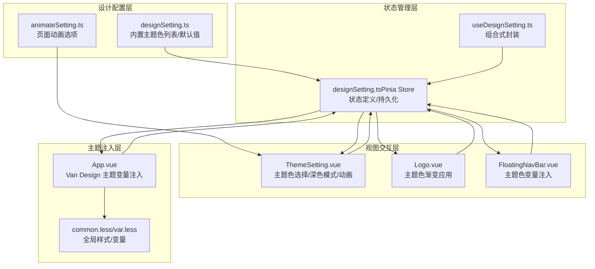
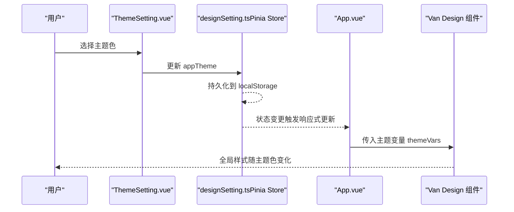
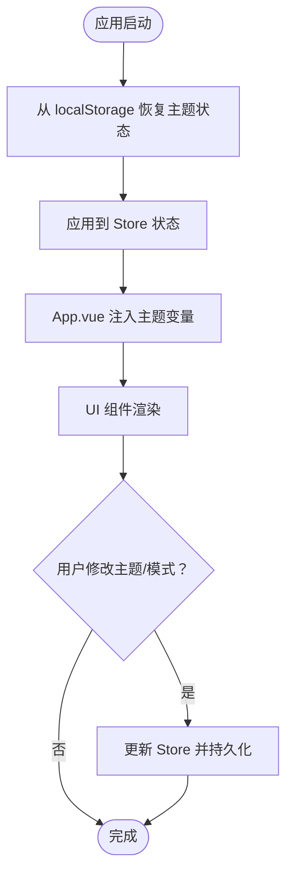
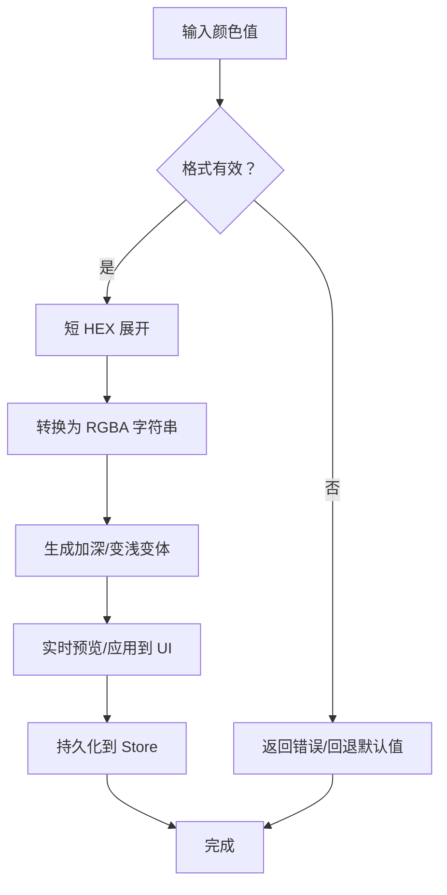
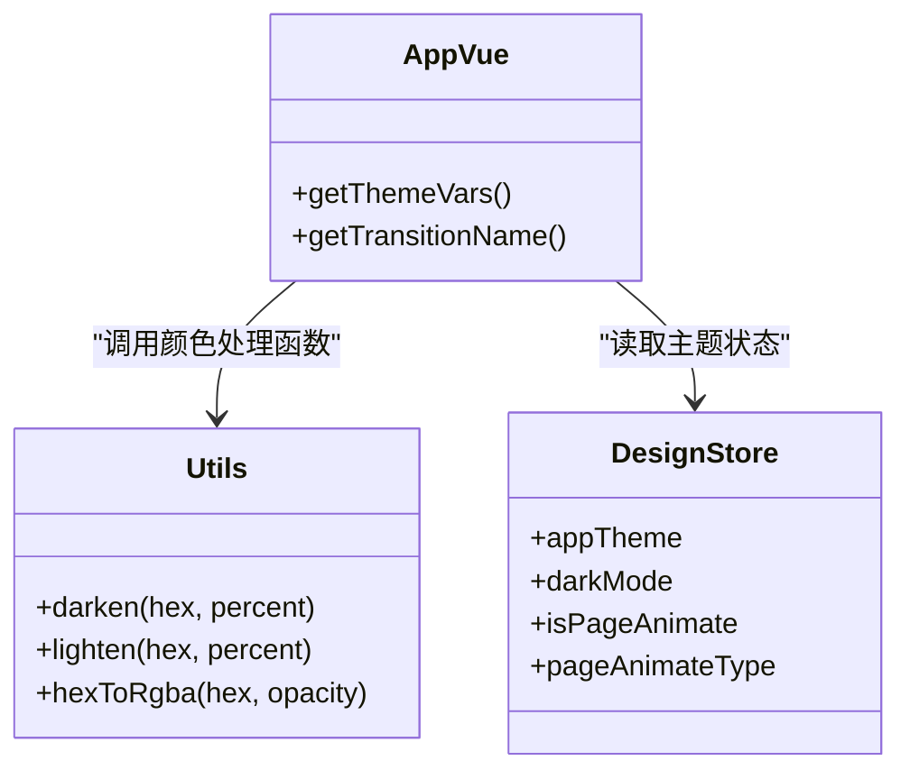
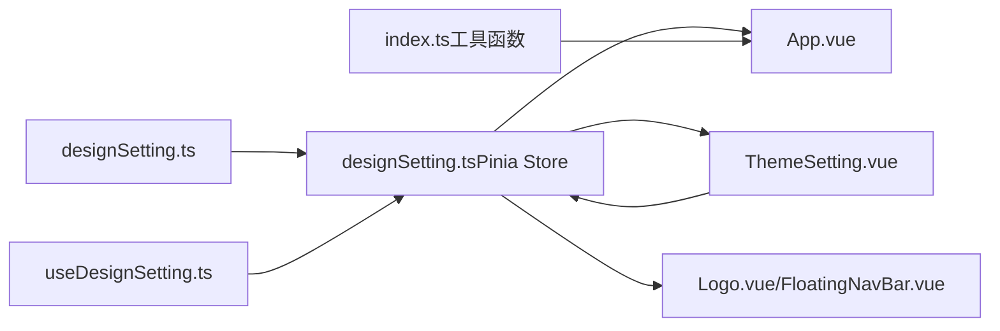

# 颜色系统

<cite>
**本文引用的文件**
- [designSetting.ts](file://src/settings/designSetting.ts)
- [designSetting.ts（Pinia Store）](file://src/store/modules/designSetting.ts)
- [useDesignSetting.ts](file://src/hooks/setting/useDesignSetting.ts)
- [ThemeSetting.vue](file://src/views/my/ThemeSetting.vue)
- [Logo.vue](file://src/components/Logo.vue)
- [App.vue](file://src/App.vue)
- [common.less](file://src/styles/common.less)
- [var.less](file://src/styles/var.less)
- [FloatingNavBar.vue](file://src/layout/components/FloatingNavBar.vue)
- [animateSetting.ts](file://src/settings/animateSetting.ts)
- [index.ts（工具函数）](file://src/utils/index.ts)
</cite>

## 目录
1. [简介](#简介)
2. [项目结构](#项目结构)
3. [核心组件](#核心组件)
4. [架构总览](#架构总览)
5. [详细组件分析](#详细组件分析)
6. [依赖关系分析](#依赖关系分析)
7. [性能考量](#性能考量)
8. [故障排查指南](#故障排查指南)
9. [结论](#结论)
10. [附录：API 与使用示例](#附录api-与使用示例)

## 简介
本文件系统性梳理 Vue3 微信 H5 移动端项目中的颜色系统，涵盖内置主题色列表的设计理念、色彩搭配原则、检测与持久化机制、自定义主题色的实现思路、API 接口说明、移动端适配要点（触控反馈、对比度与可访问性），以及扩展与定制建议。文档同时提供可视化图示与路径级“代码片段”指引，帮助开发者快速定位实现位置并进行二次开发。

## 项目结构
颜色系统围绕“设计配置 + 状态存储 + 视图交互 + 主题注入”的分层组织：
- 设计配置层：集中定义主题色、深浅模式、页面动画等默认值
- 状态管理层：通过 Pinia Store 维护主题状态并持久化到本地存储
- 视图交互层：提供主题色选择、深色模式切换、动画类型选择等界面
- 主题注入层：将主题色映射到 UI 组件库主题变量，实现全局样式生效
- 工具函数层：提供颜色处理能力（加深、变浅、HEX 转 RGBA）

图表来源
- [designSetting.ts:1-52](file://src/settings/designSetting.ts#L1-L52)
- [designSetting.ts（Pinia Store）:1-52](file://src/store/modules/designSetting.ts#L1-L52)
- [useDesignSetting.ts:1-25](file://src/hooks/setting/useDesignSetting.ts#L1-L25)
- [ThemeSetting.vue:1-120](file://src/views/my/ThemeSetting.vue#L1-L120)
- [Logo.vue:1-51](file://src/components/Logo.vue#L1-L51)
- [FloatingNavBar.vue:118-129](file://src/layout/components/FloatingNavBar.vue#L118-L129)
- [App.vue:15-78](file://src/App.vue#L15-L78)
- [common.less:1-129](file://src/styles/common.less#L1-L129)
- [var.less:1-5](file://src/styles/var.less#L1-L5)
- [animateSetting.ts:1-9](file://src/settings/animateSetting.ts#L1-L9)

章节来源
- [designSetting.ts:1-52](file://src/settings/designSetting.ts#L1-L52)
- [designSetting.ts（Pinia Store）:1-52](file://src/store/modules/designSetting.ts#L1-L52)
- [useDesignSetting.ts:1-25](file://src/hooks/setting/useDesignSetting.ts#L1-L25)
- [ThemeSetting.vue:1-120](file://src/views/my/ThemeSetting.vue#L1-L120)
- [Logo.vue:1-51](file://src/components/Logo.vue#L1-L51)
- [FloatingNavBar.vue:118-129](file://src/layout/components/FloatingNavBar.vue#L118-L129)
- [App.vue:15-78](file://src/App.vue#L15-L78)
- [common.less:1-129](file://src/styles/common.less#L1-L129)
- [var.less:1-5](file://src/styles/var.less#L1-L5)
- [animateSetting.ts:1-9](file://src/settings/animateSetting.ts#L1-L9)

## 核心组件
- 内置主题色列表：提供一组高可读性、强对比度、适合移动端的主色集合，覆盖科技蓝、活力橙、自然绿、静谧紫等多个风格方向
- 设计配置默认值：统一深浅模式、主题色、页面动画开关与类型
- Pinia Store：集中管理主题状态，支持持久化到 localStorage
- 组合式 Hook：提供响应式 getter 封装，便于在组件中直接使用
- 主题注入：将主题色映射到 UI 组件库的主题变量，实现全局生效
- 动画配置：提供多种页面切换动画类型，支持按需启用

章节来源
- [designSetting.ts:16-49](file://src/settings/designSetting.ts#L16-L49)
- [designSetting.ts（Pinia Store）:8-46](file://src/store/modules/designSetting.ts#L8-L46)
- [useDesignSetting.ts:4-24](file://src/hooks/setting/useDesignSetting.ts#L4-L24)
- [App.vue:26-68](file://src/App.vue#L26-L68)
- [animateSetting.ts:1-9](file://src/settings/animateSetting.ts#L1-L9)

## 架构总览
颜色系统采用“配置驱动 + 响应式状态 + 主题变量注入”的架构：
- 配置层：内置主题色列表与默认值
- 状态层：Store 统一维护主题状态并持久化
- 视图层：主题设置页提供交互入口
- 注入层：App.vue 将主题色映射为 UI 组件库主题变量
- 工具层：颜色处理函数用于生成加深/变浅/RGBA

图表来源
- [ThemeSetting.vue:92-94](file://src/views/my/ThemeSetting.vue#L92-L94)
- [designSetting.ts（Pinia Store）:42-46](file://src/store/modules/designSetting.ts#L42-L46)
- [App.vue:21-68](file://src/App.vue#L21-L68)

章节来源
- [ThemeSetting.vue:92-94](file://src/views/my/ThemeSetting.vue#L92-L94)
- [designSetting.ts（Pinia Store）:42-46](file://src/store/modules/designSetting.ts#L42-L46)
- [App.vue:21-68](file://src/App.vue#L21-L68)

## 详细组件分析

### 内置主题色列表与设计理念
- 设计理念
  - 可读性优先：确保在深浅模式下均具备良好对比度
  - 移动端友好：饱和度适中，避免过度刺眼；适合小屏点击与长时阅读
  - 风格多样：覆盖科技蓝、活力橙、自然绿、静谧紫等风格，满足不同业务场景
- 色彩搭配原则
  - 主色用于强调、选中态、进度条、标签等关键元素
  - 辅助色用于次级操作、边框、分割线等弱化信息
  - 深浅变体用于 hover、禁用、提示等状态反馈
- 适用场景
  - 主色：按钮、导航选中、图标强调
  - 加深/变浅：文本强调、边框、阴影
  - RGBA：渐变、蒙层、半透明覆盖

章节来源
- [designSetting.ts:16-36](file://src/settings/designSetting.ts#L16-L36)

### 主题检测与偏好保存/恢复
- 检测机制
  - 深浅模式：结合浏览器系统偏好与用户手动切换，统一通过 Store 管理
  - 主题色：从内置列表中选择，Store 中持久化
- 偏好保存与恢复
  - Store 使用持久化配置，键名为固定标识，存储于 localStorage
  - 应用启动时自动从持久化存储恢复主题状态

图表来源
- [designSetting.ts（Pinia Store）:42-46](file://src/store/modules/designSetting.ts#L42-L46)
- [App.vue:21-68](file://src/App.vue#L21-L68)

章节来源
- [designSetting.ts（Pinia Store）:42-46](file://src/store/modules/designSetting.ts#L42-L46)
- [App.vue:21-68](file://src/App.vue#L21-L68)

### 自定义主题色实现原理
- 颜色值验证与格式转换
  - HEX 格式校验与短十六进制展开
  - RGBA 转换：支持透明度参数范围约束
- 颜色变体生成
  - 深化/变浅：按百分比计算 RGB 分量，保证一致性
- 实时预览
  - Store 状态变更即刻触发响应式更新，无需刷新页面
  - 组件内通过计算属性或直接绑定 Store 值实现即时生效

图表来源
- [index.ts（工具函数）:84-99](file://src/utils/index.ts#L84-L99)
- [index.ts（工具函数）:29-51](file://src/utils/index.ts#L29-L51)

章节来源
- [index.ts（工具函数）:29-51](file://src/utils/index.ts#L29-L51)
- [index.ts（工具函数）:84-99](file://src/utils/index.ts#L84-L99)

### 主题注入与全局生效
- 注入方式
  - App.vue 将当前主题色映射为 UI 组件库的主题变量，实现全局生效
  - 同时根据主题色生成加深/变浅用于文本与边框等细节
- 变量覆盖范围
  - 按组件库能力覆盖按钮、开关、日历、步进器、通知、标签、导航栏、标签页、TabBar 等常用组件

图表来源
- [App.vue:26-68](file://src/App.vue#L26-L68)
- [index.ts（工具函数）:29-51](file://src/utils/index.ts#L29-L51)
- [designSetting.ts（Pinia Store）:9-15](file://src/store/modules/designSetting.ts#L9-L15)

章节来源
- [App.vue:26-68](file://src/App.vue#L26-L68)
- [index.ts（工具函数）:29-51](file://src/utils/index.ts#L29-L51)
- [designSetting.ts（Pinia Store）:9-15](file://src/store/modules/designSetting.ts#L9-L15)

### 视图交互与使用示例
- 主题设置页
  - 提供深浅模式切换、内置主题色选择、页面动画开关与类型选择
  - 选中项以勾选图标高亮显示，便于识别当前主题
- 组件内使用
  - Logo 组件根据当前主题色生成多段线性渐变
  - 页面标题装饰条使用当前主题色绘制渐变底纹
  - 浮动导航栏通过 CSS 变量注入主题色与柔和色

章节来源
- [ThemeSetting.vue:1-120](file://src/views/my/ThemeSetting.vue#L1-L120)
- [Logo.vue:1-51](file://src/components/Logo.vue#L1-L51)
- [FloatingNavBar.vue:118-129](file://src/layout/components/FloatingNavBar.vue#L118-L129)
- [dashboard/index.vue:94-108](file://src/views/dashboard/index.vue#L94-L108)

## 依赖关系分析
- 配置到状态：设计配置文件作为默认值来源，被 Store 初始化
- 状态到视图：Store 的 getter 通过 Hook 暴露给组件使用
- 视图到状态：用户交互直接写入 Store，触发持久化
- 状态到注入：App.vue 读取 Store 并注入主题变量
- 工具到注入：颜色处理函数为注入提供变体

图表来源
- [designSetting.ts:1-52](file://src/settings/designSetting.ts#L1-L52)
- [designSetting.ts（Pinia Store）:1-52](file://src/store/modules/designSetting.ts#L1-L52)
- [useDesignSetting.ts:1-25](file://src/hooks/setting/useDesignSetting.ts#L1-L25)
- [ThemeSetting.vue:1-120](file://src/views/my/ThemeSetting.vue#L1-L120)
- [App.vue:15-78](file://src/App.vue#L15-L78)
- [index.ts（工具函数）:1-100](file://src/utils/index.ts#L1-L100)
- [Logo.vue:1-51](file://src/components/Logo.vue#L1-L51)
- [FloatingNavBar.vue:118-129](file://src/layout/components/FloatingNavBar.vue#L118-L129)

章节来源
- [designSetting.ts:1-52](file://src/settings/designSetting.ts#L1-L52)
- [designSetting.ts（Pinia Store）:1-52](file://src/store/modules/designSetting.ts#L1-L52)
- [useDesignSetting.ts:1-25](file://src/hooks/setting/useDesignSetting.ts#L1-L25)
- [ThemeSetting.vue:1-120](file://src/views/my/ThemeSetting.vue#L1-L120)
- [App.vue:15-78](file://src/App.vue#L15-L78)
- [index.ts（工具函数）:1-100](file://src/utils/index.ts#L1-L100)
- [Logo.vue:1-51](file://src/components/Logo.vue#L1-L51)
- [FloatingNavBar.vue:118-129](file://src/layout/components/FloatingNavBar.vue#L118-L129)

## 性能考量
- 响应式更新：Store 状态变更触发局部响应式渲染，避免全量重绘
- 持久化策略：仅持久化必要字段，减少存储体积与序列化开销
- 主题变量注入：集中注入而非分散设置，降低样式计算成本
- 动画控制：按需开启页面切换动画，避免不必要的过渡开销

## 故障排查指南
- 主题未生效
  - 检查 Store 是否正确初始化与持久化
  - 确认 App.vue 是否正确传入主题变量
- 主题色无效
  - 校验颜色值格式（HEX），必要时使用工具函数进行转换
- 深浅模式不一致
  - 检查系统偏好与用户切换逻辑是否冲突
- 动画不生效
  - 确认动画开关已开启且类型有效

章节来源
- [designSetting.ts（Pinia Store）:42-46](file://src/store/modules/designSetting.ts#L42-L46)
- [App.vue:21-72](file://src/App.vue#L21-L72)
- [index.ts（工具函数）:84-99](file://src/utils/index.ts#L84-L99)
- [ThemeSetting.vue:78-90](file://src/views/my/ThemeSetting.vue#L78-L90)

## 结论
该颜色系统以“配置驱动 + 响应式状态 + 主题变量注入”为核心，实现了内置主题色的统一管理、用户偏好的持久化与全局生效。通过工具函数提供的颜色处理能力，系统支持主题色的实时预览与扩展。在移动端场景下，系统兼顾了可读性、对比度与可访问性，并提供了灵活的定制空间。

## 附录：API 与使用示例

### API 定义
- 获取深浅模式
  - 返回值：'light' | 'dark'
  - 来源：[useDesignSetting.ts:17-19](file://src/hooks/setting/useDesignSetting.ts#L17-L19)
- 获取当前主题色
  - 返回值：string（HEX）
  - 来源：[useDesignSetting.ts:19-21](file://src/hooks/setting/useDesignSetting.ts#L19-L21)
- 获取内置主题色列表
  - 返回值：string[]
  - 来源：[useDesignSetting.ts:21-23](file://src/hooks/setting/useDesignSetting.ts#L21-L23)
- 获取页面动画开关
  - 返回值：boolean
  - 来源：[useDesignSetting.ts:23-25](file://src/hooks/setting/useDesignSetting.ts#L23-L25)
- 获取页面动画类型
  - 返回值：string
  - 来源：[useDesignSetting.ts:25-27](file://src/hooks/setting/useDesignSetting.ts#L25-L27)
- 设置深浅模式
  - 参数：mode: 'light' | 'dark'
  - 来源：[designSetting.ts（Pinia Store）:34-36](file://src/store/modules/designSetting.ts#L34-L36)
- 设置页面动画类型
  - 参数：type: string
  - 来源：[designSetting.ts（Pinia Store）:37-39](file://src/store/modules/designSetting.ts#L37-L39)

章节来源
- [useDesignSetting.ts:4-24](file://src/hooks/setting/useDesignSetting.ts#L4-L24)
- [designSetting.ts（Pinia Store）:16-39](file://src/store/modules/designSetting.ts#L16-L39)

### 使用示例（路径指引）
- 在组件中读取当前主题色
  - 示例路径：[App.vue](file://src/App.vue#L21)
- 在组件中设置主题色
  - 示例路径：[ThemeSetting.vue:92-94](file://src/views/my/ThemeSetting.vue#L92-L94)
- 在组件中使用主题色生成渐变
  - 示例路径：[Logo.vue:6-38](file://src/components/Logo.vue#L6-L38)
- 在组件中通过 CSS 变量使用主题色
  - 示例路径：[FloatingNavBar.vue:127-129](file://src/layout/components/FloatingNavBar.vue#L127-L129)
- 在页面标题中使用主题色装饰
  - 示例路径：[dashboard/index.vue:94-108](file://src/views/dashboard/index.vue#L94-L108)

### 移动端适配要点
- 触摸反馈颜色：通过 UI 组件库主题变量统一设置，保证点击态一致
- 视觉对比度：深浅模式下均保持高对比度，避免长时间阅读疲劳
- 可访问性优化：提供深浅模式切换，满足不同用户需求；颜色处理函数保证变体可用

章节来源
- [App.vue:31-67](file://src/App.vue#L31-L67)
- [common.less:13-35](file://src/styles/common.less#L13-L35)

### 扩展与定制建议
- 新增内置主题色
  - 在配置文件中添加新颜色至列表，确保符合对比度与可读性要求
  - 路径参考：[designSetting.ts:16-36](file://src/settings/designSetting.ts#L16-L36)
- 自定义颜色处理
  - 基于现有工具函数扩展更多变体（如高亮、阴影、描边等）
  - 路径参考：[index.ts（工具函数）:29-51](file://src/utils/index.ts#L29-L51)
- 动画类型扩展
  - 在动画配置中新增类型，配合视图层选择器使用
  - 路径参考：[animateSetting.ts:1-9](file://src/settings/animateSetting.ts#L1-L9)
- 主题变量覆盖
  - 在 App.vue 中按需增加更多组件变量映射，确保覆盖到目标组件
  - 路径参考：[App.vue:31-67](file://src/App.vue#L31-L67)