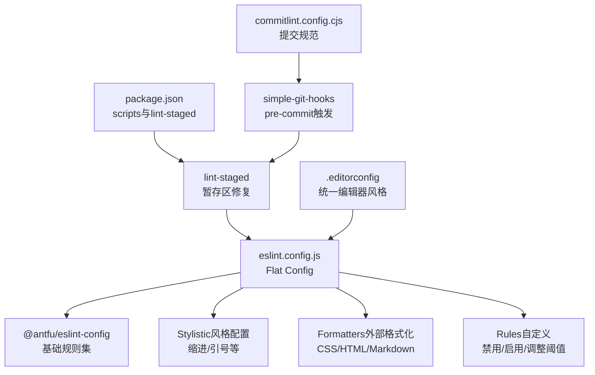
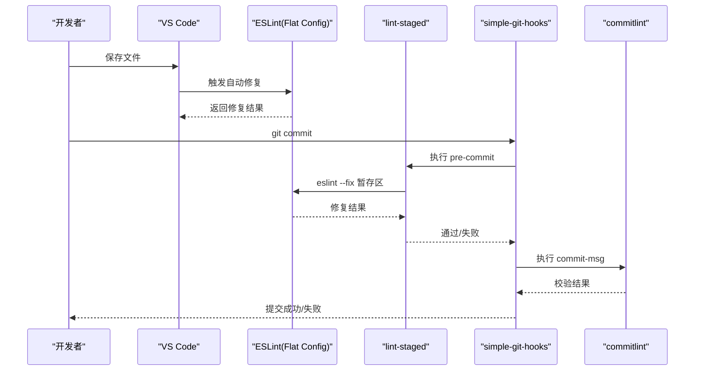
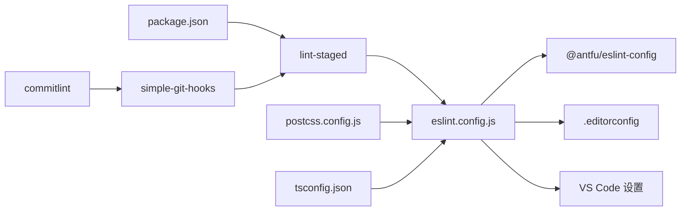

# ESLint配置与使用

<cite>
**本文引用的文件**
- [eslint.config.js](file://eslint.config.js)
- [package.json](file://package.json)
- [.editorconfig](file://.editorconfig)
- [README.md](file://README.md)
- [commitlint.config.cjs](file://commitlint.config.cjs)
- [postcss.config.js](file://postcss.config.js)
- [tsconfig.json](file://tsconfig.json)
- [src/main.ts](file://src/main.ts)
- [src/App.vue](file://src/App.vue)
- [src/views/login/Login.vue](file://src/views/login/Login.vue)
- [src/components/Logo.vue](file://src/components/Logo.vue)
</cite>

## 目录
1. [简介](#简介)
2. [项目结构](#项目结构)
3. [核心组件](#核心组件)
4. [架构总览](#架构总览)
5. [详细组件分析](#详细组件分析)
6. [依赖关系分析](#依赖关系分析)
7. [性能考虑](#性能考虑)
8. [故障排查指南](#故障排查指南)
9. [结论](#结论)
10. [附录](#附录)

## 简介
本项目采用 Flat Config（扁平化配置）方式管理ESLint规则，基于 antfu/eslint-config 提供的统一规范，结合项目特性进行定制化增强。配置覆盖Vue单文件组件、TypeScript、样式与格式化等多个维度，同时通过外部格式化程序（如Prettier）处理CSS、HTML、Markdown等文件，确保跨语言与跨文件类型的代码风格一致性。

此外，项目还集成了 EditorConfig、lint-staged、simple-git-hooks、commitlint 等工具链，形成从本地保存修复到提交拦截的完整质量保障闭环。

## 项目结构
围绕ESLint与代码规范的关键文件分布如下：
- ESLint配置：eslint.config.js（Flat Config）
- 包管理与脚本：package.json（含lint、lint:fix、lint-staged等）
- 编辑器风格：.editorconfig（缩进、换行、字符集等）
- VS Code集成：README.md中的ESLint设置片段
- 提交规范：commitlint.config.cjs（与ESLint联动的提交校验）
- 构建与样式：postcss.config.js、tsconfig.json（间接影响ESLint行为）

图表来源
- [eslint.config.js:1-62](file://eslint.config.js#L1-L62)
- [package.json:24-40](file://package.json#L24-L40)
- [.editorconfig:1-44](file://.editorconfig#L1-L44)
- [commitlint.config.cjs:1-156](file://commitlint.config.cjs#L1-L156)

章节来源
- [eslint.config.js:1-62](file://eslint.config.js#L1-L62)
- [package.json:24-40](file://package.json#L24-L40)
- [.editorconfig:1-44](file://.editorconfig#L1-L44)
- [README.md:134-184](file://README.md#L134-L184)
- [commitlint.config.cjs:1-156](file://commitlint.config.cjs#L1-L156)

## 核心组件
- Flat Config入口：eslint.config.js，集中声明stylistic风格、formatters外部格式化、rules自定义规则集。
- 规则集来源：@antfu/eslint-config，提供Vue、TypeScript、Node等生态的推荐规则。
- 风格与格式化：stylistic控制缩进与引号；formatters委托Prettier处理CSS/HTML/Markdown。
- 工具链集成：package.json中的lint、lint:fix、lint-staged；simple-git-hooks与commitlint形成提交前校验。

章节来源
- [eslint.config.js:1-62](file://eslint.config.js#L1-L62)
- [package.json:24-40](file://package.json#L24-L40)
- [README.md:134-184](file://README.md#L134-L184)

## 架构总览
ESLint在项目中的作用链路如下：
- 本地保存：VS Code通过ESLint扩展自动修复（需启用Flat Config支持与规则静音）。
- 代码提交：pre-commit触发lint-staged，对暂存区文件执行eslint --fix。
- 提交拦截：commit-msg阶段通过commitlint校验提交信息，避免不规范信息进入仓库。
- 外部格式化：对CSS/HTML/Markdown等文件，ESLint委托formatters（Prettier）统一格式化。

图表来源
- [README.md:134-184](file://README.md#L134-L184)
- [package.json:105-111](file://package.json#L105-L111)
- [commitlint.config.cjs:22-53](file://commitlint.config.cjs#L22-L53)

## 详细组件分析

### Flat Config配置要点
- 基础规则集：通过@antfu/eslint-config提供统一的Vue/TS/Native生态规则。
- Stylistic风格：统一缩进为2空格、引号为单引号，兼顾团队协作与可读性。
- Formatters外部格式化：对CSS/HTML启用内置格式化；对Markdown使用Prettier，确保跨文件类型的一致风格。
- 自定义规则：
  - 禁用console输出（开发期可临时开启调试，生产关闭）。
  - Vue组件块顺序约束（template/script/style），提升可读性与维护性。
  - 函数参数数量上限、嵌套深度上限、回调嵌套上限，降低复杂度。
  - 禁止Array构造函数多余参数、空代码块（允许catch空捕获）、必要字符串拼接、var声明、逗号分隔多变量、必须使用对象展开替代Object.assign、回调函数使用箭头函数。
  - 大括号风格（Stroustrup风格）与curly（强制所有控制语句使用大括号）。

章节来源
- [eslint.config.js:4-61](file://eslint.config.js#L4-L61)

### Stylistic风格配置详解
- 缩进：2个空格，与.editorconfig保持一致，便于VS Code等编辑器正确识别。
- 引号：单引号，减少转义与一致性成本。
- 行宽：EditorConfig中max_line_length=100，配合ESLint的长行提示与Prettier自动换行。
- 与EditorConfig的关系：两者共同约束团队风格，EditorConfig负责编辑器层面的基础约定，ESLint负责语法与风格规则的强制。

章节来源
- [eslint.config.js:6-9](file://eslint.config.js#L6-L9)
- [.editorconfig:25-31](file://.editorconfig#L25-L31)
- [README.md:134-184](file://README.md#L134-L184)

### Formatters外部格式化配置
- CSS/HTML：启用内置格式化，确保样式与标记的整洁。
- Markdown：使用Prettier进行格式化，统一标题、列表、代码块等格式。
- 与ESLint的关系：对于ESLint无法直接处理的文件类型，通过formatters委托外部工具，避免重复造轮子并提升一致性。

章节来源
- [eslint.config.js:10-15](file://eslint.config.js#L10-L15)

### 规则自定义指南
- 添加新规则：在rules对象中新增键值对，值可为["error"/"warn"/"off"]或带配置的对象形式。
- 修改现有规则：调整severity级别或传入配置对象（如max-params的参数上限）。
- 禁用特定规则：将对应规则设为"off"，或在IDE中通过rules.customizations临时静音（仅IDE提示，不影响ESLint执行）。
- Vue组件结构：block-order强制template/script/style顺序，避免混杂导致的可读性下降。
- 复杂度控制：max-params/max-depth/max-nested-callbacks限制函数复杂度，鼓励拆分与async/await替代深层回调。
- 代码质量：no-array-constructor/no-empty/no-useless-concat/no-var/one-var/prefer-object-spread/prefer-arrow-callback等规则提升代码质量与一致性。
- 大括号与风格：brace-style采用Stroustrup风格，curly强制所有控制语句使用大括号，提升可读性与一致性。

章节来源
- [eslint.config.js:18-60](file://eslint.config.js#L18-L60)
- [README.md:134-184](file://README.md#L134-L184)

### 与IDE的集成配置
- VS Code启用Flat Config：将"eslint.experimental.useFlatConfig"设为true。
- 关闭默认格式化并启用ESLint自动修复：prettier.enable=false，editor.formatOnSave=false，editor.codeActionsOnSave中开启"source.fixAll.eslint"。
- 静音风格类规则：通过rules.customizations关闭style/*、format/*、缩进/间距/顺序/末尾逗号/换行/引号/分号等规则，避免IDE过度提示，但仍由ESLint执行修复。
- 启用ESLint验证：在eslint.validate中包含javascript、typescript、vue、html、markdown、json等语言。

章节来源
- [README.md:134-184](file://README.md#L134-L184)

### 提交流程与ESLint联动
- pre-commit：通过simple-git-hooks触发lint-staged，对暂存区文件执行eslint --fix，修复失败将阻止提交。
- commit-msg：通过commitlint校验提交信息，避免不规范信息进入仓库。
- 与ESLint的关系：lint-staged直接调用ESLint修复，确保提交代码符合规范。

章节来源
- [package.json:105-111](file://package.json#L105-L111)
- [commitlint.config.cjs:22-53](file://commitlint.config.cjs#L22-L53)

### 实际代码示例与规则映射
- Vue单文件组件：App.vue、Login.vue、Logo.vue展示了模板、脚本与样式的组织方式，block-order规则要求template在前，script居中，style在后，有助于快速定位各部分。
- TS入口文件：main.ts展示了应用初始化流程，ESLint规则可帮助保持导入顺序与模块组织的规范性。

章节来源
- [src/App.vue:1-78](file://src/App.vue#L1-L78)
- [src/views/login/Login.vue:1-47](file://src/views/login/Login.vue#L1-L47)
- [src/components/Logo.vue:1-52](file://src/components/Logo.vue#L1-L52)
- [src/main.ts:1-30](file://src/main.ts#L1-L30)

## 依赖关系分析
- ESLint与工具链耦合：
  - eslint.config.js依赖@antfu/eslint-config提供的规则集。
  - package.json中的scripts与lint-staged将ESLint纳入CI/本地工作流。
  - simple-git-hooks与commitlint形成提交前拦截，与ESLint形成互补。
- 编辑器与ESLint：
  - .editorconfig与ESLint共同约束团队风格，VS Code通过rules.customizations静音风格类规则，避免干扰开发体验。
- 构建与样式：
  - postcss.config.js与tsconfig.json间接影响ESLint对样式与类型检查的上下文，确保规则在真实项目环境中有效。

图表来源
- [eslint.config.js:1-62](file://eslint.config.js#L1-L62)
- [package.json:24-40](file://package.json#L24-L40)
- [package.json:105-111](file://package.json#L105-L111)
- [commitlint.config.cjs:1-156](file://commitlint.config.cjs#L1-L156)
- [.editorconfig:1-44](file://.editorconfig#L1-L44)
- [postcss.config.js:1-53](file://postcss.config.js#L1-L53)
- [tsconfig.json:1-42](file://tsconfig.json#L1-L42)

章节来源
- [eslint.config.js:1-62](file://eslint.config.js#L1-L62)
- [package.json:24-40](file://package.json#L24-L40)
- [package.json:105-111](file://package.json#L105-L111)
- [commitlint.config.cjs:1-156](file://commitlint.config.cjs#L1-L156)
- [.editorconfig:1-44](file://.editorconfig#L1-L44)
- [postcss.config.js:1-53](file://postcss.config.js#L1-L53)
- [tsconfig.json:1-42](file://tsconfig.json#L1-L42)

## 性能考虑
- 规则复杂度控制：通过max-params、max-depth、max-nested-callbacks等规则限制函数复杂度，降低维护成本与潜在性能隐患。
- 外部格式化：对CSS/HTML/Markdown启用formatters，避免ESLint重复实现格式化逻辑，提升整体效率。
- IDE自动修复：VS Code中仅启用ESLint自动修复，避免多重格式化工具竞争带来的性能损耗。
- 缓存与增量：lint-staged仅处理暂存区文件，减少全量扫描开销。

## 故障排查指南
- VS Code中ESLint未生效或报错Flat Config相关问题：
  - 确认已启用"eslint.experimental.useFlatConfig": true。
  - 确保ESLint扩展版本支持Flat Config。
  - 在rules.customizations中静音风格类规则，避免IDE过度提示。
- 提交被pre-commit拦截：
  - 检查lint-staged配置与ESLint修复结果，确保暂存区文件通过修复。
  - 若存在不可修复的规则（如严重语法错误），先在本地修复再提交。
- 提交信息被commitlint拒绝：
  - 按照commitlint.config.cjs中的规则修正提交信息格式。
- EditorConfig与ESLint冲突：
  - 确保.editorconfig与eslint.config.js中的stylistic配置一致，避免重复约束。
- 格式化不生效：
  - 确认formatters对CSS/HTML/Markdown的启用状态，以及Prettier插件是否安装。

章节来源
- [README.md:134-184](file://README.md#L134-L184)
- [package.json:105-111](file://package.json#L105-L111)
- [commitlint.config.cjs:22-53](file://commitlint.config.cjs#L22-L53)
- [.editorconfig:1-44](file://.editorconfig#L1-L44)

## 结论
本项目通过Flat Config与@antfu/eslint-config实现了统一、可扩展的代码规范体系，结合stylistic风格与formatters外部格式化，覆盖Vue/TS/样式/标记/文档等多文件类型。配合lint-staged、simple-git-hooks与commitlint，形成从本地到远端的全流程质量保障。建议在团队内统一VS Code设置与规则静音策略，确保开发体验与规范执行的平衡。

## 附录
- 常用命令
  - 本地检查：npm run lint
  - 自动修复：npm run lint:fix
  - 提交前修复：git add && pnpm lint-staged 或使用git commit（受pre-commit钩子保护）
- 推荐实践
  - 在VS Code中启用ESLint自动修复，关闭默认格式化器，避免冲突。
  - 对新增规则先在本地验证，再在团队内讨论决定是否纳入默认配置。
  - 定期同步@antfu/eslint-config版本，保持规则集的现代化与稳定性。