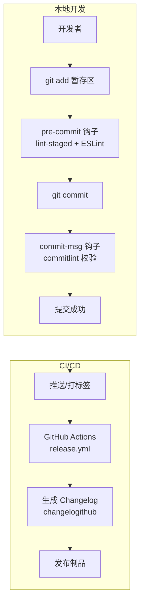
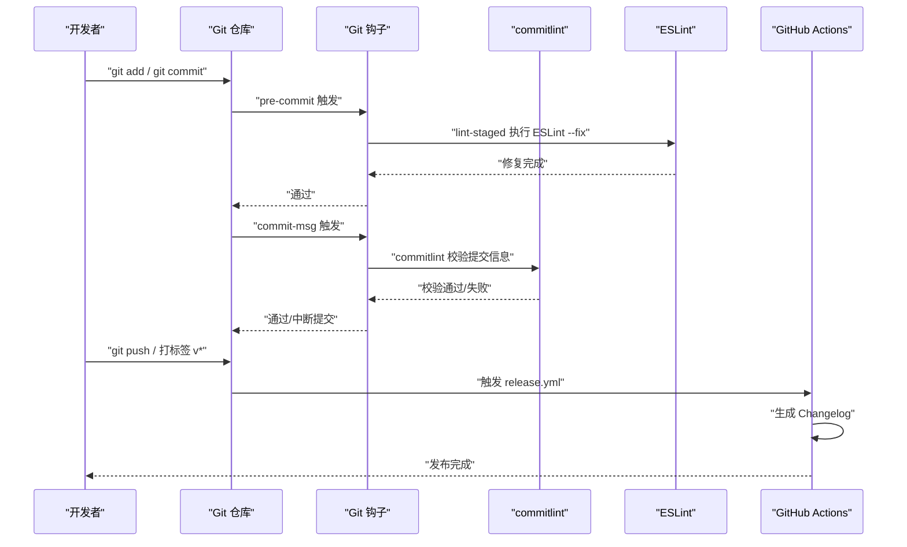
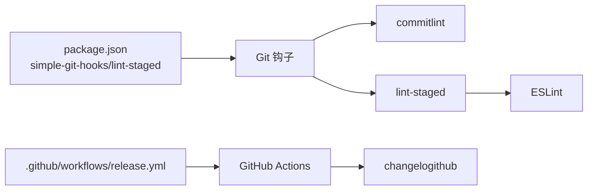

# Git提交规范与工作流

<cite>
**本文引用的文件**
- [commitlint.config.cjs](file://commitlint.config.cjs)
- [package.json](file://package.json)
- [.github/workflows/release.yml](file://.github/workflows/release.yml)
- [README.md](file://README.md)
- [eslint.config.js](file://eslint.config.js)
- [.gitignore](file://.gitignore)
</cite>

## 目录
1. [简介](#简介)
2. [项目结构](#项目结构)
3. [核心组件](#核心组件)
4. [架构总览](#架构总览)
5. [详细组件分析](#详细组件分析)
6. [依赖关系分析](#依赖关系分析)
7. [性能考虑](#性能考虑)
8. [故障排除指南](#故障排除指南)
9. [结论](#结论)
10. [附录](#附录)

## 简介
本文件面向Vue3微信H5移动端项目，系统化阐述Git提交规范与工作流，覆盖以下要点：
- conventional commits规范的实施与commitlint验证规则
- cz-git交互式提交向导的安装与配置
- Git工作流最佳实践（分支命名、合并策略、版本标签）
- pre-commit钩子与lint-staged自动化代码检查
- 提交信息编写指南（feat、fix、docs、style、refactor等）
- 冲突解决策略、远程协作流程与代码审查标准
- CI/CD集成中的Git工作流与自动化发布触发

## 项目结构
本项目围绕约定式提交与Git钩子形成完整的质量保障闭环：
- 提交规范与校验：commitlint + cz-git
- 本地钩子：simple-git-hooks（pre-commit、commit-msg）
- 自动化检查：lint-staged + ESLint
- CI发布：GitHub Actions按标签生成Changelog

图表来源
- [package.json:105-117](file://package.json#L105-L117)
- [.github/workflows/release.yml:14-32](file://.github/workflows/release.yml#L14-L32)

章节来源
- [package.json:105-117](file://package.json#L105-L117)
- [.github/workflows/release.yml:14-32](file://.github/workflows/release.yml#L14-L32)

## 核心组件
- 提交规范与校验
  - commitlint：基于conventional commits，结合项目自定义规则与cz-git提示词典
  - cz-git：交互式提交向导，提供emoji、别名、作用域等增强体验
- 本地钩子与自动化
  - simple-git-hooks：声明式管理Git钩子，避免husky的复杂性
  - lint-staged：仅对暂存区文件执行ESLint修复
- CI发布
  - GitHub Actions：监听标签，自动生成Changelog并触发发布

章节来源
- [commitlint.config.cjs:21-53](file://commitlint.config.cjs#L21-L53)
- [package.json:105-117](file://package.json#L105-L117)
- [.github/workflows/release.yml:14-32](file://.github/workflows/release.yml#L14-L32)

## 架构总览
从提交到发布的完整链路如下：

图表来源
- [package.json:105-117](file://package.json#L105-L117)
- [commitlint.config.cjs:21-53](file://commitlint.config.cjs#L21-L53)
- [.github/workflows/release.yml:14-32](file://.github/workflows/release.yml#L14-L32)

## 详细组件分析

### 提交规范与commitlint配置
- 规则继承与扩展
  - 继承conventional commits基础规则，确保团队统一的提交格式
  - 自定义规则覆盖长度限制、必填字段、类型枚举等
- 类型与作用域
  - 类型枚举包含feat、fix、perf、style、docs、test、refactor、build、ci、chore、revert、wip、workflow、types、release等
  - 作用域动态解析src目录结构，支持mock等特殊范围
- 交互式提示
  - cz-git提供中文提示、emoji、别名（如:f、:r、:s等）、可选的breaking change、issue前缀等
- 忽略规则
  - 忽略包含“init”的提交信息，便于初始化阶段清理

章节来源
- [commitlint.config.cjs:21-53](file://commitlint.config.cjs#L21-L53)
- [commitlint.config.cjs:63-66](file://commitlint.config.cjs#L63-L66)
- [commitlint.config.cjs:80-124](file://commitlint.config.cjs#L80-L124)
- [commitlint.config.cjs:138-146](file://commitlint.config.cjs#L138-L146)

### cz-git交互式提交向导
- 安装与配置
  - 全局安装commitizen CLI
  - 项目内使用cz-git作为适配器，通过package.json中的config.commitizen指向node_modules/cz-git
- 使用方式
  - 执行cz命令启动交互式向导
  - 支持快捷别名（如:f、:r、:s等）快速生成常用提交
  - 支持自定义作用域与空作用域、可选的breaking change与issue前缀
- 与commitlint联动
  - 通过commit-msg钩子自动校验提交信息格式

章节来源
- [README.md:242-250](file://README.md#L242-L250)
- [README.md:272-286](file://README.md#L272-L286)
- [package.json:112-116](file://package.json#L112-L116)

### Git工作流最佳实践
- 分支命名规范
  - 功能分支：feature/xxx
  - 修复分支：fix/xxx
  - 发布分支：release/vx.y.z
  - 热修复：hotfix/xxx
- 合并策略
  - 功能/修复分支通过Pull Request合并至develop/main
  - 主干分支采用快进合并或squash合并，保持提交历史整洁
- 版本标签管理
  - 语义化版本：vMAJOR.MINOR.PATCH
  - 通过CI监听标签触发发布流程

章节来源
- [.github/workflows/release.yml:11-12](file://.github/workflows/release.yml#L11-L12)

### pre-commit钩子与lint-staged
- 钩子配置
  - pre-commit：执行lint-staged
  - commit-msg：执行commitlint校验提交信息
- lint-staged规则
  - 对暂存区文件执行ESLint修复，确保提交前代码风格一致
- 与simple-git-hooks
  - 声明式配置，避免husky的复杂安装与跨平台差异

章节来源
- [package.json:105-117](file://package.json#L105-L117)
- [eslint.config.js:1-62](file://eslint.config.js#L1-L62)

### 提交信息编写指南
- 类型说明
  - feat：新增功能
  - fix：修复缺陷
  - perf：性能优化
  - style：不影响语义的代码调整（空格、格式化等）
  - docs：仅文档改动
  - test：测试相关
  - refactor：既不修复bug也不增加功能的代码重构
  - build：影响构建系统或外部依赖
  - ci：持续集成相关
  - chore：日常维护、配置更新等
  - revert：回滚某次提交
  - wip：开发中
  - workflow：工作流改进
  - types：类型定义文件改动
  - release：发布版本
- 结构建议
  - header：type(scope): subject（不超过108字符）
  - body：详细描述，必要时分行
  - footer：关联issue或breaking change说明
- cz-git别名速写
  - :f → docs: fix typos
  - :r → docs: update README
  - :s → style: update code format
  - :b → build: bump dependencies
  - :c → chore: update config

章节来源
- [commitlint.config.cjs:32-52](file://commitlint.config.cjs#L32-L52)
- [commitlint.config.cjs:54-62](file://commitlint.config.cjs#L54-L62)
- [commitlint.config.cjs:68-79](file://commitlint.config.cjs#L68-L79)
- [README.md:209-222](file://README.md#L209-L222)

### 冲突解决策略
- 预防
  - 小步提交、频繁同步远端分支
  - 优先使用feature分支隔离变更
- 解决
  - 使用IDE或命令行工具合并/变基
  - 严格遵循ESLint修复与提交规范
  - 合并后在本地执行一次完整构建与测试

### 远程协作流程
- Fork/Clone → 创建feature分支 → 编写代码与提交 → 推送 → 发起PR → 代码审查 → 合并
- 代码审查标准
  - 提交信息符合规范
  - 无ESLint警告/错误
  - 功能正确性与边界条件覆盖
  - 性能与安全风险评估

### CI/CD集成与自动化发布
- 触发条件
  - 推送标签（以v开头）
- 执行步骤
  - 检出代码、设置Node.js版本
  - 使用changelogithub生成Changelog
- 权限
  - 需要contents: write权限以写入Release

章节来源
- [.github/workflows/release.yml:9-32](file://.github/workflows/release.yml#L9-L32)

## 依赖关系分析
- 工具链耦合
  - simple-git-hooks管理钩子，依赖commitlint与lint-staged
  - cz-git依赖commitizen CLI，提供交互式提交体验
  - GitHub Actions依赖changelogithub生成发布说明
- 规则约束
  - commitlint规则与cz-git提示词典保持一致，避免提交信息不匹配

图表来源
- [package.json:105-117](file://package.json#L105-L117)
- [.github/workflows/release.yml:14-32](file://.github/workflows/release.yml#L14-L32)

章节来源
- [package.json:105-117](file://package.json#L105-L117)
- [.github/workflows/release.yml:14-32](file://.github/workflows/release.yml#L14-L32)

## 性能考虑
- 本地检查范围
  - 仅对暂存区文件执行ESLint修复，减少不必要的全量检查
- 提交信息校验
  - commitlint规则轻量，对提交速度影响极小
- CI生成Changelog
  - 仅在标签推送时触发，避免频繁运行

## 故障排除指南
- 首次安装后未生效
  - 执行更新git hooks命令以写入本地hooks
- 提交被拦截
  - 检查提交信息是否符合类型、作用域、长度等规则
  - 确认ESLint修复是否已应用到暂存区
- CI未生成Release
  - 确认推送了以v开头的标签
  - 检查GITHUB_TOKEN权限与actions权限配置

章节来源
- [README.md:232-238](file://README.md#L232-L238)
- [README.md:272-286](file://README.md#L272-L286)
- [.github/workflows/release.yml:6-7](file://.github/workflows/release.yml#L6-L7)

## 结论
本项目通过commitlint + cz-git + simple-git-hooks + lint-staged + GitHub Actions构建了完善的Git提交规范与工作流体系，既保证了提交信息的一致性与可读性，又实现了本地与CI端的自动化质量门禁，有助于提升团队协作效率与发布质量。

## 附录
- 常用命令
  - 更新Git钩子：npx simple-git-hooks
  - 交互式提交：cz
  - 本地检查：pnpm lint-staged
- 推荐阅读
  - README中关于提交规范与工作流的说明
  - commitlint与cz-git官方文档

章节来源
- [README.md:203-286](file://README.md#L203-L286)
- [commitlint.config.cjs:21-53](file://commitlint.config.cjs#L21-L53)
- [package.json:105-117](file://package.json#L105-L117)