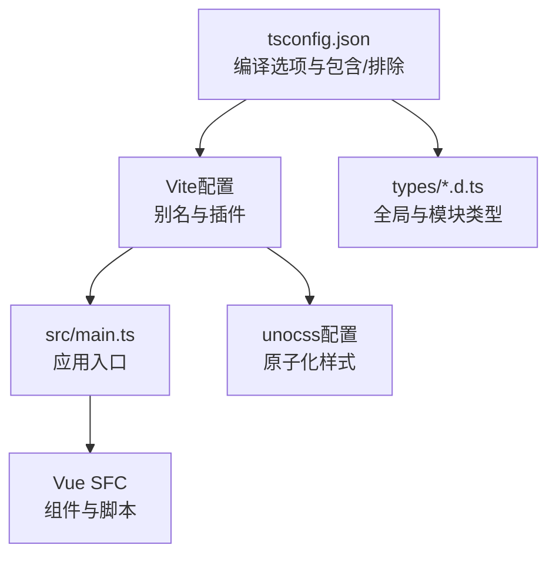
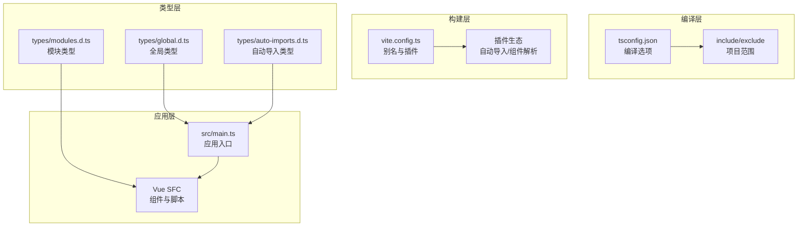
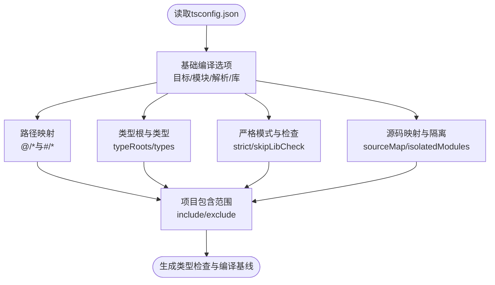
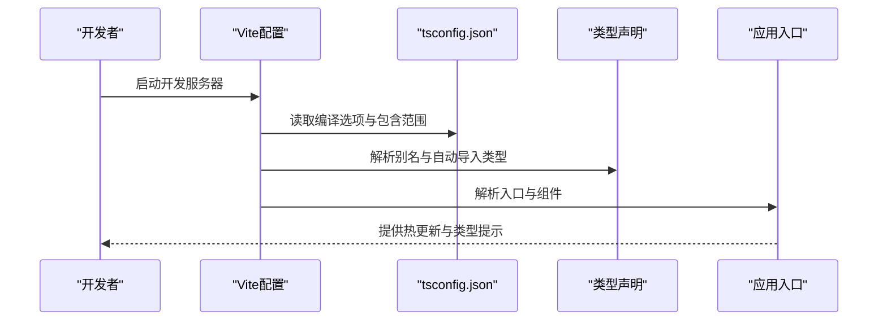
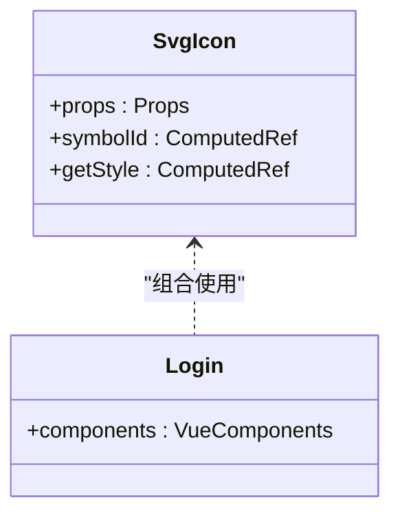
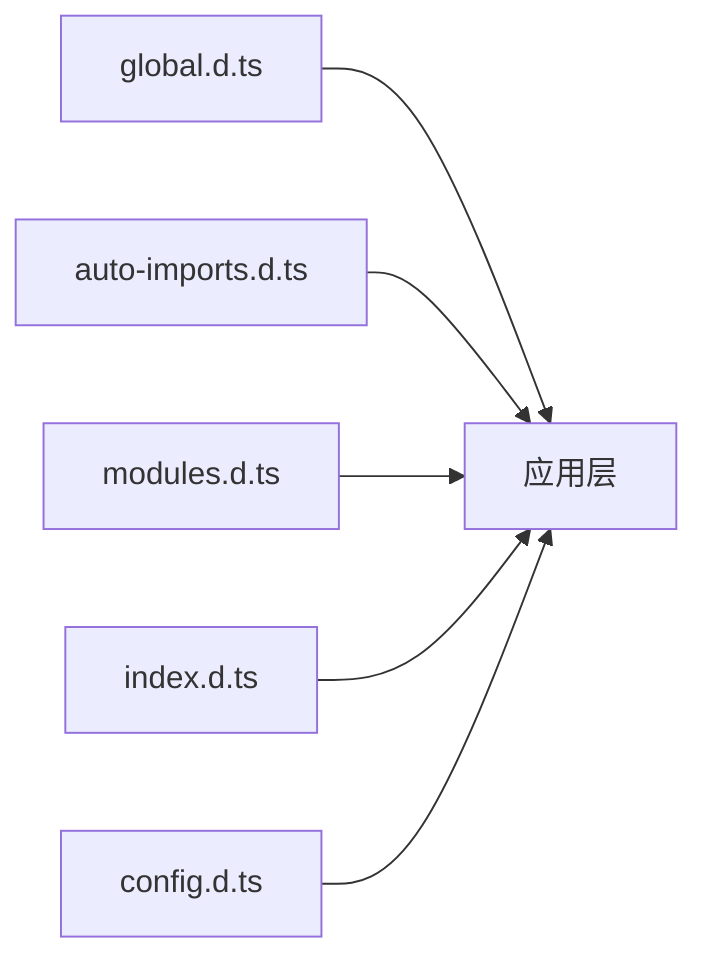
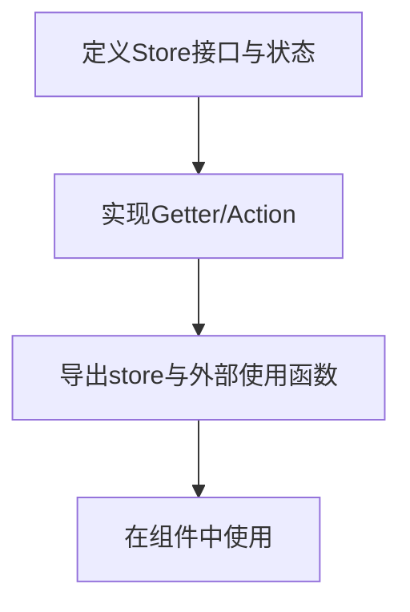
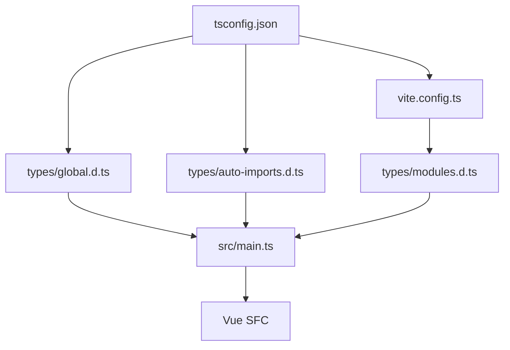

# TypeScript配置与优化

<cite>
**本文引用的文件**
- [tsconfig.json](file://tsconfig.json)
- [package.json](file://package.json)
- [vite.config.ts](file://vite.config.ts)
- [types/global.d.ts](file://types/global.d.ts)
- [types/index.d.ts](file://types/index.d.ts)
- [types/auto-imports.d.ts](file://types/auto-imports.d.ts)
- [types/config.d.ts](file://types/config.d.ts)
- [types/modules.d.ts](file://types/modules.d.ts)
- [src/main.ts](file://src/main.ts)
- [src/views/login/Login.vue](file://src/views/login/Login.vue)
- [src/components/SvgIcon.vue](file://src/components/SvgIcon.vue)
- [src/store/modules/user.ts](file://src/store/modules/user.ts)
- [uno.config.ts](file://uno.config.ts)
</cite>

## 目录
1. [简介](#简介)
2. [项目结构](#项目结构)
3. [核心组件](#核心组件)
4. [架构总览](#架构总览)
5. [详细组件分析](#详细组件分析)
6. [依赖关系分析](#依赖关系分析)
7. [性能考虑](#性能考虑)
8. [故障排查指南](#故障排查指南)
9. [结论](#结论)
10. [附录](#附录)

## 简介
本文件面向Vue3微信H5移动端项目，系统性梳理TypeScript配置与优化实践，重点覆盖：
- tsconfig.json核心配置项：严格模式、路径映射、模块解析策略
- 项目结构配置：include、exclude、references
- Vue3特有TS配置：SFC支持、Composition API类型推导、组件Props类型定义
- 类型声明文件管理：全局类型、第三方库类型、自定义扩展
- 性能优化：增量编译、装饰器元数据、源码映射
- 常见编译错误诊断与解决
- 与Vite构建工具的集成配置

## 项目结构
该项目采用“模块化+约定式”的组织方式，TypeScript配置与构建工具紧密协作：
- tsconfig.json集中管理编译选项与项目包含/排除规则
- types目录统一存放全局与模块类型声明
- Vite配置通过别名与插件体系实现路径映射与自动导入
- Vue SFC通过<script setup lang="ts">启用强类型推导

图表来源
- [tsconfig.json:1-42](file://tsconfig.json#L1-L42)
- [vite.config.ts:1-183](file://vite.config.ts#L1-L183)
- [src/main.ts:1-30](file://src/main.ts#L1-L30)
- [uno.config.ts:1-84](file://uno.config.ts#L1-L84)

章节来源
- [tsconfig.json:1-42](file://tsconfig.json#L1-L42)
- [vite.config.ts:1-183](file://vite.config.ts#L1-L183)
- [src/main.ts:1-30](file://src/main.ts#L1-L30)

## 核心组件
本节聚焦TypeScript配置的关键要素及其在项目中的落地。

- 编译目标与模块系统
  - 目标与库：ESNext目标与ESNext/DOM库确保现代语法与Web API类型可用
  - 模块与解析：ESNext模块与bundler解析策略配合Vite，提升开发体验与打包效率
  - JSX保留：preserve模式保证Vue JSX组件的正确处理
  - JSON解析：开启JSON模块解析以支持JSON资源导入

- 路径映射与类型根
  - 路径映射：@/*指向src、#/*指向types，统一模块解析与IDE跳转
  - 类型根：同时扫描node_modules/@types与types目录，确保第三方与自定义类型均被识别

- 严格模式与检查
  - 严格模式：开启严格模式，提升类型安全
  - 跳过库检查：skipLibCheck减少第三方库类型问题带来的编译开销
  - 单独的any检查：noImplicitAny适度放宽，结合业务实际平衡严格度

- 源码映射与模块隔离
  - 源码映射：开启sourceMap便于调试
  - 模块隔离：isolatedModules与Vite配合，避免单文件编译问题

- 项目包含与排除
  - 包含：src、types、mock、build、vite.config.ts等路径下的ts/d.ts/vue文件
  - 排除：node_modules、dist与所有.js文件，避免不必要的类型检查

章节来源
- [tsconfig.json:2-38](file://tsconfig.json#L2-L38)

## 架构总览
TypeScript与Vite在本项目中的协同架构如下：
- tsconfig.json提供统一的编译与类型检查基线
- Vite通过别名与插件实现路径映射与自动导入
- Vue SFC在<script setup lang="ts">中启用Composition API类型推导
- 类型声明文件在全局与模块层面提供类型增强

图表来源
- [tsconfig.json:25-38](file://tsconfig.json#L25-L38)
- [vite.config.ts:48-63](file://vite.config.ts#L48-L63)
- [types/global.d.ts:12-78](file://types/global.d.ts#L12-L78)
- [types/auto-imports.d.ts:1-320](file://types/auto-imports.d.ts#L1-L320)
- [types/modules.d.ts:4-9](file://types/modules.d.ts#L4-L9)
- [src/main.ts:13-27](file://src/main.ts#L13-L27)

## 详细组件分析

### 组件A：tsconfig.json配置详解
- 编译选项要点
  - 目标与库：ESNext与DOM库确保现代特性与浏览器API类型
  - 模块与解析：ESNext与bundler解析策略，与Vite的模块系统契合
  - 路径映射：@/*与#/*分别映射至src与types，统一模块解析
  - 类型根与类型：typeRoots与types确保第三方与自定义类型可用
  - 严格模式：严格模式提升类型安全；noImplicitAny适度放宽
  - 源码映射与模块隔离：sourceMap与isolatedModules提升开发体验
  - 跳过库检查：skipLibCheck减少第三方库类型问题

- 项目范围配置
  - include：覆盖src、types、mock、build与vite.config.ts等
  - exclude：排除node_modules、dist与.js文件

图表来源
- [tsconfig.json:2-38](file://tsconfig.json#L2-L38)

章节来源
- [tsconfig.json:2-38](file://tsconfig.json#L2-L38)

### 组件B：Vite集成与路径映射
- 别名配置
  - @/映射至src，#/映射至types，与tsconfig一致
  - 通过pathResolve确保绝对路径，避免相对路径别名导致的解析问题

- 插件与自动导入
  - 通过插件体系实现自动导入与组件解析，类型声明由auto-imports.d.ts提供

- 构建与开发差异
  - 开发：开启预热与代理，提升启动与联调效率
  - 构建：可选terser或oxc压缩，按需生成/关闭source map

图表来源
- [vite.config.ts:27-182](file://vite.config.ts#L27-L182)
- [tsconfig.json:7-13](file://tsconfig.json#L7-L13)
- [types/auto-imports.d.ts:1-320](file://types/auto-imports.d.ts#L1-L320)

章节来源
- [vite.config.ts:48-63](file://vite.config.ts#L48-L63)
- [vite.config.ts:156-177](file://vite.config.ts#L156-L177)

### 组件C：Vue SFC与Composition API类型推导
- SFC脚本启用
  - script setup与lang="ts"启用Composition API类型推导
  - defineProps/withDefaults提供强类型Props定义

- 组件示例
  - SvgIcon：withDefaults定义Props默认值，computed派生样式
  - Login：组件组合与模板渲染

图表来源
- [src/components/SvgIcon.vue:7-37](file://src/components/SvgIcon.vue#L7-L37)
- [src/views/login/Login.vue:15-21](file://src/views/login/Login.vue#L15-L21)

章节来源
- [src/components/SvgIcon.vue:7-37](file://src/components/SvgIcon.vue#L7-L37)
- [src/views/login/Login.vue:15-21](file://src/views/login/Login.vue#L15-L21)

### 组件D：类型声明文件管理
- 全局类型
  - global.d.ts：全局常量、事件接口、Vite环境变量接口等
  - JSX组件类型：为Vue JSX提供类型支持

- 自动导入类型
  - auto-imports.d.ts：由插件生成，包含大量Vue与生态API类型

- 模块类型
  - modules.d.ts：为.vue模块提供类型声明，确保SFC可被正确识别

- 自定义类型
  - index.d.ts：常用泛型、工具类型与接口
  - config.d.ts：全局配置接口定义

图表来源
- [types/global.d.ts:12-78](file://types/global.d.ts#L12-L78)
- [types/auto-imports.d.ts:1-320](file://types/auto-imports.d.ts#L1-L320)
- [types/modules.d.ts:4-9](file://types/modules.d.ts#L4-L9)
- [types/index.d.ts:1-30](file://types/index.d.ts#L1-L30)
- [types/config.d.ts:1-30](file://types/config.d.ts#L1-L30)

章节来源
- [types/global.d.ts:12-78](file://types/global.d.ts#L12-L78)
- [types/auto-imports.d.ts:1-320](file://types/auto-imports.d.ts#L1-L320)
- [types/modules.d.ts:4-9](file://types/modules.d.ts#L4-L9)
- [types/index.d.ts:1-30](file://types/index.d.ts#L1-L30)
- [types/config.d.ts:1-30](file://types/config.d.ts#L1-L30)

### 组件E：Pinia Store与类型定义
- 类型化状态
  - 用户信息接口与状态结构体定义
  - Getter与Action的类型约束

- 使用方式
  - defineStore定义store，返回类型安全的store实例
  - 外部使用函数封装store实例，便于非setup上下文访问

图表来源
- [src/store/modules/user.ts:12-109](file://src/store/modules/user.ts#L12-L109)

章节来源
- [src/store/modules/user.ts:12-109](file://src/store/modules/user.ts#L12-L109)

## 依赖关系分析
- tsconfig.json与Vite配置的耦合
  - 路径映射保持一致，避免解析差异
  - include/exclude影响Vite的依赖预构建与类型检查范围

- 类型声明文件的依赖
  - auto-imports.d.ts由插件生成，依赖于已安装的生态库
  - modules.d.ts为SFC提供类型，依赖于Vue版本

- 应用入口与组件的类型依赖
  - main.ts依赖全局类型与自动导入类型
  - SFC组件依赖modules.d.ts与全局类型

图表来源
- [tsconfig.json:7-13](file://tsconfig.json#L7-L13)
- [vite.config.ts:48-63](file://vite.config.ts#L48-L63)
- [types/global.d.ts:12-78](file://types/global.d.ts#L12-L78)
- [types/auto-imports.d.ts:1-320](file://types/auto-imports.d.ts#L1-L320)
- [types/modules.d.ts:4-9](file://types/modules.d.ts#L4-L9)
- [src/main.ts:13-27](file://src/main.ts#L13-L27)

章节来源
- [tsconfig.json:7-13](file://tsconfig.json#L7-L13)
- [vite.config.ts:48-63](file://vite.config.ts#L48-L63)
- [src/main.ts:13-27](file://src/main.ts#L13-L27)

## 性能考虑
- 增量编译与模块隔离
  - isolatedModules与Vite的单文件编译机制配合，提升开发时的编译速度
  - skipLibCheck减少第三方库类型检查开销

- 源码映射与调试
  - sourceMap开启便于定位错误，但生产环境可按需关闭以减小体积

- 构建优化
  - Vite 8默认使用oxc压缩，性能更优；可通过VITE_DROP_CONSOLE切换为terser以移除console
  - 依赖预构建optimizeDeps.include提升首屏加载与切换页面的响应速度

- 代码分割与缓存
  - 手动chunk策略将node_modules依赖拆分，提升缓存命中率

章节来源
- [tsconfig.json:19-23](file://tsconfig.json#L19-L23)
- [vite.config.ts:72-122](file://vite.config.ts#L72-L122)
- [vite.config.ts:156-177](file://vite.config.ts#L156-L177)

## 故障排查指南
- “找不到模块”或“路径解析失败”
  - 检查tsconfig.json与vite.config.ts中的路径映射是否一致
  - 确认baseUrl与paths配置正确，且使用绝对路径别名

- “缺少类型声明”或“自动导入未生效”
  - 确认types目录已被纳入include范围
  - 检查auto-imports.d.ts是否存在且未被排除
  - 重新安装依赖并触发插件重新生成类型声明

- “SFC类型错误”
  - 确保SFC脚本启用lang="ts"
  - 检查modules.d.ts是否正确声明.vue模块类型

- “严格模式相关错误”
  - 若业务允许，可适度放宽noImplicitAny或使用显式类型断言
  - 对第三方库类型问题，可结合skipLibCheck与类型覆盖

- “构建产物过大或压缩异常”
  - 根据VITE_DROP_CONSOLE选择terser或oxc
  - 关闭生产环境source map以减小体积

章节来源
- [tsconfig.json:7-13](file://tsconfig.json#L7-L13)
- [vite.config.ts:48-63](file://vite.config.ts#L48-L63)
- [types/modules.d.ts:4-9](file://types/modules.d.ts#L4-L9)
- [vite.config.ts:72-122](file://vite.config.ts#L72-L122)

## 结论
本项目通过tsconfig.json与Vite的协同配置，实现了：
- 统一的编译基线与严格的类型检查
- 明确的路径映射与类型声明管理
- Vue SFC与Composition API的强类型支持
- 高效的开发与构建流程

建议在后续迭代中持续关注：
- 类型声明的自动化与维护成本控制
- 第三方库类型的覆盖与兼容性
- 构建产物的体积与性能优化

## 附录
- 常用TypeScript脚本
  - 类型检查：通过package.json中的type:check脚本执行vue-tsc
  - 清理缓存：clean:cache与clean:lib脚本清理Vite与Node缓存

章节来源
- [package.json:33-39](file://package.json#L33-L39)
- [package.json:35-36](file://package.json#L35-L36)