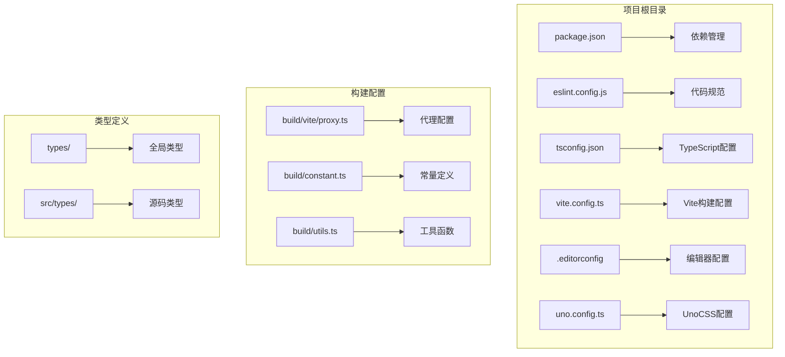
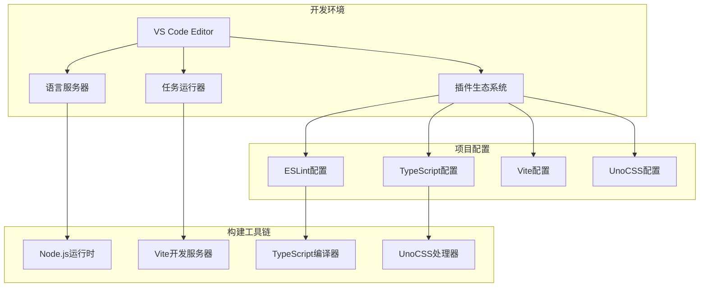
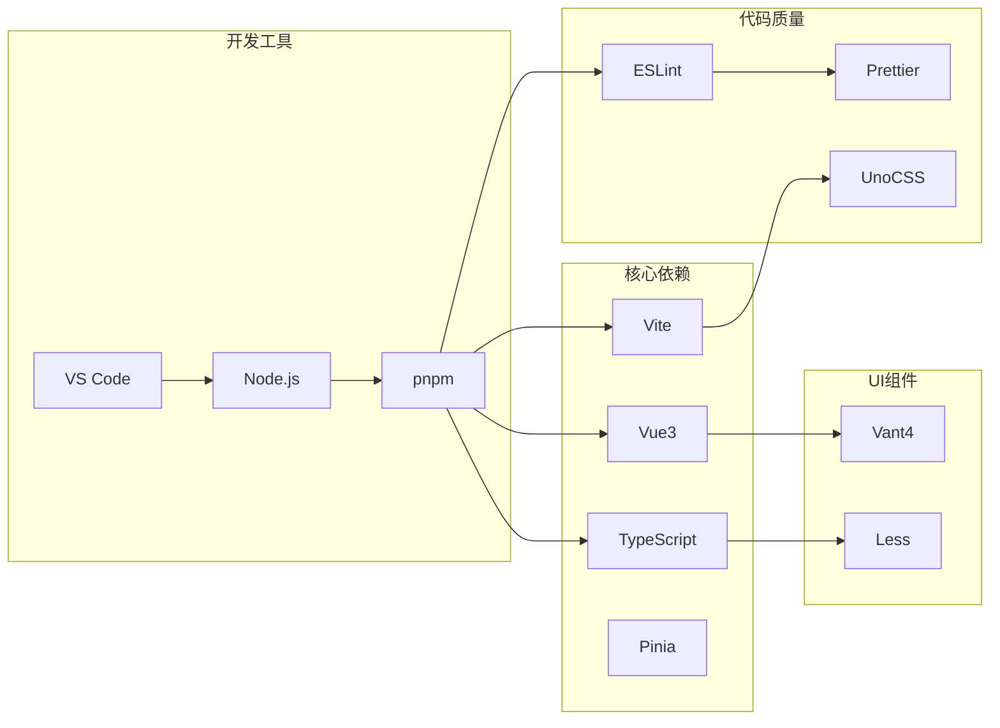

# VS Code开发环境配置

<cite>
**本文档引用的文件**
- [package.json](file://package.json)
- [eslint.config.js](file://eslint.config.js)
- [tsconfig.json](file://tsconfig.json)
- [vite.config.ts](file://vite.config.ts)
- [.editorconfig](file://.editorconfig)
- [README.md](file://README.md)
- [uno.config.ts](file://uno.config.ts)
- [build/vite/proxy.ts](file://build/vite/proxy.ts)
- [build/constant.ts](file://build/constant.ts)
- [build/utils.ts](file://build/utils.ts)
</cite>

## 目录
1. [简介](#简介)
2. [项目结构](#项目结构)
3. [核心组件](#核心组件)
4. [架构概览](#架构概览)
5. [详细组件分析](#详细组件分析)
6. [依赖关系分析](#依赖关系分析)
7. [性能考虑](#性能考虑)
8. [故障排除指南](#故障排除指南)
9. [结论](#结论)
10. [附录](#附录)

## 简介

本文件为Vue3微信H5移动端项目的VS Code开发环境配置指南。项目采用现代化前端技术栈，包括Vue3.5、Vite8、Vant4、Pinia、TypeScript、UnoCSS等主流技术。本文档旨在帮助开发者建立高效、一致的开发环境，涵盖插件推荐、工作区设置、调试配置、代码片段模板以及项目特定的VS Code设置。

## 项目结构

基于项目根目录的文件组织，主要包含以下关键配置文件：



**图表来源**
- [package.json:1-118](file://package.json#L1-L118)
- [vite.config.ts:1-183](file://vite.config.ts#L1-L183)
- [uno.config.ts:1-84](file://uno.config.ts#L1-L84)

**章节来源**
- [package.json:1-118](file://package.json#L1-L118)
- [vite.config.ts:1-183](file://vite.config.ts#L1-L183)

## 核心组件

### 推荐VS Code插件集合

基于项目技术栈，推荐以下插件组合：

#### Vue生态系统插件
- **Volar**: Vue开发必备，提供TypeScript支持和智能感知
- **TypeScript Vue Plugin (Volar)**: 为TypeScript服务器提供Vue插件支持
- **Vue IntelliSense**: 增强Vue组件开发体验

#### 代码质量插件
- **ESLint**: 代码检查和自动修复
- **EditorConfig for VS Code**: 统一团队编码风格
- **Error Lens**: 更好地定位和显示错误信息

#### 开发辅助插件
- **UnoCSS**: UnoCSS语法高亮和智能提示
- **DotENV**: .env文件语法高亮
- **Todo Tree**: 显示TODO、FIXME等注释标签
- **Trailing Spaces**: 突出显示和删除尾随空格

#### 格式化和美化插件
- **Prettier**: 代码格式化（与ESLint配合使用）
- **Pretty TypeScript Errors**: 使TypeScript错误更易理解

**章节来源**
- [README.md:118-133](file://README.md#L118-L133)

### ESLint集成配置

项目使用antfu/eslint-config作为代码规范检查工具，配置特点包括：

- 支持UnoCSS规则检查
- 统一的缩进风格（2空格）
- 组件顶级元素顺序强制（template/script/style）
- 严格的代码质量规则

**章节来源**
- [eslint.config.js:1-62](file://eslint.config.js#L1-L62)

### TypeScript语言服务配置

TypeScript配置包含以下关键设置：

- **路径映射**: `@/*` → `src/*`, `#/*` → `types/*`
- **严格模式**: 启用严格类型检查
- **模块解析**: 使用bundler解析策略
- **类型根目录**: 包含node_modules/@types和自定义types目录

**章节来源**
- [tsconfig.json:1-42](file://tsconfig.json#L1-L42)

## 架构概览

VS Code开发环境的整体架构如下：



**图表来源**
- [package.json:24-40](file://package.json#L24-L40)
- [vite.config.ts:27-182](file://vite.config.ts#L27-L182)

## 详细组件分析

### 工作区设置配置

#### EditorConfig兼容性设置

项目使用统一的EditorConfig配置，确保不同编辑器间的一致性：

- 字符编码: UTF-8
- 行尾符: LF
- 缩进风格: space
- 缩进大小: 2
- 最大行长: 100

#### 文件关联和语言映射

建议在VS Code中添加以下文件关联配置：

```jsonc
{
  "files.associations": {
    "*.vue": "vue",
    "*.less": "less",
    "*.md": "markdown"
  },
  "editor.quickSuggestions": {
    "strings": true,
    "comments": true,
    "other": true
  }
}
```

#### 快捷键自定义

推荐的快捷键映射：

- `Ctrl+Shift+P`: 命令面板
- `Ctrl+Alt+L`: 代码格式化
- `Ctrl+Shift+K`: 删除行
- `Ctrl+D`: 多光标选择下一个相同词

**章节来源**
- [.editorconfig:1-44](file://.editorconfig#L1-L44)

### 调试配置设置

#### Vue组件调试

基于Vite配置，推荐以下调试设置：

```jsonc
{
  "version": "0.2.0",
  "configurations": [
    {
      "type": "chrome",
      "request": "launch",
      "name": "Vue Dev Server",
      "url": "http://localhost:3000",
      "webRoot": "${workspaceFolder}",
      "sourceMaps": true,
      "skipFiles": ["<node_internals>/**", "**/node_modules/**"],
      "breakOnLoad": true
    }
  ]
}
```

#### TypeScript调试

TypeScript调试配置要点：

- 启用Source Maps
- 配置断点在TS源文件而非编译后的JS
- 使用`skipFiles`跳过node_modules中的文件

#### 移动端模拟调试

针对微信H5移动端开发，建议：

- 使用Chrome DevTools的设备模拟器
- 设置合适的视口尺寸（375px/750rpx）
- 启用触摸事件调试
- 监控网络请求和存储使用

**章节来源**
- [vite.config.ts:135-154](file://vite.config.ts#L135-L154)

### 代码片段和模板配置

#### Vue组件模板

推荐的Vue单文件组件模板结构：

```vue
<template>
  <!-- 组件模板 -->
</template>

<script setup lang="ts">
// 组件逻辑
</script>

<style scoped lang="less">
/* 组件样式 */
</style>
```

#### TypeScript接口定义模板

常用接口定义模板：

```typescript
interface ApiResponse<T> {
  code: number;
  message: string;
  data: T;
}

interface PaginationParams {
  page: number;
  pageSize: number;
}
```

#### API调用模板

HTTP请求封装模板：

```typescript
// api.ts
import axios from 'axios';

const apiClient = axios.create({
  baseURL: import.meta.env.VITE_API_BASE_URL,
  timeout: 10000,
});

export const api = {
  get: <T>(url: string): Promise<T> => apiClient.get(url).then(res => res.data),
  post: <T>(url: string, data?: any): Promise<T> => 
    apiClient.post(url, data).then(res => res.data),
};
```

**章节来源**
- [src/utils/http/axios/Axios.ts](file://src/utils/http/axios/Axios.ts)
- [src/utils/http/axios/types.ts](file://src/utils/http/axios/types.ts)

### 项目特定VS Code设置

#### 路径映射配置

基于tsconfig.json的路径映射设置：

```jsonc
{
  "compilerOptions": {
    "baseUrl": ".",
    "paths": {
      "@/*": ["src/*"],
      "#/*": ["types/*"]
    }
  }
}
```

#### 文件排除配置

建议在VS Code中排除以下文件：

```jsonc
{
  "exclude": [
    "node_modules",
    "dist",
    "**/*.js",
    "coverage",
    "*.log"
  ]
}
```

#### 语言服务配置

TypeScript语言服务优化：

```jsonc
{
  "typescript.preferences.importModuleSpecifier": "relative",
  "typescript.preferences.importModuleSpecifierEnding": "js",
  "typescript.suggest.autoImports": true,
  "typescript.suggest.completeFunctionCalls": true
}
```

**章节来源**
- [tsconfig.json:10-23](file://tsconfig.json#L10-L23)

## 依赖关系分析

项目开发环境的依赖关系如下：



**图表来源**
- [package.json:41-104](file://package.json#L41-L104)

**章节来源**
- [package.json:41-104](file://package.json#L41-L104)

## 性能考虑

### 开发服务器优化

基于Vite配置的性能优化建议：

- **依赖预构建**: 配置`optimizeDeps.include`包含常用依赖
- **代理配置**: 使用`createProxy`处理API请求转发
- **预热文件**: 配置`server.warmup.clientFiles`加速首次加载

### 编译性能优化

TypeScript编译优化：

- 启用`isolatedModules`提高编译速度
- 使用`skipLibCheck`跳过库文件检查
- 配置`typeRoots`指向必要的类型声明

**章节来源**
- [vite.config.ts:156-177](file://vite.config.ts#L156-L177)
- [tsconfig.json:17-23](file://tsconfig.json#L17-L23)

## 故障排除指南

### 常见问题解决

#### ESLint配置问题

如果ESLint无法正确识别配置：

1. 确保安装了ESLint扩展
2. 在settings.json中启用flat config支持
3. 检查eslint.config.js的语法正确性

#### TypeScript路径解析问题

如果导入路径无法解析：

1. 检查tsconfig.json中的paths配置
2. 确保baseUrl设置正确
3. 验证相对路径的准确性

#### Vite代理配置问题

如果API请求失败：

1. 检查.env.development中的VITE_PROXY配置
2. 确认代理前缀与API路径匹配
3. 验证目标服务器的可达性

**章节来源**
- [build/vite/proxy.ts:18-36](file://build/vite/proxy.ts#L18-L36)

## 结论

本配置文档为Vue3微信H5移动端项目提供了完整的VS Code开发环境设置指南。通过合理配置插件、工作区设置、调试环境和代码模板，可以显著提升开发效率和代码质量。建议团队成员统一使用相同的配置，确保开发环境的一致性和协作效率。

## 附录

### 开发效率提升技巧

#### 多光标编辑
- `Ctrl+Alt+上/下`: 创建多光标
- `Ctrl+D`: 选择下一个相同词
- `Ctrl+Shift+L`: 选择所有相同词

#### 代码重构
- `F2`: 重命名符号
- `Shift+F6`: 安全重命名
- `Ctrl+.`: 快速修复

#### 实时预览功能
- 使用Live Server扩展进行实时预览
- 配置文件保存时自动刷新
- Chrome DevTools进行实时调试

### 与其他开发工具集成

#### 终端设置
```jsonc
{
  "terminal.integrated.cursorBlinking": true,
  "terminal.integrated.fontSize": 14,
  "terminal.integrated.fontFamily": "Consolas"
}
```

#### Git集成
- 使用GitLens增强Git功能
- 配置提交模板和验证
- 设置分支管理和合并策略

#### 远程开发支持
- 使用Remote-SSH连接远程服务器
- 配置容器开发环境
- 设置同步和备份策略