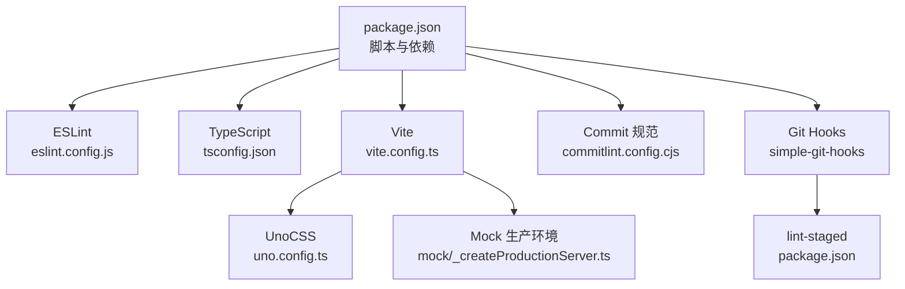
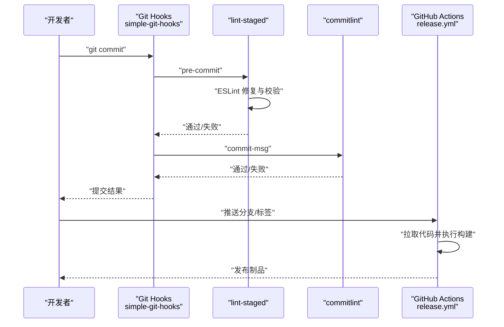
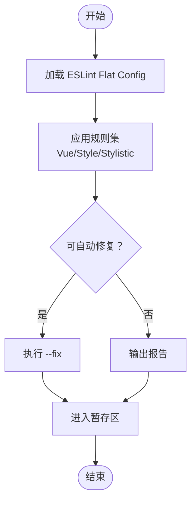
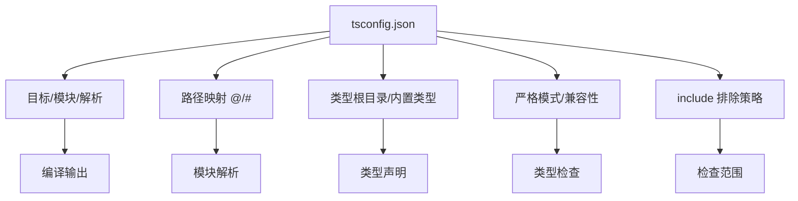
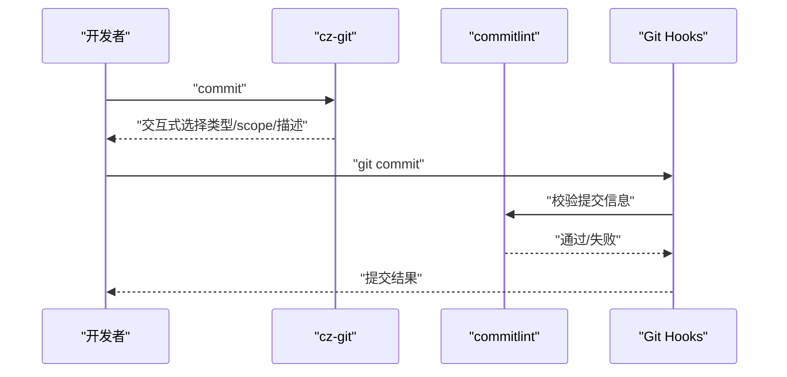
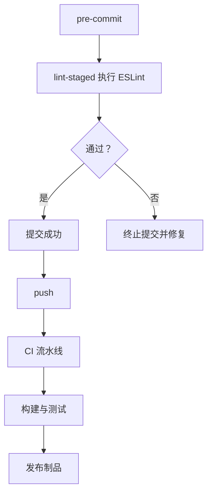
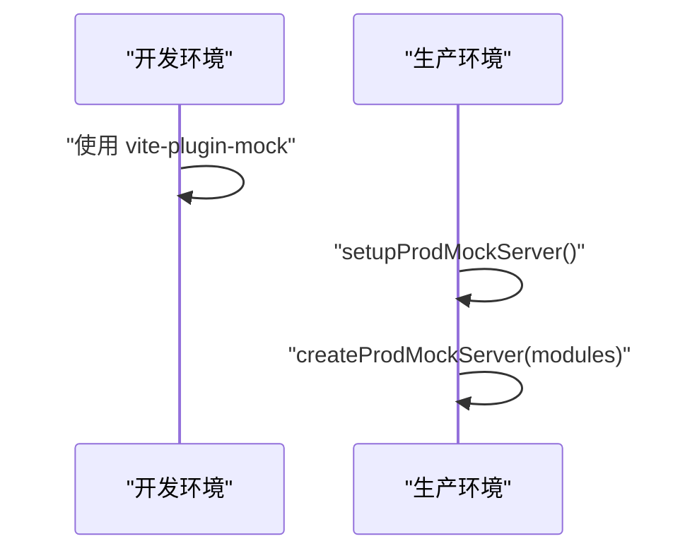
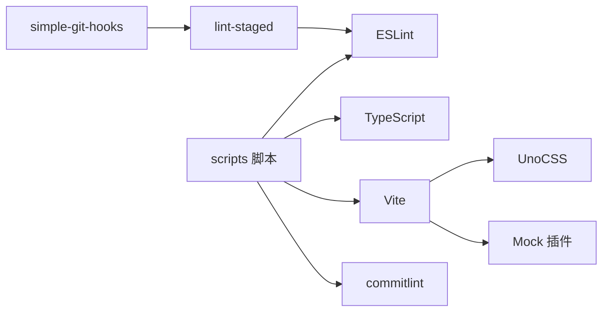

# 开发工具与规范

<cite>
**本文引用的文件**
- [package.json](file://package.json)
- [eslint.config.js](file://eslint.config.js)
- [tsconfig.json](file://tsconfig.json)
- [commitlint.config.cjs](file://commitlint.config.cjs)
- [vite.config.ts](file://vite.config.ts)
- [.editorconfig](file://.editorconfig)
- [uno.config.ts](file://uno.config.ts)
- [mock/_createProductionServer.ts](file://mock/_createProductionServer.ts)
- [.github/workflows/release.yml](file://.github/workflows/release.yml)
</cite>

## 目录
1. [简介](#简介)
2. [项目结构](#项目结构)
3. [核心组件](#核心组件)
4. [架构总览](#架构总览)
5. [详细组件分析](#详细组件分析)
6. [依赖关系分析](#依赖关系分析)
7. [性能考量](#性能考量)
8. [故障排查指南](#故障排查指南)
9. [结论](#结论)
10. [附录](#附录)

## 简介
本文件面向 Vue3 微信 H5 移动端项目，系统化梳理开发工具链与工程规范，覆盖以下主题：
- ESLint 配置与自动修复：Flat Config 支持、规则定制与格式化联动
- TypeScript 配置优化：编译选项、路径映射、类型检查策略
- Git 提交规范：commitlint 规则、cz-git 提交向导、提交信息格式
- 代码质量保障：lint-staged、pre-commit 钩子与 CI/CD 集成
- VS Code 推荐配置：插件、工作区设置与调试
- 工程化最佳实践：依赖管理、构建优化、性能监控
- 常见问题与调试技巧
- 团队协作规范与工作流

## 项目结构
项目采用 Vite + Vue3 + TypeScript + UnoCSS + Mock 的现代化前端栈，结合 ESLint、commitlint、lint-staged 与 simple-git-hooks 构建完整的质量保障体系。

**图表来源**
- [package.json:24-117](file://package.json#L24-L117)
- [eslint.config.js:1-62](file://eslint.config.js#L1-L62)
- [tsconfig.json:1-42](file://tsconfig.json#L1-L42)
- [vite.config.ts:1-183](file://vite.config.ts#L1-L183)
- [commitlint.config.cjs:1-156](file://commitlint.config.cjs#L1-L156)
- [uno.config.ts:1-84](file://uno.config.ts#L1-L84)
- [mock/_createProductionServer.ts:1-19](file://mock/_createProductionServer.ts#L1-L19)

**章节来源**
- [package.json:24-117](file://package.json#L24-L117)
- [vite.config.ts:1-183](file://vite.config.ts#L1-L183)

## 核心组件
- ESLint：基于 Flat Config 的统一规则集，启用 Vue 专用规则与样式化规则，集成外部格式化器（如 Prettier）处理 CSS/HTML/Markdown
- TypeScript：严格模式、路径映射、bundler 解析、类型根目录与排除策略
- Commitlint：约定式提交规则、动态 scope 推断、交互式 cz-git 提交向导
- Lint-staged + simple-git-hooks：pre-commit 自动校验与修复，commit-msg 校验提交信息
- Vite：构建优化、代理、依赖预优化、产物拆分与 sourcemap 控制
- UnoCSS：原子化 CSS、rem→px 转换、图标与变体组、safelist 动态类名
- Mock：开发与生产环境的 Mock 服务

**章节来源**
- [eslint.config.js:1-62](file://eslint.config.js#L1-L62)
- [tsconfig.json:1-42](file://tsconfig.json#L1-L42)
- [commitlint.config.cjs:1-156](file://commitlint.config.cjs#L1-L156)
- [package.json:105-117](file://package.json#L105-L117)
- [vite.config.ts:1-183](file://vite.config.ts#L1-L183)
- [uno.config.ts:1-84](file://uno.config.ts#L1-L84)
- [mock/_createProductionServer.ts:1-19](file://mock/_createProductionServer.ts#L1-L19)

## 架构总览
下图展示从本地开发到 CI/CD 的关键流程：本地提交经 git hooks 校验，随后进入 CI 流水线进行构建与发布。

**图表来源**
- [package.json:105-117](file://package.json#L105-L117)
- [commitlint.config.cjs:22-53](file://commitlint.config.cjs#L22-L53)
- [.github/workflows/release.yml](file://.github/workflows/release.yml)

## 详细组件分析

### ESLint 配置与使用
- Flat Config 支持：使用 Flat Config 导出配置，便于模块化与继承
- 规则定制：
  - Vue 组件块顺序约束
  - 函数参数、嵌套深度、回调层级上限
  - 禁止无意义拼接、var、逗号分隔多变量、Array 构造函数等
  - 强制箭头函数、一致大括号风格、必需大括号
- 格式化联动：对 CSS/HTML/Markdown 使用外部格式化器（如 Prettier）
- 自动修复：通过脚本与 lint-staged 集成，确保提交前修复可修复问题

**图表来源**
- [eslint.config.js:1-62](file://eslint.config.js#L1-L62)
- [package.json:37-39](file://package.json#L37-L39)
- [package.json:109-111](file://package.json#L109-L111)

**章节来源**
- [eslint.config.js:1-62](file://eslint.config.js#L1-L62)
- [package.json:37-39](file://package.json#L37-L39)
- [package.json:109-111](file://package.json#L109-L111)

### TypeScript 配置优化
- 编译目标与模块：ESNext 目标、ESNext 模块、bundler 解析
- 路径映射：@/* → src/*；#/* → types/*
- 类型根目录与类型声明：统一纳入 node_modules/@types 与 types 目录
- 严格模式与兼容：严格、跳过库检查、隔离模块、允许合成默认导入、esModuleInterop
- include/exclude：限定 TS 检查范围，避免 .js 文件参与类型检查

**图表来源**
- [tsconfig.json:1-42](file://tsconfig.json#L1-L42)

**章节来源**
- [tsconfig.json:1-42](file://tsconfig.json#L1-L42)

### Git 提交规范与工具
- commitlint 规则：
  - 约定式类型：feat/fix/perf/style/docs/test/refactor/build/ci/chore/revert/wip/workflow/types/release 等
  - 限制 header 长度、主体/页脚换行、必填 subject/type
  - 动态推断 scope：根据 git 状态自动识别改动目录
- cz-git 提交向导：
  - 交互式选择类型、scope、是否 breaking、关联 issue
  - 支持别名与自定义快捷键
- 提交钩子：
  - commit-msg：使用 commitlint 校验提交信息
  - pre-commit：触发 lint-staged 执行 ESLint 修复

**图表来源**
- [commitlint.config.cjs:22-155](file://commitlint.config.cjs#L22-L155)
- [package.json:105-117](file://package.json#L105-L117)

**章节来源**
- [commitlint.config.cjs:1-156](file://commitlint.config.cjs#L1-L156)
- [package.json:105-117](file://package.json#L105-L117)

### 代码质量保障体系
- lint-staged：仅对暂存文件执行 ESLint 修复
- simple-git-hooks：集中管理 Git hooks，避免平台差异
- CI/CD：GitHub Actions 流水线负责拉取、安装、构建与发布

**图表来源**
- [package.json:105-117](file://package.json#L105-L117)
- [.github/workflows/release.yml](file://.github/workflows/release.yml)

**章节来源**
- [package.json:105-117](file://package.json#L105-L117)
- [.github/workflows/release.yml](file://.github/workflows/release.yml)

### VS Code 开发环境推荐
- 插件建议：
  - ESLint、TypeScript TSServer、Vue Language Features、UnoCSS、Prettier、EditorConfig、GitLens
- 工作区设置：
  - 统一缩进（空格 2）、行尾 LF、末尾换行、最大行长 100
  - 关闭 Markdown Trailing Space（按需）
- 调试配置：
  - 使用 Vite 开发服务器调试，结合断点与网络面板定位接口与资源加载问题

**章节来源**
- [.editorconfig:1-44](file://.editorconfig#L1-L44)

### 工程化最佳实践
- 依赖管理：
  - 使用 pnpm，锁定版本与 packageManager 版本
  - 严格区分 dependencies 与 devDependencies
- 构建优化：
  - Vite 目标 ES2015，按需选择 oxc 或 terser 压缩器
  - 依赖预优化与手动拆分第三方包，减少首屏阻塞
  - 关闭生产 sourcemap，开启压缩体积报告
- 性能监控：
  - 使用可视化插件观察包体构成，识别大体积依赖
  - 结合路由懒加载与组件按需加载策略

**章节来源**
- [package.json:1-118](file://package.json#L1-L118)
- [vite.config.ts:72-122](file://vite.config.ts#L72-L122)

### Mock 与生产环境
- 开发环境：Vite 内置 Mock 插件按模块热更新
- 生产环境：手动聚合 mock 模块并初始化生产 Mock 服务

**图表来源**
- [mock/_createProductionServer.ts:1-19](file://mock/_createProductionServer.ts#L1-L19)
- [vite.config.ts:180](file://vite.config.ts#L180)

**章节来源**
- [mock/_createProductionServer.ts:1-19](file://mock/_createProductionServer.ts#L1-L19)
- [vite.config.ts:180](file://vite.config.ts#L180)

## 依赖关系分析
- 脚本与工具链：
  - ESLint、lint-staged、simple-git-hooks、commitlint、cz-git、TypeScript、Vite、UnoCSS、Mock
- 关键耦合点：
  - package.json 中的 scripts 与 simple-git-hooks 钩子共同驱动本地质量门禁
  - Vite 配置与 UnoCSS、Mock 插件协同决定构建与运行时行为

**图表来源**
- [package.json:24-117](file://package.json#L24-L117)
- [vite.config.ts:1-183](file://vite.config.ts#L1-L183)
- [uno.config.ts:1-84](file://uno.config.ts#L1-L84)
- [mock/_createProductionServer.ts:1-19](file://mock/_createProductionServer.ts#L1-L19)

**章节来源**
- [package.json:24-117](file://package.json#L24-L117)
- [vite.config.ts:1-183](file://vite.config.ts#L1-L183)

## 性能考量
- 构建阶段：
  - 选择合适的压缩器与移除 console/Debugger 策略
  - 控制 chunk 大小告警阈值，合理拆分第三方依赖
- 运行阶段：
  - 依赖预优化与 exclude 策略减少冷启动开销
  - CSS 目标浏览器版本与 Less 注入全局变量，减少运行时计算

**章节来源**
- [vite.config.ts:72-122](file://vite.config.ts#L72-L122)

## 故障排查指南
- ESLint 无法自动修复某些文件
  - 检查是否正确配置外部格式化器与规则
  - 确认 lint-staged 任务已执行
- 提交被拒绝
  - 查看 commit-msg 钩子输出，修正类型/scope/长度/格式
- 构建体积过大
  - 使用可视化插件分析包体，识别大依赖并考虑拆分或替换
- 生产环境 Mock 未生效
  - 确认生产 Mock 初始化逻辑已执行，mock 模块聚合正确

**章节来源**
- [eslint.config.js:1-62](file://eslint.config.js#L1-L62)
- [commitlint.config.cjs:22-53](file://commitlint.config.cjs#L22-L53)
- [vite.config.ts:100-122](file://vite.config.ts#L100-L122)
- [mock/_createProductionServer.ts:16-18](file://mock/_createProductionServer.ts#L16-L18)

## 结论
本项目通过 ESLint、TypeScript、commitlint、lint-staged、simple-git-hooks 与 Vite/UnoCSS/Mock 等工具链，构建了从本地到 CI/CD 的完整质量保障闭环。建议团队严格遵循提交规范与代码风格，持续优化构建与性能指标，确保在微信 H5 场景下的稳定性与可维护性。

## 附录
- 常用脚本速览
  - 开发：dev
  - 预览：preview
  - 构建：build
  - 类型检查：type:check
  - 代码检查：lint / lint:fix
  - 本地校验：lint:lint-staged
- VS Code 插件清单（建议）
  - ESLint、TypeScript TSServer、Vue Language Features、UnoCSS、Prettier、EditorConfig、GitLens

**章节来源**
- [package.json:24-40](file://package.json#L24-L40)
- [.editorconfig:1-44](file://.editorconfig#L1-L44)