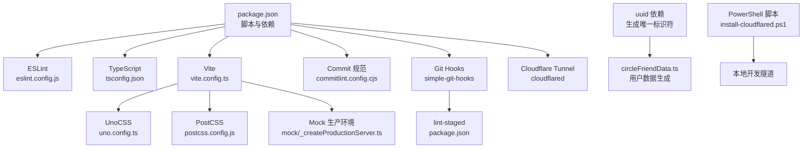
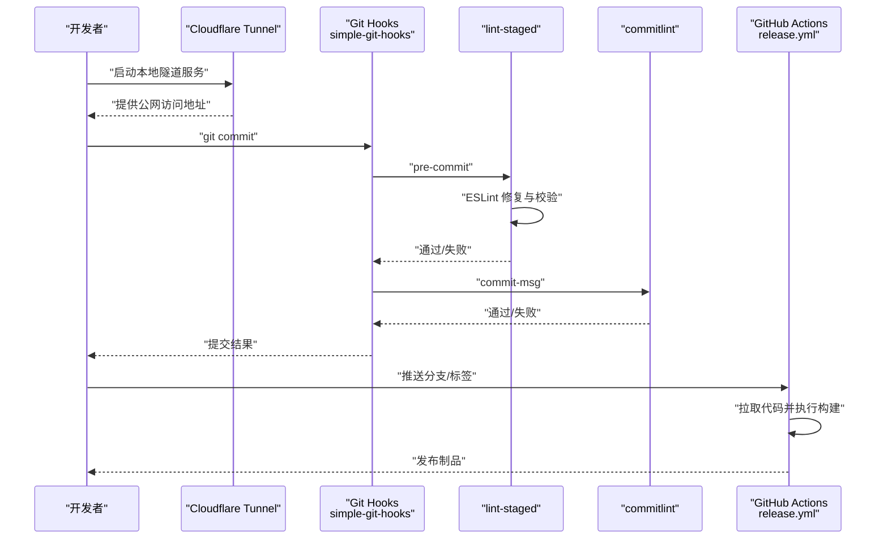
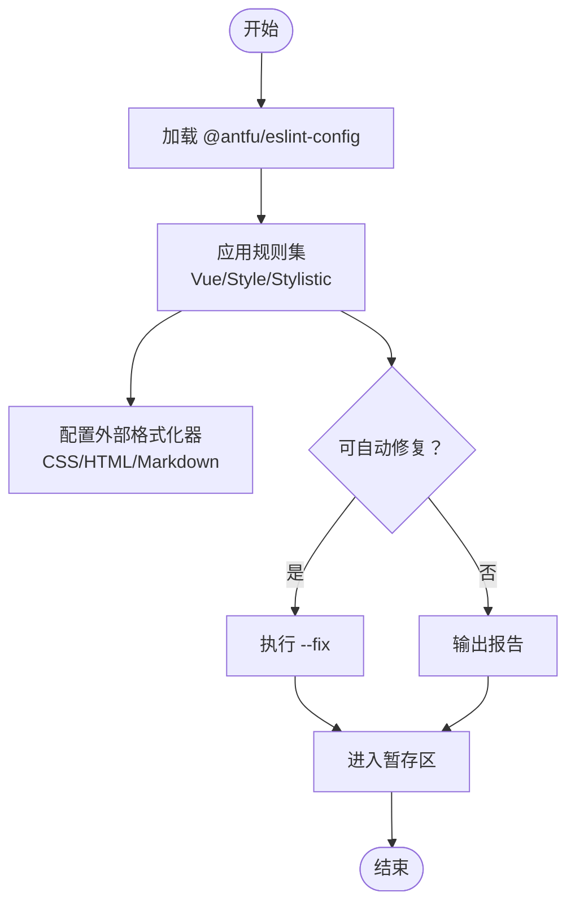
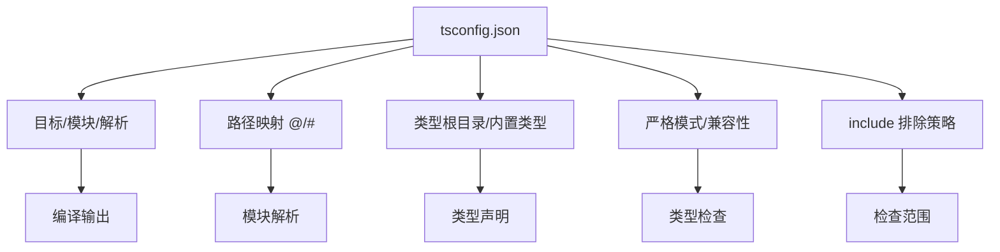
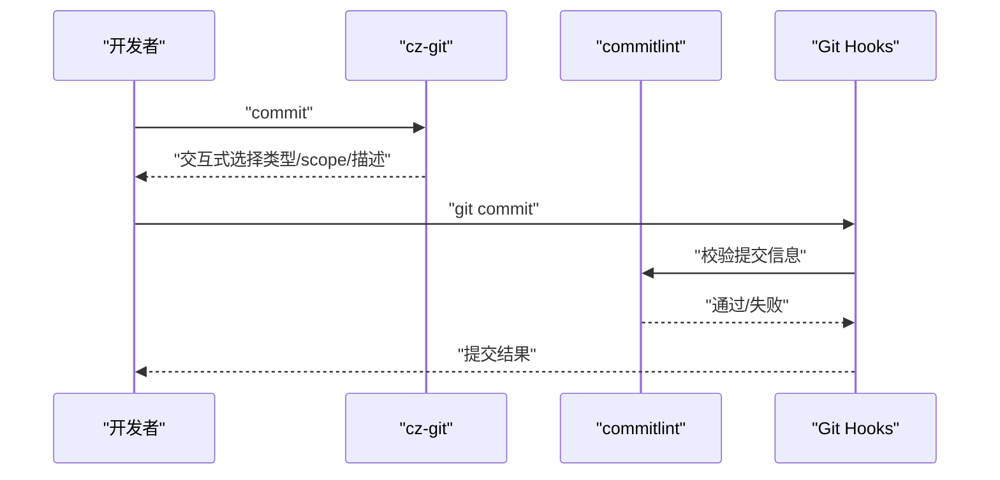
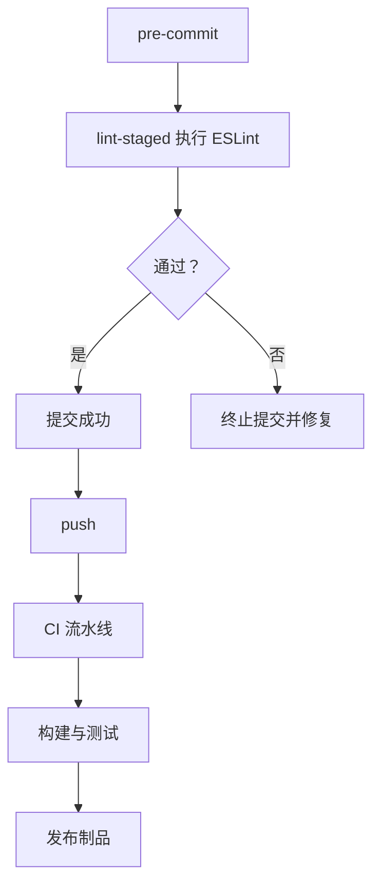
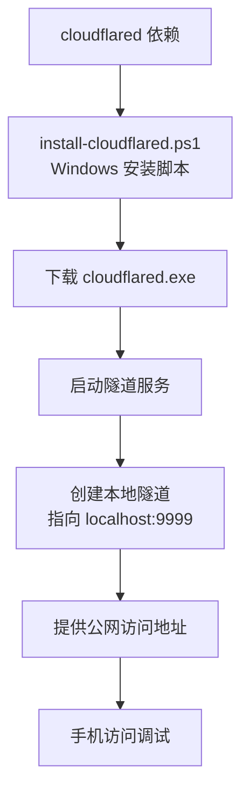
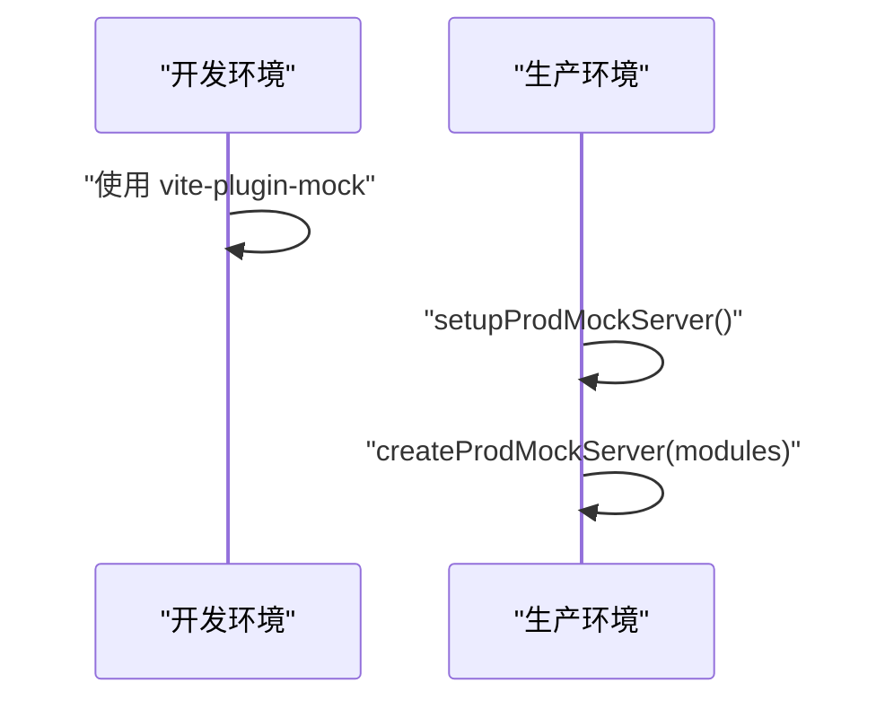
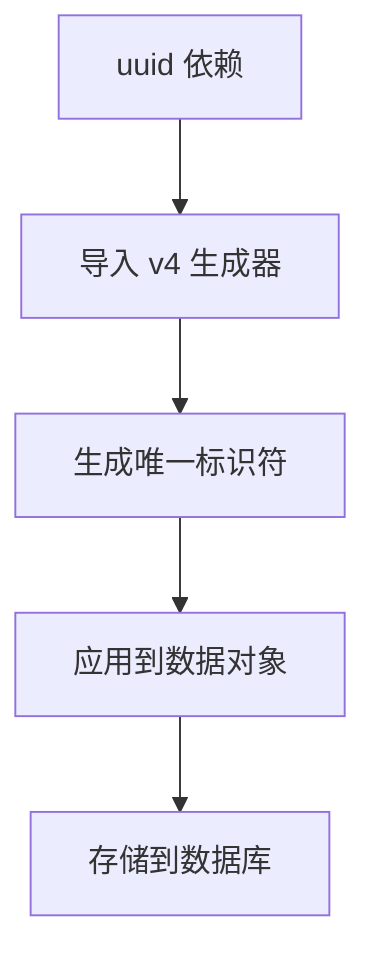
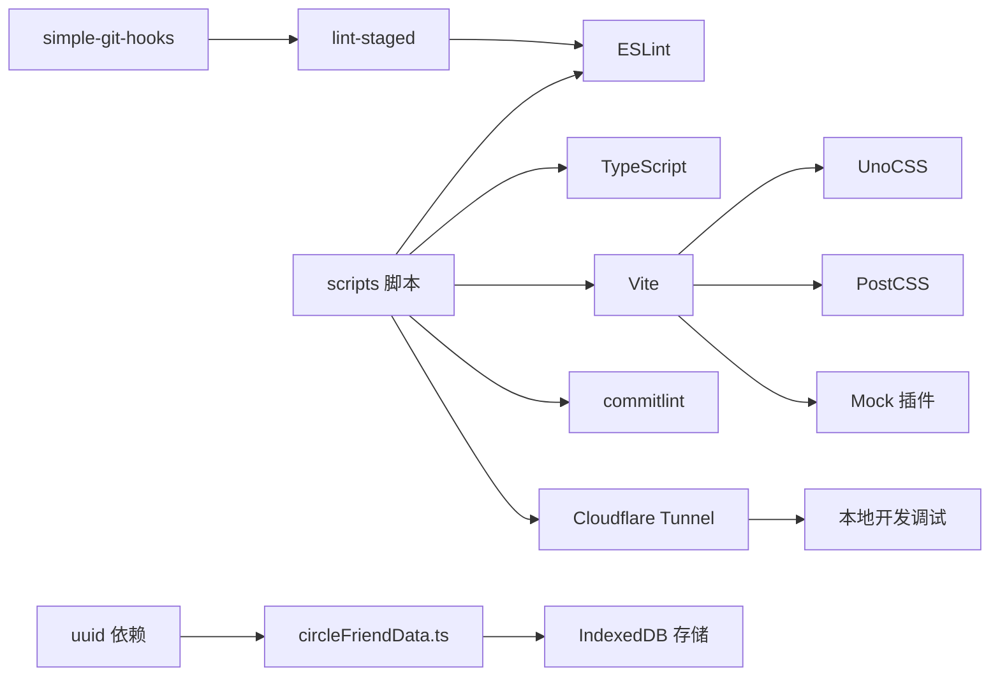

# 开发工具与规范

<cite>
**本文引用的文件**
- [package.json](file://package.json)
- [eslint.config.js](file://eslint.config.js)
- [tsconfig.json](file://tsconfig.json)
- [commitlint.config.cjs](file://commitlint.config.cjs)
- [vite.config.ts](file://vite.config.ts)
- [uno.config.ts](file://uno.config.ts)
- [postcss.config.js](file://postcss.config.js)
- [scripts/cloudflare-tunnel.js](file://scripts/cloudflare-tunnel.js)
- [scripts/install-cloudflared.ps1](file://scripts/install-cloudflared.ps1)
- [mock/_createProductionServer.ts](file://mock/_createProductionServer.ts)
- [.github/workflows/release.yml](file://.github/workflows/release.yml)
- [src/data/circleFriendData.ts](file://src/data/circleFriendData.ts)
</cite>

## 更新摘要
**变更内容**
- 完全移除了 ngrok 隧道服务依赖，更新开发工具配置以反映新的 Cloudflare Tunnel 替代方案
- 新增 cloudflared 依赖用于本地开发隧道服务
- 新增 Cloudflare Tunnel 相关脚本和 PowerShell 安装脚本
- 更新开发工具配置以支持新的隧道服务替代方案

## 目录
1. [简介](#简介)
2. [项目结构](#项目结构)
3. [核心组件](#核心组件)
4. [架构总览](#架构总览)
5. [详细组件分析](#详细组件分析)
6. [依赖关系分析](#依赖关系分析)
7. [性能考量](#性能考量)
8. [故障排查指南](#故障排查指南)
9. [结论](#结论)
10. [附录](#附录)

## 简介
本文件面向 Vue3 微信 H5 移动端项目，系统化梳理开发工具链与工程规范，覆盖以下主题：
- ESLint 配置与自动修复：Flat Config 支持、规则定制与格式化联动
- TypeScript 配置优化：编译选项、路径映射、类型检查策略
- Git 提交规范：commitlint 规则、cz-git 提交向导、提交信息格式
- 代码质量保障：lint-staged、pre-commit 钩子与 CI/CD 集成
- VS Code 推荐配置：插件、工作区设置与调试
- 工程化最佳实践：依赖管理、构建优化、性能监控
- Cloudflare Tunnel 开发工具：本地隧道服务替代 ngrok 方案
- 常见问题与调试技巧
- 团队协作规范与工作流

## 项目结构
项目采用 Vite + Vue3 + TypeScript + UnoCSS + Mock 的现代化前端栈，结合 ESLint、commitlint、lint-staged 与 simple-git-hooks 构建完整的质量保障体系。现已完全移除 ngrok 依赖，采用 Cloudflare Tunnel 作为本地开发隧道服务替代方案。

**图表来源**
- [package.json:23-41](file://package.json#L23-L41)
- [package.json:107-117](file://package.json#L107-L117)
- [scripts/cloudflare-tunnel.js:1-38](file://scripts/cloudflare-tunnel.js#L1-L38)
- [scripts/install-cloudflared.ps1:1-21](file://scripts/install-cloudflared.ps1#L1-L21)

**章节来源**
- [package.json:23-41](file://package.json#L23-L41)
- [package.json:107-117](file://package.json#L107-L117)
- [scripts/cloudflare-tunnel.js:1-38](file://scripts/cloudflare-tunnel.js#L1-L38)
- [scripts/install-cloudflared.ps1:1-21](file://scripts/install-cloudflared.ps1#L1-L21)

## 核心组件
- ESLint：基于 @antfu/eslint-config 的统一规则集，启用 Vue 专用规则与样式化规则，集成外部格式化器（如 Prettier）处理 CSS/HTML/Markdown
- TypeScript：严格模式、路径映射、bundler 解析、类型根目录与排除策略
- Commitlint：约定式提交规则、动态 scope 推断、交互式 cz-git 提交向导
- Lint-staged + simple-git-hooks：pre-commit 自动校验与修复，commit-msg 校验提交信息
- Vite：构建优化、代理、依赖预优化、产物拆分与 sourcemap 控制
- UnoCSS：原子化 CSS、rem→px 转换、图标与变体组、safelist 动态类名
- PostCSS：移动端适配方案，支持 px→vw/vh 转换与 autoprefixer
- Mock：开发与生产环境的 Mock 服务
- uuid：用于生成唯一标识符，确保数据唯一性和一致性
- Cloudflare Tunnel：本地开发隧道服务，替代 ngrok 方案，提供安全稳定的内网穿透

**章节来源**
- [eslint.config.js:1-71](file://eslint.config.js#L1-L71)
- [tsconfig.json:1-42](file://tsconfig.json#L1-L42)
- [commitlint.config.cjs:1-156](file://commitlint.config.cjs#L1-L156)
- [vite.config.ts:1-184](file://vite.config.ts#L1-L184)
- [uno.config.ts:1-96](file://uno.config.ts#L1-L96)
- [postcss.config.js:1-53](file://postcss.config.js#L1-L53)
- [mock/_createProductionServer.ts:1-19](file://mock/_createProductionServer.ts#L1-L19)
- [src/data/circleFriendData.ts:1-238](file://src/data/circleFriendData.ts#L1-L238)

## 架构总览
下图展示从本地开发到 CI/CD 的关键流程：本地提交经 git hooks 校验，随后进入 CI 流水线进行构建与发布。Cloudflare Tunnel 作为本地开发隧道服务，为微信 H5 移动端开发提供稳定的内网穿透能力。

**图表来源**
- [package.json:23](file://package.json#L23)
- [package.json:107-117](file://package.json#L107-L117)
- [commitlint.config.cjs:22-53](file://commitlint.config.cjs#L22-L53)
- [.github/workflows/release.yml](file://.github/workflows/release.yml)

## 详细组件分析

### ESLint 配置与使用
- Flat Config 支持：使用 @antfu/eslint-config 作为基础配置，提供更完善的规则集
- 规则定制：
  - Vue 组件块顺序约束
  - 函数参数、嵌套深度、回调层级上限
  - 禁止无意义拼接、var、逗号分隔多变量、Array 构造函数等
  - 强制箭头函数、一致大括号风格、必需大括号
- 格式化联动：对 CSS/HTML/Markdown 使用外部格式化器（如 Prettier）
- 自动修复：通过脚本与 lint-staged 集成，确保提交前修复可修复问题

**更新** 新增了对 @antfu/eslint-config 的使用，提供更完善的规则集和格式化支持

**图表来源**
- [eslint.config.js:1-71](file://eslint.config.js#L1-L71)
- [package.json:31-33](file://package.json#L31-L33)
- [package.json:111-112](file://package.json#L111-L112)

**章节来源**
- [eslint.config.js:1-71](file://eslint.config.js#L1-L71)
- [package.json:31-33](file://package.json#L31-L33)
- [package.json:111-112](file://package.json#L111-L112)

### TypeScript 配置优化
- 编译目标与模块：ESNext 目标、ESNext 模块、bundler 解析
- 路径映射：@/* → src/*；#/* → types/*
- 类型根目录与类型声明：统一纳入 node_modules/@types 与 types 目录
- 严格模式与兼容：严格、跳过库检查、隔离模块、允许合成默认导入、esModuleInterop
- include/exclude：限定 TS 检查范围，避免 .js 文件参与类型检查

**图表来源**
- [tsconfig.json:1-42](file://tsconfig.json#L1-L42)

**章节来源**
- [tsconfig.json:1-42](file://tsconfig.json#L1-L42)

### Git 提交规范与工具
- commitlint 规则：
  - 约定式类型：feat/fix/perf/style/docs/test/refactor/build/ci/chore/revert/wip/workflow/types/release 等
  - 限制 header 长度、主体/页脚换行、必填 subject/type
  - 动态推断 scope：根据 git 状态自动识别改动目录
- cz-git 提交向导：
  - 交互式选择类型、scope、是否 breaking、关联 issue
  - 支持别名与自定义快捷键
- 提交钩子：
  - commit-msg：使用 commitlint 校验提交信息
  - pre-commit：触发 lint-staged 执行 ESLint 修复

**图表来源**
- [commitlint.config.cjs:22-155](file://commitlint.config.cjs#L22-L155)
- [package.json:107-117](file://package.json#L107-L117)

**章节来源**
- [commitlint.config.cjs:1-156](file://commitlint.config.cjs#L1-L156)
- [package.json:107-117](file://package.json#L107-L117)

### 代码质量保障体系
- lint-staged：仅对暂存文件执行 ESLint 修复
- simple-git-hooks：集中管理 Git hooks，避免平台差异
- CI/CD：GitHub Actions 流水线负责拉取、安装、构建与发布

**图表来源**
- [package.json:107-117](file://package.json#L107-L117)
- [.github/workflows/release.yml](file://.github/workflows/release.yml)

**章节来源**
- [package.json:107-117](file://package.json#L107-L117)
- [.github/workflows/release.yml](file://.github/workflows/release.yml)

### VS Code 开发环境推荐
- 插件建议：
  - ESLint、TypeScript TSServer、Vue Language Features、UnoCSS、Prettier、EditorConfig、GitLens
- 工作区设置：
  - 统一缩进（空格 2）、行尾 LF、末尾换行、最大行长 100
  - 关闭 Markdown Trailing Space（按需）
- 调试配置：
  - 使用 Vite 开发服务器调试，结合断点与网络面板定位接口与资源加载问题

**章节来源**
- [postcss.config.js:1-53](file://postcss.config.js#L1-L53)

### 工程化最佳实践
- 依赖管理：
  - 使用 pnpm，锁定版本与 packageManager 版本
  - 严格区分 dependencies 与 devDependencies
- 构建优化：
  - Vite 目标 ES2015，按需选择 oxc 或 terser 压缩器
  - 依赖预优化与手动拆分第三方包，减少首屏阻塞
  - 关闭生产 sourcemap，开启压缩体积报告
- 性能监控：
  - 使用可视化插件观察包体构成，识别大体积依赖
  - 结合路由懒加载与组件按需加载策略

**章节来源**
- [package.json:1-120](file://package.json#L1-L120)
- [vite.config.ts:73-123](file://vite.config.ts#L73-L123)

### Cloudflare Tunnel 开发工具
- 依赖引入：在 package.json 的 dependencies 中添加 `"cloudflared": "^0.7.1"`
- 本地开发隧道服务：
  - 使用 `cloudflared` 库创建本地隧道，指向本地 9999 端口
  - 提供公网访问地址，支持手机访问调试
  - 自动处理错误和退出事件，支持 Ctrl+C 停止
- PowerShell 安装脚本：
  - 自动下载并安装 cloudflared.exe
  - 支持 Windows 系统的本地开发隧道服务
  - 一键启动隧道服务，无需手动配置

**更新** 新增 Cloudflare Tunnel 替代 ngrok 的本地开发工具配置

**图表来源**
- [package.json:41](file://package.json#L41)
- [scripts/install-cloudflared.ps1:1-21](file://scripts/install-cloudflared.ps1#L1-L21)
- [scripts/cloudflare-tunnel.js:1-38](file://scripts/cloudflare-tunnel.js#L1-L38)

**章节来源**
- [package.json:41](file://package.json#L41)
- [scripts/install-cloudflared.ps1:1-21](file://scripts/install-cloudflared.ps1#L1-L21)
- [scripts/cloudflare-tunnel.js:1-38](file://scripts/cloudflare-tunnel.js#L1-L38)

### Mock 与生产环境
- 开发环境：Vite 内置 Mock 插件按模块热更新
- 生产环境：手动聚合 mock 模块并初始化生产 Mock 服务

**图表来源**
- [mock/_createProductionServer.ts:1-19](file://mock/_createProductionServer.ts#L1-L19)
- [vite.config.ts:181](file://vite.config.ts#L181)

**章节来源**
- [mock/_createProductionServer.ts:1-19](file://mock/_createProductionServer.ts#L1-L19)
- [vite.config.ts:181](file://vite.config.ts#L181)

### UUID 依赖与使用
- 依赖引入：在 package.json 的 dependencies 中添加 `"uuid": "^13.0.0"`
- 使用场景：主要用于生成朋友圈数据的唯一标识符，确保每条动态都有唯一的 uuid
- 实现方式：在 `src/data/circleFriendData.ts` 中导入 `v4 as uuidv4` 并在各个数据对象中生成唯一标识符

**更新** 新增 uuid 依赖用于生成唯一标识符，确保数据唯一性和一致性

**图表来源**
- [package.json:49](file://package.json#L49)
- [src/data/circleFriendData.ts:1](file://src/data/circleFriendData.ts#L1)
- [src/data/circleFriendData.ts:17](file://src/data/circleFriendData.ts#L17)

**章节来源**
- [package.json:49](file://package.json#L49)
- [src/data/circleFriendData.ts:1-238](file://src/data/circleFriendData.ts#L1-L238)

### UnoCSS 与 PostCSS 配置
- UnoCSS：原子化 CSS、rem→px 转换、图标与变体组、safelist 动态类名
- PostCSS：移动端适配方案，支持 px→vw/vh 转换与 autoprefixer
- 配置特点：
  - 支持微信图标系统，自定义图标集合
  - 动态 safelist 配置，确保运行时类名正常生成
  - 支持多种预设和变换器，提升开发效率

**更新** 新增 UnoCSS 与 PostCSS 配置分析，包括图标系统和移动端适配方案

**章节来源**
- [uno.config.ts:1-96](file://uno.config.ts#L1-L96)
- [postcss.config.js:1-53](file://postcss.config.js#L1-L53)

## 依赖关系分析
- 脚本与工具链：
  - ESLint、lint-staged、simple-git-hooks、commitlint、cz-git、TypeScript、Vite、UnoCSS、PostCSS、Mock、Cloudflare Tunnel
- 关键耦合点：
  - package.json 中的 scripts 与 simple-git-hooks 钩子共同驱动本地质量门禁
  - Vite 配置与 UnoCSS、PostCSS、Mock 插件协同决定构建与运行时行为
  - uuid 依赖与数据生成模块形成新的依赖关系
  - Cloudflare Tunnel 作为新的开发工具，替代 ngrok 依赖

**更新** 新增 Cloudflare Tunnel 依赖关系分析，移除 ngrok 相关依赖

**图表来源**
- [package.json:17-35](file://package.json#L17-L35)
- [package.json:107-117](file://package.json#L107-L117)
- [scripts/cloudflare-tunnel.js:1-38](file://scripts/cloudflare-tunnel.js#L1-L38)
- [src/data/circleFriendData.ts:1-238](file://src/data/circleFriendData.ts#L1-L238)

**章节来源**
- [package.json:17-35](file://package.json#L17-L35)
- [package.json:107-117](file://package.json#L107-L117)
- [scripts/cloudflare-tunnel.js:1-38](file://scripts/cloudflare-tunnel.js#L1-L38)
- [src/data/circleFriendData.ts:1-238](file://src/data/circleFriendData.ts#L1-L238)

## 性能考量
- 构建阶段：
  - 选择合适的压缩器与移除 console/Debugger 策略
  - 控制 chunk 大小告警阈值，合理拆分第三方依赖
- 运行阶段：
  - 依赖预优化与 exclude 策略减少冷启动开销
  - CSS 目标浏览器版本与 Less 注入全局变量，减少运行时计算
  - UnoCSS 动态 safelist 配置，避免不必要的 CSS 生成

**章节来源**
- [vite.config.ts:73-123](file://vite.config.ts#L73-L123)
- [uno.config.ts:85-94](file://uno.config.ts#L85-L94)

## 故障排查指南
- ESLint 无法自动修复某些文件
  - 检查是否正确配置外部格式化器与规则
  - 确认 lint-staged 任务已执行
  - 验证 @antfu/eslint-config 配置是否正确加载
- 提交被拒绝
  - 查看 commit-msg 钩子输出，修正类型/scope/长度/格式
- 构建体积过大
  - 使用可视化插件分析包体，识别大依赖并考虑拆分或替换
- 生产环境 Mock 未生效
  - 确认生产 Mock 初始化逻辑已执行，mock 模块聚合正确
- uuid 相关问题
  - 检查 uuid 依赖是否正确安装
  - 验证数据生成过程中 uuid 是否正常生成
  - 确认数据库存储时 uuid 字段是否正确写入
- Cloudflare Tunnel 连接问题
  - 检查 cloudflared 依赖是否正确安装
  - 验证 PowerShell 脚本权限设置
  - 确认本地端口 9999 是否被占用
  - 查看隧道连接状态和错误日志

**更新** 新增 Cloudflare Tunnel 相关故障排查指导

**章节来源**
- [eslint.config.js:1-71](file://eslint.config.js#L1-L71)
- [commitlint.config.cjs:22-53](file://commitlint.config.cjs#L22-L53)
- [vite.config.ts:73-123](file://vite.config.ts#L73-L123)
- [mock/_createProductionServer.ts:16-18](file://mock/_createProductionServer.ts#L16-L18)
- [src/data/circleFriendData.ts:1-238](file://src/data/circleFriendData.ts#L1-L238)
- [scripts/cloudflare-tunnel.js:23-31](file://scripts/cloudflare-tunnel.js#L23-L31)

## 结论
本项目通过 ESLint、TypeScript、commitlint、lint-staged、simple-git-hooks 与 Vite/UnoCSS/PostCSS/Mock 等工具链，构建了从本地到 CI/CD 的完整质量保障闭环。完全移除 ngrok 依赖，采用 Cloudflare Tunnel 作为本地开发隧道服务替代方案，提供了更稳定和安全的内网穿透能力。新增的 uuid 依赖进一步增强了数据唯一性保障，而升级的 @antfu/eslint-config 则提供了更完善的代码质量控制。建议团队严格遵循提交规范与代码风格，持续优化构建与性能指标，确保在微信 H5 场景下的稳定性与可维护性。

## 附录
- 常用脚本速览
  - 开发：dev、dev:debugcjs、dev:cloudflare
  - 预览：preview
  - 构建：build、build:no-cache、report
  - 类型检查：type:check
  - 代码检查：lint、lint:fix、lint:lint-staged
  - 本地校验：lint:lint-staged
  - 资源处理：download:avatars、generate:group-avatar
- VS Code 插件清单（建议）
  - ESLint、TypeScript TSServer、Vue Language Features、UnoCSS、Prettier、EditorConfig、GitLens
- Cloudflare Tunnel 使用指南
  - Windows 系统：运行 `npm run dev:cloudflare` 启动 PowerShell 脚本
  - 手动启动：运行 `node scripts/cloudflare-tunnel.js` 启动本地隧道服务
  - 访问地址：通过控制台输出的公网 URL 进行手机调试

**章节来源**
- [package.json:17-35](file://package.json#L17-L35)
- [postcss.config.js:1-53](file://postcss.config.js#L1-L53)
- [scripts/cloudflare-tunnel.js:1-38](file://scripts/cloudflare-tunnel.js#L1-L38)
- [scripts/install-cloudflared.ps1:1-21](file://scripts/install-cloudflared.ps1#L1-L21)