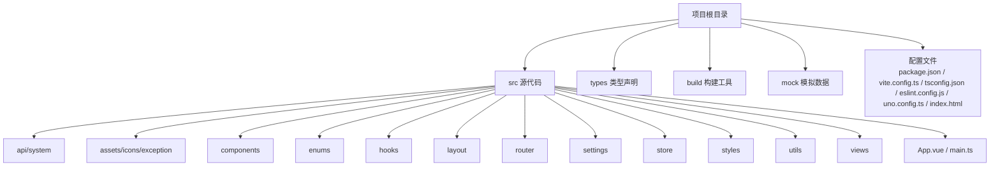
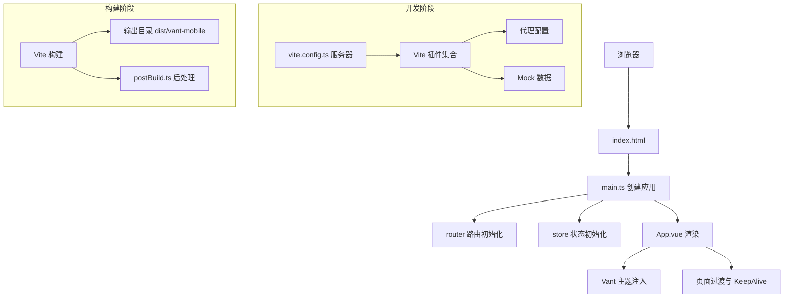
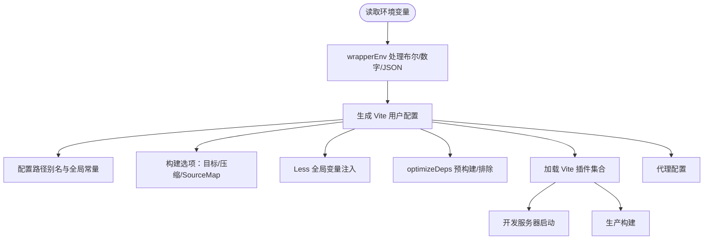
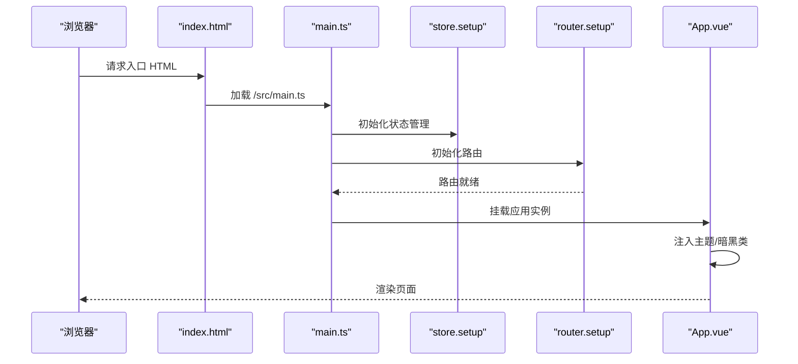
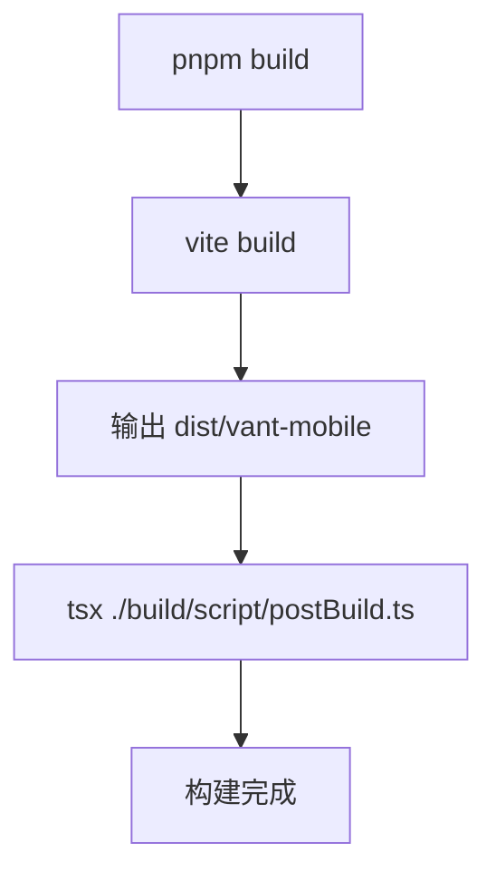
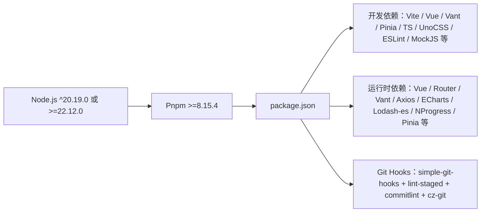

# 快速开始

<cite>
**本文引用的文件**   
- [package.json](file://package.json)
- [README.md](file://README.md)
- [vite.config.ts](file://vite.config.ts)
- [tsconfig.json](file://tsconfig.json)
- [eslint.config.js](file://eslint.config.js)
- [uno.config.ts](file://uno.config.ts)
- [src/main.ts](file://src/main.ts)
- [src/App.vue](file://src/App.vue)
- [index.html](file://index.html)
- [build/constant.ts](file://build/constant.ts)
- [build/utils.ts](file://build/utils.ts)
- [build/vite/plugin/index.ts](file://build/vite/plugin/index.ts)
- [build/vite/proxy.ts](file://build/vite/proxy.ts)
- [build/script/postBuild.ts](file://build/script/postBuild.ts)
</cite>

## 目录
1. [简介](#简介)
2. [项目结构](#项目结构)
3. [核心组件](#核心组件)
4. [架构总览](#架构总览)
5. [详细组件分析](#详细组件分析)
6. [依赖关系分析](#依赖关系分析)
7. [性能考虑](#性能考虑)
8. [故障排查指南](#故障排查指南)
9. [结论](#结论)
10. [附录](#附录)

## 简介
本指南面向零基础开发者，帮助你在最短时间内完成 Vue3 微信 H5 移动端项目的环境准备、项目克隆、依赖安装、开发运行与生产构建，并掌握关键配置文件的作用与常见问题排查方法。项目采用 Vue3、Vite8、Vant4、Pinia、TypeScript、UnoCSS 等主流技术栈，内置 Mock 数据、暗黑模式、主题色持久化、路由守卫、Axios 封装、ECharts 图表与 SVG 图标体系，适合快速落地移动端业务。

## 项目结构
项目采用“功能域 + 层次化”组织方式，核心目录与职责如下：
- src：源代码目录
  - api/system：接口层（示例用户接口）
  - assets/icons/exception：异常状态图标资源
  - components：通用组件（Logo、SvgIcon）
  - enums：枚举类型（断点、缓存、HTTP、页面）
  - hooks：自定义组合式函数（核心、事件、设置、web图表）
  - layout：布局（含浮动导航栏）
  - router：路由定义、模块化路由与路由守卫
  - settings：动画、组件、设计相关配置
  - store：状态管理（设计设置、路由、用户），含持久化插件
  - styles：样式（过渡、公共、Vant、变量）
  - utils：工具库（HTTP、类型判断、存储、日期、DOM、环境、URL、日志、echarts 封装）
  - views：页面（仪表盘、示例、异常、登录/注册/找回密码、消息、我的、底部标签栏）
  - App.vue、main.ts：应用入口与挂载
- types：类型声明（自动导入、配置、全局、模块）
- build：构建相关工具与插件（常量、工具、Vite 插件、代理、构建脚本）
- mock：开发/生产 Mock 服务与示例数据
- 配置文件：package.json、vite.config.ts、tsconfig.json、eslint.config.js、uno.config.ts、index.html、.editorconfig、.gitignore、commitlint.config.cjs、vercel.json 等

**章节来源**
- [README.md: 186-201:186-201](file://README.md#L186-L201)

## 核心组件
- 应用入口与挂载
  - main.ts：统一引入 UnoCSS、Vant 样式、SVG 图标注册，创建应用实例，挂载 Pinia、路由并渲染 App.vue。
  - App.vue：顶层容器，提供暗黑模式、主题色变量注入、页面过渡与 KeepAlive 缓存。
- 路由与状态
  - router：模块化路由与路由守卫，结合 store 的 keep-alive 组件列表实现页面缓存。
  - store：设计设置、路由、用户模块，持久化插件启用。
- 构建与开发
  - vite.config.ts：Vite 主配置，包含别名、全局常量、构建目标、代理、插件加载、Less 全局变量注入、开发服务器与依赖预构建。
  - build/vite/plugin/index.ts：Vite 插件集合（Mock、HTML、SVG Sprite、可视化、压缩等）。
  - build/vite/proxy.ts：开发代理配置。
  - build/script/postBuild.ts：构建后脚本（产物处理）。
- 样式与图标
  - uno.config.ts：UnoCSS 配置（预设、转换器、快捷方式、安全列表）。
  - index.html：HTML 入口，注入暗黑类、主题色变量与首屏加载样式。
- 类型与规范
  - tsconfig.json：TypeScript 编译配置（路径别名、严格模式、类型来源）。
  - eslint.config.js：Antfu ESLint 平方配置（样式化规则、格式化器、自定义规则）。

**章节来源**
- [src/main.ts: 1-30:1-30](file://src/main.ts#L1-L30)
- [src/App.vue: 1-78:1-78](file://src/App.vue#L1-L78)
- [vite.config.ts: 27-182:27-182](file://vite.config.ts#L27-L182)
- [uno.config.ts: 13-83:13-83](file://uno.config.ts#L13-L83)
- [index.html: 1-128:1-128](file://index.html#L1-L128)
- [tsconfig.json: 1-42:1-42](file://tsconfig.json#L1-L42)
- [eslint.config.js: 1-62:1-62](file://eslint.config.js#L1-L62)

## 架构总览
下图展示从浏览器请求到页面渲染的关键链路，以及开发与构建阶段的插件与工具参与点。

**图示来源**
- [index.html: 1-128:1-128](file://index.html#L1-L128)
- [src/main.ts: 18-30:18-30](file://src/main.ts#L18-L30)
- [src/App.vue: 1-78:1-78](file://src/App.vue#L1-L78)
- [vite.config.ts: 27-182:27-182](file://vite.config.ts#L27-L182)
- [build/vite/plugin/index.ts](file://build/vite/plugin/index.ts)
- [build/vite/proxy.ts](file://build/vite/proxy.ts)
- [build/script/postBuild.ts](file://build/script/postBuild.ts)
- [build/constant.ts: 6](file://build/constant.ts#L6)

## 详细组件分析

### 开发服务器与构建配置
- 别名与全局常量
  - 别名：@/ 指向 src，#/ 指向 types；define 注入应用元信息与构建时间。
- 构建目标与压缩
  - 目标：es2015；minify 根据开关选择 oxc 或 terser；可选移除 console。
- CSS 与 Less
  - Less 全局变量注入 src/styles/var.less；cssTarget chrome80。
- 依赖预构建与排除
  - optimizeDeps.include 预构建 pinia、lodash-es、axios；exclude 排除 vant、@vant/use。
- 插件加载
  - createVitePlugins(viteEnv, isBuild, prodMock) 动态加载 Mock、HTML、SVG Sprite、可视化、压缩等插件。
- 代理与预热
  - server.proxy 基于 VITE_PROXY 配置；warmup 预热首页与常用组件/视图文件。

**图示来源**
- [vite.config.ts: 27-182:27-182](file://vite.config.ts#L27-L182)
- [build/utils.ts: 22-43:22-43](file://build/utils.ts#L22-L43)

**章节来源**
- [vite.config.ts: 27-182:27-182](file://vite.config.ts#L27-L182)
- [build/utils.ts: 1-76:1-76](file://build/utils.ts#L1-L76)

### 应用入口与主题/暗黑模式
- 入口文件 main.ts
  - 引入 UnoCSS 重置与虚拟样式、Vant 样式、SVG 图标注册。
  - 异步引导：setupStore、setupRouter，等待路由就绪后挂载应用。
- App.vue
  - 使用 VanConfigProvider 注入主题与主题变量。
  - 通过 KeepAlive 缓存路由组件，过渡动画可配置。
  - 读取设计设置（暗黑模式、主题色）并注入到 DOM。

**图示来源**
- [index.html: 1-128:1-128](file://index.html#L1-L128)
- [src/main.ts: 18-30:18-30](file://src/main.ts#L18-L30)
- [src/App.vue: 1-78:1-78](file://src/App.vue#L1-L78)

**章节来源**
- [src/main.ts: 1-30:1-30](file://src/main.ts#L1-L30)
- [src/App.vue: 1-78:1-78](file://src/App.vue#L1-L78)
- [index.html: 13-27:13-27](file://index.html#L13-L27)

### 构建产物与后处理
- 输出目录
  - OUTPUT_DIR = dist/vant-mobile，由常量文件定义。
- 构建脚本
  - package.json 中 build 脚本先执行 vite build，再执行 tsx 调用 postBuild.ts 进行后处理。
- 后处理脚本
  - postBuild.ts：可扩展产物处理逻辑（如生成配置文件、拷贝静态资源等）。

**图示来源**
- [package.json: 30](file://package.json#L30)
- [build/constant.ts: 6](file://build/constant.ts#L6)
- [build/script/postBuild.ts](file://build/script/postBuild.ts)

**章节来源**
- [build/constant.ts: 6](file://build/constant.ts#L6)
- [package.json: 30](file://package.json#L30)

### ESLint 与 TypeScript 配置
- ESLint
  - 使用 @antfu/eslint-config，启用 UnoCSS 规则、格式化器（CSS/HTML/Markdown），自定义规则（组件块顺序、最大参数/嵌套深度、箭头函数、花括号风格等）。
- TypeScript
  - 路径别名 @/*、#/*；严格模式；bundler 模式；类型来源包含 Vite、node_modules/@types 与 types 目录；包含 src、types、build、mock、vite.config.ts。

**章节来源**
- [eslint.config.js: 1-62:1-62](file://eslint.config.js#L1-L62)
- [tsconfig.json: 1-42:1-42](file://tsconfig.json#L1-L42)

## 依赖关系分析
- 环境要求
  - Node.js：^20.19.0 或 >=22.12.0
  - Pnpm：>=8.15.4
  - 包管理器锁定：package.json 中 packageManager 指定 pnpm@9.8.0
- 依赖安装前置
  - package.json scripts.preinstall 限制仅允许 pnpm 安装，防止误用 npm/yarn 导致依赖不兼容。
- 开发与构建工具
  - Vite8、Vue3、Vant4、Pinia、TypeScript、UnoCSS、ESLint、MockJS、Axios、ECharts、Lodash-es、NProgress 等。
- Git Hooks 与提交规范
  - simple-git-hooks + lint-staged + commitlint + cz-git，首次安装后需更新 hooks。

**图示来源**
- [package.json: 20-23:20-23](file://package.json#L20-L23)
- [package.json: 25](file://package.json#L25)
- [package.json: 41-56:41-56](file://package.json#L41-L56)
- [package.json: 57-104:57-104](file://package.json#L57-L104)
- [package.json: 105-116:105-116](file://package.json#L105-L116)

**章节来源**
- [package.json: 20-23:20-23](file://package.json#L20-L23)
- [package.json: 25](file://package.json#L25)
- [package.json: 41-104:41-104](file://package.json#L41-L104)
- [package.json: 105-116:105-116](file://package.json#L105-L116)

## 性能考虑
- 构建体积与分包
  - manualChunks 将 node_modules 依赖按包名拆分，减少单文件体积，提升缓存命中率。
- 压缩策略
  - 根据开关选择 oxc 或 terser；可移除 console 与 debugger，降低包体与运行时开销。
- 依赖预构建
  - optimizeDeps.include 预构建常用库（pinia、lodash-es、axios），避免开发时频繁重新解析。
- CSSTarget 与 SourceMap
  - cssTarget chrome80；生产默认关闭 SourceMap，如需排查线上问题可临时开启。
- 预热与缓存
  - server.warmup 预热首页与常用组件/视图，缩短首屏加载时间。

**章节来源**
- [vite.config.ts: 72-122:72-122](file://vite.config.ts#L72-L122)
- [vite.config.ts: 156-177:156-177](file://vite.config.ts#L156-L177)
- [vite.config.ts: 135-154:135-154](file://vite.config.ts#L135-L154)

## 故障排查指南
- 依赖安装失败
  - 症状：pnpm install 报错或部分依赖缺失
  - 排查要点：
    - 确认 Node.js 版本满足要求（^20.19.0 或 >=22.12.0）
    - 确认 pnpm 版本 >=8.15.4
    - 确保使用 pnpm 安装（preinstall 限制仅允许 pnpm）
    - 清理缓存后重试：pnpm clean:cache 或 pnpm clean:lib
- 打包报错
  - 症状：vite build 失败或产物异常
  - 排查要点：
    - 检查 terser/oxc 配置与 VITE_DROP_CONSOLE 开关
    - 确认 optimizeDeps.exclude 中未误排除必要依赖（如 vant）
    - 查看构建输出目录 dist/vant-mobile 是否存在
    - 如需生成分析报告：pnpm report
- 开发服务器无法访问或端口占用
  - 症状：无法打开 localhost:端口
  - 排查要点：
    - 检查 VITE_PORT 环境变量与实际端口占用
    - 确认代理配置 VITE_PROXY 正确（JSON 格式）
    - 使用预热配置减少冷启动卡顿
- ESLint 校验失败
  - 症状：提交被阻断或编辑器报错
  - 排查要点：
    - 安装 VS Code ESLint 扩展并启用 Flat Config
    - 使用 lint-staged 自动修复暂存区文件
    - 遵循提交规范（feat/fix/refactor/test/docs/chore/workflow/ci/types/wip）

**章节来源**
- [package.json: 20-23:20-23](file://package.json#L20-L23)
- [package.json: 25](file://package.json#L25)
- [package.json: 30](file://package.json#L30)
- [vite.config.ts: 72-122:72-122](file://vite.config.ts#L72-L122)
- [vite.config.ts: 156-177:156-177](file://vite.config.ts#L156-L177)
- [vite.config.ts: 135-154:135-154](file://vite.config.ts#L135-L154)
- [eslint.config.js: 18-60:18-60](file://eslint.config.js#L18-L60)

## 结论
本指南提供了从零开始搭建 Vue3 微信 H5 移动端项目的完整路径：环境准备（Node.js 与 Pnpm）、项目克隆与依赖安装、开发运行与生产构建、关键配置文件解读与常见问题排查。依托 Vite8、Vue3、Vant4、Pinia、TypeScript、UnoCSS 等现代化工具链，项目具备良好的开发体验与可维护性。建议初学者先按“附录”的步骤操作，再逐步深入理解各配置文件与插件的作用。

## 附录
- 环境准备
  - Node.js：^20.19.0 或 >=22.12.0
  - Pnpm：>=8.15.4（推荐版本见 package.json 中 packageManager）
  - Git：用于版本控制与提交规范
- 快速开始命令
  - 克隆项目：git clone https://github.com/xiangshu233/vue3-vant4-mobile.git
  - 进入目录：cd vue3-vant4-mobile
  - 安装依赖：pnpm install
  - 启动开发：pnpm dev
  - 预览构建：pnpm preview
  - 生产构建：pnpm build
- VS Code 推荐插件与配置
  - 插件：UnoCSS、Volar、TypeScript Vue Plugin (Volar)、ESLint、DotENV、Error Lens、EditorConfig、File Nesting Updater、Pretty TypeScript Errors、Todo Tree、Trailing Spaces
  - ESLint：启用 Flat Config，关闭默认格式化，保存时自动修复，静默样式类规则
  - TypeScript：严格模式、bundler 解析、路径别名、类型来源
- 提交规范与 Git Hooks
  - 首次安装后更新 hooks：npx simple-git-hooks
  - 全局安装 commitizen：npm install -g commitizen
  - 使用 cz-git 提交：git add 后执行 cz 开启交互式提交

**章节来源**
- [README.md: 111-117:111-117](file://README.md#L111-L117)
- [README.md: 118-184:118-184](file://README.md#L118-L184)
- [README.md: 186-201:186-201](file://README.md#L186-L201)
- [README.md: 232-251:232-251](file://README.md#L232-L251)
- [package.json: 6](file://package.json#L6)
- [package.json: 20-23:20-23](file://package.json#L20-L23)
- [package.json: 25](file://package.json#L25)
- [package.json: 105-116:105-116](file://package.json#L105-L116)