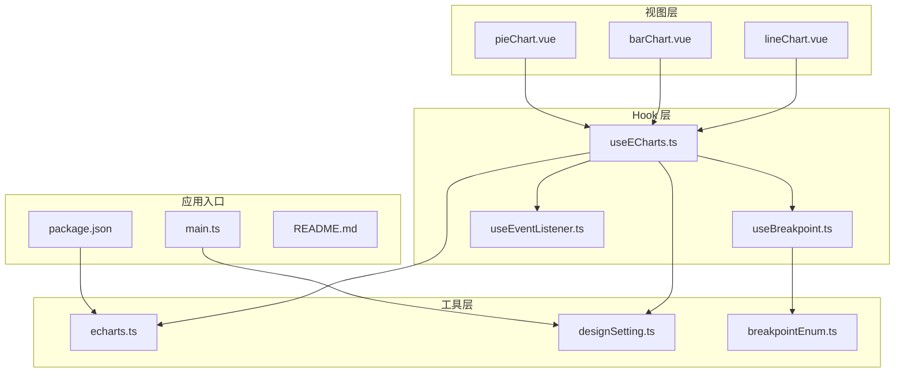
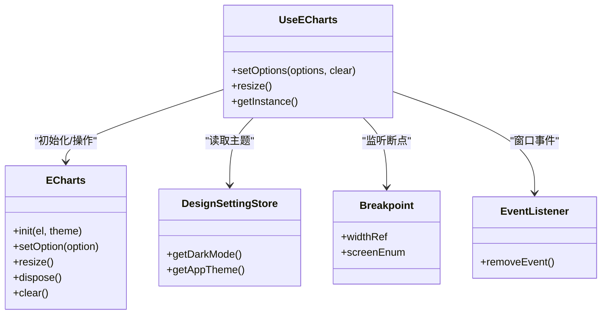
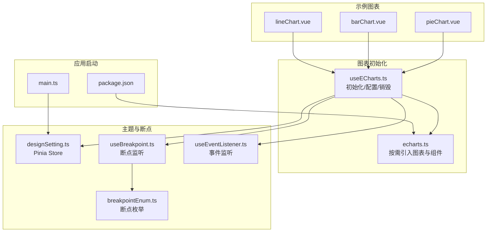
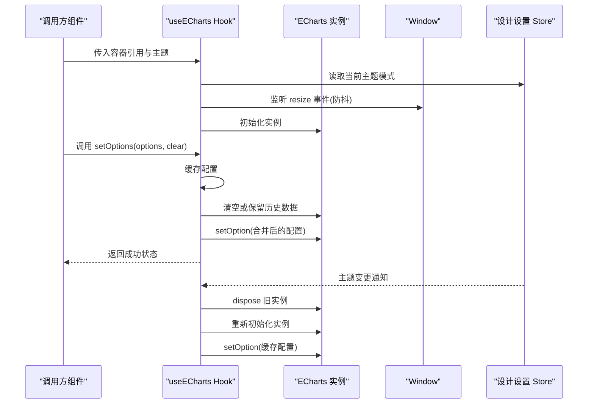
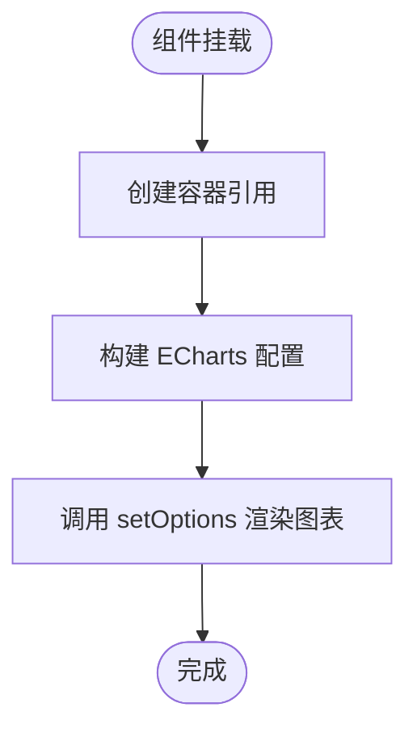
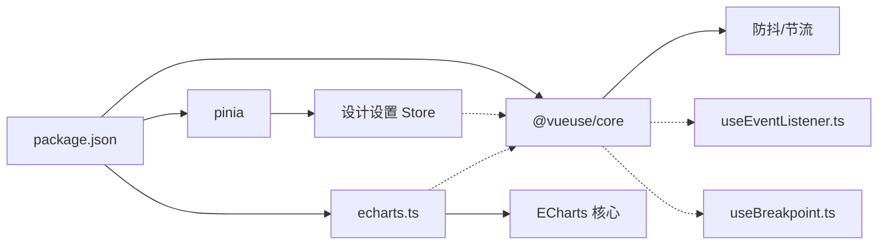

# 数据可视化系统

<cite>
**本文引用的文件**
- [useECharts.ts](file://src/hooks/web/useECharts.ts)
- [echarts.ts](file://src/utils/lib/echarts.ts)
- [lineChart.vue](file://src/views/message/lineChart.vue)
- [barChart.vue](file://src/views/message/barChart.vue)
- [pieChart.vue](file://src/views/message/pieChart.vue)
- [designSetting.ts](file://src/store/modules/designSetting.ts)
- [useBreakpoint.ts](file://src/hooks/event/useBreakpoint.ts)
- [useEventListener.ts](file://src/hooks/event/useEventListener.ts)
- [breakpointEnum.ts](file://src/enums/breakpointEnum.ts)
- [designSetting.ts](file://src/settings/designSetting.ts)
- [index.vue](file://src/views/dashboard/index.vue)
- [package.json](file://package.json)
- [main.ts](file://src/main.ts)
- [README.md](file://README.md)
</cite>

## 目录
1. [简介](#简介)
2. [项目结构](#项目结构)
3. [核心组件](#核心组件)
4. [架构总览](#架构总览)
5. [详细组件分析](#详细组件分析)
6. [依赖关系分析](#依赖关系分析)
7. [性能考虑](#性能考虑)
8. [故障排查指南](#故障排查指南)
9. [结论](#结论)
10. [附录](#附录)

## 简介
本项目是一个基于 Vue3 + Vant4 + Vite + TypeScript + UnoCSS 的微信H5移动端项目，内置了完整的数据可视化系统。系统采用 ECharts 作为核心图表库，通过自定义 Hook 封装实现了统一的图表初始化、配置管理与响应式适配能力。本文档将深入解析 ECharts 集成方案、useECharts 自定义 Hook 的设计与使用方法、图表组件封装策略、移动端优化、API 文档以及实际业务应用场景。

## 项目结构
项目采用“按功能分层”的组织方式：
- hooks/web：封装通用的 Web 功能，其中 useECharts 是图表系统的核心
- utils/lib：图表库的二次封装与按需引入
- views/message：示例图表页面（折线图、柱状图、饼图）
- store/modules：状态管理，包含设计设置与主题配置
- hooks/event：事件监听与断点监听等通用事件处理
- settings：全局设计配置常量
- 其他：路由、样式、工具函数等基础设施

**图表来源**
- [useECharts.ts:1-123](file://src/hooks/web/useECharts.ts#L1-L123)
- [echarts.ts:1-58](file://src/utils/lib/echarts.ts#L1-L58)
- [lineChart.vue:1-124](file://src/views/message/lineChart.vue#L1-L124)
- [barChart.vue:1-111](file://src/views/message/barChart.vue#L1-L111)
- [pieChart.vue:1-70](file://src/views/message/pieChart.vue#L1-L70)
- [designSetting.ts:1-52](file://src/store/modules/designSetting.ts#L1-L52)
- [useBreakpoint.ts:1-96](file://src/hooks/event/useBreakpoint.ts#L1-L96)
- [useEventListener.ts:1-62](file://src/hooks/event/useEventListener.ts#L1-L62)
- [breakpointEnum.ts:1-29](file://src/enums/breakpointEnum.ts#L1-L29)
- [main.ts:1-30](file://src/main.ts#L1-L30)
- [package.json:1-118](file://package.json#L1-L118)
- [README.md:1-305](file://README.md#L1-L305)

**章节来源**
- [main.ts:1-30](file://src/main.ts#L1-L30)
- [package.json:1-118](file://package.json#L1-L118)
- [README.md:1-305](file://README.md#L1-L305)

## 核心组件
本节聚焦 useECharts 自定义 Hook 的设计与实现，它是整个图表系统的核心。

- 初始化与销毁
  - 通过传入的 DOM 引用初始化 ECharts 实例
  - 监听窗口 resize 事件并进行防抖处理
  - 在组件卸载时清理事件监听与释放实例资源
- 主题适配
  - 支持 light/dark/default 三种主题模式
  - 默认使用 Pinia store 中的设计设置
  - 监听主题变化，自动重建实例并重新渲染
- 配置缓存与更新
  - 缓存最近一次的 ECharts 配置对象
  - 在容器高度为 0 或首次渲染时延迟设置配置
  - 提供 setOptions 方法，支持清空与增量更新
- 响应式适配
  - 结合断点监听与容器尺寸，自动触发 resize
  - 移动端场景下优先使用防抖 resize 降低重排成本

**图表来源**
- [useECharts.ts:14-122](file://src/hooks/web/useECharts.ts#L14-L122)
- [designSetting.ts:1-52](file://src/store/modules/designSetting.ts#L1-L52)
- [useBreakpoint.ts:19-26](file://src/hooks/event/useBreakpoint.ts#L19-L26)
- [useEventListener.ts:18-61](file://src/hooks/event/useEventListener.ts#L18-L61)

**章节来源**
- [useECharts.ts:1-123](file://src/hooks/web/useECharts.ts#L1-L123)
- [designSetting.ts:1-52](file://src/store/modules/designSetting.ts#L1-L52)

## 架构总览
图表系统整体架构围绕 useECharts Hook 展开，通过 ECharts 按需引入与主题适配实现跨平台一致性体验。

**图表来源**
- [main.ts:1-30](file://src/main.ts#L1-L30)
- [package.json:46](file://package.json#L46)
- [echarts.ts:1-58](file://src/utils/lib/echarts.ts#L1-L58)
- [useECharts.ts:1-123](file://src/hooks/web/useECharts.ts#L1-L123)
- [designSetting.ts:1-52](file://src/store/modules/designSetting.ts#L1-L52)
- [useBreakpoint.ts:1-96](file://src/hooks/event/useBreakpoint.ts#L1-L96)
- [useEventListener.ts:1-62](file://src/hooks/event/useEventListener.ts#L1-L62)
- [breakpointEnum.ts:1-29](file://src/enums/breakpointEnum.ts#L1-L29)
- [lineChart.vue:1-124](file://src/views/message/lineChart.vue#L1-L124)
- [barChart.vue:1-111](file://src/views/message/barChart.vue#L1-L111)
- [pieChart.vue:1-70](file://src/views/message/pieChart.vue#L1-L70)

## 详细组件分析

### useECharts Hook 设计与实现
- 参数与返回值
  - 输入：DOM 引用与主题模式（默认继承设计设置）
  - 返回：setOptions、resize、echarts、getInstance 四个方法
- 初始化流程
  - 校验容器存在性与可见性
  - 初始化 ECharts 实例并绑定窗口 resize 事件
  - 结合断点监听，在移动端首次渲染时延时触发 resize
- 主题切换
  - 监听主题变化，销毁旧实例、重建实例并重绘
  - 暗色模式下自动设置透明背景
- 配置更新
  - setOptions 支持清空与增量更新
  - 防止容器高度为 0 时的异常渲染
  - 使用 nextTick 与定时器确保 DOM 更新完成后再渲染

**图表来源**
- [useECharts.ts:40-98](file://src/hooks/web/useECharts.ts#L40-L98)
- [useECharts.ts:100-122](file://src/hooks/web/useECharts.ts#L100-L122)
- [designSetting.ts:16-32](file://src/store/modules/designSetting.ts#L16-L32)

**章节来源**
- [useECharts.ts:1-123](file://src/hooks/web/useECharts.ts#L1-L123)

### 折线图组件封装策略
- 容器与样式
  - 使用卡片容器与圆角边框，统一视觉风格
  - 固定高度便于在移动端保持一致的展示比例
- 配置要点
  - 主题色数组与应用主题色联动
  - 面积堆叠、工具提示、图例、网格布局等基础配置
  - 响应式网格与标签位置调整
- 生命周期
  - 在 mounted 阶段调用 setOptions 设置初始配置

**图表来源**
- [lineChart.vue:12-120](file://src/views/message/lineChart.vue#L12-L120)

**章节来源**
- [lineChart.vue:1-124](file://src/views/message/lineChart.vue#L1-L124)

### 柱状图组件封装策略
- 配置要点
  - 值轴与类目轴的切换，适配移动端横向滚动体验
  - 栈式柱状图与标签显示策略
  - 主题色数组与应用主题色联动
- 生命周期
  - 在 mounted 阶段调用 setOptions 设置初始配置

**章节来源**
- [barChart.vue:1-111](file://src/views/message/barChart.vue#L1-L111)

### 饼图组件封装策略
- 配置要点
  - 环形饼图（内外半径）与居中布局
  - 圆角边框与强调态标签
  - 主题色数组与应用主题色联动
- 生命周期
  - 在 mounted 阶段调用 setOptions 设置初始配置

**章节来源**
- [pieChart.vue:1-70](file://src/views/message/pieChart.vue#L1-L70)

### 图表组件通用封装模板
- 统一容器
  - 使用卡片容器与固定高度，确保在不同屏幕尺寸下的一致表现
- 主题联动
  - 通过设计设置 Store 获取应用主题色，动态注入到 color 数组
- 配置缓存
  - 将 ECharts 配置对象定义为组件级常量，减少重复计算
- 生命周期
  - 在 mounted 阶段调用 useECharts 的 setOptions 方法

**章节来源**
- [lineChart.vue:12-120](file://src/views/message/lineChart.vue#L12-L120)
- [barChart.vue:12-107](file://src/views/message/barChart.vue#L12-L107)
- [pieChart.vue:12-66](file://src/views/message/pieChart.vue#L12-L66)

### 移动端图表优化
- 触摸交互
  - ECharts 默认支持移动端触摸手势，无需额外配置
- 缩放与平移
  - 通过 DataZoom 组件实现区域缩放与滑动浏览
  - 在移动端建议启用平移与缩放手势，提升数据探索体验
- 性能优化
  - 防抖 resize：窗口尺寸变化时使用防抖降低重排频率
  - 延迟渲染：容器高度为 0 时延迟设置配置，避免无效渲染
  - 按需引入：仅引入所需图表与组件，减少包体积
- 响应式适配
  - 结合断点监听与容器宽度，自动触发 resize
  - 移动端首次渲染时延时触发 resize，确保容器尺寸稳定

**章节来源**
- [useECharts.ts:28-58](file://src/hooks/web/useECharts.ts#L28-L58)
- [useBreakpoint.ts:29-95](file://src/hooks/event/useBreakpoint.ts#L29-L95)
- [useEventListener.ts:18-61](file://src/hooks/event/useEventListener.ts#L18-L61)

### 图表配置 API 文档
- 基础配置项
  - color：颜色数组，支持与主题联动
  - tooltip：工具提示配置，支持坐标轴触发与项触发
  - legend：图例配置，支持位置与布局
  - grid：网格布局，支持内边距与响应式
  - xAxis/yAxis：坐标轴类型与数据
  - series：系列配置，支持多种图表类型与样式
- 主题与样式
  - 主题模式：light/dark/default
  - 透明背景：暗色模式下自动设置透明背景
  - 主题色：通过设计设置 Store 获取应用主题色
- 事件处理
  - resize：窗口变化时自动触发
  - 主题切换：监听主题变化，自动重建实例并重绘
- 数据更新策略
  - setOptions 支持清空与增量更新
  - 缓存配置，避免重复渲染
  - 容器高度为 0 时延迟设置配置

**章节来源**
- [useECharts.ts:30-98](file://src/hooks/web/useECharts.ts#L30-L98)
- [designSetting.ts:16-32](file://src/store/modules/designSetting.ts#L16-L32)

### 实际业务场景应用
- 用户行为分析
  - 使用折线图展示用户活跃趋势与留存率
  - 使用柱状图对比不同渠道的转化效果
  - 使用饼图展示用户来源分布
- 数据统计展示
  - 使用面积堆叠图展示多维度指标变化
  - 使用环形图展示占比与强调态标签
  - 结合 DataZoom 实现大数据量的缩放浏览

**章节来源**
- [lineChart.vue:18-116](file://src/views/message/lineChart.vue#L18-L116)
- [barChart.vue:18-103](file://src/views/message/barChart.vue#L18-L103)
- [pieChart.vue:18-62](file://src/views/message/pieChart.vue#L18-L62)

### 扩展与定制指导
- 自定义图表类型
  - 在 echarts.ts 中按需引入新的图表类型与组件
  - 通过 useECharts 的 getInstance 方法获取原生实例，进行高级定制
- 高级交互功能
  - 结合 DataZoom、VisualMap、Toolbox 等组件实现缩放、筛选与导出
  - 使用事件回调实现点击、悬停等交互反馈
- 主题与动画
  - 通过设计设置 Store 切换主题，实现深浅色适配
  - 配置动画时长与缓动函数，提升用户体验

**章节来源**
- [echarts.ts:32-55](file://src/utils/lib/echarts.ts#L32-L55)
- [useECharts.ts:109-121](file://src/hooks/web/useECharts.ts#L109-L121)
- [designSetting.ts:16-32](file://src/store/modules/designSetting.ts#L16-L32)

## 依赖关系分析
- 外部依赖
  - ECharts：核心图表库，按需引入图表与组件
  - @vueuse/core：提供防抖、节流、生命周期等工具
  - pinia：状态管理，存储设计设置
- 内部依赖
  - useECharts 依赖设计设置 Store、断点监听与事件监听
  - 示例图表组件依赖 useECharts 与设计设置 Store
- 包体优化
  - 仅引入所需图表与组件，减少包体积
  - 使用 SVG 渲染器，提升移动端性能

**图表来源**
- [package.json:46](file://package.json#L46)
- [useECharts.ts:1-123](file://src/hooks/web/useECharts.ts#L1-L123)
- [echarts.ts:1-58](file://src/utils/lib/echarts.ts#L1-L58)
- [designSetting.ts:1-52](file://src/store/modules/designSetting.ts#L1-L52)

**章节来源**
- [package.json:1-118](file://package.json#L1-L118)
- [useECharts.ts:1-123](file://src/hooks/web/useECharts.ts#L1-L123)

## 性能考虑
- 包体积控制
  - 仅引入所需图表与组件，避免全量引入导致包体膨胀
  - 使用 SVG 渲染器，减少 Canvas 渲染开销
- 渲染性能
  - 防抖 resize：降低窗口变化时的重排频率
  - 延迟渲染：容器高度为 0 时延迟设置配置，避免无效渲染
  - nextTick 与定时器：确保 DOM 更新完成后再渲染
- 主题切换
  - 监听主题变化，销毁旧实例、重建实例并重绘，保证主题一致性

**章节来源**
- [useECharts.ts:28-58](file://src/hooks/web/useECharts.ts#L28-L58)
- [useECharts.ts:90-98](file://src/hooks/web/useECharts.ts#L90-L98)

## 故障排查指南
- 图表不显示
  - 检查容器是否存在且高度大于 0
  - 确认在 mounted 阶段调用 setOptions
  - 查看控制台是否有 ECharts 初始化错误
- 主题切换异常
  - 确认设计设置 Store 的主题状态正确
  - 检查主题监听是否生效
- 响应式适配问题
  - 检查断点监听是否正常工作
  - 确认 resize 事件是否被正确绑定与解绑

**章节来源**
- [useECharts.ts:40-58](file://src/hooks/web/useECharts.ts#L40-L58)
- [useECharts.ts:100-107](file://src/hooks/web/useECharts.ts#L100-L107)
- [useBreakpoint.ts:29-95](file://src/hooks/event/useBreakpoint.ts#L29-L95)

## 结论
本项目通过 useECharts 自定义 Hook 将 ECharts 的初始化、配置管理与响应式适配进行了统一抽象，结合设计设置 Store 实现了主题适配与暗色模式支持。示例图表组件展示了折线图、柱状图与饼图的封装策略，并提供了移动端优化与性能优化的最佳实践。开发者可在此基础上快速扩展自定义图表类型与高级交互功能，满足多样化的数据可视化需求。

## 附录
- 快速开始
  - 在组件中引入 useECharts 并传入容器引用
  - 构建 ECharts 配置对象并调用 setOptions
  - 在 mounted 阶段完成初始化
- 常见问题
  - 如何切换主题？通过设计设置 Store 的 setDarkMode 方法
  - 如何启用缩放与平移？在配置中启用 DataZoom 组件
  - 如何导出图片？在配置中启用 Toolbox 的 saveAsImage 功能

**章节来源**
- [index.vue:67-69](file://src/views/dashboard/index.vue#L67-L69)
- [README.md:23](file://README.md#L23)