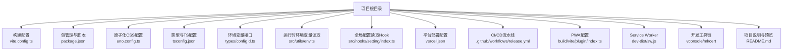
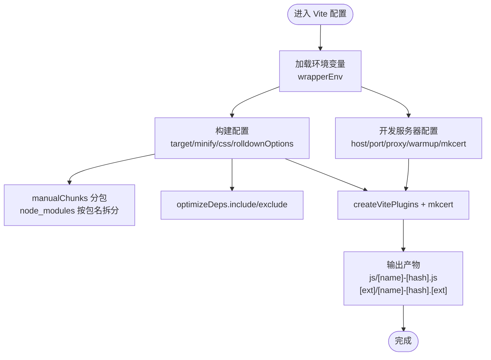
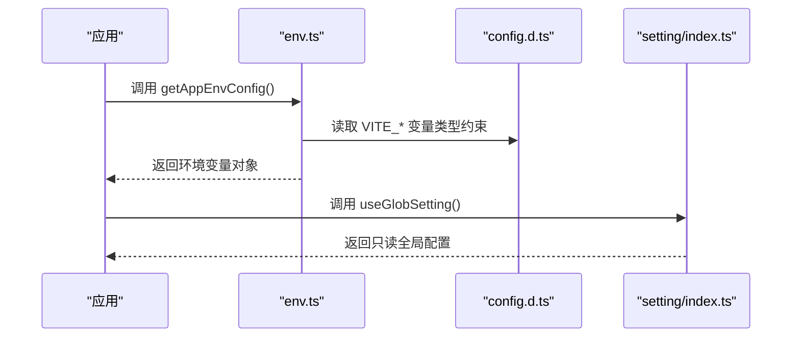
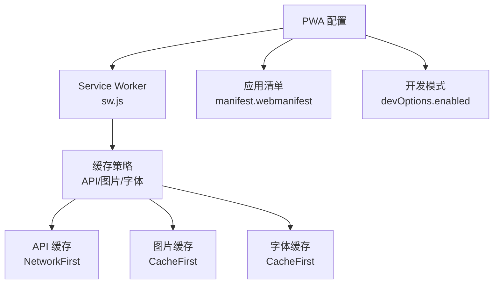
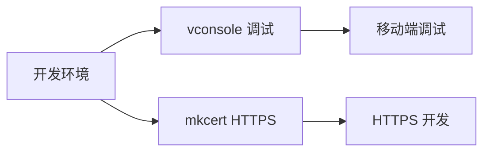
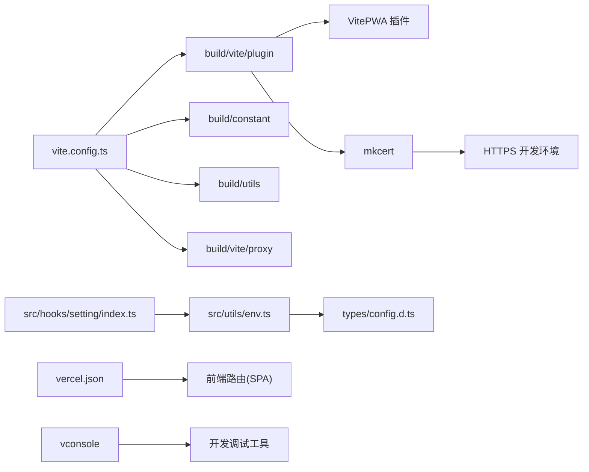

# 构建与部署

<cite>
**本文引用的文件**
- [vite.config.ts](file://vite.config.ts)
- [package.json](file://package.json)
- [vercel.json](file://vercel.json)
- [.github/workflows/release.yml](file://.github/workflows/release.yml)
- [uno.config.ts](file://uno.config.ts)
- [tsconfig.json](file://tsconfig.json)
- [types/config.d.ts](file://types/config.d.ts)
- [src/utils/env.ts](file://src/utils/env.ts)
- [src/hooks/setting/index.ts](file://src/hooks/setting/index.ts)
- [build/vite/plugin/index.ts](file://build/vite/plugin/index.ts)
- [dev-dist/sw.js](file://dev-dist/sw.js)
- [dev-dist/workbox-1b3d9405.js](file://dev-dist/workbox-1b3d9405.js)
- [dist/sw.js](file://dist/sw.js)
- [dist/manifest.webmanifest](file://dist/manifest.webmanifest)
- [README.md](file://README.md)
</cite>

## 更新摘要
**所做更改**
- 更新了 PWA 缓存策略配置，优化了 Service Worker 缓存策略
- 移除了 ngrok 相关配置和依赖，更新了开发工具链章节
- 增强了 PWA 插件配置，完善了缓存策略和应用清单

## 目录
1. [简介](#简介)
2. [项目结构](#项目结构)
3. [核心组件](#核心组件)
4. [架构总览](#架构总览)
5. [详细组件分析](#详细组件分析)
6. [PWA 配置增强](#pwa-配置增强)
7. [开发工具链改进](#开发工具链改进)
8. [依赖关系分析](#依赖关系分析)
9. [性能考虑](#性能考虑)
10. [故障排查指南](#故障排查指南)
11. [结论](#结论)
12. [附录](#附录)

## 简介
本文件面向运维与开发团队，系统化梳理 Vue3 微信 H5 移动端项目的构建与部署实践，覆盖 Vite 构建配置优化（开发服务器、生产构建、资源处理）、产物分析与优化（代码分割、压缩、缓存）、部署配置（Vercel、环境变量、域名绑定）、CI/CD 流水线（自动化测试、构建、发布）、性能优化最佳实践（首屏、懒加载、缓存）、监控与错误追踪建议，以及部署故障排查与回滚策略。

**更新** 本次更新重点反映了构建系统的重大改进，包括移除 ngrok 外部测试支持、增强 PWA 缓存策略配置、vconsole 调试集成、mkcert HTTPS 开发支持等开发工具改进。

## 项目结构
该项目采用 Vite8 + Vue3 + Vant4 + Pinia + TypeScript + UnoCSS 的现代化前端栈，构建与部署相关的关键文件集中在根目录与 src/utils、types 等位置：
- 构建与打包：vite.config.ts、package.json、uno.config.ts、tsconfig.json
- 环境变量与全局配置：types/config.d.ts、src/utils/env.ts、src/hooks/setting/index.ts
- 平台部署：vercel.json
- CI/CD：.github/workflows/release.yml
- PWA 配置：build/vite/plugin/index.ts、dev-dist/sw.js、dist/sw.js
- 开发工具：package.json 中的 vconsole、mkcert 等依赖
- 项目说明与预览：README.md



**图表来源**
- [vite.config.ts:1-184](file://vite.config.ts#L1-L184)
- [package.json:1-120](file://package.json#L1-L120)
- [uno.config.ts:1-96](file://uno.config.ts#L1-L96)
- [tsconfig.json:1-42](file://tsconfig.json#L1-L42)
- [types/config.d.ts:1-29](file://types/config.d.ts#L1-L29)
- [src/utils/env.ts:1-89](file://src/utils/env.ts#L1-L89)
- [src/hooks/setting/index.ts:1-35](file://src/hooks/setting/index.ts#L1-L35)
- [vercel.json:1-9](file://vercel.json#L1-L9)
- [.github/workflows/release.yml:1-33](file://.github/workflows/release.yml#L1-L33)
- [build/vite/plugin/index.ts:1-162](file://build/vite/plugin/index.ts#L1-L162)
- [dev-dist/sw.js:1-113](file://dev-dist/sw.js#L1-L113)
- [package.json:70-105](file://package.json#L70-L105)
- [README.md:1-305](file://README.md#L1-L305)

**章节来源**
- [vite.config.ts:1-184](file://vite.config.ts#L1-L184)
- [package.json:1-120](file://package.json#L1-L120)
- [uno.config.ts:1-96](file://uno.config.ts#L1-L96)
- [tsconfig.json:1-42](file://tsconfig.json#L1-L42)
- [types/config.d.ts:1-29](file://types/config.d.ts#L1-L29)
- [src/utils/env.ts:1-89](file://src/utils/env.ts#L1-L89)
- [src/hooks/setting/index.ts:1-35](file://src/hooks/setting/index.ts#L1-L35)
- [vercel.json:1-9](file://vercel.json#L1-L9)
- [.github/workflows/release.yml:1-33](file://.github/workflows/release.yml#L1-L33)
- [build/vite/plugin/index.ts:1-162](file://build/vite/plugin/index.ts#L1-L162)
- [dev-dist/sw.js:1-113](file://dev-dist/sw.js#L1-L113)
- [package.json:70-105](file://package.json#L70-L105)
- [README.md:1-305](file://README.md#L1-L305)

## 核心组件
- Vite 构建配置：统一管理开发服务器、代理、别名、全局常量、构建目标、压缩策略、产物命名与分包、CSS 预处理器注入、依赖预构建与排除、插件加载等。
- 环境变量与全局配置：通过 types/config.d.ts 定义全局变量接口，src/utils/env.ts 读取运行时环境变量，src/hooks/setting/index.ts 暴露只读全局配置对象。
- UnoCSS 配置：rem→px 预设、图标预设、属性模式、排版预设、网络字体、safelist 等，结合 postcss-mobile-forever 实现移动端适配。
- PWA 配置：通过 VitePWA 插件实现 Service Worker 注册、缓存策略配置、离线支持、应用清单生成等功能。
- 平台部署：vercel.json 提供重写规则，适配 SPA 路由；README.md 提供线上预览地址与账号信息。
- CI/CD：GitHub Actions 在打标签时自动生成变更日志，便于版本发布与归档。
- 开发工具链：集成 vconsole 调试工具、mkcert HTTPS 证书等开发辅助工具。

**更新** 移除了 ngrok 外部测试支持，新增了增强的 PWA 缓存策略配置。

**章节来源**
- [vite.config.ts:27-181](file://vite.config.ts#L27-L181)
- [types/config.d.ts:1-29](file://types/config.d.ts#L1-L29)
- [src/utils/env.ts:17-52](file://src/utils/env.ts#L17-L52)
- [src/hooks/setting/index.ts:5-35](file://src/hooks/setting/index.ts#L5-L35)
- [uno.config.ts:13-84](file://uno.config.ts#L13-L84)
- [build/vite/plugin/index.ts:78-158](file://build/vite/plugin/index.ts#L78-L158)
- [vercel.json:1-9](file://vercel.json#L1-L9)
- [.github/workflows/release.yml:14-33](file://.github/workflows/release.yml#L14-L33)
- [package.json:70-105](file://package.json#L70-L105)

## 架构总览
下图展示从开发到部署的关键流程：本地开发（Vite Dev Server + 代理 + 开发工具）→ 构建产物（Rollup/Rolldown + Terser/OXC + PWA）→ 平台部署（Vercel SPA 重写）→ 用户访问。

```mermaid
graph TB
subgraph "开发阶段"
DEV["Vite 开发服务器<br/>端口/代理/预热"]
MOCK["Mock 数据可选"]
VCONSOLE["vconsole 调试工具"]
MKCERT["mkcert HTTPS 证书"]
END
subgraph "构建阶段"
VC["Vite 配置<br/>别名/全局常量/构建参数"]
PLG["Vite 插件链<br/>PWA/压缩/可视化"]
ROLL["Rollup/Rolldown 打包<br/>手动分包/命名"]
SW["Service Worker<br/>缓存策略"]
END
subgraph "部署阶段"
VERCEL["Vercel 平台<br/>SPA 重写规则"]
END
subgraph "运行阶段"
USER["微信 H5 用户"]
END
DEV --> VC
MOCK --> VC
VCONSOLE --> VC
MKCERT --> VC
VC --> PLG --> ROLL --> SW --> VERCEL --> USER
```

**图表来源**
- [vite.config.ts:135-181](file://vite.config.ts#L135-L181)
- [vite.config.ts:72-122](file://vite.config.ts#L72-L122)
- [build/vite/plugin/index.ts:78-158](file://build/vite/plugin/index.ts#L78-L158)
- [vercel.json:1-9](file://vercel.json#L1-L9)

## 详细组件分析

### Vite 构建配置分析
- 开发服务器与代理
  - host、open、port、proxy 均来自环境变量与封装后的 wrapperEnv，支持本地联调与跨域转发。
  - warmup 预热首页与常用组件/视图，缩短首次加载等待。
  - **新增** mkcert 插件集成，自动提供 HTTPS 开发环境支持。
- 别名与去重
  - @/ 指向 src，#/ 指向 types，dedupe: ['vue'] 避免重复打包。
- 全局常量
  - define 注入 __APP_INFO__（含构建时间、包信息）与 __INTLIFY_PROD_DEVTOOLS__ 控制生产环境 devtools。
- 构建优化
  - target: es2015，minify 根据 VITE_DROP_CONSOLE 选择 terser 或 oxc；terserOptions.drop_console/drop_debugger 控制生产日志清理。
  - sourcemap: false（生产关闭），reportCompressedSize: true（产物体积报告），chunkSizeWarningLimit: 2000（大包告警阈值）。
  - manualChunks 对 node_modules 进行按包名拆分，提升缓存命中率。
- CSS
  - Less 预处理器注入全局变量文件，支持 less 变量覆盖。
- 依赖优化
  - optimizeDeps.include 预构建 pinia、lodash-es、axios；exclude 排除 vant、@vant/use，避免重复打包与体积膨胀。
- 插件加载
  - createVitePlugins 动态加载插件链，结合 isBuild 与 prodMock 参数控制功能开关。
  - **新增** mkcert() 插件集成到插件数组中。



**图表来源**
- [vite.config.ts:27-181](file://vite.config.ts#L27-L181)

**章节来源**
- [vite.config.ts:27-181](file://vite.config.ts#L27-L181)

### 环境变量与全局配置
- types/config.d.ts 定义全局变量接口（标题、接口地址、短名、前缀、上传地址、图片地址、生产 Mock 开关等）。
- src/utils/env.ts
  - getAppEnvConfig 读取 import.meta.env（开发）或 window 上挂载的 ENV（生产），并做简单校验。
  - 提供 getEnv/isDevMode/isProdMode 等辅助判断。
- src/hooks/setting/index.ts
  - useGlobSetting 暴露只读全局配置对象，供业务层安全读取。



**图表来源**
- [types/config.d.ts:1-29](file://types/config.d.ts#L1-L29)
- [src/utils/env.ts:17-52](file://src/utils/env.ts#L17-L52)
- [src/hooks/setting/index.ts:5-35](file://src/hooks/setting/index.ts#L5-L35)

**章节来源**
- [types/config.d.ts:1-29](file://types/config.d.ts#L1-L29)
- [src/utils/env.ts:17-52](file://src/utils/env.ts#L17-L52)
- [src/hooks/setting/index.ts:5-35](file://src/hooks/setting/index.ts#L5-L35)

### UnoCSS 与移动端适配
- 预设与转换器
  - presetUno、presetAttributify、presetTypography、presetWebFonts、presetIcons、presetRemToPx。
  - transformerVariantGroup、transformerDirectives。
- rem→px 与 postcss-mobile-forever
  - UnoCSS rem→px 预设与 postcss-mobile-forever 配合，将 px 转换为 vw/vh，实现移动端适配。
- safelist
  - 针对动态图标类名（如 i-ph:*）预先生成所需 CSS，避免运行时缺失。

**章节来源**
- [uno.config.ts:13-84](file://uno.config.ts#L13-L84)

### 平台部署（Vercel）
- vercel.json
  - 通过 rewrites 将所有路径重写到前端路由入口，适配 SPA 路由。
- README.md
  - 提供线上预览地址与演示账号，便于快速验证部署效果。

**章节来源**
- [vercel.json:1-9](file://vercel.json#L1-L9)
- [README.md:58-71](file://README.md#L58-L71)

### CI/CD 流水线
- .github/workflows/release.yml
  - 监听带 v 前缀的标签推送，自动 checkout、setup-node（18.x），生成变更日志（changelogithub），并赋予 contents: write 权限。
- package.json
  - scripts 中包含 dev/build/preview 等常用命令，便于本地与流水线复用。

**章节来源**
- [.github/workflows/release.yml:14-33](file://.github/workflows/release.yml#L14-L33)
- [package.json:24-40](file://package.json#L24-L40)

## PWA 配置增强

### Service Worker 缓存策略
项目集成了完整的 PWA 功能，通过 VitePWA 插件实现：

- **缓存策略配置**
  - API 请求：NetworkFirst（网络优先），缓存 24 小时，最多 100 个条目
  - 图片资源：CacheFirst（缓存优先），缓存 30 天，最多 200 个条目
  - 字体文件：CacheFirst（缓存优先），缓存 1 年，最多 50 个条目
  - 全局匹配：globPatterns 包含 js、css、html、ico、png、svg、jpg、jpeg、woff、woff2 等资源类型

- **Service Worker 生成**
  - 开发环境：dev-dist/sw.js，包含开发时的缓存策略
  - 生产环境：dist/sw.js，包含优化后的缓存策略
  - 工作框支持：dev-dist/workbox-1b3d9405.js，提供缓存管理功能

- **应用清单配置**
  - 支持渐进式 Web 应用特性
  - 包含主题色、背景色、显示模式等配置
  - 提供 192x192 和 512x512 的图标资源



**图表来源**
- [build/vite/plugin/index.ts:78-158](file://build/vite/plugin/index.ts#L78-L158)
- [dev-dist/sw.js:75-112](file://dev-dist/sw.js#L75-L112)
- [dist/sw.js:1-2](file://dist/sw.js#L1-L2)

**章节来源**
- [build/vite/plugin/index.ts:78-158](file://build/vite/plugin/index.ts#L78-L158)
- [dev-dist/sw.js:1-113](file://dev-dist/sw.js#L1-L113)
- [dev-dist/workbox-1b3d9405.js:1-65](file://dev-dist/workbox-1b3d9405.js#L1-L65)
- [dist/sw.js:1-2](file://dist/sw.js#L1-L2)
- [dist/manifest.webmanifest](file://dist/manifest.webmanifest)

## 开发工具链改进

### vconsole 调试集成
- **集成方式**
  - 通过 package.json 的 devDependencies 集成 vconsole@3.15.1
  - 在开发环境中提供移动端调试面板
  - 支持网络请求监控、日志输出、性能分析等功能

- **使用场景**
  - 微信 H5 移动端调试
  - 真机调试与问题定位
  - 网络请求拦截与分析

### mkcert HTTPS 开发支持
- **集成方式**
  - 通过 vite-plugin-mkcert 插件实现
  - 自动生成本地开发 HTTPS 证书
  - 支持 localhost 和自定义域名的 HTTPS 访问

- **配置特点**
  - 开发模式下自动启用
  - 无需手动配置证书文件
  - 支持 HTTPS API 调试

### ngrok 外部测试支持（已移除）
- **变更说明**
  - 已从项目中移除 ngrok 外部测试支持
  - package.json 中不再包含 ngrok 相关脚本和依赖
  - 开发工具链中不再提供 ngrok 外部测试功能

**更新** 移除了 ngrok 外部测试支持，简化了开发工具链配置。



**图表来源**
- [package.json:23-24](file://package.json#L23-L24)
- [package.json:80](file://package.json#L80)
- [package.json:96](file://package.json#L96)
- [package.json:100](file://package.json#L100)

**章节来源**
- [package.json:23-24](file://package.json#L23-L24)
- [package.json:80](file://package.json#L80)
- [package.json:96](file://package.json#L96)
- [package.json:100](file://package.json#L100)

## 依赖关系分析
- 构建链路耦合
  - vite.config.ts 依赖 build/utils、build/vite/plugin、build/constant、build/vite/proxy 等内部模块，形成"配置—插件—常量—代理"的清晰分层。
  - 构建产物命名与分包策略由 rolldownOptions.output 与 manualChunks 决定，直接影响缓存与加载性能。
  - **新增** PWA 插件集成到插件链中，提供缓存策略和离线支持。
- 运行期配置耦合
  - src/utils/env.ts 与 types/config.d.ts 形成"类型约束 + 运行时读取"的双保险，src/hooks/setting/index.ts 仅做只读暴露，降低耦合度。
- 平台适配耦合
  - vercel.json 的重写规则与前端路由策略强相关，确保所有路径均回退到入口 HTML。
- **新增** 开发工具链耦合
  - vconsole、mkcert 等开发工具通过 package.json 集成，提供完整的开发调试体验。



**图表来源**
- [vite.config.ts:5-8](file://vite.config.ts#L5-L8)
- [build/vite/plugin/index.ts:7-158](file://build/vite/plugin/index.ts#L7-L158)
- [src/utils/env.ts:1-6](file://src/utils/env.ts#L1-L6)
- [src/hooks/setting/index.ts:1-4](file://src/hooks/setting/index.ts#L1-L4)
- [vercel.json:1-9](file://vercel.json#L1-L9)
- [package.json:96](file://package.json#L96)
- [package.json:100](file://package.json#L100)
- [package.json:80](file://package.json#L80)

**章节来源**
- [vite.config.ts:5-8](file://vite.config.ts#L5-L8)
- [build/vite/plugin/index.ts:7-158](file://build/vite/plugin/index.ts#L7-L158)
- [src/utils/env.ts:1-6](file://src/utils/env.ts#L1-L6)
- [src/hooks/setting/index.ts:1-4](file://src/hooks/setting/index.ts#L1-L4)
- [vercel.json:1-9](file://vercel.json#L1-L9)
- [package.json:96](file://package.json#L96)
- [package.json:100](file://package.json#L100)
- [package.json:80](file://package.json#L80)

## 性能考虑
- 代码分割与缓存
  - manualChunks 按包名拆分第三方依赖，提升浏览器缓存命中率；合理设置 chunkSizeWarningLimit，避免单块过大。
- 压缩与体积
  - 生产环境根据 VITE_DROP_CONSOLE 选择 oxc 或 terser；开启 reportCompressedSize 输出体积报告，持续监控体积变化。
- 依赖预构建与排除
  - optimizeDeps.include 预构建高频依赖（pinia、lodash-es、axios），optimizeDeps.exclude 排除体量较大或已内置的库（vant、@vant/use），减少重复打包与体积。
- CSS 与移动端适配
  - UnoCSS rem→px + postcss-mobile-forever，结合 safelist 预生成关键图标样式，避免运行时缺失。
- 开发体验
  - warmup 预热首页与常用组件/视图，显著降低首次加载等待；代理配置简化联调。
- **新增** PWA 缓存优化
  - Service Worker 缓存策略提升离线访问性能
  - 合理的缓存时间配置减少网络请求
  - 图片和字体资源的长期缓存策略
- **新增** 开发工具性能
  - vconsole 调试工具不影响生产性能
  - mkcert 自动证书管理，避免手动配置开销

**章节来源**
- [vite.config.ts:72-122](file://vite.config.ts#L72-L122)
- [vite.config.ts:156-177](file://vite.config.ts#L156-L177)
- [uno.config.ts:13-84](file://uno.config.ts#L13-L84)
- [build/vite/plugin/index.ts:112-156](file://build/vite/plugin/index.ts#L112-L156)

## 故障排查指南
- 构建失败或体积异常
  - 检查 VITE_DROP_CONSOLE 与 minify 选择；确认 terserOptions 配置是否生效；查看 reportCompressedSize 输出。
  - 检查 manualChunks 是否将关键依赖拆分过细，导致缓存失效。
- 开发服务器无法访问或代理不通
  - 校验 VITE_PORT、VITE_PROXY 与 createProxy 输入；确认 host:true、open:true 是否符合预期。
  - warmup 预热文件列表是否正确，避免遗漏关键页面或组件。
  - **新增** 检查 mkcert 证书生成是否成功，确认 HTTPS 开发环境可用。
- 生产环境样式缺失或图标不显示
  - 检查 UnoCSS safelist 是否包含动态图标类名；确认 rem→px 与 postcss-mobile-forever 配置顺序。
- 平台 404 或路由异常
  - 确认 vercel.json 的 rewrites 是否存在；确保前端路由为 history/hash 模式之一且与重写规则匹配。
- 环境变量读取异常
  - 检查 types/config.d.ts 接口与 src/utils/env.ts 的读取逻辑；确认生产环境 window 上是否挂载了 ENV 对象。
- **新增** PWA 功能异常
  - 检查 Service Worker 是否正确注册，确认缓存策略配置是否生效
  - 验证应用清单文件是否存在，检查图标资源是否完整
  - 确认缓存清理机制是否正常工作
- **新增** 开发工具问题
  - vconsole 调试面板不显示时，检查开发环境配置
  - mkcert 证书过期时，重新生成本地证书

**章节来源**
- [vite.config.ts:72-122](file://vite.config.ts#L72-L122)
- [vite.config.ts:135-154](file://vite.config.ts#L135-L154)
- [uno.config.ts:77-82](file://uno.config.ts#L77-L82)
- [vercel.json:1-9](file://vercel.json#L1-L9)
- [src/utils/env.ts:17-52](file://src/utils/env.ts#L17-L52)
- [build/vite/plugin/index.ts:78-158](file://build/vite/plugin/index.ts#L78-L158)
- [dev-dist/sw.js:75-112](file://dev-dist/sw.js#L75-L112)

## 结论
本项目在构建层面通过 Vite 的模块化配置实现了开发体验与生产性能的平衡；在部署层面依托 Vercel 的 SPA 重写规则与环境变量体系，提供了稳定可靠的上线能力。**更新** 本次重大改进移除了 ngrok 外部测试支持，简化了开发工具链；增强了 PWA 功能，提供了完整的离线支持和缓存策略；集成了 vconsole 调试工具和 mkcert HTTPS 开发支持，大幅提升了开发效率和调试体验。建议在后续迭代中持续关注产物体积报告、缓存命中率与首屏性能指标，结合 CI/CD 自动化发布流程，保障交付质量与可追溯性。

## 附录
- 快速命令
  - 本地开发：pnpm dev
  - **新增** 带 vconsole 调试：pnpm dev:debugcjs
  - **新增** HTTPS 开发：pnpm dev + mkcert 自动证书
  - 本地预览：pnpm preview
  - 生产构建：pnpm build
  - 体积分析：pnpm report
  - 清理缓存：pnpm clean:cache
- 线上预览
  - 参考 README.md 中的预览链接与演示账号，快速验证部署效果。
- **新增** 开发工具使用
  - vconsole：在移动端浏览器中打开调试面板
  - mkcert：自动获取本地 HTTPS 证书，支持 https://localhost:9999

**章节来源**
- [package.json:24-40](file://package.json#L24-L40)
- [README.md:58-71](file://README.md#L58-L71)
- [package.json:23-24](file://package.json#L23-L24)
- [package.json:80](file://package.json#L80)
- [package.json:96](file://package.json#L96)
- [package.json:100](file://package.json#L100)