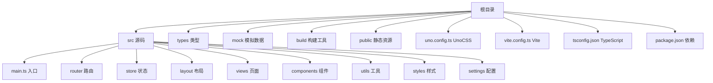
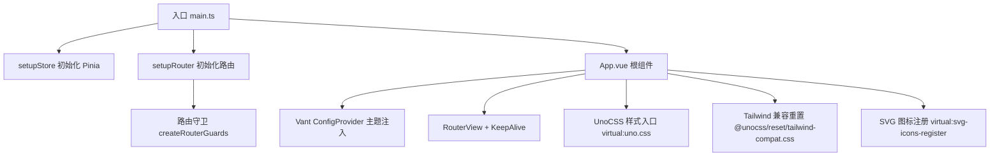
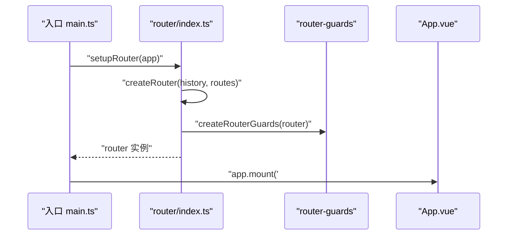
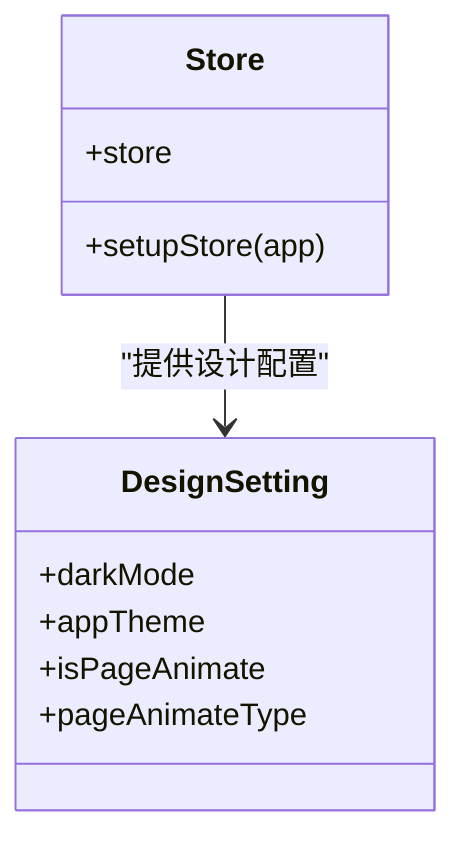
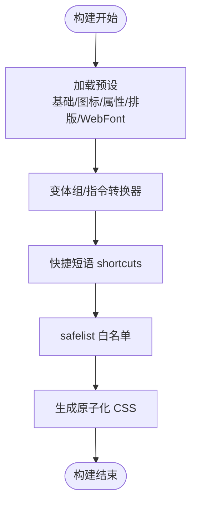
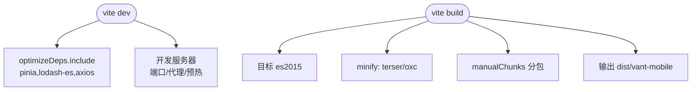
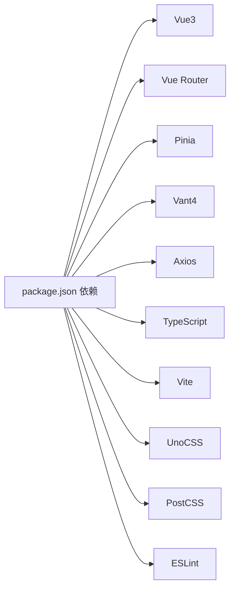

# 技术栈架构

<cite>
**本文引用的文件**
- [package.json](file://package.json)
- [vite.config.ts](file://vite.config.ts)
- [uno.config.ts](file://uno.config.ts)
- [tsconfig.json](file://tsconfig.json)
- [README.md](file://README.md)
- [src/main.ts](file://src/main.ts)
- [src/router/index.ts](file://src/router/index.ts)
- [src/store/index.ts](file://src/store/index.ts)
- [src/App.vue](file://src/App.vue)
- [src/layout/index.vue](file://src/layout/index.vue)
- [src/components/SvgIcon.vue](file://src/components/SvgIcon.vue)
- [src/settings/designSetting.ts](file://src/settings/designSetting.ts)
- [build/constant.ts](file://build/constant.ts)
- [build/utils.ts](file://build/utils.ts)
</cite>

## 目录
1. [引言](#引言)
2. [项目结构](#项目结构)
3. [核心组件](#核心组件)
4. [架构总览](#架构总览)
5. [详细组件分析](#详细组件分析)
6. [依赖分析](#依赖分析)
7. [性能考量](#性能考量)
8. [故障排查指南](#故障排查指南)
9. [结论](#结论)
10. [附录](#附录)

## 引言
本项目采用 Vue3 生态体系，围绕移动端微信 H5 场景，构建现代化、可扩展、易维护的前端工程。技术栈选择兼顾开发体验、性能表现与长期演进能力，涵盖构建工具、路由、状态管理、UI 组件库、样式方案与类型系统。本文将系统阐述各技术选型的理由、集成方式、数据与控制流、依赖关系、性能特性与升级策略，并提供可视化图表帮助读者快速理解。

## 项目结构
项目采用“按功能域划分”的组织方式，核心目录与职责如下：
- src：应用源码，包含入口、路由、状态、组件、页面、工具与样式
- types：类型声明与模块增强
- mock：本地与生产 Mock 服务
- build：构建期工具与常量
- public：公共资源
- uno.config.ts：UnoCSS 原子化 CSS 配置
- vite.config.ts：Vite 构建与开发服务器配置
- tsconfig.json：TypeScript 编译配置
- package.json：依赖与脚本

**图表来源**
- [vite.config.ts:1-183](file://vite.config.ts#L1-L183)
- [uno.config.ts:1-84](file://uno.config.ts#L1-L84)
- [tsconfig.json:1-42](file://tsconfig.json#L1-L42)
- [package.json:1-118](file://package.json#L1-L118)

**章节来源**
- [README.md:111-117](file://README.md#L111-L117)
- [vite.config.ts:1-183](file://vite.config.ts#L1-L183)
- [uno.config.ts:1-84](file://uno.config.ts#L1-L84)
- [tsconfig.json:1-42](file://tsconfig.json#L1-L42)

## 核心组件
- Vue3：响应式与组合式 API，提供高效组件模型与开发体验
- Vue Router：哈希历史、路由守卫、动态菜单与权限控制
- Pinia：轻量、类型友好、模块化状态管理，结合持久化插件
- Vite：快速冷启动、热模块替换、原生 ESM、预构建与插件生态
- UnoCSS：原子化 CSS、按需生成、主题与变体、图标与 WebFont
- Vant4：移动端优先的组件库，提供高复用 UI 与良好开发体验
- TypeScript：类型安全、IDE 智能提示与团队协作一致性
- 构建与工具链：Less、PostCSS、ESLint、Commit 规范与 Git Hooks

**章节来源**
- [package.json:41-56](file://package.json#L41-L56)
- [package.json:57-104](file://package.json#L57-L104)
- [src/main.ts:1-30](file://src/main.ts#L1-L30)
- [src/router/index.ts:1-33](file://src/router/index.ts#L1-L33)
- [src/store/index.ts:1-13](file://src/store/index.ts#L1-L13)
- [uno.config.ts:1-84](file://uno.config.ts#L1-L84)
- [vite.config.ts:1-183](file://vite.config.ts#L1-L183)

## 架构总览
整体架构围绕“入口引导 -> 路由与状态初始化 -> 组件渲染与主题注入 -> UnoCSS 原子化样式”展开。应用通过入口文件挂载状态、路由与应用实例；路由采用哈希模式与守卫；状态使用 Pinia 并启用持久化；UnoCSS 在构建期按需生成样式并支持主题变量注入；Vant4 通过全局配置提供主题变量与暗色模式支持。

**图表来源**
- [src/main.ts:18-30](file://src/main.ts#L18-L30)
- [src/router/index.ts:26-33](file://src/router/index.ts#L26-L33)
- [src/App.vue:1-78](file://src/App.vue#L1-L78)

**章节来源**
- [src/main.ts:1-30](file://src/main.ts#L1-L30)
- [src/router/index.ts:1-33](file://src/router/index.ts#L1-L33)
- [src/App.vue:1-78](file://src/App.vue#L1-L78)

## 详细组件分析

### Vue3 与应用引导
- 入口文件负责导入 UnoCSS、Vant 样式重置与 SVG 图标注册，随后创建应用实例，挂载状态与路由，并在路由就绪后挂载根组件
- 通过虚拟模块引入 UnoCSS 样式，确保样式在构建期按需生成
- 采用 KeepAlive 包裹 RouterView，结合路由 store 的缓存列表实现页面级缓存

**章节来源**
- [src/main.ts:1-30](file://src/main.ts#L1-L30)
- [src/App.vue:1-78](file://src/App.vue#L1-L78)

### Vue Router 集成
- 使用哈希历史模式，便于 H5 微信环境部署
- 路由守卫在路由实例创建后挂载，统一处理导航逻辑
- 动态菜单与路由表合并，支持权限与懒加载场景

**图表来源**
- [src/main.ts:18-30](file://src/main.ts#L18-L30)
- [src/router/index.ts:19-33](file://src/router/index.ts#L19-L33)

**章节来源**
- [src/router/index.ts:1-33](file://src/router/index.ts#L1-L33)

### Pinia 状态管理
- 创建 Pinia 实例并启用持久化插件，结合模块化 store 组织业务状态
- 设计设置 store 提供主题、动画与暗色模式等全局配置

**图表来源**
- [src/store/index.ts:1-13](file://src/store/index.ts#L1-L13)
- [src/settings/designSetting.ts:1-52](file://src/settings/designSetting.ts#L1-L52)

**章节来源**
- [src/store/index.ts:1-13](file://src/store/index.ts#L1-L13)
- [src/settings/designSetting.ts:1-52](file://src/settings/designSetting.ts#L1-L52)

### UnoCSS 原子化 CSS
- 预设：基础原子化、rem→px、图标、属性模式、排版、WebFont
- 变体：变体组与指令转换器，支持 @apply 风格与变体组合
- 主题：通过主题变量与 Vant ConfigProvider 注入，实现全局主题切换
- 按需：safelist 与构建期扫描，减少未命中类的体积

**图表来源**
- [uno.config.ts:13-84](file://uno.config.ts#L13-L84)

**章节来源**
- [uno.config.ts:1-84](file://uno.config.ts#L1-84)
- [src/App.vue:26-68](file://src/App.vue#L26-L68)

### Vant4 组件库
- 通过 ConfigProvider 注入主题变量，实现与 UnoCSS 主题的一致性
- 暗色模式与主题色联动，支持大量移动端常用组件
- 图标使用 UnoCSS 图标预设，保持一致的图标风格

**章节来源**
- [src/App.vue:1-78](file://src/App.vue#L1-L78)
- [uno.config.ts:28-34](file://uno.config.ts#L28-L34)

### TypeScript 集成
- 编译目标 ESNext，模块解析采用 bundler，启用严格模式与源码映射
- 路径别名与类型根目录配置，保障类型推导与智能提示
- 与 Vite、Vue、UnoCSS 生态协同，提升开发效率与稳定性

**章节来源**
- [tsconfig.json:1-42](file://tsconfig.json#L1-L42)

### 构建与开发服务器
- Vite 配置：别名、全局常量、构建目标、产物命名、手动分包、预热、代理与依赖优化
- Less 全局变量注入与 CSS 目标浏览器
- 依赖预构建 include/exclude，优化开发体验与首屏加载

**图表来源**
- [vite.config.ts:44-181](file://vite.config.ts#L44-L181)
- [build/constant.ts:1-7](file://build/constant.ts#L1-L7)

**章节来源**
- [vite.config.ts:1-183](file://vite.config.ts#L1-L183)
- [build/constant.ts:1-7](file://build/constant.ts#L1-L7)
- [build/utils.ts:1-76](file://build/utils.ts#L1-L76)

### 图标与 SVG 组件
- UnoCSS 图标预设提供 i- 前缀类名，支持多种图标集合
- 自定义 SvgIcon 组件封装 SVG symbol 使用，支持尺寸与颜色配置

**章节来源**
- [uno.config.ts:28-34](file://uno.config.ts#L28-L34)
- [src/components/SvgIcon.vue:1-40](file://src/components/SvgIcon.vue#L1-L40)

## 依赖分析
- 运行时依赖：Vue3、Vue Router、Pinia、Vant4、Axios、Lodash-es、ECharts、NProgress、日期处理等
- 开发依赖：Vite、UnoCSS、TypeScript、ESLint、PostCSS、Rollup、压缩与可视化插件等
- 环境与工具：Node 与 pnpm 版本约束，Git Hooks、Commit 规范与 ESLint 平台

**图表来源**
- [package.json:41-104](file://package.json#L41-L104)

**章节来源**
- [package.json:1-118](file://package.json#L1-L118)

## 性能考量
- 构建目标与压缩：es2015 与 terser/oxc 混合策略，按需移除 console，chunkSize 警告阈值调优
- 依赖预构建：将常用库预构建为 ESM 并缓存，减少首次加载等待
- 手动分包：将 node_modules 依赖按包名拆分，提升缓存命中率
- 样式按需：UnoCSS 构建期扫描，safelist 白名单保证动态类名样式生成
- 预热策略：warmup 预热首页与关键组件，缩短冷启动时间

**章节来源**
- [vite.config.ts:72-122](file://vite.config.ts#L72-L122)
- [vite.config.ts:156-177](file://vite.config.ts#L156-L177)
- [uno.config.ts:77-83](file://uno.config.ts#L77-L83)

## 故障排查指南
- 开发依赖安装失败：确认 pnpm 与 Node 版本满足 engines 要求
- 构建产物路径异常：检查输出目录常量与构建配置
- UnoCSS 动态类名样式缺失：核对 safelist 与类名前缀
- 路由跳转白屏：确认路由守卫与 RouterView KeepAlive 配置
- 图标不显示：检查 UnoCSS 图标预设与类名格式

**章节来源**
- [package.json:20-23](file://package.json#L20-L23)
- [build/constant.ts:6](file://build/constant.ts#L6)
- [uno.config.ts:77-83](file://uno.config.ts#L77-L83)
- [src/router/index.ts:26-33](file://src/router/index.ts#L26-L33)
- [uno.config.ts:28-34](file://uno.config.ts#L28-L34)

## 结论
本项目以 Vue3 为核心，结合 Vite、Pinia、UnoCSS、Vant4 与 TypeScript，形成一套面向移动端微信 H5 的现代化技术栈。通过合理的构建配置、主题与样式策略以及完善的开发工具链，项目在开发效率、运行性能与可维护性之间取得平衡。建议在后续迭代中持续关注生态版本兼容与升级策略，保持依赖与工具链的稳定演进。

## 附录

### 技术栈决策矩阵
- Vue3 vs 其他框架：组合式 API、生态成熟度、迁移成本低
- Vue Router vs 其他路由：与 Vue3 深度契合、哈希模式适合 H5
- Pinia vs Vuex：API 简洁、类型友好、模块化与持久化
- Vite vs Webpack：冷启动快、HMR 高效、原生 ESM、插件生态
- UnoCSS vs 全量 CSS：按需生成、主题与变体、体积更小
- Vant4 vs 其他移动端 UI：组件丰富、移动端适配好、开发体验佳
- TypeScript vs JavaScript：类型安全、IDE 支持、团队协作

### 版本兼容性与升级策略
- Node 与 pnpm：满足 engines 约束，避免安装与打包问题
- 浏览器支持：现代浏览器，Chrome 80+ 推荐
- 升级策略：先升级 Vite 与 Vue，再升级生态依赖；Pinia/Vant/UnoCSS 采用语义化版本；每次升级进行端到端回归测试

**章节来源**
- [package.json:20-23](file://package.json#L20-L23)
- [README.md:288-297](file://README.md#L288-L297)