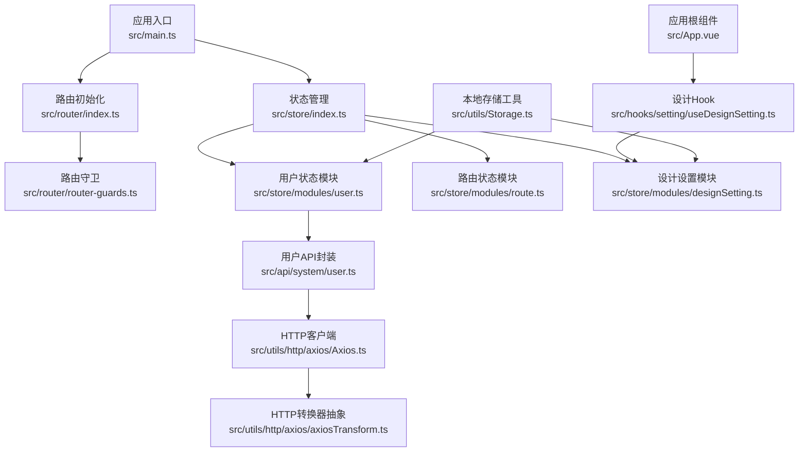
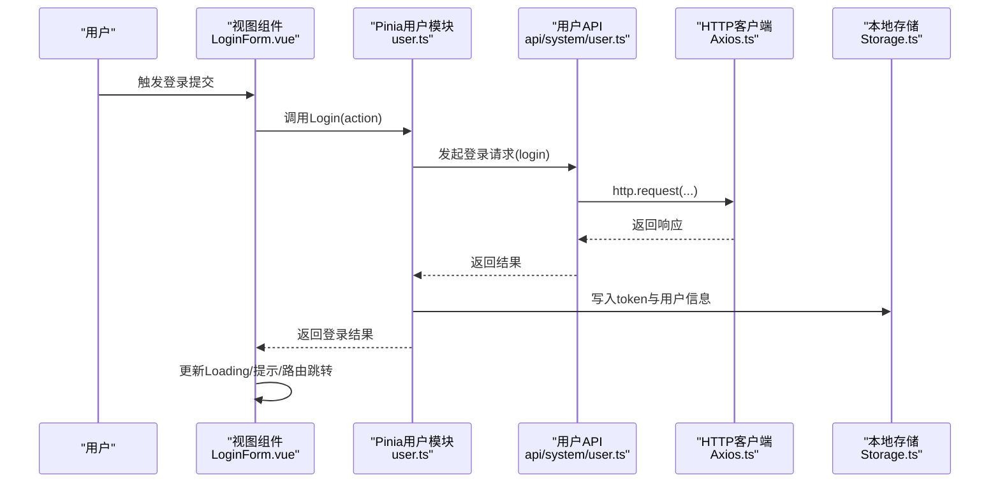
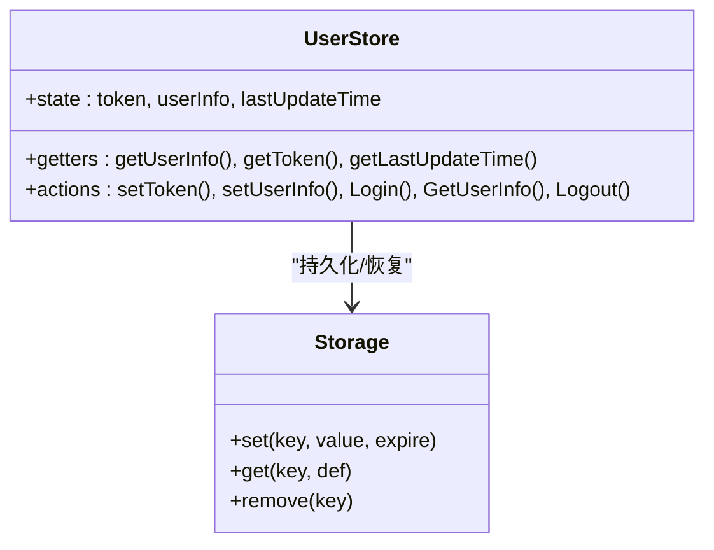
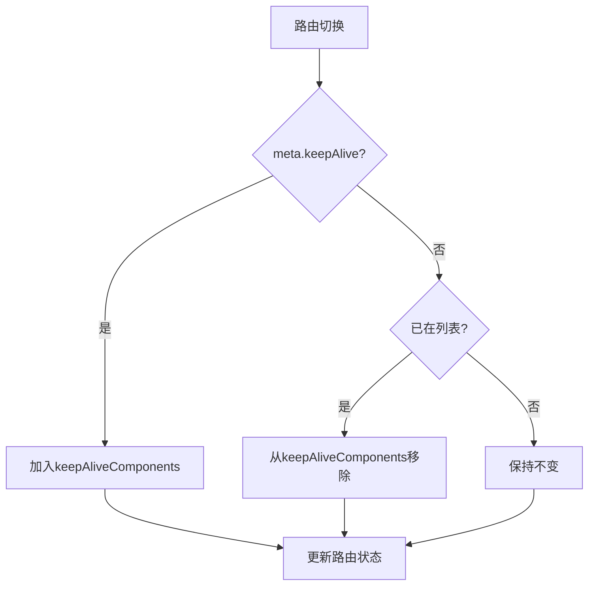
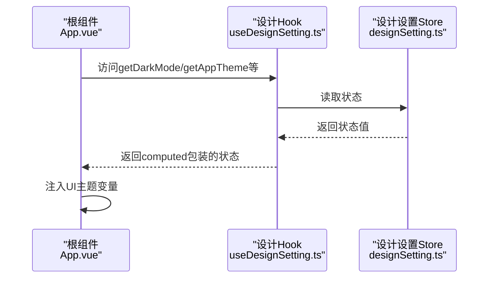
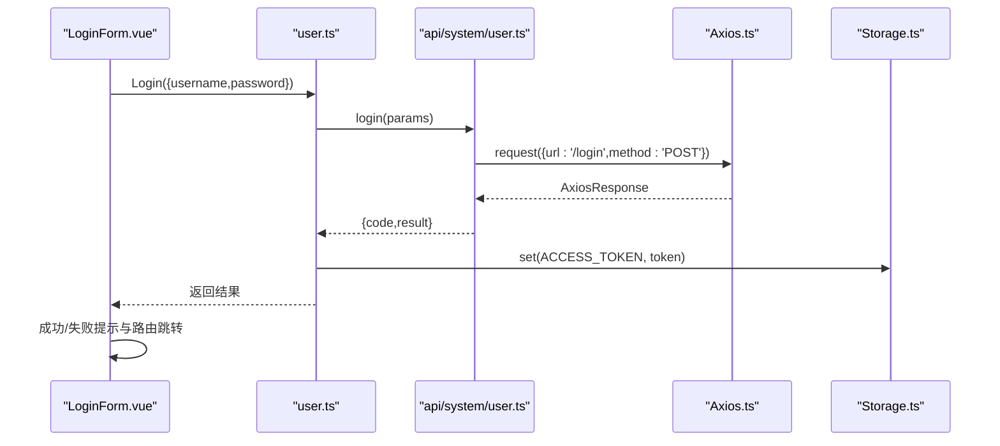
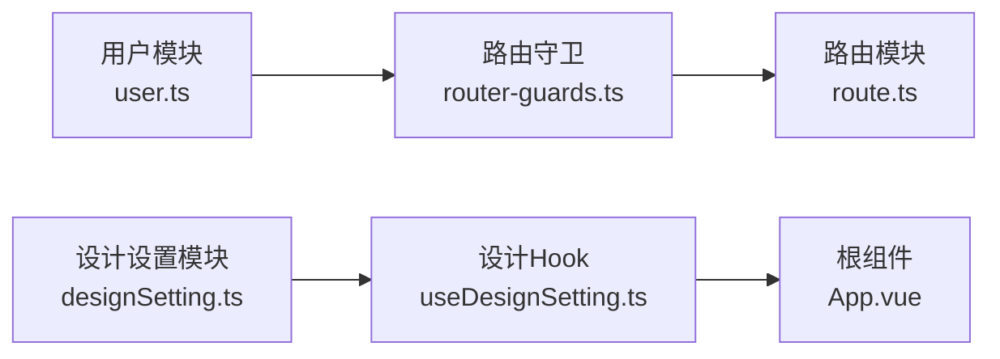
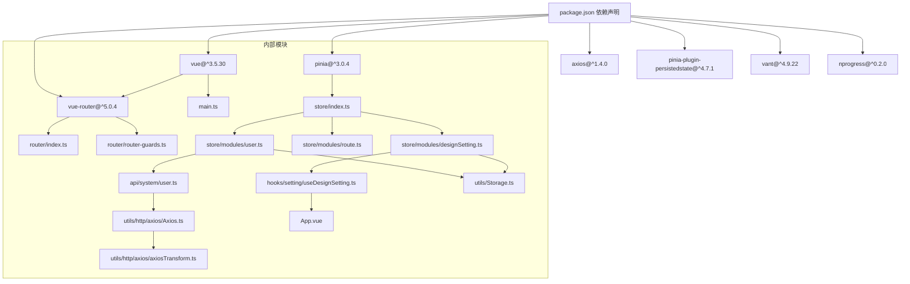

# 数据流设计

<cite>
**本文引用的文件**
- [main.ts](file://src/main.ts)
- [store/index.ts](file://src/store/index.ts)
- [router/index.ts](file://src/router/index.ts)
- [router/router-guards.ts](file://src/router/router-guards.ts)
- [App.vue](file://src/App.vue)
- [store/modules/user.ts](file://src/store/modules/user.ts)
- [store/modules/route.ts](file://src/store/modules/route.ts)
- [store/modules/designSetting.ts](file://src/store/modules/designSetting.ts)
- [hooks/setting/useDesignSetting.ts](file://src/hooks/setting/useDesignSetting.ts)
- [utils/Storage.ts](file://src/utils/Storage.ts)
- [utils/http/axios/Axios.ts](file://src/utils/http/axios/Axios.ts)
- [utils/http/axios/axiosTransform.ts](file://src/utils/http/axios/axiosTransform.ts)
- [api/system/user.ts](file://src/api/system/user.ts)
- [views/login/Login.vue](file://src/views/login/Login.vue)
- [views/login/LoginForm.vue](file://src/views/login/LoginForm.vue)
- [enums/cacheEnum.ts](file://src/enums/cacheEnum.ts)
- [enums/httpEnum.ts](file://src/enums/httpEnum.ts)
- [enums/pageEnum.ts](file://src/enums/pageEnum.ts)
- [settings/designSetting.ts](file://src/settings/designSetting.ts)
- [package.json](file://package.json)
</cite>

## 目录
1. [简介](#简介)
2. [项目结构](#项目结构)
3. [核心组件](#核心组件)
4. [架构总览](#架构总览)
5. [详细组件分析](#详细组件分析)
6. [依赖关系分析](#依赖关系分析)
7. [性能考虑](#性能考虑)
8. [故障排查指南](#故障排查指南)
9. [结论](#结论)
10. [附录](#附录)

## 简介
本文件面向Vue3微信H5移动端项目，系统性梳理“单向数据流”的实现机制，覆盖以下方面：
- 用户交互触发 → 组件状态更新 → Pinia Store状态变更 → API请求处理的完整流程
- 响应式数据绑定（基于Vue3 Proxy与依赖收集）的工作原理
- 状态管理的数据流向：从用户认证状态到路由状态再到设计设置状态
- 异步数据处理模式：API调用、错误处理与Loading状态管理
- 数据流图与状态转换图：从用户操作到数据更新的端到端路径
- 缓存策略与数据持久化：localStorage使用与状态恢复
- 性能优化策略：状态分片、计算属性与响应式优化

## 项目结构
项目采用“入口应用 → 路由 → Pinia Store → 组件/工具”的分层组织方式。关键启动流程如下：
- 应用入口负责创建应用实例、挂载Pinia与路由，并在路由就绪后再挂载应用
- 路由初始化时加载菜单与常量路由，随后注册全局路由守卫
- Store通过插件实现持久化，结合工具类实现本地缓存
- 组件通过组合式API访问Store与工具，完成UI渲染与交互

图表来源
- [main.ts:18-30](file://src/main.ts#L18-L30)
- [store/index.ts:1-13](file://src/store/index.ts#L1-L13)
- [router/index.ts:19-33](file://src/router/index.ts#L19-L33)
- [router/router-guards.ts:17-93](file://src/router/router-guards.ts#L17-L93)
- [store/modules/user.ts:1-115](file://src/store/modules/user.ts#L1-L115)
- [store/modules/route.ts:1-40](file://src/store/modules/route.ts#L1-L40)
- [store/modules/designSetting.ts:1-52](file://src/store/modules/designSetting.ts#L1-L52)
- [hooks/setting/useDesignSetting.ts:1-25](file://src/hooks/setting/useDesignSetting.ts#L1-L25)
- [utils/Storage.ts:1-128](file://src/utils/Storage.ts#L1-L128)
- [utils/http/axios/Axios.ts:18-225](file://src/utils/http/axios/Axios.ts#L18-L225)
- [utils/http/axios/axiosTransform.ts:13-53](file://src/utils/http/axios/axiosTransform.ts#L13-L53)
- [api/system/user.ts:1-60](file://src/api/system/user.ts#L1-L60)
- [App.vue:15-78](file://src/App.vue#L15-L78)

章节来源
- [main.ts:18-30](file://src/main.ts#L18-L30)
- [router/index.ts:19-33](file://src/router/index.ts#L19-L33)
- [store/index.ts:1-13](file://src/store/index.ts#L1-L13)

## 核心组件
- 应用入口与启动
  - 创建应用实例，按序挂载Pinia与路由；路由就绪后再挂载应用，确保导航与状态一致
- 状态管理（Pinia）
  - 创建Pinia实例并启用持久化插件；各模块定义状态、getter与action
- 路由系统
  - 定义常量路由与动态菜单，创建路由守卫进行鉴权与页面标题设置、组件缓存控制
- 设计设置与主题
  - 通过Hook暴露主题、动画等设计态，根组件根据设计态注入UI主题变量
- 本地存储与HTTP
  - 封装localStorage工具，支持带过期时间的KV；HTTP客户端支持拦截器、取消重复请求、表单编码等

章节来源
- [main.ts:18-30](file://src/main.ts#L18-L30)
- [store/index.ts:1-13](file://src/store/index.ts#L1-L13)
- [router/index.ts:19-33](file://src/router/index.ts#L19-L33)
- [router/router-guards.ts:17-93](file://src/router/router-guards.ts#L17-L93)
- [hooks/setting/useDesignSetting.ts:1-25](file://src/hooks/setting/useDesignSetting.ts#L1-L25)
- [utils/Storage.ts:1-128](file://src/utils/Storage.ts#L1-L128)
- [utils/http/axios/Axios.ts:18-225](file://src/utils/http/axios/Axios.ts#L18-L225)

## 架构总览
下图展示了从用户交互到数据更新的端到端单向数据流：

图表来源
- [views/login/LoginForm.vue:86-118](file://src/views/login/LoginForm.vue#L86-L118)
- [store/modules/user.ts:64-77](file://src/store/modules/user.ts#L64-L77)
- [api/system/user.ts:12-23](file://src/api/system/user.ts#L12-L23)
- [utils/http/axios/Axios.ts:55-100](file://src/utils/http/axios/Axios.ts#L55-L100)
- [utils/Storage.ts:27-57](file://src/utils/Storage.ts#L27-L57)

## 详细组件分析

### 用户认证状态模块（Pinia）
- 状态与Getter
  - token、userInfo、lastUpdateTime；token与用户信息从本地存储回填
- Action
  - Login：调用API写入token并持久化
  - GetUserInfo：拉取用户信息并持久化
  - Logout：清理token与用户信息，跳转登录页并刷新
- 持久化
  - 通过本地存储工具写入/读取token与用户信息

图表来源
- [store/modules/user.ts:25-109](file://src/store/modules/user.ts#L25-L109)
- [utils/Storage.ts:13-74](file://src/utils/Storage.ts#L13-L74)

章节来源
- [store/modules/user.ts:1-115](file://src/store/modules/user.ts#L1-L115)
- [utils/Storage.ts:1-128](file://src/utils/Storage.ts#L1-L128)

### 路由状态模块（Pinia）
- 状态
  - menus、routers、keepAliveComponents
- Getter与Action
  - 提供菜单读取与路由设置；维护需要缓存的组件集合
- 与路由守卫协作
  - 守卫在afterEach阶段根据meta.keepAlive与当前路由动态维护keepAliveComponents

图表来源
- [router/router-guards.ts:62-87](file://src/router/router-guards.ts#L62-L87)
- [store/modules/route.ts:22-33](file://src/store/modules/route.ts#L22-L33)

章节来源
- [store/modules/route.ts:1-40](file://src/store/modules/route.ts#L1-L40)
- [router/router-guards.ts:17-93](file://src/router/router-guards.ts#L17-L93)

### 设计设置模块（Pinia + Hook）
- 状态
  - darkMode、appTheme、appThemeList、isPageAnimate、pageAnimateType
- Getter与Action
  - 提供主题与动画开关的读取与修改
- Hook
  - useDesignSetting将设计态包装为computed，供根组件注入UI主题变量

图表来源
- [App.vue:15-78](file://src/App.vue#L15-L78)
- [hooks/setting/useDesignSetting.ts:4-24](file://src/hooks/setting/useDesignSetting.ts#L4-L24)
- [store/modules/designSetting.ts:8-46](file://src/store/modules/designSetting.ts#L8-L46)
- [settings/designSetting.ts:38-52](file://src/settings/designSetting.ts#L38-L52)

章节来源
- [hooks/setting/useDesignSetting.ts:1-25](file://src/hooks/setting/useDesignSetting.ts#L1-L25)
- [store/modules/designSetting.ts:1-52](file://src/store/modules/designSetting.ts#L1-L52)
- [settings/designSetting.ts:1-52](file://src/settings/designSetting.ts#L1-L52)

### 登录流程（用户交互 → 组件状态 → Store → API）
- 视图层
  - LoginForm收集表单数据，校验后调用用户Store的Login
- Store层
  - Login内部调用API封装，成功后写入token并持久化
- API层
  - 通过HTTP客户端发起请求，统一拦截与转换
- 错误与Loading
  - 视图层显示Loading与Toast，Store返回code用于判断

图表来源
- [views/login/LoginForm.vue:86-118](file://src/views/login/LoginForm.vue#L86-L118)
- [store/modules/user.ts:64-77](file://src/store/modules/user.ts#L64-L77)
- [api/system/user.ts:12-23](file://src/api/system/user.ts#L12-L23)
- [utils/http/axios/Axios.ts:55-100](file://src/utils/http/axios/Axios.ts#L55-L100)
- [utils/Storage.ts:27-57](file://src/utils/Storage.ts#L27-L57)

章节来源
- [views/login/LoginForm.vue:1-124](file://src/views/login/LoginForm.vue#L1-L124)
- [store/modules/user.ts:1-115](file://src/store/modules/user.ts#L1-L115)
- [api/system/user.ts:1-60](file://src/api/system/user.ts#L1-L60)

### 响应式数据绑定与依赖收集（Vue3 Proxy）
- Vue3基于Proxy实现响应式，当组件读取或写入响应式数据时，会建立依赖关系
- computed与watch在访问时进行依赖追踪，在状态变化时触发重新计算/回调
- 在本项目中，设计Hook将Store状态包装为computed，根组件在模板中使用这些computed，形成从Store到UI的单向数据流

章节来源
- [hooks/setting/useDesignSetting.ts:4-24](file://src/hooks/setting/useDesignSetting.ts#L4-L24)
- [App.vue:15-78](file://src/App.vue#L15-L78)

### 异步数据处理模式（API、错误、Loading）
- API调用
  - 通过HTTP客户端封装请求，支持拦截器、重复请求取消、表单编码等
- 错误处理
  - 拦截器内捕获异常并统一处理；组件层对业务错误进行Toast提示
- Loading状态管理
  - 登录表单在提交期间设置loading状态，完成后复位

章节来源
- [utils/http/axios/Axios.ts:175-223](file://src/utils/http/axios/Axios.ts#L175-L223)
- [utils/http/axios/axiosTransform.ts:13-53](file://src/utils/http/axios/axiosTransform.ts#L13-L53)
- [views/login/LoginForm.vue:86-118](file://src/views/login/LoginForm.vue#L86-L118)

### 缓存策略与数据持久化（localStorage）
- 本地存储工具
  - 支持带过期时间的KV存储，过期自动清理
- Token与用户信息
  - 用户模块在登录后写入localStorage，并在GetUserInfo时回填
- 设计设置
  - 设计设置模块通过Pinia持久化插件将状态写入localStorage

章节来源
- [utils/Storage.ts:1-128](file://src/utils/Storage.ts#L1-L128)
- [store/modules/user.ts:44-61](file://src/store/modules/user.ts#L44-L61)
- [store/modules/designSetting.ts:42-46](file://src/store/modules/designSetting.ts#L42-L46)

### 状态流向：认证 → 路由 → 设计设置
- 认证状态（用户模块）影响路由守卫逻辑与页面标题设置
- 路由状态（路由模块）决定KeepAlive组件集合
- 设计设置（设计设置模块）通过Hook注入到根组件，影响UI主题与动画

图表来源
- [store/modules/user.ts:1-115](file://src/store/modules/user.ts#L1-L115)
- [router/router-guards.ts:17-93](file://src/router/router-guards.ts#L17-L93)
- [store/modules/route.ts:1-40](file://src/store/modules/route.ts#L1-L40)
- [store/modules/designSetting.ts:1-52](file://src/store/modules/designSetting.ts#L1-L52)
- [hooks/setting/useDesignSetting.ts:1-25](file://src/hooks/setting/useDesignSetting.ts#L1-L25)
- [App.vue:15-78](file://src/App.vue#L15-L78)

## 依赖关系分析
- 外部依赖
  - Vue3、Pinia、Vue Router、Axios、Vant、NProgress、pinia-plugin-persistedstate
- 内部依赖
  - Store模块之间低耦合，通过Hook与枚举常量进行松散耦合
  - 组件通过组合式API访问Store，避免直接跨模块耦合

图表来源
- [package.json:41-56](file://package.json#L41-L56)
- [main.ts:13-29](file://src/main.ts#L13-L29)
- [router/index.ts:19-33](file://src/router/index.ts#L19-L33)
- [router/router-guards.ts:17-93](file://src/router/router-guards.ts#L17-L93)
- [store/index.ts:1-13](file://src/store/index.ts#L1-L13)
- [store/modules/user.ts:1-115](file://src/store/modules/user.ts#L1-L115)
- [store/modules/route.ts:1-40](file://src/store/modules/route.ts#L1-L40)
- [store/modules/designSetting.ts:1-52](file://src/store/modules/designSetting.ts#L1-L52)
- [hooks/setting/useDesignSetting.ts:1-25](file://src/hooks/setting/useDesignSetting.ts#L1-L25)
- [utils/Storage.ts:1-128](file://src/utils/Storage.ts#L1-L128)
- [utils/http/axios/Axios.ts:18-225](file://src/utils/http/axios/Axios.ts#L18-L225)
- [utils/http/axios/axiosTransform.ts:13-53](file://src/utils/http/axios/axiosTransform.ts#L13-L53)
- [api/system/user.ts:1-60](file://src/api/system/user.ts#L1-L60)

章节来源
- [package.json:1-118](file://package.json#L1-L118)

## 性能考虑
- 状态分片
  - 将用户、路由、设计设置拆分为独立模块，降低全局状态变更带来的重渲染范围
- 计算属性与派生状态
  - 通过computed包装Store状态，减少重复计算与无谓渲染
- KeepAlive组件缓存
  - 路由守卫根据meta.keepAlive动态维护缓存列表，避免频繁销毁/重建
- 响应式优化
  - 仅在必要时写入localStorage，避免频繁I/O；对大对象使用浅拷贝与深拷贝策略
- HTTP优化
  - 重复请求取消、表单编码优化、拦截器集中处理错误

章节来源
- [router/router-guards.ts:62-87](file://src/router/router-guards.ts#L62-L87)
- [hooks/setting/useDesignSetting.ts:4-24](file://src/hooks/setting/useDesignSetting.ts#L4-L24)
- [utils/http/axios/Axios.ts:175-223](file://src/utils/http/axios/Axios.ts#L175-L223)

## 故障排查指南
- 登录失败
  - 检查API返回码与消息；确认HTTP拦截器未抛出未捕获异常
  - 查看Store中token与userInfo是否写入localStorage
- 路由跳转异常
  - 检查路由守卫白名单与鉴权逻辑；确认NProgress与页面title设置
- 主题不生效
  - 检查设计Hook返回的computed是否正确注入到根组件
  - 确认localStorage中的设计设置是否持久化成功
- KeepAlive不生效
  - 检查路由meta.keepAlive与当前路由name匹配情况
  - 确认路由守卫afterEach是否正确更新keepAliveComponents

章节来源
- [views/login/LoginForm.vue:86-118](file://src/views/login/LoginForm.vue#L86-L118)
- [store/modules/user.ts:64-77](file://src/store/modules/user.ts#L64-L77)
- [router/router-guards.ts:17-93](file://src/router/router-guards.ts#L17-L93)
- [hooks/setting/useDesignSetting.ts:4-24](file://src/hooks/setting/useDesignSetting.ts#L4-L24)
- [store/modules/designSetting.ts:42-46](file://src/store/modules/designSetting.ts#L42-L46)

## 结论
本项目通过“入口应用 → 路由 → Pinia Store → 组件/工具”的清晰分层，实现了稳定的单向数据流：
- 用户交互 → 组件状态 → Store → API → Store持久化 → UI更新
- 基于Pinia的模块化状态管理与computed的响应式优化，保证了良好的可维护性
- 路由守卫与KeepAlive配合，提升了移动端H5的用户体验
- 本地存储与HTTP拦截器共同保障了数据一致性与稳定性

## 附录
- 关键枚举与常量
  - 缓存键：TOKEN_KEY、USER_INFO_KEY等
  - HTTP状态码：ResultEnum
  - 页面枚举：PageEnum
- 重要实现参考路径
  - 应用启动与挂载：[main.ts:18-30](file://src/main.ts#L18-L30)
  - Store初始化与持久化：[store/index.ts:1-13](file://src/store/index.ts#L1-13)
  - 路由守卫与缓存控制：[router/router-guards.ts:17-93](file://src/router/router-guards.ts#L17-L93)
  - 用户登录流程：[views/login/LoginForm.vue:86-118](file://src/views/login/LoginForm.vue#L86-L118)
  - HTTP客户端与拦截器：[utils/http/axios/Axios.ts:175-223](file://src/utils/http/axios/Axios.ts#L175-L223)