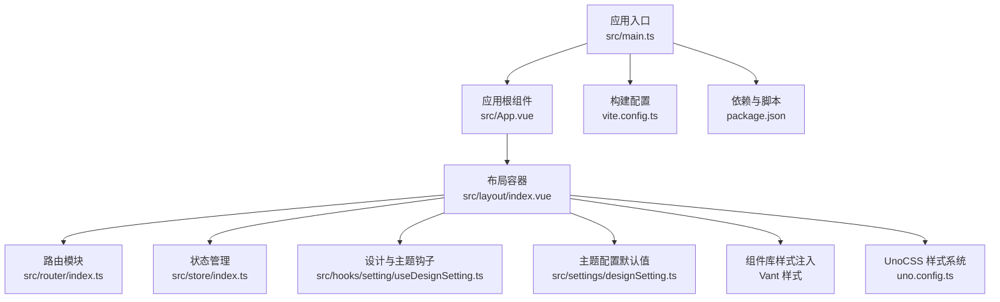
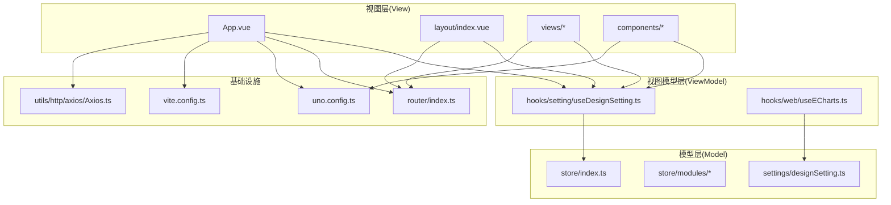
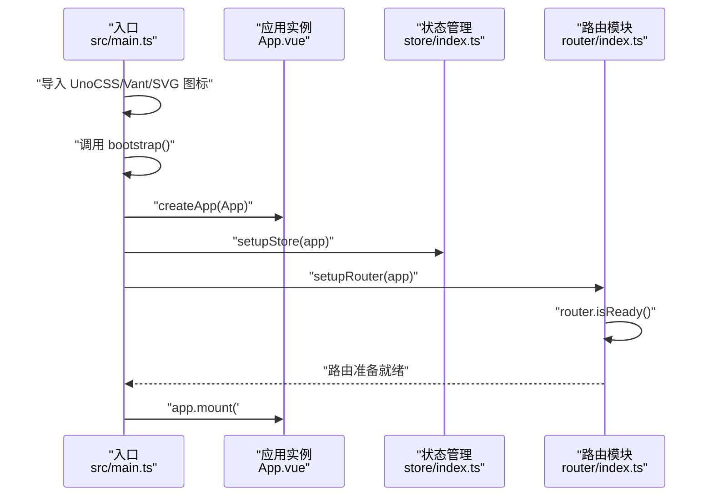
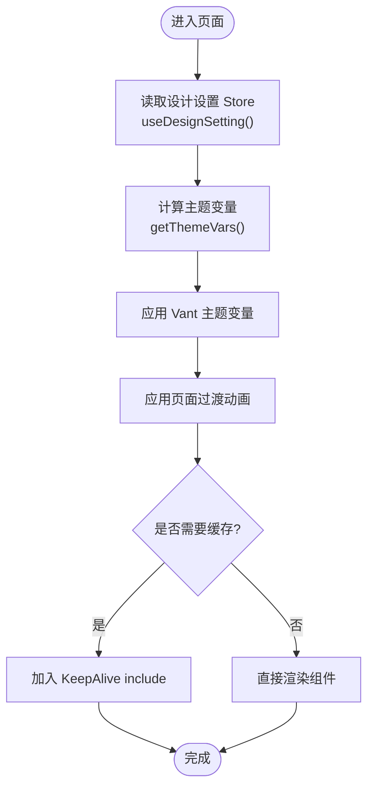
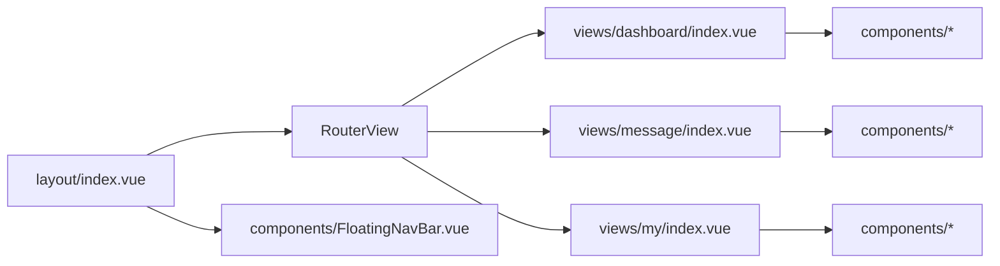
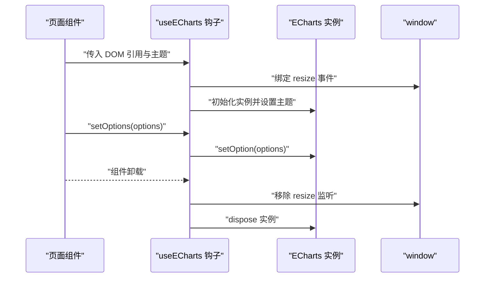
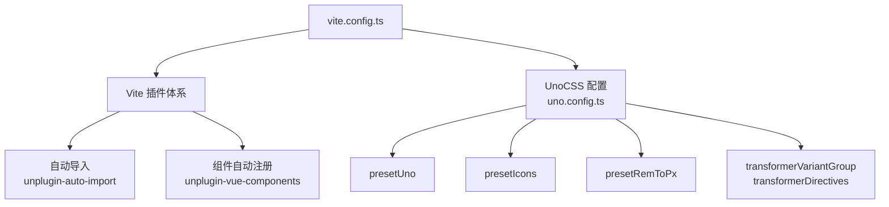
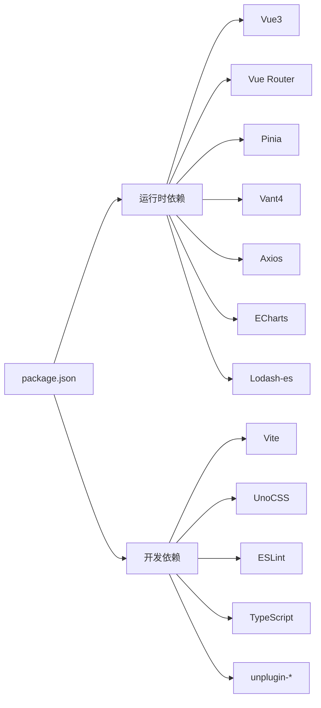

# 整体架构理念

<cite>
**本文引用的文件**
- [src/main.ts](file://src/main.ts)
- [src/App.vue](file://src/App.vue)
- [src/layout/index.vue](file://src/layout/index.vue)
- [src/router/index.ts](file://src/router/index.ts)
- [src/store/index.ts](file://src/store/index.ts)
- [src/hooks/setting/useDesignSetting.ts](file://src/hooks/setting/useDesignSetting.ts)
- [src/settings/designSetting.ts](file://src/settings/designSetting.ts)
- [src/components/Logo.vue](file://src/components/Logo.vue)
- [src/hooks/web/useECharts.ts](file://src/hooks/web/useECharts.ts)
- [src/utils/http/axios/Axios.ts](file://src/utils/http/axios/Axios.ts)
- [src/views/dashboard/index.vue](file://src/views/dashboard/index.vue)
- [vite.config.ts](file://vite.config.ts)
- [uno.config.ts](file://uno.config.ts)
- [package.json](file://package.json)
- [README.md](file://README.md)
</cite>

## 目录
1. [引言](#引言)
2. [项目结构](#项目结构)
3. [核心组件](#核心组件)
4. [架构总览](#架构总览)
5. [详细组件分析](#详细组件分析)
6. [依赖关系分析](#依赖关系分析)
7. [性能考量](#性能考量)
8. [故障排查指南](#故障排查指南)
9. [结论](#结论)
10. [附录](#附录)

## 引言
本项目采用 Vue3 + Vite + Vant4 + Pinia + UnoCSS 的移动端 H5 技术栈，围绕 MVVM 架构理念组织代码，强调“数据驱动视图”的响应式更新、组件化设计与 Composition API 的可组合性。项目通过插件化架构整合 Vite 生态、UnoCSS 原子化样式与自动导入机制，提供移动端优先的触摸交互体验与良好的性能表现。

## 项目结构
项目采用按功能域划分的目录组织方式，核心模块包括：
- 应用入口与启动流程：src/main.ts、src/App.vue
- 路由与导航：src/router/*
- 状态管理：src/store/*
- 设计与主题：src/settings/*、src/hooks/setting/*
- 组件层：src/components/*、src/layout/*
- 视图页面：src/views/*
- 工具与网络：src/utils/http/*
- 构建与样式：vite.config.ts、uno.config.ts、package.json

**图表来源**
- [src/main.ts:1-30](file://src/main.ts#L1-L30)
- [src/App.vue:1-78](file://src/App.vue#L1-L78)
- [src/layout/index.vue:1-60](file://src/layout/index.vue#L1-L60)
- [src/router/index.ts:1-33](file://src/router/index.ts#L1-L33)
- [src/store/index.ts:1-13](file://src/store/index.ts#L1-L13)
- [src/hooks/setting/useDesignSetting.ts:1-25](file://src/hooks/setting/useDesignSetting.ts#L1-L25)
- [src/settings/designSetting.ts:1-52](file://src/settings/designSetting.ts#L1-L52)
- [uno.config.ts:1-84](file://uno.config.ts#L1-L84)
- [vite.config.ts:1-183](file://vite.config.ts#L1-L183)
- [package.json:1-118](file://package.json#L1-L118)

**章节来源**
- [src/main.ts:1-30](file://src/main.ts#L1-L30)
- [src/App.vue:1-78](file://src/App.vue#L1-L78)
- [src/layout/index.vue:1-60](file://src/layout/index.vue#L1-L60)
- [src/router/index.ts:1-33](file://src/router/index.ts#L1-L33)
- [src/store/index.ts:1-13](file://src/store/index.ts#L1-L13)
- [uno.config.ts:1-84](file://uno.config.ts#L1-L84)
- [vite.config.ts:1-183](file://vite.config.ts#L1-L183)
- [package.json:1-118](file://package.json#L1-L118)

## 核心组件
- 应用入口与启动流程：负责创建应用实例、挂载状态管理与路由、等待路由就绪后再挂载根组件，确保导航与状态在首屏稳定。
- 应用根组件：统一注入 Vant 主题配置、页面过渡动画与 KeepAlive 缓存策略，集中处理主题变量与页面切换效果。
- 布局容器：承载路由视图与底部浮动导航栏，结合 KeepAlive 实现页面级缓存，减少重复渲染。
- 路由模块：集中注册常量路由与模块化路由，创建路由守卫，统一滚动行为与菜单/路由映射。
- 状态管理：基于 Pinia 的模块化 Store，启用持久化插件，提供主题、路由缓存等跨模块共享状态。
- 设计与主题：设计设置 Store 与 useDesignSetting 钩子，提供深浅色模式、主题色、页面动画开关与类型等响应式状态。
- 组件与视图：单文件组件（SFC）按页面与功能拆分，Logo 组件根据主题色动态生成渐变视觉；仪表盘页面展示主题与动画联动。
- 网络层：VAxios 封装 axios，提供拦截器、取消重复请求、表单数据转换与统一错误处理。
- 构建与样式：Vite 插件体系、UnoCSS 原子化样式与 rem-to-px 适配，移动端优先的视口适配策略。

**章节来源**
- [src/main.ts:18-30](file://src/main.ts#L18-L30)
- [src/App.vue:15-72](file://src/App.vue#L15-L72)
- [src/layout/index.vue:32-49](file://src/layout/index.vue#L32-L49)
- [src/router/index.ts:16-30](file://src/router/index.ts#L16-L30)
- [src/store/index.ts:5-10](file://src/store/index.ts#L5-L10)
- [src/hooks/setting/useDesignSetting.ts:4-24](file://src/hooks/setting/useDesignSetting.ts#L4-L24)
- [src/settings/designSetting.ts:38-49](file://src/settings/designSetting.ts#L38-L49)
- [src/components/Logo.vue:44-51](file://src/components/Logo.vue#L44-L51)
- [src/views/dashboard/index.vue:27-76](file://src/views/dashboard/index.vue#L27-L76)
- [src/utils/http/axios/Axios.ts:18-225](file://src/utils/http/axios/Axios.ts#L18-L225)
- [vite.config.ts:179-181](file://vite.config.ts#L179-L181)
- [uno.config.ts:13-84](file://uno.config.ts#L13-L84)

## 架构总览
本项目采用 MVVM 架构：
- Model：Pinia Store（设计设置、路由缓存等）
- View：Vue SFC（App.vue、layout、views、components）
- ViewModel：Composition API 钩子与响应式计算（useDesignSetting、useECharts）

**图表来源**
- [src/App.vue:15-72](file://src/App.vue#L15-L72)
- [src/layout/index.vue:32-49](file://src/layout/index.vue#L32-L49)
- [src/store/index.ts:5-10](file://src/store/index.ts#L5-L10)
- [src/settings/designSetting.ts:38-49](file://src/settings/designSetting.ts#L38-L49)
- [src/hooks/setting/useDesignSetting.ts:4-24](file://src/hooks/setting/useDesignSetting.ts#L4-L24)
- [src/hooks/web/useECharts.ts:14-123](file://src/hooks/web/useECharts.ts#L14-L123)
- [src/router/index.ts:16-30](file://src/router/index.ts#L16-L30)
- [src/utils/http/axios/Axios.ts:18-225](file://src/utils/http/axios/Axios.ts#L18-L225)
- [uno.config.ts:13-84](file://uno.config.ts#L13-L84)
- [vite.config.ts:179-181](file://vite.config.ts#L179-L181)

## 详细组件分析

### 应用启动与初始化流程
应用启动流程遵循“先状态与路由，后视图挂载”的顺序，确保导航与状态在首屏稳定。

**图表来源**
- [src/main.ts:18-30](file://src/main.ts#L18-L30)
- [src/store/index.ts:8-10](file://src/store/index.ts#L8-L10)
- [src/router/index.ts:26-30](file://src/router/index.ts#L26-L30)

**章节来源**
- [src/main.ts:18-30](file://src/main.ts#L18-L30)
- [src/store/index.ts:8-10](file://src/store/index.ts#L8-L10)
- [src/router/index.ts:26-30](file://src/router/index.ts#L26-L30)

### 响应式系统与数据驱动视图
- 设计设置通过 Store 暴露响应式状态，useDesignSetting 钩子将状态提升为可复用的组合式 API，供 App.vue 与各页面使用。
- App.vue 基于 computed 与 unref 动态生成 Vant 主题变量，实现主题色与深浅色模式的即时切换。
- 页面切换动画与 KeepAlive 结合，通过路由 Store 的 keepAliveComponents 控制组件缓存，减少重复渲染。

**图表来源**
- [src/hooks/setting/useDesignSetting.ts:4-24](file://src/hooks/setting/useDesignSetting.ts#L4-L24)
- [src/App.vue:26-72](file://src/App.vue#L26-L72)
- [src/layout/index.vue:41-41](file://src/layout/index.vue#L41-L41)

**章节来源**
- [src/hooks/setting/useDesignSetting.ts:4-24](file://src/hooks/setting/useDesignSetting.ts#L4-L24)
- [src/App.vue:26-72](file://src/App.vue#L26-L72)
- [src/layout/index.vue:41-41](file://src/layout/index.vue#L41-L41)

### 组件化设计与单文件组件（SFC）
- SFC 按页面与功能拆分，如 Dashboard 页面集中展示主题与动画效果，Logo 组件根据主题色动态生成 SVG 渐变。
- 布局容器通过 RouterView 与 KeepAlive 实现页面级缓存，FloatingNavBar 提供底部导航栏。
- 组件间通过 Store 共享状态，避免深层 props 传递，提升可维护性。

**图表来源**
- [src/layout/index.vue:6-13](file://src/layout/index.vue#L6-L13)
- [src/views/dashboard/index.vue:27-76](file://src/views/dashboard/index.vue#L27-L76)
- [src/components/Logo.vue:44-51](file://src/components/Logo.vue#L44-L51)

**章节来源**
- [src/layout/index.vue:6-13](file://src/layout/index.vue#L6-L13)
- [src/views/dashboard/index.vue:27-76](file://src/views/dashboard/index.vue#L27-L76)
- [src/components/Logo.vue:44-51](file://src/components/Logo.vue#L44-L51)

### 组件通信与生命周期管理
- 父子通信：通过 props 与 emits 传递数据与事件，如 FloatingNavBar 的 items 与 show-dark-mode-toggle。
- 兄弟/跨层级通信：通过 Pinia Store 共享状态，如设计设置 Store 与路由缓存。
- 生命周期：在组件卸载时清理图表实例与事件监听，避免内存泄漏。

**图表来源**
- [src/hooks/web/useECharts.ts:14-123](file://src/hooks/web/useECharts.ts#L14-L123)

**章节来源**
- [src/hooks/web/useECharts.ts:14-123](file://src/hooks/web/useECharts.ts#L14-L123)

### Composition API 与 Options API 的使用策略
- Composition API：广泛使用 script setup 与组合式函数（如 useDesignSetting、useECharts），便于逻辑复用与状态封装。
- Options API：在需要类式组件能力或与第三方库集成时使用 defineOptions 等方式，保持与生态兼容。
- 优势与适用场景：
  - Composition API 更适合复杂交互与跨组件逻辑复用（如图表、主题、事件监听）。
  - Options API 更适合简单页面与快速原型，或与现有生态的桥接。

**章节来源**
- [src/views/dashboard/index.vue:31-33](file://src/views/dashboard/index.vue#L31-L33)
- [src/hooks/setting/useDesignSetting.ts:4-24](file://src/hooks/setting/useDesignSetting.ts#L4-L24)
- [src/hooks/web/useECharts.ts:14-123](file://src/hooks/web/useECharts.ts#L14-L123)

### 插件化架构与自动导入机制
- Vite 插件：通过 createVitePlugins 统一加载插件，支持热重载、Mock、SVG 图标、HTML 注入、压缩等。
- UnoCSS 预设：启用 attributify、icons、rem-to-px、web-fonts 等预设，结合 transformer 实现变体组与指令支持。
- 自动导入：结合 unplugin-auto-import 与 unplugin-vue-components，自动导入 composables 与组件，减少样板代码。

**图表来源**
- [vite.config.ts:179-181](file://vite.config.ts#L179-L181)
- [uno.config.ts:13-84](file://uno.config.ts#L13-L84)
- [package.json:95-103](file://package.json#L95-L103)

**章节来源**
- [vite.config.ts:179-181](file://vite.config.ts#L179-L181)
- [uno.config.ts:13-84](file://uno.config.ts#L13-L84)
- [package.json:95-103](file://package.json#L95-L103)

### 移动端优先的设计理念
- 视口适配：UnoCSS rem-to-px 预设与 PostCSS 插件将 rem 转换为 vw/vh，适配移动端视口。
- 触摸交互：使用 Vant4 组件库，提供流畅的移动端手势与反馈。
- 性能优化：路由与组件缓存、依赖预构建、chunk 分割与按需加载，降低首屏与切换成本。
- 用户体验：深浅色主题与主题色可选，页面过渡动画增强交互连贯性。

**章节来源**
- [uno.config.ts:22-25](file://uno.config.ts#L22-L25)
- [uno.config.ts:53-59](file://uno.config.ts#L53-L59)
- [vite.config.ts:156-177](file://vite.config.ts#L156-L177)
- [src/App.vue:26-72](file://src/App.vue#L26-L72)

## 依赖关系分析
- 运行时依赖：Vue3、Vue Router、Pinia、Vant4、Axios、ECharts、Lodash-es、date-fns 等。
- 开发依赖：Vite、UnoCSS、ESLint、TypeScript、unplugin-* 等。
- 构建与脚本：通过 package.json scripts 统一管理开发、构建与预览流程。

**图表来源**
- [package.json:41-104](file://package.json#L41-L104)

**章节来源**
- [package.json:41-104](file://package.json#L41-L104)

## 性能考量
- 依赖预构建：optimizeDeps.include 显式声明常用依赖，避免开发时频繁重新解析。
- Chunk 分割：manualChunks 将 node_modules 依赖按包拆分，提升缓存命中率。
- 构建压缩：生产环境可选择 Terser 或 oxc，按需去除 console 与 debugger。
- 样式与资源：Less 全局变量注入、UnoCSS 按需生成样式、SVG 图标自动注册，减少无效资源。
- 视图优化：KeepAlive 缓存页面、路由动画按需开启、图表实例在卸载时释放。

**章节来源**
- [vite.config.ts:156-177](file://vite.config.ts#L156-L177)
- [vite.config.ts:110-121](file://vite.config.ts#L110-L121)
- [vite.config.ts:76-82](file://vite.config.ts#L76-L82)
- [uno.config.ts:77-82](file://uno.config.ts#L77-L82)

## 故障排查指南
- Axios 请求失败：检查拦截器链路与 transformRequestData，确认错误捕获与重试策略。
- 重复请求与取消：确认 AxiosCanceler 是否正确添加/移除 pending 请求。
- 主题切换异常：检查 useDesignSetting 返回的响应式状态与 App.vue 主题变量注入。
- 图表渲染空白：确认 DOM 尺寸与 useECharts 初始化时机，必要时使用延时与 Resize 监听。
- 构建产物过大：检查 chunkSizeWarningLimit 与 manualChunks 配置，按需拆分第三方库。

**章节来源**
- [src/utils/http/axios/Axios.ts:18-225](file://src/utils/http/axios/Axios.ts#L18-L225)
- [src/hooks/web/useECharts.ts:40-98](file://src/hooks/web/useECharts.ts#L40-L98)
- [src/hooks/setting/useDesignSetting.ts:4-24](file://src/hooks/setting/useDesignSetting.ts#L4-L24)
- [vite.config.ts:100-121](file://vite.config.ts#L100-L121)

## 结论
本项目以 MVVM 为核心，结合 Vue3 响应式系统、Composition API 与 Pinia，构建了高内聚、低耦合的移动端 H5 应用。通过插件化架构与 UnoCSS 原子化样式，实现了开发效率与运行性能的平衡。移动端优先的设计理念贯穿于视口适配、触摸交互与性能优化之中，为后续业务扩展提供了清晰的架构基线。

## 附录
- 在线预览与账号说明见项目 README。
- 项目使用 ESLint 平台化配置与 Git Hooks 规范提交流程，建议在团队协作中沿用。

**章节来源**
- [README.md:58-71](file://README.md#L58-L71)
- [README.md:203-251](file://README.md#L203-L251)