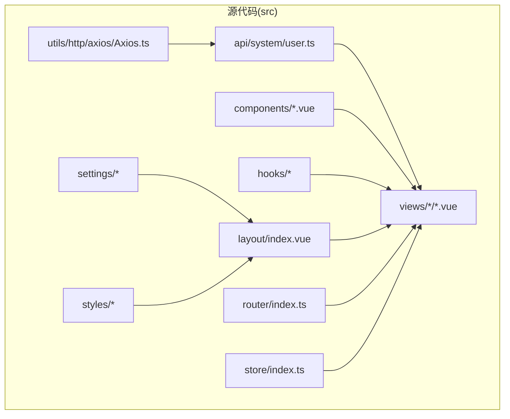
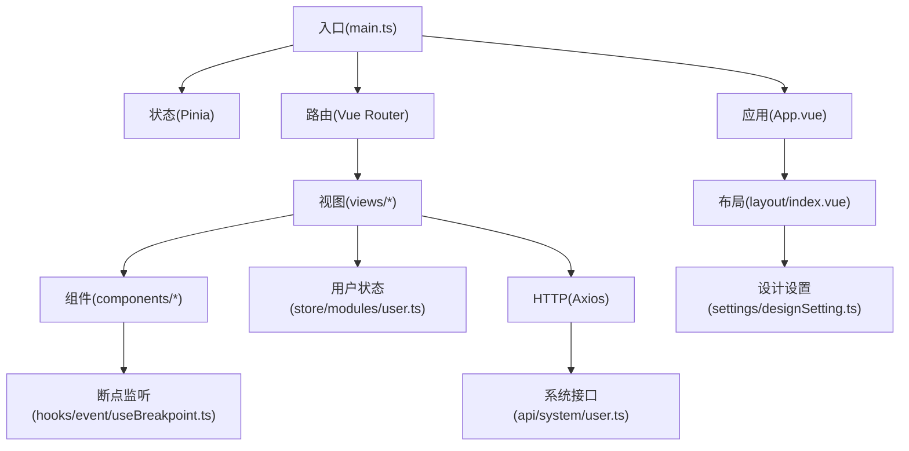
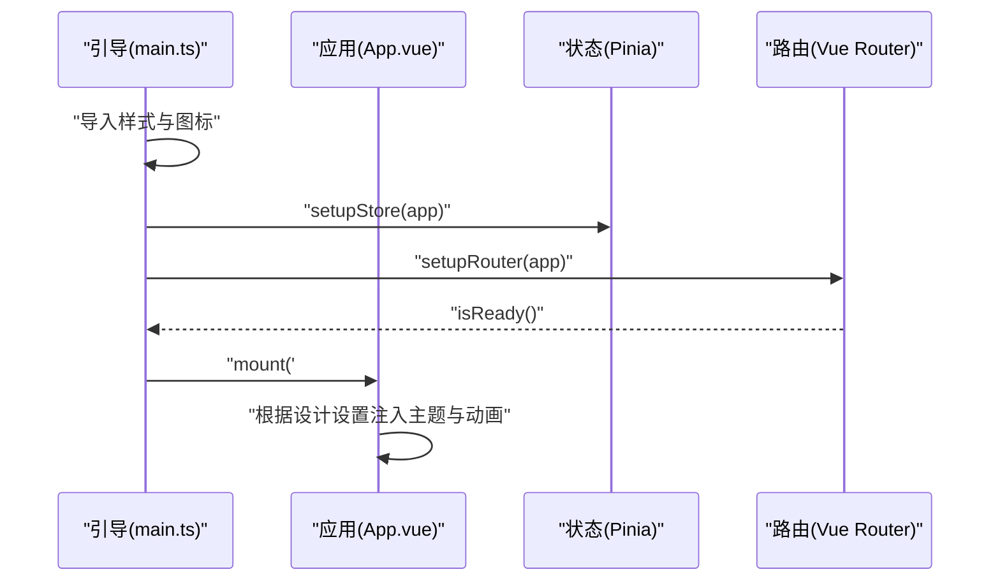
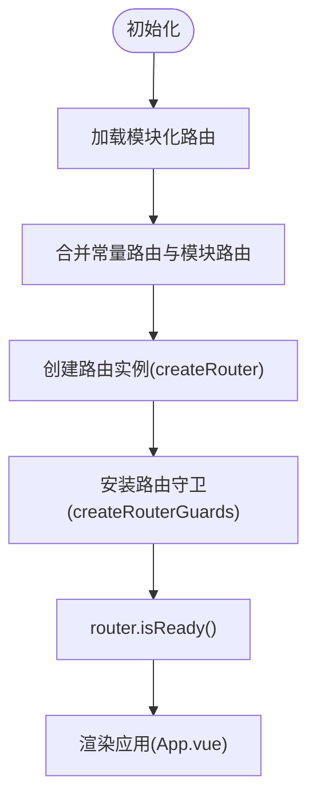
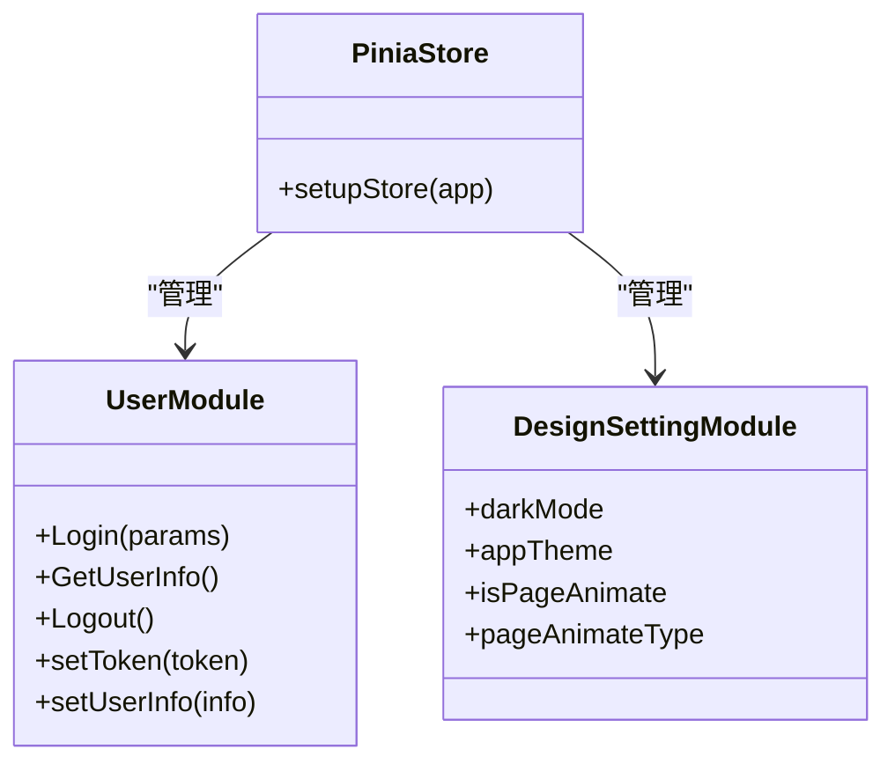
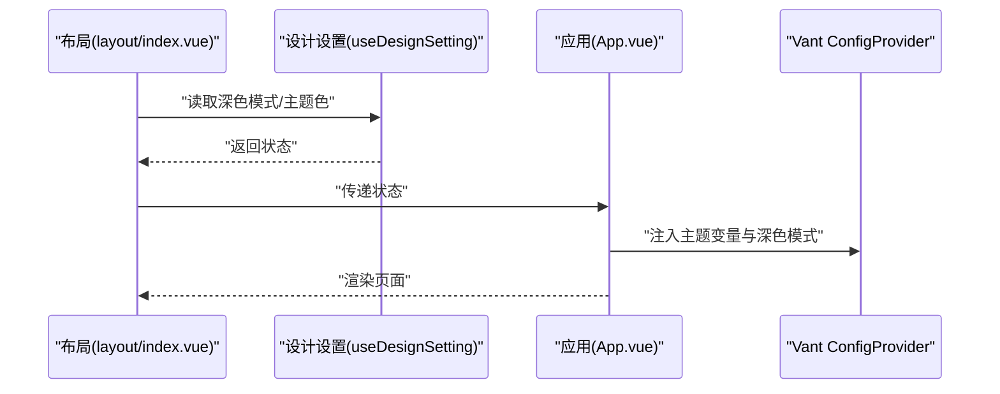
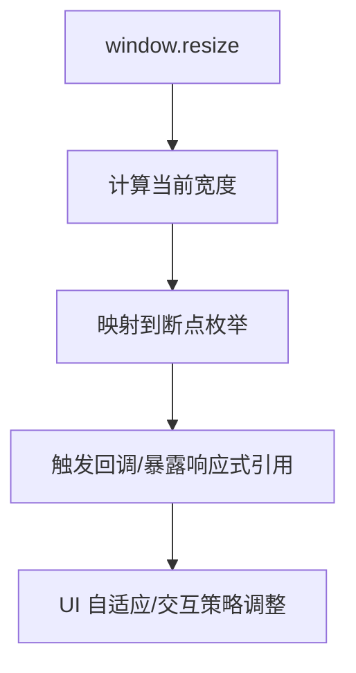
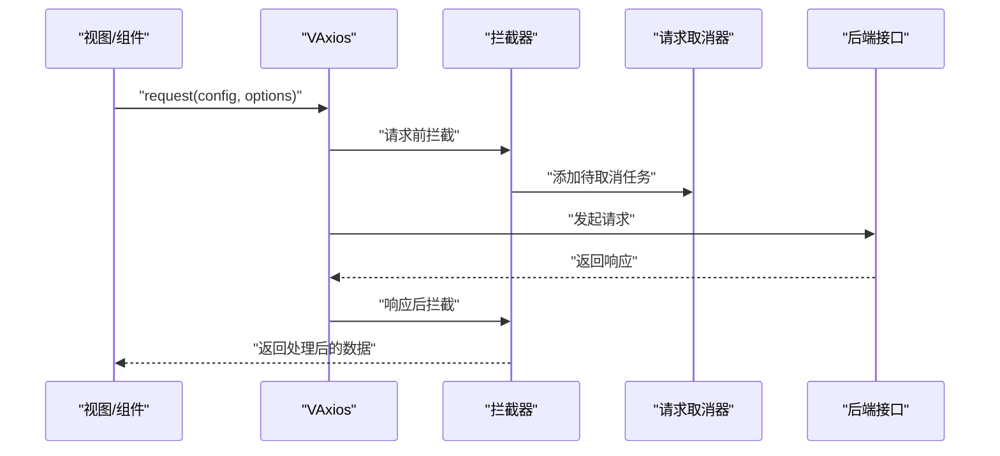
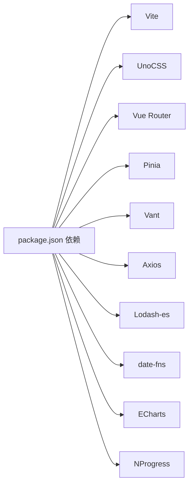

# 架构设计

<cite>
**本文引用的文件**
- [package.json](file://package.json)
- [vite.config.ts](file://vite.config.ts)
- [uno.config.ts](file://uno.config.ts)
- [src/main.ts](file://src/main.ts)
- [src/App.vue](file://src/App.vue)
- [src/router/index.ts](file://src/router/index.ts)
- [src/store/index.ts](file://src/store/index.ts)
- [src/settings/designSetting.ts](file://src/settings/designSetting.ts)
- [src/hooks/setting/useDesignSetting.ts](file://src/hooks/setting/useDesignSetting.ts)
- [src/layout/index.vue](file://src/layout/index.vue)
- [src/store/modules/user.ts](file://src/store/modules/user.ts)
- [src/hooks/event/useBreakpoint.ts](file://src/hooks/event/useBreakpoint.ts)
- [src/enums/breakpointEnum.ts](file://src/enums/breakpointEnum.ts)
- [src/utils/http/axios/Axios.ts](file://src/utils/http/axios/Axios.ts)
- [README.md](file://README.md)
</cite>

## 目录
1. [引言](#引言)
2. [项目结构](#项目结构)
3. [核心组件](#核心组件)
4. [架构总览](#架构总览)
5. [详细组件分析](#详细组件分析)
6. [依赖分析](#依赖分析)
7. [性能考量](#性能考量)
8. [故障排查指南](#故障排查指南)
9. [结论](#结论)
10. [附录](#附录)

## 引言
本项目为基于 Vue3 的微信 H5 移动端应用，采用 MVVM 架构理念，结合 Composition API、Pinia 状态管理、Vue Router 路由体系与 Vant4 UI 组件库，辅以 UnoCSS 原子化 CSS 策略与 Vite 构建工具链，形成一套现代化、可扩展、易维护的移动端前端架构。项目强调组件化设计与模块化组织，通过统一的主题与暗黑模式、路由动画、KeepAlive 缓存、响应式断点监听与网络请求拦截等能力，支撑从登录到业务页面的完整用户体验。

## 项目结构
项目采用“按功能域与层次”相结合的目录组织方式：
- src/api/system：系统级接口封装，按模块划分（如用户）
- src/assets/icons：图标资源与异常图标
- src/components：通用业务无关的可复用组件（如 Logo、SvgIcon）
- src/enums：断点、缓存、HTTP 状态等枚举常量
- src/hooks：自定义组合式逻辑（事件、核心、web、设置、DOM 等）
- src/layout：布局壳层与浮动导航栏组件
- src/router：路由定义、模块化路由、路由守卫
- src/settings：设计与组件设置（主题、动画、组件默认行为）
- src/store：Pinia 状态管理（modules 子模块、mutation-types）
- src/styles：过渡动画、公共样式、UI 主题变量与 Vant 样式覆盖
- src/utils：HTTP（Axios）、工具函数（日期、DOM、环境、日志、URL、类型判断、存储、图表库封装）
- src/views：页面级视图（仪表盘、示例、异常、登录、消息、我的、底部标签栏）

**章节来源**
- [README.md: 21-27:21-27](file://README.md#L21-L27)
- [package.json: 41-56:41-56](file://package.json#L41-L56)

## 核心组件
- 应用引导与挂载：在入口文件中初始化 UnoCSS、Vant 样式、SVG 图标精灵，随后创建应用实例并挂载 Pinia 与路由，最后渲染根组件。
- 根组件与主题适配：根组件通过 Vant 的 ConfigProvider 注入全局主题变量与深色模式，结合过渡动画与 KeepAlive 实现页面切换体验。
- 路由系统：采用 hash 模式，常量路由与模块化路由合并，统一注入路由守卫，支持滚动行为与严格模式。
- 状态管理：Pinia 创建全局 Store，启用持久化插件，按领域拆分子模块（设计设置、路由、用户）。
- 设计设置：集中管理深色/浅色模式、主题色、路由动画开关与类型；提供组合式 Hook 供组件读取。
- 响应式断点：监听窗口尺寸变化，映射到不同断点枚举，便于 UI 自适应与交互策略调整。
- HTTP 封装：基于 Axios 的 VAxios 类，支持拦截器、取消重复请求、表单数据转换、上传文件与统一数据转换钩子。

**章节来源**
- [src/main.ts: 1-30:1-30](file://src/main.ts#L1-L30)
- [src/App.vue: 1-78:1-78](file://src/App.vue#L1-L78)
- [src/router/index.ts: 1-33:1-33](file://src/router/index.ts#L1-L33)
- [src/store/index.ts: 1-13:1-13](file://src/store/index.ts#L1-L13)
- [src/settings/designSetting.ts: 1-52:1-52](file://src/settings/designSetting.ts#L1-L52)
- [src/hooks/setting/useDesignSetting.ts: 1-25:1-25](file://src/hooks/setting/useDesignSetting.ts#L1-L25)
- [src/hooks/event/useBreakpoint.ts: 1-96:1-96](file://src/hooks/event/useBreakpoint.ts#L1-L96)
- [src/utils/http/axios/Axios.ts: 1-225:1-225](file://src/utils/http/axios/Axios.ts#L1-L225)

## 架构总览
系统采用“入口引导 -> 路由 -> 视图 -> 组件 -> 状态/工具”的数据与控制流：
- 入口引导负责全局样式与插件初始化
- 路由负责页面导航与守卫
- 视图与布局负责页面结构与交互
- 组件负责可复用 UI 与业务逻辑
- 状态与工具提供跨组件共享的数据与基础设施

**图表来源**
- [src/main.ts: 18-30:18-30](file://src/main.ts#L18-L30)
- [src/App.vue: 15-73:15-73](file://src/App.vue#L15-L73)
- [src/router/index.ts: 19-33:19-33](file://src/router/index.ts#L19-L33)
- [src/layout/index.vue: 1-60:1-60](file://src/layout/index.vue#L1-L60)
- [src/store/modules/user.ts: 1-115:1-115](file://src/store/modules/user.ts#L1-L115)
- [src/hooks/event/useBreakpoint.ts: 19-96:19-96](file://src/hooks/event/useBreakpoint.ts#L19-L96)
- [src/utils/http/axios/Axios.ts: 18-225:18-225](file://src/utils/http/axios/Axios.ts#L18-L225)

## 详细组件分析

### 组件：入口与应用壳
- 入口职责：引入 UnoCSS 重置与 Vant 样式、注册 SVG 图标精灵；创建应用实例；挂载 Store 与 Router；等待路由就绪后挂载应用。
- 应用壳职责：通过 Vant ConfigProvider 注入主题变量与深色模式；包裹 RouterView，支持过渡动画与 KeepAlive；按设计设置决定动画类型与主题色。

**图表来源**
- [src/main.ts: 18-30:18-30](file://src/main.ts#L18-L30)
- [src/App.vue: 15-73:15-73](file://src/App.vue#L15-L73)

**章节来源**
- [src/main.ts: 1-30:1-30](file://src/main.ts#L1-L30)
- [src/App.vue: 1-78:1-78](file://src/App.vue#L1-L78)

### 组件：路由系统
- 路由模式：hash 模式，便于 H5 微信环境部署
- 路由结构：常量路由（登录、根路由、错误页）与模块化路由合并，统一注入守卫
- 行为特性：严格模式、滚动回到顶部、运行时菜单与路由注入

**图表来源**
- [src/router/index.ts: 11-33:11-33](file://src/router/index.ts#L11-L33)

**章节来源**
- [src/router/index.ts: 1-33:1-33](file://src/router/index.ts#L1-L33)

### 组件：状态管理（Pinia）
- Store 初始化：创建 Pinia 实例并启用持久化插件
- 用户模块：登录、登出、获取用户信息、Token 与用户信息持久化
- 设计设置模块：深色模式、主题色、路由动画开关与类型

**图表来源**
- [src/store/index.ts: 1-13:1-13](file://src/store/index.ts#L1-L13)
- [src/store/modules/user.ts: 36-115:36-115](file://src/store/modules/user.ts#L36-L115)
- [src/settings/designSetting.ts: 3-52:3-52](file://src/settings/designSetting.ts#L3-L52)

**章节来源**
- [src/store/index.ts: 1-13:1-13](file://src/store/index.ts#L1-L13)
- [src/store/modules/user.ts: 1-115:1-115](file://src/store/modules/user.ts#L1-L115)
- [src/settings/designSetting.ts: 1-52:1-52](file://src/settings/designSetting.ts#L1-L52)
- [src/hooks/setting/useDesignSetting.ts: 1-25:1-25](file://src/hooks/setting/useDesignSetting.ts#L1-L25)

### 组件：布局与主题
- 布局壳：提供容器结构、KeepAlive 缓存、TabBar 浮动导航
- 主题注入：根据设计设置动态生成 Vant 主题变量，支持深色模式与页面动画

**图表来源**
- [src/layout/index.vue: 32-60:32-60](file://src/layout/index.vue#L32-L60)
- [src/hooks/setting/useDesignSetting.ts: 4-24:4-24](file://src/hooks/setting/useDesignSetting.ts#L4-L24)
- [src/App.vue: 20-72:20-72](file://src/App.vue#L20-L72)

**章节来源**
- [src/layout/index.vue: 1-60:1-60](file://src/layout/index.vue#L1-L60)
- [src/App.vue: 1-78:1-78](file://src/App.vue#L1-L78)
- [src/hooks/setting/useDesignSetting.ts: 1-25:1-25](file://src/hooks/setting/useDesignSetting.ts#L1-L25)

### 组件：响应式断点与移动端适配
- 断点监听：监听窗口 resize，映射到 XS/SM/MD/LG/XL/XXL，提供屏幕宽度与真实宽度
- 移动端适配：UnoCSS 将 rem 转 px，再由 PostCSS 插件转换为 vw/vh，实现移动端 1px 精准适配

**图表来源**
- [src/hooks/event/useBreakpoint.ts: 29-96:29-96](file://src/hooks/event/useBreakpoint.ts#L29-L96)
- [src/enums/breakpointEnum.ts: 1-29:1-29](file://src/enums/breakpointEnum.ts#L1-L29)

**章节来源**
- [src/hooks/event/useBreakpoint.ts: 1-96:1-96](file://src/hooks/event/useBreakpoint.ts#L1-L96)
- [src/enums/breakpointEnum.ts: 1-29:1-29](file://src/enums/breakpointEnum.ts#L1-L29)
- [uno.config.ts: 19-25:19-25](file://uno.config.ts#L19-L25)
- [vite.config.ts: 134-154:134-154](file://vite.config.ts#L134-L154)

### 组件：HTTP 封装（VAxios）
- 功能要点：拦截器链、重复请求取消、表单数据转换、上传文件、统一请求/响应钩子
- 集成策略：与路由守卫、用户模块配合，实现鉴权与错误处理

**图表来源**
- [src/utils/http/axios/Axios.ts: 55-100:55-100](file://src/utils/http/axios/Axios.ts#L55-L100)
- [src/utils/http/axios/Axios.ts: 175-224:175-224](file://src/utils/http/axios/Axios.ts#L175-L224)

**章节来源**
- [src/utils/http/axios/Axios.ts: 1-225:1-225](file://src/utils/http/axios/Axios.ts#L1-L225)

## 依赖分析
- 构建与工具链：Vite 作为开发与构建工具，配合插件生态（Mock、SVG Icons、自动导入、可视化等）
- 样式与主题：UnoCSS 原子化 CSS，结合 PostCSS 插件实现移动端 px/vw 适配；Less 注入全局变量
- 状态与路由：Pinia + Vue Router，路由守卫与模块化路由
- UI 组件：Vant4，提供移动端常用组件与主题变量注入
- 工具库：Axios、Lodash-es、date-fns、ECharts、NProgress 等

**图表来源**
- [package.json: 41-56:41-56](file://package.json#L41-L56)
- [package.json: 57-104:57-104](file://package.json#L57-L104)

**章节来源**
- [package.json: 1-118:1-118](file://package.json#L1-L118)
- [vite.config.ts: 1-183:1-183](file://vite.config.ts#L1-L183)
- [uno.config.ts: 1-84:1-84](file://uno.config.ts#L1-L84)

## 性能考量
- 构建优化：ES2015 目标、按需移除 console、手动分包拆分 node_modules、预热关键文件
- 依赖预构建：Pinia、Lodash-es、Axios 预构建缓存，减少首屏等待
- 运行时优化：KeepAlive 缓存页面、路由动画按需开启、断点监听节流策略
- 样式体积：UnoCSS 原子化按需生成，结合 safelist 保障动态类名稳定产出

**章节来源**
- [vite.config.ts: 72-122:72-122](file://vite.config.ts#L72-L122)
- [vite.config.ts: 156-177:156-177](file://vite.config.ts#L156-L177)
- [uno.config.ts: 77-83:77-83](file://uno.config.ts#L77-L83)
- [src/App.vue: 6-12:6-12](file://src/App.vue#L6-L12)
- [src/layout/index.vue: 8-13:8-13](file://src/layout/index.vue#L8-L13)

## 故障排查指南
- 登录/登出流程：用户模块提供登录、获取用户信息与登出逻辑，登出后清理 Token 与用户信息并跳转登录页
- 路由守卫：路由初始化时安装守卫，确保页面导航安全与权限控制
- HTTP 错误：Axios 封装提供请求/响应拦截与错误捕获钩子，便于统一处理
- 断点异常：断点监听依赖 window.resize，若 UI 未响应，检查监听是否正确初始化与回调是否触发

**章节来源**
- [src/store/modules/user.ts: 64-107:64-107](file://src/store/modules/user.ts#L64-L107)
- [src/router/index.ts: 26-30:26-30](file://src/router/index.ts#L26-L30)
- [src/utils/http/axios/Axios.ts: 175-224:175-224](file://src/utils/http/axios/Axios.ts#L175-L224)
- [src/hooks/event/useBreakpoint.ts: 29-96:29-96](file://src/hooks/event/useBreakpoint.ts#L29-L96)

## 结论
本项目以 Vue3 Composition API 为核心，结合 Pinia、Vue Router、Vant4 与 UnoCSS，构建了面向微信 H5 的移动端前端架构。通过模块化组织、统一的设计设置与主题注入、路由守卫与 KeepAlive 缓存、响应式断点监听与 HTTP 封装，实现了高可维护性与良好的用户体验。Vite 与 UnoCSS 的选型进一步提升了开发效率与构建性能，适合在中小型至中大型移动端项目中推广使用。

## 附录
- 关键技术选型说明
  - Vite：快速冷启动、热更新与现代化构建链
  - UnoCSS：原子化 CSS，按需生成，体积小、维护成本低
  - Vant4：移动端组件库，提供完善的 UI 与主题变量注入
  - Pinia：轻量、类型友好、组合式 API 支持
  - Vue Router：模块化路由与路由守卫，适合多页面应用
  - Axios：可扩展的请求/响应拦截与重复请求取消
- 移动端适配策略
  - UnoCSS rem->px->vw/vh 转换链
  - 断点监听与 UI 自适应
  - KeepAlive 与路由动画平衡性能与体验

**章节来源**
- [README.md: 74-87:74-87](file://README.md#L74-L87)
- [uno.config.ts: 19-25:19-25](file://uno.config.ts#L19-L25)
- [vite.config.ts: 134-154:134-154](file://vite.config.ts#L134-L154)