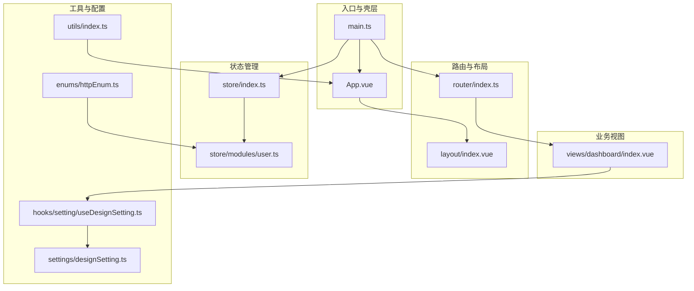
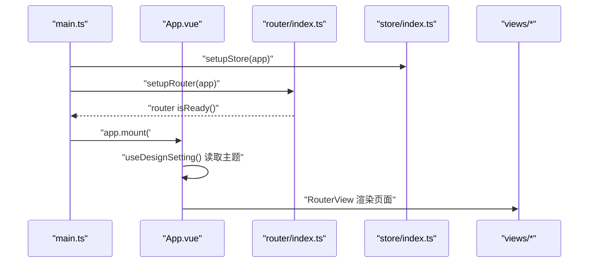
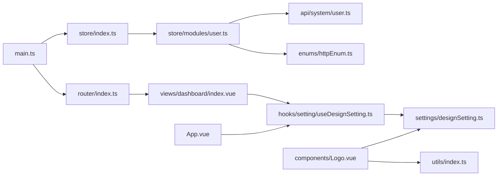
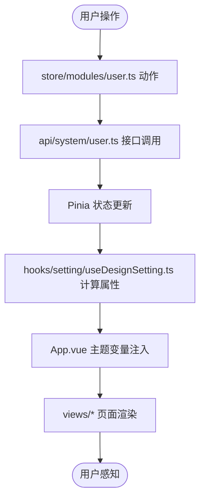
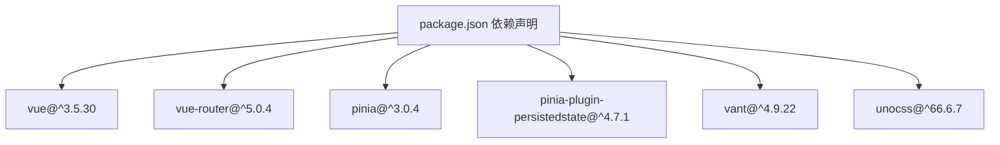

# 目录结构设计

<cite>
**本文档引用的文件**
- [main.ts](file://src/main.ts)
- [App.vue](file://src/App.vue)
- [index.ts](file://src/router/index.ts)
- [index.ts](file://src/store/index.ts)
- [designSetting.ts](file://src/settings/designSetting.ts)
- [index.ts](file://src/hooks/index.ts)
- [index.ts](file://src/utils/index.ts)
- [httpEnum.ts](file://src/enums/httpEnum.ts)
- [Logo.vue](file://src/components/Logo.vue)
- [index.vue](file://src/layout/index.vue)
- [user.ts](file://src/store/modules/user.ts)
- [user.ts](file://src/api/system/user.ts)
- [index.vue](file://src/views/dashboard/index.vue)
- [useDesignSetting.ts](file://src/hooks/setting/useDesignSetting.ts)
- [package.json](file://package.json)
</cite>

## 目录索引
1. [简介](#简介)
2. [项目结构](#项目结构)
3. [核心组件](#核心组件)
4. [架构总览](#架构总览)
5. [详细组件分析](#详细组件分析)
6. [依赖分析](#依赖分析)
7. [性能考虑](#性能考虑)
8. [故障排查指南](#故障排查指南)
9. [结论](#结论)
10. [附录](#附录)

## 简介
本设计文档面向Vue3微信H5移动端项目，系统化阐述src目录的模块化组织原则与设计意图，涵盖api、components、hooks、layout、router、settings、store、styles、utils、views等子目录的职责划分；解释各目录的命名规范与文件组织方式；梳理模块间依赖关系与导入路径策略；提供目录结构图与模块依赖图；最后给出可扩展性设计建议与重构策略。

## 项目结构
src目录采用“按职责分层 + 功能域聚合”的混合组织方式：
- 入口与应用壳：main.ts负责应用初始化，App.vue作为根组件承载全局主题与过渡动画。
- 路由与布局：router集中管理路由注册与守卫，layout提供页面外壳与底部导航。
- 状态管理：store通过模块化拆分用户、路由、设计设置等状态域。
- 业务视图：views按页面功能域组织，如仪表盘、示例、消息、我的等。
- 工具与枚举：utils提供通用工具函数，enums统一HTTP相关常量。
- 组件与样式：components提供可复用UI组件，styles提供主题与过渡样式。
- 设置与钩子：settings存放设计配置，hooks封装组合式逻辑。

**图表来源**
- [main.ts:18-29](file://src/main.ts#L18-L29)
- [App.vue:1-78](file://src/App.vue#L1-L78)
- [index.ts:1-33](file://src/router/index.ts#L1-L33)
- [index.vue:1-60](file://src/layout/index.vue#L1-L60)
- [index.ts:1-13](file://src/store/index.ts#L1-L13)
- [user.ts:1-115](file://src/store/modules/user.ts#L1-115)
- [index.vue:1-131](file://src/views/dashboard/index.vue#L1-131)
- [index.ts:1-100](file://src/utils/index.ts#L1-100)
- [httpEnum.ts:1-36](file://src/enums/httpEnum.ts#L1-36)
- [useDesignSetting.ts:1-25](file://src/hooks/setting/useDesignSetting.ts#L1-25)
- [designSetting.ts:1-52](file://src/settings/designSetting.ts#L1-52)

**章节来源**
- [main.ts:1-30](file://src/main.ts#L1-L30)
- [index.ts:1-33](file://src/router/index.ts#L1-L33)
- [index.ts:1-13](file://src/store/index.ts#L1-L13)
- [index.vue:1-60](file://src/layout/index.vue#L1-L60)
- [index.ts:1-100](file://src/utils/index.ts#L1-100)
- [httpEnum.ts:1-36](file://src/enums/httpEnum.ts#L1-36)
- [designSetting.ts:1-52](file://src/settings/designSetting.ts#L1-52)

## 核心组件
- 应用入口与初始化
  - main.ts负责引入样式、图标、创建应用实例，并挂载Pinia与Vue Router；随后等待路由就绪再挂载应用。
- 根组件与主题系统
  - App.vue通过Vant ConfigProvider注入主题变量，结合设计设置钩子动态生成主题色系；使用KeepAlive与过渡动画提升用户体验。
- 路由与守卫
  - router/index.ts集中注册常量路由与模块化路由，创建路由守卫并导出setupRouter用于应用挂载。
- 状态管理
  - store/index.ts创建Pinia实例并启用持久化插件；store/modules/user.ts定义用户域状态、动作与持久化存储。
- 设计设置
  - settings/designSetting.ts定义主题与动画配置接口与默认值；hooks/setting/useDesignSetting.ts提供计算属性访问器。
- 通用工具
  - utils/index.ts提供深拷贝、颜色处理、URL判断、数组转换等工具函数；enums/httpEnum.ts统一HTTP相关枚举。
- 可复用组件
  - components/Logo.vue根据当前主题动态渲染SVG图标，体现主题联动。

**章节来源**
- [main.ts:1-30](file://src/main.ts#L1-L30)
- [App.vue:1-78](file://src/App.vue#L1-L78)
- [index.ts:1-33](file://src/router/index.ts#L1-L33)
- [index.ts:1-13](file://src/store/index.ts#L1-L13)
- [user.ts:1-115](file://src/store/modules/user.ts#L1-115)
- [designSetting.ts:1-52](file://src/settings/designSetting.ts#L1-52)
- [useDesignSetting.ts:1-25](file://src/hooks/setting/useDesignSetting.ts#L1-25)
- [index.ts:1-100](file://src/utils/index.ts#L1-100)
- [httpEnum.ts:1-36](file://src/enums/httpEnum.ts#L1-36)
- [Logo.vue:1-52](file://src/components/Logo.vue#L1-52)

## 架构总览
整体采用“入口引导 -> 路由驱动 -> 视图渲染 -> 状态管理 -> 主题系统”的数据流。应用启动时先完成状态与路由的初始化，然后在根组件中通过设计设置钩子读取主题配置，最终渲染到具体页面。

**图表来源**
- [main.ts:18-29](file://src/main.ts#L18-L29)
- [index.ts:26-30](file://src/router/index.ts#L26-L30)
- [index.ts:8-10](file://src/store/index.ts#L8-L10)
- [App.vue:15-72](file://src/App.vue#L15-L72)

## 详细组件分析

### 目录职责与命名规范
- api
  - 职责：封装HTTP请求接口，按系统模块划分（如system/user.ts），统一响应模型与调用方式。
  - 命名：接口文件以领域命名，导出函数语义明确（如login、getUserInfo）。
- components
  - 职责：提供可复用UI组件（如Logo.vue、SvgIcon.vue），遵循单一职责与可组合性。
  - 命名：组件文件采用帕斯卡命名法，便于在模板中直接引用。
- hooks
  - 职责：封装组合式逻辑（如useDesignSetting、useAsync），对外暴露计算属性与方法。
  - 命名：文件以use前缀命名，导出函数名与文件名一致。
- layout
  - 职责：提供页面外壳与导航容器（如FloatingNavBar），统一页面骨架。
  - 命名：主文件index.vue作为布局容器，子组件按功能拆分。
- router
  - 职责：集中注册常量路由与模块化路由，创建路由守卫。
  - 命名：index.ts负责导出setupRouter；modules.ts组织模块路由；router-guards.ts实现守卫。
- settings
  - 职责：存放设计配置（如主题、动画），定义接口与默认值。
  - 命名：文件以功能命名（如designSetting.ts），导出默认配置对象。
- store
  - 职责：状态管理，按模块拆分（如user、route、designSetting），支持持久化。
  - 命名：模块文件以小驼峰命名，导出defineStore的命名遵循语义化。
- styles
  - 职责：提供主题变量、过渡动画与公共样式。
  - 命名：文件以功能或组件命名（如transition/*、common.less），统一入口合并。
- utils
  - 职责：通用工具函数集合，按功能域细分（如http/axios、is、lib）。
  - 命名：功能目录内以index.ts聚合导出，工具函数语义清晰。
- views
  - 职责：页面级视图，按功能域组织（如dashboard、example、message、my）。
  - 命名：页面文件以index.vue为主，子组件按页面拆分子目录。

**章节来源**
- [user.ts:1-60](file://src/api/system/user.ts#L1-60)
- [Logo.vue:1-52](file://src/components/Logo.vue#L1-52)
- [useDesignSetting.ts:1-25](file://src/hooks/setting/useDesignSetting.ts#L1-25)
- [index.vue:1-60](file://src/layout/index.vue#L1-60)
- [index.ts:1-33](file://src/router/index.ts#L1-L33)
- [designSetting.ts:1-52](file://src/settings/designSetting.ts#L1-52)
- [index.ts:1-13](file://src/store/index.ts#L1-L13)
- [user.ts:1-115](file://src/store/modules/user.ts#L1-115)
- [index.ts:1-100](file://src/utils/index.ts#L1-100)
- [index.vue:1-131](file://src/views/dashboard/index.vue#L1-131)

### 模块间依赖关系与导入路径策略
- 入口层
  - main.ts依赖router与store的setup函数，确保应用启动顺序正确。
- 路由层
  - router/index.ts依赖modules路由表与基础路由常量，导出setupRouter供入口调用。
- 状态层
  - store/index.ts创建Pinia并启用持久化；store/modules/user.ts依赖api/system/user.ts与enums/httpEnum.ts。
- 视图层
  - views/dashboard/index.vue依赖hooks/setting/useDesignSetting.ts与store/modules/designSetting.ts。
- 组件层
  - components/Logo.vue依赖store/modules/designSetting.ts与utils/index.ts的颜色处理函数。
- 工具层
  - utils/index.ts被App.vue与components/Logo.vue广泛使用；enums/httpEnum.ts被store/modules/user.ts引用。

**图表来源**
- [main.ts:15-26](file://src/main.ts#L15-L26)
- [index.ts:1-33](file://src/router/index.ts#L1-L33)
- [index.ts:1-13](file://src/store/index.ts#L1-L13)
- [user.ts:1-115](file://src/store/modules/user.ts#L1-115)
- [user.ts:1-60](file://src/api/system/user.ts#L1-60)
- [httpEnum.ts:1-36](file://src/enums/httpEnum.ts#L1-36)
- [index.vue:1-131](file://src/views/dashboard/index.vue#L1-131)
- [useDesignSetting.ts:1-25](file://src/hooks/setting/useDesignSetting.ts#L1-25)
- [designSetting.ts:1-52](file://src/settings/designSetting.ts#L1-52)
- [App.vue:1-78](file://src/App.vue#L1-L78)
- [Logo.vue:1-52](file://src/components/Logo.vue#L1-52)
- [index.ts:1-100](file://src/utils/index.ts#L1-100)

**章节来源**
- [main.ts:1-30](file://src/main.ts#L1-L30)
- [index.ts:1-33](file://src/router/index.ts#L1-L33)
- [index.ts:1-13](file://src/store/index.ts#L1-L13)
- [user.ts:1-115](file://src/store/modules/user.ts#L1-115)
- [user.ts:1-60](file://src/api/system/user.ts#L1-60)
- [httpEnum.ts:1-36](file://src/enums/httpEnum.ts#L1-36)
- [index.vue:1-131](file://src/views/dashboard/index.vue#L1-131)
- [useDesignSetting.ts:1-25](file://src/hooks/setting/useDesignSetting.ts#L1-25)
- [designSetting.ts:1-52](file://src/settings/designSetting.ts#L1-52)
- [App.vue:1-78](file://src/App.vue#L1-L78)
- [Logo.vue:1-52](file://src/components/Logo.vue#L1-52)
- [index.ts:1-100](file://src/utils/index.ts#L1-100)

### 文件命名约定
- 组件文件：采用帕斯卡命名法（如Logo.vue、Login.vue），便于在模板中直接使用。
- 工具函数：采用动词短语或语义化名称（如deepMerge、darken、lighten），避免缩写。
- 枚举类型：采用名词短语（如ResultEnum、RequestEnum、ContentTypeEnum），统一HTTP相关常量。
- 类型定义：采用名词短语（如IUserState、LoginParams），与接口保持一致。
- 组合式函数：以use前缀命名（如useDesignSetting、useAsync），导出函数名与文件名一致。
- 页面视图：以功能域命名（如dashboard/index.vue），子组件按页面拆分。

**章节来源**
- [httpEnum.ts:1-36](file://src/enums/httpEnum.ts#L1-36)
- [index.ts:1-100](file://src/utils/index.ts#L1-100)
- [useDesignSetting.ts:1-25](file://src/hooks/setting/useDesignSetting.ts#L1-25)
- [index.vue:1-131](file://src/views/dashboard/index.vue#L1-131)

### 数据流向与组件层次
- 数据从store/modules/user.ts流向视图层，视图通过hooks/setting/useDesignSetting.ts读取设计设置，最终在App.vue中应用到主题变量。
- 路由层通过router/index.ts统一注册，视图层通过RouterView进行渲染，配合KeepAlive与过渡动画提升性能与体验。

**图表来源**
- [user.ts:53-108](file://src/store/modules/user.ts#L53-108)
- [user.ts:12-43](file://src/api/system/user.ts#L12-43)
- [useDesignSetting.ts:4-24](file://src/hooks/setting/useDesignSetting.ts#L4-24)
- [App.vue:26-72](file://src/App.vue#L26-L72)
- [index.vue:1-131](file://src/views/dashboard/index.vue#L1-131)

**章节来源**
- [user.ts:1-115](file://src/store/modules/user.ts#L1-115)
- [user.ts:1-60](file://src/api/system/user.ts#L1-60)
- [useDesignSetting.ts:1-25](file://src/hooks/setting/useDesignSetting.ts#L1-25)
- [App.vue:1-78](file://src/App.vue#L1-L78)
- [index.vue:1-131](file://src/views/dashboard/index.vue#L1-131)

## 依赖分析
- 外部依赖
  - Vue3、Vue Router、Pinia、Vant4、UnoCSS、ESLint、Vite等，详见package.json。
- 内部依赖
  - main.ts依赖router与store的setup函数；store/modules/user.ts依赖api/system/user.ts与enums/httpEnum.ts；views依赖hooks与store；components依赖store与utils。

**图表来源**
- [package.json:41-104](file://package.json#L41-L104)

**章节来源**
- [package.json:1-118](file://package.json#L1-L118)

## 性能考虑
- KeepAlive与路由缓存：App.vue与layout/index.vue均使用KeepAlive缓存组件，减少重复渲染成本。
- 主题变量预计算：App.vue在运行时计算主题变量，避免重复计算与样式抖动。
- 持久化状态：store/index.ts启用pinia-plugin-persistedstate，减少刷新后的状态重建开销。
- 图标与样式：main.ts统一引入UnoCSS重置与Vant样式，避免重复加载与样式冲突。

**章节来源**
- [App.vue:1-78](file://src/App.vue#L1-L78)
- [index.vue:1-60](file://src/layout/index.vue#L1-L60)
- [index.ts:1-13](file://src/store/index.ts#L1-L13)

## 故障排查指南
- 路由未生效
  - 检查router/index.ts中的constantRouter与modules拼接是否正确，确认setupRouter已在main.ts中调用。
- 登录状态异常
  - 检查store/modules/user.ts中的token与userInfo持久化逻辑，确认Storage键值与api/system/user.ts接口返回一致。
- 主题不生效
  - 检查hooks/setting/useDesignSetting.ts返回的计算属性是否正确，确认App.vue中vanConfigProvider的主题变量注入。
- HTTP请求错误
  - 检查enums/httpEnum.ts中的枚举值与api/system/user.ts中的请求参数，确认响应结构与错误处理分支。

**章节来源**
- [index.ts:1-33](file://src/router/index.ts#L1-L33)
- [main.ts:15-26](file://src/main.ts#L15-L26)
- [user.ts:1-115](file://src/store/modules/user.ts#L1-115)
- [useDesignSetting.ts:1-25](file://src/hooks/setting/useDesignSetting.ts#L1-25)
- [App.vue:1-78](file://src/App.vue#L1-L78)
- [httpEnum.ts:1-36](file://src/enums/httpEnum.ts#L1-36)
- [user.ts:1-60](file://src/api/system/user.ts#L1-60)

## 结论
该目录结构通过“职责分层 + 功能域聚合”的方式实现了高内聚、低耦合的模块化组织。入口层、路由层、状态层、视图层与工具层边界清晰，导入路径策略统一，便于扩展与维护。建议在新增功能时遵循现有命名与组织规范，优先拆分store模块与views页面，保持hooks与utils的纯函数特性，确保主题与样式体系的一致性。

## 附录
- 新增功能模块添加步骤
  - 在store中新增模块文件并注册到Pinia；在api中新增对应接口文件；在views中新增页面视图；在hooks中新增组合式逻辑；在components中新增可复用组件；在utils中补充必要工具函数；在router中注册路由。
- 现有模块重构策略
  - 将重复逻辑抽取至utils或hooks；拆分过大的store模块为更细粒度的功能域；优化视图组件的props与事件，增强可测试性；统一枚举与类型定义，减少隐式依赖。