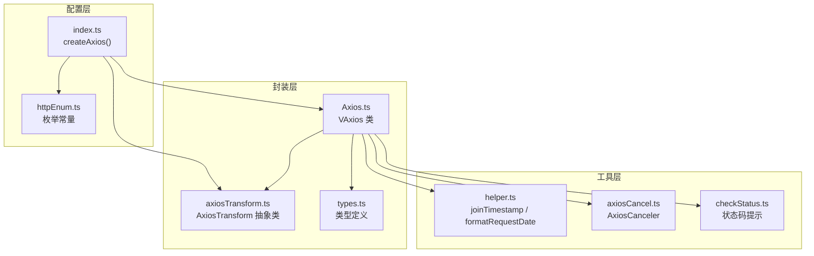
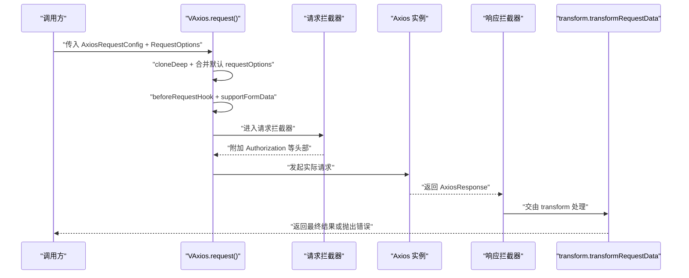
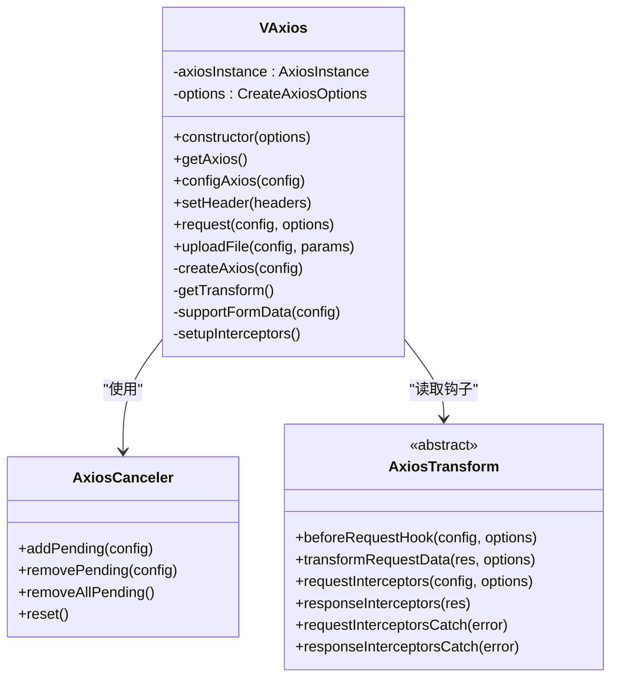
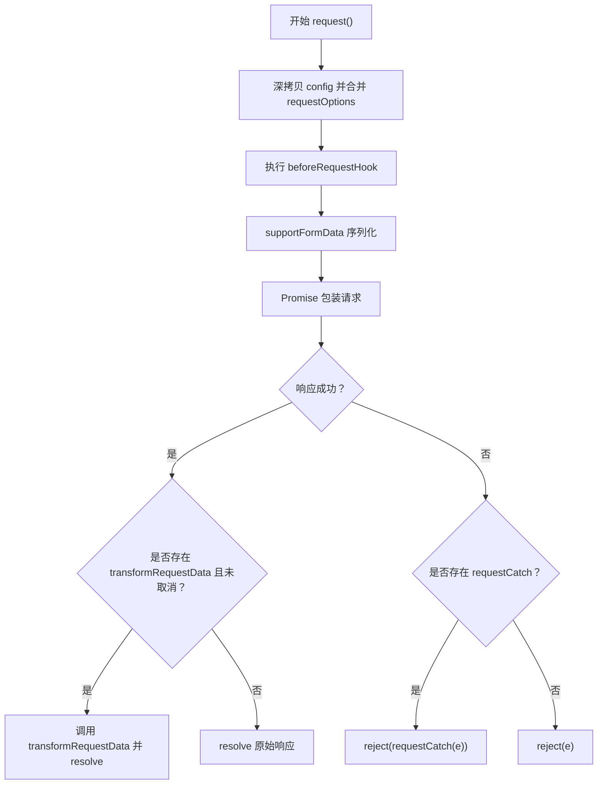
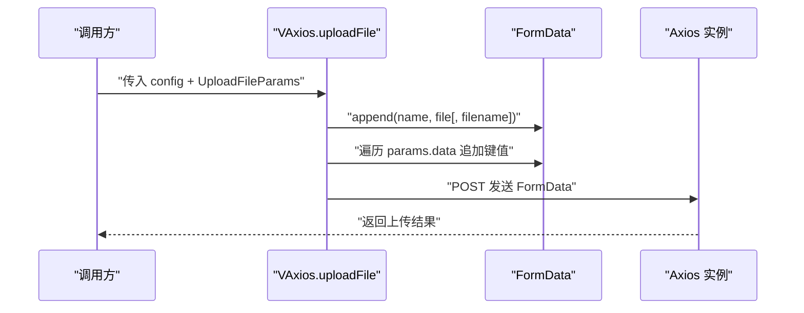
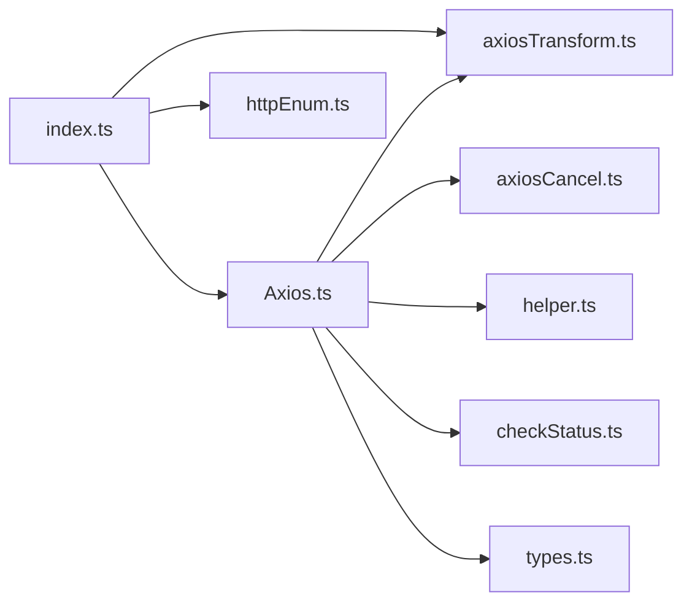

# Axios实例封装

<cite>
**本文引用的文件**
- [Axios.ts](file://src/utils/http/axios/Axios.ts)
- [index.ts](file://src/utils/http/axios/index.ts)
- [types.ts](file://src/utils/http/axios/types.ts)
- [axiosTransform.ts](file://src/utils/http/axios/axiosTransform.ts)
- [helper.ts](file://src/utils/http/axios/helper.ts)
- [checkStatus.ts](file://src/utils/http/axios/checkStatus.ts)
- [axiosCancel.ts](file://src/utils/http/axios/axiosCancel.ts)
- [httpEnum.ts](file://src/enums/httpEnum.ts)
- [user.ts](file://src/api/system/user.ts)
- [UploaderImage.vue](file://src/views/my/components/UploaderImage.vue)
</cite>

## 目录
1. [简介](#简介)
2. [项目结构](#项目结构)
3. [核心组件](#核心组件)
4. [架构总览](#架构总览)
5. [详细组件分析](#详细组件分析)
6. [依赖关系分析](#依赖关系分析)
7. [性能考量](#性能考量)
8. [故障排查指南](#故障排查指南)
9. [结论](#结论)
10. [附录](#附录)

## 简介
本文件系统性梳理项目中基于 Axios 的实例封装与扩展能力，重点围绕 VAxios 类的设计与实现，涵盖构造参数、实例创建、拦截器链路、请求方法、表单与文件上传、URL 编码与 Content-Type 处理、以及在业务层的使用与最佳实践。目标是帮助开发者快速理解并正确使用该封装，提升开发效率与可维护性。

## 项目结构
该封装位于 utils/http/axios 目录下，采用“配置 + 封装 + 扩展”的分层设计：
- 配置层：通过 createAxios 统一生成 VAxios 实例，集中管理默认配置与请求/响应拦截器。
- 封装层：VAxios 类负责实例生命周期、拦截器装配、请求方法封装、表单与文件上传等。
- 扩展层：AxiosTransform 抽象类定义可插拔的数据处理钩子，便于按需定制。
- 工具层：辅助函数（时间戳拼接、日期格式化）、状态码处理、重复请求取消器等。

图表来源
- [index.ts:240-285](file://src/utils/http/axios/index.ts#L240-L285)
- [Axios.ts:18-225](file://src/utils/http/axios/Axios.ts#L18-L225)
- [axiosTransform.ts:13-52](file://src/utils/http/axios/axiosTransform.ts#L13-L52)
- [helper.ts:5-48](file://src/utils/http/axios/helper.ts#L5-L48)
- [axiosCancel.ts:15-64](file://src/utils/http/axios/axiosCancel.ts#L15-L64)
- [checkStatus.ts:3-48](file://src/utils/http/axios/checkStatus.ts#L3-L48)
- [httpEnum.ts:4-35](file://src/enums/httpEnum.ts#L4-L35)

章节来源
- [index.ts:240-285](file://src/utils/http/axios/index.ts#L240-L285)
- [Axios.ts:18-225](file://src/utils/http/axios/Axios.ts#L18-L225)

## 核心组件
- VAxios 类：对外暴露 request、uploadFile、setHeader、configAxios 等方法；内部通过 AxiosCanceler 实现重复请求取消；通过 AxiosTransform 钩子完成请求前/响应后的统一处理。
- AxiosTransform 抽象类：定义 beforeRequestHook、transformRequestData、requestInterceptors、responseInterceptors 等钩子，形成可插拔的数据处理管线。
- createAxios 工厂：集中配置默认超时、认证方案、默认头部、全局请求/响应拦截器、默认 requestOptions 等，支持按接口覆盖。
- 辅助工具：joinTimestamp、formatRequestDate、AxiosCanceler、checkStatus 等。

章节来源
- [Axios.ts:18-225](file://src/utils/http/axios/Axios.ts#L18-L225)
- [axiosTransform.ts:13-52](file://src/utils/http/axios/axiosTransform.ts#L13-L52)
- [index.ts:29-238](file://src/utils/http/axios/index.ts#L29-L238)
- [helper.ts:5-48](file://src/utils/http/axios/helper.ts#L5-L48)
- [axiosCancel.ts:15-64](file://src/utils/http/axios/axiosCancel.ts#L15-L64)
- [checkStatus.ts:3-48](file://src/utils/http/axios/checkStatus.ts#L3-L48)

## 架构总览
VAxios 的运行时架构由“配置注入 + 拦截器链 + 请求执行 + 数据处理”构成。请求流程如下：

图表来源
- [Axios.ts:55-100](file://src/utils/http/axios/Axios.ts#L55-L100)
- [Axios.ts:175-223](file://src/utils/http/axios/Axios.ts#L175-L223)
- [index.ts:29-123](file://src/utils/http/axios/index.ts#L29-L123)

## 详细组件分析

### VAxios 类设计与实现
- 构造函数与实例创建
  - 接收 CreateAxiosOptions，保存 options 并调用 axios.create(options) 创建 axiosInstance。
  - 立即调用 setupInterceptors 完成拦截器装配。
- 配置管理
  - getAxios 返回底层 AxiosInstance。
  - configAxios 支持动态重建实例（在未销毁时）。
  - setHeader 支持设置通用 headers。
- 请求方法 request
  - 参数处理：深拷贝 AxiosRequestConfig，合并默认 requestOptions 与调用方传入的 RequestOptions。
  - 钩子执行：beforeRequestHook（可修改 config），supportFormData（GET 除外自动将 application/x-www-form-urlencoded 转为 qs 序列化）。
  - Promise 封装：统一捕获成功/失败，调用 transformRequestData 或回退为原始响应。
- 文件上传 uploadFile
  - 使用 FormData，支持单文件或多文件数组（通过 key[] 形式）。
  - 支持自定义文件名与额外表单字段 data。
  - 强制 Content-Type 为 multipart/form-data，并设置 ignoreCancelToken。
- 表单与 URL 编码
  - supportFormData：当 Content-Type 为 application/x-www-form-urlencoded 且非 GET 时，使用 qs.stringify(config.data, { arrayFormat: 'brackets' }) 序列化数组。
- 拦截器链
  - setupInterceptors：注册请求/响应拦截器及错误回调；结合 AxiosCanceler 实现重复请求取消。
  - 请求拦截器：注入 Authorization（可按 withToken 控制）。
  - 响应拦截器：移除取消标记，调用 transform.responseInterceptors；错误处理统一走 responseInterceptorsCatch。

图表来源
- [Axios.ts:18-225](file://src/utils/http/axios/Axios.ts#L18-L225)
- [axiosCancel.ts:15-64](file://src/utils/http/axios/axiosCancel.ts#L15-L64)
- [axiosTransform.ts:13-52](file://src/utils/http/axios/axiosTransform.ts#L13-L52)

章节来源
- [Axios.ts:18-225](file://src/utils/http/axios/Axios.ts#L18-L225)
- [axiosCancel.ts:15-64](file://src/utils/http/axios/axiosCancel.ts#L15-L64)
- [axiosTransform.ts:13-52](file://src/utils/http/axios/axiosTransform.ts#L13-L52)

### 请求方法 request 的参数处理与配置合并
- 参数与配置
  - config：AxiosRequestConfig 的深拷贝，确保不影响外部对象。
  - options：调用方传入的 RequestOptions，与 this.options.requestOptions 深度合并。
- 钩子与序列化
  - beforeRequestHook：统一处理 url 拼接、GET 时间戳、params/data 位置调整、joinParamsToUrl 等。
  - supportFormData：在 application/x-www-form-urlencoded 且非 GET 时，将 data 序列化为 qs 字符串。
- Promise 封装
  - 成功：若存在 transformRequestData 且未被取消，调用之；否则透传原始响应。
  - 失败：优先调用 requestCatch（若有），否则抛出错误。

图表来源
- [Axios.ts:55-100](file://src/utils/http/axios/Axios.ts#L55-L100)
- [index.ts:126-182](file://src/utils/http/axios/index.ts#L126-L182)

章节来源
- [Axios.ts:55-100](file://src/utils/http/axios/Axios.ts#L55-L100)
- [index.ts:126-182](file://src/utils/http/axios/index.ts#L126-L182)

### 文件上传功能实现
- FormData 处理
  - 默认字段名为 file；可通过 params.name 自定义。
  - 支持 params.filename 自定义文件名；否则使用原文件名。
  - params.data 作为额外表单字段追加；数组值以 key[] 形式展开。
- Content-Type 与取消控制
  - 强制设置 Content-Type 为 multipart/form-data。
  - 设置 ignoreCancelToken 为 true，避免上传请求被重复请求取消器中断。
- 多文件支持
  - 通过数组形式传递多个 File/Blob，框架自动以 key[] 方式追加到 FormData。

图表来源
- [Axios.ts:117-151](file://src/utils/http/axios/Axios.ts#L117-L151)
- [types.ts:11-21](file://src/utils/http/axios/types.ts#L11-L21)

章节来源
- [Axios.ts:117-151](file://src/utils/http/axios/Axios.ts#L117-L151)
- [types.ts:11-21](file://src/utils/http/axios/types.ts#L11-L21)

### 表单数据支持与 Content-Type 处理
- URL 编码转换
  - 当 headers['Content-Type'] 为 application/x-www-form-urlencoded 且非 GET 时，将 data 使用 qs.stringify 序列化，数组以 brackets 形式编码。
- 请求前钩子中的 params/data 位置调整
  - GET：params 为对象时追加时间戳；字符串时兼容 REST 风格拼接。
  - 非 GET：若 data 存在且非空或为 FormData，则保留 data；否则将 params 视为 data 并清空 params。
  - joinParamsToUrl：可选将最终参数拼接到 URL。

章节来源
- [Axios.ts:154-170](file://src/utils/http/axios/Axios.ts#L154-L170)
- [index.ts:126-182](file://src/utils/http/axios/index.ts#L126-L182)

### 配置工厂 createAxios 与默认行为
- 默认超时、认证方案、前缀、头部、transform、requestOptions 等集中配置。
- requestOptions 关键项：
  - joinPrefix、joinParamsToUrl、formatDate、errorMessageMode、apiUrl、urlPrefix、joinTime、ignoreCancelToken、withToken 等。
- 可按接口覆盖：在调用 http.request 时传入 RequestOptions 即可覆盖默认项。

章节来源
- [index.ts:240-285](file://src/utils/http/axios/index.ts#L240-L285)
- [types.ts:23-58](file://src/utils/http/axios/types.ts#L23-L58)

### 使用示例与最佳实践
- 基础请求
  - 登录接口示例：调用 http.request，设置 isTransformResponse: false 可直接拿到后端原始数据结构。
  - 获取用户信息：GET 请求自动追加时间戳，避免缓存。
- 文件上传
  - 在组件中使用 vant 的 Uploader，after-read 回调内调用 uploadFile，传入 file、name、filename、data 等。
- 错误处理策略
  - 统一在 transform.responseInterceptorsCatch 中处理网络错误、超时、取消等场景。
  - 通过 errorMessageMode 控制提示方式（无提示、消息提示、模态框）。
- 最佳实践
  - 对于需要携带 Token 的请求，默认已注入 Authorization；如需关闭可在请求时设置 withToken: false。
  - 对于大量 GET 请求，建议保持 joinTime: true 以避免缓存问题。
  - 对于复杂表单，优先使用 application/json；仅在传统表单场景使用 application/x-www-form-urlencoded 并依赖 supportFormData 自动序列化。

章节来源
- [user.ts:12-60](file://src/api/system/user.ts#L12-L60)
- [UploaderImage.vue:26-29](file://src/views/my/components/UploaderImage.vue#L26-L29)
- [index.ts:187-198](file://src/utils/http/axios/index.ts#L187-L198)
- [index.ts:203-237](file://src/utils/http/axios/index.ts#L203-L237)

## 依赖关系分析
- 内部耦合
  - VAxios 依赖 AxiosTransform 钩子、AxiosCanceler、helper 工具、httpEnum 常量。
  - createAxios 将上述组件整合为可复用实例。
- 外部依赖
  - axios、qs、lodash-es、vant（UI 提示）、项目 store/router/storage 等。

图表来源
- [index.ts:240-285](file://src/utils/http/axios/index.ts#L240-L285)
- [Axios.ts:18-225](file://src/utils/http/axios/Axios.ts#L18-L225)
- [axiosTransform.ts:13-52](file://src/utils/http/axios/axiosTransform.ts#L13-L52)
- [axiosCancel.ts:15-64](file://src/utils/http/axios/axiosCancel.ts#L15-L64)
- [helper.ts:5-48](file://src/utils/http/axios/helper.ts#L5-L48)
- [checkStatus.ts:3-48](file://src/utils/http/axios/checkStatus.ts#L3-L48)
- [httpEnum.ts:4-35](file://src/enums/httpEnum.ts#L4-L35)

章节来源
- [index.ts:240-285](file://src/utils/http/axios/index.ts#L240-L285)
- [Axios.ts:18-225](file://src/utils/http/axios/Axios.ts#L18-L225)

## 性能考量
- 重复请求取消
  - AxiosCanceler 基于请求签名（method、url、data、params 的序列化）去重，避免短时间内重复请求造成资源浪费。
- 序列化优化
  - supportFormData 使用 qs.stringify，数组以 brackets 编码，减少后端解析成本。
- 超时与提示
  - 默认 10 秒超时，网络错误与超时有明确提示，避免长时间挂起。
- 建议
  - 对高频 GET 请求启用 joinTime，降低缓存命中导致的无效请求。
  - 对大文件上传，建议拆分上传或增加进度反馈，避免阻塞 UI。

章节来源
- [axiosCancel.ts:15-64](file://src/utils/http/axios/axiosCancel.ts#L15-L64)
- [Axios.ts:154-170](file://src/utils/http/axios/Axios.ts#L154-L170)
- [index.ts:244-245](file://src/utils/http/axios/index.ts#L244-L245)

## 故障排查指南
- 请求被取消
  - 现象：控制台输出“请求被取消！”。
  - 原因：重复请求触发 AxiosCanceler 取消旧请求。
  - 处理：在 uploadFile 等场景设置 ignoreCancelToken: true；或合理控制请求频率。
- 网络错误与超时
  - 现象：提示“接口请求超时”、“网络异常”。
  - 处理：检查网络状态、后端服务可用性；必要时增加超时时间或重试。
- 状态码提示
  - checkStatus 根据状态码展示对应提示，便于快速定位问题。
- Token 失效
  - 现象：返回 401。
  - 处理：清理本地存储并跳转登录页；确认鉴权流程与 authenticationScheme 配置。

章节来源
- [Axios.ts:192-198](file://src/utils/http/axios/Axios.ts#L192-L198)
- [index.ts:203-237](file://src/utils/http/axios/index.ts#L203-L237)
- [checkStatus.ts:3-48](file://src/utils/http/axios/checkStatus.ts#L3-L48)

## 结论
该封装以 VAxios 为核心，结合 AxiosTransform 的钩子机制与 AxiosCanceler 的重复请求控制，提供了统一、可扩展、易维护的 HTTP 能力。通过 createAxios 工厂集中配置，既能满足通用场景，又允许按接口灵活覆盖。配合表单序列化、文件上传、状态码提示与错误处理策略，能够高效支撑前端业务开发。

## 附录
- 关键类型与枚举
  - CreateAxiosOptions、RequestOptions、UploadFileParams、Result
  - RequestEnum、ContentTypeEnum、ResultEnum
- 常用钩子
  - beforeRequestHook：统一处理 URL、时间戳、params/data 位置与拼接到 URL。
  - transformRequestData：统一解析响应、错误提示、登录态处理。
  - requestInterceptors/responseInterceptors：注入 Token、统一响应处理。
  - requestInterceptorsCatch/responseInterceptorsCatch：统一错误处理与提示。

章节来源
- [types.ts:4-66](file://src/utils/http/axios/types.ts#L4-L66)
- [httpEnum.ts:4-35](file://src/enums/httpEnum.ts#L4-L35)
- [axiosTransform.ts:13-52](file://src/utils/http/axios/axiosTransform.ts#L13-L52)
- [index.ts:29-238](file://src/utils/http/axios/index.ts#L29-L238)