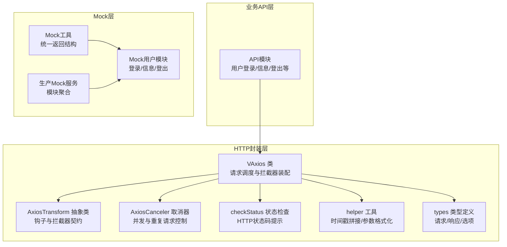
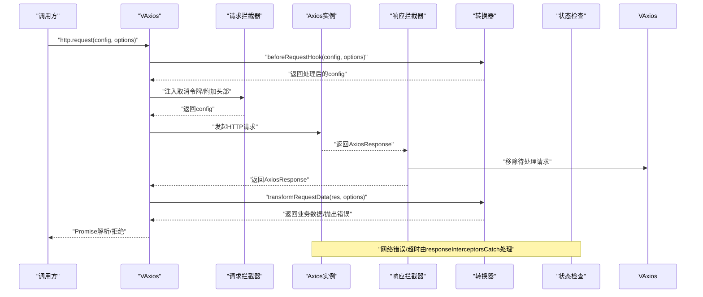
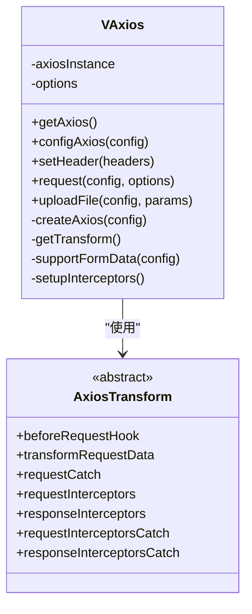
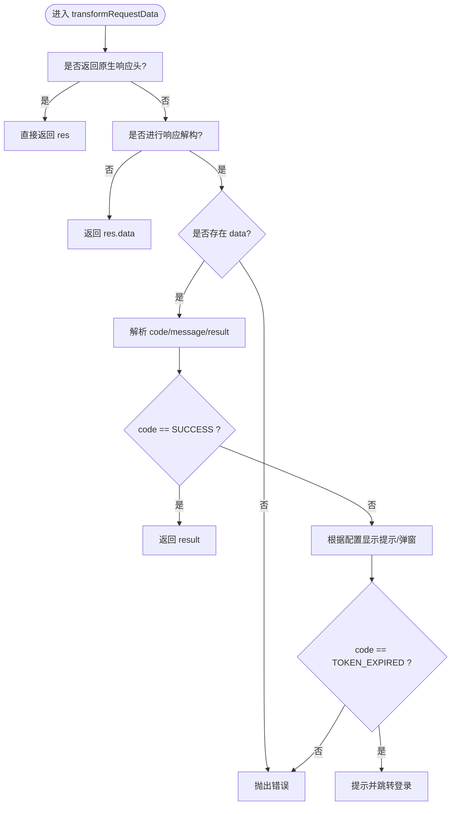
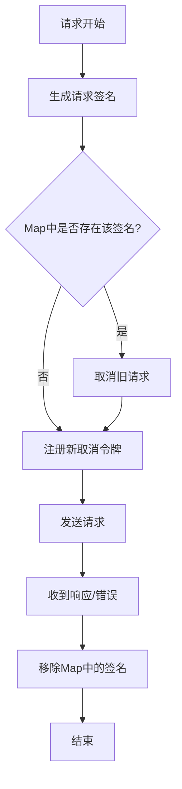
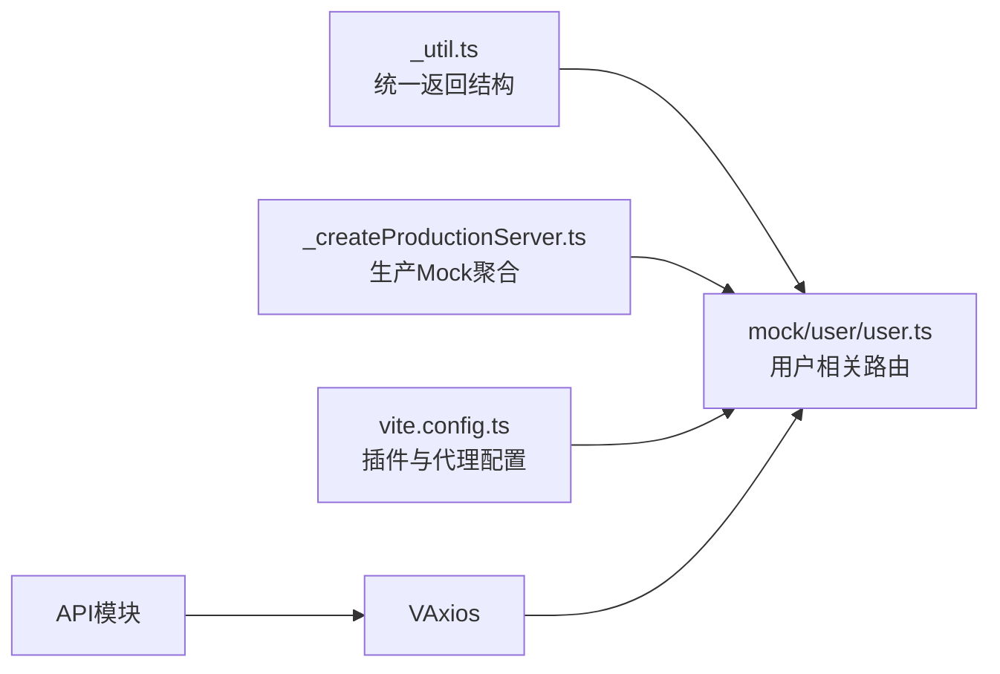
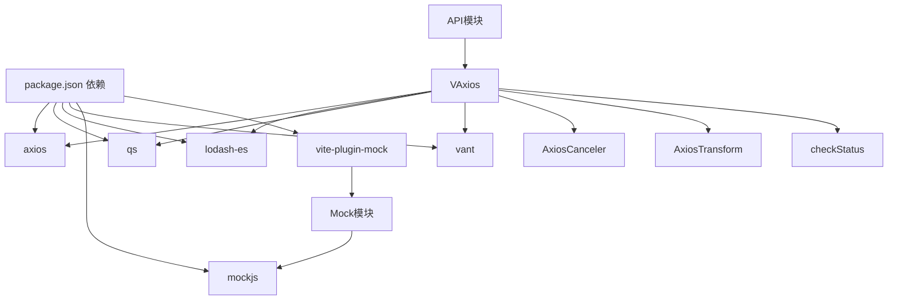

# HTTP请求系统

<cite>
**本文引用的文件**
- [Axios.ts](file://src/utils/http/axios/Axios.ts)
- [axiosTransform.ts](file://src/utils/http/axios/axiosTransform.ts)
- [axiosCancel.ts](file://src/utils/http/axios/axiosCancel.ts)
- [checkStatus.ts](file://src/utils/http/axios/checkStatus.ts)
- [index.ts](file://src/utils/http/axios/index.ts)
- [types.ts](file://src/utils/http/axios/types.ts)
- [helper.ts](file://src/utils/http/axios/helper.ts)
- [httpEnum.ts](file://src/enums/httpEnum.ts)
- [user.ts](file://src/api/system/user.ts)
- [_util.ts](file://mock/_util.ts)
- [user.ts](file://mock/user/user.ts)
- [_createProductionServer.ts](file://mock/_createProductionServer.ts)
- [vite.config.ts](file://vite.config.ts)
- [package.json](file://package.json)
</cite>

## 目录
1. [简介](#简介)
2. [项目结构](#项目结构)
3. [核心组件](#核心组件)
4. [架构总览](#架构总览)
5. [详细组件分析](#详细组件分析)
6. [依赖关系分析](#依赖关系分析)
7. [性能考量](#性能考量)
8. [故障排查指南](#故障排查指南)
9. [结论](#结论)
10. [附录](#附录)

## 简介
本文件系统性梳理并解读本项目的Axios HTTP请求封装体系，重点覆盖以下方面：
- 请求与响应拦截器的装配与职责边界
- 请求转换器设计与数据处理流程（含参数格式化、响应解构、状态码检查）
- 请求取消机制与并发控制，以及内存泄漏防护
- Mock数据集成方案与开发环境下的API模拟
- 超时、重试与网络错误处理策略建议
- 实际使用示例与最佳实践

## 项目结构
HTTP请求系统位于 src/utils/http/axios 目录，采用“配置即扩展”的设计：通过可插拔的 AxiosTransform 抽象类注入钩子，实现“请求前/响应后”与“请求/响应拦截器”的统一管理；同时提供请求取消器、状态码检查器、辅助工具与类型定义，形成完整的请求生命周期闭环。

图表来源
- [Axios.ts:18-26](file://src/utils/http/axios/Axios.ts#L18-L26)
- [axiosTransform.ts:13-52](file://src/utils/http/axios/axiosTransform.ts#L13-L52)
- [axiosCancel.ts:15-64](file://src/utils/http/axios/axiosCancel.ts#L15-L64)
- [checkStatus.ts:3-48](file://src/utils/http/axios/checkStatus.ts#L3-L48)
- [helper.ts:5-48](file://src/utils/http/axios/helper.ts#L5-L48)
- [types.ts:4-65](file://src/utils/http/axios/types.ts#L4-L65)
- [user.ts:1-60](file://src/api/system/user.ts#L1-L60)
- [_util.ts:4-42](file://mock/_util.ts#L4-L42)
- [user.ts:38-95](file://mock/user/user.ts#L38-L95)
- [_createProductionServer.ts:16-18](file://mock/_createProductionServer.ts#L16-L18)

章节来源
- [Axios.ts:18-26](file://src/utils/http/axios/Axios.ts#L18-L26)
- [index.ts:26-285](file://src/utils/http/axios/index.ts#L26-L285)

## 核心组件
- VAxios：Axios实例封装，负责请求调度、拦截器装配、请求转换器调用、文件上传与表单数据适配。
- AxiosTransform：抽象契约，定义 beforeRequestHook、transformRequestData、requestCatch、request/responseInterceptors、request/responseInterceptorsCatch 等钩子。
- AxiosCanceler：基于请求签名的取消令牌管理器，防止重复/并发请求与内存泄漏。
- checkStatus：HTTP状态码到用户提示的映射与交互。
- helper：时间戳拼接、参数日期格式化等通用工具。
- types：请求配置、选项、响应结构的强类型定义。
- API模块：业务API调用示例，演示如何使用 http.request 并覆盖局部选项。
- Mock：统一返回结构与用户相关Mock路由，支持开发/生产环境。

章节来源
- [Axios.ts:18-225](file://src/utils/http/axios/Axios.ts#L18-L225)
- [axiosTransform.ts:13-52](file://src/utils/http/axios/axiosTransform.ts#L13-L52)
- [axiosCancel.ts:15-64](file://src/utils/http/axios/axiosCancel.ts#L15-L64)
- [checkStatus.ts:3-48](file://src/utils/http/axios/checkStatus.ts#L3-L48)
- [helper.ts:5-48](file://src/utils/http/axios/helper.ts#L5-L48)
- [types.ts:4-65](file://src/utils/http/axios/types.ts#L4-L65)
- [user.ts:12-59](file://src/api/system/user.ts#L12-L59)
- [_util.ts:4-42](file://mock/_util.ts#L4-L42)
- [user.ts:38-95](file://mock/user/user.ts#L38-L95)

## 架构总览
下图展示了请求从发起到响应的完整流程，包括拦截器链、取消器、转换器与状态检查的协作关系。

图表来源
- [Axios.ts:55-100](file://src/utils/http/axios/Axios.ts#L55-L100)
- [Axios.ts:175-223](file://src/utils/http/axios/Axios.ts#L175-L223)
- [index.ts:29-238](file://src/utils/http/axios/index.ts#L29-L238)

## 详细组件分析

### VAxios 类与请求生命周期
- 请求调度：cloneDeep 原始配置，合并默认与局部选项，调用 beforeRequestHook 与 supportFormData，随后发起请求。
- 响应处理：判断请求是否被取消，若未取消则调用 transformRequestData；否则直接透传。
- 错误处理：优先调用 requestCatch，否则抛出原始错误。
- 文件上传：构造 FormData，设置 Content-Type 为 multipart/form-data，并在请求头中声明忽略取消令牌。
- 表单适配：当 Content-Type 为 application/x-www-form-urlencoded 且非 GET 时，使用 qs 序列化数组为 brackets 形式。

图表来源
- [Axios.ts:18-225](file://src/utils/http/axios/Axios.ts#L18-L225)
- [axiosTransform.ts:13-52](file://src/utils/http/axios/axiosTransform.ts#L13-L52)

章节来源
- [Axios.ts:55-100](file://src/utils/http/axios/Axios.ts#L55-L100)
- [Axios.ts:117-151](file://src/utils/http/axios/Axios.ts#L117-L151)
- [Axios.ts:154-170](file://src/utils/http/axios/Axios.ts#L154-L170)
- [Axios.ts:175-223](file://src/utils/http/axios/Axios.ts#L175-L223)

### 请求转换器与数据处理
- beforeRequestHook：拼接前缀、拼接URL、GET加时间戳、RESTful兼容、参数与data的归一化、joinParamsToUrl。
- transformRequestData：统一响应结构解构、成功/失败提示、TOKEN过期处理、返回原生响应或业务数据。
- requestCatch：网络超时、网络错误、取消请求的差异化处理与提示。
- requestInterceptors：注入Authorization头（可按withToken开关控制）。
- responseInterceptorsCatch：兜底错误处理，结合checkStatus与取消标记。

图表来源
- [index.ts:33-123](file://src/utils/http/axios/index.ts#L33-L123)
- [index.ts:203-237](file://src/utils/http/axios/index.ts#L203-L237)

章节来源
- [index.ts:29-238](file://src/utils/http/axios/index.ts#L29-L238)
- [types.ts:23-58](file://src/utils/http/axios/types.ts#L23-L58)

### 请求取消机制与并发控制
- 取消令牌生成：基于请求签名（方法、URL、序列化后的data与params）生成唯一键，注册到 Map。
- 重复请求拦截：在请求拦截器中为每个请求注册取消令牌；若相同请求已在进行，则复用或取消旧请求。
- 响应清理：响应拦截器移除对应请求签名，避免悬挂。
- 重置与清空：支持 removeAllPending 与 reset，用于页面切换或登出场景。

图表来源
- [axiosCancel.ts:20-56](file://src/utils/http/axios/axiosCancel.ts#L20-L56)
- [Axios.ts:191-212](file://src/utils/http/axios/Axios.ts#L191-L212)

章节来源
- [axiosCancel.ts:15-64](file://src/utils/http/axios/axiosCancel.ts#L15-L64)
- [Axios.ts:175-223](file://src/utils/http/axios/Axios.ts#L175-L223)

### Mock数据集成方案
- 统一返回结构：resultSuccess/resultError 提供一致的 code/message/result/type 结构。
- 用户Mock路由：登录、获取用户信息、登出，均返回统一结构并支持鉴权校验。
- 生产环境Mock：通过 _createProductionServer 聚合 mock 模块，手动导入以启用。
- 开发环境：Vite 插件自动加载 mock 模块，无需额外配置。

图表来源
- [_util.ts:4-42](file://mock/_util.ts#L4-L42)
- [user.ts:38-95](file://mock/user/user.ts#L38-L95)
- [_createProductionServer.ts:16-18](file://mock/_createProductionServer.ts#L16-L18)
- [vite.config.ts:180-181](file://vite.config.ts#L180-L181)

章节来源
- [_util.ts:4-42](file://mock/_util.ts#L4-L42)
- [user.ts:38-95](file://mock/user/user.ts#L38-L95)
- [_createProductionServer.ts:16-18](file://mock/_createProductionServer.ts#L16-L18)
- [vite.config.ts:180-181](file://vite.config.ts#L180-L181)

### API使用示例与最佳实践
- 登录接口：关闭响应解构，直接获取业务字段。
- 获取用户信息：使用默认配置，交由转换器处理。
- 修改密码：关闭响应解构，便于直接使用后端返回结构。
- 最佳实践建议：
  - GET请求自动加时间戳，避免缓存；RESTful风格兼容。
  - 非GET请求将空data视为params归并至URL（可选）。
  - 统一通过 transformRequestData 处理提示与错误分支。
  - 使用 ignoreCancelToken 控制是否允许重复请求覆盖。
  - 超时与网络错误在 responseInterceptorsCatch 中集中处理。

章节来源
- [user.ts:12-59](file://src/api/system/user.ts#L12-L59)
- [index.ts:240-285](file://src/utils/http/axios/index.ts#L240-L285)

## 依赖关系分析
- 外部依赖：axios、qs、lodash-es、vant（UI提示）、mockjs（Mock）、vite-plugin-mock（开发/生产Mock）。
- 内部耦合：VAxios 依赖 AxiosTransform 抽象；AxiosCanceler 与拦截器紧密耦合；checkStatus 与 UI 提示组件耦合；API模块仅依赖 http 导出。

图表来源
- [package.json:44-53](file://package.json#L44-L53)
- [Axios.ts:4-7](file://src/utils/http/axios/Axios.ts#L4-L7)
- [index.ts:3-10](file://src/utils/http/axios/index.ts#L3-L10)
- [user.ts](file://src/api/system/user.ts#L1)

章节来源
- [package.json:44-103](file://package.json#L44-L103)

## 性能考量
- 请求去重与取消：通过请求签名与取消令牌减少重复请求，降低带宽与CPU消耗。
- 参数序列化：表单数据使用 qs 序列化，避免因数组/对象导致的编码差异。
- 时间戳注入：GET请求自动注入时间戳，避免浏览器缓存命中导致的无效请求。
- 响应解构：统一在 transformRequestData 中完成，避免在多处重复解析。
- 超时与重试：当前未内置重试机制，建议在上层业务或拦截器中按需实现；超时与网络错误在 responseInterceptorsCatch 中处理。

## 故障排查指南
- 登录超时/令牌失效：转换器中针对 TOKEN_EXPIRED 分支处理，弹窗提示并跳转登录页。
- 网络超时：responseInterceptorsCatch 捕获超时错误并提示。
- 网络异常：识别 Network Error 并弹窗提示，必要时阻止默认行为。
- 请求被取消：区分 isCancel 并记录日志，避免误报。
- 状态码提示：checkStatus 将常见HTTP状态映射为用户可理解的提示。

章节来源
- [index.ts:97-122](file://src/utils/http/axios/index.ts#L97-L122)
- [index.ts:203-237](file://src/utils/http/axios/index.ts#L203-L237)
- [checkStatus.ts:3-48](file://src/utils/http/axios/checkStatus.ts#L3-L48)

## 结论
本HTTP请求系统以 VAxios 为核心，通过 AxiosTransform 抽象出清晰的请求生命周期钩子，结合 AxiosCanceler 的并发控制与 checkStatus 的状态提示，形成了高内聚、低耦合的请求封装方案。配合 Mock 体系，可在开发与生产环境无缝切换。建议在实际项目中：
- 明确各钩子职责，避免过度耦合
- 对超时与重试策略进行统一规划
- 在复杂业务中增加幂等与退避策略
- 持续优化提示与错误处理，提升用户体验

## 附录
- 关键枚举与类型：ResultEnum、RequestEnum、ContentTypeEnum、RequestOptions、Result 等。
- 常用工具：joinTimestamp、formatRequestDate。
- API示例：登录、获取用户信息、登出、修改密码。

章节来源
- [httpEnum.ts:4-35](file://src/enums/httpEnum.ts#L4-L35)
- [types.ts:23-65](file://src/utils/http/axios/types.ts#L23-L65)
- [helper.ts:5-48](file://src/utils/http/axios/helper.ts#L5-L48)
- [user.ts:12-59](file://src/api/system/user.ts#L12-L59)