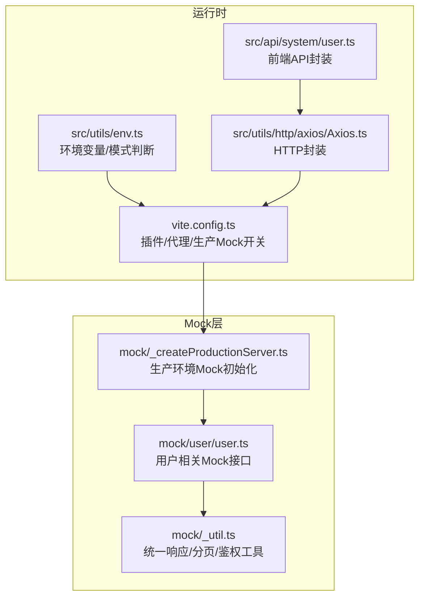
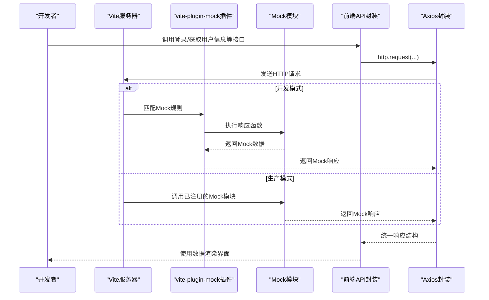
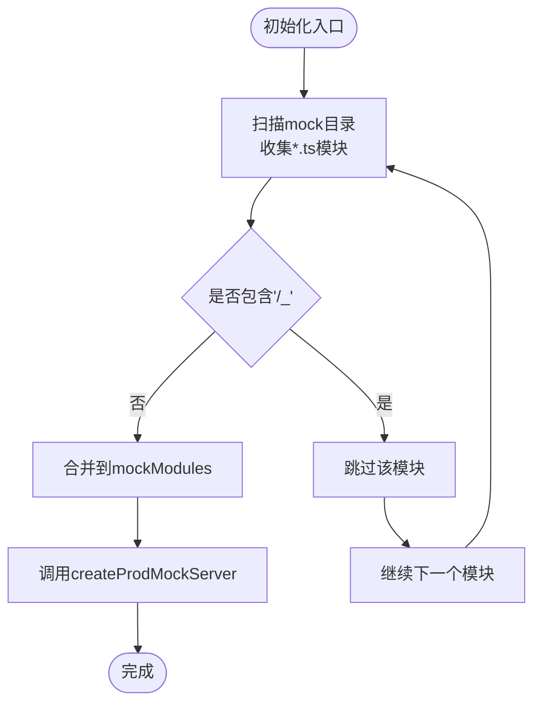
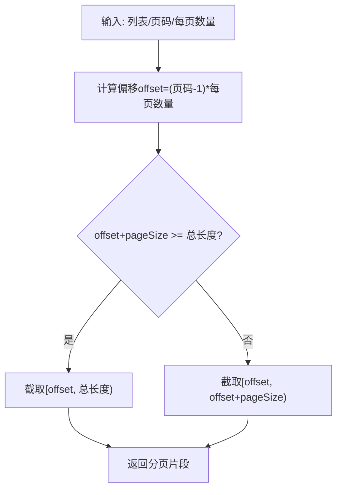
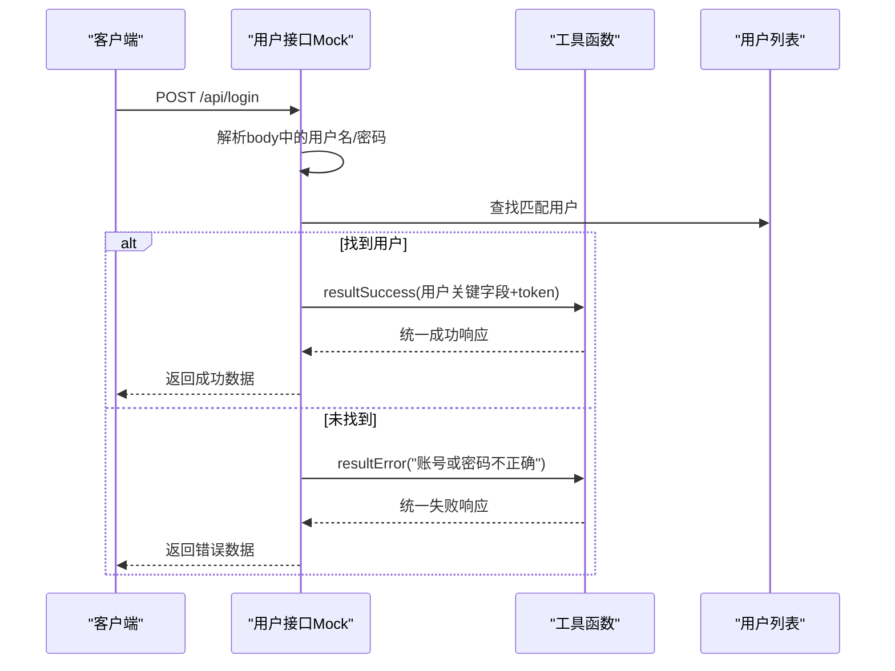
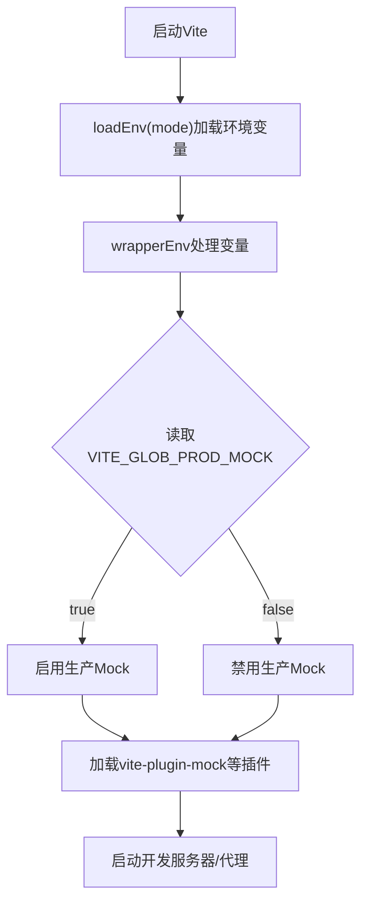
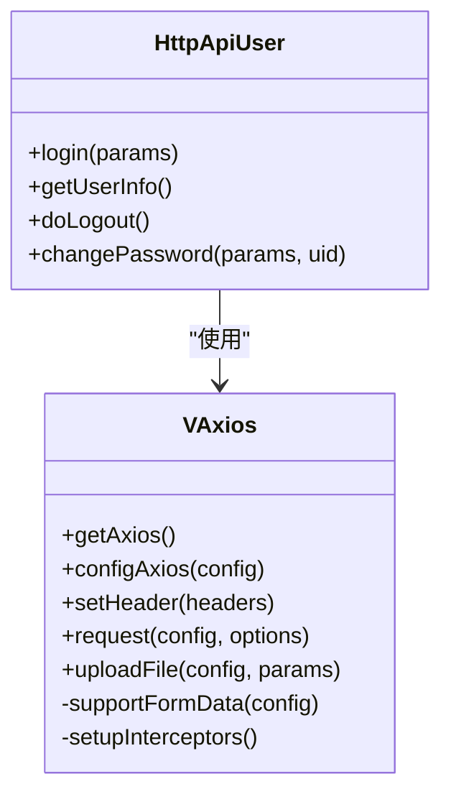
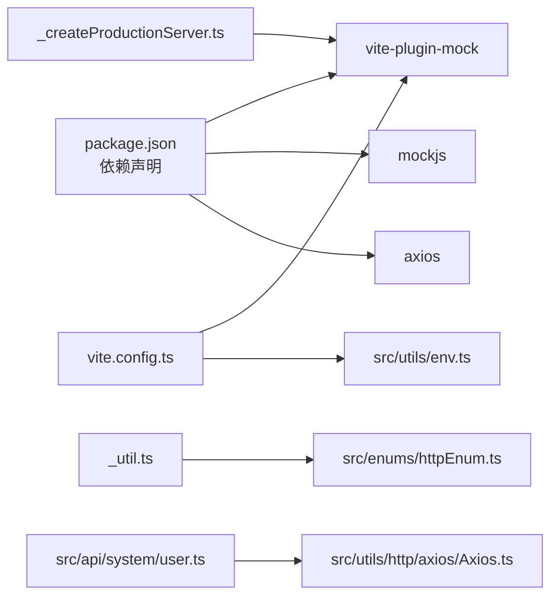

# Mock数据集成

<cite>
**本文引用的文件**
- [mock/_createProductionServer.ts](file://mock/_createProductionServer.ts)
- [mock/_util.ts](file://mock/_util.ts)
- [mock/user/user.ts](file://mock/user/user.ts)
- [src/enums/httpEnum.ts](file://src/enums/httpEnum.ts)
- [src/utils/env.ts](file://src/utils/env.ts)
- [src/utils/http/axios/Axios.ts](file://src/utils/http/axios/Axios.ts)
- [src/api/system/user.ts](file://src/api/system/user.ts)
- [vite.config.ts](file://vite.config.ts)
- [package.json](file://package.json)
</cite>

## 目录
1. [简介](#简介)
2. [项目结构](#项目结构)
3. [核心组件](#核心组件)
4. [架构总览](#架构总览)
5. [详细组件分析](#详细组件分析)
6. [依赖分析](#依赖分析)
7. [性能考虑](#性能考虑)
8. [故障排查指南](#故障排查指南)
9. [结论](#结论)
10. [附录](#附录)

## 简介
本文件系统性梳理该项目的Mock数据集成方案，覆盖开发环境配置、Mock API定义与路由映射、Mock数据组织结构（用户数据、业务数据、静态资源）、工具函数（数据生成、随机数与时间戳管理）、Mock与真实API的切换机制（环境检测与配置管理），以及Mock数据开发的最佳实践（数据一致性与调试技巧）。读者可据此快速搭建、维护与扩展Mock体系。

## 项目结构
Mock相关代码主要位于以下位置：
- mock：存放Mock模块与工具函数
  - mock/_createProductionServer.ts：生产环境Mock服务器初始化
  - mock/_util.ts：统一响应包装、分页、鉴权提取等工具
  - mock/user/user.ts：用户域Mock接口定义
- src/utils/env.ts：环境变量与模式判断
- vite.config.ts：Vite配置，含插件加载与生产Mock开关
- package.json：依赖声明，包含vite-plugin-mock与mockjs

图表来源
- [mock/_createProductionServer.ts:1-19](file://mock/_createProductionServer.ts#L1-L19)
- [mock/_util.ts:1-78](file://mock/_util.ts#L1-L78)
- [mock/user/user.ts:1-96](file://mock/user/user.ts#L1-L96)
- [src/utils/env.ts:1-90](file://src/utils/env.ts#L1-L90)
- [vite.config.ts:1-183](file://vite.config.ts#L1-L183)
- [src/utils/http/axios/Axios.ts:1-225](file://src/utils/http/axios/Axios.ts#L1-L225)
- [src/api/system/user.ts:1-60](file://src/api/system/user.ts#L1-L60)

章节来源
- [vite.config.ts:1-183](file://vite.config.ts#L1-L183)
- [package.json:1-118](file://package.json#L1-L118)

## 核心组件
- 生产环境Mock初始化：通过扫描mock目录下的模块，过滤以“_”开头的文件，手动导入并注册Mock，确保生产构建仍可启用Mock。
- 工具函数：提供统一的成功/失败响应包装、分页辅助、自定义重复执行、请求头令牌提取等能力，便于各Mock接口复用。
- 用户域Mock：定义登录、获取用户信息、登出等接口，模拟鉴权流程与用户数据返回。
- 环境与模式：通过环境变量与模式判断，控制是否启用生产Mock与API前缀等行为。
- HTTP封装：基于Axios的二次封装，支持拦截器、取消重复请求、表单序列化等，为Mock与真实API提供一致的调用体验。

章节来源
- [mock/_createProductionServer.ts:1-19](file://mock/_createProductionServer.ts#L1-L19)
- [mock/_util.ts:1-78](file://mock/_util.ts#L1-L78)
- [mock/user/user.ts:1-96](file://mock/user/user.ts#L1-L96)
- [src/utils/env.ts:1-90](file://src/utils/env.ts#L1-L90)
- [src/utils/http/axios/Axios.ts:1-225](file://src/utils/http/axios/Axios.ts#L1-L225)

## 架构总览
Mock集成的关键流程如下：
- 开发模式：Vite加载插件，直接拦截匹配的/api前缀请求并返回Mock数据。
- 生产模式：通过setupProdMockServer在运行时注册Mock模块，实现与开发一致的Mock行为。
- 前端API封装：统一调用http.request，结合Axios拦截器与转换逻辑，屏蔽Mock与真实API差异。
- 环境变量：通过VITE_GLOB_PROD_MOCK等变量控制Mock启用策略与API前缀。

图表来源
- [vite.config.ts:135-154](file://vite.config.ts#L135-L154)
- [mock/_createProductionServer.ts:16-18](file://mock/_createProductionServer.ts#L16-L18)
- [src/api/system/user.ts:12-43](file://src/api/system/user.ts#L12-L43)
- [src/utils/http/axios/Axios.ts:55-100](file://src/utils/http/axios/Axios.ts#L55-L100)

## 详细组件分析

### 生产环境Mock初始化
- 功能：在生产构建后，通过扫描mock目录并过滤隐藏文件，收集默认导出的Mock数组，交由vite-plugin-mock创建生产Mock服务器。
- 关键点：
  - 使用import.meta.glob按文件粒度加载，eager模式提升初始化效率。
  - 过滤规则：跳过以“_”开头的文件（如工具文件），避免将工具模块误作为Mock路由。
  - 导出函数setupProdMockServer供运行时调用。

图表来源
- [mock/_createProductionServer.ts:3-11](file://mock/_createProductionServer.ts#L3-L11)
- [mock/_createProductionServer.ts:16-18](file://mock/_createProductionServer.ts#L16-L18)

章节来源
- [mock/_createProductionServer.ts:1-19](file://mock/_createProductionServer.ts#L1-L19)

### Mock工具函数
- 统一响应包装：
  - 成功响应：固定成功码、消息与类型，便于前端统一处理。
  - 分页响应：计算偏移与截取列表，返回带分页信息的结构。
  - 失败响应：支持自定义状态码与消息。
- 分页算法：根据页码与每页数量计算偏移，截取对应片段。
- 循环工具：doCustomTimes支持按次数重复执行回调，便于批量生成测试数据。
- 鉴权提取：从请求头中提取令牌，支撑受保护接口的Mock校验。

图表来源
- [mock/_util.ts:44-51](file://mock/_util.ts#L44-L51)

章节来源
- [mock/_util.ts:1-78](file://mock/_util.ts#L1-L78)

### 用户域Mock接口
- 登录接口：接收用户名与密码，匹配内置用户列表；匹配失败返回错误；成功返回用户关键字段与令牌。
- 获取用户信息：从请求头读取令牌，校验有效性；未携带令牌或令牌无效时返回相应错误；有效则返回完整用户信息。
- 登出接口：校验令牌有效性，返回销毁令牌的消息。
- 通用配置：设置超时时间，模拟网络延迟；使用统一响应包装与鉴权提取工具。

图表来源
- [mock/user/user.ts:38-60](file://mock/user/user.ts#L38-L60)
- [mock/_util.ts:4-11](file://mock/_util.ts#L4-L11)

章节来源
- [mock/user/user.ts:1-96](file://mock/user/user.ts#L1-L96)
- [mock/_util.ts:1-78](file://mock/_util.ts#L1-L78)

### 环境检测与配置管理
- 环境变量：通过src/utils/env.ts读取VITE_GLOB_*变量，包含API地址、前缀、上传地址、生产Mock开关等。
- 模式判断：提供开发/生产模式判断函数，便于在不同环境下启用不同行为。
- Vite配置：在vite.config.ts中加载环境变量、设置代理、选择性启用插件与生产Mock开关。

图表来源
- [src/utils/env.ts:17-52](file://src/utils/env.ts#L17-L52)
- [vite.config.ts:37-40](file://vite.config.ts#L37-L40)
- [vite.config.ts:180](file://vite.config.ts#L180)

章节来源
- [src/utils/env.ts:1-90](file://src/utils/env.ts#L1-L90)
- [vite.config.ts:1-183](file://vite.config.ts#L1-L183)

### 前端API封装与Axios拦截
- 前端API封装：src/api/system/user.ts提供登录、获取用户信息、登出等方法，统一调用http.request并配置是否转换响应。
- Axios封装：VAxios类提供请求/响应拦截、取消重复请求、表单序列化、统一错误处理等能力，保证Mock与真实API的一致性。

图表来源
- [src/utils/http/axios/Axios.ts:18-225](file://src/utils/http/axios/Axios.ts#L18-L225)
- [src/api/system/user.ts:12-43](file://src/api/system/user.ts#L12-L43)

章节来源
- [src/utils/http/axios/Axios.ts:1-225](file://src/utils/http/axios/Axios.ts#L1-L225)
- [src/api/system/user.ts:1-60](file://src/api/system/user.ts#L1-L60)

## 依赖分析
- 插件与工具：
  - vite-plugin-mock：提供开发与生产环境的Mock能力。
  - mockjs：生成结构化Mock数据与随机内容。
  - axios：HTTP客户端，配合拦截器与取消器实现稳定请求行为。
- 关键耦合点：
  - mock/_createProductionServer.ts依赖vite-plugin-mock的createProdMockServer。
  - mock/_util.ts依赖src/enums/httpEnum.ts中的状态码枚举。
  - src/api/system/user.ts依赖src/utils/http/axios/Axios.ts提供的http.request。
  - vite.config.ts通过插件加载与环境变量控制Mock启用策略。

图表来源
- [package.json:48-101](file://package.json#L48-L101)
- [vite.config.ts:180](file://vite.config.ts#L180)
- [src/utils/env.ts:17-52](file://src/utils/env.ts#L17-L52)
- [mock/_createProductionServer.ts:1](file://mock/_createProductionServer.ts#L1)
- [mock/_util.ts:2](file://mock/_util.ts#L2)
- [src/enums/httpEnum.ts:4-10](file://src/enums/httpEnum.ts#L4-L10)
- [src/api/system/user.ts:1](file://src/api/system/user.ts#L1)
- [src/utils/http/axios/Axios.ts:1](file://src/utils/http/axios/Axios.ts#L1)

章节来源
- [package.json:1-118](file://package.json#L1-L118)
- [vite.config.ts:1-183](file://vite.config.ts#L1-L183)

## 性能考虑
- 开发期Mock延迟：部分接口设置了timeout，模拟网络延迟，建议在开发阶段适度调整，避免影响交互流畅性。
- 生产Mock初始化：使用eager模式加载模块，减少首次访问延迟；同时仅注册非隐藏文件，避免无关模块参与。
- 依赖预构建：Vite优化依赖预构建与exclude配置，有助于提升整体启动与切换性能。
- 响应结构统一：通过工具函数统一封装响应，减少前端分支判断，间接提升渲染性能。

## 故障排查指南
- Mock未生效
  - 检查VITE_GLOB_PROD_MOCK是否开启，以及是否正确调用setupProdMockServer。
  - 确认请求URL与Mock定义的url一致，注意大小写与前缀。
- 鉴权失败
  - 确保请求头中包含令牌，且令牌与用户列表中的token一致。
  - 检查工具函数getRequestToken是否正确提取头部令牌。
- 响应格式异常
  - 确认使用resultSuccess/resultError进行统一包装，避免自定义结构导致前端解析异常。
- 分页数据异常
  - 检查页码与每页数量参数，确认分页算法计算正确。
- 环境变量问题
  - 检查.env.*文件与VITE_*变量命名，确保加载顺序与值正确。

章节来源
- [mock/_createProductionServer.ts:16-18](file://mock/_createProductionServer.ts#L16-L18)
- [mock/user/user.ts:65-77](file://mock/user/user.ts#L65-L77)
- [mock/_util.ts:75-77](file://mock/_util.ts#L75-L77)
- [mock/_util.ts:13-30](file://mock/_util.ts#L13-L30)
- [src/utils/env.ts:32-51](file://src/utils/env.ts#L32-L51)

## 结论
该Mock数据集成方案以简洁清晰的方式实现了开发与生产的统一Mock体验。通过模块化组织、工具函数抽象与环境变量控制，既能满足日常开发调试需求，也能在生产构建后保持一致的行为。建议在团队内规范Mock接口命名与响应结构，持续完善工具函数与分页策略，以提升协作效率与数据一致性。

## 附录
- 最佳实践
  - 数据一致性：统一使用工具函数生成响应，避免手写分散的结构。
  - 调试技巧：利用timeout模拟网络波动，结合日志与断点定位问题。
  - 扩展建议：新增业务域Mock时，遵循现有目录与命名约定，复用工具函数与鉴权逻辑。
- 常见问题
  - 如何切换到真实API：关闭生产Mock开关并调整API前缀，确保与后端一致。
  - 如何添加新用户：在用户列表中追加用户对象，确保令牌唯一且可用。