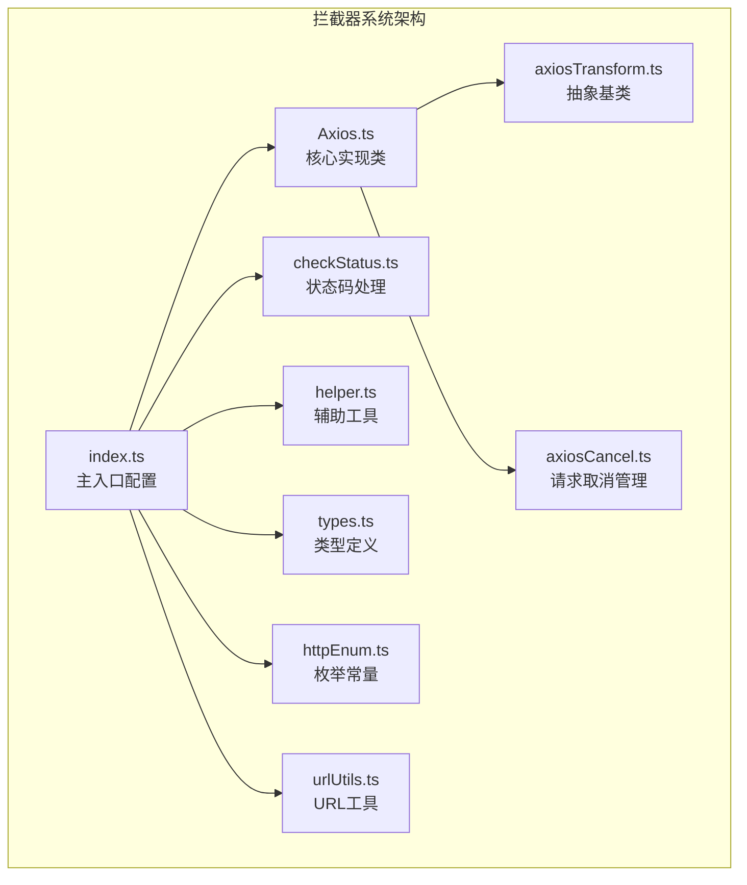
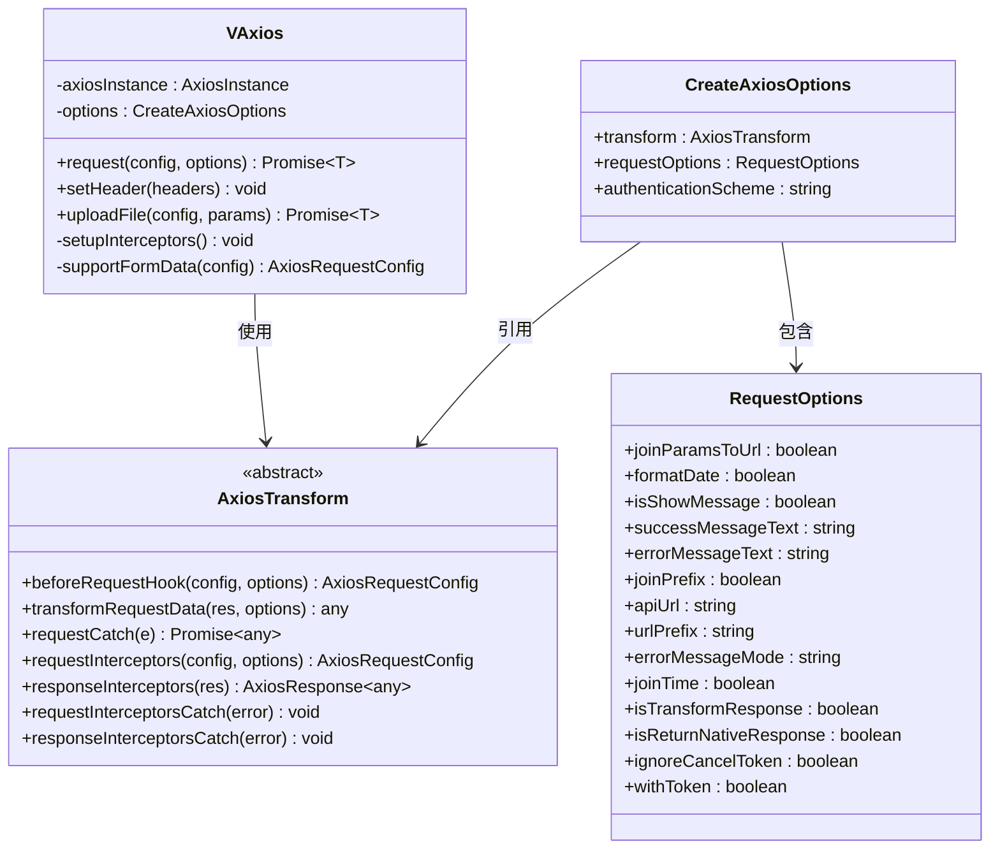
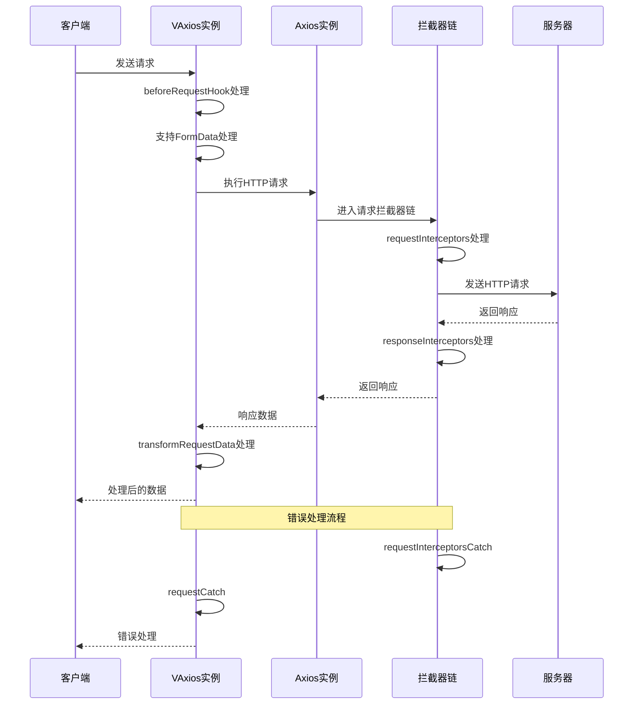
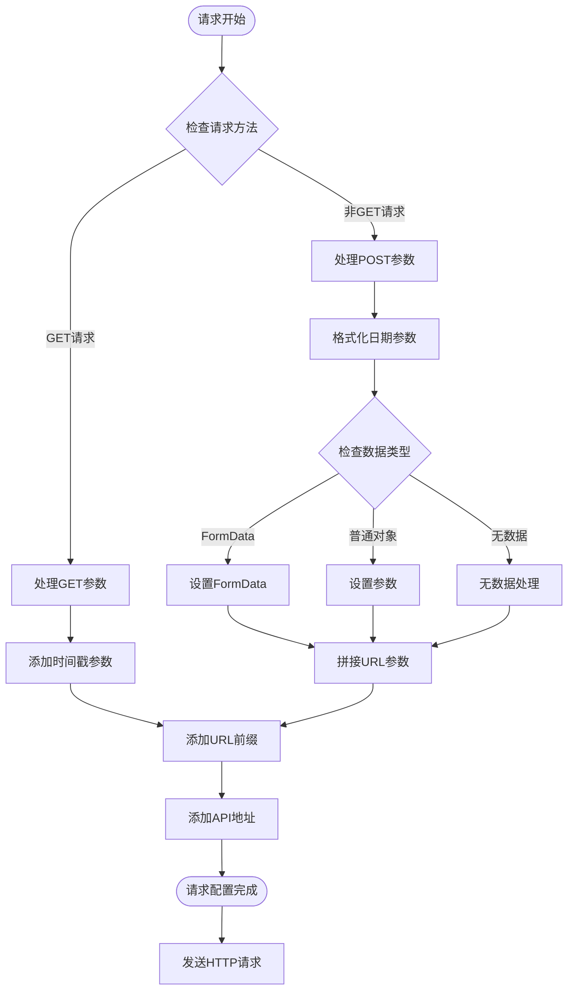
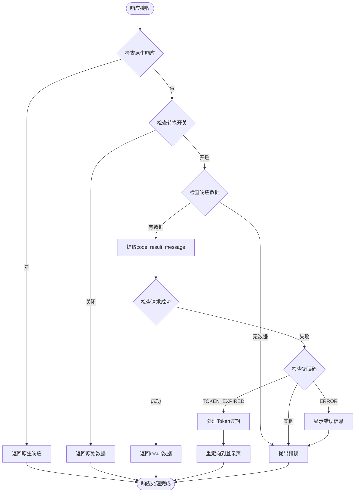
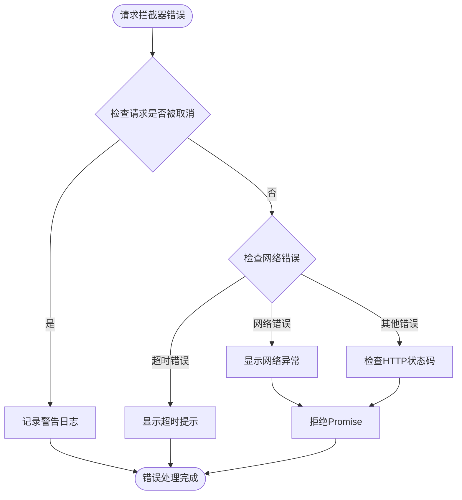
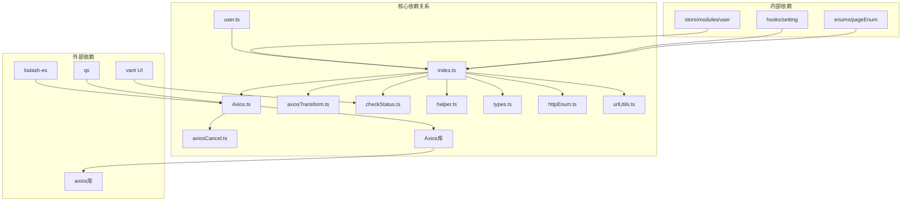

# 拦截器系统

<cite>
**本文档引用的文件**
- [axiosTransform.ts](file://src/utils/http/axios/axiosTransform.ts)
- [Axios.ts](file://src/utils/http/axios/Axios.ts)
- [index.ts](file://src/utils/http/axios/index.ts)
- [types.ts](file://src/utils/http/axios/types.ts)
- [checkStatus.ts](file://src/utils/http/axios/checkStatus.ts)
- [httpEnum.ts](file://src/enums/httpEnum.ts)
- [helper.ts](file://src/utils/http/axios/helper.ts)
- [axiosCancel.ts](file://src/utils/http/axios/axiosCancel.ts)
- [user.ts](file://src/api/system/user.ts)
- [urlUtils.ts](file://src/utils/urlUtils.ts)
</cite>

## 目录
1. [简介](#简介)
2. [项目结构](#项目结构)
3. [核心组件](#核心组件)
4. [架构概览](#架构概览)
5. [详细组件分析](#详细组件分析)
6. [依赖关系分析](#依赖关系分析)
7. [性能考虑](#性能考虑)
8. [故障排除指南](#故障排除指南)
9. [结论](#结论)

## 简介

拦截器系统是本项目HTTP请求处理的核心组件，基于Axios实现了完整的请求和响应拦截机制。该系统提供了灵活的配置选项，支持全局拦截器和局部拦截器的组合使用，能够处理请求前的数据预处理、请求头设置、响应数据转换以及错误处理等关键功能。

系统采用面向对象的设计模式，通过抽象类AxiosTransform定义了拦截器的标准接口，确保了扩展性和可维护性。同时集成了请求取消、重复请求过滤、Token管理等高级功能。

## 项目结构

拦截器系统主要位于`src/utils/http/axios/`目录下，包含以下核心文件：



**图表来源**
- [index.ts:1-298](file://src/utils/http/axios/index.ts#L1-L298)
- [Axios.ts:1-225](file://src/utils/http/axios/Axios.ts#L1-L225)
- [axiosTransform.ts:1-53](file://src/utils/http/axios/axiosTransform.ts#L1-L53)

**章节来源**
- [index.ts:1-298](file://src/utils/http/axios/index.ts#L1-L298)
- [Axios.ts:1-225](file://src/utils/http/axios/Axios.ts#L1-L225)

## 核心组件

### AxiosTransform 抽象基类

AxiosTransform是拦截器系统的核心抽象类，定义了完整的拦截器接口规范：



**图表来源**
- [axiosTransform.ts:13-52](file://src/utils/http/axios/axiosTransform.ts#L13-L52)
- [Axios.ts:18-26](file://src/utils/http/axios/Axios.ts#L18-L26)
- [types.ts:4-66](file://src/utils/http/axios/types.ts#L4-L66)

### VAxios 核心实现类

VAxios是拦截器系统的主要实现类，负责HTTP请求的完整生命周期管理：

**章节来源**
- [Axios.ts:18-225](file://src/utils/http/axios/Axios.ts#L18-L225)

## 架构概览

拦截器系统采用双层架构设计，结合了Axios原生拦截器和自定义拦截器：



**图表来源**
- [Axios.ts:55-100](file://src/utils/http/axios/Axios.ts#L55-L100)
- [Axios.ts:175-224](file://src/utils/http/axios/Axios.ts#L175-L224)

## 详细组件分析

### 请求拦截器实现

#### 请求前钩子函数 (beforeRequestHook)

请求前钩子函数负责在请求发送前对配置进行预处理：



**图表来源**
- [index.ts:125-182](file://src/utils/http/axios/index.ts#L125-L182)
- [helper.ts:24-48](file://src/utils/http/axios/helper.ts#L24-L48)

#### 请求头处理

请求拦截器负责自动添加认证Token到请求头：

**章节来源**
- [index.ts:187-198](file://src/utils/http/axios/index.ts#L187-L198)

#### 请求配置修改

系统支持动态修改请求配置，包括URL拼接、参数处理和内容类型设置：

**章节来源**
- [index.ts:125-182](file://src/utils/http/axios/index.ts#L125-L182)

### 响应拦截器设计

#### 响应数据处理

响应拦截器负责将服务器返回的数据转换为应用可用的格式：



**图表来源**
- [index.ts:33-123](file://src/utils/http/axios/index.ts#L33-L123)

#### 状态码检查

系统集成统一的状态码处理机制：

**章节来源**
- [checkStatus.ts:3-48](file://src/utils/http/axios/checkStatus.ts#L3-L48)

#### 响应转换

响应转换器根据配置决定返回数据的格式：

**章节来源**
- [index.ts:33-123](file://src/utils/http/axios/index.ts#L33-L123)

### 错误处理机制

#### 请求拦截器错误捕获

请求拦截器错误处理机制：



**图表来源**
- [index.ts:203-237](file://src/utils/http/axios/index.ts#L203-L237)

#### 响应拦截器错误处理

响应拦截器错误处理流程：

**章节来源**
- [index.ts:203-237](file://src/utils/http/axios/index.ts#L203-L237)

### 执行顺序和生命周期管理

拦截器的执行顺序遵循以下规则：

1. **请求阶段**：
   - beforeRequestHook（配置预处理）
   - requestInterceptors（请求头设置）
   - 实际HTTP请求发送

2. **响应阶段**：
   - responseInterceptors（响应数据处理）
   - transformRequestData（数据转换）
   - 返回最终结果

3. **错误阶段**：
   - requestInterceptorsCatch（请求错误处理）
   - requestCatch（配置级错误处理）

**章节来源**
- [Axios.ts:175-224](file://src/utils/http/axios/Axios.ts#L175-L224)

## 依赖关系分析

拦截器系统各组件之间的依赖关系如下：



**图表来源**
- [index.ts:1-22](file://src/utils/http/axios/index.ts#L1-L22)
- [Axios.ts:1-13](file://src/utils/http/axios/Axios.ts#L1-L13)

**章节来源**
- [index.ts:1-22](file://src/utils/http/axios/index.ts#L1-L22)
- [Axios.ts:1-13](file://src/utils/http/axios/Axios.ts#L1-L13)

## 性能考虑

### 请求取消机制

系统实现了智能的请求取消功能，防止重复请求：

- **去重策略**：基于请求方法、URL、数据和参数生成唯一标识
- **内存管理**：使用Map存储待处理请求，及时清理已完成请求
- **取消时机**：在新请求发起前自动取消相同请求

### 缓存优化

- **深度克隆**：请求配置使用深拷贝，避免意外修改
- **参数格式化**：统一的参数格式化减少不必要的数据转换
- **条件加载**：按需加载拦截器功能，减少初始化开销

### 并发控制

- **请求队列**：支持并发请求的管理和控制
- **超时处理**：统一的超时配置和错误处理
- **重试机制**：可配置的错误重试策略

## 故障排除指南

### 常见问题及解决方案

#### Token相关问题

**问题**：Token无效或过期
**解决方案**：
1. 检查Token存储和获取逻辑
2. 验证Token格式和有效期
3. 实现Token刷新机制

#### 请求超时问题

**问题**：接口请求超时
**解决方案**：
1. 调整超时配置
2. 检查网络连接
3. 实现重试机制

#### 数据格式问题

**问题**：响应数据格式不符合预期
**解决方案**：
1. 检查API返回格式
2. 配置正确的数据转换逻辑
3. 验证Result接口定义

### 调试技巧

#### 开启调试模式

```typescript
// 在创建axios实例时启用调试
const debugAxios = createAxios({
  requestOptions: {
    isShowMessage: true,
    isTransformResponse: true,
  }
})
```

#### 日志记录

系统会在关键节点输出调试信息，便于问题定位。

**章节来源**
- [index.ts:203-237](file://src/utils/http/axios/index.ts#L203-L237)

## 结论

拦截器系统通过精心设计的架构和完善的错误处理机制，为Vue3项目提供了强大而灵活的HTTP请求处理能力。系统的主要优势包括：

1. **高度可配置**：支持全局和局部拦截器的组合使用
2. **完善的错误处理**：覆盖请求和响应各个阶段的错误处理
3. **灵活的数据转换**：支持多种数据格式和转换策略
4. **性能优化**：集成请求取消、重复请求过滤等功能
5. **易于扩展**：基于抽象类的设计便于功能扩展

该系统为开发者提供了标准化的HTTP请求处理方案，能够满足大多数Web应用的需求，同时保持了良好的可维护性和扩展性。