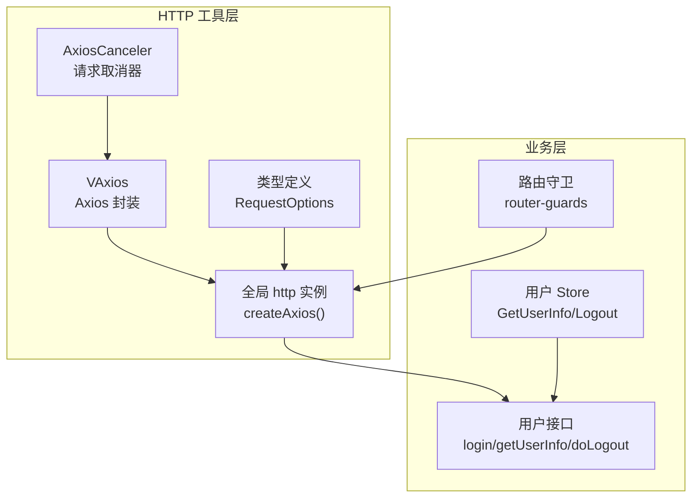
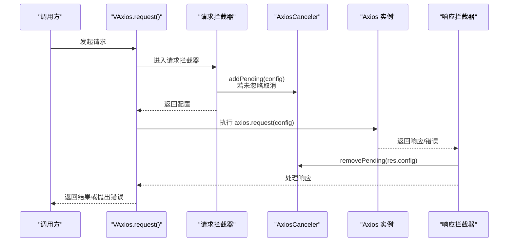
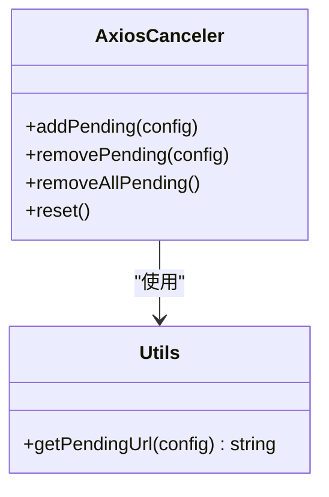
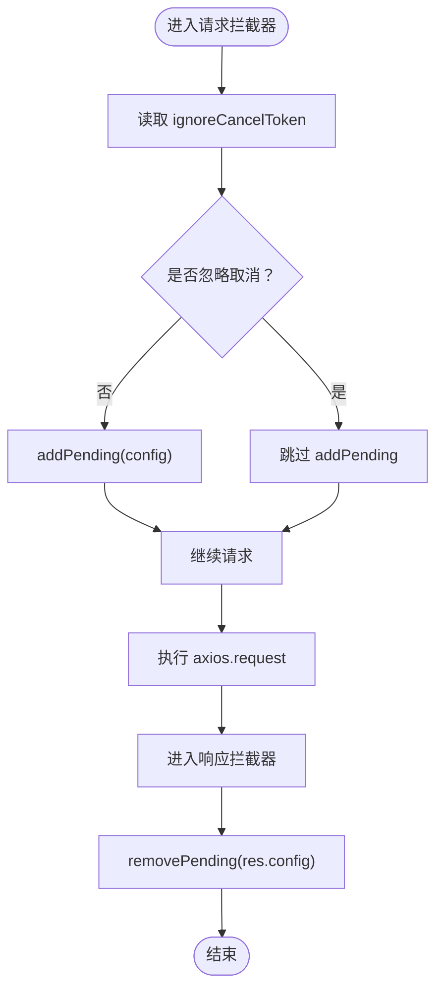
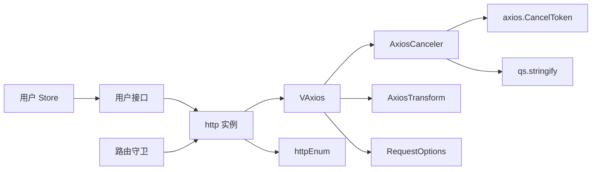

# 请求取消机制

<cite>
**本文引用的文件**
- [axiosCancel.ts](file://src/utils/http/axios/axiosCancel.ts)
- [Axios.ts](file://src/utils/http/axios/Axios.ts)
- [index.ts](file://src/utils/http/axios/index.ts)
- [types.ts](file://src/utils/http/axios/types.ts)
- [checkStatus.ts](file://src/utils/http/axios/checkStatus.ts)
- [httpEnum.ts](file://src/enums/httpEnum.ts)
- [user.ts](file://src/api/system/user.ts)
- [router-guards.ts](file://src/router/router-guards.ts)
- [user.ts](file://src/store/modules/user.ts)
</cite>

## 目录
1. [简介](#简介)
2. [项目结构](#项目结构)
3. [核心组件](#核心组件)
4. [架构总览](#架构总览)
5. [详细组件分析](#详细组件分析)
6. [依赖关系分析](#依赖关系分析)
7. [性能考量](#性能考量)
8. [故障排查指南](#故障排查指南)
9. [结论](#结论)
10. [附录](#附录)

## 简介
本文件系统性阐述项目中的请求取消机制，重点解析 AxiosCanceler 类的设计与实现，包括请求队列管理、重复请求检测与请求取消逻辑；详述触发条件（路由切换、组件卸载、手动取消）；并发请求控制（去重、队列管理、内存泄漏防护）；ignoreCancelToken 配置的作用与使用场景；并提供实际应用场景与最佳实践，帮助开发者在复杂交互中优雅地清理异步操作、优化用户体验。

## 项目结构
与请求取消机制直接相关的模块位于 utils/http/axios 目录，核心文件如下：
- axiosCancel.ts：请求标识生成与取消器实现
- Axios.ts：VAxios 封装类，集成拦截器与取消器
- index.ts：全局 http 实例与默认配置，含 ignoreCancelToken 默认值
- types.ts：请求配置与选项类型定义
- checkStatus.ts：HTTP 状态码提示与处理
- httpEnum.ts：HTTP 常量枚举
- user.ts（API）：业务接口示例
- router-guards.ts：路由守卫（影响请求取消时机）
- user.ts（Store）：用户状态与登出流程

图表来源
- [Axios.ts:187-224](file://src/utils/http/axios/Axios.ts#L187-L224)
- [index.ts:240-287](file://src/utils/http/axios/index.ts#L240-L287)
- [types.ts:23-58](file://src/utils/http/axios/types.ts#L23-L58)

章节来源
- [Axios.ts:18-225](file://src/utils/http/axios/Axios.ts#L18-L225)
- [index.ts:1-298](file://src/utils/http/axios/index.ts#L1-L298)
- [types.ts:1-66](file://src/utils/http/axios/types.ts#L1-L66)

## 核心组件
- AxiosCanceler：负责请求去重与取消，基于 Map 存储“请求标识 -> 取消函数”，提供 add/remove/reset 等能力
- VAxios：封装 axios 实例，注入请求/响应拦截器，调用 AxiosCanceler 管理请求生命周期
- 全局 http 实例：createAxios() 构建 VAxios，默认启用 ignoreCancelToken，便于全局行为一致
- RequestOptions：包含 ignoreCancelToken 等可覆盖选项，可在单个请求中精细控制

章节来源
- [axiosCancel.ts:15-64](file://src/utils/http/axios/axiosCancel.ts#L15-L64)
- [Axios.ts:18-225](file://src/utils/http/axios/Axios.ts#L18-L225)
- [index.ts:240-287](file://src/utils/http/axios/index.ts#L240-L287)
- [types.ts:23-58](file://src/utils/http/axios/types.ts#L23-L58)

## 架构总览
请求取消机制在拦截器阶段生效：请求前根据 ignoreCancelToken 决定是否加入待取消队列；响应后移除对应队列项；若同一请求在新请求到来前未完成，旧请求会被取消，避免竞态与资源浪费。

图表来源
- [Axios.ts:55-100](file://src/utils/http/axios/Axios.ts#L55-L100)
- [Axios.ts:191-217](file://src/utils/http/axios/Axios.ts#L191-L217)
- [axiosCancel.ts:20-31](file://src/utils/http/axios/axiosCancel.ts#L20-L31)
- [axiosCancel.ts:47-56](file://src/utils/http/axios/axiosCancel.ts#L47-L56)

## 详细组件分析

### AxiosCanceler 设计与实现
- 请求标识生成：getPendingUrl 将 method、url、序列化后的 data、params 组合为稳定标识，确保相同语义请求被识别为重复请求
- 待取消队列：pendingMap 以“请求标识”为键，存储对应的取消函数
- addPending：先尝试移除同标识的旧请求，再为新请求注册取消函数；若已存在相同标识则复用取消函数
- removePending：命中取消函数并执行，随后从队列移除
- removeAllPending：清空所有待取消项，逐个调用取消函数
- reset：重建空队列，用于彻底重置状态

图表来源
- [axiosCancel.ts:15-64](file://src/utils/http/axios/axiosCancel.ts#L15-L64)
- [axiosCancel.ts:11-13](file://src/utils/http/axios/axiosCancel.ts#L11-L13)

章节来源
- [axiosCancel.ts:15-64](file://src/utils/http/axios/axiosCancel.ts#L15-L64)

### VAxios 拦截器与取消集成
- 请求拦截器：读取 config.headers.ignoreCancelToken 或全局 requestOptions.ignoreCancelToken，决定是否调用 addPending
- 响应拦截器：无论成功或失败，均调用 removePending(res.config)，保证队列一致性
- 请求处理：request 方法内部对响应进行 isCancel 判断，结合 transformRequestData 与错误处理逻辑，确保取消状态被正确感知

图表来源
- [Axios.ts:191-217](file://src/utils/http/axios/Axios.ts#L191-L217)
- [Axios.ts:55-100](file://src/utils/http/axios/Axios.ts#L55-L100)

章节来源
- [Axios.ts:187-224](file://src/utils/http/axios/Axios.ts#L187-L224)
- [Axios.ts:55-100](file://src/utils/http/axios/Axios.ts#L55-L100)

### ignoreCancelToken 配置详解
- 定义位置：RequestOptions 接口包含 ignoreCancelToken 字段
- 默认值：全局 http 实例默认启用 ignoreCancelToken=true，便于大多数场景下保持“可取消”的一致性
- 局部覆盖：可在单个请求的 requestOptions 中设置为 false，从而允许该请求参与去重与取消
- 特殊场景：上传接口在 headers 中显式设置 ignoreCancelToken:true，避免上传过程被意外取消

章节来源
- [types.ts:54-55](file://src/utils/http/axios/types.ts#L54-L55)
- [index.ts:276](file://src/utils/http/axios/index.ts#L276)
- [Axios.ts:147](file://src/utils/http/axios/Axios.ts#L147)

### 请求取消触发条件与场景
- 路由切换：路由守卫在导航前后触发，可能伴随页面卸载或组件销毁，建议在路由守卫中结合业务逻辑清理长耗时请求
- 组件卸载：在组件生命周期卸载阶段调用 AxiosCanceler.removeAllPending() 或业务侧主动取消，防止内存泄漏
- 手动取消：在用户快速点击、搜索输入等高频交互中，优先发起的新请求会自动取消旧请求，提升体验

章节来源
- [router-guards.ts:17-93](file://src/router/router-guards.ts#L17-L93)
- [axiosCancel.ts:36-41](file://src/utils/http/axios/axiosCancel.ts#L36-L41)

### 并发请求控制与内存泄漏防护
- 去重策略：以 getPendingUrl 生成的稳定标识作为键，确保相同语义请求仅保留一个活跃实例
- 队列管理：add/remove/removeAll/reset 提供完整的生命周期管理，避免悬挂请求占用资源
- 内存泄漏防护：响应拦截器统一移除队列项；组件卸载时可调用 removeAllPending；上传场景显式忽略取消

章节来源
- [axiosCancel.ts:20-31](file://src/utils/http/axios/axiosCancel.ts#L20-L31)
- [axiosCancel.ts:47-56](file://src/utils/http/axios/axiosCancel.ts#L47-L56)
- [Axios.ts:211-217](file://src/utils/http/axios/Axios.ts#L211-L217)

### 实际应用场景与最佳实践
- 登录与用户信息拉取：在用户 Store 的 GetUserInfo 中发起请求，若用户快速切换页面或重复触发，旧请求将被取消，避免脏数据写入
- 搜索与自动补全：高频输入场景下，每次输入变更触发新请求，旧请求自动取消，减少无效网络开销
- 上传大文件：上传接口显式 ignoreCancelToken:true，避免进度条中断导致的误取消
- 页面切换与组件卸载：在路由守卫或组件卸载钩子中调用 removeAllPending，确保无残留请求

章节来源
- [user.ts:79-90](file://src/store/modules/user.ts#L79-L90)
- [Axios.ts:147](file://src/utils/http/axios/Axios.ts#L147)
- [router-guards.ts:17-93](file://src/router/router-guards.ts#L17-L93)

## 依赖关系分析
- AxiosCanceler 依赖 axios.CancelToken 与 qs 序列化工具
- VAxios 依赖 AxiosCanceler、AxiosTransform、RequestOptions 等
- 全局 http 实例依赖枚举、工具函数与路由/存储模块
- API 层与 Store 层通过 http.request 调用，间接共享取消机制

图表来源
- [axiosCancel.ts:1-13](file://src/utils/http/axios/axiosCancel.ts#L1-L13)
- [Axios.ts:7-11](file://src/utils/http/axios/Axios.ts#L7-L11)
- [index.ts:10-12](file://src/utils/http/axios/index.ts#L10-L12)

章节来源
- [axiosCancel.ts:1-13](file://src/utils/http/axios/axiosCancel.ts#L1-L13)
- [Axios.ts:7-11](file://src/utils/http/axios/Axios.ts#L7-L11)
- [index.ts:10-12](file://src/utils/http/axios/index.ts#L10-L12)

## 性能考量
- 去重带来的吞吐优化：避免重复请求造成带宽与服务器压力
- 取消带来的资源节省：及时释放挂起请求，降低内存占用
- 序列化成本：getPendingUrl 对 data/params 进行序列化，建议在高频场景下尽量精简参数
- 响应处理：在响应拦截器中尽早移除队列项，缩短生命周期

## 故障排查指南
- 请求未被取消：检查请求是否设置了 ignoreCancelToken=false，或是否在响应拦截器中被提前处理
- 取消后仍出现错误：确认 isCancel 判断与错误处理逻辑是否正确，参考响应拦截器中的处理
- 上传被意外取消：检查上传接口 headers 中是否显式设置 ignoreCancelToken:true
- 登录态失效导致的取消：关注响应拦截器对取消状态的打印与后续处理

章节来源
- [Axios.ts:78-98](file://src/utils/http/axios/Axios.ts#L78-L98)
- [Axios.ts:227-237](file://src/utils/http/axios/Axios.ts#L227-L237)
- [Axios.ts:147](file://src/utils/http/axios/Axios.ts#L147)

## 结论
本项目通过 AxiosCanceler 与 VAxios 的协作，实现了高效、可控的请求取消机制。其设计以“请求标识去重 + 拦截器生命周期管理”为核心，辅以 ignoreCancelToken 的灵活配置，既能满足高频交互下的性能需求，又能避免内存泄漏与竞态问题。结合路由与组件生命周期，可进一步完善取消策略，提升用户体验与系统稳定性。

## 附录
- 关键实现路径参考
  - 请求标识生成：[getPendingUrl:11-13](file://src/utils/http/axios/axiosCancel.ts#L11-L13)
  - 添加/移除待取消请求：[addPending/removePending:20-31](file://src/utils/http/axios/axiosCancel.ts#L20-L31), [removePending:47-56](file://src/utils/http/axios/axiosCancel.ts#L47-L56)
  - 全局取消器集成：[setupInterceptors:187-224](file://src/utils/http/axios/Axios.ts#L187-L224)
  - 默认配置与 ignoreCancelToken：[createAxios:240-287](file://src/utils/http/axios/index.ts#L240-L287), [RequestOptions.ignoreCancelToken:54-55](file://src/utils/http/axios/types.ts#L54-L55)
  - 上传接口特殊处理：[uploadFile:117-151](file://src/utils/http/axios/Axios.ts#L117-L151)
  - 状态码提示与取消判断：[checkStatus:1-49](file://src/utils/http/axios/checkStatus.ts#L1-L49), [responseInterceptorsCatch:203-237](file://src/utils/http/axios/index.ts#L203-L237)