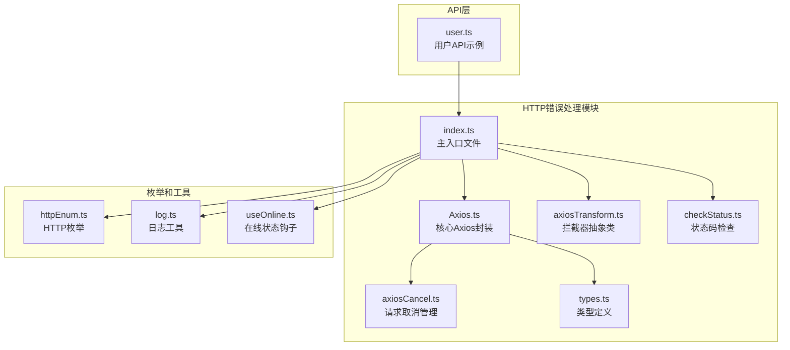
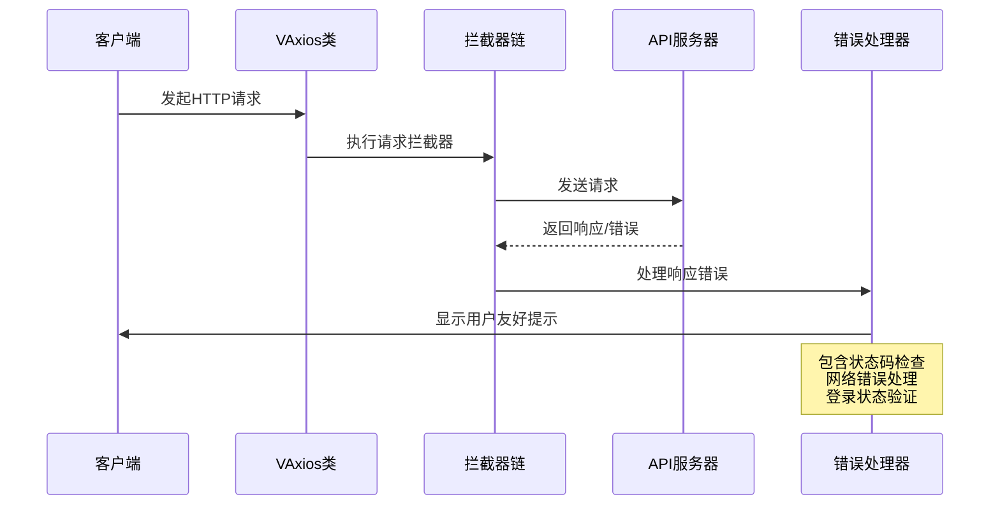
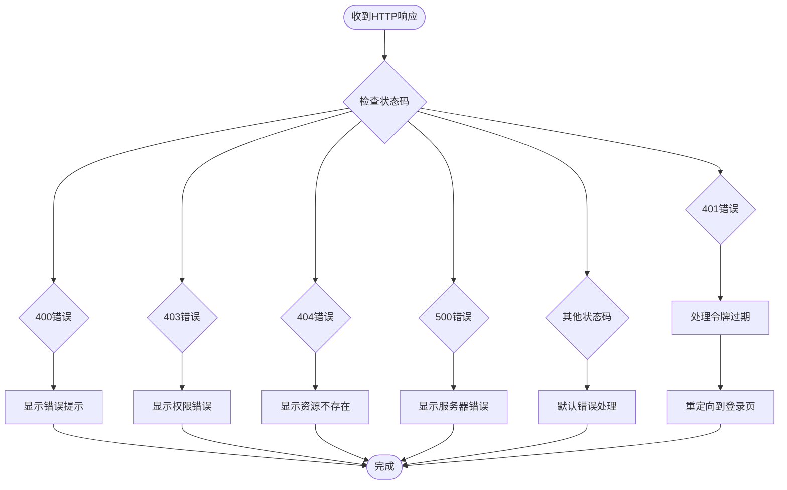
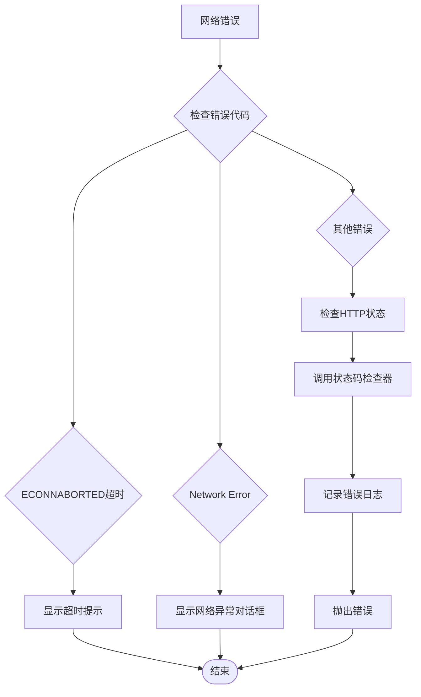
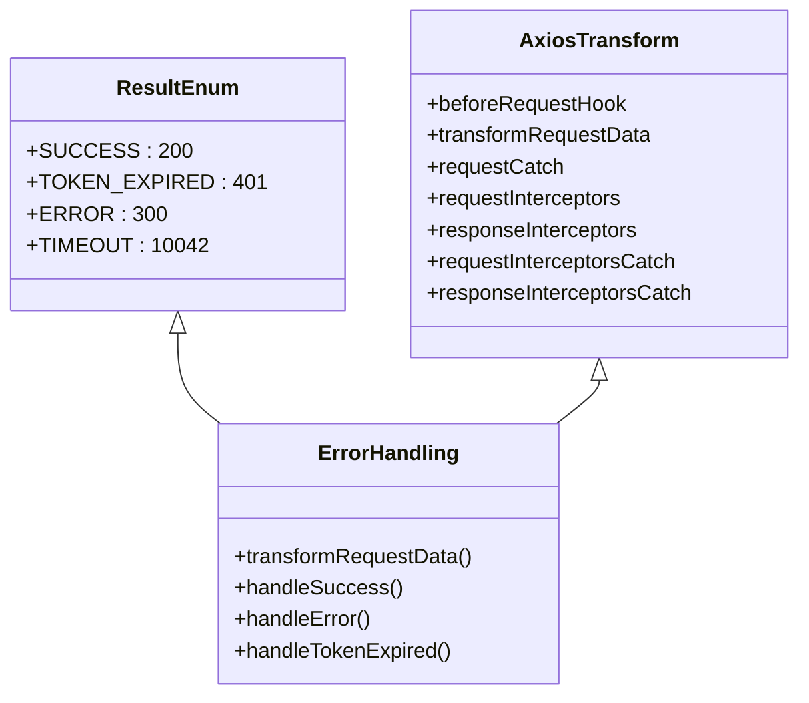
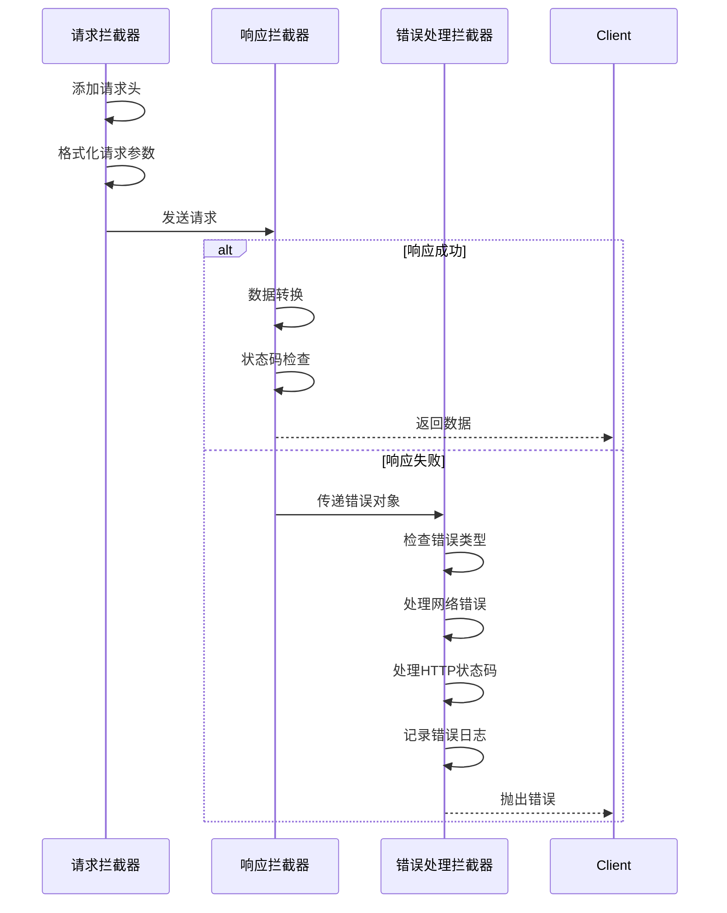
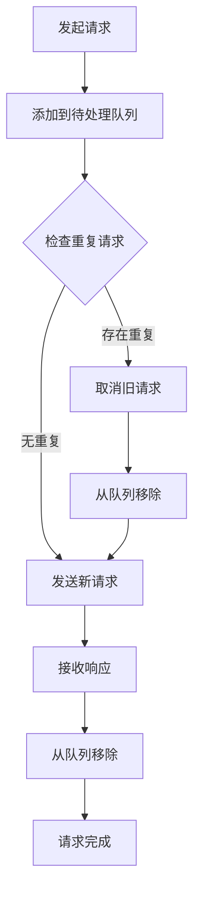
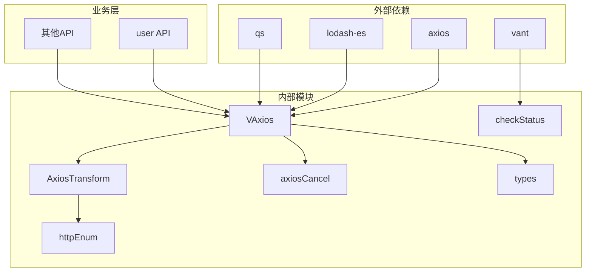

# 错误处理系统

<cite>
**本文档引用的文件**
- [checkStatus.ts](file://src/utils/http/axios/checkStatus.ts)
- [Axios.ts](file://src/utils/http/axios/Axios.ts)
- [axiosTransform.ts](file://src/utils/http/axios/axiosTransform.ts)
- [index.ts](file://src/utils/http/axios/index.ts)
- [types.ts](file://src/utils/http/axios/types.ts)
- [axiosCancel.ts](file://src/utils/http/axios/axiosCancel.ts)
- [httpEnum.ts](file://src/enums/httpEnum.ts)
- [log.ts](file://src/utils/log.ts)
- [useOnline.ts](file://src/hooks/useOnline.ts)
- [user.ts](file://src/api/system/user.ts)
</cite>

## 目录
1. [简介](#简介)
2. [项目结构](#项目结构)
3. [核心组件](#核心组件)
4. [架构概览](#架构概览)
5. [详细组件分析](#详细组件分析)
6. [依赖关系分析](#依赖关系分析)
7. [性能考虑](#性能考虑)
8. [故障排除指南](#故障排除指南)
9. [结论](#结论)

## 简介

本项目实现了完整的错误处理系统，涵盖了HTTP状态码检查、网络错误处理、服务端错误处理、错误拦截器等多个方面。系统基于Vue3和TypeScript构建，采用模块化设计，提供了灵活的错误处理策略和用户友好的错误提示机制。

## 项目结构

错误处理系统主要位于 `src/utils/http/axios/` 目录下，包含以下核心文件：



**图表来源**
- [index.ts:1-298](file://src/utils/http/axios/index.ts#L1-L298)
- [Axios.ts:1-225](file://src/utils/http/axios/Axios.ts#L1-L225)

**章节来源**
- [index.ts:1-298](file://src/utils/http/axios/index.ts#L1-L298)
- [Axios.ts:1-225](file://src/utils/http/axios/Axios.ts#L1-L225)

## 核心组件

### VAxios类 - 核心HTTP客户端

VAxios类是整个错误处理系统的核心，继承自Axios并扩展了多项功能：

- **请求拦截器管理**：支持请求前后的拦截器配置
- **响应处理**：统一的数据转换和错误处理
- **请求取消**：防止重复请求和内存泄漏
- **配置管理**：灵活的请求配置选项

### AxiosTransform抽象类 - 拦截器接口

定义了完整的拦截器生命周期：

- `beforeRequestHook`：请求前处理
- `transformRequestData`：响应数据转换
- `requestInterceptors`：请求拦截器
- `responseInterceptors`：响应拦截器
- `responseInterceptorsCatch`：响应错误处理

### 错误状态码检查器

实现了完整的HTTP状态码映射和用户友好提示：

- **4xx系列错误**：客户端错误处理
- **5xx系列错误**：服务器错误处理
- **超时处理**：网络请求超时检测
- **自定义消息**：针对不同错误类型的提示

**章节来源**
- [Axios.ts:18-225](file://src/utils/http/axios/Axios.ts#L18-L225)
- [axiosTransform.ts:13-52](file://src/utils/http/axios/axiosTransform.ts#L13-L52)
- [checkStatus.ts:3-48](file://src/utils/http/axios/checkStatus.ts#L3-L48)

## 架构概览



**图表来源**
- [index.ts:203-237](file://src/utils/http/axios/index.ts#L203-L237)
- [Axios.ts:175-223](file://src/utils/http/axios/Axios.ts#L175-L223)

## 详细组件分析

### HTTP状态码检查机制

系统实现了全面的HTTP状态码处理机制：



**图表来源**
- [checkStatus.ts:3-48](file://src/utils/http/axios/checkStatus.ts#L3-L48)

#### 状态码分类和处理策略

| 状态码范围 | 错误类型 | 处理策略 | 用户提示 |
|-----------|----------|----------|----------|
| 400 | 请求参数错误 | 显示错误信息 | 用户名或密码错误 |
| 401 | 未认证/令牌过期 | 登录重定向 | 令牌无效，请重新登录 |
| 403 | 权限不足 | 显示权限错误 | 没有访问权限 |
| 404 | 资源不存在 | 显示未找到 | 未找到该资源 |
| 405 | 方法不允许 | 显示方法错误 | 请求方法不被允许 |
| 408 | 请求超时 | 显示超时提示 | 网络请求超时 |
| 500 | 服务器内部错误 | 显示服务器错误 | 服务器错误，请联系管理员 |
| 501 | 功能未实现 | 显示未实现 | 网络未实现 |
| 502 | 网关错误 | 显示网关错误 | 网络错误 |
| 503 | 服务不可用 | 显示服务错误 | 服务暂时不可用 |
| 504 | 网关超时 | 显示网关超时 | 网络超时 |
| 505 | HTTP版本不支持 | 显示协议错误 | HTTP版本不支持 |

**章节来源**
- [checkStatus.ts:3-48](file://src/utils/http/axios/checkStatus.ts#L3-L48)
- [httpEnum.ts:4-10](file://src/enums/httpEnum.ts#L4-L10)

### 网络错误处理策略

系统提供了多层次的网络错误处理机制：



**图表来源**
- [index.ts:203-237](file://src/utils/http/axios/index.ts#L203-L237)

#### 网络错误场景处理

1. **连接超时处理**
   - 检测 `ECONNABORTED` 错误代码
   - 显示超时提示信息
   - 提供刷新重试建议

2. **DNS解析失败**
   - 捕获 `Network Error` 类型错误
   - 弹出网络异常对话框
   - 引导用户检查网络连接

3. **网络断开处理**
   - 通过Axios取消机制处理
   - 记录取消原因
   - 提供重新连接建议

**章节来源**
- [index.ts:203-237](file://src/utils/http/axios/index.ts#L203-L237)
- [axiosCancel.ts:15-65](file://src/utils/http/axios/axiosCancel.ts#L15-L65)

### 服务端错误处理

系统实现了完整的服务端错误处理逻辑：



**图表来源**
- [httpEnum.ts:4-10](file://src/enums/httpEnum.ts#L4-L10)
- [axiosTransform.ts:13-52](file://src/utils/http/axios/axiosTransform.ts#L13-L52)

#### 4xx状态码处理逻辑

- **400错误**：参数验证失败，显示具体的错误信息
- **401错误**：令牌过期或无效，自动重定向到登录页
- **403错误**：权限不足，提示用户无访问权限
- **404错误**：资源不存在，提示用户检查URL
- **405错误**：HTTP方法不被允许，提示正确的请求方法

#### 5xx状态码处理逻辑

- **500错误**：服务器内部错误，提示联系管理员
- **501错误**：功能未实现，提示功能暂不支持
- **502错误**：网关错误，提示网络问题
- **503错误**：服务不可用，提示稍后再试
- **504错误**：网关超时，提示网络超时
- **505错误**：HTTP版本不支持，提示浏览器升级

**章节来源**
- [index.ts:97-122](file://src/utils/http/axios/index.ts#L97-L122)
- [httpEnum.ts:4-10](file://src/enums/httpEnum.ts#L4-L10)

### 错误拦截器实现

系统采用拦截器模式实现错误处理：



**图表来源**
- [Axios.ts:175-223](file://src/utils/http/axios/Axios.ts#L175-L223)
- [index.ts:29-238](file://src/utils/http/axios/index.ts#L29-L238)

#### 拦截器功能特性

1. **请求拦截器**
   - 自动添加Authorization头
   - 参数格式化和时间戳处理
   - 请求预处理和验证

2. **响应拦截器**
   - 响应数据转换
   - 状态码验证
   - 错误信息提取

3. **错误处理拦截器**
   - 网络错误检测
   - HTTP状态码处理
   - 用户提示显示

**章节来源**
- [Axios.ts:175-223](file://src/utils/http/axios/Axios.ts#L175-L223)
- [index.ts:29-238](file://src/utils/http/axios/index.ts#L29-L238)

### 请求取消机制

系统实现了智能的请求取消机制，防止重复请求和内存泄漏：



**图表来源**
- [axiosCancel.ts:20-56](file://src/utils/http/axios/axiosCancel.ts#L20-L56)

#### 请求取消策略

1. **重复请求检测**
   - 基于URL、方法、参数生成唯一标识
   - 自动取消相同请求的重复调用

2. **内存管理**
   - 及时清理取消的请求
   - 防止内存泄漏

3. **用户体验**
   - 避免重复提交
   - 提供清晰的状态反馈

**章节来源**
- [axiosCancel.ts:15-65](file://src/utils/http/axios/axiosCancel.ts#L15-L65)

## 依赖关系分析



**图表来源**
- [index.ts:1-22](file://src/utils/http/axios/index.ts#L1-L22)
- [Axios.ts:1-13](file://src/utils/http/axios/Axios.ts#L1-L13)

### 关键依赖关系

1. **核心依赖**
   - `axios`：HTTP客户端库
   - `vant`：UI组件库，提供Toast和Dialog组件
   - `lodash-es`：工具函数库
   - `qs`：查询字符串处理

2. **内部耦合**
   - VAxios与AxiosTransform强耦合
   - 错误处理模块相互依赖
   - 类型定义贯穿整个系统

3. **业务集成**
   - API层通过http实例进行网络请求
   - 错误处理与业务逻辑解耦

**章节来源**
- [index.ts:1-22](file://src/utils/http/axios/index.ts#L1-L22)
- [Axios.ts:1-13](file://src/utils/http/axios/Axios.ts#L1-L13)

## 性能考虑

### 错误处理性能优化

1. **异步错误处理**
   - 使用Promise链处理异步错误
   - 避免阻塞主线程

2. **内存管理**
   - 及时清理取消的请求
   - 防止错误对象泄漏

3. **缓存策略**
   - 避免重复的错误提示
   - 合理的重试机制

### 用户体验优化

1. **即时反馈**
   - 错误发生时立即提示
   - 提供明确的解决方案

2. **优雅降级**
   - 网络异常时提供替代方案
   - 保持应用基本功能可用

## 故障排除指南

### 常见错误诊断

1. **登录状态异常**
   ```typescript
   // 检查令牌过期处理
   if (code === ResultEnum.TOKEN_EXPIRED) {
     // 处理登录重定向
   }
   ```

2. **网络连接问题**
   ```typescript
   // 检查网络错误处理
   if (err && err.includes('Network Error')) {
     // 显示网络异常提示
   }
   ```

3. **请求超时处理**
   ```typescript
   // 检查超时错误
   if (code === 'ECONNABORTED' && message.includes('timeout')) {
     // 显示超时提示
   }
   ```

### 调试技巧

1. **启用详细日志**
   - 使用console.log输出错误信息
   - 检查网络请求详情

2. **错误边界**
   - 在组件层面添加错误边界
   - 捕获未处理的异步错误

3. **测试策略**
   - 单元测试覆盖错误场景
   - 集成测试验证完整流程

**章节来源**
- [index.ts:203-237](file://src/utils/http/axios/index.ts#L203-L237)
- [log.ts:3-9](file://src/utils/log.ts#L3-L9)

## 结论

本错误处理系统提供了完整的HTTP错误处理解决方案，具有以下特点：

1. **全面的状态码支持**：覆盖所有常见HTTP状态码
2. **用户友好提示**：针对不同错误提供合适的用户提示
3. **智能网络处理**：有效处理各种网络异常情况
4. **可扩展架构**：基于拦截器模式，易于扩展和定制
5. **性能优化**：避免重复请求，合理处理内存使用

系统通过模块化设计和清晰的职责分离，为Vue3应用提供了可靠的错误处理基础，开发者可以根据具体需求进行定制和扩展。