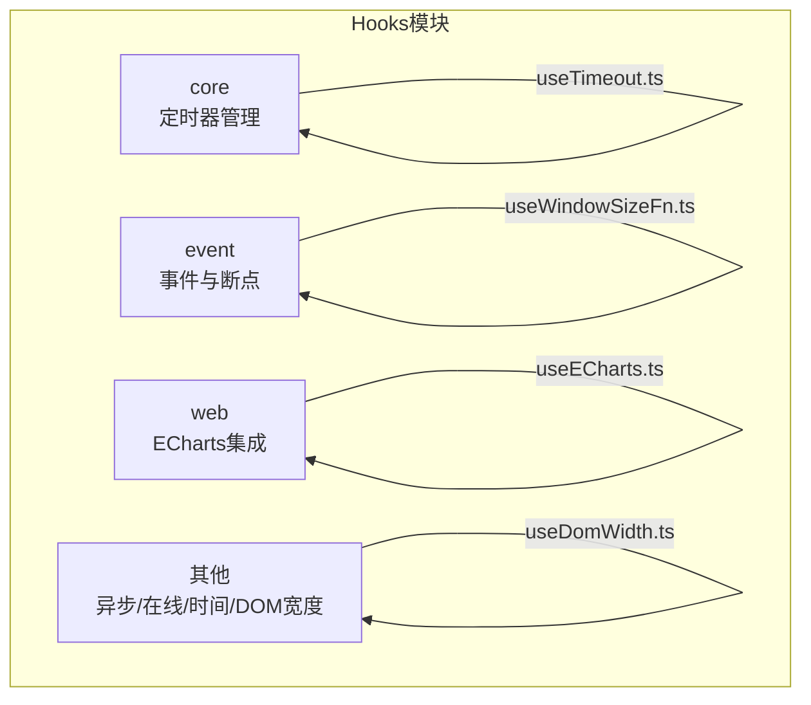
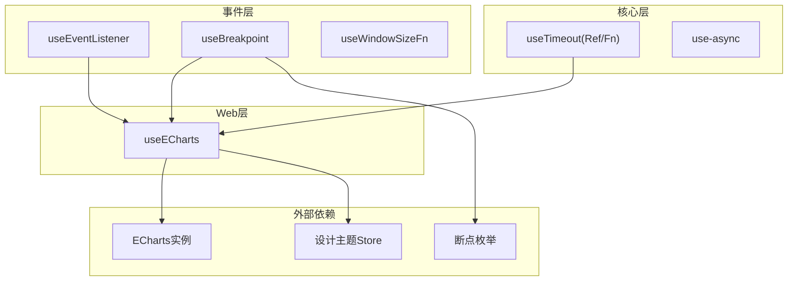
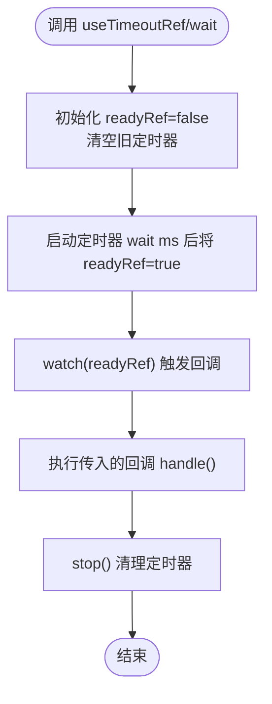
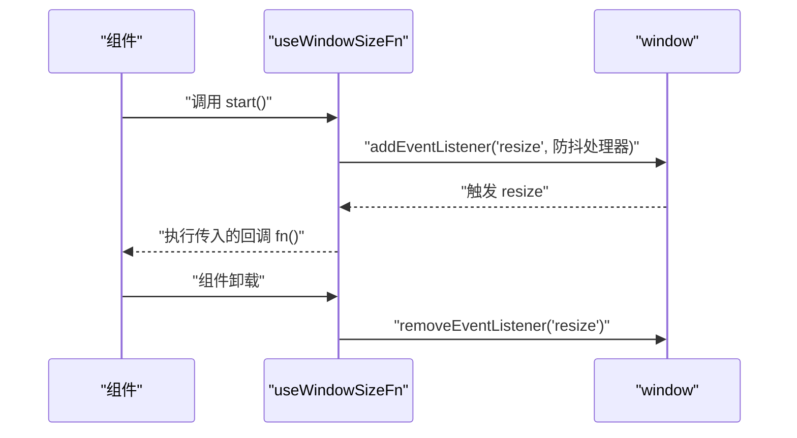
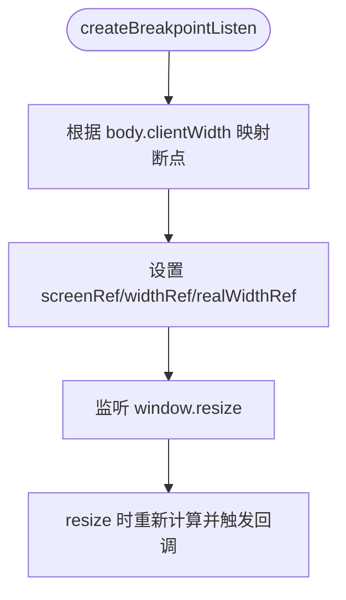
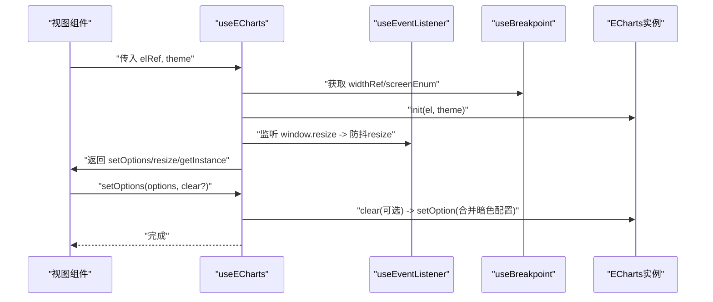
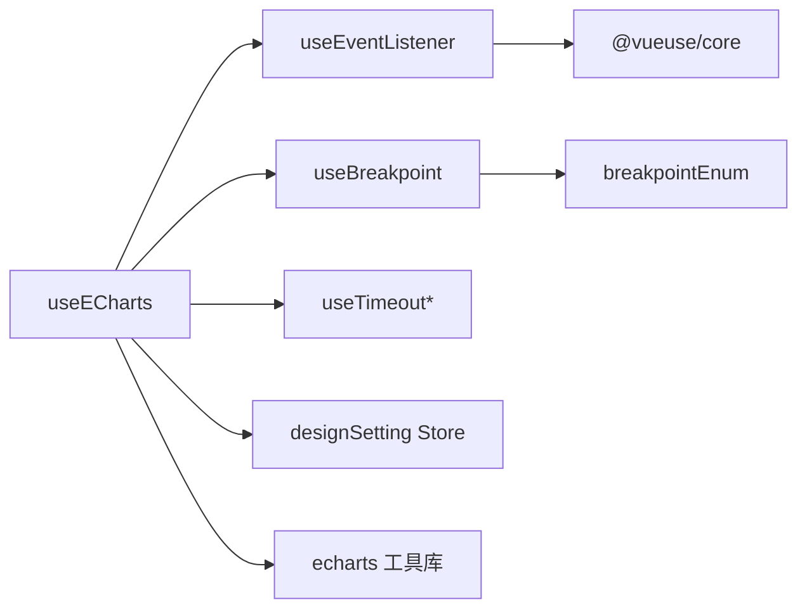

# Hooks系统

<cite>
**本文引用的文件**
- [src/hooks/index.ts](file://src/hooks/index.ts)
- [src/hooks/core/useTimeout.ts](file://src/hooks/core/useTimeout.ts)
- [src/hooks/event/useBreakpoint.ts](file://src/hooks/event/useBreakpoint.ts)
- [src/hooks/event/useEventListener.ts](file://src/hooks/event/useEventListener.ts)
- [src/hooks/event/useWindowSizeFn.ts](file://src/hooks/event/useWindowSizeFn.ts)
- [src/hooks/web/useECharts.ts](file://src/hooks/web/useECharts.ts)
- [src/hooks/use-async.ts](file://src/hooks/use-async.ts)
- [src/hooks/useDomWidth.ts](file://src/hooks/useDomWidth.ts)
- [src/hooks/useOnline.ts](file://src/hooks/useOnline.ts)
- [src/hooks/useTime.ts](file://src/hooks/useTime.ts)
- [src/enums/breakpointEnum.ts](file://src/enums/breakpointEnum.ts)
- [src/utils/lib/echarts.ts](file://src/utils/lib/echarts.ts)
- [src/store/modules/designSetting.ts](file://src/store/modules/designSetting.ts)
- [src/views/message/barChart.vue](file://src/views/message/barChart.vue)
- [src/views/message/lineChart.vue](file://src/views/message/lineChart.vue)
- [src/views/message/pieChart.vue](file://src/views/message/pieChart.vue)
</cite>

## 目录
1. [简介](#简介)
2. [项目结构](#项目结构)
3. [核心组件](#核心组件)
4. [架构总览](#架构总览)
5. [详细组件分析](#详细组件分析)
6. [依赖关系分析](#依赖关系分析)
7. [性能考量](#性能考量)
8. [故障排查指南](#故障排查指南)
9. [结论](#结论)
10. [附录：开发指南与示例](#附录开发指南与示例)

## 简介
本文件系统性梳理并解读本仓库中的Vue3自定义Hooks体系，围绕组合式API（Composition API）的设计理念与最佳实践展开，重点覆盖以下方面：
- 核心Hooks：定时器管理、窗口尺寸监听与断点检测
- 事件Hooks：DOM事件监听、窗口事件处理与响应式事件系统
- Web专用Hooks：ECharts图表集成与数据可视化
- 开发指南：命名规范、参数设计、返回值约定
- 使用示例与集成场景：结合实际页面组件展示如何在业务中落地

## 项目结构
本Hooks系统按功能域分层组织，主要目录如下：
- core：基础能力型Hooks，如定时器封装
- event：事件与窗口相关Hooks，如断点检测、事件监听、窗口尺寸函数
- web：Web端专用Hooks，如ECharts集成
- 其他：通用工具类Hooks，如异步执行、在线状态、时间显示、DOM宽度



**章节来源**
- [src/hooks/index.ts:1-4](file://src/hooks/index.ts#L1-L4)

## 核心组件
本节聚焦于核心Hooks的能力边界与使用方式，帮助快速定位与复用。

- 定时器管理（useTimeout系列）
  - 提供可取消、可重置的定时器封装，支持立即执行或等待到期触发
  - 返回状态引用与控制方法，便于在组件生命周期中自动清理
  - 参考路径：[useTimeout.ts:1-49](file://src/hooks/core/useTimeout.ts#L1-L49)

- 窗口尺寸监听（useWindowSizeFn）
  - 面向函数式场景的窗口尺寸变更监听，内置防抖策略
  - 支持一次性、即时触发与监听移除
  - 参考路径：[useWindowSizeFn.ts:1-36](file://src/hooks/event/useWindowSizeFn.ts#L1-L36)

- 断点检测（useBreakpoint/createBreakpointListen）
  - 统一的屏幕断点计算与全局状态暴露，支持回调扩展
  - 内部依赖事件监听与断点枚举
  - 参考路径：[useBreakpoint.ts:1-96](file://src/hooks/event/useBreakpoint.ts#L1-L96)，[breakpointEnum.ts:1-29](file://src/enums/breakpointEnum.ts#L1-L29)

- 事件监听（useEventListener）
  - 统一的事件绑定/解绑抽象，支持自动移除、防抖/节流
  - 对Element/Window/Ref等多形态输入进行兼容
  - 参考路径：[useEventListener.ts:1-62](file://src/hooks/event/useEventListener.ts#L1-L62)

- 异步执行（use-async）
  - 统一loading状态设置，简化异步流程
  - 支持Ref与响应式对象两种loading载体
  - 参考路径：[use-async.ts:1-17](file://src/hooks/use-async.ts#L1-L17)

- 在线状态（useOnline）
  - 监听浏览器在线/离线事件，暴露响应式online状态
  - 参考路径：[useOnline.ts:1-31](file://src/hooks/useOnline.ts#L1-L31)

- 时间显示（useTime）
  - 每秒更新的本地时间响应式状态，包含年月日与时分秒与星期
  - 参考路径：[useTime.ts:1-56](file://src/hooks/useTime.ts#L1-L56)

- DOM宽度（useDomWidth）
  - 响应式获取页面宽度，内部使用防抖优化
  - 参考路径：[useDomWidth.ts:1-24](file://src/hooks/useDomWidth.ts#L1-L24)

**章节来源**
- [src/hooks/core/useTimeout.ts:1-49](file://src/hooks/core/useTimeout.ts#L1-L49)
- [src/hooks/event/useWindowSizeFn.ts:1-36](file://src/hooks/event/useWindowSizeFn.ts#L1-L36)
- [src/hooks/event/useBreakpoint.ts:1-96](file://src/hooks/event/useBreakpoint.ts#L1-L96)
- [src/hooks/event/useEventListener.ts:1-62](file://src/hooks/event/useEventListener.ts#L1-L62)
- [src/hooks/use-async.ts:1-17](file://src/hooks/use-async.ts#L1-L17)
- [src/hooks/useOnline.ts:1-31](file://src/hooks/useOnline.ts#L1-L31)
- [src/hooks/useTime.ts:1-56](file://src/hooks/useTime.ts#L1-L56)
- [src/hooks/useDomWidth.ts:1-24](file://src/hooks/useDomWidth.ts#L1-L24)

## 架构总览
下图展示了Hooks之间的协作关系与数据流向，突出事件驱动、响应式状态与外部库（ECharts）的集成。



**图示来源**
- [src/hooks/event/useEventListener.ts:18-62](file://src/hooks/event/useEventListener.ts#L18-L62)
- [src/hooks/event/useBreakpoint.ts:29-96](file://src/hooks/event/useBreakpoint.ts#L29-L96)
- [src/hooks/event/useWindowSizeFn.ts:9-36](file://src/hooks/event/useWindowSizeFn.ts#L9-L36)
- [src/hooks/core/useTimeout.ts:5-49](file://src/hooks/core/useTimeout.ts#L5-L49)
- [src/hooks/web/useECharts.ts:14-123](file://src/hooks/web/useECharts.ts#L14-L123)
- [src/enums/breakpointEnum.ts:1-29](file://src/enums/breakpointEnum.ts#L1-L29)
- [src/store/modules/designSetting.ts:8-52](file://src/store/modules/designSetting.ts#L8-L52)

## 详细组件分析

### 定时器管理（useTimeout系列）
- 设计要点
  - 将setTimeout封装为可取消、可重置的响应式状态，避免直接操作原生定时器句柄
  - 提供两个API：useTimeoutRef用于底层状态与控制；useTimeoutFn用于“到期即执行”的便捷模式
  - 在组件卸载时自动清理，防止内存泄漏
- 关键流程



**图示来源**
- [src/hooks/core/useTimeout.ts:26-49](file://src/hooks/core/useTimeout.ts#L26-L49)

**章节来源**
- [src/hooks/core/useTimeout.ts:1-49](file://src/hooks/core/useTimeout.ts#L1-L49)

### 窗口尺寸监听（useWindowSizeFn）
- 设计要点
  - 面向函数式场景，将resize事件包装为可挂载/卸载的监听器
  - 内置防抖以降低频繁触发带来的性能压力
  - 生命周期钩子自动注册/移除事件
- 调用序列



**图示来源**
- [src/hooks/event/useWindowSizeFn.ts:9-36](file://src/hooks/event/useWindowSizeFn.ts#L9-L36)

**章节来源**
- [src/hooks/event/useWindowSizeFn.ts:1-36](file://src/hooks/event/useWindowSizeFn.ts#L1-L36)

### 断点检测（useBreakpoint/createBreakpointListen）
- 设计要点
  - 单次初始化：计算当前窗口宽度并映射到断点枚举
  - 全局暴露screenRef、widthRef、realWidthRef与枚举常量
  - 可选回调：当断点变化时触发扩展逻辑
- 流程图



**图示来源**
- [src/hooks/event/useBreakpoint.ts:29-96](file://src/hooks/event/useBreakpoint.ts#L29-L96)
- [src/enums/breakpointEnum.ts:1-29](file://src/enums/breakpointEnum.ts#L1-L29)

**章节来源**
- [src/hooks/event/useBreakpoint.ts:1-96](file://src/hooks/event/useBreakpoint.ts#L1-L96)
- [src/enums/breakpointEnum.ts:1-29](file://src/enums/breakpointEnum.ts#L1-L29)

### 事件监听（useEventListener）
- 设计要点
  - 统一事件绑定/解绑接口，支持自动移除与防抖/节流
  - 对element进行Ref包装，动态监听其变化并清理旧监听
  - 默认防抖，可通过参数关闭
- 类图

```mermaid
classDiagram
class UseEventListener {
+参数 : el,name,listener,options,autoRemove,isDebounce,wait
+返回 : { removeEvent }
+内部 : 添加/移除事件监听
+内部 : watch(element) 动态绑定
}
```

**图示来源**
- [src/hooks/event/useEventListener.ts:8-62](file://src/hooks/event/useEventListener.ts#L8-L62)

**章节来源**
- [src/hooks/event/useEventListener.ts:1-62](file://src/hooks/event/useEventListener.ts#L1-L62)

### ECharts集成（useECharts）
- 设计要点
  - 初始化ECharts实例，绑定窗口resize事件与断点变化
  - 主题切换：默认跟随设计主题Store，支持显式指定
  - 防抖resize与延迟刷新，确保容器尺寸稳定后再渲染
  - 自动清理：组件卸载时dispose实例并移除事件
- 调用序列



**图示来源**
- [src/hooks/web/useECharts.ts:14-123](file://src/hooks/web/useECharts.ts#L14-L123)
- [src/hooks/event/useEventListener.ts:18-62](file://src/hooks/event/useEventListener.ts#L18-L62)
- [src/hooks/event/useBreakpoint.ts:19-26](file://src/hooks/event/useBreakpoint.ts#L19-L26)
- [src/store/modules/designSetting.ts:8-52](file://src/store/modules/designSetting.ts#L8-L52)

**章节来源**
- [src/hooks/web/useECharts.ts:1-123](file://src/hooks/web/useECharts.ts#L1-L123)
- [src/utils/lib/echarts.ts:1-58](file://src/utils/lib/echarts.ts#L1-L58)

### 其他通用Hooks
- 异步执行（use-async）
  - 统一loading状态设置，简化Promise流程
  - 支持Ref与响应式对象
  - 参考路径：[use-async.ts:1-17](file://src/hooks/use-async.ts#L1-L17)

- 在线状态（useOnline）
  - 监听online/offline事件，暴露响应式online
  - 参考路径：[useOnline.ts:1-31](file://src/hooks/useOnline.ts#L1-L31)

- 时间显示（useTime）
  - 每秒更新的本地时间响应式状态
  - 参考路径：[useTime.ts:1-56](file://src/hooks/useTime.ts#L1-L56)

- DOM宽度（useDomWidth）
  - 响应式获取页面宽度，内部使用防抖
  - 参考路径：[useDomWidth.ts:1-24](file://src/hooks/useDomWidth.ts#L1-L24)

**章节来源**
- [src/hooks/use-async.ts:1-17](file://src/hooks/use-async.ts#L1-L17)
- [src/hooks/useOnline.ts:1-31](file://src/hooks/useOnline.ts#L1-L31)
- [src/hooks/useTime.ts:1-56](file://src/hooks/useTime.ts#L1-L56)
- [src/hooks/useDomWidth.ts:1-24](file://src/hooks/useDomWidth.ts#L1-L24)

## 依赖关系分析
- 组件内聚与耦合
  - useECharts对事件监听、断点检测、定时器与设计主题Store存在直接依赖，体现“高内聚、低耦合”的设计
  - useEventListener作为通用事件抽象，被多个场景复用
- 外部依赖
  - ECharts通过工具库统一引入，减少按需引入的复杂度
  - VueUse提供防抖/节流、生命周期钩子等常用能力
- 循环依赖
  - 当前结构未见循环依赖，各模块职责清晰



**图示来源**
- [src/hooks/web/useECharts.ts:14-123](file://src/hooks/web/useECharts.ts#L14-L123)
- [src/hooks/event/useEventListener.ts:18-62](file://src/hooks/event/useEventListener.ts#L18-L62)
- [src/hooks/event/useBreakpoint.ts:29-96](file://src/hooks/event/useBreakpoint.ts#L29-L96)
- [src/enums/breakpointEnum.ts:1-29](file://src/enums/breakpointEnum.ts#L1-L29)
- [src/utils/lib/echarts.ts:1-58](file://src/utils/lib/echarts.ts#L1-L58)
- [src/store/modules/designSetting.ts:8-52](file://src/store/modules/designSetting.ts#L8-L52)

**章节来源**
- [src/hooks/web/useECharts.ts:14-123](file://src/hooks/web/useECharts.ts#L14-L123)
- [src/hooks/event/useEventListener.ts:18-62](file://src/hooks/event/useEventListener.ts#L18-L62)
- [src/hooks/event/useBreakpoint.ts:29-96](file://src/hooks/event/useBreakpoint.ts#L29-L96)
- [src/enums/breakpointEnum.ts:1-29](file://src/enums/breakpointEnum.ts#L1-L29)
- [src/utils/lib/echarts.ts:1-58](file://src/utils/lib/echarts.ts#L1-L58)
- [src/store/modules/designSetting.ts:8-52](file://src/store/modules/designSetting.ts#L8-L52)

## 性能考量
- 防抖与节流
  - useWindowSizeFn与useEventListener均内置防抖/节流，建议在高频事件（resize、scroll）场景优先使用
- 生命周期管理
  - 所有事件监听与定时器均在组件卸载时清理，避免内存泄漏
- 渲染优化
  - useECharts在暗色模式与容器尺寸不稳定时采用延迟与防抖策略，减少无效渲染
- 计算属性与懒初始化
  - useBreakpoint与useECharts通过computed与懒初始化降低不必要开销

[本节为通用指导，无需列出具体文件来源]

## 故障排查指南
- ECharts未渲染或尺寸异常
  - 检查容器高度是否为有效数值，确认初始化时机与容器尺寸稳定
  - 参考路径：[useECharts.ts:40-83](file://src/hooks/web/useECharts.ts#L40-L83)
- 主题切换后图表未更新
  - 确认主题Store变更是否触发实例dispose与重新初始化
  - 参考路径：[useECharts.ts:89-98](file://src/hooks/web/useECharts.ts#L89-L98)，[designSetting.ts:8-52](file://src/store/modules/designSetting.ts#L8-L52)
- resize事件导致频繁重绘
  - 确认是否启用了防抖，或在上层业务中再次包裹防抖
  - 参考路径：[useWindowSizeFn.ts:9-36](file://src/hooks/event/useWindowSizeFn.ts#L9-L36)，[useEventListener.ts:18-62](file://src/hooks/event/useEventListener.ts#L18-L62)
- 断点判断不准确
  - 检查断点阈值与body.clientWidth取值是否符合预期
  - 参考路径：[useBreakpoint.ts:33-75](file://src/hooks/event/useBreakpoint.ts#L33-L75)，[breakpointEnum.ts:1-29](file://src/enums/breakpointEnum.ts#L1-L29)

**章节来源**
- [src/hooks/web/useECharts.ts:40-98](file://src/hooks/web/useECharts.ts#L40-L98)
- [src/store/modules/designSetting.ts:8-52](file://src/store/modules/designSetting.ts#L8-L52)
- [src/hooks/event/useWindowSizeFn.ts:9-36](file://src/hooks/event/useWindowSizeFn.ts#L9-L36)
- [src/hooks/event/useEventListener.ts:18-62](file://src/hooks/event/useEventListener.ts#L18-L62)
- [src/hooks/event/useBreakpoint.ts:33-75](file://src/hooks/event/useBreakpoint.ts#L33-L75)
- [src/enums/breakpointEnum.ts:1-29](file://src/enums/breakpointEnum.ts#L1-L29)

## 结论
本Hooks系统以组合式API为核心，围绕事件、窗口、定时器与Web可视化构建了高内聚、易复用的模块化能力。通过统一的事件抽象、断点枚举与ECharts集成，既保证了开发效率，也兼顾了性能与可维护性。建议在新业务中优先使用现有Hooks，并遵循本文的开发指南与最佳实践。

[本节为总结性内容，无需列出具体文件来源]

## 附录：开发指南与示例

### 命名规范
- Hooks函数以“use”开头，返回值通常为对象或元组
- 参数命名清晰表达意图，布尔开关语义明确
- 返回值约定：事件类返回移除函数；状态类返回响应式引用；函数类返回控制方法

### 参数设计与返回值约定
- 事件监听
  - 参数：el、name、listener、options、autoRemove、isDebounce、wait
  - 返回：{ removeEvent }
  - 参考路径：[useEventListener.ts:8-62](file://src/hooks/event/useEventListener.ts#L8-L62)
- 窗口尺寸
  - 参数：fn、wait、options（once/immediate/listenerOptions）
  - 返回：[start, stop]
  - 参考路径：[useWindowSizeFn.ts:3-36](file://src/hooks/event/useWindowSizeFn.ts#L3-L36)
- 断点检测
  - 参数：无（单次初始化），可选回调参数对象
  - 返回：全局screenRef/widthRef/realWidthRef与枚举
  - 参考路径：[useBreakpoint.ts:19-96](file://src/hooks/event/useBreakpoint.ts#L19-L96)
- 定时器
  - 参数：handle、wait、native
  - 返回：{ readyRef, stop, start }
  - 参考路径：[useTimeout.ts:5-49](file://src/hooks/core/useTimeout.ts#L5-L49)
- ECharts
  - 参数：elRef、theme
  - 返回：{ setOptions, resize, getInstance }
  - 参考路径：[useECharts.ts:14-123](file://src/hooks/web/useECharts.ts#L14-L123)

### 使用示例与集成场景
- ECharts图表集成
  - 在页面中声明ref容器，调用useECharts并传入容器ref，随后在mounted中设置图表选项
  - 参考路径：
    - [barChart.vue:1-111](file://src/views/message/barChart.vue#L1-L111)
    - [lineChart.vue:1-124](file://src/views/message/lineChart.vue#L1-L124)
    - [pieChart.vue:1-70](file://src/views/message/pieChart.vue#L1-L70)
- 在线状态与时间显示
  - 在组件中调用useOnline与useTime，即可获得响应式状态并在模板中展示
  - 参考路径：[useOnline.ts:1-31](file://src/hooks/useOnline.ts#L1-L31)，[useTime.ts:1-56](file://src/hooks/useTime.ts#L1-L56)
- DOM宽度与窗口尺寸
  - 使用useDomWidth与useWindowSizeFn在组件中获取实时宽度与监听窗口变化
  - 参考路径：[useDomWidth.ts:1-24](file://src/hooks/useDomWidth.ts#L1-L24)，[useWindowSizeFn.ts:1-36](file://src/hooks/event/useWindowSizeFn.ts#L1-L36)

**章节来源**
- [src/hooks/event/useEventListener.ts:8-62](file://src/hooks/event/useEventListener.ts#L8-L62)
- [src/hooks/event/useWindowSizeFn.ts:3-36](file://src/hooks/event/useWindowSizeFn.ts#L3-L36)
- [src/hooks/event/useBreakpoint.ts:19-96](file://src/hooks/event/useBreakpoint.ts#L19-L96)
- [src/hooks/core/useTimeout.ts:5-49](file://src/hooks/core/useTimeout.ts#L5-L49)
- [src/hooks/web/useECharts.ts:14-123](file://src/hooks/web/useECharts.ts#L14-L123)
- [src/views/message/barChart.vue:1-111](file://src/views/message/barChart.vue#L1-L111)
- [src/views/message/lineChart.vue:1-124](file://src/views/message/lineChart.vue#L1-L124)
- [src/views/message/pieChart.vue:1-70](file://src/views/message/pieChart.vue#L1-L70)
- [src/hooks/useOnline.ts:1-31](file://src/hooks/useOnline.ts#L1-L31)
- [src/hooks/useTime.ts:1-56](file://src/hooks/useTime.ts#L1-L56)
- [src/hooks/useDomWidth.ts:1-24](file://src/hooks/useDomWidth.ts#L1-L24)