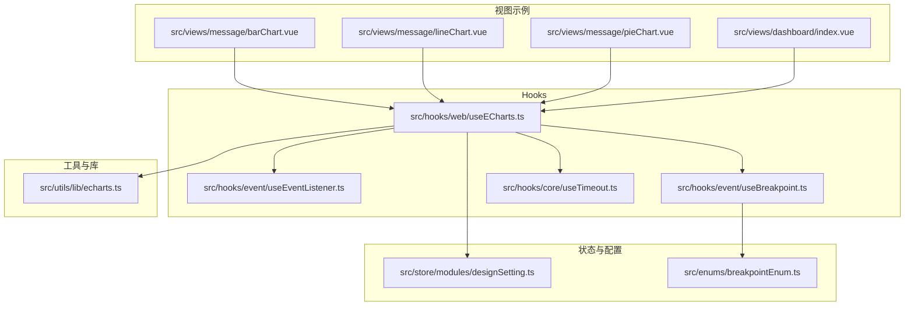
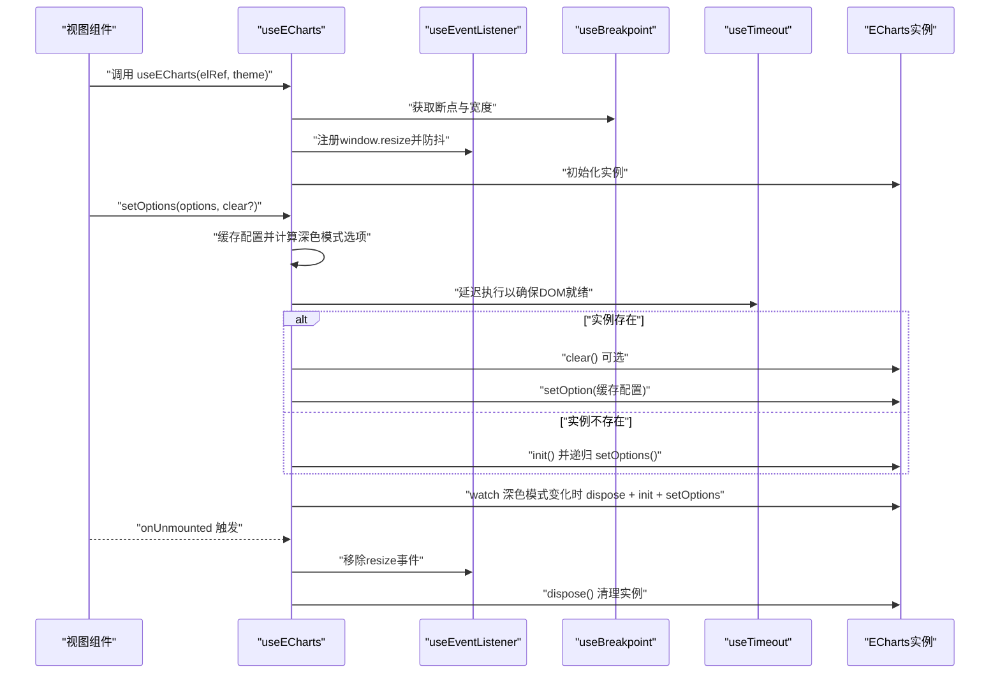
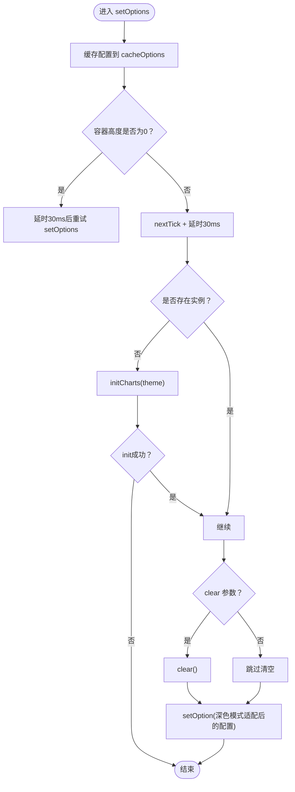
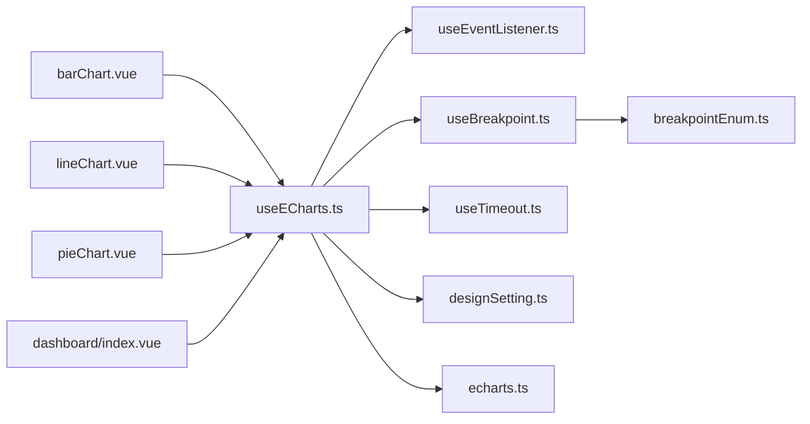

# Web专用Hooks

<cite>
**本文引用的文件**
- [useECharts.ts](file://src/hooks/web/useECharts.ts)
- [echarts.ts](file://src/utils/lib/echarts.ts)
- [useBreakpoint.ts](file://src/hooks/event/useBreakpoint.ts)
- [useEventListener.ts](file://src/hooks/event/useEventListener.ts)
- [useTimeout.ts](file://src/hooks/core/useTimeout.ts)
- [designSetting.ts](file://src/store/modules/designSetting.ts)
- [breakpointEnum.ts](file://src/enums/breakpointEnum.ts)
- [barChart.vue](file://src/views/message/barChart.vue)
- [lineChart.vue](file://src/views/message/lineChart.vue)
- [pieChart.vue](file://src/views/message/pieChart.vue)
- [index.vue](file://src/views/dashboard/index.vue)
</cite>

## 目录
1. [简介](#简介)
2. [项目结构](#项目结构)
3. [核心组件](#核心组件)
4. [架构总览](#架构总览)
5. [详细组件分析](#详细组件分析)
6. [依赖关系分析](#依赖关系分析)
7. [性能考量](#性能考量)
8. [故障排查指南](#故障排查指南)
9. [结论](#结论)
10. [附录](#附录)

## 简介
本文件聚焦于Web专用Hooks中的useECharts图表Hooks，系统性解析其在Vue3生态下的实现与最佳实践。内容覆盖：
- ECharts实例管理：初始化、销毁与内存清理
- 图表配置与动态更新：缓存策略、深色模式适配与主题切换
- 响应式设计：容器尺寸监听、断点适配与防抖重绘
- 集成实践：数据格式转换、主题适配、交互事件处理
- 使用示例与常见问题解决方案

## 项目结构
本项目采用按功能域分层组织，Web专用Hooks位于src/hooks/web目录，图表库封装位于src/utils/lib，配套视图示例位于src/views/message。

**图表来源**
- [useECharts.ts:1-123](file://src/hooks/web/useECharts.ts#L1-L123)
- [useEventListener.ts:1-62](file://src/hooks/event/useEventListener.ts#L1-L62)
- [useBreakpoint.ts:1-96](file://src/hooks/event/useBreakpoint.ts#L1-L96)
- [useTimeout.ts:1-49](file://src/hooks/core/useTimeout.ts#L1-L49)
- [echarts.ts:1-58](file://src/utils/lib/echarts.ts#L1-L58)
- [designSetting.ts:1-52](file://src/store/modules/designSetting.ts#L1-L52)
- [breakpointEnum.ts:1-29](file://src/enums/breakpointEnum.ts#L1-L29)
- [barChart.vue:1-111](file://src/views/message/barChart.vue#L1-L111)
- [lineChart.vue:1-124](file://src/views/message/lineChart.vue#L1-L124)
- [pieChart.vue:1-70](file://src/views/message/pieChart.vue#L1-L70)
- [index.vue:1-131](file://src/views/dashboard/index.vue#L1-L131)

**章节来源**
- [useECharts.ts:1-123](file://src/hooks/web/useECharts.ts#L1-L123)
- [echarts.ts:1-58](file://src/utils/lib/echarts.ts#L1-L58)
- [useBreakpoint.ts:1-96](file://src/hooks/event/useBreakpoint.ts#L1-L96)
- [useEventListener.ts:1-62](file://src/hooks/event/useEventListener.ts#L1-L62)
- [useTimeout.ts:1-49](file://src/hooks/core/useTimeout.ts#L1-L49)
- [designSetting.ts:1-52](file://src/store/modules/designSetting.ts#L1-L52)
- [breakpointEnum.ts:1-29](file://src/enums/breakpointEnum.ts#L1-L29)
- [barChart.vue:1-111](file://src/views/message/barChart.vue#L1-L111)
- [lineChart.vue:1-124](file://src/views/message/lineChart.vue#L1-L124)
- [pieChart.vue:1-70](file://src/views/message/pieChart.vue#L1-L70)
- [index.vue:1-131](file://src/views/dashboard/index.vue#L1-L131)

## 核心组件
- useECharts：提供ECharts实例生命周期管理、配置缓存、深色模式适配、窗口尺寸监听与防抖重绘、卸载时的资源清理。
- echarts库封装：按需引入图表与组件，统一导出，避免全量打包。
- 断点与事件监听：useBreakpoint与useEventListener为useECharts提供响应式与事件绑定能力。
- 设计主题：Pinia状态管理提供深色/浅色模式与主题色，驱动图表主题切换。

**章节来源**
- [useECharts.ts:14-122](file://src/hooks/web/useECharts.ts#L14-L122)
- [echarts.ts:32-55](file://src/utils/lib/echarts.ts#L32-L55)
- [useBreakpoint.ts:19-26](file://src/hooks/event/useBreakpoint.ts#L19-L26)
- [useEventListener.ts:18-61](file://src/hooks/event/useEventListener.ts#L18-L61)
- [designSetting.ts:8-32](file://src/store/modules/designSetting.ts#L8-L32)

## 架构总览
useECharts通过组合多个底层Hooks与工具，形成“配置缓存 + 实例管理 + 响应式适配”的闭环。其关键流程如下：

**图表来源**
- [useECharts.ts:40-98](file://src/hooks/web/useECharts.ts#L40-L98)
- [useEventListener.ts:18-61](file://src/hooks/event/useEventListener.ts#L18-L61)
- [useBreakpoint.ts:29-95](file://src/hooks/event/useBreakpoint.ts#L29-L95)
- [useTimeout.ts:5-24](file://src/hooks/core/useTimeout.ts#L5-L24)

## 详细组件分析

### useECharts 组件分析
- 输入输出
  - 输入：DOM容器引用elRef、主题选择theme（'light' | 'dark' | 'default'）
  - 输出：setOptions(options, clear?)、resize()、getInstance()、echarts工具
- 关键实现要点
  - 实例管理：内部维护chartInstance，首次渲染时init，卸载时dispose；支持运行时getInstance懒加载。
  - 配置缓存：cacheOptions缓存传入的EChartsOption，配合computed生成深色模式下的透明背景选项。
  - 响应式适配：注册window.resize事件并使用防抖；结合断点信息在小屏或初始高度为0时延时触发resize。
  - 生命周期：watch深色模式变化时，先dispose旧实例，再以新主题init并恢复缓存配置；组件卸载时统一清理事件与实例。
  - 更新策略：setOptions支持clear参数，默认清空后设置新配置；若容器高度为0则延时重试，确保渲染稳定性。

**图表来源**
- [useECharts.ts:61-83](file://src/hooks/web/useECharts.ts#L61-L83)
- [useECharts.ts:40-59](file://src/hooks/web/useECharts.ts#L40-L59)
- [useTimeout.ts:5-24](file://src/hooks/core/useTimeout.ts#L5-L24)

**章节来源**
- [useECharts.ts:14-122](file://src/hooks/web/useECharts.ts#L14-L122)

### ECharts 库封装分析
- 按需引入：仅注册常用图表与组件，减少包体积。
- 统一导出：集中管理导入与注册，便于全局复用。

**章节来源**
- [echarts.ts:32-57](file://src/utils/lib/echarts.ts#L32-L57)

### 断点与事件监听分析
- 断点监听：提供screenRef、widthRef、screenEnum等，用于判断当前屏幕尺寸并触发回调。
- 事件监听：通用事件绑定与移除，支持防抖/节流，自动在组件卸载时清理。

**章节来源**
- [useBreakpoint.ts:19-95](file://src/hooks/event/useBreakpoint.ts#L19-L95)
- [useEventListener.ts:18-61](file://src/hooks/event/useEventListener.ts#L18-L61)

### 设计主题与深色模式
- Pinia状态：维护darkMode、appTheme等，提供getter与持久化。
- useECharts集成：当theme为'default'时，读取store的darkMode作为实际主题；watch到变化时重建实例并恢复配置。

**章节来源**
- [designSetting.ts:8-32](file://src/store/modules/designSetting.ts#L8-L32)
- [useECharts.ts:18-22](file://src/hooks/web/useECharts.ts#L18-L22)
- [useECharts.ts:89-98](file://src/hooks/web/useECharts.ts#L89-L98)

### 视图示例与最佳实践
- 柱状图、折线图、饼图示例均通过ref持有容器，调用useECharts并传入容器引用，随后在mounted中设置options。
- 主题适配：从设计状态store读取appTheme作为图表主色，保证与全局主题一致。
- 数据格式：遵循EChartsOption结构，合理配置color、tooltip、legend、grid、xAxis/yAxis、series等字段。

**章节来源**
- [barChart.vue:12-107](file://src/views/message/barChart.vue#L12-L107)
- [lineChart.vue:12-120](file://src/views/message/lineChart.vue#L12-L120)
- [pieChart.vue:12-66](file://src/views/message/pieChart.vue#L12-L66)
- [designSetting.ts:20-22](file://src/store/modules/designSetting.ts#L20-L22)

## 依赖关系分析
useECharts的依赖关系如下：

**图表来源**
- [useECharts.ts:9-12](file://src/hooks/web/useECharts.ts#L9-L12)
- [useEventListener.ts:1-62](file://src/hooks/event/useEventListener.ts#L1-L62)
- [useBreakpoint.ts:1-96](file://src/hooks/event/useBreakpoint.ts#L1-L96)
- [useTimeout.ts:1-49](file://src/hooks/core/useTimeout.ts#L1-L49)
- [designSetting.ts:1-52](file://src/store/modules/designSetting.ts#L1-L52)
- [echarts.ts:1-58](file://src/utils/lib/echarts.ts#L1-L58)
- [breakpointEnum.ts:1-29](file://src/enums/breakpointEnum.ts#L1-L29)
- [barChart.vue:1-111](file://src/views/message/barChart.vue#L1-L111)
- [lineChart.vue:1-124](file://src/views/message/lineChart.vue#L1-L124)
- [pieChart.vue:1-70](file://src/views/message/pieChart.vue#L1-L70)
- [index.vue:1-131](file://src/views/dashboard/index.vue#L1-L131)

**章节来源**
- [useECharts.ts:1-123](file://src/hooks/web/useECharts.ts#L1-L123)
- [useEventListener.ts:1-62](file://src/hooks/event/useEventListener.ts#L1-L62)
- [useBreakpoint.ts:1-96](file://src/hooks/event/useBreakpoint.ts#L1-L96)
- [useTimeout.ts:1-49](file://src/hooks/core/useTimeout.ts#L1-L49)
- [designSetting.ts:1-52](file://src/store/modules/designSetting.ts#L1-L52)
- [echarts.ts:1-58](file://src/utils/lib/echarts.ts#L1-L58)
- [breakpointEnum.ts:1-29](file://src/enums/breakpointEnum.ts#L1-L29)
- [barChart.vue:1-111](file://src/views/message/barChart.vue#L1-L111)
- [lineChart.vue:1-124](file://src/views/message/lineChart.vue#L1-L124)
- [pieChart.vue:1-70](file://src/views/message/pieChart.vue#L1-L70)
- [index.vue:1-131](file://src/views/dashboard/index.vue#L1-L131)

## 性能考量
- 防抖与节流：resize事件通过useEventListener进行防抖，降低重绘频率，提升大屏设备滚动体验。
- 延时策略：在容器高度为0或小屏场景下，使用useTimeoutFn延时触发resize/setOptions，避免无效渲染。
- 实例复用：通过缓存EChartsOption与单实例管理，减少重复初始化成本。
- 包体积优化：echarts按需引入，仅注册常用图表与组件，降低首屏加载时间。

[本节为通用性能建议，不直接分析具体文件]

## 故障排查指南
- 图表不显示或空白
  - 检查容器ref是否正确传递，且elRef指向真实DOM元素。
  - 若容器初始高度为0，等待后续布局完成后再次调用setOptions。
  - 参考路径：[useECharts.ts:61-68](file://src/hooks/web/useECharts.ts#L61-L68)
- 图表未随主题切换而更新
  - 确认theme传参为'default'以启用store的darkMode；watch到变化会自动dispose/init并恢复配置。
  - 参考路径：[useECharts.ts:89-98](file://src/hooks/web/useECharts.ts#L89-L98)
- resize频繁导致卡顿
  - 确认useEventListener的防抖生效；必要时适当增大wait参数。
  - 参考路径：[useEventListener.ts:24-26](file://src/hooks/event/useEventListener.ts#L24-L26)
- 卸载后内存未释放
  - 确保组件在onUnmounted阶段触发；检查tryOnUnmounted逻辑是否执行。
  - 参考路径：[useECharts.ts:100-107](file://src/hooks/web/useECharts.ts#L100-L107)
- 小屏适配异常
  - 检查useBreakpoint返回的screenRef与screenEnum是否符合预期；确认小屏场景下延时resize逻辑生效。
  - 参考路径：[useBreakpoint.ts:53-58](file://src/hooks/event/useBreakpoint.ts#L53-L58)

**章节来源**
- [useECharts.ts:61-68](file://src/hooks/web/useECharts.ts#L61-L68)
- [useECharts.ts:89-98](file://src/hooks/web/useECharts.ts#L89-L98)
- [useEventListener.ts:24-26](file://src/hooks/event/useEventListener.ts#L24-L26)
- [useBreakpoint.ts:53-58](file://src/hooks/event/useBreakpoint.ts#L53-L58)

## 结论
useECharts通过“配置缓存 + 实例管理 + 响应式适配 + 生命周期清理”的设计，在Vue3项目中提供了稳定、可扩展的图表集成方案。结合Pinia主题状态与断点监听，能够高效应对多端、多主题场景；配合示例组件，开发者可快速落地各类图表需求。

[本节为总结性内容，不直接分析具体文件]

## 附录

### 使用示例索引
- 柱状图：参考 [barChart.vue:12-107](file://src/views/message/barChart.vue#L12-L107)
- 折线图：参考 [lineChart.vue:12-120](file://src/views/message/lineChart.vue#L12-L120)
- 饼图：参考 [pieChart.vue:12-66](file://src/views/message/pieChart.vue#L12-L66)
- 首页介绍：参考 [index.vue:67-69](file://src/views/dashboard/index.vue#L67-L69)

### API 一览
- 函数
  - setOptions(options: EChartsOption, clear?: boolean): void
  - resize(): void
  - getInstance(): echarts.ECharts | null
  - echarts: ECharts静态工具对象
- 参数
  - elRef: Ref<HTMLDivElement>
  - theme: 'light' | 'dark' | 'default'

**章节来源**
- [useECharts.ts:14-122](file://src/hooks/web/useECharts.ts#L14-L122)
- [barChart.vue:12-107](file://src/views/message/barChart.vue#L12-L107)
- [lineChart.vue:12-120](file://src/views/message/lineChart.vue#L12-L120)
- [pieChart.vue:12-66](file://src/views/message/pieChart.vue#L12-L66)
- [index.vue:67-69](file://src/views/dashboard/index.vue#L67-L69)