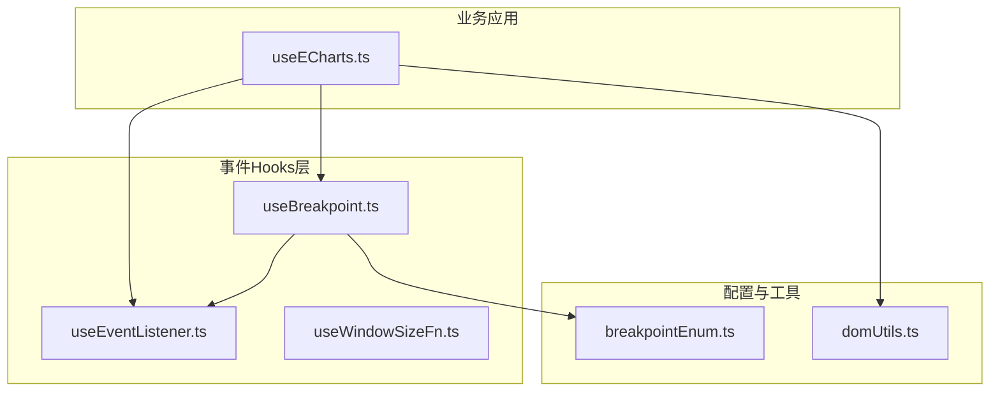
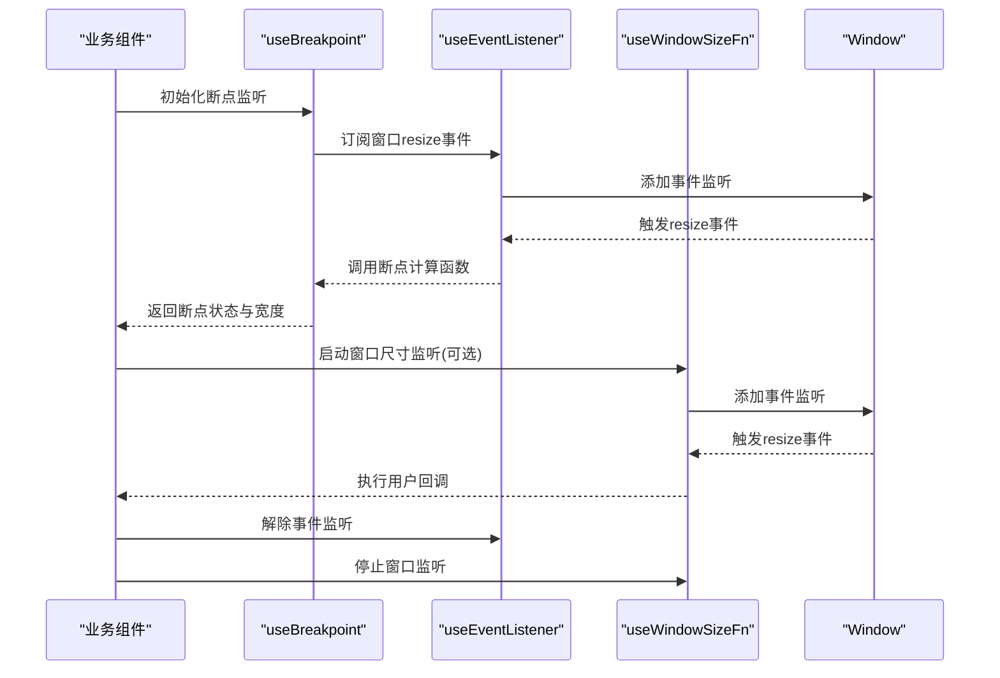
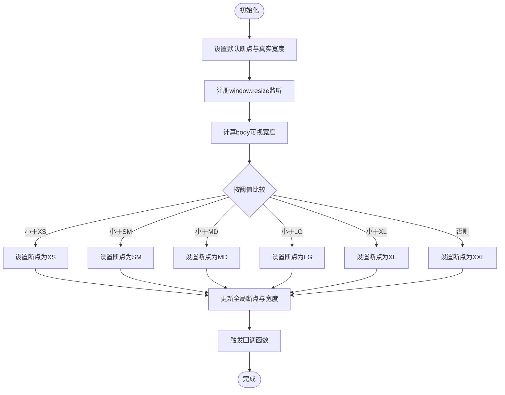
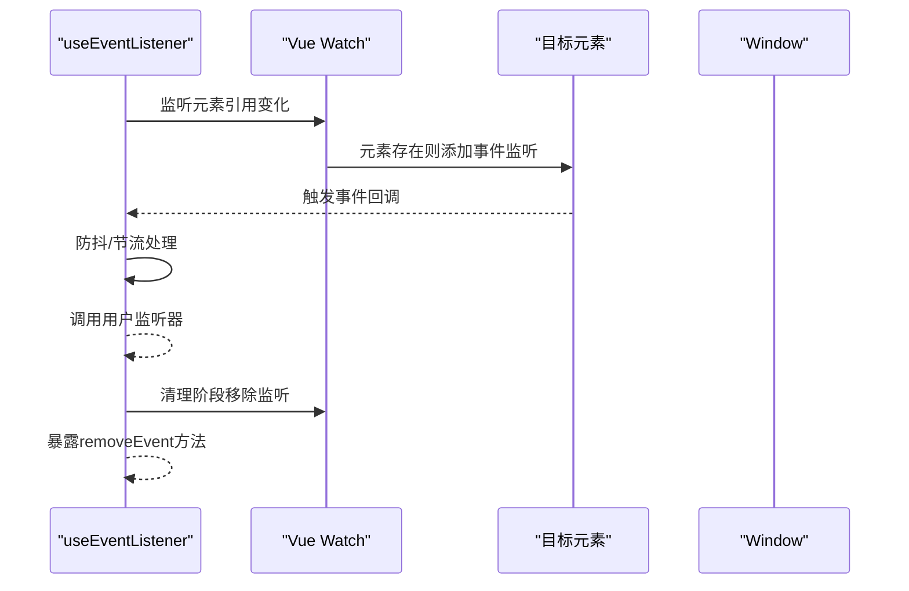
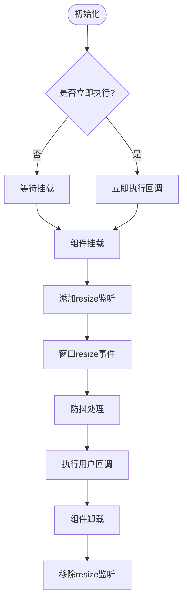
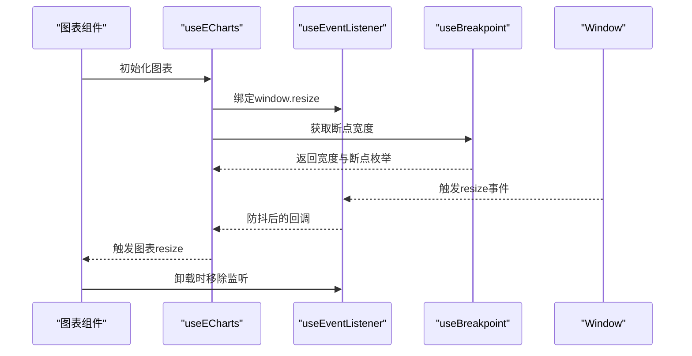
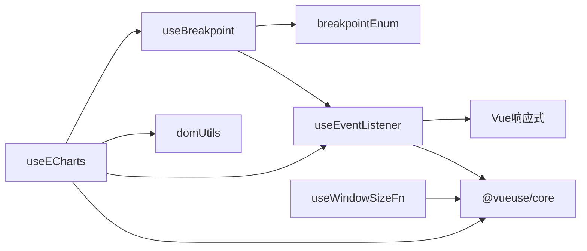

# 事件Hooks

<cite>
**本文引用的文件**
- [useBreakpoint.ts](file://src/hooks/event/useBreakpoint.ts)
- [useEventListener.ts](file://src/hooks/event/useEventListener.ts)
- [useWindowSizeFn.ts](file://src/hooks/event/useWindowSizeFn.ts)
- [breakpointEnum.ts](file://src/enums/breakpointEnum.ts)
- [domUtils.ts](file://src/utils/domUtils.ts)
- [useECharts.ts](file://src/hooks/web/useECharts.ts)
- [useTimeout.ts](file://src/hooks/core/useTimeout.ts)
</cite>

## 目录
1. [简介](#简介)
2. [项目结构](#项目结构)
3. [核心组件](#核心组件)
4. [架构总览](#架构总览)
5. [详细组件分析](#详细组件分析)
6. [依赖关系分析](#依赖关系分析)
7. [性能考量](#性能考量)
8. [故障排查指南](#故障排查指南)
9. [结论](#结论)
10. [附录](#附录)

## 简介
本文件聚焦于事件Hooks系统，围绕以下三个核心Hooks进行深入解析：
- 断点检测Hooks（useBreakpoint）：负责监听窗口尺寸变化，基于预设断点阈值计算当前屏幕尺寸类别，并提供实时宽度与断点枚举。
- DOM事件监听Hooks（useEventListener）：统一管理事件绑定与解绑，支持防抖/节流、自动清理、跨浏览器兼容等能力。
- 窗口尺寸监听Hooks（useWindowSizeFn）：提供窗口resize事件的监听封装，内置防抖优化与生命周期管理。

文档将从代码结构、数据流、处理逻辑、集成点、错误处理与性能特性等方面进行全面剖析，并给出最佳实践与优化建议。

## 项目结构
事件Hooks位于 src/hooks/event 目录下，配合断点枚举与通用DOM工具，形成完整的事件与响应式断点体系；同时在业务组件中通过 useECharts 等模块实际应用这些Hooks。

图表来源
- [useBreakpoint.ts:1-96](file://src/hooks/event/useBreakpoint.ts#L1-L96)
- [useEventListener.ts:1-62](file://src/hooks/event/useEventListener.ts#L1-L62)
- [useWindowSizeFn.ts:1-36](file://src/hooks/event/useWindowSizeFn.ts#L1-L36)
- [breakpointEnum.ts:1-29](file://src/enums/breakpointEnum.ts#L1-L29)
- [domUtils.ts:1-200](file://src/utils/domUtils.ts#L1-L200)
- [useECharts.ts:1-123](file://src/hooks/web/useECharts.ts#L1-L123)

章节来源
- [useBreakpoint.ts:1-96](file://src/hooks/event/useBreakpoint.ts#L1-L96)
- [useEventListener.ts:1-62](file://src/hooks/event/useEventListener.ts#L1-L62)
- [useWindowSizeFn.ts:1-36](file://src/hooks/event/useWindowSizeFn.ts#L1-L36)
- [breakpointEnum.ts:1-29](file://src/enums/breakpointEnum.ts#L1-L29)
- [domUtils.ts:1-200](file://src/utils/domUtils.ts#L1-L200)
- [useECharts.ts:1-123](file://src/hooks/web/useECharts.ts#L1-L123)

## 核心组件
- 断点检测Hooks（useBreakpoint）
  - 提供全局断点状态：当前断点类别、断点对应像素宽度、真实窗口宽度。
  - 内部通过监听window.resize事件，结合断点映射表计算当前断点类别。
  - 支持一次性初始化监听器与回调触发。
- DOM事件监听Hooks（useEventListener）
  - 统一事件绑定/解绑流程，支持元素引用动态变化、自动清理、可选防抖/节流。
  - 默认使用防抖策略，避免高频事件导致的性能问题。
- 窗口尺寸监听Hooks（useWindowSizeFn）
  - 基于防抖函数封装窗口resize事件，提供启动/停止方法与生命周期钩子。
  - 可选择立即执行一次或延迟到挂载后开始监听。

章节来源
- [useBreakpoint.ts:19-95](file://src/hooks/event/useBreakpoint.ts#L19-L95)
- [useEventListener.ts:18-61](file://src/hooks/event/useEventListener.ts#L18-L61)
- [useWindowSizeFn.ts:9-35](file://src/hooks/event/useWindowSizeFn.ts#L9-L35)

## 架构总览
事件Hooks系统采用“配置驱动 + 生命周期管理”的设计模式：
- 配置层：断点枚举定义了断点类别与阈值映射。
- 事件层：统一事件管理，支持防抖/节流与自动清理。
- 应用层：业务组件通过Hooks组合使用，确保事件处理的一致性与可维护性。

图表来源
- [useBreakpoint.ts:29-95](file://src/hooks/event/useBreakpoint.ts#L29-L95)
- [useEventListener.ts:18-61](file://src/hooks/event/useEventListener.ts#L18-L61)
- [useWindowSizeFn.ts:9-35](file://src/hooks/event/useWindowSizeFn.ts#L9-L35)

## 详细组件分析

### 断点检测Hooks（useBreakpoint）
- 设计要点
  - 使用全局computed引用保存断点状态，保证多处订阅时共享同一状态。
  - 通过监听window.resize事件，计算body可视宽度并映射到断点类别。
  - 提供回调函数以通知外部断点变化，便于执行特定逻辑。
- 数据结构与复杂度
  - 断点映射为常量Map，查找复杂度O(1)。
  - 断点计算为线性比较，复杂度O(1)，每次resize调用。
- 关键流程
  - 初始化：设置默认断点类别与真实宽度。
  - 监听：注册window.resize事件，计算断点并触发回调。
  - 导出：提供screenRef、widthRef、realWidthRef与断点枚举。

图表来源
- [useBreakpoint.ts:29-88](file://src/hooks/event/useBreakpoint.ts#L29-L88)
- [breakpointEnum.ts:1-29](file://src/enums/breakpointEnum.ts#L1-L29)

章节来源
- [useBreakpoint.ts:19-95](file://src/hooks/event/useBreakpoint.ts#L19-L95)
- [breakpointEnum.ts:1-29](file://src/enums/breakpointEnum.ts#L1-L29)

### DOM事件监听Hooks（useEventListener）
- 设计要点
  - 接受元素引用、事件名、监听器、选项、是否自动移除、是否防抖/节流及等待时间。
  - 使用Vue的watch监听元素引用变化，动态添加/移除事件监听。
  - 默认启用防抖策略，减少高频事件对性能的影响。
- 关键流程
  - 创建防抖/节流处理器（可选）。
  - 在元素可用时添加事件监听，并在cleanup中自动移除。
  - 提供removeEvent方法手动解除监听与取消watch。

图表来源
- [useEventListener.ts:18-61](file://src/hooks/event/useEventListener.ts#L18-L61)

章节来源
- [useEventListener.ts:1-62](file://src/hooks/event/useEventListener.ts#L1-L62)

### 窗口尺寸监听Hooks（useWindowSizeFn）
- 设计要点
  - 基于防抖函数封装resize事件，避免频繁触发。
  - 提供start/stop方法与生命周期钩子，确保组件卸载时正确清理。
  - 支持立即执行一次与监听选项配置。
- 关键流程
  - 初始化：根据配置决定是否立即执行一次回调。
  - 监听：在mounted时添加事件监听，在unmounted时移除。
  - 回调：每次resize触发时执行用户提供的函数。

图表来源
- [useWindowSizeFn.ts:9-35](file://src/hooks/event/useWindowSizeFn.ts#L9-L35)

章节来源
- [useWindowSizeFn.ts:1-36](file://src/hooks/event/useWindowSizeFn.ts#L1-L36)

### 实际应用示例（useECharts）
- 应用场景
  - 图表初始化后监听window.resize事件，使用防抖优化resize处理。
  - 结合断点信息判断是否需要延迟触发resize，确保图表渲染正确。
- 关键点
  - 使用useEventListener绑定window.resize。
  - 使用useBreakpoint获取断点宽度，用于条件触发resize。
  - 在组件卸载时调用removeEvent与dispose释放资源。

图表来源
- [useECharts.ts:14-123](file://src/hooks/web/useECharts.ts#L14-L123)
- [useEventListener.ts:18-61](file://src/hooks/event/useEventListener.ts#L18-L61)
- [useBreakpoint.ts:19-95](file://src/hooks/event/useBreakpoint.ts#L19-L95)

章节来源
- [useECharts.ts:1-123](file://src/hooks/web/useECharts.ts#L1-L123)

## 依赖关系分析
- useBreakpoint依赖
  - 断点枚举：提供断点类别与阈值映射。
  - useEventListener：用于注册window.resize事件监听。
- useEventListener依赖
  - Vue响应式系统：通过watch监听元素引用变化。
  - @vueuse/core：提供防抖/节流函数。
- useWindowSizeFn依赖
  - @vueuse/core：提供生命周期钩子与防抖函数。
- useECharts依赖
  - useEventListener、useBreakpoint、@vueuse/core、echarts库。

图表来源
- [useBreakpoint.ts:1-96](file://src/hooks/event/useBreakpoint.ts#L1-L96)
- [useEventListener.ts:1-62](file://src/hooks/event/useEventListener.ts#L1-L62)
- [useWindowSizeFn.ts:1-36](file://src/hooks/event/useWindowSizeFn.ts#L1-L36)
- [breakpointEnum.ts:1-29](file://src/enums/breakpointEnum.ts#L1-L29)
- [domUtils.ts:1-200](file://src/utils/domUtils.ts#L1-L200)
- [useECharts.ts:1-123](file://src/hooks/web/useECharts.ts#L1-L123)

章节来源
- [useBreakpoint.ts:1-96](file://src/hooks/event/useBreakpoint.ts#L1-L96)
- [useEventListener.ts:1-62](file://src/hooks/event/useEventListener.ts#L1-L62)
- [useWindowSizeFn.ts:1-36](file://src/hooks/event/useWindowSizeFn.ts#L1-L36)
- [breakpointEnum.ts:1-29](file://src/enums/breakpointEnum.ts#L1-L29)
- [domUtils.ts:1-200](file://src/utils/domUtils.ts#L1-L200)
- [useECharts.ts:1-123](file://src/hooks/web/useECharts.ts#L1-L123)

## 性能考量
- 防抖与节流
  - useEventListener默认启用防抖，有效降低高频事件的处理频率。
  - useWindowSizeFn与useECharts内部也使用防抖，避免resize带来的重绘压力。
- 自动清理
  - useEventListener在元素引用变化或组件卸载时自动移除监听，防止内存泄漏。
  - useWindowSizeFn在unmounted时移除监听，确保生命周期内资源可控。
- 条件触发
  - useBreakpoint仅在断点变化时触发回调，减少不必要的计算。
  - useECharts结合断点宽度与元素高度，延迟触发resize，提升首屏体验。
- 最佳实践
  - 对高频事件（如resize、scroll）优先使用防抖/节流。
  - 在组件卸载时显式调用removeEvent或依赖自动清理。
  - 合理设置wait参数，平衡响应速度与性能消耗。

章节来源
- [useEventListener.ts:18-61](file://src/hooks/event/useEventListener.ts#L18-L61)
- [useWindowSizeFn.ts:9-35](file://src/hooks/event/useWindowSizeFn.ts#L9-L35)
- [useECharts.ts:25-58](file://src/hooks/web/useECharts.ts#L25-L58)

## 故障排查指南
- 事件未触发
  - 检查元素引用是否为undefined或空，watch不会添加监听。
  - 确认事件名拼写正确且目标元素支持该事件。
- 监听未清理
  - 确认autoRemove为true或手动调用removeEvent。
  - 在组件卸载时检查是否调用了removeEvent或依赖生命周期钩子。
- 性能问题
  - 检查wait参数是否过大或过小，适当调整以平衡响应与性能。
  - 避免在回调中执行昂贵操作，必要时拆分任务或使用requestAnimationFrame。
- 断点不生效
  - 确认断点枚举与断点映射一致，body可视宽度计算正确。
  - 检查断点回调是否被正确触发，以及全局状态是否被正确更新。

章节来源
- [useEventListener.ts:18-61](file://src/hooks/event/useEventListener.ts#L18-L61)
- [useWindowSizeFn.ts:9-35](file://src/hooks/event/useWindowSizeFn.ts#L9-L35)
- [useBreakpoint.ts:29-95](file://src/hooks/event/useBreakpoint.ts#L29-L95)

## 结论
事件Hooks系统通过统一的事件管理、断点计算与生命周期控制，为Vue3应用提供了稳定、高效的事件处理方案。结合防抖/节流与自动清理机制，既能满足复杂的交互需求，又能保障性能与资源安全。在实际开发中，建议遵循本文的最佳实践，合理配置参数与触发时机，以获得更佳的用户体验与开发效率。

## 附录
- 相关工具函数
  - domUtils提供基础事件绑定/解绑与RAF节流等工具，作为底层支撑。
- 相关Hooks
  - useTimeout与useTimeoutFn用于延时控制，常见于图表初始化与resize触发的延迟处理。

章节来源
- [domUtils.ts:151-199](file://src/utils/domUtils.ts#L151-L199)
- [useTimeout.ts:1-49](file://src/hooks/core/useTimeout.ts#L1-L49)