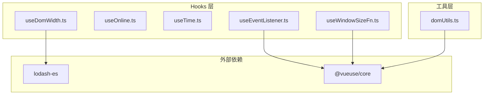
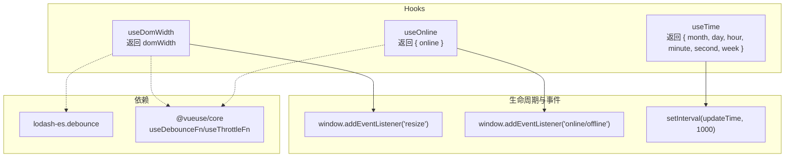
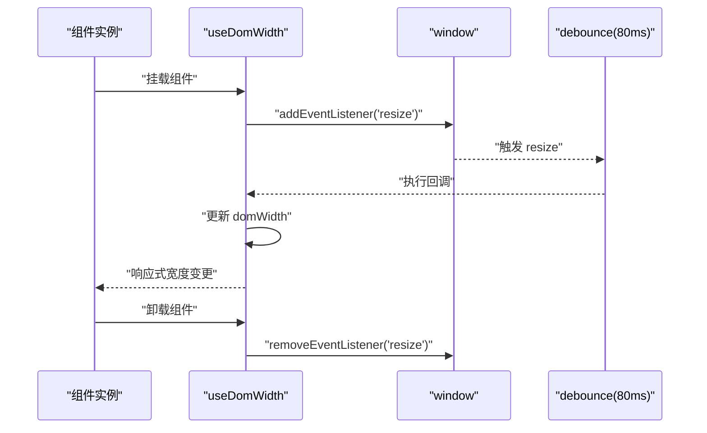
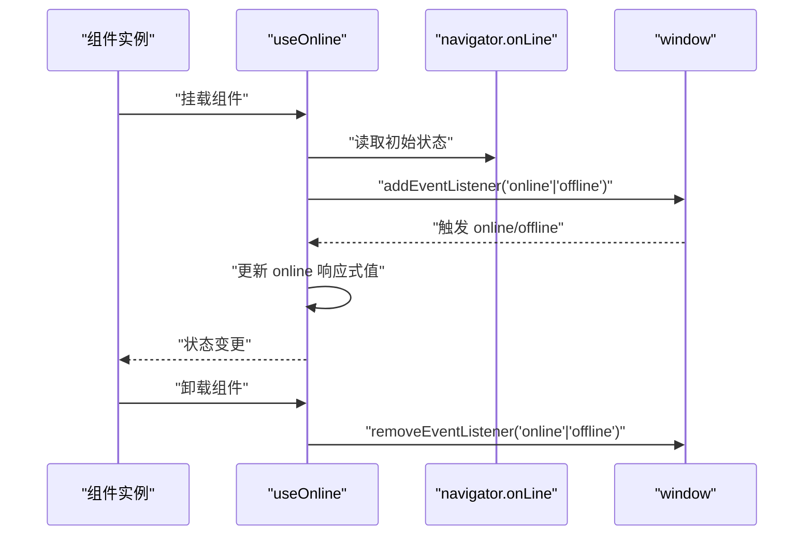
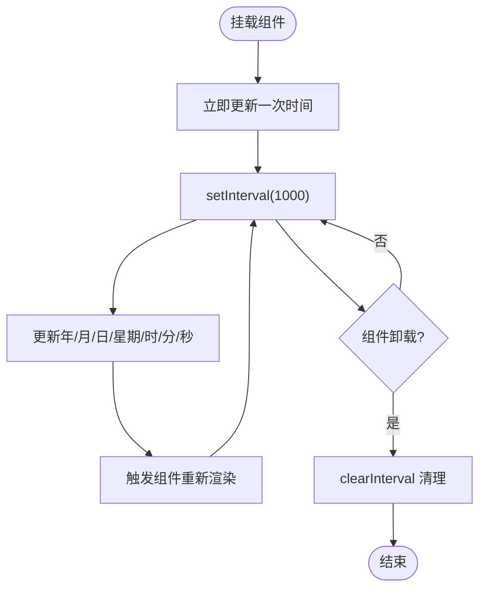
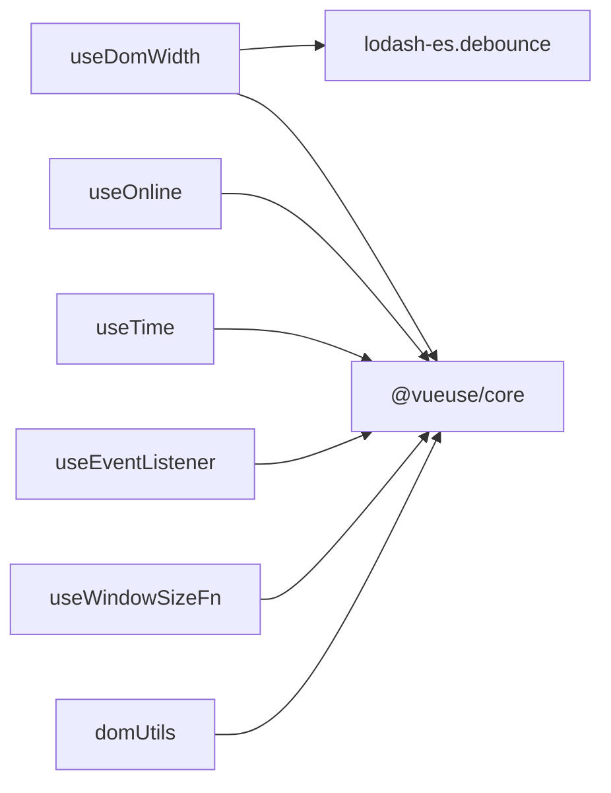

# 工具Hooks

<cite>
**本文引用的文件**
- [useDomWidth.ts](file://src/hooks/useDomWidth.ts)
- [useOnline.ts](file://src/hooks/useOnline.ts)
- [useTime.ts](file://src/hooks/useTime.ts)
- [useEventListener.ts](file://src/hooks/event/useEventListener.ts)
- [useWindowSizeFn.ts](file://src/hooks/event/useWindowSizeFn.ts)
- [domUtils.ts](file://src/utils/domUtils.ts)
- [index.ts](file://src/hooks/index.ts)
- [package.json](file://package.json)
</cite>

## 目录
1. [简介](#简介)
2. [项目结构](#项目结构)
3. [核心组件](#核心组件)
4. [架构总览](#架构总览)
5. [详细组件分析](#详细组件分析)
6. [依赖分析](#依赖分析)
7. [性能考量](#性能考量)
8. [故障排查指南](#故障排查指南)
9. [结论](#结论)
10. [附录](#附录)

## 简介
本文件聚焦于仓库中的三类工具型 Vue3 Hooks：DOM 宽度获取（useDomWidth）、在线状态检测（useOnline）、时间管理（useTime）。文档从实现原理、数据流与控制流、性能优化策略、与其他 Hooks 的组合方式以及最佳实践等方面进行系统化梳理，帮助开发者在移动端与多端环境下高效、稳定地使用这些 Hooks。

## 项目结构
- Hooks 文件位于 src/hooks 下，按功能域分层组织：
  - 核心工具：useDomWidth.ts、useOnline.ts、useTime.ts
  - 事件相关：useEventListener.ts、useWindowSizeFn.ts
  - 工具函数：domUtils.ts 提供 DOM 辅助能力（节流/防抖、事件绑定等）
- 依赖方面，项目使用了 @vueuse/core（如 useDebounceFn、useThrottleFn 等），以及 lodash-es 的防抖工具。

**图示来源**
- [useDomWidth.ts:1-24](file://src/hooks/useDomWidth.ts#L1-L24)
- [useOnline.ts:1-31](file://src/hooks/useOnline.ts#L1-L31)
- [useTime.ts:1-56](file://src/hooks/useTime.ts#L1-L56)
- [useEventListener.ts:1-62](file://src/hooks/event/useEventListener.ts#L1-L62)
- [useWindowSizeFn.ts:1-35](file://src/hooks/event/useWindowSizeFn.ts#L1-L35)
- [domUtils.ts:1-200](file://src/utils/domUtils.ts#L1-L200)
- [package.json:41-56](file://package.json#L41-L56)

**章节来源**
- [useDomWidth.ts:1-24](file://src/hooks/useDomWidth.ts#L1-L24)
- [useOnline.ts:1-31](file://src/hooks/useOnline.ts#L1-L31)
- [useTime.ts:1-56](file://src/hooks/useTime.ts#L1-L56)
- [useEventListener.ts:1-62](file://src/hooks/event/useEventListener.ts#L1-L62)
- [useWindowSizeFn.ts:1-35](file://src/hooks/event/useWindowSizeFn.ts#L1-L35)
- [domUtils.ts:1-200](file://src/utils/domUtils.ts#L1-L200)
- [package.json:41-56](file://package.json#L41-L56)

## 核心组件
- useDomWidth：返回响应式页面宽度（body 可视区宽度），通过窗口 resize 事件监听并使用防抖降低频繁更新带来的性能压力。
- useOnline：返回当前网络在线状态，监听 online/offline 事件，初始化时根据 navigator.onLine 设置初始值。
- useTime：返回本地时间的多个字段（年、月、日、星期、时、分、秒），每秒更新一次，清理定时器以避免内存泄漏。

**章节来源**
- [useDomWidth.ts:8-23](file://src/hooks/useDomWidth.ts#L8-L23)
- [useOnline.ts:6-30](file://src/hooks/useOnline.ts#L6-L30)
- [useTime.ts:6-55](file://src/hooks/useTime.ts#L6-L55)

## 架构总览
下图展示了三个 Hooks 的运行时交互关系与依赖：

**图示来源**
- [useDomWidth.ts:15-20](file://src/hooks/useDomWidth.ts#L15-L20)
- [useOnline.ts:16-27](file://src/hooks/useOnline.ts#L16-L27)
- [useTime.ts:45-52](file://src/hooks/useTime.ts#L45-L52)
- [useEventListener.ts:34-34](file://src/hooks/event/useEventListener.ts#L34-L34)
- [package.json:41-56](file://package.json#L41-L56)

## 详细组件分析

### useDomWidth 组件分析
- 功能定位：提供页面可视区宽度的响应式值，便于根据屏幕宽度做布局或样式调整。
- 实现要点：
  - 初始化：读取 body 可视区宽度作为初始值。
  - 监听：在 mounted 时为 window 绑定 resize 事件；卸载时移除监听。
  - 防抖：使用 lodash-es 的防抖对回调进行节流，减少高频 resize 导致的重复渲染。
- 数据流与控制流：
  - 初始渲染：读取当前宽度。
  - 事件触发：窗口尺寸变化 -> 防抖回调 -> 更新响应式宽度。
  - 卸载清理：移除事件监听，避免内存泄漏。
- 性能优化：
  - 防抖阈值：默认 80ms，平衡更新频率与视觉一致性。
  - 仅监听 resize，避免额外计算。
- 典型使用场景：
  - 移动端自适应布局、卡片宽度随屏适配、图表容器宽度动态计算。
- 与其他 Hooks 的组合：
  - 可与 useWindowSizeFn 结合，统一窗口尺寸监听策略。
  - 可与 useEventListener 自定义事件处理，实现更灵活的监听参数（如节流/防抖开关、等待时长）。

**图示来源**
- [useDomWidth.ts:15-20](file://src/hooks/useDomWidth.ts#L15-L20)

**章节来源**
- [useDomWidth.ts:8-23](file://src/hooks/useDomWidth.ts#L8-L23)
- [useWindowSizeFn.ts:9-35](file://src/hooks/event/useWindowSizeFn.ts#L9-L35)
- [useEventListener.ts:18-61](file://src/hooks/event/useEventListener.ts#L18-L61)

### useOnline 组件分析
- 功能定位：提供当前设备的网络在线状态，支持在线/离线事件监听。
- 实现要点：
  - 初始化：依据 navigator.onLine 设置初始状态。
  - 监听：在 mounted 时监听 online/offline 事件；卸载时移除监听。
  - 状态同步：事件回调兼容直接布尔值与事件对象的 target.online。
- 数据流与控制流：
  - 页面加载：判断 navigator.onLine -> 设置初始 online。
  - 事件触发：网络状态变化 -> 回调更新 online。
  - 卸载清理：移除事件监听。
- 性能优化：
  - 事件监听数量少，无额外定时器，开销极低。
- 典型使用场景：
  - 离线提示、自动重试策略、缓存降级、网络状态埋点。
- 与其他 Hooks 的组合：
  - 可与 useEventListener 统一事件处理策略，便于扩展等待时长、节流/防抖等。
  - 可结合 useTimeout 或 useTimeoutRef 实现“离线超时”或“延迟重连”。

**图示来源**
- [useOnline.ts:13-27](file://src/hooks/useOnline.ts#L13-L27)

**章节来源**
- [useOnline.ts:6-30](file://src/hooks/useOnline.ts#L6-L30)
- [useEventListener.ts:18-61](file://src/hooks/event/useEventListener.ts#L18-L61)

### useTime 组件分析
- 功能定位：提供本地时间的多个字段，用于显示日期与时间。
- 实现要点：
  - 字段：年、月、日、星期、时、分、秒。
  - 更新机制：首次立即更新一次；mounted 后每秒更新一次。
  - 清理：卸载时清除定时器，防止内存泄漏。
  - 精度控制：秒级更新，满足大多数 UI 场景。
- 数据流与控制流：
  - 初始化：立即执行一次时间更新。
  - 周期性：每秒触发一次定时器 -> 更新各字段。
  - 卸载清理：clearInterval。
- 性能优化：
  - 仅一个定时器，字段粒度合理，开销可控。
  - 可通过外部节流/防抖策略进一步降低渲染压力（如仅在可见区域时启用）。
- 典型使用场景：
  - 顶部时间显示、倒计时、日志时间戳、统计面板时间轴。
- 与其他 Hooks 的组合：
  - 可与 useTimeout 或 useTimeoutRef 控制启动时机或延迟。
  - 可与 useEventListener 组合，实现“页面不可见时暂停更新”的策略。

**图示来源**
- [useTime.ts:43-52](file://src/hooks/useTime.ts#L43-L52)

**章节来源**
- [useTime.ts:6-55](file://src/hooks/useTime.ts#L6-L55)
- [useEventListener.ts:18-61](file://src/hooks/event/useEventListener.ts#L18-L61)

## 依赖分析
- 外部依赖：
  - @vueuse/core：提供通用的响应式与事件处理工具（如 useDebounceFn、useThrottleFn、tryOnMounted/tryOnUnmounted 等）。
  - lodash-es：提供防抖工具，用于降低 resize 等高频事件的处理成本。
- 内部依赖：
  - domUtils.ts：提供事件绑定/解绑、节流/防抖等通用 DOM 工具，可作为事件处理的补充能力。
- 依赖关系图：

**图示来源**
- [useDomWidth.ts:1-2](file://src/hooks/useDomWidth.ts#L1-L2)
- [useOnline.ts:1-1](file://src/hooks/useOnline.ts#L1-L1)
- [useTime.ts:1-1](file://src/hooks/useTime.ts#L1-L1)
- [useEventListener.ts:4-4](file://src/hooks/event/useEventListener.ts#L4-L4)
- [useWindowSizeFn.ts:1-1](file://src/hooks/event/useWindowSizeFn.ts#L1-L1)
- [domUtils.ts:1-200](file://src/utils/domUtils.ts#L1-L200)
- [package.json:41-56](file://package.json#L41-L56)

**章节来源**
- [package.json:41-56](file://package.json#L41-L56)

## 性能考量
- 事件频率控制：
  - useDomWidth 对 resize 使用防抖（默认 80ms），有效降低频繁重排/重绘。
  - useEventListener 支持统一的节流/防抖参数，便于在复杂场景中统一策略。
- 内存与资源：
  - useTime 在卸载时清理定时器，避免“幽灵定时器”导致的内存泄漏。
  - useOnline 与 useDomWidth 在卸载时移除事件监听，防止内存泄漏。
- 渲染压力：
  - useTime 每秒一次更新，建议在非关键路径或可见区域时启用。
  - 可结合 KeepAlive、懒加载、条件渲染等方式减少不必要的更新。
- 依赖选择：
  - 使用 @vueuse/core 的节流/防抖工具，避免重复造轮子，提升稳定性与性能。

[本节为通用性能指导，不直接分析具体文件，故无“章节来源”]

## 故障排查指南
- 问题：useDomWidth 未生效或值不更新
  - 排查：确认 mounted 生命周期内已绑定 resize 事件；检查是否在卸载前正确移除了监听；确认防抖阈值是否过大导致感知延迟。
  - 参考实现位置：[useDomWidth.ts:15-20](file://src/hooks/useDomWidth.ts#L15-L20)
- 问题：useOnline 状态不准确
  - 排查：确认 navigator.onLine 初始值；检查 online/offline 事件是否被正确绑定与移除；注意部分环境（如某些 WebView）可能不支持 online/offline。
  - 参考实现位置：[useOnline.ts:13-27](file://src/hooks/useOnline.ts#L13-L27)
- 问题：useTime 卸载后仍有定时器残留
  - 排查：确认 onUnmounted 中已执行 clearInterval；避免在组件外手动 setInteval。
  - 参考实现位置：[useTime.ts:50-52](file://src/hooks/useTime.ts#L50-L52)
- 问题：事件处理性能问题
  - 排查：统一使用 useEventListener 或 useWindowSizeFn，确保节流/防抖参数一致；必要时调整等待时长。
  - 参考实现位置：[useEventListener.ts:34-34](file://src/hooks/event/useEventListener.ts#L34-L34)、[useWindowSizeFn.ts:9-35](file://src/hooks/event/useWindowSizeFn.ts#L9-L35)

**章节来源**
- [useDomWidth.ts:15-20](file://src/hooks/useDomWidth.ts#L15-L20)
- [useOnline.ts:13-27](file://src/hooks/useOnline.ts#L13-L27)
- [useTime.ts:50-52](file://src/hooks/useTime.ts#L50-L52)
- [useEventListener.ts:34-34](file://src/hooks/event/useEventListener.ts#L34-L34)
- [useWindowSizeFn.ts:9-35](file://src/hooks/event/useWindowSizeFn.ts#L9-L35)

## 结论
- useDomWidth、useOnline、useTime 三个 Hooks 分别覆盖了“尺寸监听/变化检测”“网络状态监听/离线处理”“时间更新/精度控制”三大基础能力，实现简洁、职责单一、易于组合。
- 在实际工程中，建议：
  - 统一事件处理策略（节流/防抖），避免重复逻辑；
  - 在卸载阶段清理定时器与事件监听，保证内存安全；
  - 根据业务场景选择合适的更新频率与渲染范围，兼顾体验与性能。

[本节为总结性内容，不直接分析具体文件，故无“章节来源”]

## 附录
- 与其他 Hooks 的组合建议：
  - 与 useWindowSizeFn：统一窗口尺寸监听策略，保持一致的节流/防抖参数。
  - 与 useEventListener：在需要更细粒度控制事件监听（如自动移除、等待时长、节流/防抖开关）时优先使用。
  - 与 domUtils：当需要通用的事件绑定/解绑、节流/防抖等工具时复用现有能力。
- 发布与依赖声明参考：[package.json:41-56](file://package.json#L41-L56)

**章节来源**
- [useWindowSizeFn.ts:9-35](file://src/hooks/event/useWindowSizeFn.ts#L9-L35)
- [useEventListener.ts:18-61](file://src/hooks/event/useEventListener.ts#L18-L61)
- [domUtils.ts:152-199](file://src/utils/domUtils.ts#L152-L199)
- [package.json:41-56](file://package.json#L41-L56)