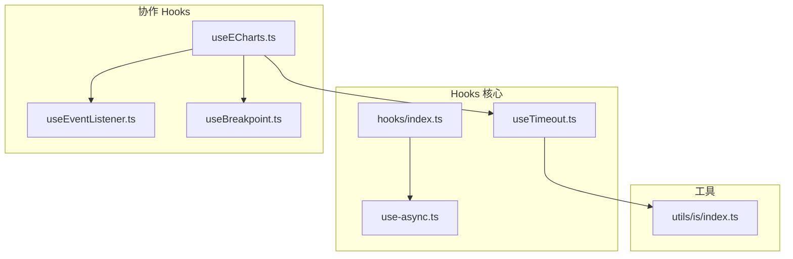
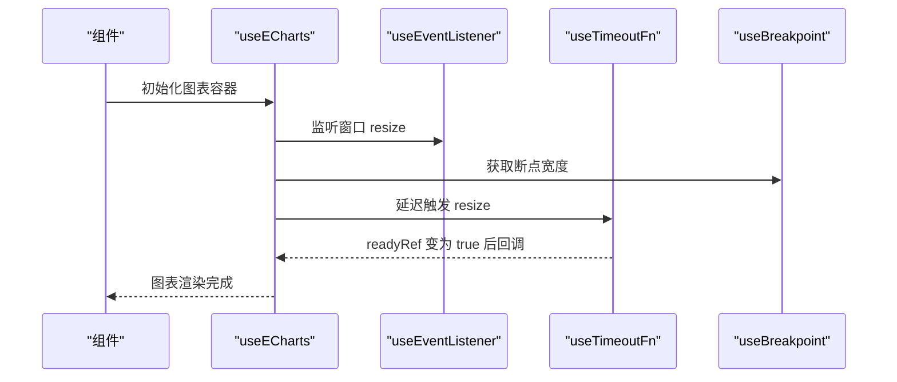
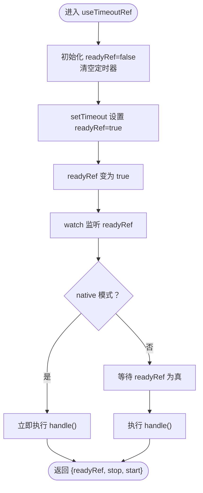
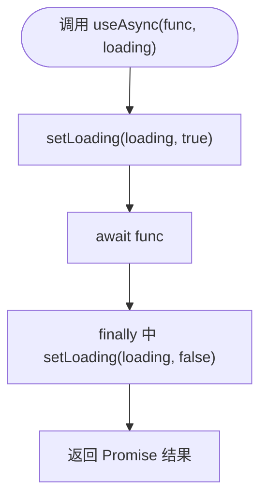
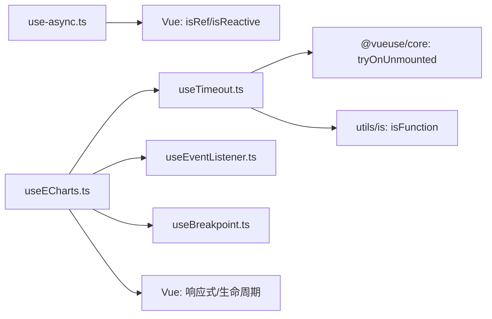

# 核心Hooks

<cite>
**本文引用的文件**
- [useTimeout.ts](file://src/hooks/core/useTimeout.ts)
- [use-async.ts](file://src/hooks/use-async.ts)
- [index.ts](file://src/hooks/index.ts)
- [useECharts.ts](file://src/hooks/web/useECharts.ts)
- [index.ts](file://src/hooks/event/useEventListener.ts)
- [index.ts](file://src/hooks/event/useBreakpoint.ts)
- [index.ts](file://src/utils/is/index.ts)
</cite>

## 目录
1. [引言](#引言)
2. [项目结构](#项目结构)
3. [核心组件](#核心组件)
4. [架构总览](#架构总览)
5. [详细组件分析](#详细组件分析)
6. [依赖分析](#依赖分析)
7. [性能考虑](#性能考虑)
8. [故障排查指南](#故障排查指南)
9. [结论](#结论)
10. [附录：使用示例与最佳实践](#附录使用示例与最佳实践)

## 引言
本文件聚焦于项目中的两个核心Hooks：useTimeoutFn/useTimeoutRef（定时器类）与useAsync（异步状态管理）。我们将从实现原理、数据流、生命周期管理、内存泄漏防护、性能优化以及使用示例与最佳实践等方面进行系统性解析，帮助开发者在组件中正确、安全地使用这些Hooks。

## 项目结构
本次文档涉及的核心文件位于 src/hooks 目录下，其中：
- 定时器相关：src/hooks/core/useTimeout.ts
- 异步状态管理：src/hooks/use-async.ts
- 组织导出：src/hooks/index.ts
- 其他与定时器协作的Hooks：src/hooks/web/useECharts.ts、src/hooks/event/useEventListener.ts、src/hooks/event/useBreakpoint.ts
- 类型与工具：src/utils/is/index.ts

**图示来源**
- [useTimeout.ts:1-49](file://src/hooks/core/useTimeout.ts#L1-L49)
- [use-async.ts:1-17](file://src/hooks/use-async.ts#L1-L17)
- [index.ts:1-4](file://src/hooks/index.ts#L1-L4)
- [useECharts.ts:1-123](file://src/hooks/web/useECharts.ts#L1-L123)
- [index.ts:1-62](file://src/hooks/event/useEventListener.ts#L1-L62)
- [index.ts:1-96](file://src/hooks/event/useBreakpoint.ts#L1-L96)
- [index.ts:1-126](file://src/utils/is/index.ts#L1-L126)

**章节来源**
- [useTimeout.ts:1-49](file://src/hooks/core/useTimeout.ts#L1-L49)
- [use-async.ts:1-17](file://src/hooks/use-async.ts#L1-L17)
- [index.ts:1-4](file://src/hooks/index.ts#L1-L4)
- [useECharts.ts:1-123](file://src/hooks/web/useECharts.ts#L1-L123)
- [index.ts:1-62](file://src/hooks/event/useEventListener.ts#L1-L62)
- [index.ts:1-96](file://src/hooks/event/useBreakpoint.ts#L1-L96)
- [index.ts:1-126](file://src/utils/is/index.ts#L1-L126)

## 核心组件
- useTimeoutFn/useTimeoutRef：提供可复用的定时器封装，支持立即执行、延迟触发、手动停止/重启，并在组件卸载时自动清理，避免内存泄漏。
- useAsync：统一管理异步请求的加载状态，支持传入 ref 或响应式对象作为“loading”状态载体，保证在 finally 中关闭加载态。

**章节来源**
- [useTimeout.ts:5-24](file://src/hooks/core/useTimeout.ts#L5-L24)
- [useTimeout.ts:26-48](file://src/hooks/core/useTimeout.ts#L26-L48)
- [use-async.ts:12-16](file://src/hooks/use-async.ts#L12-L16)

## 架构总览
下面以序列图展示 useECharts 如何组合 useTimeoutFn 与 useEventListener 等Hooks，体现“定时器+事件监听+断点监听”的协作关系。

**图示来源**
- [useECharts.ts:47-58](file://src/hooks/web/useECharts.ts#L47-L58)
- [index.ts:18-61](file://src/hooks/event/useEventListener.ts#L18-L61)
- [index.ts:29-95](file://src/hooks/event/useBreakpoint.ts#L29-L95)
- [useTimeout.ts:5-24](file://src/hooks/core/useTimeout.ts#L5-L24)

## 详细组件分析

### useTimeoutFn/useTimeoutRef：定时器Hooks
- 设计目标
  - 提供“准备就绪”信号 readyRef，通过 watch 触发回调，避免在组件卸载后仍执行副作用。
  - 支持 native 模式：立即执行一次回调；非 native 模式：等待 readyRef 为真后再执行。
  - 提供 stop/start 控制方法，便于动态调整定时器。
  - 自动清理：在组件卸载时清除定时器，防止内存泄漏。

- 关键实现要点
  - 输入校验：确保回调为函数，否则抛出错误。
  - 定时器状态：内部维护 readyRef 与定时器句柄，stop 清理并重置 readyRef，start 重新启动定时器。
  - 生命周期：使用 tryOnUnmounted 注册卸载清理逻辑。
  - watch 机制：当 readyRef 由 false 变为 true 时，触发 handle 回调。

- 数据流与控制流

**图示来源**
- [useTimeout.ts:26-48](file://src/hooks/core/useTimeout.ts#L26-L48)
- [useTimeout.ts:10-23](file://src/hooks/core/useTimeout.ts#L10-L23)

- 错误处理与边界条件
  - 非函数回调：在 useTimeoutFn 中显式校验并抛错，避免静默失败。
  - 卸载清理：tryOnUnmounted 确保组件卸载时 stop 被调用，clearTimeout 避免残留定时器。
  - 重复 start：stop 会先清理旧定时器，再创建新的，避免并发定时器。

- 性能与优化建议
  - 避免频繁 start/stop：在需要多次触发的场景，优先复用同一实例并调用 start。
  - 与组件生命周期配合：在 onMounted/onUnmounted 中谨慎调用 start/stop，尽量交给 useTimeoutRef 内部管理。
  - 与 watch 结合：仅在需要响应式触发时使用 watch，避免不必要的响应式依赖。

**章节来源**
- [useTimeout.ts:5-24](file://src/hooks/core/useTimeout.ts#L5-L24)
- [useTimeout.ts:26-48](file://src/hooks/core/useTimeout.ts#L26-L48)
- [index.ts:10-15](file://src/utils/is/index.ts#L10-L15)

### useAsync：异步状态管理Hooks
- 设计目标
  - 统一处理异步请求的“开始加载/结束加载”状态，支持 ref 与响应式对象两种形态。
  - 在 Promise 的 finally 中关闭 loading，保证异常与成功路径均能恢复 UI 状态。

- 关键实现要点
  - setLoading：根据传入对象类型判断是 ref 还是响应式对象，分别设置对应字段。
  - useAsync：在执行前开启 loading，在 finally 中关闭 loading，返回 Promise 结果。

- 数据流与控制流

**图示来源**
- [use-async.ts:12-16](file://src/hooks/use-async.ts#L12-L16)

- 错误处理与边界条件
  - loading 为空：当 loading 未传入或不是 ref/响应式对象时，跳过状态更新，避免运行时错误。
  - Promise 异常：finally 仍会执行，确保 loading 被关闭，避免 UI 长时间处于加载态。

- 性能与优化建议
  - 避免重复请求：在组件内缓存 Promise 实例，必要时通过外部状态控制取消或重试。
  - 与 Suspense/keep-alive：结合 keep-alive 时注意在组件卸载时取消或忽略后续结果，避免状态污染。

**章节来源**
- [use-async.ts:3-16](file://src/hooks/use-async.ts#L3-L16)

### 与其他Hooks的协作
- useECharts 与 useTimeoutFn
  - 在图表初始化或尺寸变化后，使用 useTimeoutFn 延迟触发 resize，避免 DOM 尺寸尚未稳定导致的计算误差。
  - 当断点宽度小于阈值或容器高度为0时，通过短延时再次尝试 setOptions，提升初始化成功率。

- useECharts 与 useEventListener
  - 使用 useEventListener 监听窗口 resize 事件，并在组件卸载时自动移除监听，避免内存泄漏。

- useECharts 与 useBreakpoint
  - 读取断点宽度，结合容器高度判断是否需要延迟初始化，提升跨设备兼容性。

**章节来源**
- [useECharts.ts:47-58](file://src/hooks/web/useECharts.ts#L47-L58)
- [index.ts:18-61](file://src/hooks/event/useEventListener.ts#L18-L61)
- [index.ts:29-95](file://src/hooks/event/useBreakpoint.ts#L29-L95)

## 依赖分析
- 内部依赖
  - useTimeoutFn 依赖 useTimeoutRef、@vueuse/core 的 tryOnUnmounted、utils/is 的 isFunction。
  - useAsync 依赖 Vue 的 isRef/isReactive。
  - useECharts 依赖 useTimeoutFn、useEventListener、useBreakpoint、@vueuse/core 的 tryOnUnmounted 与防抖工具。

- 外部依赖
  - @vueuse/core：提供 tryOnUnmounted、useDebounceFn、useThrottleFn 等通用能力。
  - Vue：响应式系统（ref、watch、computed、onMounted/onUnmounted）。

**图示来源**
- [useTimeout.ts:1-3](file://src/hooks/core/useTimeout.ts#L1-L3)
- [index.ts:10-15](file://src/utils/is/index.ts#L10-L15)
- [use-async.ts](file://src/hooks/use-async.ts#L1)
- [useECharts.ts:1-12](file://src/hooks/web/useECharts.ts#L1-L12)
- [index.ts:1-6](file://src/hooks/event/useEventListener.ts#L1-L6)
- [index.ts:1-6](file://src/hooks/event/useBreakpoint.ts#L1-L6)

**章节来源**
- [useTimeout.ts:1-4](file://src/hooks/core/useTimeout.ts#L1-L4)
- [use-async.ts](file://src/hooks/use-async.ts#L1)
- [useECharts.ts:1-12](file://src/hooks/web/useECharts.ts#L1-L12)
- [index.ts:1-6](file://src/hooks/event/useEventListener.ts#L1-L6)
- [index.ts:1-6](file://src/hooks/event/useBreakpoint.ts#L1-L6)

## 性能考虑
- 定时器管理
  - 使用 readyRef 与 watch 替代直接在回调中做复杂逻辑，降低 watch 的触发成本。
  - 在组件卸载时统一清理，避免“幽灵定时器”。

- 异步状态管理
  - 通过 finally 关闭 loading，确保状态一致性，减少 UI 闪烁。
  - 对于高频请求，结合防抖/节流策略（如 useECharts 中对 resize 的防抖），避免过度渲染。

- 组合Hooks
  - 将事件监听与断点监听解耦，按需启用，减少不必要监听带来的性能消耗。

[本节为通用指导，无需列出具体文件来源]

## 故障排查指南
- 定时器未清理
  - 症状：组件卸载后仍有定时器执行或内存占用。
  - 排查：确认是否使用 useTimeoutRef 的返回值 stop/start，或在组件卸载时手动调用 stop；检查 tryOnUnmounted 是否生效。

- 回调未执行
  - 症状：native=false 时 handle 一直不执行。
  - 排查：确认 readyRef 是否被外部修改；检查 watch 的 immediate 选项与依赖变更。

- 异步状态未关闭
  - 症状：loading 一直为 true。
  - 排查：确认 loading 参数是否为 ref 或响应式对象；检查 finally 是否被正常执行。

- 事件监听泄漏
  - 症状：切换页面后仍接收 resize 等事件。
  - 排查：确认 useEventListener 的 autoRemove 行为；在组件卸载时调用 removeEvent。

**章节来源**
- [useTimeout.ts:31-45](file://src/hooks/core/useTimeout.ts#L31-L45)
- [use-async.ts:3-16](file://src/hooks/use-async.ts#L3-L16)
- [index.ts:18-61](file://src/hooks/event/useEventListener.ts#L18-L61)

## 结论
- useTimeoutFn/useTimeoutRef 提供了安全、可控的定时器抽象，通过 readyRef 与 watch 实现延迟触发，并在卸载时自动清理，有效防止内存泄漏。
- useAsync 统一了异步加载状态的管理，简化了组件中的状态同步逻辑，提升可维护性。
- 在实际项目中，将这些Hooks与事件监听、断点监听等组合使用，可以构建高性能、低风险的交互体验。

[本节为总结，无需列出具体文件来源]

## 附录：使用示例与最佳实践
- 使用 useTimeoutFn
  - 场景：延迟执行某项操作，或在 readyRef 为真时触发。
  - 步骤：
    1) 调用 useTimeoutFn(handle, wait, native?) 获取 { readyRef, stop, start }。
    2) 在组件中 watch readyRef，或在需要时调用 start/stop。
    3) 组件卸载时无需手动清理，内部已通过 tryOnUnmounted 注册清理逻辑。
  - 注意：
    - native=true 时 handle 会在初始化时立即执行一次。
    - 若存在多次触发需求，优先复用实例并调用 start。

- 使用 useAsync
  - 场景：发起异步请求并在 UI 上显示加载状态。
  - 步骤：
    1) 准备一个 loading 状态（ref 或响应式对象）。
    2) 调用 useAsync(promiseFunc, loading)，在 finally 中自动关闭 loading。
  - 注意：
    - 若 loading 为空或类型不符，不会更新状态，避免运行时错误。
    - 对于可能被取消的请求，建议在组件卸载时中断或忽略后续结果。

- 与 useECharts 协作
  - 在图表初始化或容器尺寸变化后，使用 useTimeoutFn 延迟触发 resize/setOptions，提升初始化稳定性。
  - 使用 useEventListener 监听窗口 resize，自动移除监听，避免泄漏。

**章节来源**
- [useTimeout.ts:5-24](file://src/hooks/core/useTimeout.ts#L5-L24)
- [use-async.ts:12-16](file://src/hooks/use-async.ts#L12-L16)
- [useECharts.ts:47-58](file://src/hooks/web/useECharts.ts#L47-L58)
- [index.ts:18-61](file://src/hooks/event/useEventListener.ts#L18-L61)