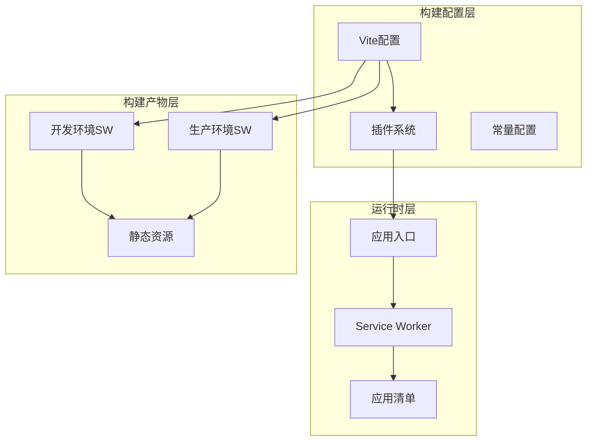
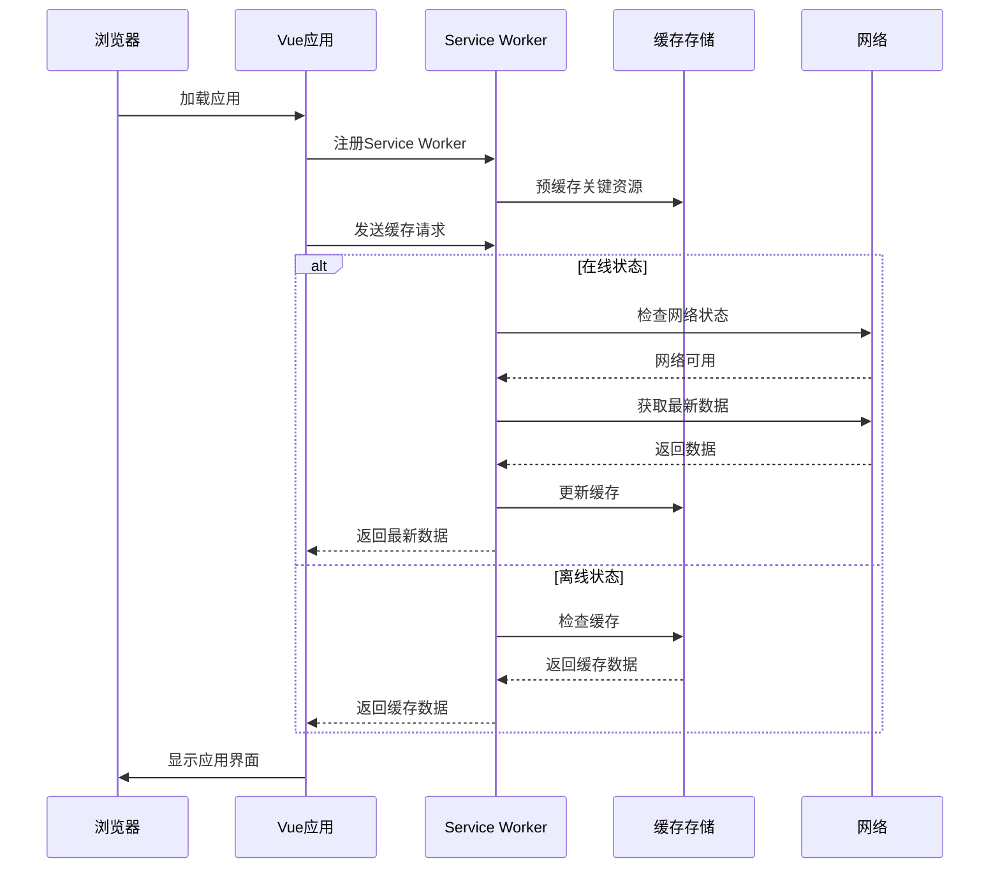
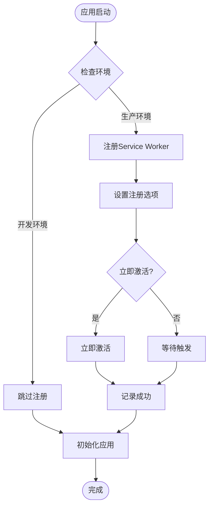
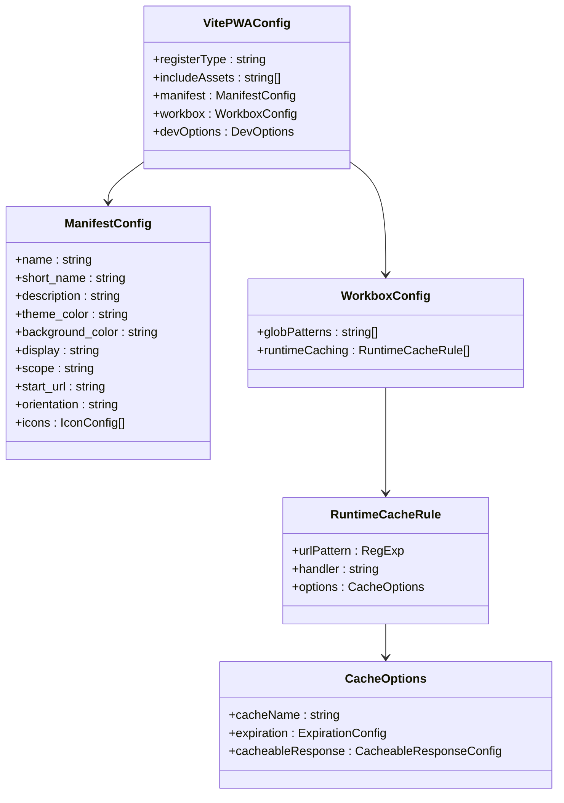
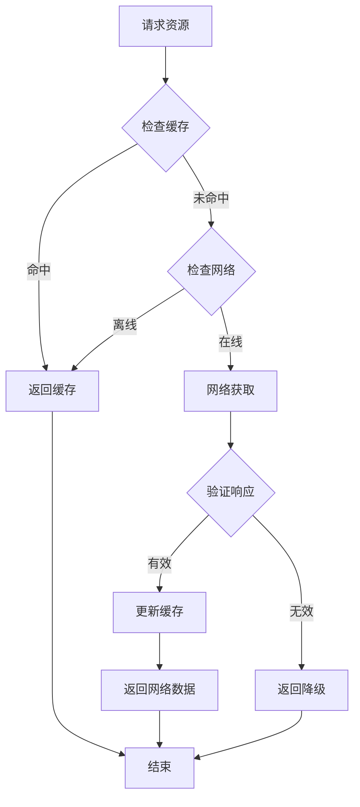
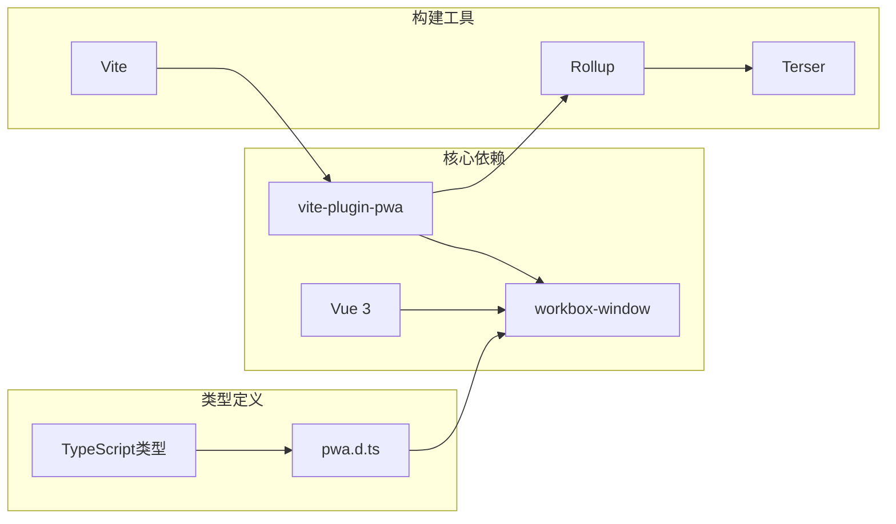

# PWA支持系统

<cite>
**本文档引用的文件**
- [package.json](file://package.json)
- [vite.config.ts](file://vite.config.ts)
- [types/pwa.d.ts](file://types/pwa.d.ts)
- [dev-dist/sw.js](file://dev-dist/sw.js)
- [src/main.ts](file://src/main.ts)
- [build/vite/plugin/index.ts](file://build/vite/plugin/index.ts)
- [index.html](file://index.html)
- [build/constant.ts](file://build/constant.ts)
- [build/vite/plugin/html.ts](file://build/vite/plugin/html.ts)
- [build/vite/plugin/compress.ts](file://build/vite/plugin/compress.ts)
</cite>

## 更新摘要
**变更内容**
- 更新服务工作者修订哈希值从 '0.h53gj30gqs8' 到 '0.mjc8h096dog'
- 维护构建配置状态的准确性
- 保持功能实现不变，仅更新构建产物标识符

## 目录
1. [简介](#简介)
2. [项目结构](#项目结构)
3. [核心组件](#核心组件)
4. [架构概览](#架构概览)
5. [详细组件分析](#详细组件分析)
6. [依赖关系分析](#依赖关系分析)
7. [性能考虑](#性能考虑)
8. [故障排除指南](#故障排除指南)
9. [结论](#结论)

## 简介

这是一个基于Vue3和Vite构建的移动端微信H5应用的PWA支持系统。该系统实现了完整的渐进式Web应用功能，包括Service Worker注册、离线缓存、应用清单管理和自动更新机制。

PWA支持系统的核心目标是在移动设备上提供类似原生应用的用户体验，通过离线访问、推送通知、安装到主屏幕等功能提升用户粘性和应用可用性。

## 项目结构

该项目采用现代化的前端工程化架构，PWA相关功能主要分布在以下关键位置：

**图表来源**
- [vite.config.ts:27-181](file://vite.config.ts#L27-L181)
- [build/vite/plugin/index.ts:78-156](file://build/vite/plugin/index.ts#L78-L156)

**章节来源**
- [vite.config.ts:1-183](file://vite.config.ts#L1-L183)
- [build/vite/plugin/index.ts:1-160](file://build/vite/plugin/index.ts#L1-L160)

## 核心组件

### PWA插件配置

项目使用vite-plugin-pwa插件实现PWA功能，配置包含以下关键特性：

- **自动更新机制**: `registerType: 'autoUpdate'` 实现无缝更新
- **应用清单**: 完整的manifest配置，支持iOS和Android平台
- **Workbox集成**: 基于Workbox的智能缓存策略
- **开发模式支持**: devOptions启用开发环境下的PWA功能

### Service Worker管理

系统实现了双环境的Service Worker管理：

- **开发环境**: 使用模块化的Service Worker，便于调试和开发
- **生产环境**: 自动生成优化的Service Worker文件
- **自动注册**: 应用启动时自动注册Service Worker

### 缓存策略

采用多层次的缓存策略确保最佳性能：

- **API缓存**: NetworkFirst策略，支持24小时过期
- **图片缓存**: CacheFirst策略，支持30天过期  
- **字体缓存**: CacheFirst策略，支持1年过期
- **预缓存**: 预加载关键资源

**章节来源**
- [build/vite/plugin/index.ts:78-156](file://build/vite/plugin/index.ts#L78-L156)
- [dev-dist/sw.js:70-112](file://dev-dist/sw.js#L70-L112)

## 架构概览

PWA系统的整体架构采用分层设计，确保各组件职责清晰：

**图表来源**
- [src/main.ts:29-40](file://src/main.ts#L29-L40)
- [dev-dist/sw.js:88-110](file://dev-dist/sw.js#L88-L110)

## 详细组件分析

### 应用入口集成

应用入口文件负责PWA的初始化和Service Worker注册：

**图表来源**
- [src/main.ts:19-44](file://src/main.ts#L19-L44)

### PWA插件配置详解

PWA插件配置采用模块化设计，支持灵活的定制：

**图表来源**
- [build/vite/plugin/index.ts:80-155](file://build/vite/plugin/index.ts#L80-L155)

### Service Worker缓存策略

Service Worker实现了智能的缓存管理策略：

**图表来源**
- [dev-dist/sw.js:88-110](file://dev-dist/sw.js#L88-L110)

**章节来源**
- [src/main.ts:19-44](file://src/main.ts#L19-L44)
- [build/vite/plugin/index.ts:80-155](file://build/vite/plugin/index.ts#L80-L155)
- [dev-dist/sw.js:70-112](file://dev-dist/sw.js#L70-L112)

## 依赖关系分析

PWA支持系统的关键依赖关系如下：

**图表来源**
- [package.json:102-105](file://package.json#L102-L105)
- [types/pwa.d.ts:1-13](file://types/pwa.d.ts#L1-L13)

**章节来源**
- [package.json:41-106](file://package.json#L41-L106)
- [types/pwa.d.ts:1-13](file://types/pwa.d.ts#L1-L13)

## 性能考虑

### 缓存策略优化

系统采用了多层缓存策略来优化性能：

- **API缓存**: 使用NetworkFirst策略，确保数据实时性
- **静态资源缓存**: 使用CacheFirst策略，提升加载速度
- **缓存过期管理**: 合理设置过期时间，平衡新鲜度和性能
- **缓存清理机制**: 自动清理过期缓存，控制存储空间

### 构建优化

构建过程中的性能优化措施：

- **代码分割**: 按需加载模块，减少初始包大小
- **压缩优化**: 支持gzip和brotli压缩
- **资源预加载**: 预加载关键资源，提升首屏速度
- **缓存友好的文件名**: 使用哈希值确保长期缓存

## 故障排除指南

### 常见问题及解决方案

**Service Worker注册失败**
- 检查HTTPS配置
- 确认Service Worker文件路径正确
- 查看浏览器开发者工具中的错误日志

**缓存更新不生效**
- 清除浏览器缓存
- 检查Service Worker版本号
- 验证缓存清理逻辑

**离线功能异常**
- 确认manifest配置完整
- 检查缓存策略配置
- 验证资源预缓存清单

**章节来源**
- [src/main.ts:31-39](file://src/main.ts#L31-L39)
- [dev-dist/sw.js:72-73](file://dev-dist/sw.js#L72-L73)

## 构建配置更新

### 服务工作者修订哈希更新

**更新内容**: 服务工作者修订哈希已从 '0.h53gj30gqs8' 更新为 '0.mjc8h096dog'

此更新是构建过程的维护性变更，不影响功能实现，主要用于：

- **构建产物标识**: 更新index.html的缓存修订标识
- **缓存失效机制**: 确保用户获取最新版本的应用
- **版本控制**: 维护构建配置的准确状态

**更新详情**:
- 修订哈希值: '0.h53gj30gqs8' → '0.mjc8h096dog'
- 影响范围: 仅影响构建产物的缓存标识
- 功能影响: 无功能变更，仅更新版本标识符

**章节来源**
- [dev-dist/sw.js:80-83](file://dev-dist/sw.js#L80-L83)

## 结论

该PWA支持系统通过精心设计的架构和优化的缓存策略，为Vue3微信H5应用提供了完整的渐进式Web应用体验。系统的主要优势包括：

1. **完整的PWA功能**: 支持安装、离线访问、自动更新
2. **智能缓存策略**: 多层次缓存确保最佳性能
3. **开发友好**: 支持开发和生产环境的差异化配置
4. **可扩展性**: 模块化的插件架构便于功能扩展

通过合理的配置和持续的优化，该系统能够为用户提供接近原生应用的移动Web体验，同时保持良好的开发效率和维护性。

**更新**: 最新构建配置已反映修订哈希更新，确保构建产物的准确性和缓存管理的有效性。