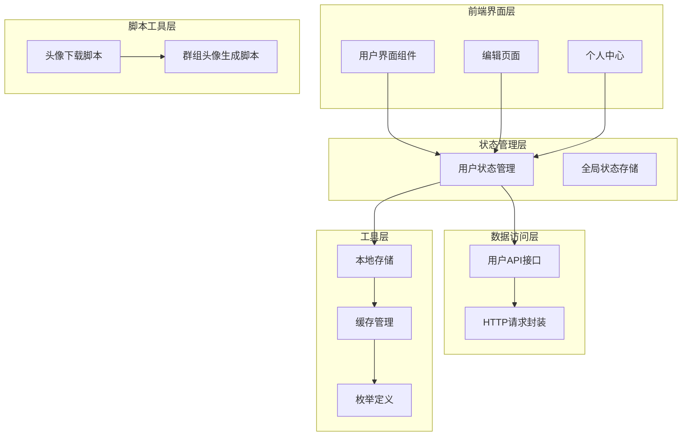
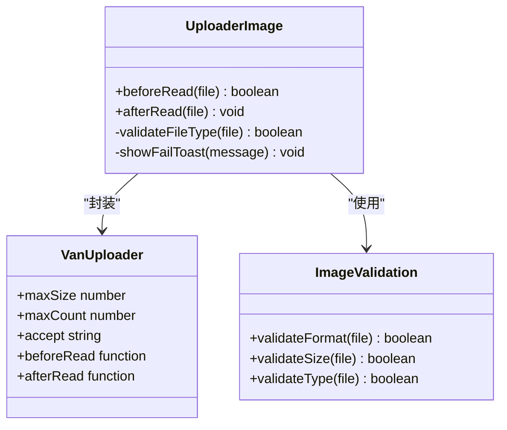
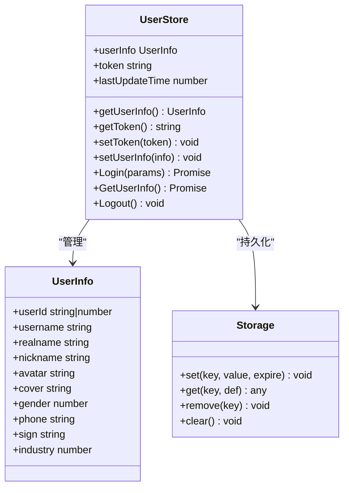
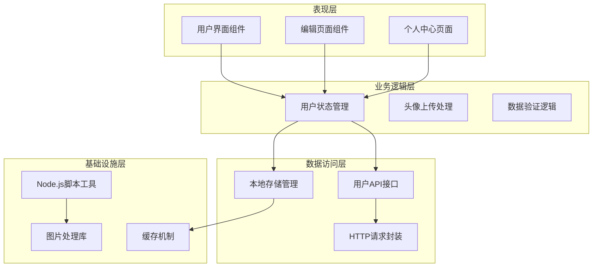
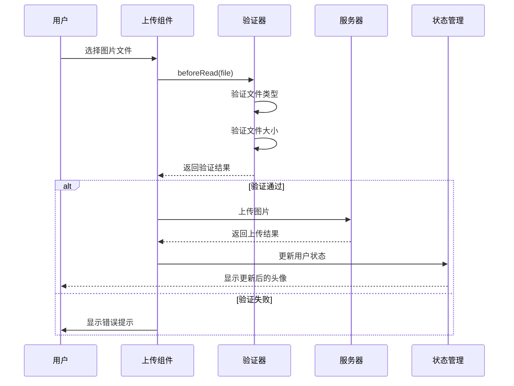
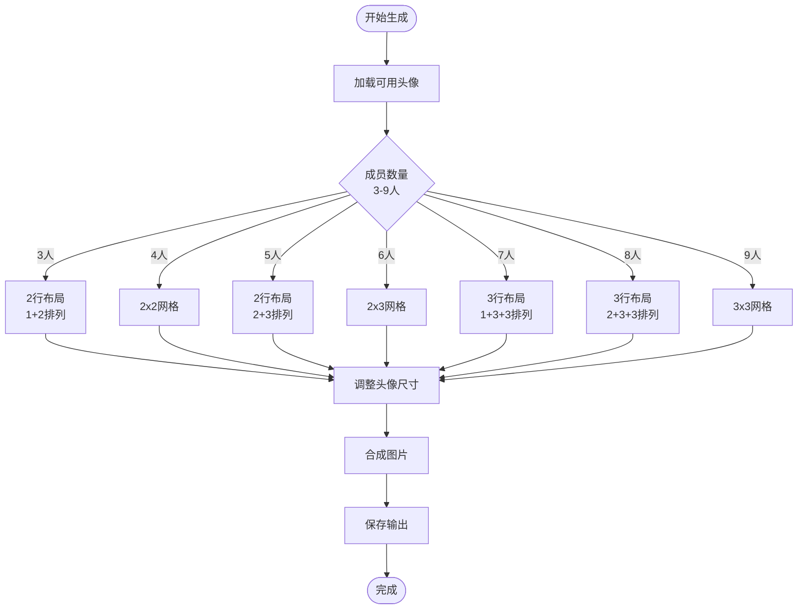
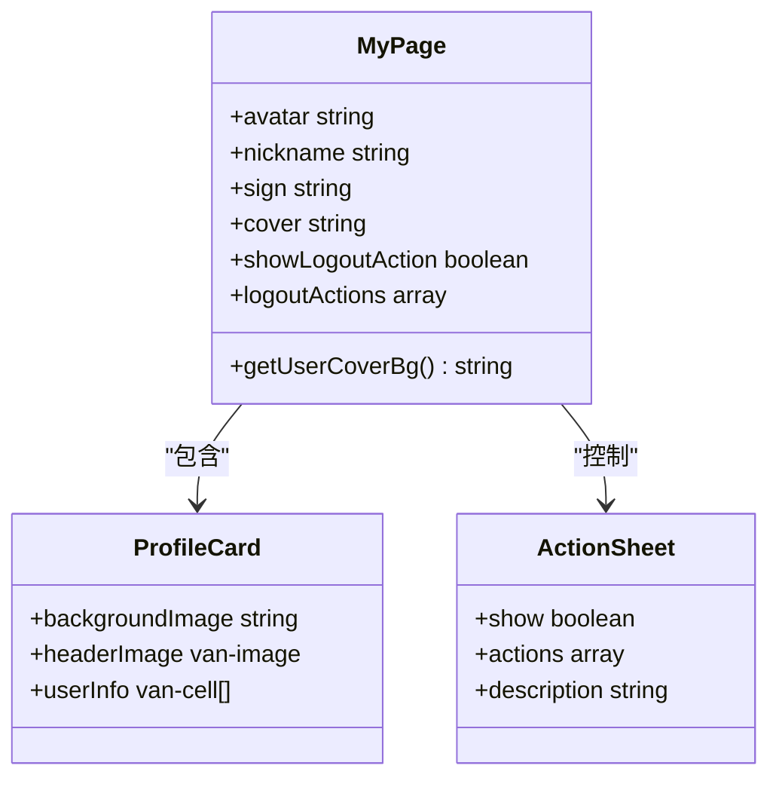
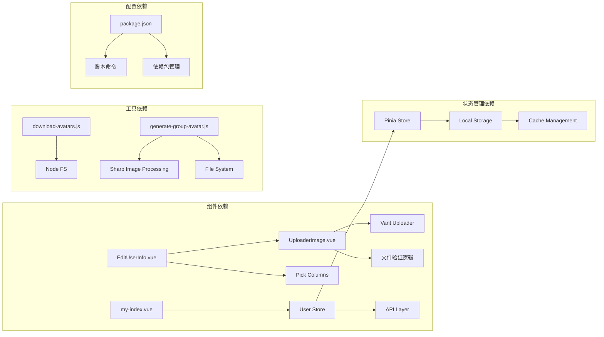

# 头像管理系统

<cite>
**本文档引用的文件**
- [UploaderImage.vue](file://src/views/my/components/UploaderImage.vue)
- [EditUserInfo.vue](file://src/views/my/EditUserInfo.vue)
- [my-index.vue](file://src/views/my/index.vue)
- [user-store.ts](file://src/store/modules/user.ts)
- [user-api.ts](file://src/api/system/user.ts)
- [Storage.ts](file://src/utils/Storage.ts)
- [cacheEnum.ts](file://src/enums/cacheEnum.ts)
- [mutation-types.ts](file://src/store/mutation-types.ts)
- [pickColumns.ts](file://src/views/my/pickColumns.ts)
- [download-avatars.js](file://scripts/download-avatars.js)
- [generate-group-avatar.js](file://scripts/generate-group-avatar.js)
- [package.json](file://package.json)
</cite>

## 目录
1. [简介](#简介)
2. [项目结构](#项目结构)
3. [核心组件](#核心组件)
4. [架构概览](#架构概览)
5. [详细组件分析](#详细组件分析)
6. [依赖关系分析](#依赖关系分析)
7. [性能考虑](#性能考虑)
8. [故障排除指南](#故障排除指南)
9. [结论](#结论)

## 简介

头像管理系统是一个基于Vue 3 + Vant 4构建的移动端应用，专门用于处理用户头像、群组头像以及相关的个人资料管理功能。该系统提供了完整的头像上传、预览、存储和展示功能，支持单人头像和个人主页封面的自定义。

系统采用现代化的前端技术栈，包括TypeScript、Pinia状态管理、Vite构建工具和Vant移动端UI组件库。通过Node.js脚本实现了头像资源的批量下载和群组头像的智能合成功能。

## 项目结构

该项目采用模块化的组织方式，主要分为以下几个核心部分：

**图表来源**
- [UploaderImage.vue:1-33](file://src/views/my/components/UploaderImage.vue#L1-L33)
- [user-store.ts:1-115](file://src/store/modules/user.ts#L1-L115)
- [user-api.ts:1-60](file://src/api/system/user.ts#L1-L60)

**章节来源**
- [UploaderImage.vue:1-33](file://src/views/my/components/UploaderImage.vue#L1-L33)
- [EditUserInfo.vue:1-183](file://src/views/my/EditUserInfo.vue#L1-L183)
- [my-index.vue:1-145](file://src/views/my/index.vue#L1-L145)

## 核心组件

### 头像上传组件

头像上传组件是整个系统的核心组件之一，负责处理用户头像的上传流程。该组件基于Vant的Uploader组件进行封装，提供了完整的文件验证和上传逻辑。

**图表来源**
- [UploaderImage.vue:15-30](file://src/views/my/components/UploaderImage.vue#L15-L30)

### 用户信息管理

用户信息管理模块负责维护用户的头像、昵称、签名等个人资料信息。该模块使用Pinia进行状态管理，确保数据的一致性和持久化。

**图表来源**
- [user-store.ts:12-109](file://src/store/modules/user.ts#L12-L109)
- [Storage.ts:8-123](file://src/utils/Storage.ts#L8-L123)

**章节来源**
- [UploaderImage.vue:18-29](file://src/views/my/components/UploaderImage.vue#L18-L29)
- [user-store.ts:53-107](file://src/store/modules/user.ts#L53-L107)
- [Storage.ts:27-57](file://src/utils/Storage.ts#L27-L57)

## 架构概览

系统采用分层架构设计，从上到下分为表现层、业务逻辑层、数据访问层和基础设施层：

**图表来源**
- [EditUserInfo.vue:114-120](file://src/views/my/EditUserInfo.vue#L114-L120)
- [user-store.ts:64-107](file://src/store/modules/user.ts#L64-L107)
- [user-api.ts:12-43](file://src/api/system/user.ts#L12-L43)

## 详细组件分析

### 头像上传流程

头像上传流程是一个典型的异步处理过程，涉及文件验证、数据传输和状态更新等多个步骤：

**图表来源**
- [UploaderImage.vue:18-29](file://src/views/my/components/UploaderImage.vue#L18-L29)
- [user-store.ts:58-62](file://src/store/modules/user.ts#L58-L62)

### 群组头像生成算法

群组头像生成系统采用了智能的宫格布局算法，能够根据不同成员数量生成美观的群组头像：

**图表来源**
- [generate-group-avatar.js:40-69](file://scripts/generate-group-avatar.js#L40-L69)
- [generate-group-avatar.js:72-154](file://scripts/generate-group-avatar.js#L72-L154)

### 用户信息展示组件

个人中心页面展示了用户的完整信息，包括头像、昵称、签名等个性化内容：

**图表来源**
- [my-index.vue:65-88](file://src/views/my/index.vue#L65-L88)

**章节来源**
- [UploaderImage.vue:1-33](file://src/views/my/components/UploaderImage.vue#L1-L33)
- [generate-group-avatar.js:156-193](file://scripts/generate-group-avatar.js#L156-L193)
- [my-index.vue:1-145](file://src/views/my/index.vue#L1-L145)

## 依赖关系分析

系统中的各个组件之间存在复杂的依赖关系，这些关系构成了完整的功能体系：

**图表来源**
- [package.json:33-34](file://package.json#L33-L34)
- [user-store.ts:1-9](file://src/store/modules/user.ts#L1-L9)
- [Storage.ts:8-123](file://src/utils/Storage.ts#L8-L123)

**章节来源**
- [package.json:17-35](file://package.json#L17-L35)
- [user-store.ts:1-115](file://src/store/modules/user.ts#L1-L115)
- [Storage.ts:1-128](file://src/utils/Storage.ts#L1-L128)

## 性能考虑

### 图片处理优化

系统在图片处理方面采用了多项优化策略：

1. **文件大小限制**：上传组件设置了700KB的文件大小限制，防止过大文件影响用户体验
2. **格式验证**：只允许JPEG、PNG、JPG格式的图片上传，确保兼容性
3. **智能缓存**：用户信息和令牌通过localStorage进行持久化存储，减少重复请求
4. **懒加载**：头像图片采用懒加载策略，提升页面渲染性能

### 群组头像生成优化

群组头像生成系统通过以下方式优化性能：

1. **批量处理**：支持同时生成多个群组头像，提高效率
2. **智能布局**：根据不同成员数量采用最优布局算法
3. **内存管理**：及时释放处理过程中的临时内存
4. **并发控制**：合理控制生成速度，避免系统过载

## 故障排除指南

### 常见问题及解决方案

#### 头像上传失败

**问题描述**：用户无法上传头像文件

**可能原因**：
1. 文件格式不支持
2. 文件大小超过限制
3. 网络连接异常
4. 服务器端口错误

**解决方法**：
1. 检查文件格式是否为JPEG、PNG或JPG
2. 确认文件大小不超过700KB
3. 验证网络连接状态
4. 检查API端点配置

#### 群组头像生成错误

**问题描述**：群组头像生成过程中出现错误

**可能原因**：
1. 头像目录为空或不存在
2. Sharp库安装问题
3. 权限不足
4. 磁盘空间不足

**解决方法**：
1. 确保头像目录存在且包含至少2个头像
2. 重新安装Sharp库依赖
3. 检查脚本执行权限
4. 清理磁盘空间

#### 状态管理问题

**问题描述**：用户信息显示异常或登录状态丢失

**可能原因**：
1. 本地存储损坏
2. 缓存过期
3. Token失效
4. Pinia状态同步问题

**解决方法**：
1. 清除浏览器本地存储
2. 检查缓存配置和过期时间
3. 重新登录获取新的Token
4. 刷新页面重新同步状态

**章节来源**
- [UploaderImage.vue:18-24](file://src/views/my/components/UploaderImage.vue#L18-L24)
- [generate-group-avatar.js:160-165](file://scripts/generate-group-avatar.js#L160-L165)
- [user-store.ts:92-107](file://src/store/modules/user.ts#L92-L107)

## 结论

头像管理系统是一个功能完整、架构清晰的移动端应用。系统通过模块化的设计和分层的架构，实现了头像上传、管理和展示的完整流程。

### 主要优势

1. **用户体验优秀**：简洁直观的界面设计，流畅的交互体验
2. **功能完善**：支持单人头像、群组头像、个人主页封面等多种场景
3. **性能优化**：合理的缓存策略和图片处理优化
4. **扩展性强**：模块化设计便于功能扩展和维护

### 技术亮点

1. **现代化技术栈**：Vue 3 + TypeScript + Pinia + Vant 4
2. **智能脚本工具**：自动化头像下载和群组头像生成
3. **完善的错误处理**：全面的异常捕获和用户反馈机制
4. **跨平台兼容**：适配移动端和桌面端的不同需求

该系统为类似的应用开发提供了良好的参考模板，其设计理念和实现方式值得其他项目借鉴学习。