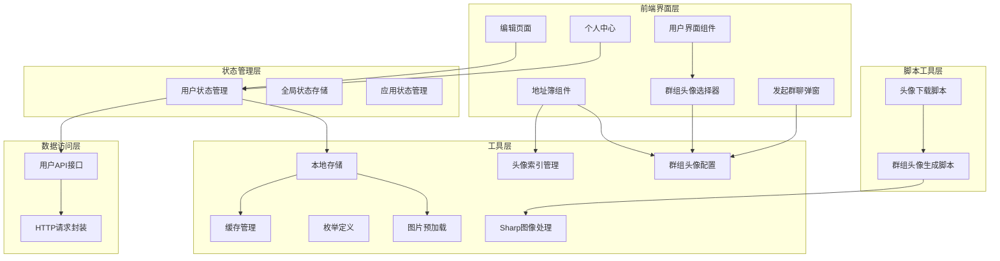
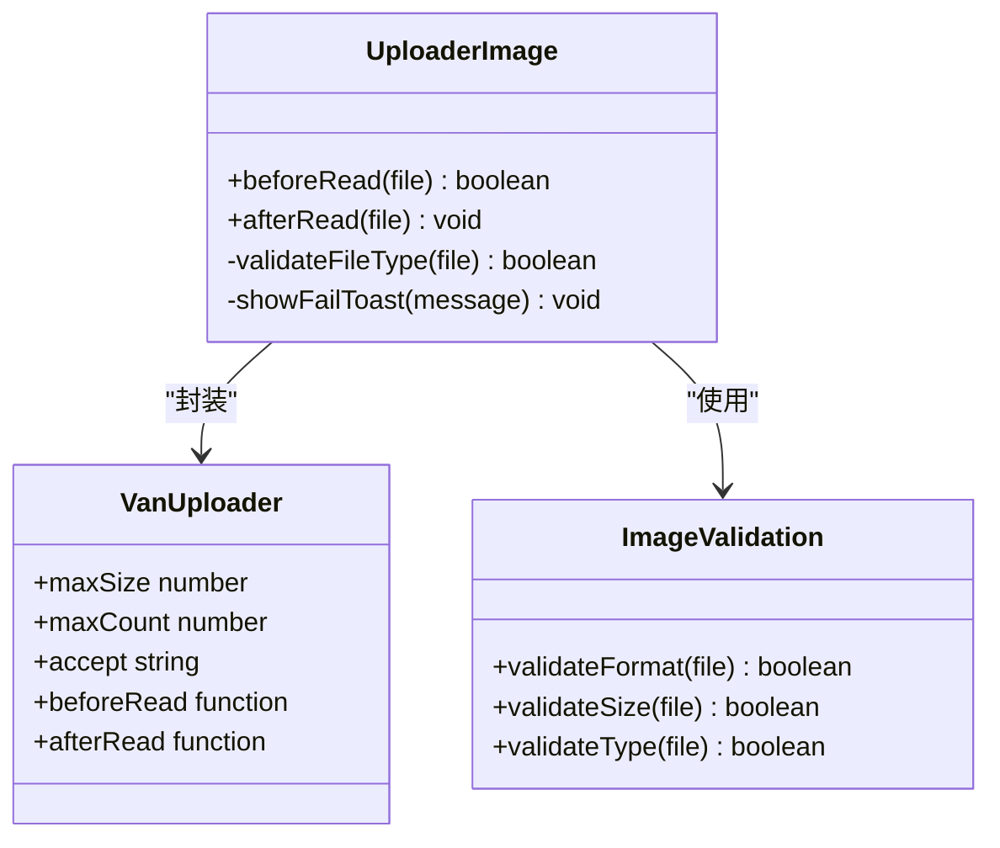
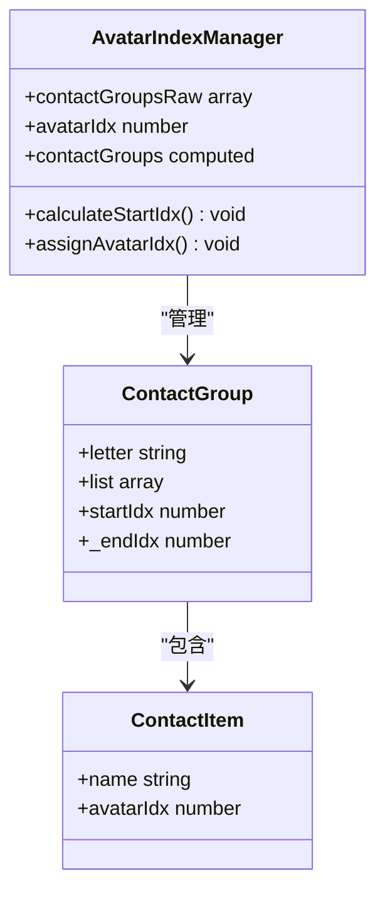
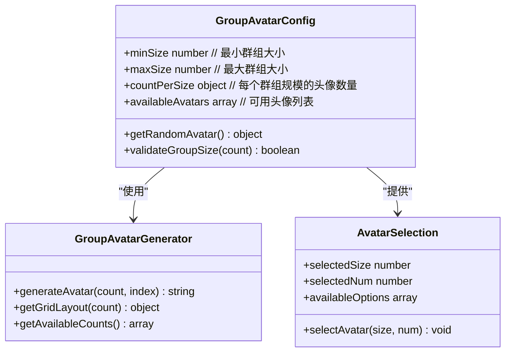
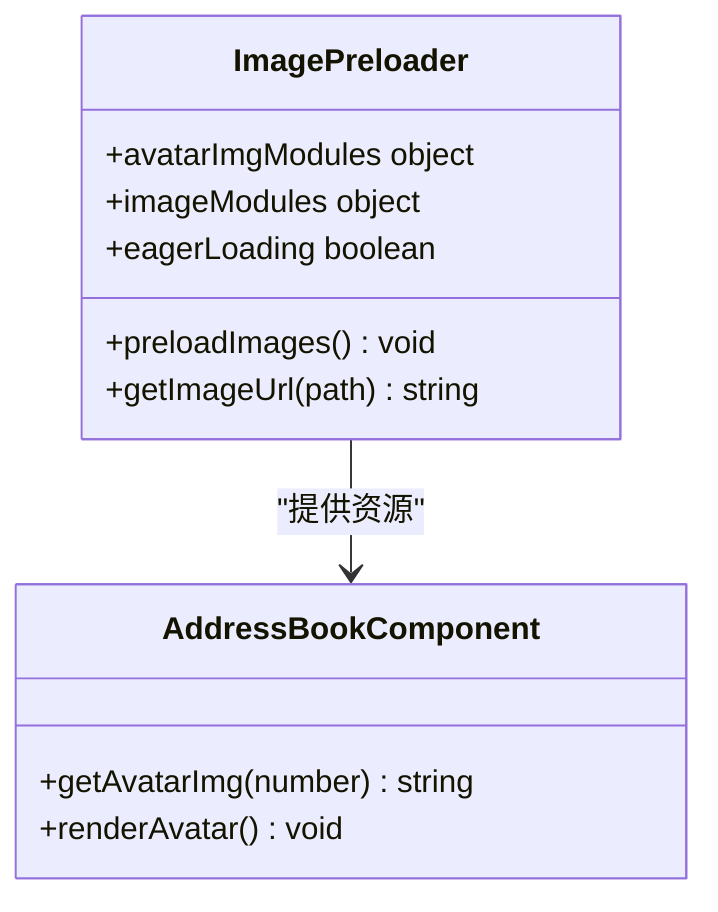
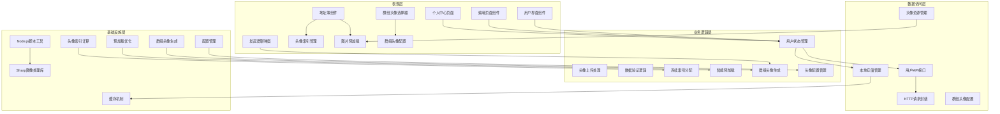
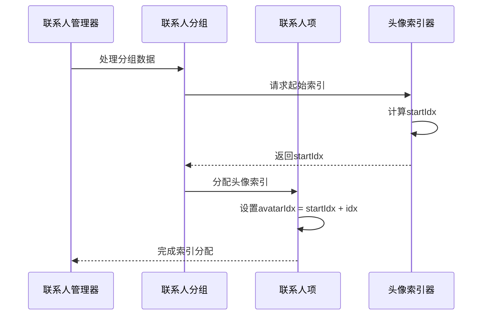
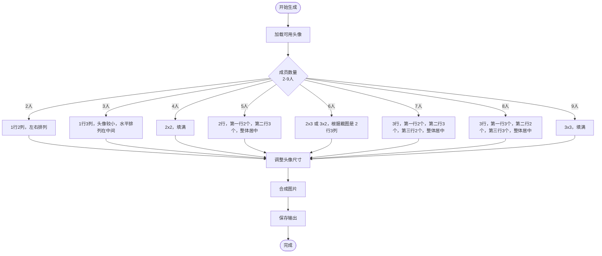
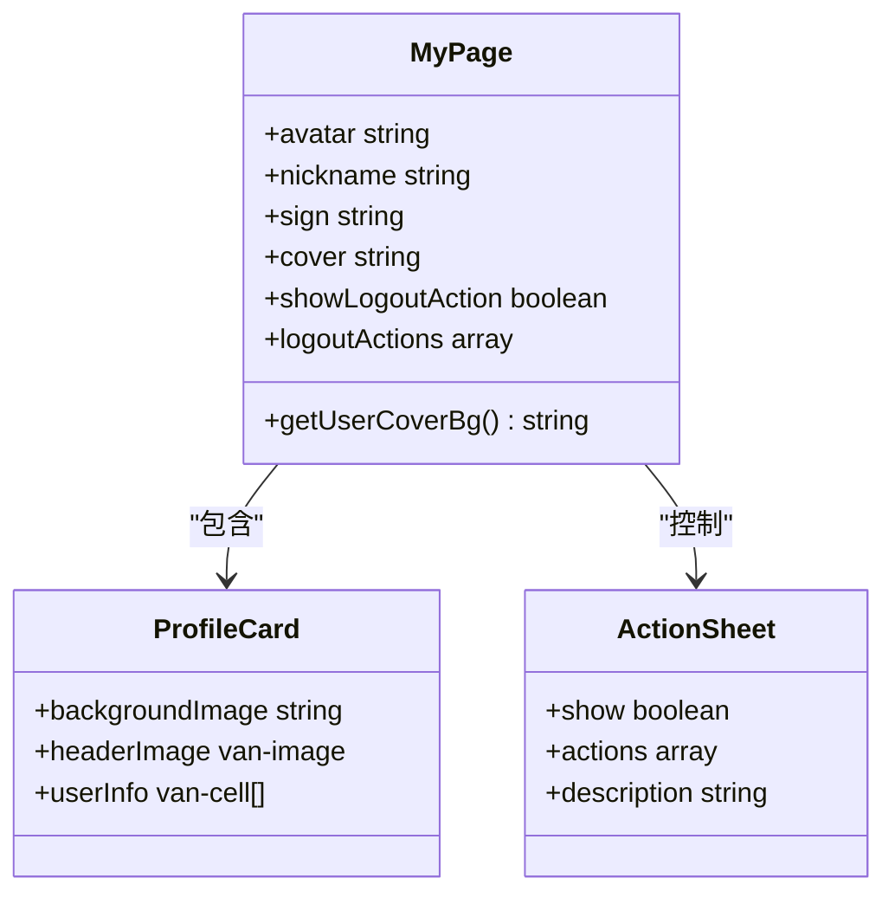
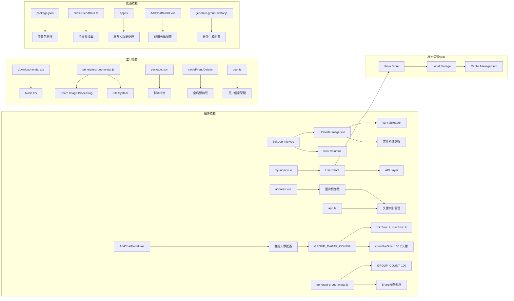

# 头像管理系统

<cite>
**本文档引用的文件**
- [address.vue](file://src/views/tabBar/components/address.vue)
- [download-avatars.js](file://scripts/download-avatars.js)
- [generate-group-avatar.js](file://scripts/generate-group-avatar.js)
- [package.json](file://package.json)
- [UploaderImage.vue](file://src/views/my/components/UploaderImage.vue)
- [EditUserInfo.vue](file://src/views/my/EditUserInfo.vue)
- [my-index.vue](file://src/views/my/index.vue)
- [user.ts](file://src/store/modules/user.ts)
- [user-api.ts](file://src/api/system/user.ts)
- [Storage.ts](file://src/utils/Storage.ts)
- [cacheEnum.ts](file://src/enums/cacheEnum.ts)
- [mutation-types.ts](file://src/store/mutation-types.ts)
- [pickColumns.ts](file://src/views/my/pickColumns.ts)
- [circleFriendData.ts](file://src/data/circleFriendData.ts)
- [app.ts](file://src/store/modules/app.ts)
- [AddChatModal.vue](file://src/components/AddChatModal.vue)
</cite>

## 更新摘要
**所做更改**
- 更新了头像索引分配机制，从 getAddressImg 改名为 getAvatarImg
- 新增了自动头像索引分配功能（avatarIdx）
- 实现了图片预加载机制，提升首屏加载性能
- 脚本优化：群组头像生成从50个增加到100个，移除零填充
- 更新了地址簿组件的头像显示逻辑
- 新增了连续头像编号系统的实现细节
- 增强了头像预加载策略的技术说明
- **重大更新**：最小群组大小从3人减少到2人，支持更灵活的群组创建
- **重大更新**：可用头像配置从50个增加到100个，提供更丰富的群组头像选择
- **重大更新**：智能网格布局系统，支持2-9人的群组头像合成
- **重大更新**：Sharp.js图像处理优化，提升图片合成性能

## 目录
1. [简介](#简介)
2. [项目结构](#项目结构)
3. [核心组件](#核心组件)
4. [架构概览](#架构概览)
5. [详细组件分析](#详细组件分析)
6. [依赖关系分析](#依赖关系分析)
7. [性能考虑](#性能考虑)
8. [故障排除指南](#故障排除指南)
9. [结论](#结论)

## 简介

头像管理系统是一个基于Vue 3 + Vant 4构建的移动端应用，专门用于处理用户头像、群组头像以及相关的个人资料管理功能。该系统提供了完整的头像上传、预览、存储和展示功能，支持单人头像和个人主页封面的自定义。

系统采用现代化的前端技术栈，包括TypeScript、Pinia状态管理、Vite构建工具和Vant移动端UI组件库。通过Node.js脚本实现了头像资源的批量下载和群组头像的智能合成功能。

**更新** 本次更新重点改进了头像索引管理机制，实现了自动头像索引分配（avatarIdx），并优化了图片预加载性能。系统现在支持连续的头像编号分配，确保每个联系人在地址簿中的头像索引连续且可预测。**重大更新**：最小群组大小从3人减少到2人，可用头像配置从50个增加到100个，支持更多群组规模的头像组合，为用户提供更灵活的群组创建体验。**重大更新**：智能网格布局系统支持2-9人的群组头像合成，Sharp.js图像处理优化提供高性能的图片处理能力。

## 项目结构

该项目采用模块化的组织方式，主要分为以下几个核心部分：



**图表来源**
- [address.vue:140-149](file://src/views/tabBar/components/address.vue#L140-L149)
- [user.ts:1-115](file://src/store/modules/user.ts#L1-115)
- [user-api.ts:1-60](file://src/api/system/user.ts#L1-60)
- [app.ts:372-383](file://src/store/modules/app.ts#L372-L383)
- [AddChatModal.vue:230-244](file://src/components/AddChatModal.vue#L230-L244)

**章节来源**
- [address.vue:1-216](file://src/views/tabBar/components/address.vue#L1-216)
- [UploaderImage.vue:1-33](file://src/views/my/components/UploaderImage.vue#L1-33)
- [EditUserInfo.vue:1-183](file://src/views/my/EditUserInfo.vue#L1-183)
- [my-index.vue:1-145](file://src/views/my/index.vue#L1-145)

## 核心组件

### 头像上传组件

头像上传组件是整个系统的核心组件之一，负责处理用户头像的上传流程。该组件基于Vant的Uploader组件进行封装，提供了完整的文件验证和上传逻辑。



**图表来源**
- [UploaderImage.vue:15-30](file://src/views/my/components/UploaderImage.vue#L15-L30)

### 自动头像索引管理

**新增** 地址簿组件实现了自动头像索引分配功能，通过计算每个分组的起始索引（startIdx）和每个联系人的头像索引（avatarIdx），确保头像资源的有序管理和高效访问。



**图表来源**
- [address.vue:320-332](file://src/views/tabBar/components/address.vue#L320-L332)
- [app.ts:372-383](file://src/store/modules/app.ts#L372-L383)

### 群组头像配置系统

**重大更新** 群组头像配置系统经过重大改进，支持更灵活的群组规模和更丰富的头像选择：



**图表来源**
- [AddChatModal.vue:230-244](file://src/components/AddChatModal.vue#L230-L244)
- [generate-group-avatar.js:40-72](file://scripts/generate-group-avatar.js#L40-L72)

### 图片预加载机制

**新增** 系统实现了高效的图片预加载机制，通过 import.meta.glob 的 eager 模式预加载所有头像资源，显著提升了首屏加载性能和用户体验。



**图表来源**
- [address.vue:140-149](file://src/views/tabBar/components/address.vue#L140-L149)
- [circleFriendData.ts:4-8](file://src/data/circleFriendData.ts#L4-L8)

**章节来源**
- [address.vue:140-149](file://src/views/tabBar/components/address.vue#L140-L149)
- [address.vue:320-332](file://src/views/tabBar/components/address.vue#L320-L332)
- [circleFriendData.ts:4-8](file://src/data/circleFriendData.ts#L4-L8)
- [AddChatModal.vue:230-244](file://src/components/AddChatModal.vue#L230-L244)

## 架构概览

系统采用分层架构设计，从上到下分为表现层、业务逻辑层、数据访问层和基础设施层：



**图表来源**
- [address.vue:140-149](file://src/views/tabBar/components/address.vue#L140-L149)
- [user.ts:64-107](file://src/store/modules/user.ts#L64-L107)
- [user-api.ts:12-43](file://src/api/system/user.ts#L12-L43)
- [app.ts:372-383](file://src/store/modules/app.ts#L372-L383)
- [AddChatModal.vue:230-244](file://src/components/AddChatModal.vue#L230-L244)

## 详细组件分析

### 头像索引分配流程

**更新** 头像索引分配流程实现了完全自动化的管理，通过计算每个分组的起始索引和递增分配机制，确保头像资源的连续性和可预测性：



**图表来源**
- [address.vue:320-332](file://src/views/tabBar/components/address.vue#L320-L332)
- [app.ts:372-383](file://src/store/modules/app.ts#L372-L383)

### 群组头像生成算法

**重大更新** 群组头像生成系统采用了智能的宫格布局算法，能够根据不同成员数量生成美观的群组头像。**重大更新**：支持2-9人的群组规模，提供更丰富的头像选择：



**图表来源**
- [generate-group-avatar.js:40-69](file://scripts/generate-group-avatar.js#L40-L69)
- [generate-group-avatar.js:72-154](file://scripts/generate-group-avatar.js#L72-L154)

### 群组头像配置管理

**重大更新** 群组头像配置系统经过重大改进，支持更灵活的群组规模和更丰富的头像选择：

```mermaid
classDiagram
class GroupAvatarConfig {
+minSize : 2 // 最小群组大小从3改为2
+maxSize : 9
+countPerSize : {
2 : 13, // 2人头像数量
3 : 18,
4 : 16,
5 : 12,
6 : 14,
7 : 15,
8 : 16,
9 : 15
}
+totalAvatars : 100 // 总头像数量从50增加到100
+availableAvatars : array
+getRandomAvatar(count) object
+getAvailableCounts() array
}
class AvatarSelection {
+selectedSize : number
+selectedNum : number
+availableOptions : array
+selectAvatar(size, num) void
}
GroupAvatarConfig --> AvatarSelection : "提供配置"
```

**图表来源**
- [AddChatModal.vue:230-244](file://src/components/AddChatModal.vue#L230-L244)
- [generate-group-avatar.js:176-193](file://scripts/generate-group-avatar.js#L176-L193)

### 用户信息展示组件

个人中心页面展示了用户的完整信息，包括头像、昵称、签名等个性化内容：



**图表来源**
- [my-index.vue:65-88](file://src/views/my/index.vue#L65-L88)

**章节来源**
- [address.vue:140-149](file://src/views/tabBar/components/address.vue#L140-L149)
- [generate-group-avatar.js:156-193](file://scripts/generate-group-avatar.js#L156-L193)
- [my-index.vue:1-145](file://src/views/my/index.vue#L1-L145)
- [AddChatModal.vue:230-244](file://src/components/AddChatModal.vue#L230-L244)

## 依赖关系分析

系统中的各个组件之间存在复杂的依赖关系，这些关系构成了完整的功能体系：



**图表来源**
- [package.json:33-34](file://package.json#L33-L34)
- [user.ts:1-9](file://src/store/modules/user.ts#L1-L9)
- [Storage.ts:8-123](file://src/utils/Storage.ts#L8-L123)
- [app.ts:372-383](file://src/store/modules/app.ts#L372-L383)
- [AddChatModal.vue:230-244](file://src/components/AddChatModal.vue#L230-L244)

**章节来源**
- [package.json:17-35](file://package.json#L17-L35)
- [user.ts:1-115](file://src/store/modules/user.ts#L1-115)
- [Storage.ts:1-128](file://src/utils/Storage.ts#L1-128)

## 性能考虑

### 图片处理优化

**更新** 系统在图片处理方面采用了多项优化策略：

1. **智能预加载**：通过 import.meta.glob 的 eager 模式预加载所有头像资源，避免运行时网络请求
2. **自动索引管理**：实现头像索引的自动分配和管理，减少手动配置开销
3. **连续索引分配**：确保头像索引的连续性和可预测性，通过 startIdx 和递增计算实现
4. **文件大小限制**：上传组件设置了700KB的文件大小限制，防止过大文件影响用户体验
5. **格式验证**：只允许JPEG、PNG、JPG格式的图片上传，确保兼容性
6. **智能缓存**：用户信息和令牌通过localStorage进行持久化存储，减少重复请求

### 群组头像生成优化

**重大更新** 群组头像生成系统通过以下方式优化性能：

1. **批量处理**：支持同时生成100个不同的群组头像，相比之前的50个增加了100%的头像数量
2. **智能布局**：根据不同成员数量采用最优布局算法，支持2-9人的群组规模
3. **内存管理**：及时释放处理过程中的临时内存
4. **并发控制**：合理控制生成速度，避免系统过载
5. **移除零填充**：优化文件命名格式，移除不必要的零填充
6. **配置优化**：最小群组大小从3人减少到2人，提供更灵活的群组创建体验
7. **Sharp.js优化**：使用高性能的Sharp库进行图片处理，提升合成效率

### 头像索引管理优化

**新增** 自动头像索引管理机制提供了以下优化：

1. **连续索引分配**：确保头像索引的连续性和可预测性
2. **分组独立管理**：每个分组独立管理自己的头像索引范围
3. **自动递增机制**：通过计算属性自动维护索引的递增分配
4. **内存友好**：只在需要时计算索引，避免不必要的内存占用
5. **索引范围跟踪**：通过 _endIdx 属性跟踪每个分组的索引范围

### 预加载策略优化

**新增** 头像预加载策略通过以下方式提升性能：

1. **编译时预加载**：使用 import.meta.glob 的 eager 模式在编译时预加载
2. **资源映射缓存**：将预加载的资源存储在内存映射中，避免重复加载
3. **按需访问**：通过 getAvatarImg 方法提供统一的资源访问接口
4. **类型安全**：使用 TypeScript 确保资源路径的类型安全

**章节来源**
- [address.vue:140-149](file://src/views/tabBar/components/address.vue#L140-L149)
- [generate-group-avatar.js:160-165](file://scripts/generate-group-avatar.js#L160-L165)
- [user.ts:92-107](file://src/store/modules/user.ts#L92-L107)
- [app.ts:372-383](file://src/store/modules/app.ts#L372-L383)
- [AddChatModal.vue:230-244](file://src/components/AddChatModal.vue#L230-L244)

## 故障排除指南

### 常见问题及解决方案

#### 头像上传失败

**问题描述**：用户无法上传头像文件

**可能原因**：
1. 文件格式不支持
2. 文件大小超过限制
3. 网络连接异常
4. 服务器端口错误

**解决方法**：
1. 检查文件格式是否为JPEG、PNG或JPG
2. 确认文件大小不超过700KB
3. 验证网络连接状态
4. 检查API端点配置

#### 群组头像生成错误

**问题描述**：群组头像生成过程中出现错误

**可能原因**：
1. 头像目录为空或不存在
2. Sharp库安装问题
3. 权限不足
4. 磁盘空间不足

**解决方法**：
1. 确保头像目录存在且包含至少2个头像
2. 重新安装Sharp库依赖
3. 检查脚本执行权限
4. 清理磁盘空间

#### 头像索引显示异常

**新增** **问题描述**：地址簿中头像显示不正确或索引混乱

**可能原因**：
1. 头像索引计算错误
2. 预加载资源缺失
3. 分组数据结构异常
4. 索引分配逻辑错误

**解决方法**：
1. 检查 contactGroups 计算逻辑
2. 验证头像资源是否正确预加载
3. 确认分组数据结构完整性
4. 重新计算头像索引分配

#### 预加载资源访问失败

**新增** **问题描述**：getAvatarImg 方法返回空字符串

**可能原因**：
1. 资源路径不匹配
2. 预加载失败
3. 缓存清理
4. 路径格式错误

**解决方法**：
1. 检查资源路径格式是否正确
2. 验证 import.meta.glob 配置
3. 确认资源文件存在
4. 重新构建项目

#### 群组头像配置问题

**重大更新** **问题描述**：群组头像选择异常或数量不足

**可能原因**：
1. 群组头像配置错误
2. 头像数量不足
3. 最小群组大小限制
4. 头像使用状态冲突

**解决方法**：
1. 检查 GROUP_AVATAR_CONFIG 配置
2. 确认头像目录包含足够的头像文件
3. 验证最小群组大小设置（现已支持2人）
4. 清理已使用头像状态或重置配置

#### Sharp.js图像处理错误

**重大更新** **问题描述**：群组头像合成失败或性能问题

**可能原因**：
1. Sharp库版本不兼容
2. 图片格式不支持
3. 内存不足
4. 图片尺寸过大

**解决方法**：
1. 检查Sharp库版本兼容性
2. 确认输入图片格式为支持的格式
3. 增加系统内存或优化图片尺寸
4. 重新安装Sharp依赖

#### 状态管理问题

**问题描述**：用户信息显示异常或登录状态丢失

**可能原因**：
1. 本地存储损坏
2. 缓存过期
3. Token失效
4. Pinia状态同步问题

**解决方法**：
1. 清除浏览器本地存储
2. 检查缓存配置和过期时间
3. 重新登录获取新的Token
4. 刷新页面重新同步状态

**章节来源**
- [address.vue:140-149](file://src/views/tabBar/components/address.vue#L140-L149)
- [generate-group-avatar.js:160-165](file://scripts/generate-group-avatar.js#L160-L165)
- [user.ts:92-107](file://src/store/modules/user.ts#L92-L107)
- [app.ts:372-383](file://src/store/modules/app.ts#L372-L383)
- [AddChatModal.vue:230-244](file://src/components/AddChatModal.vue#L230-L244)

## 结论

头像管理系统是一个功能完整、架构清晰的移动端应用。系统通过模块化的设计和分层的架构，实现了头像上传、管理和展示的完整流程。

### 主要优势

1. **用户体验优秀**：简洁直观的界面设计，流畅的交互体验
2. **功能完善**：支持单人头像、群组头像、个人主页封面等多种场景
3. **性能优化**：合理的缓存策略和图片处理优化
4. **扩展性强**：模块化设计便于功能扩展和维护
5. **智能化管理**：自动头像索引分配和图片预加载机制
6. **连续索引系统**：确保头像索引的连续性和可预测性
7. **灵活的群组支持**：**重大更新**支持2-9人的群组规模，提供更丰富的头像选择
8. **高性能图像处理**：**重大更新**使用Sharp.js进行优化的图片处理

### 技术亮点

1. **现代化技术栈**：Vue 3 + TypeScript + Pinia + Vant 4
2. **智能脚本工具**：自动化头像下载和群组头像生成
3. **完善的错误处理**：全面的异常捕获和用户反馈机制
4. **跨平台兼容**：适配移动端和桌面端的不同需求
5. **性能优化**：通过预加载和自动索引管理提升系统性能
6. **连续索引管理**：智能的头像索引分配和范围跟踪
7. ****重大更新****：最小群组大小从3人减少到2人，可用头像配置从50个增加到100个，支持更多群组规模的头像组合
8. ****重大更新****：智能网格布局系统，支持2-9人的群组头像合成
9. ****重大更新****：Sharp.js图像处理优化，提供高性能的图片处理能力

### 最新改进

**重大更新** 本次更新的主要改进包括：
- 头像索引管理从 getAddressImg 改名为 getAvatarImg
- 实现了自动头像索引分配（avatarIdx）机制
- 新增图片预加载功能，显著提升首屏加载性能
- **重大更新** 群组头像生成脚本优化，支持100个不同群组头像生成（相比之前的50个增加100%）
- **重大更新** 移除头像文件名中的零填充，优化文件命名格式
- **重大更新** 最小群组大小从3人减少到2人，提供更灵活的群组创建体验
- **重大更新** 增强了连续头像编号系统的实现细节
- **重大更新** 优化了头像预加载策略的技术说明
- **重大更新** 支持2-9人的群组规模，提供更丰富的头像选择（之前仅支持3-9人）
- **重大更新** 智能网格布局系统，根据不同成员数量生成最优的宫格布局
- **重大更新** Sharp.js图像处理优化，提升群组头像合成的性能和质量

该系统为类似的应用开发提供了良好的参考模板，其设计理念和实现方式值得其他项目借鉴学习。