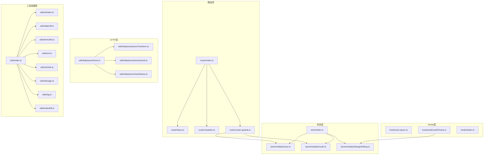
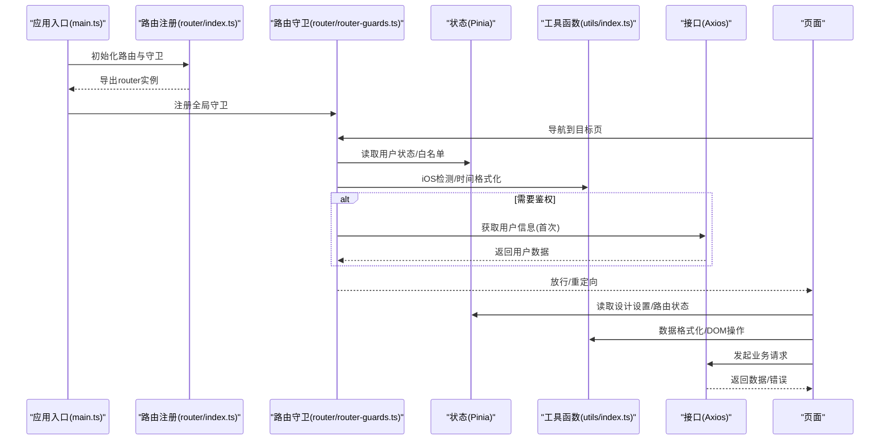
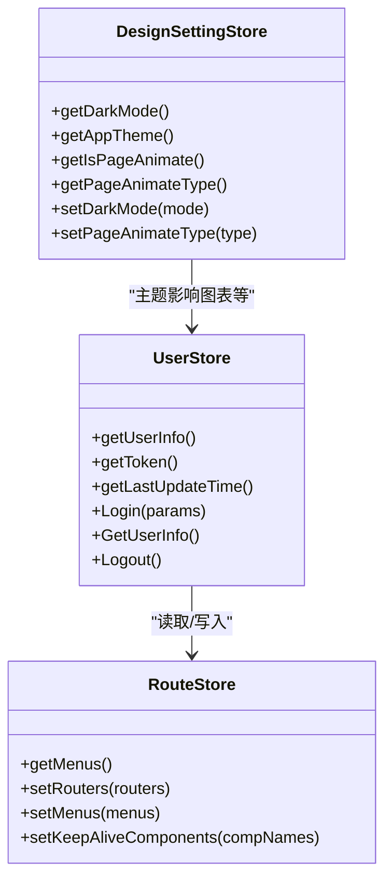
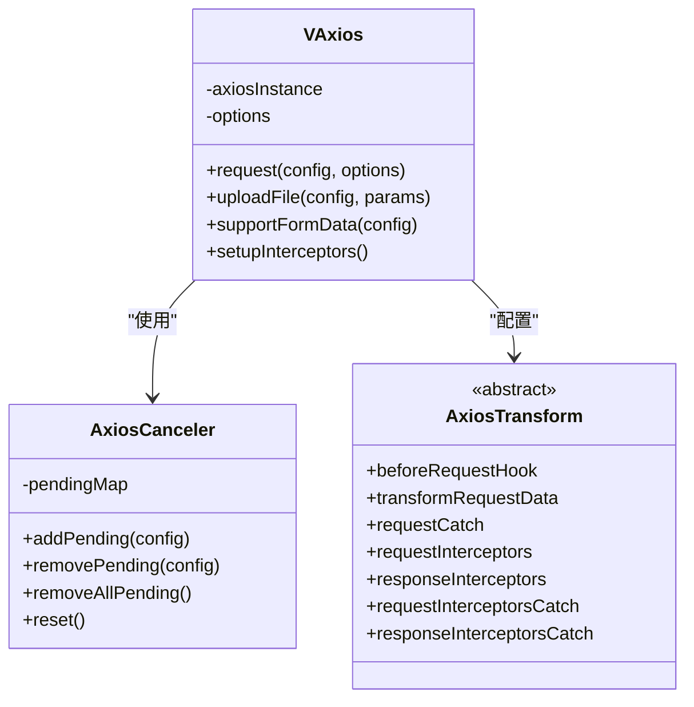
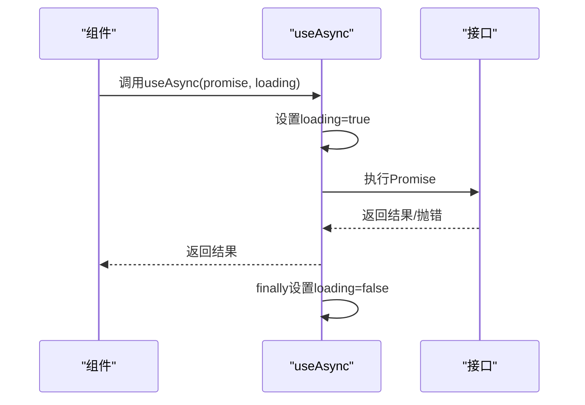
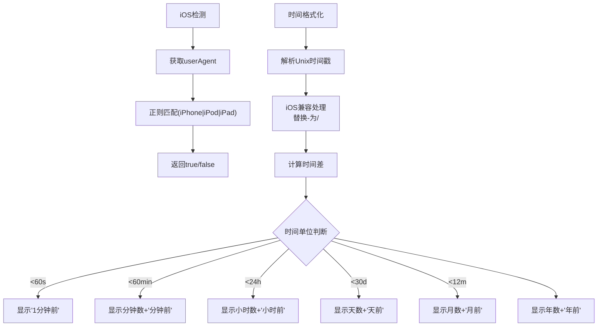
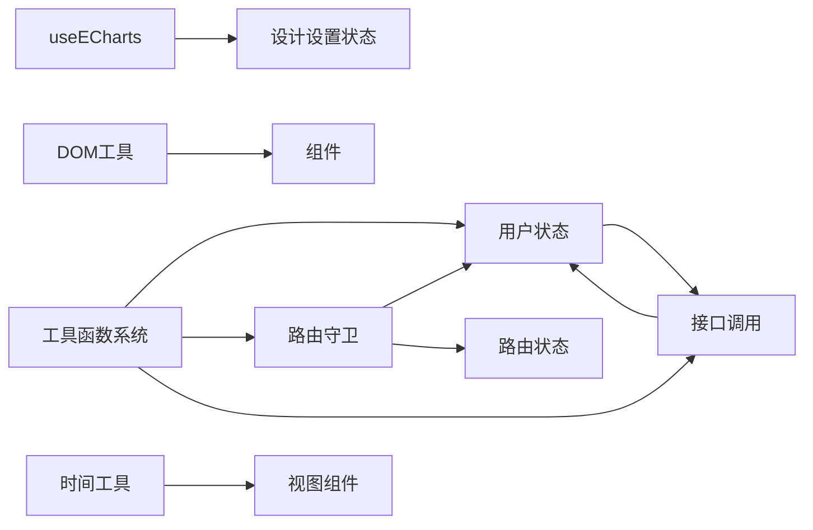

# 核心系统

<cite>
**本文引用的文件**
- [src/router/index.ts](file://src/router/index.ts)
- [src/router/router-guards.ts](file://src/router/router-guards.ts)
- [src/router/base.ts](file://src/router/base.ts)
- [src/router/modules.ts](file://src/router/modules.ts)
- [src/store/index.ts](file://src/store/index.ts)
- [src/store/modules/user.ts](file://src/store/modules/user.ts)
- [src/store/modules/route.ts](file://src/store/modules/route.ts)
- [src/store/modules/designSetting.ts](file://src/store/modules/designSetting.ts)
- [src/utils/http/axios/Axios.ts](file://src/utils/http/axios/Axios.ts)
- [src/utils/http/axios/axiosTransform.ts](file://src/utils/http/axios/axiosTransform.ts)
- [src/utils/http/axios/axiosCancel.ts](file://src/utils/http/axios/axiosCancel.ts)
- [src/utils/http/axios/checkStatus.ts](file://src/utils/http/axios/checkStatus.ts)
- [src/hooks/web/useECharts.ts](file://src/hooks/web/useECharts.ts)
- [src/hooks/use-async.ts](file://src/hooks/use-async.ts)
- [src/hooks/index.ts](file://src/hooks/index.ts)
- [src/utils/index.ts](file://src/utils/index.ts)
- [src/utils/is/index.ts](file://src/utils/is/index.ts)
- [src/utils/dateUtil.ts](file://src/utils/dateUtil.ts)
- [src/utils/domUtils.ts](file://src/utils/domUtils.ts)
- [src/utils/env.ts](file://src/utils/env.ts)
- [src/utils/urlUtils.ts](file://src/utils/urlUtils.ts)
- [src/utils/Storage.ts](file://src/utils/Storage.ts)
- [src/utils/log.ts](file://src/utils/log.ts)
- [src/utils/indexDB.ts](file://src/utils/indexDB.ts)
</cite>

## 更新摘要
**所做更改**
- 新增工具函数系统章节，涵盖iOS检测、时间格式化、颜色处理等实用工具函数
- 更新工具函数分类说明，包括类型判断、DOM操作、环境配置等
- 新增工具函数使用场景和最佳实践指导
- 完善依赖分析，展示工具函数与其他核心系统的集成关系

## 目录
1. [引言](#引言)
2. [项目结构](#项目结构)
3. [核心组件](#核心组件)
4. [架构总览](#架构总览)
5. [详细组件分析](#详细组件分析)
6. [工具函数系统](#工具函数系统)
7. [依赖分析](#依赖分析)
8. [性能考虑](#性能考虑)
9. [故障排查指南](#故障排查指南)
10. [结论](#结论)
11. [附录](#附录)

## 引言
本文件面向Vue3微信H5移动端项目，系统性梳理并解读五大核心系统：路由系统（Vue Router）、状态管理（Pinia）、HTTP请求（Axios封装）、自定义Hooks与组件库理念、以及新增的工具函数系统。文档以"可读性优先"的原则，结合代码级图示与最佳实践，帮助开发者快速理解与高效扩展。

## 项目结构
项目采用"按功能域分层+模块化组织"的结构：
- 路由层：集中于 src/router，包含基础路由、模块化路由与路由守卫
- 状态层：集中于 src/store，包含用户、路由、设计设置等模块
- HTTP层：集中于 src/utils/http/axios，包含Axios实例、拦截器、取消器与状态检查
- Hooks层：集中于 src/hooks，包含事件、核心、Web图表等可复用组合式函数
- 工具函数层：集中于 src/utils，包含类型判断、DOM操作、环境配置、存储管理等实用工具
- 组件层：基础组件位于 src/components，布局组件位于 src/layout，业务视图位于 src/views

**图示来源**
- [src/router/index.ts:1-33](file://src/router/index.ts#L1-L33)
- [src/router/router-guards.ts:1-93](file://src/router/router-guards.ts#L1-L93)
- [src/store/index.ts:1-13](file://src/store/index.ts#L1-L13)
- [src/utils/http/axios/Axios.ts:1-225](file://src/utils/http/axios/Axios.ts#L1-L225)
- [src/utils/index.ts:1-234](file://src/utils/index.ts#L1-L234)

**章节来源**
- [src/router/index.ts:1-33](file://src/router/index.ts#L1-L33)
- [src/store/index.ts:1-13](file://src/store/index.ts#L1-L13)
- [src/utils/index.ts:1-234](file://src/utils/index.ts#L1-L234)

## 核心组件
本节对五大核心系统进行要点提炼与使用场景说明：

- 路由系统（Vue Router）
  - 动态路由：通过模块化路由文件聚合菜单与页面路由，统一注入到路由器
  - 路由守卫：全局前置守卫负责鉴权、白名单放行、进度条与标题设置；后置守卫负责keep-alive组件缓存策略
  - 错误处理：路由错误统一上报
- 状态管理系统（Pinia）
  - 用户状态：登录、登出、获取用户信息、Token与用户信息持久化
  - 路由状态：菜单、路由表与keep-alive组件集合
  - 设计设置状态：深浅色主题、页面动画类型等持久化
- HTTP请求系统（Axios封装）
  - 统一拦截器：请求/响应拦截、错误捕获、请求取消
  - 数据转换：请求前钩子、响应数据转换、异常处理
  - 请求取消：基于URL与参数生成唯一键，避免重复请求
  - 状态提示：根据HTTP状态码统一提示
- 自定义Hooks系统
  - useAsync：统一异步加载状态设置
  - useECharts：图表初始化、主题适配、尺寸监听与卸载清理
- 工具函数系统
  - 类型判断：全面的JavaScript类型检测函数
  - iOS检测：移动端设备识别，解决iOS时间格式兼容问题
  - 时间格式化：相对时间计算，支持秒、分钟、小时、天、月、年等单位
  - 颜色处理：HEX颜色加减、透明度转换、主题色设置
  - DOM操作：元素类名管理、事件绑定、节流优化
  - 环境配置：构建时环境变量获取与模式判断
  - 存储管理：本地缓存封装，支持过期时间与Cookie操作
  - 数据库操作：IndexedDB封装，提供完整的CRUD操作

**章节来源**
- [src/router/router-guards.ts:17-93](file://src/router/router-guards.ts#L17-L93)
- [src/store/modules/user.ts:36-115](file://src/store/modules/user.ts#L36-L115)
- [src/store/modules/route.ts:11-40](file://src/store/modules/route.ts#L11-L40)
- [src/store/modules/designSetting.ts:8-52](file://src/store/modules/designSetting.ts#L8-L52)
- [src/utils/http/axios/Axios.ts:18-225](file://src/utils/http/axios/Axios.ts#L18-L225)
- [src/utils/http/axios/axiosCancel.ts:15-65](file://src/utils/http/axios/axiosCancel.ts#L15-L65)
- [src/utils/http/axios/checkStatus.ts:3-49](file://src/utils/http/axios/checkStatus.ts#L3-L49)
- [src/hooks/use-async.ts:12-17](file://src/hooks/use-async.ts#L12-L17)
- [src/hooks/web/useECharts.ts:14-123](file://src/hooks/web/useECharts.ts#L14-L123)
- [src/utils/index.ts:101-234](file://src/utils/index.ts#L101-L234)

## 架构总览
下图展示了从应用启动到页面渲染的关键交互链路，覆盖路由注册、守卫执行、状态读取、HTTP请求流程以及工具函数的集成使用。

**图示来源**
- [src/router/index.ts:26-33](file://src/router/index.ts#L26-L33)
- [src/router/router-guards.ts:17-51](file://src/router/router-guards.ts#L17-L51)
- [src/store/modules/user.ts:79-90](file://src/store/modules/user.ts#L79-L90)
- [src/utils/index.ts:101-148](file://src/utils/index.ts#L101-L148)
- [src/utils/http/axios/Axios.ts:55-100](file://src/utils/http/axios/Axios.ts#L55-L100)

## 详细组件分析

### 路由系统（Vue Router）
- 路由注册与动态注入
  - 常量路由（登录、根路由、错误页）与模块化路由合并注入
  - 路由表与菜单同步写入路由状态
- 路由守卫机制
  - 白名单直接放行
  - Token缺失则重定向至登录
  - 首次进入时拉取用户信息
  - 页面标题与进度条管理
  - keep-alive组件缓存策略：根据路由meta.keepAlive动态增删
- 错误处理
  - onError统一记录路由错误

**图示来源**
- [src/router/router-guards.ts:17-93](file://src/router/router-guards.ts#L17-L93)

**章节来源**
- [src/router/index.ts:11-30](file://src/router/index.ts#L11-L30)
- [src/router/base.ts:7-54](file://src/router/base.ts#L7-L54)
- [src/router/modules.ts:5-147](file://src/router/modules.ts#L5-L147)
- [src/router/router-guards.ts:17-93](file://src/router/router-guards.ts#L17-L93)

### 状态管理系统（Pinia）
- 用户状态（useUserStore）
  - 登录：调用登录接口，保存Token
  - 获取用户信息：首次进入时拉取并持久化
  - 登出：调用后端登出接口，清除本地状态并跳转登录
- 路由状态（useRouteStore）
  - 维护菜单、路由表与keep-alive组件列表
- 设计设置状态（useDesignSettingStore）
  - 主题、深浅色、页面动画类型等持久化

**图示来源**
- [src/store/modules/user.ts:36-115](file://src/store/modules/user.ts#L36-L115)
- [src/store/modules/route.ts:11-40](file://src/store/modules/route.ts#L11-L40)
- [src/store/modules/designSetting.ts:8-52](file://src/store/modules/designSetting.ts#L8-L52)

**章节来源**
- [src/store/modules/user.ts:36-115](file://src/store/modules/user.ts#L36-L115)
- [src/store/modules/route.ts:11-40](file://src/store/modules/route.ts#L11-L40)
- [src/store/modules/designSetting.ts:8-52](file://src/store/modules/designSetting.ts#L8-L52)

### HTTP请求系统（Axios封装）
- VAxios类职责
  - 统一创建Axios实例、设置拦截器、请求/响应处理
  - 支持FormData、URL编码、上传文件
  - 提供请求取消能力（AxiosCanceler）
- 拦截器与错误处理
  - 请求拦截：加入待取消队列、可选忽略取消
  - 响应拦截：移除待取消、统一数据转换
  - 错误捕获：requestCatch与responseInterceptorsCatch
- 请求取消
  - 基于方法、URL、请求体与查询参数生成唯一键
  - 同一未完成请求仅保留一个，避免重复提交
- 状态提示
  - 根据HTTP状态码统一Toast提示

**图示来源**
- [src/utils/http/axios/Axios.ts:18-225](file://src/utils/http/axios/Axios.ts#L18-L225)
- [src/utils/http/axios/axiosCancel.ts:15-65](file://src/utils/http/axios/axiosCancel.ts#L15-L65)
- [src/utils/http/axios/axiosTransform.ts:13-53](file://src/utils/http/axios/axiosTransform.ts#L13-L53)

**章节来源**
- [src/utils/http/axios/Axios.ts:18-225](file://src/utils/http/axios/Axios.ts#L18-L225)
- [src/utils/http/axios/axiosCancel.ts:15-65](file://src/utils/http/axios/axiosCancel.ts#L15-L65)
- [src/utils/http/axios/axiosTransform.ts:13-53](file://src/utils/http/axios/axiosTransform.ts#L13-L53)
- [src/utils/http/axios/checkStatus.ts:3-49](file://src/utils/http/axios/checkStatus.ts#L3-L49)

### 自定义Hooks系统
- useAsync
  - 统一设置loading状态（Ref或响应式对象），自动在finally阶段关闭loading
- useECharts
  - 封装图表初始化、主题切换、窗口尺寸变化处理、卸载清理
  - 与设计设置状态联动，自动适配深浅色

**图示来源**
- [src/hooks/use-async.ts:12-17](file://src/hooks/use-async.ts#L12-L17)

**章节来源**
- [src/hooks/use-async.ts:12-17](file://src/hooks/use-async.ts#L12-L17)
- [src/hooks/web/useECharts.ts:14-123](file://src/hooks/web/useECharts.ts#L14-L123)

### 组件库系统设计理念
- 基础组件抽象
  - 通用图标组件（SvgIcon）、Logo等，作为UI最小可用单元
- 复用策略
  - 通过Props/Events/Slots标准化接口，配合样式变量与主题系统
  - 与设计设置状态解耦，主题切换通过状态驱动
- 与Hooks协作
  - 图表组件与useECharts协作，实现主题与尺寸的自动化适配

**章节来源**
- [src/components/SvgIcon.vue](file://src/components/SvgIcon.vue)
- [src/components/Logo.vue](file://src/components/Logo.vue)
- [src/hooks/web/useECharts.ts:14-123](file://src/hooks/web/useECharts.ts#L14-L123)

## 工具函数系统

### 工具函数概览
工具函数系统是项目的重要基础设施，提供了丰富的实用函数，涵盖类型判断、DOM操作、环境配置、数据处理等多个方面。系统采用模块化设计，每个工具函数都有明确的职责和使用场景。

### 类型判断工具
提供全面的JavaScript类型检测函数，确保在运行时能够准确判断变量类型。

- is函数：通用类型判断
- isFunction/isString/isNumber等：特定类型检测
- isObject/isArray/isDate：复杂类型判断
- isClient/isServer：环境判断
- isHttps：URL协议判断

**章节来源**
- [src/utils/is/index.ts:1-126](file://src/utils/is/index.ts#L1-L126)

### iOS检测与时间格式化
专门针对移动端H5开发的实用工具，解决iOS设备的时间格式兼容性问题。

- isIos函数：检测iOS设备，通过userAgent判断
- getDateTimeFormat函数：相对时间格式化，支持中文显示
- getTime函数：获取时间对象，包含多种格式化选项
- getsomeTime函数：基于分钟偏移获取时间

**图示来源**
- [src/utils/index.ts:101-148](file://src/utils/index.ts#L101-L148)

**章节来源**
- [src/utils/index.ts:101-148](file://src/utils/index.ts#L101-L148)

### 颜色处理工具
提供颜色转换和处理功能，支持主题色的动态调整。

- lighten/darken：颜色加亮/变暗
- hexToRgba：HEX颜色转RGBA
- setMetaColor：设置meta主题色

**章节来源**
- [src/utils/index.ts:17-99](file://src/utils/index.ts#L17-L99)

### DOM操作工具
提供DOM元素操作的便捷函数，简化常见的DOM处理任务。

- hasClass/addClass/removeClass：类名管理
- getViewportOffset：元素位置计算
- hackCss：CSS前缀处理
- on/off/once：事件绑定
- useRafThrottle：RAF节流

**章节来源**
- [src/utils/domUtils.ts:1-200](file://src/utils/domUtils.ts#L1-L200)

### 环境配置工具
处理应用的环境变量和配置信息。

- getAppEnvConfig：获取应用环境配置
- getEnv/isDevMode/isProdMode：环境模式判断
- getCommonStoragePrefix/getStorageShortName：存储前缀生成

**章节来源**
- [src/utils/env.ts:1-90](file://src/utils/env.ts#L1-L90)

### URL处理工具
提供URL参数处理和拼接功能。

- setObjToUrlParams：对象转URL参数

**章节来源**
- [src/utils/urlUtils.ts:1-26](file://src/utils/urlUtils.ts#L1-L26)

### 存储管理工具
提供本地存储的封装，支持过期时间和Cookie操作。

- createStorage：创建存储实例
- storage：默认localStorage实例
- Cookie操作：setCookie/getCookie/removeCookie/clearCookie

**章节来源**
- [src/utils/Storage.ts:1-128](file://src/utils/Storage.ts#L1-L128)

### 日志工具
提供统一的日志输出功能。

- warn：警告日志
- error：错误日志

**章节来源**
- [src/utils/log.ts:1-10](file://src/utils/log.ts#L1-L10)

### IndexedDB工具
提供IndexedDB数据库的封装操作。

- openDB：打开数据库
- CRUD操作：addData/getDataByKey/updateDB/deleteDB
- 查询操作：cursorGetData/getDataByIndex/cursorGetDataByIndex
- 数据库管理：deleteDBAll/closeDB

**章节来源**
- [src/utils/indexDB.ts:1-228](file://src/utils/indexDB.ts#L1-L228)

### 工具函数使用场景
- 路由守卫：使用isIos解决iOS时间格式兼容问题
- 状态管理：使用createStorage进行Token和用户信息持久化
- 组件开发：使用domUtils进行DOM操作和事件处理
- 数据展示：使用dateUtil和getDateTimeFormat进行时间格式化
- 主题适配：使用setMetaColor动态设置主题色

**章节来源**
- [src/router/router-guards.ts:30-50](file://src/router/router-guards.ts#L30-L50)
- [src/store/modules/user.ts:10-105](file://src/store/modules/user.ts#L10-L105)
- [src/utils/index.ts:206-211](file://src/utils/index.ts#L206-L211)

## 依赖分析
- 路由与状态
  - 路由守卫依赖用户状态与路由状态，用于鉴权与缓存策略
  - 工具函数isIos被路由守卫用于iOS设备检测
- HTTP与状态
  - 用户登录/登出与接口调用强关联，接口错误需结合状态进行提示与跳转
- Hooks与状态
  - useECharts依赖设计设置状态，实现主题联动
- 工具函数集成
  - Storage工具被用户状态模块广泛使用
  - DOM工具被组件和Hooks系统使用
  - 时间工具被数据展示组件使用

**图示来源**
- [src/router/router-guards.ts:17-93](file://src/router/router-guards.ts#L17-L93)
- [src/store/modules/user.ts:36-115](file://src/store/modules/user.ts#L36-L115)
- [src/store/modules/designSetting.ts:8-52](file://src/store/modules/designSetting.ts#L8-L52)
- [src/hooks/web/useECharts.ts:14-123](file://src/hooks/web/useECharts.ts#L14-L123)
- [src/utils/index.ts:101-148](file://src/utils/index.ts#L101-L148)

**章节来源**
- [src/router/router-guards.ts:17-93](file://src/router/router-guards.ts#L17-L93)
- [src/store/modules/user.ts:36-115](file://src/store/modules/user.ts#L36-L115)
- [src/store/modules/designSetting.ts:8-52](file://src/store/modules/designSetting.ts#L8-L52)
- [src/hooks/web/useECharts.ts:14-123](file://src/hooks/web/useECharts.ts#L14-L123)
- [src/utils/index.ts:101-148](file://src/utils/index.ts#L101-L148)

## 性能考虑
- 路由与状态
  - keep-alive组件缓存策略减少重复渲染，建议仅缓存高频/重页面
  - 首次进入拉取用户信息避免重复请求
- HTTP
  - 请求取消避免并发重复请求，提升交互流畅度
  - 表单数据统一序列化，减少无效传输
- Hooks
  - useECharts使用防抖resize与延迟初始化，降低首屏开销
- 工具函数
  - 使用RAF节流优化DOM操作性能
  - 合理使用缓存避免重复计算
  - iOS检测只在必要时调用，避免频繁DOM操作

## 故障排查指南
- 路由
  - 登录后无法进入：检查白名单与Token逻辑，确认路由守卫放行条件
  - 页面标题未更新：检查后置守卫中的标题设置逻辑
  - 缓存异常：核对路由meta.keepAlive与keepAliveComponents更新逻辑
- 状态
  - 登录后用户信息为空：确认登录接口返回与GetUserInfo调用顺序
  - 主题切换无效：检查设计设置状态与useECharts主题联动
- HTTP
  - 请求重复：启用请求取消，确保URL与参数稳定
  - 错误提示不一致：核对checkStatus映射与接口返回状态码
- Hooks
  - useAsync未关闭loading：确认传入的是Ref或响应式对象
- 工具函数
  - iOS检测失败：检查userAgent格式和正则表达式
  - 时间格式化异常：确认输入时间格式和兼容性处理
  - DOM操作报错：检查元素是否存在和事件绑定是否正确

**章节来源**
- [src/router/router-guards.ts:17-93](file://src/router/router-guards.ts#L17-L93)
- [src/store/modules/user.ts:79-90](file://src/store/modules/user.ts#L79-L90)
- [src/utils/http/axios/checkStatus.ts:3-49](file://src/utils/http/axios/checkStatus.ts#L3-L49)
- [src/hooks/use-async.ts:12-17](file://src/hooks/use-async.ts#L12-L17)
- [src/utils/index.ts:101-148](file://src/utils/index.ts#L101-L148)

## 结论
本项目在路由、状态、HTTP、Hooks和工具函数五个维度形成了清晰的分层与职责边界：路由负责导航与权限，状态负责数据与持久化，HTTP负责网络与错误，Hooks负责可复用逻辑与跨模块协作，工具函数负责底层能力与基础设施。通过统一的拦截器、请求取消、主题联动和丰富的工具函数，系统在移动端H5场景下具备良好的可维护性、扩展性和性能表现。

## 附录
- 最佳实践清单
  - 路由：将常量路由与模块化路由分离，明确白名单与鉴权边界
  - 状态：将Token与用户信息分离管理，避免跨模块耦合
  - HTTP：统一错误处理与状态提示，启用请求取消
  - Hooks：保持单一职责，提供明确的输入输出与生命周期清理
  - 工具函数：合理使用类型判断，注意平台兼容性，避免过度依赖全局状态
  - iOS适配：使用isIos进行设备检测，处理时间格式兼容性问题
  - DOM操作：使用工具函数进行安全的DOM操作，注意内存泄漏防护
  - 存储管理：合理设置缓存过期时间，注意Cookie跨域问题