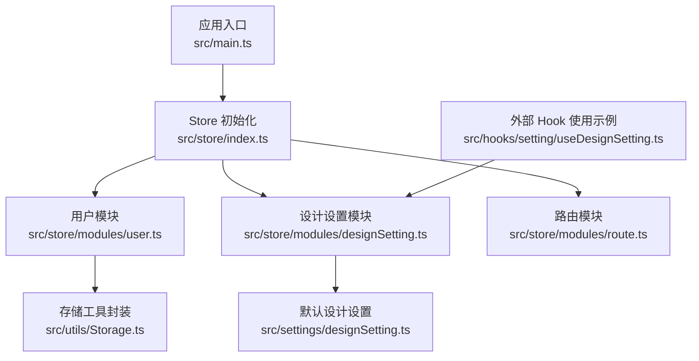
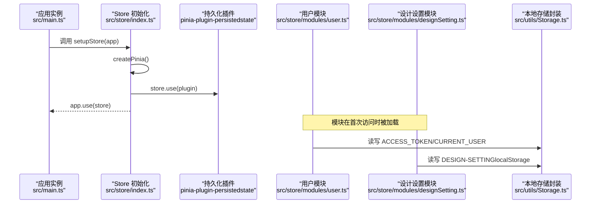
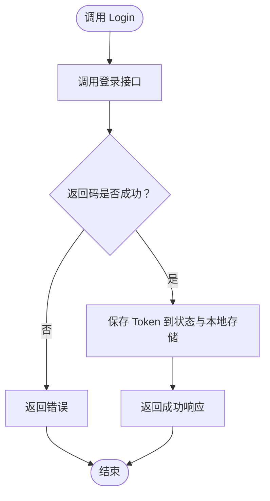
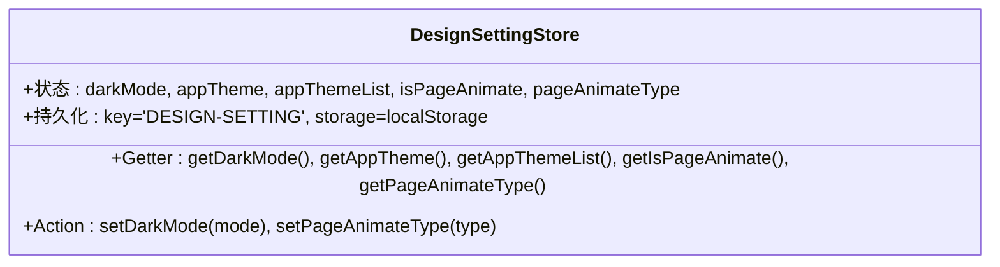
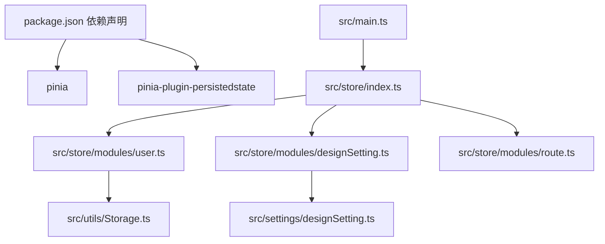

# Store架构设计

<cite>
**本文档引用的文件**
- [src/store/index.ts](file://src/store/index.ts)
- [src/store/mutation-types.ts](file://src/store/mutation-types.ts)
- [src/store/modules/user.ts](file://src/store/modules/user.ts)
- [src/store/modules/designSetting.ts](file://src/store/modules/designSetting.ts)
- [src/store/modules/route.ts](file://src/store/modules/route.ts)
- [src/main.ts](file://src/main.ts)
- [src/utils/Storage.ts](file://src/utils/Storage.ts)
- [src/hooks/setting/useDesignSetting.ts](file://src/hooks/setting/useDesignSetting.ts)
- [src/settings/designSetting.ts](file://src/settings/designSetting.ts)
- [package.json](file://package.json)
</cite>

## 目录
1. [简介](#简介)
2. [项目结构](#项目结构)
3. [核心组件](#核心组件)
4. [架构总览](#架构总览)
5. [详细组件分析](#详细组件分析)
6. [依赖关系分析](#依赖关系分析)
7. [性能考虑](#性能考虑)
8. [故障排除指南](#故障排除指南)
9. [结论](#结论)
10. [附录](#附录)

## 简介
本文件深入解析基于 Pinia 的前端状态管理架构，涵盖 createPinia 初始化流程、插件系统配置（特别是 pinia-plugin-persistedstate）、全局状态管理策略以及持久化机制。同时阐述 mutation-types 的设计理念（命名规范、类型安全与代码组织），并提供 Store 初始化的最佳实践（插件注册顺序、错误处理与性能优化）。文中所有技术细节均来源于仓库源码，确保可追溯性与准确性。

## 项目结构
该工程采用模块化组织方式，Store 相关代码集中在 src/store 目录下，按功能拆分为多个模块（如 user、designSetting、route），并通过统一入口进行初始化与挂载。

图表来源
- [src/main.ts:18-27](file://src/main.ts#L18-L27)
- [src/store/index.ts:8-12](file://src/store/index.ts#L8-L12)
- [src/store/modules/user.ts:1-115](file://src/store/modules/user.ts#L1-L115)
- [src/store/modules/designSetting.ts:1-52](file://src/store/modules/designSetting.ts#L1-L52)
- [src/store/modules/route.ts:1-40](file://src/store/modules/route.ts#L1-L40)
- [src/utils/Storage.ts:1-128](file://src/utils/Storage.ts#L1-L128)
- [src/settings/designSetting.ts:1-52](file://src/settings/designSetting.ts#L1-L52)
- [src/hooks/setting/useDesignSetting.ts:1-25](file://src/hooks/setting/useDesignSetting.ts#L1-L25)

章节来源
- [src/main.ts:18-27](file://src/main.ts#L18-L27)
- [src/store/index.ts:8-12](file://src/store/index.ts#L8-L12)

## 核心组件
本节聚焦于 Store 架构的核心组成：初始化入口、插件系统、持久化策略与模块化设计。

- 初始化入口与挂载
  - 应用启动时通过入口文件调用 setupStore 完成 Pinia 实例的安装与注入。
  - 初始化文件负责创建 Pinia 实例并注册持久化插件，随后将其挂载到 Vue 应用实例上。

- 插件系统与持久化
  - 全局启用 pinia-plugin-persistedstate 插件，为后续各模块的持久化配置提供基础能力。
  - 部分模块采用独立的 persist 配置（如设计设置模块）以实现更细粒度的持久化控制。

- 模块化设计
  - 用户模块：负责登录态、用户信息与 Token 管理，结合本地存储实现跨会话的状态保持。
  - 设计设置模块：维护主题、动画等 UI 相关状态，具备默认值与持久化配置。
  - 路由模块：管理菜单、路由与 KeepAlive 组件列表，用于运行时动态更新。

章节来源
- [src/store/index.ts:1-13](file://src/store/index.ts#L1-L13)
- [src/store/modules/user.ts:1-115](file://src/store/modules/user.ts#L1-L115)
- [src/store/modules/designSetting.ts:1-52](file://src/store/modules/designSetting.ts#L1-L52)
- [src/store/modules/route.ts:1-40](file://src/store/modules/route.ts#L1-L40)

## 架构总览
下图展示了应用启动到 Store 初始化、模块加载与持久化恢复的完整流程。

图表来源
- [src/main.ts:18-27](file://src/main.ts#L18-L27)
- [src/store/index.ts:5-12](file://src/store/index.ts#L5-L12)
- [src/store/modules/user.ts:10-61](file://src/store/modules/user.ts#L10-L61)
- [src/store/modules/designSetting.ts:42-45](file://src/store/modules/designSetting.ts#L42-L45)
- [src/utils/Storage.ts:27-57](file://src/utils/Storage.ts#L27-L57)

## 详细组件分析

### Store 初始化与插件系统
- 初始化流程
  - 创建 Pinia 实例并注册持久化插件，确保后续模块可选择性启用持久化。
  - 提供 setupStore 函数用于将 Store 挂载到 Vue 应用实例，保证全局可用。

- 插件注册顺序
  - 先创建实例，再注册插件，最后挂载到应用，遵循 Pinia 推荐模式，避免副作用与竞态问题。

- 错误处理
  - 初始化阶段未见显式异常捕获；建议在生产环境增加 try-catch 包裹与降级策略。

- 性能优化
  - 插件注册仅一次，避免重复注册导致的性能损耗。
  - 模块按需加载，减少初始内存占用。

章节来源
- [src/store/index.ts:1-13](file://src/store/index.ts#L1-L13)
- [src/main.ts:18-27](file://src/main.ts#L18-L27)

### 用户模块（User Store）
- 数据模型
  - 状态包含 token、用户信息与最后更新时间戳，便于跨组件共享与缓存控制。
  - 用户信息接口定义了完整的字段集合，支持可选字段与扩展。

- Getter 与 Action
  - Getter 提供便捷访问 token 与用户信息的能力，内部优先从 Pinia 状态读取，其次回退到本地存储。
  - Action 封装登录、获取用户信息与登出逻辑，统一处理 Token 写入与清理。

- 持久化策略
  - 登录成功后将 Token 写入本地存储；用户信息变更时同步更新并记录时间戳。
  - 登出时清除 Token 与用户信息，并跳转至登录页与刷新页面。

- 类型安全
  - 使用 TypeScript 接口约束状态与参数，提升开发体验与运行时稳定性。

- 外部使用
  - 提供 useUserStoreWithOut 工具函数，便于在 Composition API 外部场景使用。

图表来源
- [src/store/modules/user.ts:64-77](file://src/store/modules/user.ts#L64-L77)
- [src/store/modules/user.ts:54-57](file://src/store/modules/user.ts#L54-L57)

章节来源
- [src/store/modules/user.ts:1-115](file://src/store/modules/user.ts#L1-L115)
- [src/utils/Storage.ts:1-128](file://src/utils/Storage.ts#L1-L128)

### 设计设置模块（Design Setting Store）
- 默认值来源
  - 从设计设置配置文件中读取默认主题、主题列表、页面动画开关与动画类型，确保模块初始化即具备合理默认值。

- Getter 与 Action
  - Getter 提供主题、动画等状态的只读访问。
  - Action 支持切换深浅色模式与页面动画类型，便于运行时调整 UI 行为。

- 持久化配置
  - 通过 persist 配置项指定持久化键与存储介质（localStorage），实现跨会话状态保持。

- 外部 Hook 使用
  - 提供 useDesignSetting Hook，将 Store 状态映射为计算属性，简化在组件中的使用。

图表来源
- [src/store/modules/designSetting.ts:8-46](file://src/store/modules/designSetting.ts#L8-L46)
- [src/settings/designSetting.ts:38-49](file://src/settings/designSetting.ts#L38-L49)

章节来源
- [src/store/modules/designSetting.ts:1-52](file://src/store/modules/designSetting.ts#L1-L52)
- [src/hooks/setting/useDesignSetting.ts:1-25](file://src/hooks/setting/useDesignSetting.ts#L1-L25)

### 路由模块（Route Store）
- 数据模型
  - 管理菜单、路由与 KeepAlive 组件列表，支持运行时动态更新。

- Getter 与 Action
  - Getter 提供菜单数据访问。
  - Action 支持设置路由、菜单与 KeepAlive 组件名称列表。

- 使用场景
  - 适用于权限控制、动态菜单生成与页面缓存策略管理。

章节来源
- [src/store/modules/route.ts:1-40](file://src/store/modules/route.ts#L1-L40)

### mutation-types 设计理念
- 命名规范
  - 采用全大写常量命名，语义清晰，便于全局复用与维护。
  - 常量值作为存储键使用，确保跨模块一致性。

- 类型安全
  - 通过导出常量而非字符串字面量，降低拼写错误风险。
  - 结合 TypeScript 接口与枚举，进一步提升类型安全性。

- 代码组织
  - 将通用键集中管理，避免分散硬编码，提高可维护性与可测试性。

章节来源
- [src/store/mutation-types.ts:1-4](file://src/store/mutation-types.ts#L1-L4)
- [src/store/modules/user.ts:4](file://src/store/modules/user.ts#L4)
- [src/store/modules/designSetting.ts:42-45](file://src/store/modules/designSetting.ts#L42-L45)

## 依赖关系分析
- 外部依赖
  - Pinia 与 pinia-plugin-persistedstate：提供状态管理与持久化能力。
  - Vue 与 Vue Router：与框架生态紧密集成。

- 内部依赖
  - Store 模块之间无直接耦合，通过统一入口与工具函数进行交互。
  - 存储封装（Storage）为用户模块与设计设置模块提供一致的本地存储能力。

图表来源
- [package.json:50-51](file://package.json#L50-L51)
- [src/main.ts:16](file://src/main.ts#L16)
- [src/store/index.ts:1-13](file://src/store/index.ts#L1-L13)
- [src/store/modules/user.ts:1-115](file://src/store/modules/user.ts#L1-L115)
- [src/store/modules/designSetting.ts:1-52](file://src/store/modules/designSetting.ts#L1-L52)
- [src/store/modules/route.ts:1-40](file://src/store/modules/route.ts#L1-L40)
- [src/utils/Storage.ts:1-128](file://src/utils/Storage.ts#L1-L128)
- [src/settings/designSetting.ts:1-52](file://src/settings/designSetting.ts#L1-L52)

章节来源
- [package.json:50-51](file://package.json#L50-L51)
- [src/store/index.ts:1-13](file://src/store/index.ts#L1-L13)

## 性能考虑
- 持久化策略
  - 对于频繁变更的小型状态（如用户 Token），建议采用 localStorage 并配合合理的键名与过期策略，避免存储膨胀。
  - 对于大型或敏感数据，应谨慎持久化，必要时进行压缩或分片存储。

- 模块化与懒加载
  - Store 模块按需加载，减少初始渲染负担；对于非关键模块可延迟初始化。

- 存储封装
  - Storage 工具提供统一的 set/get/remove 接口与过期控制，建议在业务层统一使用，避免重复实现。

- 插件注册
  - 仅注册必要的插件，避免不必要的开销；持久化插件应在需要时启用。

## 故障排除指南
- 登录后状态未持久化
  - 检查持久化插件是否正确注册与启用。
  - 确认模块中是否正确调用存储写入方法（如 Token 与用户信息）。

- Token 或用户信息读取异常
  - 确认 getter 回退逻辑是否生效（先读 Pinia 状态，再读本地存储）。
  - 检查存储键名与 mutation-types 常量是否一致。

- 主题设置不生效
  - 确认 persist 配置项是否正确（键名与存储介质）。
  - 检查默认设计设置是否正确导入与初始化。

- 登出后状态未清理
  - 确认登出流程中是否调用了存储清理与路由跳转逻辑。

章节来源
- [src/store/modules/user.ts:42-61](file://src/store/modules/user.ts#L42-L61)
- [src/store/modules/user.ts:92-107](file://src/store/modules/user.ts#L92-L107)
- [src/store/modules/designSetting.ts:42-45](file://src/store/modules/designSetting.ts#L42-L45)

## 结论
该 Store 架构以 Pinia 为核心，结合 pinia-plugin-persistedstate 实现了全局状态管理与持久化能力。通过模块化设计与统一的存储封装，实现了良好的可维护性与扩展性。建议在实际项目中遵循本文提供的最佳实践，进一步完善错误处理与性能优化，确保状态管理的稳定与高效。

## 附录
- 配置选项说明（基于现有实现）
  - 全局持久化插件：启用后为后续模块提供持久化能力。
  - 模块级持久化：通过 persist 配置项指定键名与存储介质（如 localStorage）。
  - 存储封装：提供 set/get/remove/clear 等统一接口与过期控制。

- 最佳实践清单
  - 插件注册顺序：先创建实例，再注册插件，最后挂载应用。
  - 错误处理：在关键操作（如登录、登出）中增加 try-catch 与降级策略。
  - 性能优化：合理选择持久化范围与存储介质，避免不必要的存储开销。
  - 类型安全：使用 TypeScript 接口与常量，提升代码质量与可维护性。