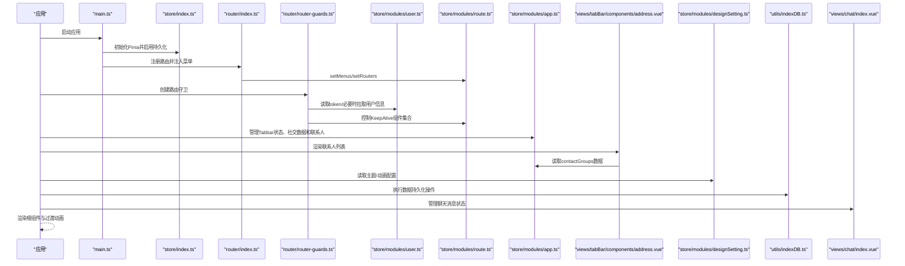
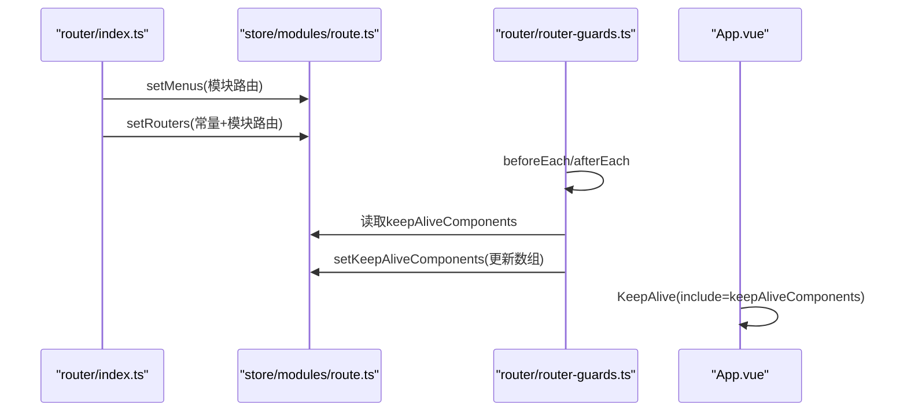
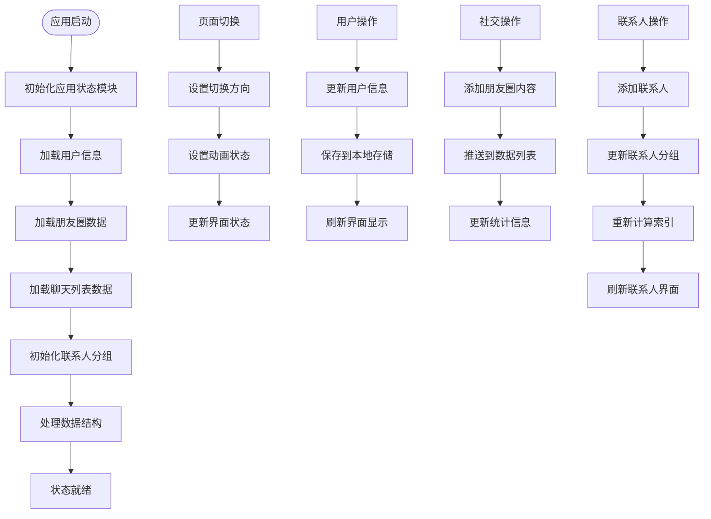
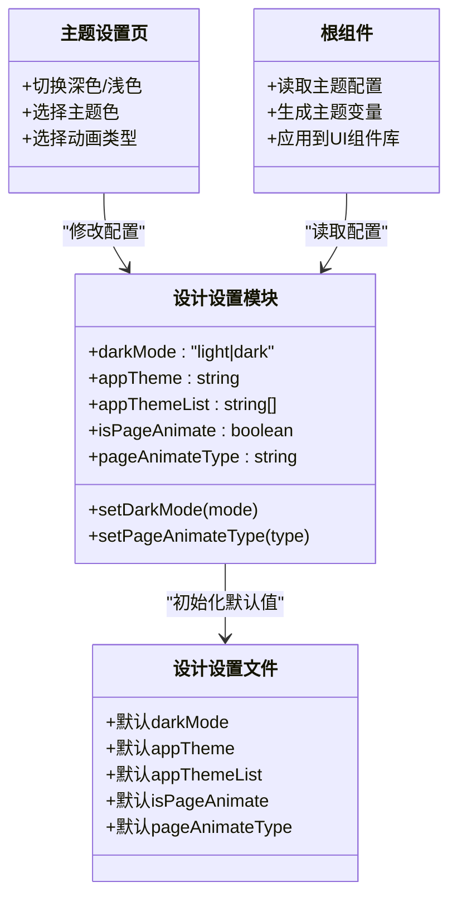
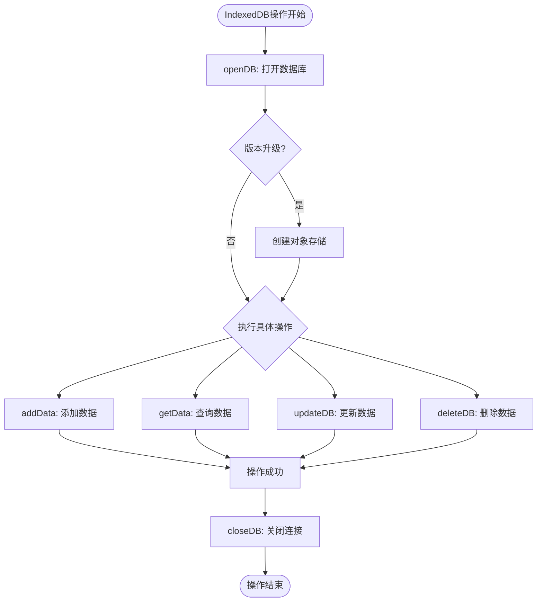
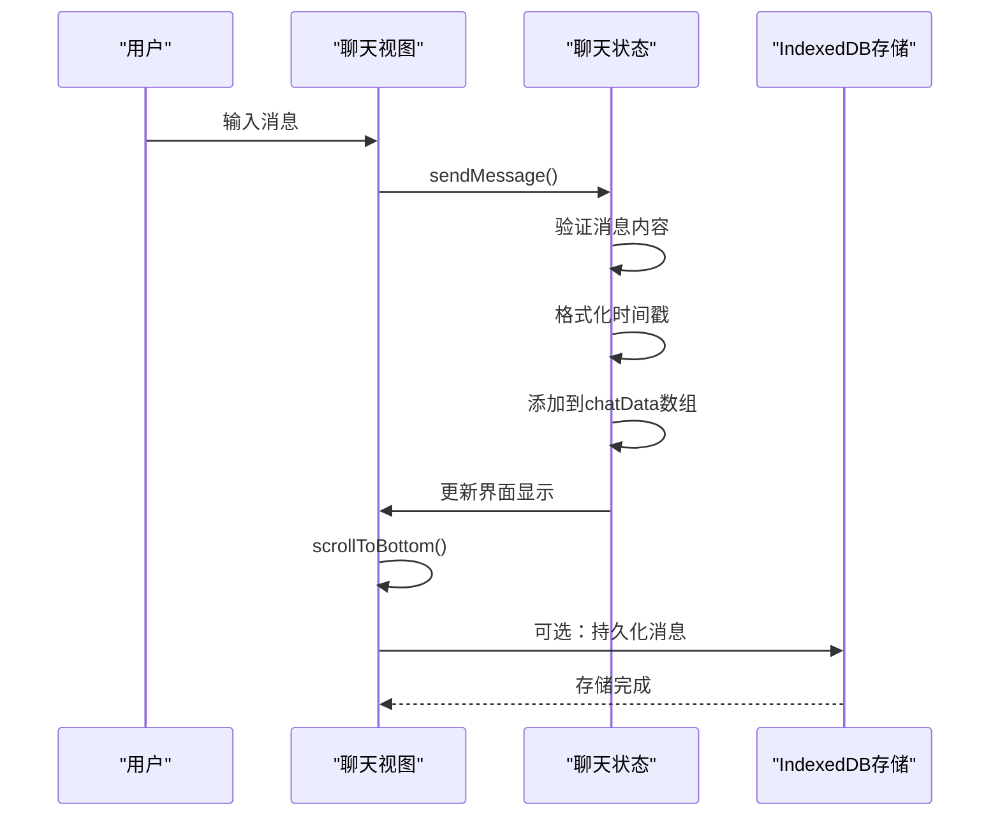
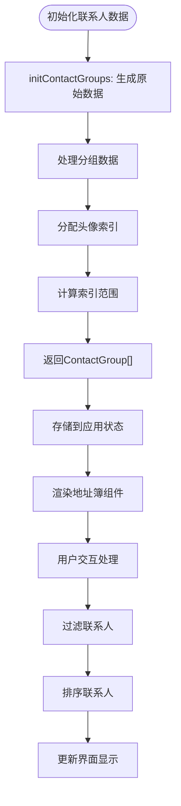
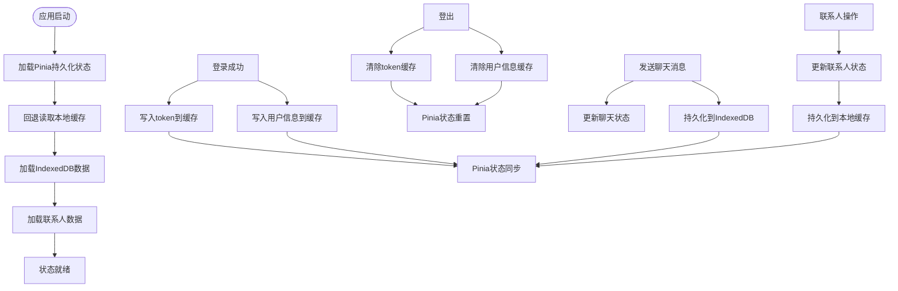
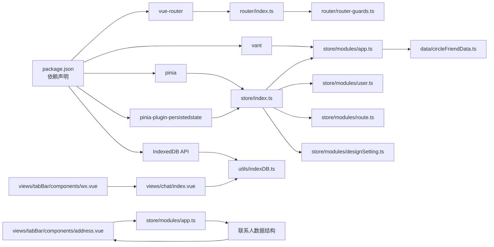

# 状态管理系统

<cite>
**本文引用的文件**
- [src/store/index.ts](file://src/store/index.ts)
- [src/store/modules/app.ts](file://src/store/modules/app.ts)
- [src/store/modules/user.ts](file://src/store/modules/user.ts)
- [src/store/modules/route.ts](file://src/store/modules/route.ts)
- [src/store/modules/designSetting.ts](file://src/store/modules/designSetting.ts)
- [src/store/mutation-types.ts](file://src/store/mutation-types.ts)
- [src/data/circleFriendData.ts](file://src/data/circleFriendData.ts)
- [src/utils/Storage.ts](file://src/utils/Storage.ts)
- [src/utils/indexDB.ts](file://src/utils/indexDB.ts)
- [src/main.ts](file://src/main.ts)
- [src/router/index.ts](file://src/router/index.ts)
- [src/router/router-guards.ts](file://src/router/router-guards.ts)
- [src/App.vue](file://src/App.vue)
- [src/hooks/setting/useDesignSetting.ts](file://src/hooks/setting/useDesignSetting.ts)
- [src/settings/designSetting.ts](file://src/settings/designSetting.ts)
- [src/settings/animateSetting.ts](file://src/settings/animateSetting.ts)
- [src/views/my/ThemeSetting.vue](file://src/views/my/ThemeSetting.vue)
- [src/views/chat/index.vue](file://src/views/chat/index.vue)
- [src/views/tabBar/components/wx.vue](file://src/views/tabBar/components/wx.vue)
- [src/views/tabBar/components/address.vue](file://src/views/tabBar/components/address.vue)
- [src/enums/cacheEnum.ts](file://src/enums/cacheEnum.ts)
- [package.json](file://package.json)
</cite>

## 更新摘要
**所做更改**
- 新增联系人管理功能章节，详细介绍ContactItem接口、ContactGroup接口和initContactGroups()函数的完整实现
- 更新应用状态模块分析，反映新增的联系人管理基础设施
- 新增联系人状态管理在整体架构中的位置说明
- 更新依赖关系分析，反映联系人管理功能与地址簿组件的集成
- 新增联系人管理的最佳实践和性能优化建议

## 目录
1. [简介](#简介)
2. [项目结构](#项目结构)
3. [核心组件](#核心组件)
4. [架构总览](#架构总览)
5. [详细组件分析](#详细组件分析)
6. [依赖关系分析](#依赖关系分析)
7. [性能考量](#性能考量)
8. [故障排查指南](#故障排查指南)
9. [结论](#结论)
10. [附录](#附录)

## 简介
本文件系统性梳理了基于 Pinia 的状态管理方案，覆盖模块化状态管理、状态持久化与同步机制；深入解析用户状态（登录态、会话、用户信息）、路由状态（菜单、动态路由、路由缓存）、应用状态（Tabbar状态、社交数据、联系人管理）与设计设置（主题、动画、个性化）；并总结最佳实践与性能优化策略，帮助开发者在复杂业务场景中高效、稳定地管理应用状态。

**更新** 新增联系人管理功能，为微信小程序风格的移动端应用提供完整的联系人状态管理支持，包括联系人分组、头像管理和字母索引功能。

## 项目结构
本项目采用"按功能域划分"的 Store 组织方式：用户状态、路由状态、应用状态、设计设置分别独立模块化，配合全局持久化插件与工具层缓存，形成清晰的状态边界与职责分离。新增的联系人管理功能为应用状态模块提供了完整的联系人数据结构和管理能力。

```mermaid
graph TB
subgraph "应用入口"
MAIN["main.ts<br/>初始化应用与状态"]
end
subgraph "状态层"
PINIA["store/index.ts<br/>创建Pinia并启用持久化插件"]
USER["store/modules/user.ts<br/>用户状态模块"]
ROUTE["store/modules/route.ts<br/>路由状态模块"]
APP["store/modules/app.ts<br/>应用状态模块<br/>含联系人管理"]
DESIGN["store/modules/designSetting.ts<br/>设计设置模块"]
CHAT["聊天状态管理<br/>聊天消息状态与存储"]
end
subgraph "工具与配置"
STORAGE["utils/Storage.ts<br/>通用缓存封装"]
INDEXEDDB["utils/indexDB.ts<br/>IndexedDB数据持久化"]
MUTYPES["store/mutation-types.ts<br/>缓存键常量"]
CACHEENUM["enums/cacheEnum.ts<br/>缓存键枚举"]
DESIGNSET["settings/designSetting.ts<br/>默认设计设置"]
ANIMATE["settings/animateSetting.ts<br/>页面动画选项"]
CIRCLEFRIEND["data/circleFriendData.ts<br/>朋友圈数据源"]
end
subgraph "运行时集成"
APP["App.vue<br/>根组件渲染与KeepAlive"]
ROUTER["router/index.ts<br/>路由注册与菜单注入"]
GUARDS["router/router-guards.ts<br/>路由守卫与缓存控制"]
CHATVIEW["views/chat/index.vue<br/>聊天页面与消息管理"]
ADDRESSVIEW["views/tabBar/components/address.vue<br/>地址簿联系人管理"]
TABBAR["views/tabBar/components/wx.vue<br/>聊天入口与导航"]
END
MAIN --> PINIA
PINIA --> USER
PINIA --> ROUTE
PINIA --> APP
PINIA --> DESIGN
USER --> STORAGE
DESIGN --> DESIGNSET
DESIGN --> ANIMATE
APP --> CIRCLEFRIEND
APP --> ADDRESSVIEW
CHAT --> INDEXEDDB
CHAT --> CHATVIEW
CHATVIEW --> CHAT
TABBAR --> CHATVIEW
ADDRESSVIEW --> APP
ROUTER --> ROUTE
GUARDS --> USER
GUARDS --> ROUTE
APP --> ROUTE
APP --> DESIGN
```

**图表来源**
- [src/main.ts:18-30](file://src/main.ts#L18-L30)
- [src/store/index.ts:1-12](file://src/store/index.ts#L1-L12)
- [src/store/modules/user.ts:1-115](file://src/store/modules/user.ts#L1-L115)
- [src/store/modules/route.ts:1-40](file://src/store/modules/route.ts#L1-L40)
- [src/store/modules/app.ts:1-555](file://src/store/modules/app.ts#L1-L555)
- [src/store/modules/designSetting.ts:1-52](file://src/store/modules/designSetting.ts#L1-L52)
- [src/utils/Storage.ts:1-128](file://src/utils/Storage.ts#L1-L128)
- [src/utils/indexDB.ts:1-228](file://src/utils/indexDB.ts#L1-L228)
- [src/views/chat/index.vue:1-195](file://src/views/chat/index.vue#L1-L195)
- [src/views/tabBar/components/address.vue:1-216](file://src/views/tabBar/components/address.vue#L1-L216)
- [src/views/tabBar/components/wx.vue:1-74](file://src/views/tabBar/components/wx.vue#L1-L74)

**章节来源**
- [src/main.ts:18-30](file://src/main.ts#L18-L30)
- [src/store/index.ts:1-12](file://src/store/index.ts#L1-L12)

## 核心组件
- 状态容器与持久化
  - 通过全局 Pinia 实例启用持久化插件，统一管理跨页/刷新后的状态恢复。
  - 设计设置模块显式声明持久化键与存储介质，确保主题等个性化设置跨会话保留。
- 用户状态模块
  - 管理 token、用户信息、最后更新时间；提供登录、登出、拉取用户信息等动作。
  - 与本地缓存交互，保证 token 与用户信息在刷新后仍可恢复。
- 路由状态模块
  - 维护菜单、动态路由与 KeepAlive 组件集合；支持运行时动态注入与缓存控制。
- 应用状态模块（更新）
  - 管理 Tabbar 状态、页面切换动画方向、用户个人信息、朋友圈数据和联系人管理。
  - 提供社交数据的增删改查操作，支持动态添加朋友圈内容。
  - 新增联系人管理功能，包括ContactItem和ContactGroup接口定义和数据初始化。
- 设计设置模块
  - 提供深色/浅色模式、主题色、页面切换动画开关与类型等配置；与 UI 主题变量联动。
- IndexedDB 数据持久化（新增）
  - 提供完整的 IndexedDB 封装，支持数据库创建、数据增删改查、事务处理和索引查询。
  - 支持异步操作和错误处理，为大数据量存储提供可靠的数据持久化方案。
- 工具与常量
  - 通用缓存封装提供带过期时间的 KV 存储；缓存键常量与枚举规范统一命名。

**章节来源**
- [src/store/index.ts:1-12](file://src/store/index.ts#L1-L12)
- [src/store/modules/user.ts:1-115](file://src/store/modules/user.ts#L1-L115)
- [src/store/modules/route.ts:1-40](file://src/store/modules/route.ts#L1-L40)
- [src/store/modules/app.ts:1-555](file://src/store/modules/app.ts#L1-L555)
- [src/store/modules/designSetting.ts:1-52](file://src/store/modules/designSetting.ts#L1-L52)
- [src/utils/Storage.ts:1-128](file://src/utils/Storage.ts#L1-L128)
- [src/utils/indexDB.ts:1-228](file://src/utils/indexDB.ts#L1-L228)
- [src/store/mutation-types.ts:1-4](file://src/store/mutation-types.ts#L1-L4)
- [src/enums/cacheEnum.ts:1-15](file://src/enums/cacheEnum.ts#L1-L15)

## 架构总览
整体架构围绕"模块化 Store + 全局持久化 + 路由守卫 + 根组件渲染 + IndexedDB 持久化 + 联系人管理"展开：应用启动时初始化 Pinia 并挂载到应用；路由系统在初始化阶段注入菜单与常量路由；路由守卫负责鉴权、用户信息拉取与 KeepAlive 组件缓存策略；根组件根据路由状态与设计设置进行渲染与动画控制。新增的应用状态模块负责管理 Tabbar 状态、社交数据和联系人管理，为微信小程序风格的移动端应用提供完整的状态管理支持。IndexedDB 作为底层数据存储，为聊天消息和其他大数据量场景提供可靠的持久化能力。联系人管理功能通过ContactItem和ContactGroup接口提供结构化的联系人数据模型，支持字母分组和头像管理。



**图表来源**
- [src/main.ts:18-30](file://src/main.ts#L18-L30)
- [src/store/index.ts:1-12](file://src/store/index.ts#L1-L12)
- [src/router/index.ts:1-33](file://src/router/index.ts#L1-L33)
- [src/router/router-guards.ts:1-93](file://src/router/router-guards.ts#L1-L93)
- [src/store/modules/user.ts:1-115](file://src/store/modules/user.ts#L1-L115)
- [src/store/modules/route.ts:1-40](file://src/store/modules/route.ts#L1-L40)
- [src/store/modules/app.ts:1-555](file://src/store/modules/app.ts#L1-L555)
- [src/store/modules/designSetting.ts:1-52](file://src/store/modules/designSetting.ts#L1-L52)
- [src/utils/indexDB.ts:1-228](file://src/utils/indexDB.ts#L1-L228)
- [src/views/chat/index.vue:1-195](file://src/views/chat/index.vue#L1-L195)
- [src/views/tabBar/components/address.vue:1-216](file://src/views/tabBar/components/address.vue#L1-L216)

## 详细组件分析

### 用户状态模块（登录态与会话）
- 状态结构
  - token：访问令牌，用于接口鉴权。
  - userInfo：当前用户信息，包含基础资料与扩展字段。
  - lastUpdateTime：用户信息最后更新时间戳，用于判断是否需要重新拉取。
- 关键能力
  - 登录：调用登录接口成功后写入 token，并持久化到本地缓存。
  - 拉取用户信息：首次进入或缺失时从服务端获取并写入 userInfo。
  - 登出：清理 token 与用户信息，跳转登录页并强制刷新。
- 数据持久化
  - 通过工具缓存封装与缓存键常量，确保 token 与用户信息在刷新后可恢复。
- 安全与容错
  - 登出流程中尝试服务端注销，失败时记录错误但继续清理本地状态。
  - 登录流程对异常进行捕获并返回错误结果，避免阻塞 UI。


**图表来源**
- [src/store/modules/user.ts:64-107](file://src/store/modules/user.ts#L64-L107)
- [src/router/router-guards.ts:33-48](file://src/router/router-guards.ts#L33-L48)
- [src/utils/Storage.ts:27-57](file://src/utils/Storage.ts#L27-L57)
- [src/store/mutation-types.ts:1-4](file://src/store/mutation-types.ts#L1-L4)

**章节来源**
- [src/store/modules/user.ts:1-115](file://src/store/modules/user.ts#L1-L115)
- [src/utils/Storage.ts:1-128](file://src/utils/Storage.ts#L1-L128)
- [src/store/mutation-types.ts:1-4](file://src/store/mutation-types.ts#L1-L4)
- [src/router/router-guards.ts:17-51](file://src/router/router-guards.ts#L17-L51)

### 路由状态模块（菜单、动态路由与缓存）
- 状态结构
  - menus：菜单树/列表，用于侧边栏/顶部导航渲染。
  - routers：完整路由表，包含常量路由与动态模块路由。
  - keepAliveComponents：需要缓存的组件名称集合。
- 关键能力
  - 动态注入：在路由初始化时将模块路由与常量路由合并注入。
  - 缓存控制：在路由守卫 after 每次进入时根据 meta.keepAlive 决定加入/移除缓存列表。
- 与根组件协作
  - 根组件使用 KeepAlive 包裹 RouterView，并依据 keepAliveComponents 动态缓存组件。



**图表来源**
- [src/router/index.ts:14-24](file://src/router/index.ts#L14-L24)
- [src/store/modules/route.ts:23-33](file://src/store/modules/route.ts#L23-L33)
- [src/router/router-guards.ts:62-87](file://src/router/router-guards.ts#L62-L87)
- [src/App.vue:5-11](file://src/App.vue#L5-L11)

**章节来源**
- [src/store/modules/route.ts:1-40](file://src/store/modules/route.ts#L1-L40)
- [src/router/index.ts:1-33](file://src/router/index.ts#L1-L33)
- [src/router/router-guards.ts:17-93](file://src/router/router-guards.ts#L17-L93)
- [src/App.vue:1-78](file://src/App.vue#L1-L78)

### 应用状态模块（Tabbar状态、社交数据与联系人管理）
**更新** 新增应用状态模块，专门管理 Tabbar 状态、社交数据和联系人管理功能

- 状态结构
  - needAnimate：页面切换动画开关状态。
  - directionName：页面切换方向标识，支持 slide-left 和 slide-right。
  - userInfo：用户个人信息，包含头像、昵称、微信号、地区、性别、背景图等。
  - circleFriendData：朋友圈数据列表，包含动态内容、点赞、评论等信息。
  - chatList：聊天列表数据，包含好友信息、消息历史和未读数。
  - contactGroups：联系人分组数据，包含字母分组、联系人列表和头像索引。
- 关键能力
  - Tabbar 状态管理：控制底部导航栏的显示状态和交互。
  - 页面切换动画：管理页面切换的方向和动画效果。
  - 用户信息管理：提供用户信息的获取、更新和个性化设置。
  - 社交数据管理：处理朋友圈数据的增删改查，支持动态添加新内容。
  - 联系人管理：提供完整的联系人数据结构和管理功能。
- 数据处理
  - 自动为朋友圈数据添加 tip 字段，用于标记特殊状态。
  - 集成本地头像和背景图片资源，提供完整的用户展示信息。
  - 联系人数据通过initContactGroups()函数初始化，支持字母分组和头像管理。
- 接口定义
  - ContactItem：联系人接口，包含name和avatarIdx字段。
  - ContactGroup：联系人分组接口，包含letter、startIdx和list字段。
- 数据初始化
  - initContactGroups()函数生成包含26个字母分组的联系人数据。
  - 为每个联系人分配唯一的avatarIdx，支持头像图片映射。
  - 计算每个分组的startIdx和_endIdx，支持快速索引查找。
- 与路由状态协作
  - 通过 directionName 控制页面切换动画方向，与路由守卫配合实现流畅的页面过渡。
  - 与聊天状态模块协作，提供完整的社交功能支持。



**图表来源**
- [src/store/modules/app.ts:210-383](file://src/store/modules/app.ts#L210-L383)
- [src/store/modules/app.ts:425-555](file://src/store/modules/app.ts#L425-L555)
- [src/data/circleFriendData.ts:1-238](file://src/data/circleFriendData.ts#L1-L238)

**章节来源**
- [src/store/modules/app.ts:1-555](file://src/store/modules/app.ts#L1-L555)
- [src/data/circleFriendData.ts:1-238](file://src/data/circleFriendData.ts#L1-L238)

### 设计设置模块（主题、动画与个性化）
- 默认配置
  - 来源于设计设置文件，包含深色/浅色模式、主题色列表、页面动画开关与类型。
- 状态与行为
  - 提供 getter 读取当前配置；actions 修改模式与动画类型。
  - 显式持久化配置到 localStorage，键名自定义，确保跨会话保留。
- 视图联动
  - 主题设置页通过双向绑定与 store 同步，实时影响 UI 主题变量。
  - 根组件根据配置生成主题变量并应用到 UI 组件库。



**图表来源**
- [src/store/modules/designSetting.ts:8-46](file://src/store/modules/designSetting.ts#L8-L46)
- [src/settings/designSetting.ts:38-51](file://src/settings/designSetting.ts#L38-L51)
- [src/views/my/ThemeSetting.vue:70-117](file://src/views/my/ThemeSetting.vue#L70-L117)
- [src/App.vue:26-72](file://src/App.vue#L26-L72)

**章节来源**
- [src/store/modules/designSetting.ts:1-52](file://src/store/modules/designSetting.ts#L1-L52)
- [src/settings/designSetting.ts:1-52](file://src/settings/designSetting.ts#L1-L52)
- [src/views/my/ThemeSetting.vue:1-120](file://src/views/my/ThemeSetting.vue#L1-L120)
- [src/App.vue:1-78](file://src/App.vue#L1-L78)
- [src/hooks/setting/useDesignSetting.ts:1-25](file://src/hooks/setting/useDesignSetting.ts#L1-L25)
- [src/settings/animateSetting.ts:1-9](file://src/settings/animateSetting.ts#L1-L9)

### IndexedDB 数据持久化支持（新增）
**更新** 新增 IndexedDB 数据持久化支持，为大数据量和复杂查询场景提供底层存储能力

- 数据库操作
  - openDB：打开指定名称和版本的数据库，自动创建对象存储空间。
  - addData：向指定对象存储添加新数据，支持唯一键约束。
  - getDataByKey：通过主键检索特定数据记录。
  - cursorGetData：使用游标遍历整个对象存储的所有数据。
- 查询与索引
  - getDataByIndex：通过索引字段精确查询单条记录。
  - cursorGetDataByIndex：使用索引和游标查询符合条件的所有记录。
  - 支持 IDBKeyRange.only() 等范围查询操作。
- 数据管理
  - updateDB：更新现有数据记录，支持部分字段更新。
  - deleteDB：删除指定主键的数据记录。
  - deleteDBAll：删除整个数据库实例。
  - closeDB：手动关闭数据库连接。
- 错误处理与事务
  - 所有操作均返回 Promise，支持异步错误处理。
  - 自动处理事务提交和回滚，确保数据一致性。
  - 提供详细的错误信息和日志输出，便于调试和监控。



**图表来源**
- [src/utils/indexDB.ts:5-29](file://src/utils/indexDB.ts#L5-L29)
- [src/utils/indexDB.ts:34-50](file://src/utils/indexDB.ts#L34-L50)
- [src/utils/indexDB.ts:101-150](file://src/utils/indexDB.ts#L101-L150)
- [src/utils/indexDB.ts:155-187](file://src/utils/indexDB.ts#L155-L187)

**章节来源**
- [src/utils/indexDB.ts:1-228](file://src/utils/indexDB.ts#L1-L228)

### 聊天状态管理（新增）
**更新** 新增聊天状态管理功能，为实时通信提供完整的消息状态管理

- 聊天数据结构
  - chatData：响应式消息数组，包含消息内容、发送者身份、时间戳和显示控制。
  - currentFriend：当前聊天好友信息，包含头像、姓名等基本信息。
  - isSelfMode：聊天模式切换状态，支持模拟好友视角。
- 消息管理
  - sendMessage：处理消息发送逻辑，支持时间格式化和消息验证。
  - scrollToBottom：自动滚动到底部，确保最新消息可见。
  - toggleChatMode：切换聊天模式，改变消息显示样式。
- UI 状态控制
  - showSwitchMenu：控制菜单显示状态，避免遮挡聊天界面。
  - messageContainer：消息容器引用，用于滚动控制和高度计算。
- 与路由集成
  - 通过路由参数传递好友信息，支持直接跳转到指定聊天页面。
  - 与 TabBar 组件协作，提供聊天入口和消息提醒功能。



**图表来源**
- [src/views/chat/index.vue:163-173](file://src/views/chat/index.vue#L163-L173)
- [src/views/chat/index.vue:148-154](file://src/views/chat/index.vue#L148-L154)
- [src/views/chat/index.vue:157-160](file://src/views/chat/index.vue#L157-L160)

**章节来源**
- [src/views/chat/index.vue:1-195](file://src/views/chat/index.vue#L1-L195)
- [src/views/tabBar/components/wx.vue:60-62](file://src/views/tabBar/components/wx.vue#L60-L62)

### 联系人管理功能（新增）
**更新** 新增完整的联系人管理功能，为应用提供结构化的联系人数据管理

- 接口定义
  - ContactItem接口：定义联系人的基本结构，包含name和avatarIdx字段。
  - ContactGroup接口：定义联系人分组的结构，包含letter、startIdx和list字段。
- 数据初始化
  - initContactGroups()函数：生成完整的联系人数据结构，包含26个字母分组。
  - 支持200+个联系人数据，涵盖常见中文姓名和昵称。
  - 自动分配头像索引，支持头像图片映射和显示。
- 数据结构特点
  - letter：分组字母标识，支持A-Z和特殊字符。
  - startIdx：分组起始索引，用于快速定位和导航。
  - list：联系人列表，包含ContactItem对象数组。
  - avatarIdx：联系人头像索引，支持头像图片映射。
- 与地址簿组件集成
  - 地址簿组件通过useAppStore读取contactGroups数据。
  - 支持字母索引导航和联系人列表渲染。
  - 提供头像图片预加载和懒加载支持。
- 性能优化
  - 使用响应式ref存储联系人数据，支持局部更新。
  - 通过计算属性优化数据访问和渲染性能。
  - 支持虚拟滚动和分页加载，提升大数据量场景下的性能。



**图表来源**
- [src/store/modules/app.ts:224-383](file://src/store/modules/app.ts#L224-L383)
- [src/views/tabBar/components/address.vue:42-79](file://src/views/tabBar/components/address.vue#L42-L79)

**章节来源**
- [src/store/modules/app.ts:210-383](file://src/store/modules/app.ts#L210-L383)
- [src/views/tabBar/components/address.vue:1-216](file://src/views/tabBar/components/address.vue#L1-L216)

### 状态持久化与同步机制
- 全局持久化
  - 通过 Pinia 插件对所有 Store 启用持久化，确保跨刷新状态恢复。
- 模块级持久化
  - 设计设置模块显式配置持久化键与存储介质，避免与其他模块冲突。
- 本地缓存封装
  - 提供带过期时间的 KV 存储，支持 Cookie 与本地存储；用户模块在登录/登出时直接操作本地缓存键。
- IndexedDB 持久化（新增）
  - 为大数据量和复杂查询场景提供可靠的底层存储。
  - 支持异步操作和事务处理，确保数据一致性和完整性。
  - 适用于聊天消息、用户偏好设置等需要长期保存的数据。
- 联系人数据持久化（新增）
  - 联系人数据通过应用状态模块管理，支持响应式更新和持久化。
  - 通过initContactGroups()函数初始化，确保数据结构的一致性。
  - 支持联系人数据的增删改查操作，满足动态管理需求。
- 同步策略
  - Getter 优先从 Pinia 状态读取，若为空则回退到本地缓存读取，保证初始化阶段可用。
  - 登录成功后立即写入 token 与用户信息，随后在路由守卫中完成用户信息补全。
  - 聊天消息支持即时同步和延迟持久化，平衡性能和可靠性。
  - 联系人数据通过应用状态模块统一管理，确保多组件间的数据一致性。



**图表来源**
- [src/store/index.ts:1-12](file://src/store/index.ts#L1-L12)
- [src/store/modules/designSetting.ts:42-45](file://src/store/modules/designSetting.ts#L42-L45)
- [src/store/modules/user.ts:54-107](file://src/store/modules/user.ts#L54-L107)
- [src/utils/Storage.ts:27-73](file://src/utils/Storage.ts#L27-L73)
- [src/store/mutation-types.ts:1-4](file://src/store/mutation-types.ts#L1-L4)
- [src/utils/indexDB.ts:1-228](file://src/utils/indexDB.ts#L1-L228)
- [src/store/modules/app.ts:224-383](file://src/store/modules/app.ts#L224-L383)

**章节来源**
- [src/store/index.ts:1-12](file://src/store/index.ts#L1-L12)
- [src/store/modules/designSetting.ts:1-52](file://src/store/modules/designSetting.ts#L1-L52)
- [src/store/modules/user.ts:1-115](file://src/store/modules/user.ts#L1-L115)
- [src/utils/Storage.ts:1-128](file://src/utils/Storage.ts#L1-L128)
- [src/store/mutation-types.ts:1-4](file://src/store/mutation-types.ts#L1-L4)
- [src/utils/indexDB.ts:1-228](file://src/utils/indexDB.ts#L1-L228)

## 依赖关系分析
- 外部依赖
  - Pinia 与持久化插件：提供响应式状态容器与跨刷新持久化能力。
  - Vue Router：承载路由与导航守卫，驱动路由状态变更。
  - Vant 4：UI 组件库，与主题变量联动实现统一视觉风格。
  - IndexedDB：浏览器原生数据库API，提供大数据量存储能力。
- 内部耦合
  - 路由守卫依赖用户与路由模块，用于鉴权与缓存控制。
  - 根组件依赖路由与设计设置模块，用于渲染与动画控制。
  - 用户模块依赖工具缓存与 API 接口，实现登录态与会话管理。
  - 应用模块依赖数据源和静态资源，提供社交功能支持。
  - 聊天模块依赖 IndexedDB 工具类，实现消息持久化存储。
  - 地址簿组件依赖应用状态模块，提供联系人数据展示。
  - TabBar 组件依赖聊天视图和应用状态模块，提供导航功能。
  - 联系人管理功能与地址簿组件紧密集成，提供完整的联系人管理体验。



**图表来源**
- [package.json:41-56](file://package.json#L41-L56)
- [src/store/index.ts:1-12](file://src/store/index.ts#L1-L12)
- [src/router/index.ts:1-33](file://src/router/index.ts#L1-L33)
- [src/router/router-guards.ts:1-93](file://src/router/router-guards.ts#L1-L93)
- [src/App.vue:1-78](file://src/App.vue#L1-L78)
- [src/data/circleFriendData.ts:1-238](file://src/data/circleFriendData.ts#L1-L238)
- [src/utils/indexDB.ts:1-228](file://src/utils/indexDB.ts#L1-L228)
- [src/views/chat/index.vue:1-195](file://src/views/chat/index.vue#L1-L195)
- [src/views/tabBar/components/address.vue:1-216](file://src/views/tabBar/components/address.vue#L1-L216)
- [src/views/tabBar/components/wx.vue:1-74](file://src/views/tabBar/components/wx.vue#L1-L74)

**章节来源**
- [package.json:1-118](file://package.json#L1-L118)
- [src/store/index.ts:1-12](file://src/store/index.ts#L1-L12)
- [src/router/index.ts:1-33](file://src/router/index.ts#L1-L33)
- [src/router/router-guards.ts:1-93](file://src/router/router-guards.ts#L1-L93)
- [src/App.vue:1-78](file://src/App.vue#L1-L78)
- [src/utils/indexDB.ts:1-228](file://src/utils/indexDB.ts#L1-L228)

## 性能考量
- 路由缓存策略
  - 仅对明确标记 keepAlive 的页面进行缓存，避免无谓的内存占用；进入新页面时及时清理不再需要缓存的组件。
- 状态持久化粒度
  - 对体量较大或频繁变化的状态谨慎持久化，减少本地存储压力；对轻量配置（如主题）启用持久化提升体验。
  - IndexedDB 适用于大数据量存储，但需注意事务开销和查询性能。
  - 联系人数据采用响应式管理，支持局部更新，避免全量重渲染。
- 异步加载与并发
  - 登录与用户信息拉取采用 Promise 包装，避免阻塞路由守卫；对网络异常进行降级处理，保证用户体验。
  - 聊天消息发送采用异步处理，避免阻塞 UI 线程。
  - 联系人数据通过计算属性优化访问性能，支持懒加载和分页显示。
- 渲染优化
  - 使用 KeepAlive 与过渡动画结合，减少重复渲染成本；主题变量计算在组件层按需派生，避免全局重绘。
  - 聊天消息列表使用虚拟滚动，限制渲染数量提升性能。
  - 地址簿组件支持字母索引导航，提升大数据量场景下的浏览效率。
  - 联系人头像采用预加载和懒加载策略，优化图片加载性能。
- 应用状态优化（更新）
  - 朋友圈数据采用预处理机制，批量添加 tip 字段，减少运行时计算开销。
  - 用户信息状态使用响应式 ref，避免不必要的深度监听。
  - 页面切换动画状态按需更新，减少无关组件的重新渲染。
  - IndexedDB 操作使用事务批处理，减少数据库操作次数。
  - 聊天消息采用增量更新策略，避免大数组的全量重渲染。
  - 联系人数据使用分组索引，支持快速查找和导航。
  - 计算属性优化联系人列表渲染，减少不必要的组件更新。

## 故障排查指南
- 登录后无法跳转或白屏
  - 检查路由守卫中 token 读取逻辑与登录返回码；确认登录成功后已写入 token 并触发路由跳转。
- 用户信息未显示
  - 确认路由守卫在首次进入时调用了用户信息拉取；检查本地缓存键是否存在以及是否过期。
- 主题切换无效
  - 检查设计设置模块是否正确写入持久化；确认根组件主题变量生成逻辑与 UI 组件库版本兼容。
- 页面缓存异常
  - 检查路由 meta.keepAlive 标记与路由守卫中的缓存数组更新逻辑；确认组件名称与 include 匹配一致。
- IndexedDB 操作失败（新增）
  - 检查浏览器是否支持 IndexedDB API；确认数据库版本升级回调正常执行。
  - 验证对象存储名称和键路径配置；检查事务权限和错误处理逻辑。
  - 查看浏览器开发者工具的 Console 输出，定位具体的错误信息。
- 聊天消息异常（新增）
  - 检查消息发送逻辑中的内容验证和时间格式化；确认消息数组的响应式更新。
  - 验证滚动到底部的计算逻辑；检查聊天模式切换的状态同步。
  - 确认路由参数传递的正确性和好友信息的加载。
- 联系人数据异常（新增）
  - 检查initContactGroups()函数的执行结果，确认数据结构的完整性。
  - 验证ContactItem和ContactGroup接口的实现，确保字段类型正确。
  - 检查地址簿组件的数据绑定，确认contactGroups的响应式更新。
  - 确认头像索引的分配逻辑，避免重复和越界问题。
  - 验证字母索引导航的功能，确保分组数据的正确性。
- 状态同步问题（新增）
  - 检查 Pinia 持久化插件的配置和存储介质；确认不同模块间的依赖关系。
  - 验证 IndexedDB 与 Pinia 状态的同步时机和冲突处理。
  - 检查联系人数据的响应式更新机制，确保多组件间的数据一致性。
  - 确认计算属性的依赖关系，避免不必要的重新计算。

**章节来源**
- [src/router/router-guards.ts:17-93](file://src/router/router-guards.ts#L17-L93)
- [src/store/modules/user.ts:64-107](file://src/store/modules/user.ts#L64-L107)
- [src/store/modules/designSetting.ts:34-40](file://src/store/modules/designSetting.ts#L34-L40)
- [src/App.vue:5-11](file://src/App.vue#L5-L11)
- [src/store/modules/app.ts:1-555](file://src/store/modules/app.ts#L1-L555)
- [src/utils/indexDB.ts:1-228](file://src/utils/indexDB.ts#L1-L228)
- [src/views/chat/index.vue:1-195](file://src/views/chat/index.vue#L1-L195)
- [src/views/tabBar/components/address.vue:1-216](file://src/views/tabBar/components/address.vue#L1-L216)

## 结论
本状态管理方案以模块化为核心，结合 Pinia 持久化与路由守卫，实现了登录态、路由缓存、应用状态和设计设置的解耦与协同。新增的应用状态模块专门管理 Tabbar 状态、社交数据和联系人管理，为微信小程序风格的移动端应用提供了完整的状态管理支持。新增的 IndexedDB 数据持久化支持为大数据量和复杂查询场景提供了可靠的底层存储能力，而聊天状态管理功能则为实时通信提供了完整的消息状态管理解决方案。新增的联系人管理功能通过ContactItem和ContactGroup接口定义了完整的联系人数据结构，支持字母分组、头像管理和快速导航，为用户提供完整的联系人管理体验。通过本地缓存封装与显式持久化策略，兼顾了易用性与可靠性；配合 KeepAlive 与主题变量体系，提升了渲染性能与个性化体验。建议在实际项目中遵循本文最佳实践，持续优化状态粒度与异步处理策略，保障大规模业务下的稳定性与可维护性。

## 附录
- 最佳实践清单
  - 状态设计原则：单一职责、最小共享、可预测更新。
  - 异步操作处理：统一 Promise 包装、错误上抛与降级策略。
  - 性能优化策略：按需缓存、懒加载、计算属性复用、避免不必要的响应式。
  - 可观测性：为关键状态变更添加日志或调试开关，便于问题定位。
  - 应用状态管理（更新）：合理划分应用状态与用户状态边界，避免状态污染；对大数据量的状态采用分页加载或虚拟滚动；及时清理不需要的状态数据，防止内存泄漏；联系人数据采用分组索引和响应式管理，提升访问性能。
  - IndexedDB 使用建议（新增）：选择合适的键路径和索引策略；使用事务批处理提升性能；定期清理过期数据；监控数据库大小和性能指标。
  - 聊天状态管理（新增）：实现消息去重和重复发送检测；支持离线消息队列和重试机制；提供消息回执和已读状态；实现消息搜索和历史记录功能。
  - 联系人管理最佳实践（新增）：使用接口定义确保数据结构一致性；通过initContactGroups()函数统一初始化流程；支持头像索引和图片映射；实现字母索引导航提升用户体验；优化大数据量场景下的渲染性能。