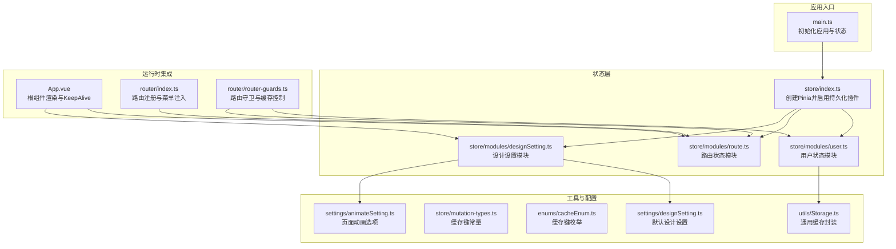
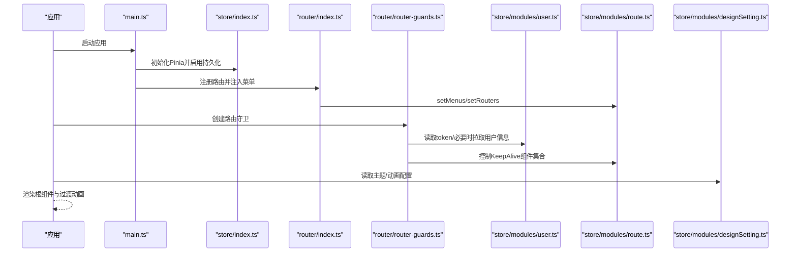
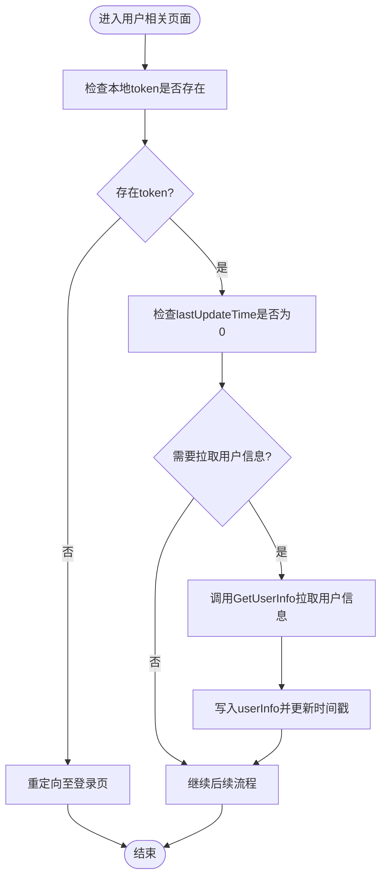
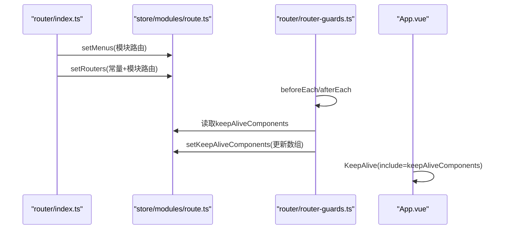
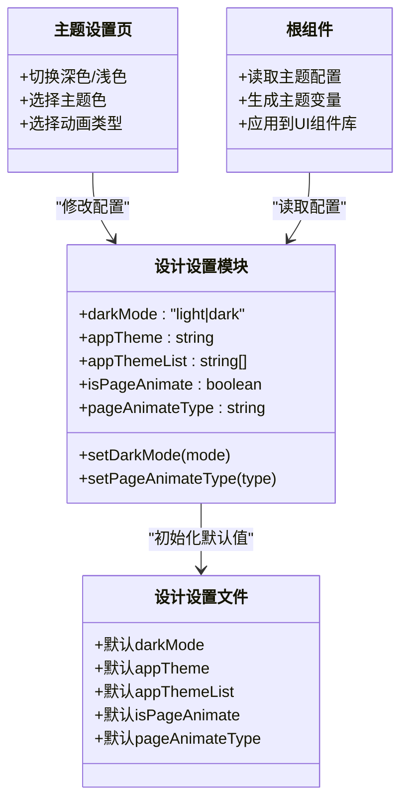
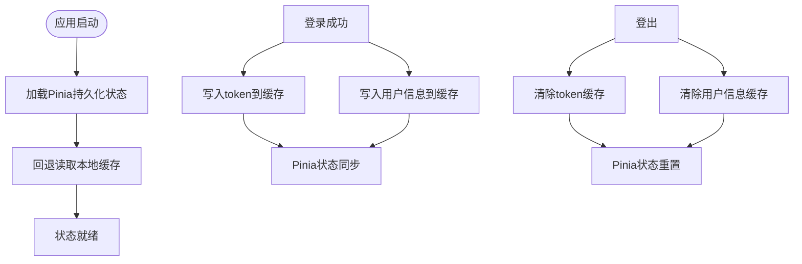
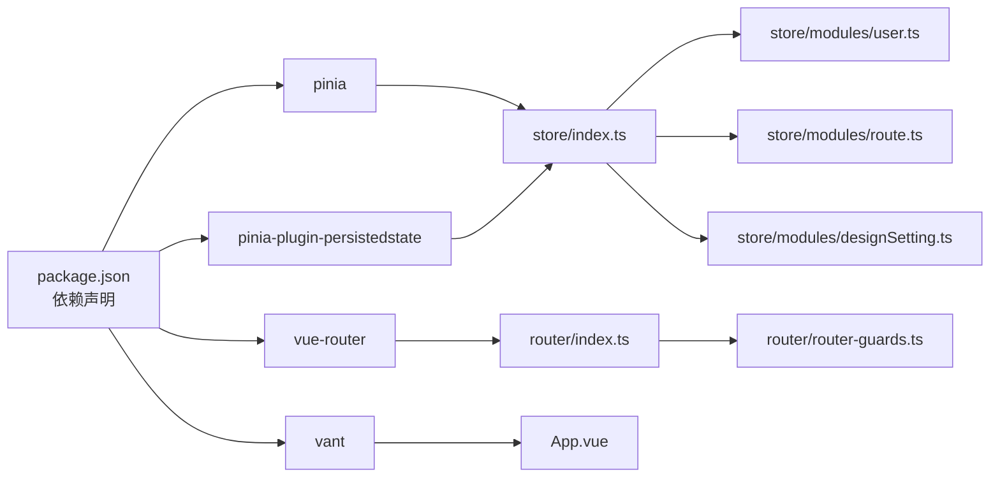

# 状态管理系统

<cite>
**本文引用的文件**
- [src/store/index.ts](file://src/store/index.ts)
- [src/store/modules/user.ts](file://src/store/modules/user.ts)
- [src/store/modules/route.ts](file://src/store/modules/route.ts)
- [src/store/modules/designSetting.ts](file://src/store/modules/designSetting.ts)
- [src/store/mutation-types.ts](file://src/store/mutation-types.ts)
- [src/utils/Storage.ts](file://src/utils/Storage.ts)
- [src/main.ts](file://src/main.ts)
- [src/router/index.ts](file://src/router/index.ts)
- [src/router/router-guards.ts](file://src/router/router-guards.ts)
- [src/App.vue](file://src/App.vue)
- [src/hooks/setting/useDesignSetting.ts](file://src/hooks/setting/useDesignSetting.ts)
- [src/settings/designSetting.ts](file://src/settings/designSetting.ts)
- [src/settings/animateSetting.ts](file://src/settings/animateSetting.ts)
- [src/views/my/ThemeSetting.vue](file://src/views/my/ThemeSetting.vue)
- [src/enums/cacheEnum.ts](file://src/enums/cacheEnum.ts)
- [package.json](file://package.json)
</cite>

## 目录
1. [简介](#简介)
2. [项目结构](#项目结构)
3. [核心组件](#核心组件)
4. [架构总览](#架构总览)
5. [详细组件分析](#详细组件分析)
6. [依赖关系分析](#依赖关系分析)
7. [性能考量](#性能考量)
8. [故障排查指南](#故障排查指南)
9. [结论](#结论)
10. [附录](#附录)

## 简介
本文件系统性梳理了基于 Pinia 的状态管理方案，覆盖模块化状态管理、状态持久化与同步机制；深入解析用户状态（登录态、会话、用户信息）、路由状态（菜单、动态路由、路由缓存）与设计设置（主题、动画、个性化）；并总结最佳实践与性能优化策略，帮助开发者在复杂业务场景中高效、稳定地管理应用状态。

## 项目结构
本项目采用“按功能域划分”的 Store 组织方式：用户状态、路由状态、设计设置分别独立模块化，配合全局持久化插件与工具层缓存，形成清晰的状态边界与职责分离。

图表来源
- [src/main.ts:18-30](file://src/main.ts#L18-L30)
- [src/store/index.ts:1-13](file://src/store/index.ts#L1-L13)
- [src/store/modules/user.ts:1-115](file://src/store/modules/user.ts#L1-L115)
- [src/store/modules/route.ts:1-40](file://src/store/modules/route.ts#L1-L40)
- [src/store/modules/designSetting.ts:1-52](file://src/store/modules/designSetting.ts#L1-L52)
- [src/utils/Storage.ts:1-128](file://src/utils/Storage.ts#L1-L128)
- [src/router/index.ts:1-33](file://src/router/index.ts#L1-L33)
- [src/router/router-guards.ts:1-93](file://src/router/router-guards.ts#L1-L93)
- [src/App.vue:1-78](file://src/App.vue#L1-L78)
- [src/settings/designSetting.ts:1-52](file://src/settings/designSetting.ts#L1-L52)
- [src/settings/animateSetting.ts:1-9](file://src/settings/animateSetting.ts#L1-L9)

章节来源
- [src/main.ts:18-30](file://src/main.ts#L18-L30)
- [src/store/index.ts:1-13](file://src/store/index.ts#L1-L13)

## 核心组件
- 状态容器与持久化
  - 通过全局 Pinia 实例启用持久化插件，统一管理跨页/刷新后的状态恢复。
  - 设计设置模块显式声明持久化键与存储介质，确保主题等个性化设置跨会话保留。
- 用户状态模块
  - 管理 token、用户信息、最后更新时间；提供登录、登出、拉取用户信息等动作。
  - 与本地缓存交互，保证 token 与用户信息在刷新后仍可恢复。
- 路由状态模块
  - 维护菜单、动态路由与 KeepAlive 组件集合；支持运行时动态注入与缓存控制。
- 设计设置模块
  - 提供深色/浅色模式、主题色、页面切换动画开关与类型等配置；与 UI 主题变量联动。
- 工具与常量
  - 通用缓存封装提供带过期时间的 KV 存储；缓存键常量与枚举规范统一命名。

章节来源
- [src/store/index.ts:1-13](file://src/store/index.ts#L1-L13)
- [src/store/modules/user.ts:1-115](file://src/store/modules/user.ts#L1-L115)
- [src/store/modules/route.ts:1-40](file://src/store/modules/route.ts#L1-L40)
- [src/store/modules/designSetting.ts:1-52](file://src/store/modules/designSetting.ts#L1-L52)
- [src/utils/Storage.ts:1-128](file://src/utils/Storage.ts#L1-L128)
- [src/store/mutation-types.ts:1-4](file://src/store/mutation-types.ts#L1-L4)
- [src/enums/cacheEnum.ts:1-15](file://src/enums/cacheEnum.ts#L1-L15)

## 架构总览
整体架构围绕“模块化 Store + 全局持久化 + 路由守卫 + 根组件渲染”展开：应用启动时初始化 Pinia 并挂载到应用；路由系统在初始化阶段注入菜单与常量路由；路由守卫负责鉴权、用户信息拉取与 KeepAlive 组件缓存策略；根组件根据路由状态与设计设置进行渲染与动画控制。

图表来源
- [src/main.ts:18-30](file://src/main.ts#L18-L30)
- [src/store/index.ts:1-13](file://src/store/index.ts#L1-13)
- [src/router/index.ts:1-33](file://src/router/index.ts#L1-L33)
- [src/router/router-guards.ts:1-93](file://src/router/router-guards.ts#L1-L93)
- [src/store/modules/user.ts:1-115](file://src/store/modules/user.ts#L1-L115)
- [src/store/modules/route.ts:1-40](file://src/store/modules/route.ts#L1-L40)
- [src/store/modules/designSetting.ts:1-52](file://src/store/modules/designSetting.ts#L1-L52)

## 详细组件分析

### 用户状态模块（登录态与会话）
- 状态结构
  - token：访问令牌，用于接口鉴权。
  - userInfo：当前用户信息，包含基础资料与扩展字段。
  - lastUpdateTime：用户信息最后更新时间戳，用于判断是否需要重新拉取。
- 关键能力
  - 登录：调用登录接口成功后写入 token，并持久化到本地缓存。
  - 拉取用户信息：首次进入或缺失时从服务端获取并写入 userInfo。
  - 登出：清理 token 与用户信息，跳转登录页并强制刷新。
- 数据持久化
  - 通过工具缓存封装与缓存键常量，确保 token 与用户信息在刷新后可恢复。
- 安全与容错
  - 登出流程中尝试服务端注销，失败时记录错误但继续清理本地状态。
  - 登录流程对异常进行捕获并返回错误结果，避免阻塞 UI。

图表来源
- [src/store/modules/user.ts:64-107](file://src/store/modules/user.ts#L64-L107)
- [src/router/router-guards.ts:33-48](file://src/router/router-guards.ts#L33-L48)
- [src/utils/Storage.ts:27-57](file://src/utils/Storage.ts#L27-L57)
- [src/store/mutation-types.ts:1-4](file://src/store/mutation-types.ts#L1-L4)

章节来源
- [src/store/modules/user.ts:1-115](file://src/store/modules/user.ts#L1-L115)
- [src/utils/Storage.ts:1-128](file://src/utils/Storage.ts#L1-L128)
- [src/store/mutation-types.ts:1-4](file://src/store/mutation-types.ts#L1-L4)
- [src/router/router-guards.ts:17-51](file://src/router/router-guards.ts#L17-L51)

### 路由状态模块（菜单、动态路由与缓存）
- 状态结构
  - menus：菜单树/列表，用于侧边栏/顶部导航渲染。
  - routers：完整路由表，包含常量路由与动态模块路由。
  - keepAliveComponents：需要缓存的组件名称集合。
- 关键能力
  - 动态注入：在路由初始化时将模块路由与常量路由合并注入。
  - 缓存控制：在路由守卫 after 每次进入时根据 meta.keepAlive 决定加入/移除缓存列表。
- 与根组件协作
  - 根组件使用 KeepAlive 包裹 RouterView，并依据 keepAliveComponents 动态缓存组件。

图表来源
- [src/router/index.ts:14-24](file://src/router/index.ts#L14-L24)
- [src/store/modules/route.ts:23-33](file://src/store/modules/route.ts#L23-L33)
- [src/router/router-guards.ts:62-87](file://src/router/router-guards.ts#L62-L87)
- [src/App.vue:5-11](file://src/App.vue#L5-L11)

章节来源
- [src/store/modules/route.ts:1-40](file://src/store/modules/route.ts#L1-L40)
- [src/router/index.ts:1-33](file://src/router/index.ts#L1-L33)
- [src/router/router-guards.ts:17-93](file://src/router/router-guards.ts#L17-L93)
- [src/App.vue:1-78](file://src/App.vue#L1-L78)

### 设计设置模块（主题、动画与个性化）
- 默认配置
  - 来源于设计设置文件，包含深色/浅色模式、主题色列表、页面动画开关与类型。
- 状态与行为
  - 提供 getter 读取当前配置；actions 修改模式与动画类型。
  - 显式持久化配置到 localStorage，键名自定义，确保跨会话保留。
- 视图联动
  - 主题设置页通过双向绑定与 store 同步，实时影响 UI 主题变量。
  - 根组件根据配置生成主题变量并应用到 UI 组件库。

图表来源
- [src/store/modules/designSetting.ts:8-46](file://src/store/modules/designSetting.ts#L8-L46)
- [src/settings/designSetting.ts:38-51](file://src/settings/designSetting.ts#L38-L51)
- [src/views/my/ThemeSetting.vue:70-117](file://src/views/my/ThemeSetting.vue#L70-L117)
- [src/App.vue:26-72](file://src/App.vue#L26-L72)

章节来源
- [src/store/modules/designSetting.ts:1-52](file://src/store/modules/designSetting.ts#L1-L52)
- [src/settings/designSetting.ts:1-52](file://src/settings/designSetting.ts#L1-L52)
- [src/views/my/ThemeSetting.vue:1-120](file://src/views/my/ThemeSetting.vue#L1-L120)
- [src/App.vue:1-78](file://src/App.vue#L1-L78)
- [src/hooks/setting/useDesignSetting.ts:1-25](file://src/hooks/setting/useDesignSetting.ts#L1-L25)
- [src/settings/animateSetting.ts:1-9](file://src/settings/animateSetting.ts#L1-L9)

### 状态持久化与同步机制
- 全局持久化
  - 通过 Pinia 插件对所有 Store 启用持久化，确保跨刷新状态恢复。
- 模块级持久化
  - 设计设置模块显式配置持久化键与存储介质，避免与其他模块冲突。
- 本地缓存封装
  - 提供带过期时间的 KV 存储，支持 Cookie 与本地存储；用户模块在登录/登出时直接操作本地缓存键。
- 同步策略
  - Getter 优先从 Pinia 状态读取，若为空则回退到本地缓存读取，保证初始化阶段可用。
  - 登录成功后立即写入 token 与用户信息，随后在路由守卫中完成用户信息补全。

图表来源
- [src/store/index.ts:1-13](file://src/store/index.ts#L1-L13)
- [src/store/modules/designSetting.ts:42-45](file://src/store/modules/designSetting.ts#L42-L45)
- [src/store/modules/user.ts:54-107](file://src/store/modules/user.ts#L54-L107)
- [src/utils/Storage.ts:27-73](file://src/utils/Storage.ts#L27-L73)
- [src/store/mutation-types.ts:1-4](file://src/store/mutation-types.ts#L1-L4)

章节来源
- [src/store/index.ts:1-13](file://src/store/index.ts#L1-L13)
- [src/store/modules/designSetting.ts:1-52](file://src/store/modules/designSetting.ts#L1-L52)
- [src/store/modules/user.ts:1-115](file://src/store/modules/user.ts#L1-L115)
- [src/utils/Storage.ts:1-128](file://src/utils/Storage.ts#L1-L128)
- [src/store/mutation-types.ts:1-4](file://src/store/mutation-types.ts#L1-L4)

## 依赖关系分析
- 外部依赖
  - Pinia 与持久化插件：提供响应式状态容器与跨刷新持久化能力。
  - Vue Router：承载路由与导航守卫，驱动路由状态变更。
  - Vant 4：UI 组件库，与主题变量联动实现统一视觉风格。
- 内部耦合
  - 路由守卫依赖用户与路由模块，用于鉴权与缓存控制。
  - 根组件依赖路由与设计设置模块，用于渲染与动画控制。
  - 用户模块依赖工具缓存与 API 接口，实现登录态与会话管理。

图表来源
- [package.json:41-56](file://package.json#L41-L56)
- [src/store/index.ts:1-13](file://src/store/index.ts#L1-L13)
- [src/router/index.ts:1-33](file://src/router/index.ts#L1-L33)
- [src/router/router-guards.ts:1-93](file://src/router/router-guards.ts#L1-L93)
- [src/App.vue:1-78](file://src/App.vue#L1-L78)

章节来源
- [package.json:1-118](file://package.json#L1-L118)
- [src/store/index.ts:1-13](file://src/store/index.ts#L1-L13)
- [src/router/index.ts:1-33](file://src/router/index.ts#L1-L33)
- [src/router/router-guards.ts:1-93](file://src/router/router-guards.ts#L1-L93)
- [src/App.vue:1-78](file://src/App.vue#L1-L78)

## 性能考量
- 路由缓存策略
  - 仅对明确标记 keepAlive 的页面进行缓存，避免无谓的内存占用；进入新页面时及时清理不再需要缓存的组件。
- 状态持久化粒度
  - 对体量较大或频繁变化的状态谨慎持久化，减少本地存储压力；对轻量配置（如主题）启用持久化提升体验。
- 异步加载与并发
  - 登录与用户信息拉取采用 Promise 包装，避免阻塞路由守卫；对网络异常进行降级处理，保证用户体验。
- 渲染优化
  - 使用 KeepAlive 与过渡动画结合，减少重复渲染成本；主题变量计算在组件层按需派生，避免全局重绘。

## 故障排查指南
- 登录后无法跳转或白屏
  - 检查路由守卫中 token 读取逻辑与登录返回码；确认登录成功后已写入 token 并触发路由跳转。
- 用户信息未显示
  - 确认路由守卫在首次进入时调用了用户信息拉取；检查本地缓存键是否存在以及是否过期。
- 主题切换无效
  - 检查设计设置模块是否正确写入持久化；确认根组件主题变量生成逻辑与 UI 组件库版本兼容。
- 页面缓存异常
  - 检查路由 meta.keepAlive 标记与路由守卫中的缓存数组更新逻辑；确认组件名称与 include 匹配一致。

章节来源
- [src/router/router-guards.ts:17-93](file://src/router/router-guards.ts#L17-L93)
- [src/store/modules/user.ts:64-107](file://src/store/modules/user.ts#L64-L107)
- [src/store/modules/designSetting.ts:34-40](file://src/store/modules/designSetting.ts#L34-L40)
- [src/App.vue:5-11](file://src/App.vue#L5-L11)

## 结论
本状态管理方案以模块化为核心，结合 Pinia 持久化与路由守卫，实现了登录态、路由缓存与设计设置的解耦与协同。通过本地缓存封装与显式持久化策略，兼顾了易用性与可靠性；配合 KeepAlive 与主题变量体系，提升了渲染性能与个性化体验。建议在实际项目中遵循本文最佳实践，持续优化状态粒度与异步处理策略，保障大规模业务下的稳定性与可维护性。

## 附录
- 最佳实践清单
  - 状态设计原则：单一职责、最小共享、可预测更新。
  - 异步操作处理：统一 Promise 包装、错误上抛与降级策略。
  - 性能优化策略：按需缓存、懒加载、计算属性复用、避免不必要的响应式。
  - 可观测性：为关键状态变更添加日志或调试开关，便于问题定位。