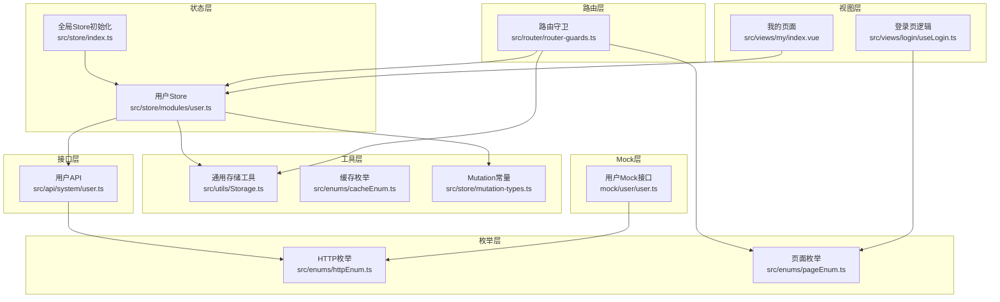
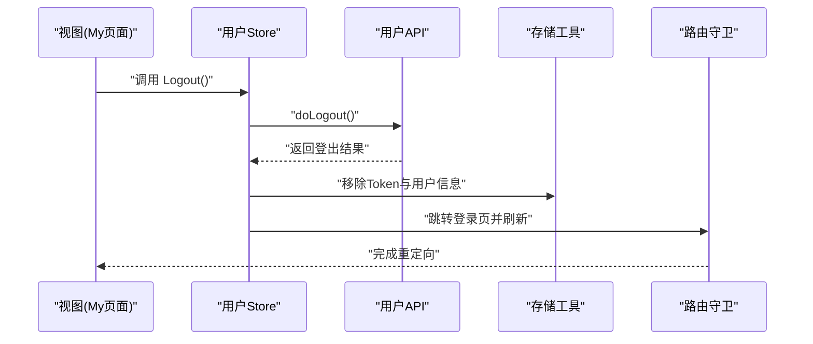
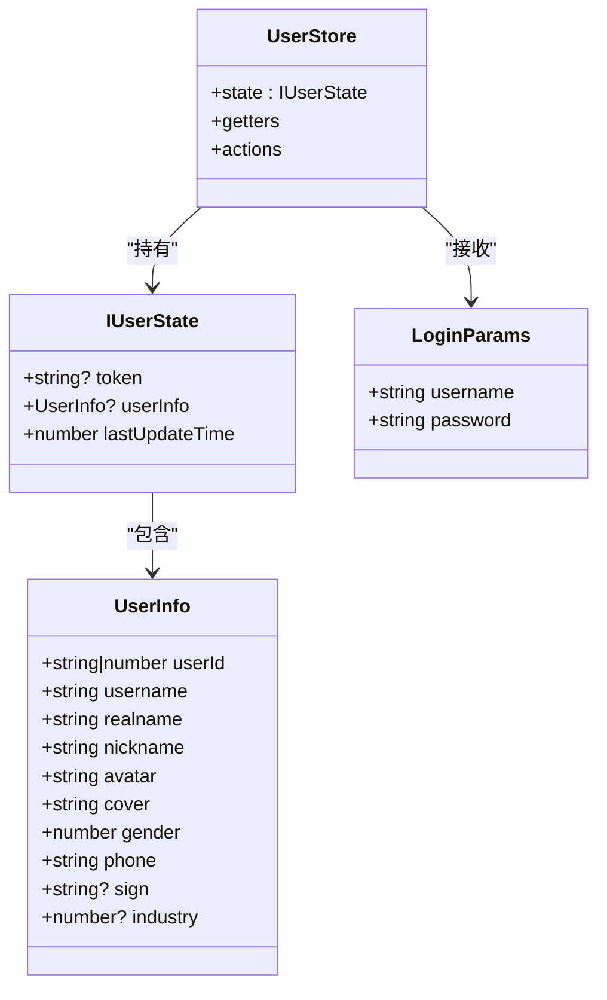
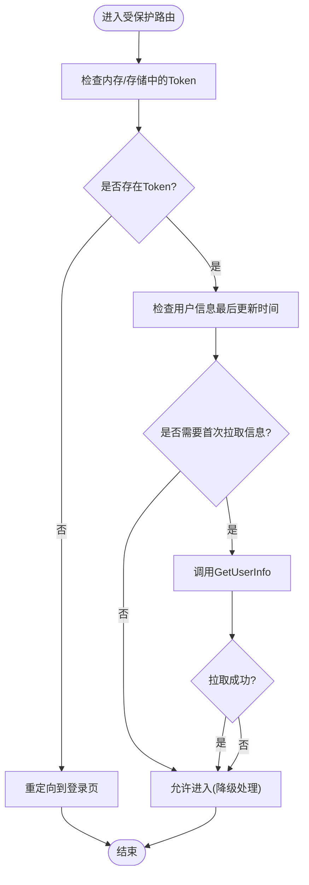
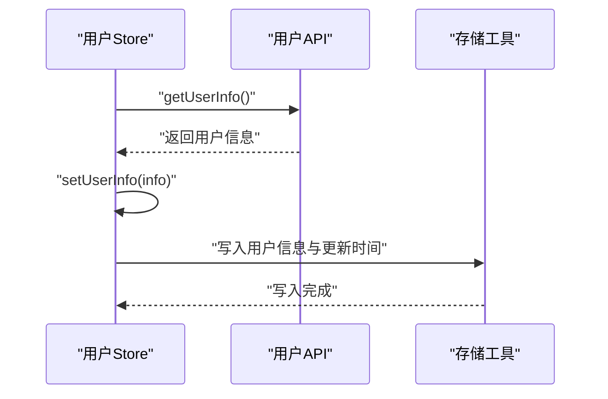
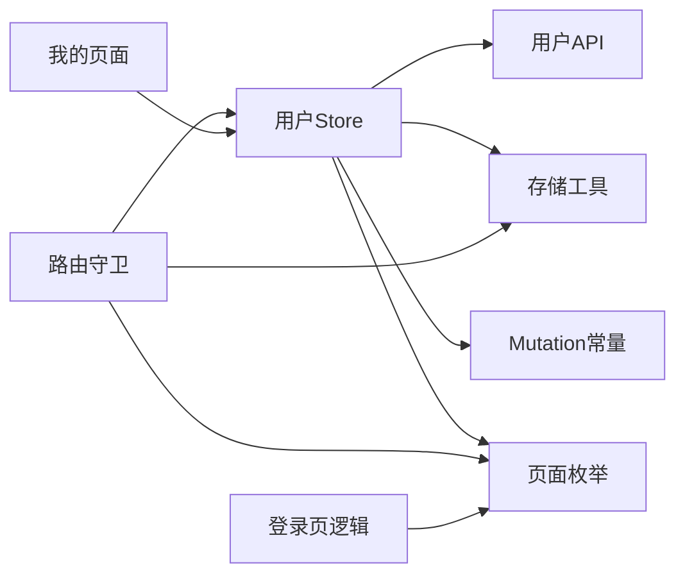

# 用户状态管理

<cite>
**本文引用的文件**
- [src/store/modules/user.ts](file://src/store/modules/user.ts)
- [src/store/index.ts](file://src/store/index.ts)
- [src/api/system/user.ts](file://src/api/system/user.ts)
- [src/utils/Storage.ts](file://src/utils/Storage.ts)
- [src/enums/cacheEnum.ts](file://src/enums/cacheEnum.ts)
- [src/store/mutation-types.ts](file://src/store/mutation-types.ts)
- [src/enums/httpEnum.ts](file://src/enums/httpEnum.ts)
- [src/enums/pageEnum.ts](file://src/enums/pageEnum.ts)
- [src/router/router-guards.ts](file://src/router/router-guards.ts)
- [src/main.ts](file://src/main.ts)
- [src/views/login/useLogin.ts](file://src/views/login/useLogin.ts)
- [src/views/my/index.vue](file://src/views/my/index.vue)
- [mock/user/user.ts](file://mock/user/user.ts)
</cite>

## 目录
1. [简介](#简介)
2. [项目结构](#项目结构)
3. [核心组件](#核心组件)
4. [架构总览](#架构总览)
5. [详细组件分析](#详细组件分析)
6. [依赖分析](#依赖分析)
7. [性能考量](#性能考量)
8. [故障排查指南](#故障排查指南)
9. [结论](#结论)
10. [附录：使用指南与示例路径](#附录使用指南与示例路径)

## 简介
本文件系统性梳理并解析本项目的用户状态管理模块，重点围绕以下方面展开：
- 用户信息的数据结构、状态定义与类型约束
- 登录状态管理（登录验证、Token处理、会话维护）
- 用户信息的获取、更新与缓存策略
- 异步操作处理（登录API调用、错误处理、状态同步）
- 权限验证、角色管理与安全考虑
- 提供可直接定位到源码的示例路径，便于快速上手

## 项目结构
用户状态管理涉及的核心目录与文件如下：
- 状态层：Pinia Store（用户模块、全局Store配置）
- 接口层：系统用户API封装
- 工具层：通用存储工具（含本地缓存与Cookie能力）
- 枚举层：缓存键、HTTP状态码、页面常量等
- 路由层：路由守卫（鉴权与首次拉取用户信息）
- 视图层：登录与个人中心页面对用户状态的使用
- Mock层：模拟用户接口，便于开发调试

图表来源
- [src/store/modules/user.ts:1-115](file://src/store/modules/user.ts#L1-L115)
- [src/store/index.ts:1-13](file://src/store/index.ts#L1-L13)
- [src/api/system/user.ts:1-60](file://src/api/system/user.ts#L1-L60)
- [src/utils/Storage.ts:1-128](file://src/utils/Storage.ts#L1-L128)
- [src/enums/cacheEnum.ts:1-15](file://src/enums/cacheEnum.ts#L1-L15)
- [src/store/mutation-types.ts:1-4](file://src/store/mutation-types.ts#L1-L4)
- [src/enums/httpEnum.ts:1-36](file://src/enums/httpEnum.ts#L1-L36)
- [src/enums/pageEnum.ts:1-12](file://src/enums/pageEnum.ts#L1-L12)
- [src/router/router-guards.ts:1-93](file://src/router/router-guards.ts#L1-L93)
- [src/views/login/useLogin.ts:1-97](file://src/views/login/useLogin.ts#L1-L97)
- [src/views/my/index.vue:1-145](file://src/views/my/index.vue#L1-L145)
- [mock/user/user.ts:1-96](file://mock/user/user.ts#L1-L96)

章节来源
- [src/store/modules/user.ts:1-115](file://src/store/modules/user.ts#L1-L115)
- [src/store/index.ts:1-13](file://src/store/index.ts#L1-L13)
- [src/api/system/user.ts:1-60](file://src/api/system/user.ts#L1-L60)
- [src/utils/Storage.ts:1-128](file://src/utils/Storage.ts#L1-L128)
- [src/enums/cacheEnum.ts:1-15](file://src/enums/cacheEnum.ts#L1-L15)
- [src/store/mutation-types.ts:1-4](file://src/store/mutation-types.ts#L1-L4)
- [src/enums/httpEnum.ts:1-36](file://src/enums/httpEnum.ts#L1-L36)
- [src/enums/pageEnum.ts:1-12](file://src/enums/pageEnum.ts#L1-L12)
- [src/router/router-guards.ts:1-93](file://src/router/router-guards.ts#L1-L93)
- [src/views/login/useLogin.ts:1-97](file://src/views/login/useLogin.ts#L1-L97)
- [src/views/my/index.vue:1-145](file://src/views/my/index.vue#L1-L145)
- [mock/user/user.ts:1-96](file://mock/user/user.ts#L1-L96)

## 核心组件
- 用户Store（Pinia）：负责用户状态的集中管理，包括token、用户信息、最后更新时间；提供登录、获取用户信息、登出等动作。
- 用户API：封装登录、获取用户信息、登出等HTTP请求。
- 通用存储工具：提供localStorage封装，支持键名前缀、过期时间、Cookie读写等能力。
- 路由守卫：在进入受保护路由前校验Token，必要时拉取用户信息并重定向至登录页。
- 页面与视图：登录页表单规则与状态切换、个人中心展示用户信息并触发登出。

章节来源
- [src/store/modules/user.ts:36-109](file://src/store/modules/user.ts#L36-L109)
- [src/api/system/user.ts:12-43](file://src/api/system/user.ts#L12-L43)
- [src/utils/Storage.ts:8-123](file://src/utils/Storage.ts#L8-L123)
- [src/router/router-guards.ts:17-51](file://src/router/router-guards.ts#L17-L51)
- [src/views/my/index.vue:65-88](file://src/views/my/index.vue#L65-L88)

## 架构总览
用户状态管理采用“Store + API + 存储 + 路由守卫”的分层设计，数据流自上而下：
- 视图层触发登录/登出/获取信息等动作
- Store执行异步请求并与存储交互
- 路由守卫在导航阶段进行鉴权与信息补全
- 枚举与常量统一管理配置

图表来源
- [src/views/my/index.vue:78-83](file://src/views/my/index.vue#L78-L83)
- [src/store/modules/user.ts:92-107](file://src/store/modules/user.ts#L92-L107)
- [src/api/system/user.ts:38-43](file://src/api/system/user.ts#L38-L43)
- [src/router/router-guards.ts:103-106](file://src/router/router-guards.ts#L103-L106)

## 详细组件分析

### 用户Store 设计与实现
- 数据结构与类型约束
  - 用户信息结构：包含用户标识、用户名、昵称、头像、性别、手机、签名、行业等字段，部分字段可选。
  - 状态结构：token、userInfo、lastUpdateTime。
  - 登录参数：用户名、密码。
- Getter
  - getToken：优先从内存获取，否则回退到存储。
  - getUserInfo：优先从内存获取，否则回退到存储。
  - getLastUpdateTime：返回最后更新时间。
- Actions
  - setToken：设置内存token并持久化到存储。
  - setUserInfo：设置用户信息并更新最后更新时间，同时持久化到存储。
  - Login：调用登录API，根据响应码决定是否保存token。
  - GetUserInfo：调用获取用户信息API，成功后更新用户信息。
  - Logout：若存在token则尝试服务端登出，清理内存与存储，跳转登录页并刷新。

图表来源
- [src/store/modules/user.ts:12-41](file://src/store/modules/user.ts#L12-L41)
- [src/store/modules/user.ts:36-109](file://src/store/modules/user.ts#L36-L109)

章节来源
- [src/store/modules/user.ts:12-41](file://src/store/modules/user.ts#L12-L41)
- [src/store/modules/user.ts:42-52](file://src/store/modules/user.ts#L42-L52)
- [src/store/modules/user.ts:54-107](file://src/store/modules/user.ts#L54-L107)

### 登录状态管理机制
- 登录验证
  - 登录API返回包含code与result的结构，Store根据成功码保存token。
- Token处理
  - 内存与存储双写，Getter优先从内存读取，提升性能。
  - 登出时同步清除内存与存储。
- 会话维护
  - 路由守卫在进入受保护路由时检查Token，若缺失则重定向登录。
  - 若用户信息未拉取过（lastUpdateTime为0），则在进入时主动拉取一次。

图表来源
- [src/router/router-guards.ts:18-51](file://src/router/router-guards.ts#L18-L51)
- [src/store/modules/user.ts:79-90](file://src/store/modules/user.ts#L79-L90)

章节来源
- [src/store/modules/user.ts:64-77](file://src/store/modules/user.ts#L64-L77)
- [src/store/modules/user.ts:92-107](file://src/store/modules/user.ts#L92-L107)
- [src/router/router-guards.ts:33-48](file://src/router/router-guards.ts#L33-L48)

### 用户信息获取、更新与缓存策略
- 获取与更新
  - GetUserInfo通过API获取用户信息，成功后setUserInfo更新内存与存储，并记录最后更新时间。
- 缓存策略
  - 通用存储工具支持键名前缀、默认过期时间、Cookie读写等能力。
  - 用户Store使用存储工具持久化token与用户信息，避免刷新丢失。
- 生命周期
  - Store初始化时从存储恢复token与用户信息；路由守卫在必要时再次拉取。

图表来源
- [src/store/modules/user.ts:79-90](file://src/store/modules/user.ts#L79-L90)
- [src/utils/Storage.ts:27-57](file://src/utils/Storage.ts#L27-L57)

章节来源
- [src/store/modules/user.ts:58-62](file://src/store/modules/user.ts#L58-L62)
- [src/utils/Storage.ts:8-123](file://src/utils/Storage.ts#L8-L123)

### 异步操作处理（登录API、错误处理、状态同步）
- 登录API调用
  - Login封装了登录请求，根据返回码决定是否保存token。
- 错误处理
  - Login内部try/catch捕获异常并reject，便于调用方处理。
  - Logout在调用服务端登出失败时仅打印错误日志，保证本地状态清理。
- 状态同步
  - 所有状态变更均同步写入存储，确保刷新后仍可恢复。

章节来源
- [src/store/modules/user.ts:64-77](file://src/store/modules/user.ts#L64-L77)
- [src/store/modules/user.ts:92-107](file://src/store/modules/user.ts#L92-L107)
- [src/api/system/user.ts:12-23](file://src/api/system/user.ts#L12-L23)

### 权限验证、角色管理与安全考虑
- 权限验证
  - 路由守卫基于Token判断访问权限，白名单路径除外。
- 角色管理
  - 当前用户Store未暴露角色相关字段与方法；如需角色控制，可在UserInfo中扩展角色列表并在Store中增加对应getter/action。
- 安全考虑
  - Token与用户信息均持久化存储，建议在生产环境结合HttpOnly Cookie与服务端会话管理进一步加固。
  - 登出时同时清理内存与存储，防止残留。

章节来源
- [src/router/router-guards.ts:17-51](file://src/router/router-guards.ts#L17-L51)
- [src/store/modules/user.ts:12-29](file://src/store/modules/user.ts#L12-L29)
- [src/store/modules/user.ts:54-107](file://src/store/modules/user.ts#L54-L107)

## 依赖分析
- 组件耦合
  - 用户Store依赖API、存储工具、路由与枚举。
  - 路由守卫依赖用户Store与存储工具。
- 外部依赖
  - Pinia用于状态管理，已启用持久化插件。
  - Vue Router用于路由守卫与页面跳转。
- 可能的循环依赖
  - 未发现明显循环依赖；各模块职责清晰。

图表来源
- [src/store/modules/user.ts:1-10](file://src/store/modules/user.ts#L1-L10)
- [src/router/router-guards.ts:4-8](file://src/router/router-guards.ts#L4-L8)
- [src/views/my/index.vue:67](file://src/views/my/index.vue#L67)
- [src/views/login/useLogin.ts:3-7](file://src/views/login/useLogin.ts#L3-L7)

章节来源
- [src/store/modules/user.ts:1-10](file://src/store/modules/user.ts#L1-L10)
- [src/router/router-guards.ts:4-8](file://src/router/router-guards.ts#L4-L8)
- [src/views/my/index.vue:67](file://src/views/my/index.vue#L67)
- [src/views/login/useLogin.ts:3-7](file://src/views/login/useLogin.ts#L3-L7)

## 性能考量
- Getter优先读取内存，减少存储IO开销。
- 仅在必要时发起用户信息拉取，避免重复请求。
- 存储默认缓存周期较长，适合用户信息场景；如需更短生命周期可传入自定义过期时间。

## 故障排查指南
- 登录后无法进入受保护页面
  - 检查路由守卫是否正确读取Token与用户信息。
  - 参考：[src/router/router-guards.ts:33-48](file://src/router/router-guards.ts#L33-L48)
- 登出后仍显示登录态
  - 确认Logout是否调用了服务端登出并清理了存储。
  - 参考：[src/store/modules/user.ts:92-107](file://src/store/modules/user.ts#L92-L107)
- 用户信息未更新
  - 确认GetUserInfo是否被调用，以及lastUpdateTime是否被更新。
  - 参考：[src/store/modules/user.ts:79-90](file://src/store/modules/user.ts#L79-L90)
- 开发环境接口异常
  - 检查Mock接口是否返回正确的Token与用户信息。
  - 参考：[mock/user/user.ts:40-95](file://mock/user/user.ts#L40-L95)

章节来源
- [src/router/router-guards.ts:33-48](file://src/router/router-guards.ts#L33-L48)
- [src/store/modules/user.ts:92-107](file://src/store/modules/user.ts#L92-L107)
- [src/store/modules/user.ts:79-90](file://src/store/modules/user.ts#L79-L90)
- [mock/user/user.ts:40-95](file://mock/user/user.ts#L40-L95)

## 结论
本用户状态管理模块以Pinia为核心，结合统一的存储工具与路由守卫，实现了登录态、Token与用户信息的完整闭环。通过Getter与Action的分离、异步操作的规范化处理，以及Mock接口的支持，模块具备良好的可扩展性与可维护性。后续可在UserInfo中扩展角色字段，并在Store中补充角色相关的getter与权限校验逻辑，以满足更复杂的权限体系需求。

## 附录：使用指南与示例路径
- 在应用入口挂载Store
  - 参考：[src/main.ts:18-27](file://src/main.ts#L18-L27)
- 初始化全局Store（含持久化）
  - 参考：[src/store/index.ts:5-10](file://src/store/index.ts#L5-L10)
- 在组件中使用用户Store
  - 获取用户信息：[src/views/my/index.vue:69-72](file://src/views/my/index.vue#L69-L72)
  - 触发登出：[src/views/my/index.vue:78-83](file://src/views/my/index.vue#L78-L83)
- 登录流程（含表单规则与状态切换）
  - 参考：[src/views/login/useLogin.ts:3-23](file://src/views/login/useLogin.ts#L3-L23)
- 用户API调用
  - 登录：[src/api/system/user.ts:12-23](file://src/api/system/user.ts#L12-L23)
  - 获取用户信息：[src/api/system/user.ts:28-33](file://src/api/system/user.ts#L28-L33)
  - 登出：[src/api/system/user.ts:38-43](file://src/api/system/user.ts#L38-L43)
- 路由守卫鉴权
  - 参考：[src/router/router-guards.ts:17-51](file://src/router/router-guards.ts#L17-L51)
- 存储工具使用
  - 参考：[src/utils/Storage.ts:27-57](file://src/utils/Storage.ts#L27-L57)
- 常量与枚举
  - Token键与用户信息键：[src/store/mutation-types.ts:1-3](file://src/store/mutation-types.ts#L1-L3)
  - 缓存键枚举：[src/enums/cacheEnum.ts:1-15](file://src/enums/cacheEnum.ts#L1-L15)
  - HTTP状态码：[src/enums/httpEnum.ts:4-10](file://src/enums/httpEnum.ts#L4-L10)
  - 页面枚举：[src/enums/pageEnum.ts:2-11](file://src/enums/pageEnum.ts#L2-L11)