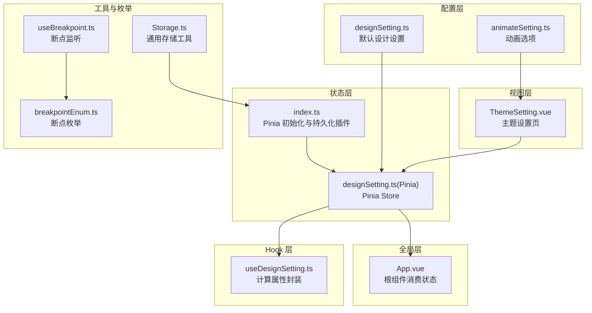
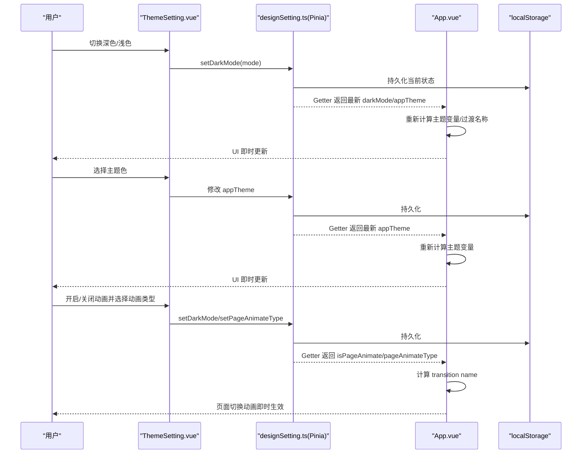
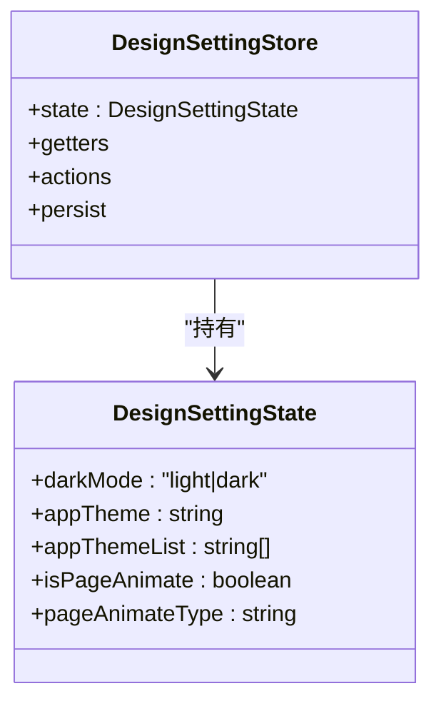
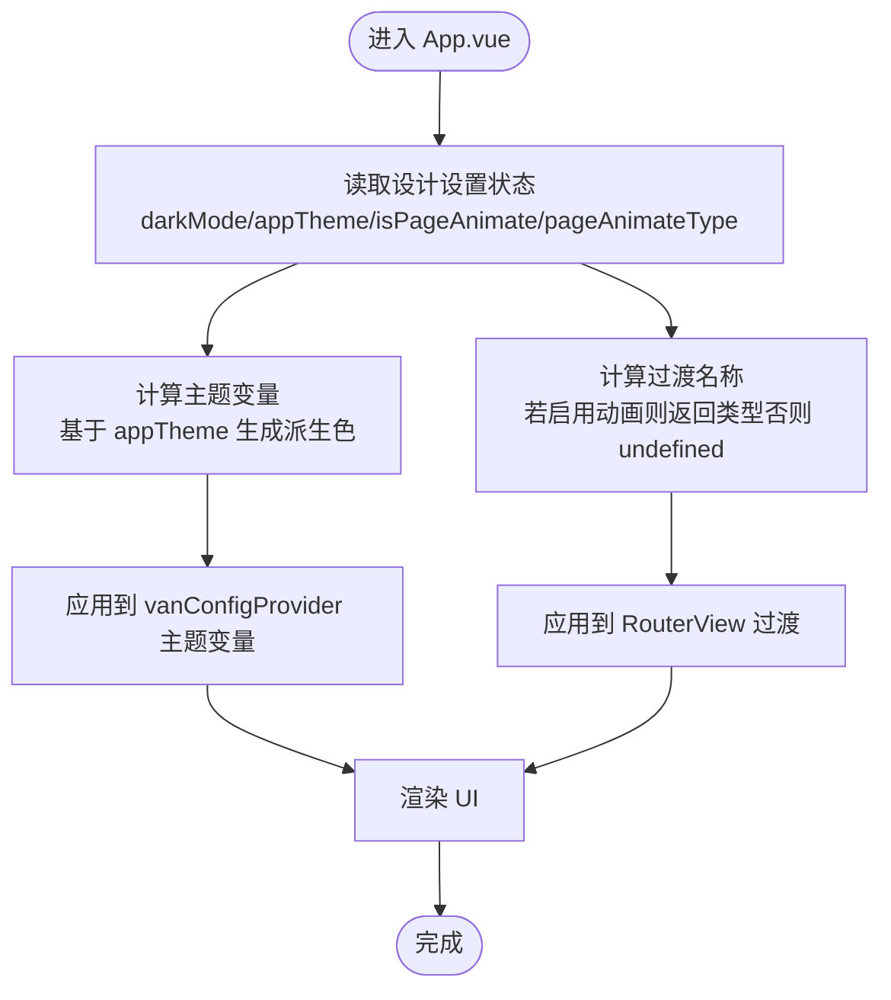
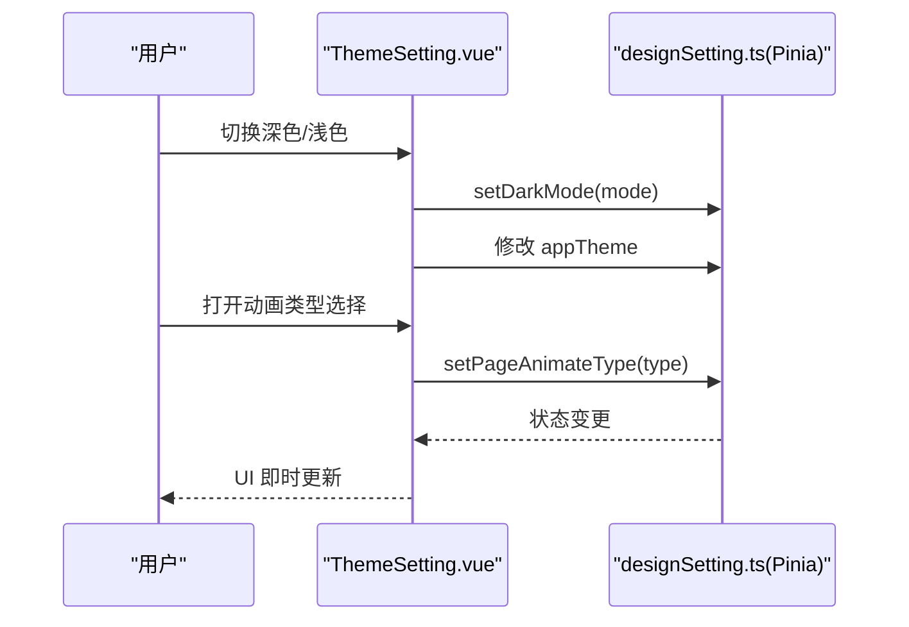
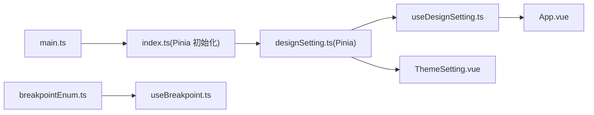

# 设计设置状态

<cite>
**本文引用的文件**
- [designSetting.ts](file://src/settings/designSetting.ts)
- [designSetting.ts（Pinia Store）](file://src/store/modules/designSetting.ts)
- [useDesignSetting.ts](file://src/hooks/setting/useDesignSetting.ts)
- [App.vue](file://src/App.vue)
- [ThemeSetting.vue](file://src/views/my/ThemeSetting.vue)
- [useBreakpoint.ts](file://src/hooks/event/useBreakpoint.ts)
- [breakpointEnum.ts](file://src/enums/breakpointEnum.ts)
- [animateSetting.ts](file://src/settings/animateSetting.ts)
- [index.ts（Pinia 初始化）](file://src/store/index.ts)
- [Storage.ts](file://src/utils/Storage.ts)
- [main.ts](file://src/main.ts)
- [var.less](file://src/styles/var.less)
- [package.json](file://package.json)
</cite>

## 目录
1. [简介](#简介)
2. [项目结构](#项目结构)
3. [核心组件](#核心组件)
4. [架构总览](#架构总览)
5. [详细组件分析](#详细组件分析)
6. [依赖关系分析](#依赖关系分析)
7. [性能考量](#性能考量)
8. [故障排查指南](#故障排查指南)
9. [结论](#结论)
10. [附录：配置选项与使用示例](#附录配置选项与使用示例)

## 简介
本文件围绕“设计设置状态”进行系统性梳理，重点覆盖以下方面：
- 主题配置：深色/浅色模式、系统主题色、主题色列表与动态主题变量生成
- 布局参数：页面切换动画开关与动画类型
- 个性化设置：通过页面设置页进行交互式修改
- 状态持久化：基于 Pinia 持久化插件的本地存储策略
- 实时更新机制：在根组件中对主题与动画进行即时生效
- 响应式断点：屏幕尺寸监听与断点枚举映射

## 项目结构
设计设置状态相关模块分布于如下位置：
- 配置层：src/settings 下的主题与动画配置
- 状态层：src/store/modules 下的 Pinia Store
- Hook 层：src/hooks/setting 下的组合式函数
- 视图层：src/views/my 下的主题设置页面
- 全局层：src/App.vue 根组件消费状态并驱动 UI
- 工具与枚举：src/utils、src/hooks/event、src/enums

图表来源
- [designSetting.ts:1-52](file://src/settings/designSetting.ts#L1-L52)
- [designSetting.ts（Pinia Store）:1-52](file://src/store/modules/designSetting.ts#L1-L52)
- [useDesignSetting.ts:1-25](file://src/hooks/setting/useDesignSetting.ts#L1-L25)
- [ThemeSetting.vue:1-120](file://src/views/my/ThemeSetting.vue#L1-L120)
- [App.vue:1-78](file://src/App.vue#L1-L78)
- [useBreakpoint.ts:1-96](file://src/hooks/event/useBreakpoint.ts#L1-L96)
- [breakpointEnum.ts:1-29](file://src/enums/breakpointEnum.ts#L1-L29)
- [index.ts（Pinia 初始化）:1-13](file://src/store/index.ts#L1-L13)
- [Storage.ts:1-128](file://src/utils/Storage.ts#L1-L128)

章节来源
- [designSetting.ts:1-52](file://src/settings/designSetting.ts#L1-L52)
- [designSetting.ts（Pinia Store）:1-52](file://src/store/modules/designSetting.ts#L1-L52)
- [useDesignSetting.ts:1-25](file://src/hooks/setting/useDesignSetting.ts#L1-L25)
- [ThemeSetting.vue:1-120](file://src/views/my/ThemeSetting.vue#L1-L120)
- [App.vue:1-78](file://src/App.vue#L1-L78)
- [useBreakpoint.ts:1-96](file://src/hooks/event/useBreakpoint.ts#L1-L96)
- [breakpointEnum.ts:1-29](file://src/enums/breakpointEnum.ts#L1-L29)
- [index.ts（Pinia 初始化）:1-13](file://src/store/index.ts#L1-L13)
- [Storage.ts:1-128](file://src/utils/Storage.ts#L1-L128)

## 核心组件
- 设计设置默认值与类型定义：集中于配置文件，提供深色/浅色模式、主题色、主题色列表、页面动画开关与动画类型等字段
- Pinia Store：封装状态、Getter、Action，并启用持久化到 localStorage
- 组合式 Hook：将 Store 状态包装为计算属性，便于在组件中直接使用
- 根组件：消费设计设置状态，动态生成主题变量并控制页面过渡动画
- 主题设置页：提供深色模式开关、主题色选择、页面动画开关与动画类型选择
- 断点监听：提供屏幕尺寸与断点映射，支持响应式布局与行为调整

章节来源
- [designSetting.ts:3-14](file://src/settings/designSetting.ts#L3-L14)
- [designSetting.ts（Pinia Store）:8-46](file://src/store/modules/designSetting.ts#L8-L46)
- [useDesignSetting.ts:4-24](file://src/hooks/setting/useDesignSetting.ts#L4-L24)
- [App.vue:15-72](file://src/App.vue#L15-L72)
- [ThemeSetting.vue:70-116](file://src/views/my/ThemeSetting.vue#L70-L116)
- [useBreakpoint.ts:19-95](file://src/hooks/event/useBreakpoint.ts#L19-L95)

## 架构总览
设计设置状态采用“配置 -> Store -> Hook -> 视图/根组件”的分层架构，配合 Pinia 持久化插件实现跨会话记忆。

图表来源
- [ThemeSetting.vue:78-90](file://src/views/my/ThemeSetting.vue#L78-L90)
- [ThemeSetting.vue:92-94](file://src/views/my/ThemeSetting.vue#L92-L94)
- [ThemeSetting.vue:106-116](file://src/views/my/ThemeSetting.vue#L106-L116)
- [designSetting.ts（Pinia Store）:34-40](file://src/store/modules/designSetting.ts#L34-L40)
- [App.vue:26-72](file://src/App.vue#L26-L72)
- [index.ts（Pinia 初始化）:3-6](file://src/store/index.ts#L3-L6)

## 详细组件分析

### 设计设置配置（默认值与类型）
- 类型定义：包含深色/浅色模式、系统主题色、主题色列表、页面动画开关与动画类型
- 默认值：深色模式、预设主题色集合、默认动画类型
- 作用：为 Store 提供初始状态与类型约束

章节来源
- [designSetting.ts:3-14](file://src/settings/designSetting.ts#L3-L14)
- [designSetting.ts:38-49](file://src/settings/designSetting.ts#L38-L49)

### Pinia Store（设计设置）
- 状态初始化：从配置文件导入默认值
- Getter：提供只读访问器，便于在组件中直接使用
- Action：提供可变操作，如切换深色/浅色模式、设置页面动画类型
- 持久化：启用 pinia-plugin-persistedstate，键名为 DESIGN-SETTING，存储于 localStorage

图表来源
- [designSetting.ts:3-14](file://src/settings/designSetting.ts#L3-L14)
- [designSetting.ts（Pinia Store）:8-46](file://src/store/modules/designSetting.ts#L8-L46)

章节来源
- [designSetting.ts（Pinia Store）:8-46](file://src/store/modules/designSetting.ts#L8-L46)

### 组合式 Hook（useDesignSetting）
- 将 Store 的状态封装为计算属性，便于在组件中以响应式方式读取
- 提供 getDarkMode、getAppTheme、getAppThemeList、getIsPageAnimate、getPageAnimateType 等访问器

章节来源
- [useDesignSetting.ts:4-24](file://src/hooks/setting/useDesignSetting.ts#L4-L24)

### 根组件（App.vue）的状态驱动机制
- 主题模式：通过 van ConfigProvider 的 theme 属性绑定深色/浅色模式
- 主题变量：根据当前 appTheme 动态生成一组主题变量，覆盖大量 UI 组件的颜色
- 页面动画：根据 isPageAnimate 与 pageAnimateType 计算 transition name，实现页面切换动画

图表来源
- [App.vue:15-72](file://src/App.vue#L15-L72)
- [designSetting.ts（Pinia Store）:16-32](file://src/store/modules/designSetting.ts#L16-L32)

章节来源
- [App.vue:15-72](file://src/App.vue#L15-L72)

### 主题设置页（ThemeSetting.vue）
- 深色/浅色模式：双向绑定到 useDark，并同步写入 Store
- 主题色：遍历 appThemeList，点击后写入 Store 的 appTheme
- 页面动画：开关控制是否启用动画；动画类型通过 Picker 选择并写入 Store

图表来源
- [ThemeSetting.vue:78-90](file://src/views/my/ThemeSetting.vue#L78-L90)
- [ThemeSetting.vue:92-94](file://src/views/my/ThemeSetting.vue#L92-L94)
- [ThemeSetting.vue:106-116](file://src/views/my/ThemeSetting.vue#L106-L116)
- [designSetting.ts（Pinia Store）:34-40](file://src/store/modules/designSetting.ts#L34-L40)

章节来源
- [ThemeSetting.vue:1-120](file://src/views/my/ThemeSetting.vue#L1-L120)

### 响应式断点处理（屏幕尺寸监听）
- 断点枚举：定义 XS/SM/MD/LG/XL/XXL 及对应像素阈值
- 监听器：监听窗口 resize，计算当前断点并暴露 screenRef、widthRef、realWidthRef
- 应用场景：可用于布局自适应、侧边栏折叠/展开逻辑等（本项目未直接在 Store 中使用）

章节来源
- [breakpointEnum.ts:1-29](file://src/enums/breakpointEnum.ts#L1-L29)
- [useBreakpoint.ts:19-95](file://src/hooks/event/useBreakpoint.ts#L19-L95)

## 依赖关系分析
- Pinia 初始化：在应用入口注册 Pinia 并启用持久化插件
- Store 依赖：Store 依赖配置文件提供的默认值
- 根组件依赖：根组件依赖 Hook 获取状态，并依赖工具函数生成主题变量
- 视图依赖：主题设置页依赖 Store 与动画配置
- 断点依赖：断点监听独立于 Store，但可与布局设置协同工作

图表来源
- [main.ts:16-21](file://src/main.ts#L16-L21)
- [index.ts（Pinia 初始化）:1-13](file://src/store/index.ts#L1-L13)
- [designSetting.ts（Pinia Store）:1-52](file://src/store/modules/designSetting.ts#L1-L52)
- [useDesignSetting.ts:1-25](file://src/hooks/setting/useDesignSetting.ts#L1-L25)
- [App.vue:15-21](file://src/App.vue#L15-L21)
- [ThemeSetting.vue:70-76](file://src/views/my/ThemeSetting.vue#L70-L76)
- [breakpointEnum.ts:1-29](file://src/enums/breakpointEnum.ts#L1-L29)
- [useBreakpoint.ts:1-96](file://src/hooks/event/useBreakpoint.ts#L1-L96)

章节来源
- [main.ts:16-21](file://src/main.ts#L16-L21)
- [index.ts（Pinia 初始化）:1-13](file://src/store/index.ts#L1-L13)
- [designSetting.ts（Pinia Store）:1-52](file://src/store/modules/designSetting.ts#L1-L52)
- [useDesignSetting.ts:1-25](file://src/hooks/setting/useDesignSetting.ts#L1-L25)
- [App.vue:15-21](file://src/App.vue#L15-L21)
- [ThemeSetting.vue:70-76](file://src/views/my/ThemeSetting.vue#L70-L76)
- [breakpointEnum.ts:1-29](file://src/enums/breakpointEnum.ts#L1-L29)
- [useBreakpoint.ts:1-96](file://src/hooks/event/useBreakpoint.ts#L1-L96)

## 性能考量
- 状态粒度：设计设置状态体量小，读取与更新成本低，适合在根组件频繁消费
- 计算属性：通过 computed 包装状态，减少重复计算
- 动画控制：仅在启用动画时设置 transition name，避免不必要的过渡开销
- 持久化策略：使用 localStorage，避免频繁写入；可通过业务需要扩展为多键空间或带过期时间的存储

## 故障排查指南
- 深色/浅色模式不生效
  - 检查根组件是否正确绑定 theme 属性
  - 确认 Store 中 darkMode 字段已持久化
- 主题色不更新
  - 确认 appTheme 已写入 Store
  - 检查 getThemeVars 是否被调用并返回新的主题变量
- 页面切换动画无效
  - 确认 isPageAnimate 为 true 且 pageAnimateType 为有效值
  - 检查 transition name 是否被正确计算
- 断点监听异常
  - 确认 createBreakpointListen 已在应用启动时调用一次
  - 检查窗口 resize 事件是否触发

章节来源
- [App.vue:26-72](file://src/App.vue#L26-L72)
- [designSetting.ts（Pinia Store）:34-40](file://src/store/modules/designSetting.ts#L34-L40)
- [useBreakpoint.ts:28-95](file://src/hooks/event/useBreakpoint.ts#L28-L95)

## 结论
该设计设置状态体系以配置文件为源头、Pinia Store 为核心、Hook 为桥梁、根组件与视图为落点，实现了主题、动画与个性化设置的统一管理与实时更新。结合持久化策略，可在多设备与多会话间保持一致的用户体验。

## 附录：配置选项与使用示例

### 配置选项清单
- 深色/浅色模式
  - 字段：darkMode
  - 取值：'light' | 'dark'
  - 默认：'dark'
  - 使用：根组件 theme 绑定；主题设置页开关
- 系统主题色
  - 字段：appTheme
  - 取值：十六进制颜色值
  - 默认：'#5d9dfe'
  - 使用：根组件主题变量生成；主题设置页选择
- 主题色列表
  - 字段：appThemeList
  - 取值：字符串数组
  - 默认：预设颜色集合
  - 使用：主题设置页展示与选择
- 页面切换动画
  - 字段：isPageAnimate
  - 取值：布尔
  - 默认：true
  - 使用：根组件过渡控制；主题设置页开关
- 动画类型
  - 字段：pageAnimateType
  - 取值：字符串（来自动画配置）
  - 默认：'zoom-fade'
  - 使用：根组件过渡名称；主题设置页选择

章节来源
- [designSetting.ts:3-14](file://src/settings/designSetting.ts#L3-L14)
- [designSetting.ts:38-49](file://src/settings/designSetting.ts#L38-L49)
- [animateSetting.ts:1-9](file://src/settings/animateSetting.ts#L1-L9)

### 使用示例路径
- 在根组件中消费设计设置状态
  - [App.vue:15-72](file://src/App.vue#L15-L72)
- 在主题设置页中修改设计设置
  - [ThemeSetting.vue:70-116](file://src/views/my/ThemeSetting.vue#L70-L116)
- 在 Hook 中读取设计设置
  - [useDesignSetting.ts:4-24](file://src/hooks/setting/useDesignSetting.ts#L4-L24)
- 在 Store 中持久化设计设置
  - [designSetting.ts（Pinia Store）:42-45](file://src/store/modules/designSetting.ts#L42-L45)
  - [index.ts（Pinia 初始化）:3-6](file://src/store/index.ts#L3-L6)

### 持久化策略
- 存储介质：localStorage
- 键名：DESIGN-SETTING
- 插件：pinia-plugin-persistedstate
- 依赖声明：package.json 中的 pinia 与 pinia-plugin-persistedstate

章节来源
- [designSetting.ts（Pinia Store）:42-45](file://src/store/modules/designSetting.ts#L42-L45)
- [index.ts（Pinia 初始化）:3-6](file://src/store/index.ts#L3-L6)
- [package.json:50-51](file://package.json#L50-L51)

### 主题变量生成与应用
- 生成规则：基于当前 appTheme 计算加深与提亮颜色
- 应用范围：覆盖大量 UI 组件的颜色变量
- 文件参考：[App.vue:26-68](file://src/App.vue#L26-L68)，[utils/index.ts:29-51](file://src/utils/index.ts#L29-L51)

章节来源
- [App.vue:26-68](file://src/App.vue#L26-L68)
- [utils/index.ts:29-51](file://src/utils/index.ts#L29-L51)

### 响应式断点与布局联动
- 断点枚举与映射：sizeEnum 与 screenEnum
- 监听器：useBreakpoint 提供 screenRef、widthRef、realWidthRef
- 布局联动：可与侧边栏状态、导航模式等布局参数协同（本项目未在 Store 中直接体现）

章节来源
- [breakpointEnum.ts:1-29](file://src/enums/breakpointEnum.ts#L1-L29)
- [useBreakpoint.ts:19-95](file://src/hooks/event/useBreakpoint.ts#L19-L95)