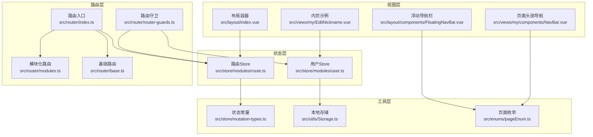
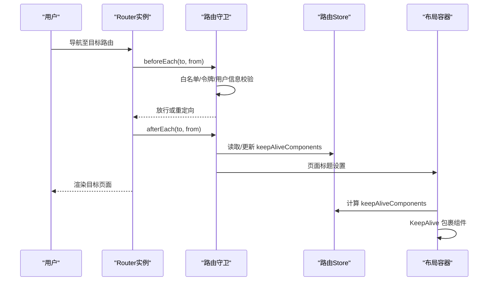
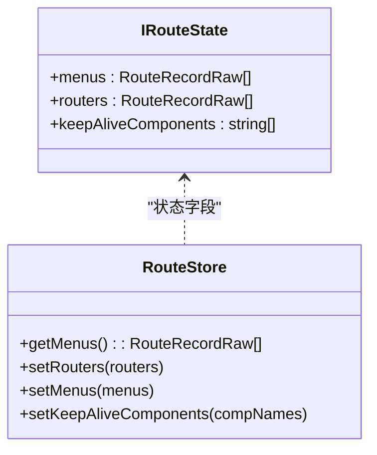
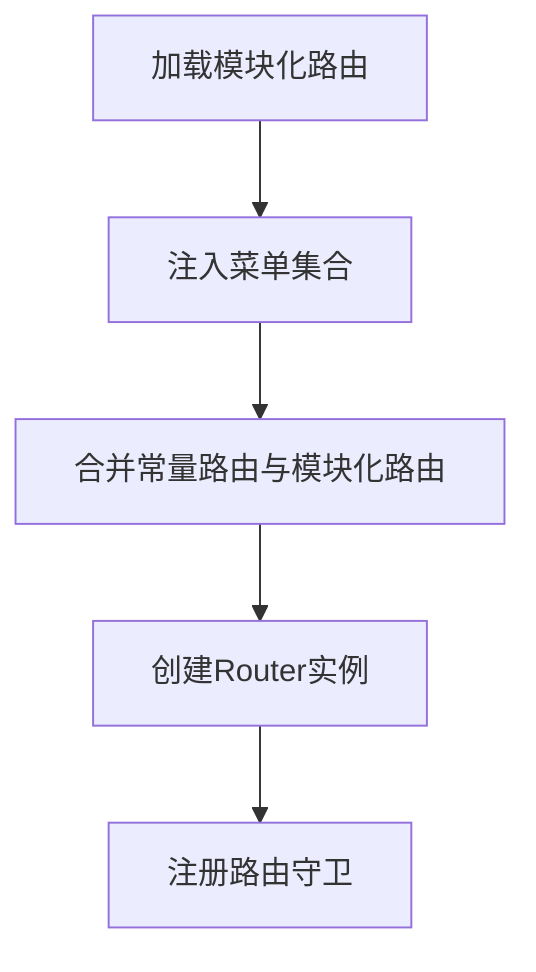
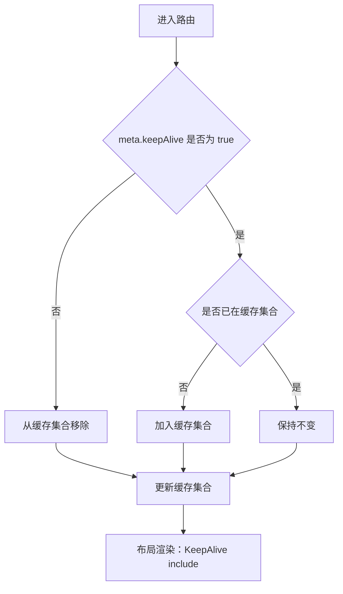
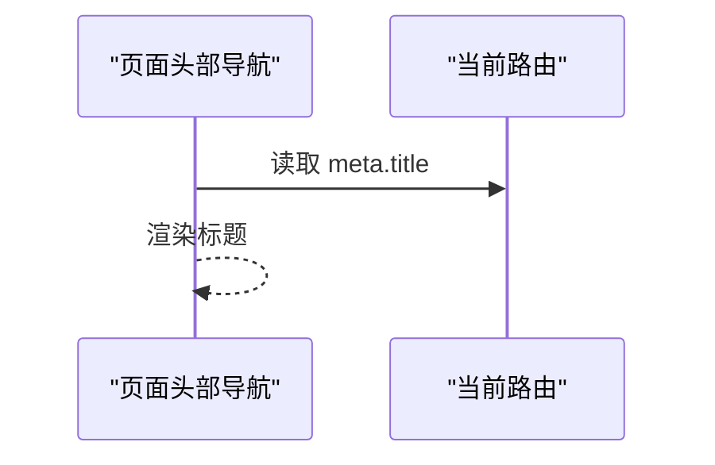
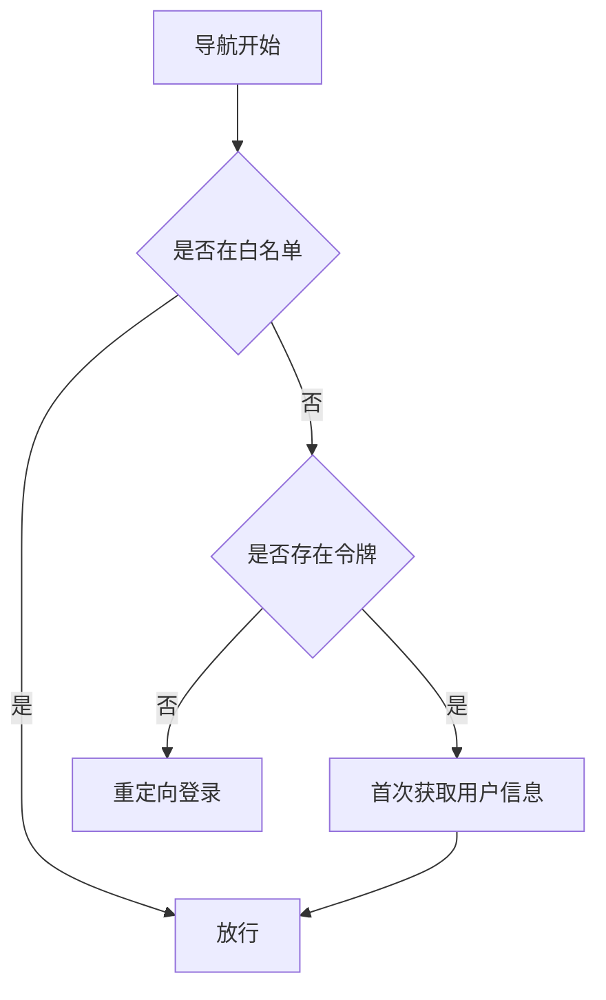
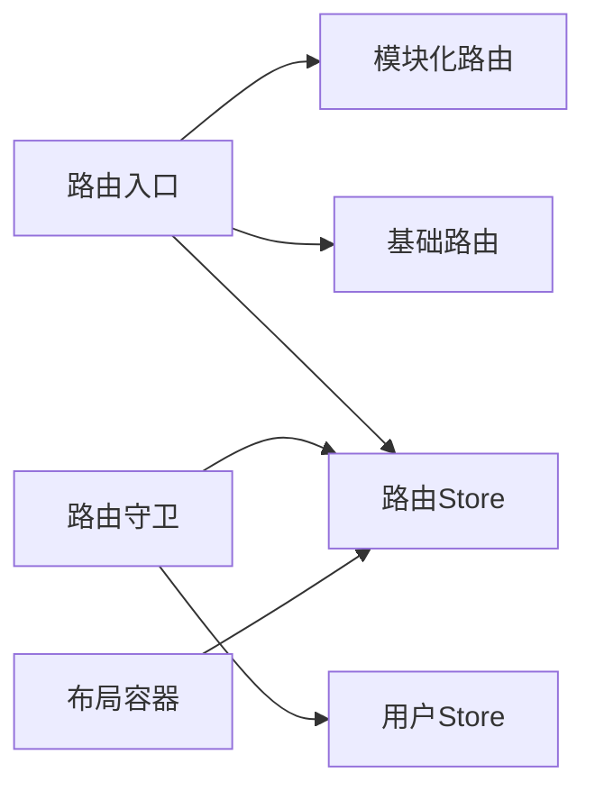

# 路由状态管理

<cite>
**本文引用的文件**
- [src/store/modules/route.ts](file://src/store/modules/route.ts)
- [src/router/index.ts](file://src/router/index.ts)
- [src/router/modules.ts](file://src/router/modules.ts)
- [src/router/base.ts](file://src/router/base.ts)
- [src/router/router-guards.ts](file://src/router/router-guards.ts)
- [src/layout/index.vue](file://src/layout/index.vue)
- [src/views/my/EditNickname.vue](file://src/views/my/EditNickname.vue)
- [src/store/modules/user.ts](file://src/store/modules/user.ts)
- [src/enums/pageEnum.ts](file://src/enums/pageEnum.ts)
- [src/utils/Storage.ts](file://src/utils/Storage.ts)
- [src/store/mutation-types.ts](file://src/store/mutation-types.ts)
- [src/layout/components/FloatingNavBar.vue](file://src/layout/components/FloatingNavBar.vue)
- [src/views/my/components/NavBar.vue](file://src/views/my/components/NavBar.vue)
</cite>

## 目录
1. [简介](#简介)
2. [项目结构](#项目结构)
3. [核心组件](#核心组件)
4. [架构总览](#架构总览)
5. [详细组件分析](#详细组件分析)
6. [依赖分析](#依赖分析)
7. [性能考虑](#性能考虑)
8. [故障排查指南](#故障排查指南)
9. [结论](#结论)
10. [附录](#附录)

## 简介
本文件系统性梳理并解析本项目的路由状态管理模块，重点覆盖以下方面：
- 路由Store设计与数据结构：菜单、路由集合、组件缓存集合
- 路由缓存机制：页面缓存、组件状态保存与恢复
- 面包屑导航状态：路径解析、层级关系与动态生成
- 权限控制与动态路由：菜单生成、权限校验与动态加载
- 路由状态持久化、序列化与性能优化策略
- 实际应用场景与代码示例路径指引

## 项目结构
围绕路由状态管理的关键文件组织如下：
- 状态层：Pinia Store中的路由模块与用户模块
- 路由层：路由定义、常量路由、模块化路由与路由守卫
- 视图层：布局容器、内嵌页面、导航栏等
- 工具层：本地存储封装、枚举与常量

**图表来源**
- [src/router/index.ts:1-33](file://src/router/index.ts#L1-L33)
- [src/router/modules.ts:1-147](file://src/router/modules.ts#L1-L147)
- [src/router/base.ts:1-54](file://src/router/base.ts#L1-L54)
- [src/router/router-guards.ts:1-93](file://src/router/router-guards.ts#L1-L93)
- [src/store/modules/route.ts:1-40](file://src/store/modules/route.ts#L1-L40)
- [src/store/modules/user.ts:1-115](file://src/store/modules/user.ts#L1-L115)
- [src/layout/index.vue:1-60](file://src/layout/index.vue#L1-L60)
- [src/views/my/EditNickname.vue:1-88](file://src/views/my/EditNickname.vue#L1-L88)
- [src/layout/components/FloatingNavBar.vue:1-281](file://src/layout/components/FloatingNavBar.vue#L1-L281)
- [src/views/my/components/NavBar.vue:1-23](file://src/views/my/components/NavBar.vue#L1-L23)
- [src/enums/pageEnum.ts:1-12](file://src/enums/pageEnum.ts#L1-L12)
- [src/utils/Storage.ts:1-128](file://src/utils/Storage.ts#L1-L128)
- [src/store/mutation-types.ts:1-4](file://src/store/mutation-types.ts#L1-L4)

**章节来源**
- [src/router/index.ts:1-33](file://src/router/index.ts#L1-L33)
- [src/router/modules.ts:1-147](file://src/router/modules.ts#L1-L147)
- [src/router/base.ts:1-54](file://src/router/base.ts#L1-L54)
- [src/store/modules/route.ts:1-40](file://src/store/modules/route.ts#L1-L40)

## 核心组件
- 路由Store（IRouteState）
  - 菜单集合：用于生成侧边/顶部导航
  - 路由集合：包含常量路由与模块化路由
  - 组件缓存集合：记录需要被KeepAlive缓存的组件名称
- 路由入口与初始化
  - 定义常量路由（登录、根路由、错误页）
  - 加载模块化路由并注入到Store
  - 创建Router实例并注册路由守卫
- 路由守卫
  - 导航前置守卫：白名单、令牌校验、用户信息拉取
  - 导航后置守卫：页面标题设置、组件缓存策略
- 布局容器
  - RouterView插槽中根据缓存集合决定是否使用KeepAlive
  - 提供浮动导航栏与页面头部导航

**章节来源**
- [src/store/modules/route.ts:5-39](file://src/store/modules/route.ts#L5-L39)
- [src/router/index.ts:11-33](file://src/router/index.ts#L11-L33)
- [src/router/router-guards.ts:17-92](file://src/router/router-guards.ts#L17-L92)
- [src/layout/index.vue:6-13](file://src/layout/index.vue#L6-L13)

## 架构总览
路由状态管理采用“状态驱动 + 路由守卫 + 布局渲染”的分层架构：
- 状态层：集中管理菜单、路由与缓存集合
- 路由层：统一定义与加载路由，通过守卫实现权限与缓存控制
- 视图层：在布局中消费状态，实现缓存与导航

**图表来源**
- [src/router/router-guards.ts:17-92](file://src/router/router-guards.ts#L17-L92)
- [src/store/modules/route.ts:29-32](file://src/store/modules/route.ts#L29-L32)
- [src/layout/index.vue:6-13](file://src/layout/index.vue#L6-L13)

## 详细组件分析

### 路由Store与数据结构
- IRouteState
  - menus：菜单树形结构，用于生成导航
  - routers：完整路由表（常量路由 + 模块化路由）
  - keepAliveComponents：组件名称数组，作为KeepAlive include列表
- Getter与Action
  - getMenus：返回菜单集合
  - setRouters/setMenus：写入路由与菜单
  - setKeepAliveComponents：写入组件缓存集合

**图表来源**
- [src/store/modules/route.ts:5-39](file://src/store/modules/route.ts#L5-L39)

**章节来源**
- [src/store/modules/route.ts:5-39](file://src/store/modules/route.ts#L5-L39)

### 路由定义与初始化
- 常量路由
  - 登录页、根路由、错误页
- 模块化路由
  - 主控台、图表、示例、我的等模块
  - 内嵌页面（如修改昵称）可配置keepAlive
- 初始化流程
  - 将模块化路由注入菜单与路由集合
  - 创建Router实例并注册守卫

**图表来源**
- [src/router/index.ts:11-33](file://src/router/index.ts#L11-L33)
- [src/router/modules.ts:5-147](file://src/router/modules.ts#L5-L147)
- [src/router/base.ts:6-44](file://src/router/base.ts#L6-L44)

**章节来源**
- [src/router/index.ts:11-33](file://src/router/index.ts#L11-L33)
- [src/router/modules.ts:5-147](file://src/router/modules.ts#L5-L147)
- [src/router/base.ts:6-44](file://src/router/base.ts#L6-L44)

### 路由缓存机制（页面缓存、组件状态保存与恢复）
- 缓存策略
  - 在afterEach中根据路由meta.keepAlive决定是否加入/移除缓存集合
  - 在布局中以KeepAlive include方式包裹RouterView
- 状态流转
  - 进入页面：若meta.keepAlive为true且不在集合中则加入
  - 离开页面：若meta.keepAlive为false则从集合中移除
- 示例页面
  - 修改昵称页面配置了keepAlive，适合演示缓存效果

**图表来源**
- [src/router/router-guards.ts:62-86](file://src/router/router-guards.ts#L62-L86)
- [src/layout/index.vue:6-13](file://src/layout/index.vue#L6-L13)
- [src/router/modules.ts:99-107](file://src/router/modules.ts#L99-L107)

**章节来源**
- [src/router/router-guards.ts:62-86](file://src/router/router-guards.ts#L62-L86)
- [src/layout/index.vue:6-13](file://src/layout/index.vue#L6-L13)
- [src/router/modules.ts:99-107](file://src/router/modules.ts#L99-L107)

### 面包屑导航状态管理（路径解析、层级关系维护与动态生成）
- 路径解析
  - 通过路由matched链路解析层级关系
  - 使用meta.title作为节点显示文本
- 层级关系
  - Layout作为父容器，子路由构成层级
  - 内嵌页面（innerPage）可独立展示标题
- 动态生成
  - 页面头部导航组件读取当前路由meta.title
  - 浮动导航栏根据当前路径高亮对应按钮

**图表来源**
- [src/views/my/components/NavBar.vue:15-20](file://src/views/my/components/NavBar.vue#L15-L20)
- [src/layout/components/FloatingNavBar.vue:196-220](file://src/layout/components/FloatingNavBar.vue#L196-L220)

**章节来源**
- [src/views/my/components/NavBar.vue:15-20](file://src/views/my/components/NavBar.vue#L15-L20)
- [src/layout/components/FloatingNavBar.vue:196-220](file://src/layout/components/FloatingNavBar.vue#L196-L220)

### 路由权限控制与动态路由加载
- 权限验证
  - 白名单放行（登录页）
  - 令牌校验：无令牌跳转登录
  - 首次进入拉取用户信息并缓存
- 动态路由加载
  - 模块化路由在应用启动时注入菜单与路由集合
  - 可扩展为基于用户角色动态拼装路由

**图表来源**
- [src/router/router-guards.ts:17-51](file://src/router/router-guards.ts#L17-L51)
- [src/store/modules/user.ts:79-90](file://src/store/modules/user.ts#L79-L90)
- [src/store/mutation-types.ts:1-4](file://src/store/mutation-types.ts#L1-L4)
- [src/utils/Storage.ts:1-128](file://src/utils/Storage.ts#L1-L128)

**章节来源**
- [src/router/router-guards.ts:17-51](file://src/router/router-guards.ts#L17-L51)
- [src/store/modules/user.ts:79-90](file://src/store/modules/user.ts#L79-L90)
- [src/store/mutation-types.ts:1-4](file://src/store/mutation-types.ts#L1-L4)
- [src/utils/Storage.ts:1-128](file://src/utils/Storage.ts#L1-L128)

### 路由状态持久化、序列化与性能优化
- 持久化与序列化
  - 用户信息与令牌通过本地存储封装进行序列化存储
  - 存储对象支持过期时间与Cookie操作
- 性能优化
  - 路由缓存按需开启，避免不必要的KeepAlive
  - 进度条与导航失败处理减少异常开销
  - 页面标题在afterEach统一设置，避免重复计算

**章节来源**
- [src/utils/Storage.ts:27-57](file://src/utils/Storage.ts#L27-L57)
- [src/router/router-guards.ts:54-92](file://src/router/router-guards.ts#L54-L92)

## 依赖分析
- 路由入口依赖模块化路由与基础路由，并向Store注入菜单与路由
- 路由守卫依赖用户Store与路由Store，实现权限与缓存控制
- 布局容器依赖路由Store，实现缓存集合的响应式渲染

**图表来源**
- [src/router/index.ts:11-33](file://src/router/index.ts#L11-L33)
- [src/router/router-guards.ts:17-92](file://src/router/router-guards.ts#L17-L92)
- [src/layout/index.vue:6-13](file://src/layout/index.vue#L6-L13)

**章节来源**
- [src/router/index.ts:11-33](file://src/router/index.ts#L11-L33)
- [src/router/router-guards.ts:17-92](file://src/router/router-guards.ts#L17-L92)
- [src/layout/index.vue:6-13](file://src/layout/index.vue#L6-L13)

## 性能考虑
- 路由缓存粒度控制：仅对必要页面启用keepAlive，降低内存占用
- 导航守卫轻量化：避免在beforeEach中执行重型逻辑
- 标题设置与进度条：统一在afterEach处理，减少重复渲染
- 响应式依赖最小化：布局中仅依赖keepAliveComponents计算属性

## 故障排查指南
- 导航失败
  - 使用isNavigationFailure判断失败类型并记录日志
- 缓存异常
  - 检查路由meta.keepAlive配置与afterEach中的缓存集合更新
- 权限问题
  - 核对白名单、令牌存储与用户信息拉取流程
- 页面标题未更新
  - 确认afterEach中document.title设置逻辑

**章节来源**
- [src/router/router-guards.ts:58-92](file://src/router/router-guards.ts#L58-L92)

## 结论
本路由状态管理模块通过Pinia集中管理菜单、路由与缓存集合，结合路由守卫实现权限控制与缓存策略，在布局层以KeepAlive实现组件状态的保存与恢复。模块化路由便于扩展与维护，配合本地存储实现关键状态的持久化。整体架构清晰、职责分离明确，具备良好的可扩展性与可维护性。

## 附录
- 实际应用场景示例
  - 修改昵称页面：演示keepAlive配置与状态恢复
  - 页面头部导航：演示meta.title动态渲染
  - 浮动导航栏：演示当前路径高亮与点击导航
- 关键代码示例路径
  - [路由Store定义:11-39](file://src/store/modules/route.ts#L11-L39)
  - [路由入口与初始化:11-33](file://src/router/index.ts#L11-L33)
  - [模块化路由定义:5-147](file://src/router/modules.ts#L5-L147)
  - [基础路由定义:6-44](file://src/router/base.ts#L6-L44)
  - [路由守卫实现:17-92](file://src/router/router-guards.ts#L17-L92)
  - [布局容器与缓存渲染:6-13](file://src/layout/index.vue#L6-L13)
  - [内页示例（含keepAlive）:99-107](file://src/router/modules.ts#L99-L107)
  - [页面头部导航标题读取:15-20](file://src/views/my/components/NavBar.vue#L15-L20)
  - [浮动导航栏点击与高亮:196-220](file://src/layout/components/FloatingNavBar.vue#L196-L220)
  - [用户信息与令牌存储:79-90](file://src/store/modules/user.ts#L79-L90)
  - [本地存储封装:27-57](file://src/utils/Storage.ts#L27-L57)