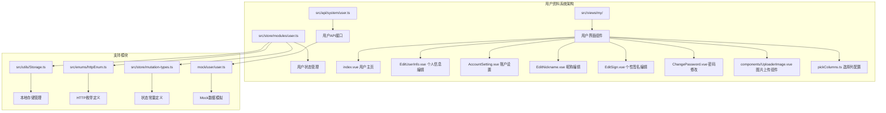
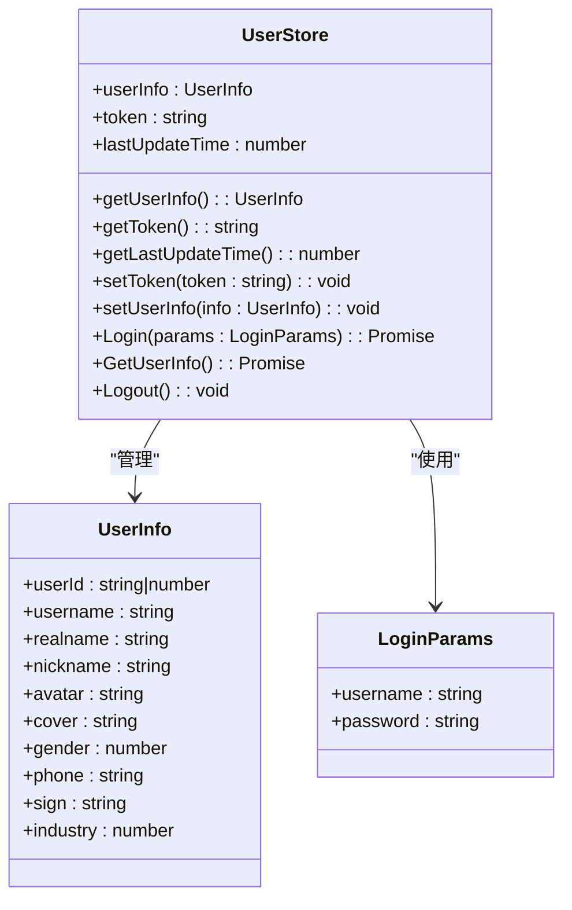
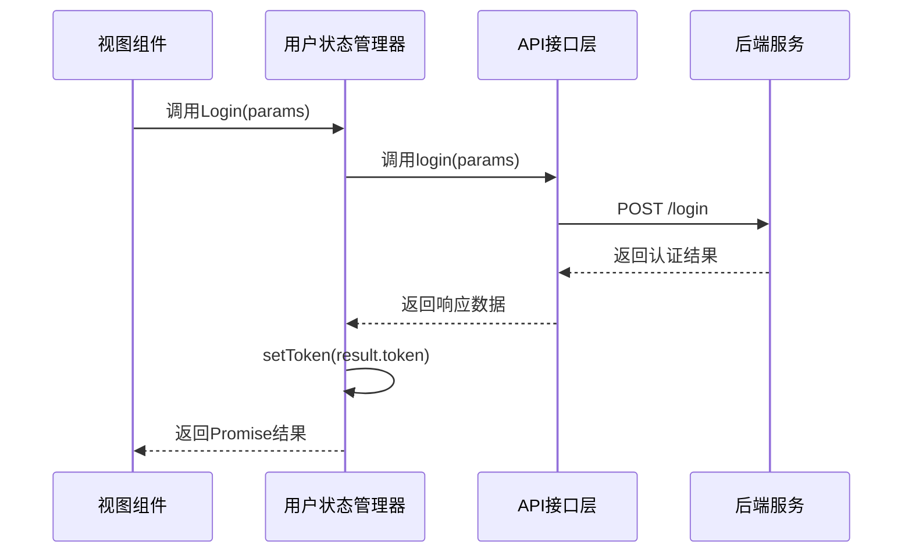
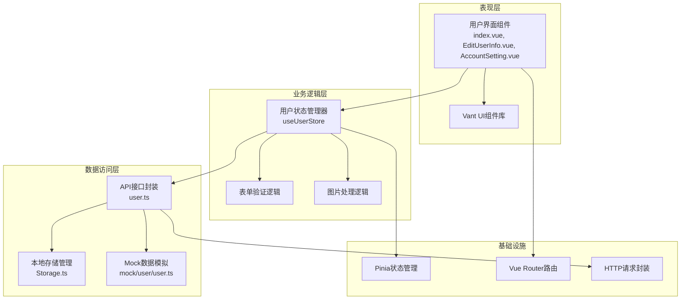
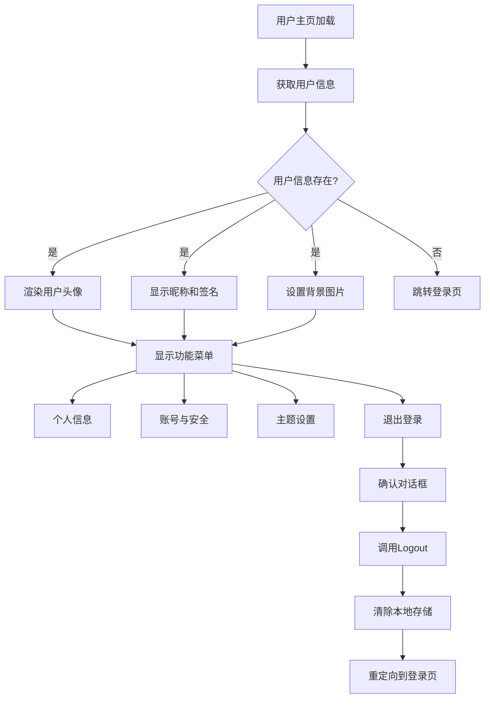
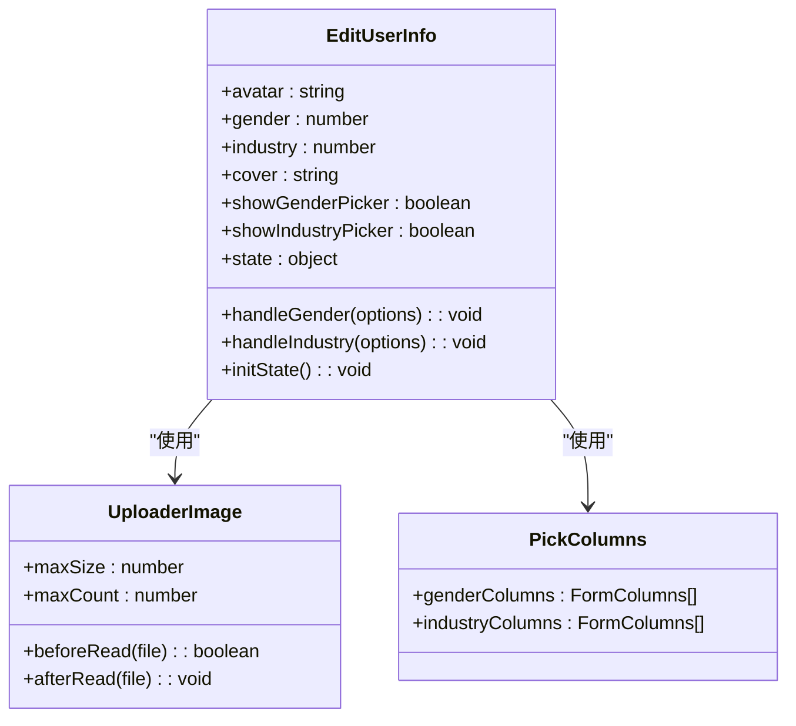
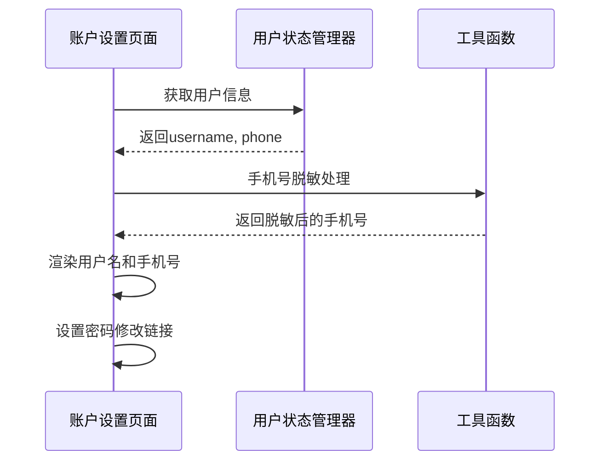
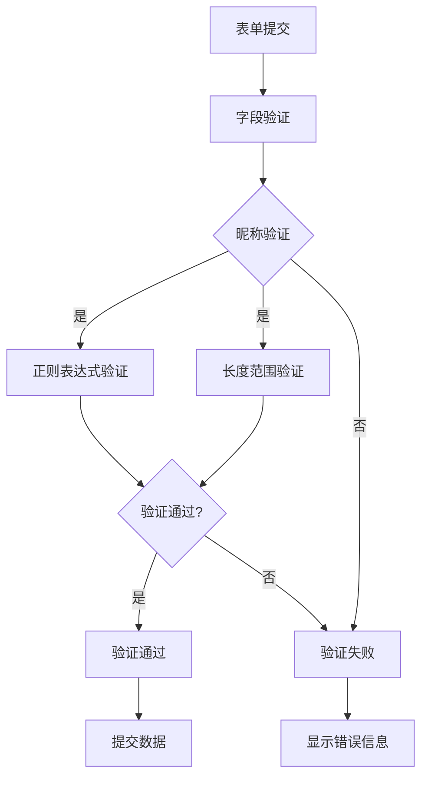
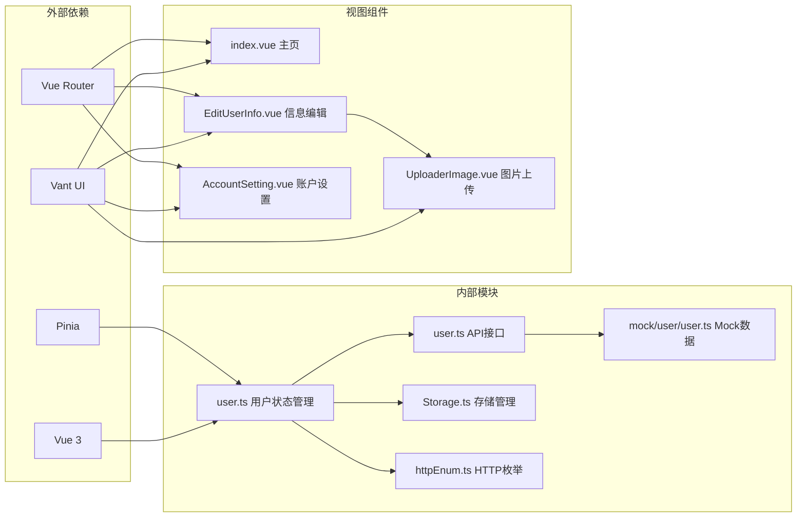

# 用户资料系统

<cite>
**本文档引用的文件**
- [src/store/modules/user.ts](file://src/store/modules/user.ts)
- [src/api/system/user.ts](file://src/api/system/user.ts)
- [src/views/my/index.vue](file://src/views/my/index.vue)
- [src/views/my/EditUserInfo.vue](file://src/views/my/EditUserInfo.vue)
- [src/views/my/AccountSetting.vue](file://src/views/my/AccountSetting.vue)
- [src/views/my/components/UploaderImage.vue](file://src/views/my/components/UploaderImage.vue)
- [src/views/my/pickColumns.ts](file://src/views/my/pickColumns.ts)
- [src/views/my/EditNickname.vue](file://src/views/my/EditNickname.vue)
- [src/views/my/EditSign.vue](file://src/views/my/EditSign.vue)
- [src/views/my/ChangePassword.vue](file://src/views/my/ChangePassword.vue)
- [src/store/mutation-types.ts](file://src/store/mutation-types.ts)
- [src/enums/httpEnum.ts](file://src/enums/httpEnum.ts)
- [src/utils/Storage.ts](file://src/utils/Storage.ts)
- [src/router/index.ts](file://src/router/index.ts)
- [mock/user/user.ts](file://mock/user/user.ts)
</cite>

## 目录
1. [简介](#简介)
2. [项目结构](#项目结构)
3. [核心组件](#核心组件)
4. [架构概览](#架构概览)
5. [详细组件分析](#详细组件分析)
6. [依赖关系分析](#依赖关系分析)
7. [性能考虑](#性能考虑)
8. [故障排除指南](#故障排除指南)
9. [结论](#结论)

## 简介

用户资料系统是基于Vue3和Vant UI框架构建的微信H5应用中的核心功能模块。该系统提供了完整的用户身份认证、个人资料管理、账户设置等功能，采用Pinia状态管理和Vite开发环境，支持Mock数据模拟和真实API集成。

系统主要包含以下核心功能：
- 用户登录认证与会话管理
- 个人资料展示与编辑
- 账户安全设置
- 头像上传与图片处理
- 密码修改功能
- 主题设置与个性化配置

## 项目结构

用户资料系统在项目中采用模块化组织方式，主要分布在以下几个目录：

**图表来源**
- [src/store/modules/user.ts:1-115](file://src/store/modules/user.ts#L1-L115)
- [src/views/my/index.vue:1-145](file://src/views/my/index.vue#L1-L145)

**章节来源**
- [src/store/modules/user.ts:1-115](file://src/store/modules/user.ts#L1-L115)
- [src/views/my/index.vue:1-145](file://src/views/my/index.vue#L1-L145)

## 核心组件

### 用户状态管理器

用户状态管理器是整个系统的核心，基于Pinia实现，负责管理用户认证状态、个人信息和会话持久化。

**图表来源**
- [src/store/modules/user.ts:12-29](file://src/store/modules/user.ts#L12-L29)
- [src/store/modules/user.ts:36-109](file://src/store/modules/user.ts#L36-L109)

### API接口层

系统提供统一的用户相关API接口，包括登录、获取用户信息、登出等核心功能。

**图表来源**
- [src/store/modules/user.ts:64-77](file://src/store/modules/user.ts#L64-L77)
- [src/api/system/user.ts:12-23](file://src/api/system/user.ts#L12-L23)

**章节来源**
- [src/store/modules/user.ts:12-109](file://src/store/modules/user.ts#L12-L109)
- [src/api/system/user.ts:1-60](file://src/api/system/user.ts#L1-L60)

## 架构概览

用户资料系统采用分层架构设计，确保各层职责清晰、耦合度低：

**图表来源**
- [src/views/my/index.vue:65-88](file://src/views/my/index.vue#L65-L88)
- [src/store/modules/user.ts:36-109](file://src/store/modules/user.ts#L36-L109)

## 详细组件分析

### 用户主页组件

用户主页是个人资料系统的主要入口，提供用户信息展示和功能导航。

**图表来源**
- [src/views/my/index.vue:65-88](file://src/views/my/index.vue#L65-L88)
- [src/views/my/index.vue:72-87](file://src/views/my/index.vue#L72-L87)

**章节来源**
- [src/views/my/index.vue:1-145](file://src/views/my/index.vue#L1-L145)

### 个人信息编辑组件

个人信息编辑组件提供完整的用户资料修改功能，包括基础信息、头像上传、性别选择等。

**图表来源**
- [src/views/my/EditUserInfo.vue:114-170](file://src/views/my/EditUserInfo.vue#L114-L170)
- [src/views/my/components/UploaderImage.vue:15-30](file://src/views/my/components/UploaderImage.vue#L15-L30)
- [src/views/my/pickColumns.ts:1-31](file://src/views/my/pickColumns.ts#L1-L31)

**章节来源**
- [src/views/my/EditUserInfo.vue:1-183](file://src/views/my/EditUserInfo.vue#L1-L183)
- [src/views/my/components/UploaderImage.vue:1-33](file://src/views/my/components/UploaderImage.vue#L1-L33)
- [src/views/my/pickColumns.ts:1-31](file://src/views/my/pickColumns.ts#L1-L31)

### 账户设置组件

账户设置组件提供用户基本信息展示和安全设置入口。

**图表来源**
- [src/views/my/AccountSetting.vue:36-49](file://src/views/my/AccountSetting.vue#L36-L49)
- [src/views/my/AccountSetting.vue:43-48](file://src/views/my/AccountSetting.vue#L43-L48)

**章节来源**
- [src/views/my/AccountSetting.vue:1-56](file://src/views/my/AccountSetting.vue#L1-L56)

### 表单验证系统

系统实现了完善的表单验证机制，确保用户输入数据的准确性和安全性。

**图表来源**
- [src/views/my/EditNickname.vue:45-56](file://src/views/my/EditNickname.vue#L45-L56)
- [src/views/my/EditSign.vue:8-22](file://src/views/my/EditSign.vue#L8-L22)

**章节来源**
- [src/views/my/EditNickname.vue:1-88](file://src/views/my/EditNickname.vue#L1-L88)
- [src/views/my/EditSign.vue:1-69](file://src/views/my/EditSign.vue#L1-L69)

## 依赖关系分析

用户资料系统的依赖关系呈现清晰的层次化结构：

**图表来源**
- [src/store/modules/user.ts:1-115](file://src/store/modules/user.ts#L1-L115)
- [src/api/system/user.ts:1-60](file://src/api/system/user.ts#L1-L60)
- [src/views/my/index.vue:1-145](file://src/views/my/index.vue#L1-L145)

**章节来源**
- [src/store/modules/user.ts:1-115](file://src/store/modules/user.ts#L1-L115)
- [src/api/system/user.ts:1-60](file://src/api/system/user.ts#L1-L60)

## 性能考虑

用户资料系统在性能优化方面采用了多项策略：

### 状态管理优化
- 使用Pinia替代Vuex，减少包体积和提升性能
- 实现状态持久化，避免页面刷新后重新请求数据
- 采用计算属性缓存，减少不必要的重新渲染

### 图片处理优化
- 限制图片大小和数量，提升上传效率
- 支持多种图片格式，确保兼容性
- 实现图片预览和压缩功能

### 网络请求优化
- 统一的HTTP请求封装，支持拦截器和错误处理
- Mock数据支持，便于开发和测试
- 请求超时和重试机制

## 故障排除指南

### 常见问题及解决方案

**用户信息无法加载**
- 检查Token是否有效
- 验证网络连接状态
- 确认后端服务正常运行

**图片上传失败**
- 检查文件格式是否正确
- 验证文件大小限制
- 确认服务器存储权限

**登录认证异常**
- 检查用户名密码是否正确
- 验证Token过期时间
- 确认用户状态同步

**章节来源**
- [src/store/modules/user.ts:92-107](file://src/store/modules/user.ts#L92-L107)
- [src/views/my/components/UploaderImage.vue:18-24](file://src/views/my/components/UploaderImage.vue#L18-L24)

## 结论

用户资料系统是一个功能完整、架构清晰的Vue3应用模块。系统采用现代化的技术栈，实现了良好的用户体验和代码可维护性。主要特点包括：

1. **模块化设计**：清晰的分层架构，职责分离明确
2. **状态管理**：基于Pinia的状态管理，性能优异
3. **组件化开发**：可复用的组件设计，提升开发效率
4. **完善的验证**：前后端双重验证机制，确保数据安全
5. **Mock支持**：完整的Mock数据体系，便于开发测试

系统为后续的功能扩展奠定了良好的基础，可以轻松添加新的用户功能和个性化设置。