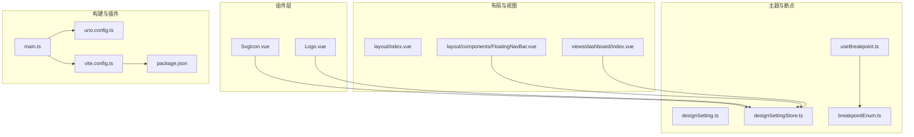
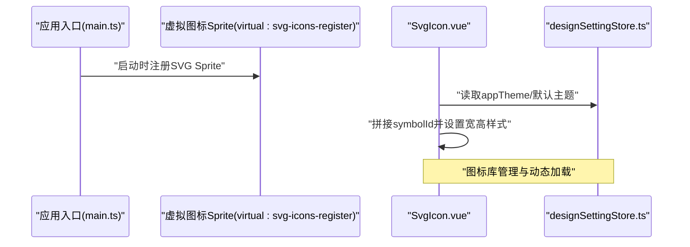
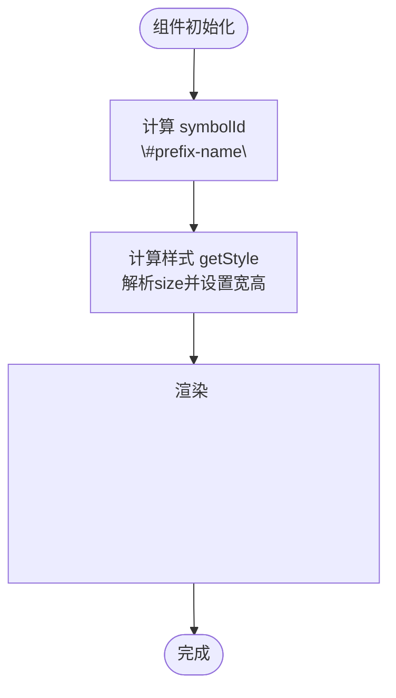
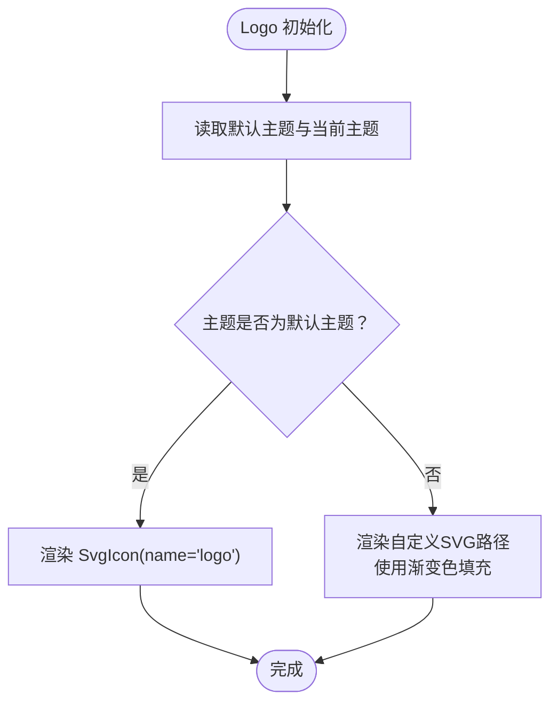
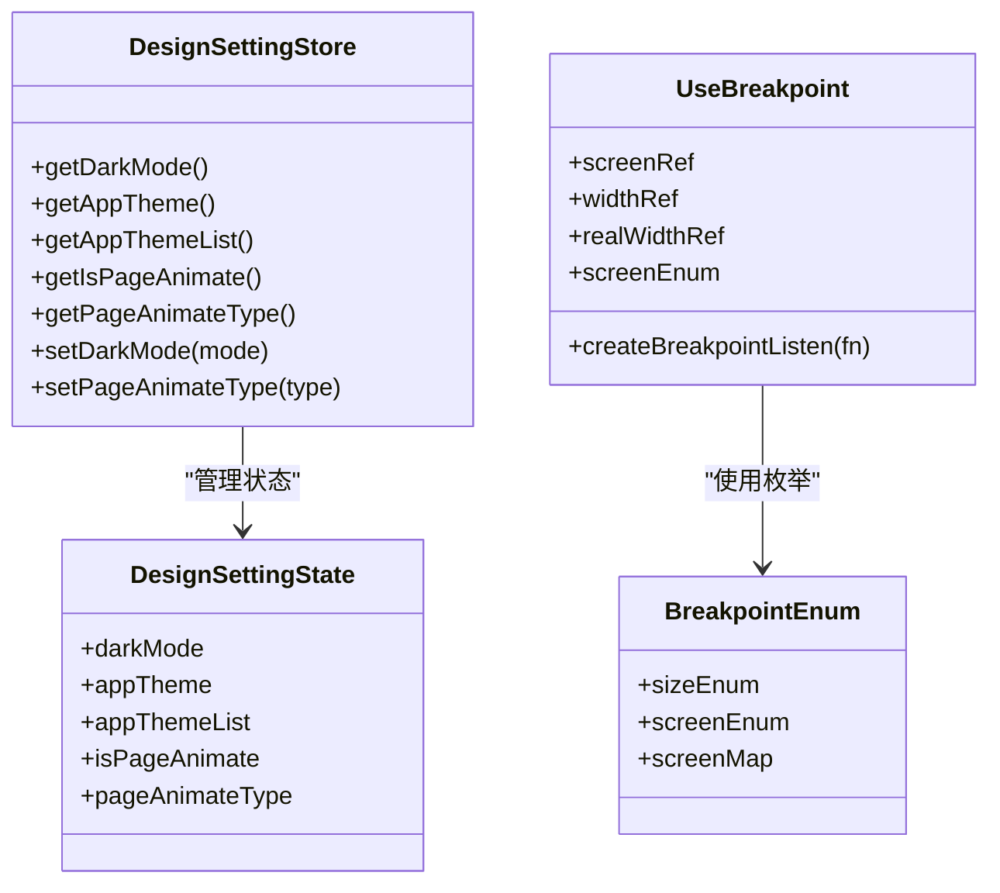
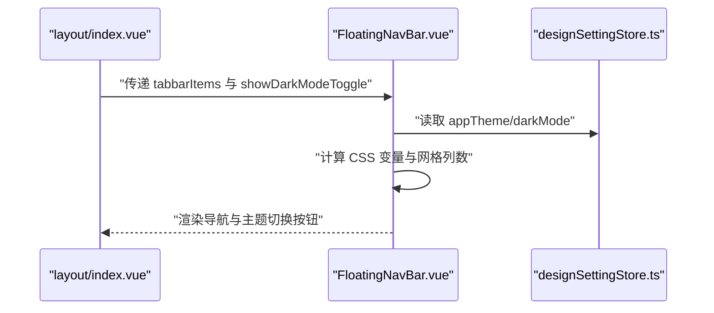
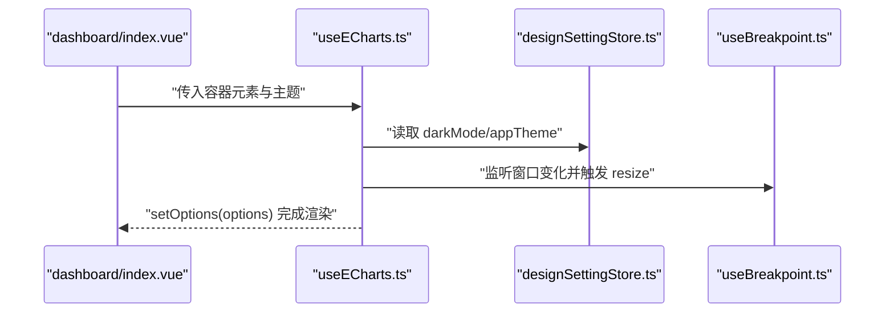
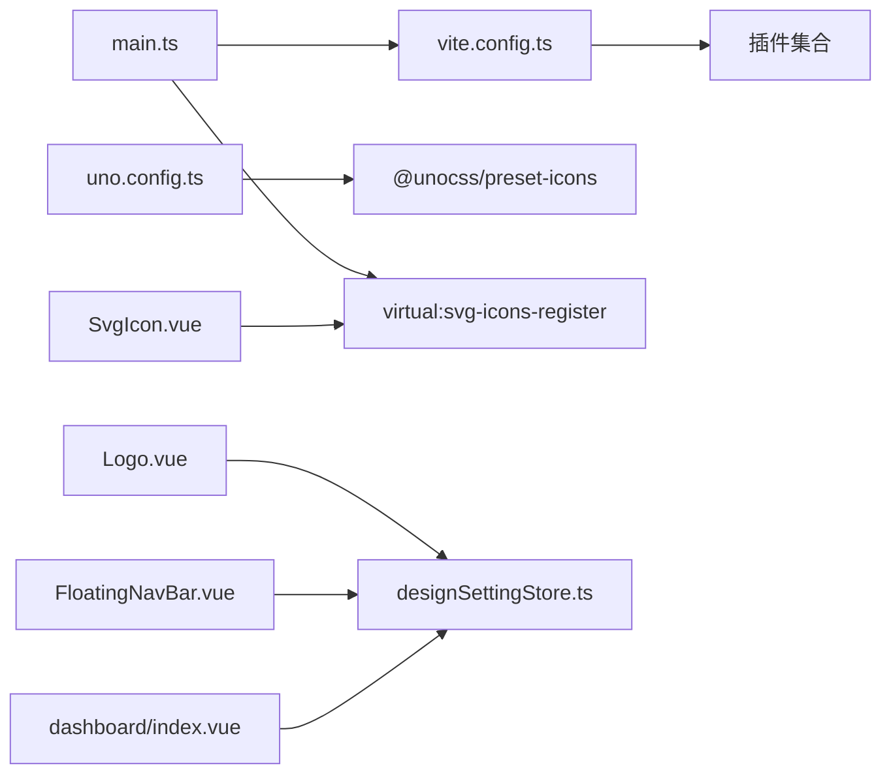

# 组件库系统

<cite>
**本文引用的文件**
- [SvgIcon.vue](file://src/components/SvgIcon.vue)
- [Logo.vue](file://src/components/Logo.vue)
- [designSetting.ts](file://src/settings/designSetting.ts)
- [designSettingStore.ts](file://src/store/modules/designSetting.ts)
- [useBreakpoint.ts](file://src/hooks/event/useBreakpoint.ts)
- [breakpointEnum.ts](file://src/enums/breakpointEnum.ts)
- [useECharts.ts](file://src/hooks/web/useECharts.ts)
- [FloatingNavBar.vue](file://src/layout/components/FloatingNavBar.vue)
- [index.vue](file://src/layout/index.vue)
- [dashboard/index.vue](file://src/views/dashboard/index.vue)
- [main.ts](file://src/main.ts)
- [uno.config.ts](file://uno.config.ts)
- [vite.config.ts](file://vite.config.ts)
- [package.json](file://package.json)
</cite>

## 目录
1. [简介](#简介)
2. [项目结构](#项目结构)
3. [核心组件](#核心组件)
4. [架构总览](#架构总览)
5. [组件详解](#组件详解)
6. [依赖关系分析](#依赖关系分析)
7. [性能考量](#性能考量)
8. [故障排查指南](#故障排查指南)
9. [结论](#结论)
10. [附录](#附录)

## 简介
本组件库系统围绕“单一职责、可复用性、可扩展性”三大设计原则构建，重点包含 SVG 图标组件与 Logo 组件两大核心模块。通过统一的主题与断点体系，实现跨平台、跨主题的一致体验；借助 Vite 插件生态与 UnoCSS 原子化工具链，确保图标资源的高效加载与样式一致性。

## 项目结构
项目采用“按功能域组织”的目录结构，组件集中在 src/components 下，主题与断点逻辑位于 src/settings 与 src/hooks，状态管理通过 Pinia Store 提供，构建与插件由 Vite 配置统一管理。

**图示来源**
- [main.ts:11-12](file://src/main.ts#L11-L12)
- [uno.config.ts:8](file://uno.config.ts#L8)
- [vite.config.ts:180](file://vite.config.ts#L180)
- [package.json:102](file://package.json#L102)

**章节来源**
- [main.ts:11-12](file://src/main.ts#L11-L12)
- [uno.config.ts:8](file://uno.config.ts#L8)
- [vite.config.ts:180](file://vite.config.ts#L180)
- [package.json:102](file://package.json#L102)

## 核心组件
- SvgIcon：基于 SVG Symbol 的轻量图标组件，支持前缀、名称、尺寸与颜色的统一配置，便于图标库集中管理与动态渲染。
- Logo：根据主题状态选择 SVG 图标或内联矢量图形，实现主题色渐变与响应式展示，兼顾可读性与可扩展性。

**章节来源**
- [SvgIcon.vue:12-36](file://src/components/SvgIcon.vue#L12-L36)
- [Logo.vue:1-52](file://src/components/Logo.vue#L1-L52)

## 架构总览
组件库通过以下路径协同工作：
- 图标加载：Vite 插件注册 SVG Sprite，运行时通过 <use xlink:href="#prefix-name"> 动态定位符号。
- 主题适配：Pinia Store 维护 appTheme 与 darkMode，组件读取并驱动样式与渐变。
- 响应式断点：统一断点枚举与监听器，为布局与图表等组件提供一致的屏幕状态。

**图示来源**
- [main.ts:11-12](file://src/main.ts#L11-L12)
- [SvgIcon.vue:26-36](file://src/components/SvgIcon.vue#L26-L36)
- [designSettingStore.ts:16-32](file://src/store/modules/designSetting.ts#L16-L32)

## 组件详解

### SvgIcon 组件
- 设计原则
  - 单一职责：仅负责根据传入参数渲染 SVG 符号，不承担主题切换逻辑。
  - 可复用性：通过 prefix 与 name 组合形成稳定标识，配合 Sprite 实现集中管理。
  - 可扩展性：支持 size/color 透传，便于在不同上下文中复用。
- 关键实现要点
  - Props 默认值：prefix 默认为 icon，size 默认 16，color 默认 #333。
  - 计算属性 symbolId：形如 "#prefix-name"，与 Sprite 中符号 ID 对齐。
  - 计算样式 getStyle：将 size 转换为像素并同时设置宽高。
- 使用建议
  - 在父组件中统一传入 size 与 color，减少重复配置。
  - 保持 prefix 与命名规范一致，便于图标库维护。

**图示来源**
- [SvgIcon.vue:26-36](file://src/components/SvgIcon.vue#L26-L36)

**章节来源**
- [SvgIcon.vue:12-36](file://src/components/SvgIcon.vue#L12-L36)

### Logo 组件
- 设计理念
  - 响应式设计：根据主题状态切换内置 SVG 或外部图标，保证在浅色/深色模式下的可读性。
  - 多平台适配：通过渐变色与矢量路径适配移动端与桌面端，避免位图模糊。
  - 主题适配：利用 hexToRgba 将主题色转换为带透明度的渐变，实现柔和过渡。
- 关键实现要点
  - 读取设计存储：defaultAppTheme 与 designStore.getAppTheme。
  - 渐变生成：通过多个线性渐变组合形成层次感。
  - 与主题联动：当主题变化时，Logo 内部路径填充色随之更新。
- 使用建议
  - 在导航栏或页首区域统一使用，保持品牌一致性。
  - 与断点监听结合，控制在窄屏下的尺寸与布局。

**图示来源**
- [Logo.vue:3-41](file://src/components/Logo.vue#L3-L41)
- [designSetting.ts:16-36](file://src/settings/designSetting.ts#L16-L36)
- [designSettingStore.ts:16-32](file://src/store/modules/designSetting.ts#L16-L32)

**章节来源**
- [Logo.vue:1-52](file://src/components/Logo.vue#L1-L52)
- [designSetting.ts:16-36](file://src/settings/designSetting.ts#L16-L36)
- [designSettingStore.ts:16-32](file://src/store/modules/designSetting.ts#L16-L32)

### 主题与断点体系
- 主题配置
  - 设计设置包含 darkMode、appTheme、appThemeList、页面动画开关与类型。
  - Store 提供 getter/setter，支持持久化至 localStorage。
- 断点监听
  - 枚举 sizeEnum 与 screenEnum 定义断点阈值。
  - useBreakpoint 提供 screenRef、widthRef、realWidthRef 与回调，便于组件按屏幕状态调整行为。

**图示来源**
- [designSetting.ts:3-14](file://src/settings/designSetting.ts#L3-L14)
- [designSettingStore.ts:8-46](file://src/store/modules/designSetting.ts#L8-L46)
- [breakpointEnum.ts:1-29](file://src/enums/breakpointEnum.ts#L1-L29)
- [useBreakpoint.ts:19-95](file://src/hooks/event/useBreakpoint.ts#L19-L95)

**章节来源**
- [designSetting.ts:3-14](file://src/settings/designSetting.ts#L3-L14)
- [designSettingStore.ts:8-46](file://src/store/modules/designSetting.ts#L8-L46)
- [breakpointEnum.ts:1-29](file://src/enums/breakpointEnum.ts#L1-L29)
- [useBreakpoint.ts:19-95](file://src/hooks/event/useBreakpoint.ts#L19-L95)

### 布局与导航中的组件集成
- 浮动导航栏
  - 接收 items 与 showDarkModeToggle，内部维护活动指示器位置与主题切换动画。
  - 通过 designStore 与 useDark 同步深浅色状态，CSS 变量驱动视觉风格。
- 布局壳
  - 根据 designStore.darkMode 切换暗色类，承载路由视图与浮动导航栏。

**图示来源**
- [index.vue:43-48](file://src/layout/index.vue#L43-L48)
- [FloatingNavBar.vue:79-86](file://src/layout/components/FloatingNavBar.vue#L79-L86)
- [FloatingNavBar.vue:118-132](file://src/layout/components/FloatingNavBar.vue#L118-L132)
- [designSettingStore.ts:16-32](file://src/store/modules/designSetting.ts#L16-L32)

**章节来源**
- [index.vue:43-48](file://src/layout/index.vue#L43-L48)
- [FloatingNavBar.vue:79-86](file://src/layout/components/FloatingNavBar.vue#L79-L86)
- [FloatingNavBar.vue:118-132](file://src/layout/components/FloatingNavBar.vue#L118-L132)
- [designSettingStore.ts:16-32](file://src/store/modules/designSetting.ts#L16-L32)

### 图表组件与主题联动
- useECharts
  - 依据 theme 或 designStore.getDarkMode 决定图表主题，提供 setOptions、resize、getInstance 等能力。
  - 结合断点监听与防抖，确保在窗口变化与主题切换时正确重绘。

**图示来源**
- [dashboard/index.vue:40-75](file://src/views/dashboard/index.vue#L40-L75)
- [useECharts.ts:14-122](file://src/hooks/web/useECharts.ts#L14-L122)
- [designSettingStore.ts:16-32](file://src/store/modules/designSetting.ts#L16-L32)
- [useBreakpoint.ts:53-58](file://src/hooks/event/useBreakpoint.ts#L53-L58)

**章节来源**
- [dashboard/index.vue:40-75](file://src/views/dashboard/index.vue#L40-L75)
- [useECharts.ts:14-122](file://src/hooks/web/useECharts.ts#L14-L122)
- [designSettingStore.ts:16-32](file://src/store/modules/designSetting.ts#L16-L32)
- [useBreakpoint.ts:53-58](file://src/hooks/event/useBreakpoint.ts#L53-L58)

## 依赖关系分析
- 图标加载链路
  - main.ts 通过 virtual:svg-icons-register 注册 SVG Sprite。
  - SvgIcon 通过 symbolId 动态指向 Sprite 中的符号。
- 主题与组件耦合
  - Logo、FloatingNavBar、dashboard/index.vue 均依赖 designSettingStore 获取 appTheme 与 darkMode。
- 构建与插件
  - vite.config.ts 加载插件集合，uno.config.ts 配置图标预设与 safelist，确保运行时图标可用。

**图示来源**
- [main.ts:11-12](file://src/main.ts#L11-L12)
- [vite.config.ts:180](file://vite.config.ts#L180)
- [uno.config.ts:28-34](file://uno.config.ts#L28-L34)
- [SvgIcon.vue:26-36](file://src/components/SvgIcon.vue#L26-L36)
- [designSettingStore.ts:16-32](file://src/store/modules/designSetting.ts#L16-L32)

**章节来源**
- [main.ts:11-12](file://src/main.ts#L11-L12)
- [vite.config.ts:180](file://vite.config.ts#L180)
- [uno.config.ts:28-34](file://uno.config.ts#L28-L34)
- [SvgIcon.vue:26-36](file://src/components/SvgIcon.vue#L26-L36)
- [designSettingStore.ts:16-32](file://src/store/modules/designSetting.ts#L16-L32)

## 性能考量
- 图标加载
  - 使用 Sprite 集中管理，避免重复请求与 DOM 数量膨胀。
  - 通过虚拟模块注册，构建期优化资源体积。
- 主题切换
  - Store 状态持久化，减少重复计算与重绘。
  - useECharts 在主题切换时 dispose 并重建实例，确保样式一致性。
- 响应式与重绘
  - useBreakpoint 使用防抖与 ResizeObserver，降低频繁重排风险。

[本节为通用指导，无需特定文件来源]

## 故障排查指南
- 图标不显示
  - 检查 main.ts 是否注册 virtual:svg-icons-register。
  - 确认 SvgIcon 的 prefix 与 name 与 Sprite 中符号一致。
- 主题色未生效
  - 核对 designSettingStore 的 appTheme 与设计设置是否正确。
  - 检查 CSS 变量与渐变色生成逻辑。
- 导航栏指示器异常
  - 确认 FloatingNavBar 的 activeNavIndex 计算与 ResizeObserver 绑定。
- 图表主题错乱
  - 确保 useECharts 在主题切换时重新初始化并 setOptions。

**章节来源**
- [main.ts:11-12](file://src/main.ts#L11-L12)
- [designSettingStore.ts:16-32](file://src/store/modules/designSetting.ts#L16-L32)
- [FloatingNavBar.vue:94-105](file://src/layout/components/FloatingNavBar.vue#L94-L105)
- [useECharts.ts:89-98](file://src/hooks/web/useECharts.ts#L89-L98)

## 结论
本组件库系统以清晰的职责划分与统一的主题/断点体系为基础，实现了 SVG 图标与 Logo 组件的高复用与强扩展能力。通过构建期与运行时的协同优化，确保在多平台与多主题场景下具备良好的性能与一致性。

[本节为总结，无需特定文件来源]

## 附录

### 组件开发规范（建议）
- Props 设计
  - 明确默认值与类型约束，避免隐式依赖。
  - 保持命名语义化，如 size、color、prefix、name。
- 事件处理
  - 通过 emits 显式声明对外事件，便于上层组件订阅。
- 插槽使用
  - 仅在必要时开放具名插槽，避免过度设计。
- 主题与样式
  - 优先使用 CSS 变量与 Store 状态，减少硬编码。
- 可测试性
  - 将复杂逻辑抽离为纯函数（如 hexToRgba），便于单元测试。

[本节为通用规范，无需特定文件来源]

### 使用指南（示例路径）
- 安装与配置
  - 在 main.ts 中确保注册虚拟图标 Sprite。
  - 在 uno.config.ts 中启用 @unocss/preset-icons 并配置额外属性。
- 属性传入
  - 通过 SvgIcon 的 prefix 与 name 指定图标，size 与 color 控制外观。
- 事件绑定
  - 在父组件中监听点击事件并处理路由跳转（参考 FloatingNavBar 的导航逻辑）。

**章节来源**
- [main.ts:11-12](file://src/main.ts#L11-L12)
- [uno.config.ts:28-34](file://uno.config.ts#L28-L34)
- [SvgIcon.vue:12-24](file://src/components/SvgIcon.vue#L12-L24)
- [FloatingNavBar.vue:208-220](file://src/layout/components/FloatingNavBar.vue#L208-L220)

### 集成模式示例（路径指引）
- 父子组件通信
  - 父组件向子组件传递 items 与 showDarkModeToggle，子组件通过 props 读取。
- 兄弟组件协作
  - FloatingNavBar 与 layout/index.vue 通过 Store 共享主题状态。
- 跨组件状态共享
  - designSettingStore 提供全局状态，useECharts 与各组件按需读取。

**章节来源**
- [FloatingNavBar.vue:79-86](file://src/layout/components/FloatingNavBar.vue#L79-L86)
- [index.vue:38-41](file://src/layout/index.vue#L38-L41)
- [designSettingStore.ts:16-32](file://src/store/modules/designSetting.ts#L16-L32)